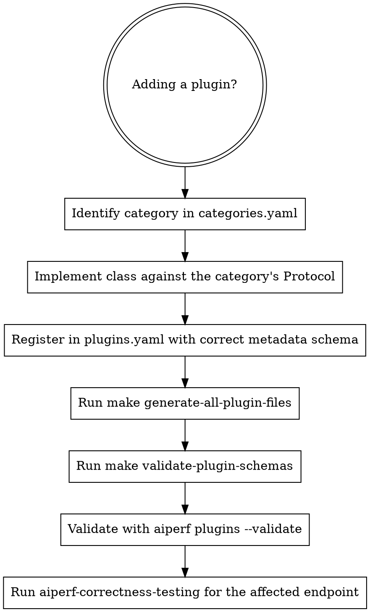

# AIPerf Add Plugin

The aiperf plugin system has ~27 categories (`api_router`, `timing_strategy`, `arrival_pattern`, `ramp`, `dataset_backing_store`, `dataset_client_store`, `dataset_sampler`, `dataset_composer`, `custom_dataset_loader`, `public_dataset_loader`, `endpoint`, `transport`, `record_processor`, `results_processor`, `accuracy_grader`, `accuracy_benchmark`, `data_exporter`, `console_exporter`, `ui`, `url_selection_strategy`, `service`, `service_manager`, `communication`, `communication_client`, `zmq_proxy`, `plot`, `gpu_telemetry_collector`). Adding a plugin in any of them is the same 4-touch ritual — and skipping any step lands silently broken on `main`.

## The 4 touches

1. **Implement the class** against the right Protocol in `src/aiperf/plugin/categories.yaml`'s `protocol:` field for the category.
2. **Register in `src/aiperf/plugin/plugins.yaml`** under the right category with `class`, `description`, and any required `metadata`.
3. **`make generate-all-plugin-files`** to regenerate `src/aiperf/plugin/enums.py`, `enums.pyi`, and the `get_class()` overloads in `plugins.py`.
4. **`make validate-plugin-schemas`** to confirm the YAML matches the schema.

Then smoke-test with `aiperf plugins --validate`.

## Decision tree



## Step 1 — Find the category

```bash
grep -nE '^[a-z_]+:' src/aiperf/plugin/categories.yaml | head -20
```

Each top-level key is a category. For each, `protocol:` names the interface your implementation must satisfy, `enum:` names the plugin-type enum (`TimingMode`, `ArrivalPattern`, `EndpointType`, etc.) your registration will extend, and `metadata_class:` (if present) names the Pydantic schema your `metadata` block must validate against.

## Step 2 — Implement the class

Place in the same package neighborhood as siblings: a new timing strategy goes under `src/aiperf/timing/strategies/`, an endpoint under `src/aiperf/endpoints/`, a dataset loader under `src/aiperf/dataset/loader/`, etc.

Conform to the Protocol literally. The plugin registry checks at startup; conformance failures bubble up as `PluginRegistrationError` only at `aiperf` invocation time.

## Step 3 — Register in `plugins.yaml`

`plugins.yaml` uses a **dict keyed by plugin name** under each category — NOT a list. `priority` is a top-level field on each entry, not nested under `metadata`.

```yaml
<category>:
  <plugin_name>:
    class: aiperf.path.to.module:YourClass
    description: Short human-readable description.
    priority: 100        # top-level; higher wins on conflict; external beats built-in at equal priority
    metadata:
      # fields validated against categories.yaml metadata_class for this category
      # category-specific Pydantic fields go here (NOT priority)
```

If you don't know the metadata shape, look at any sibling registration in the same category and the `metadata_class` referenced in `categories.yaml` (under `src/aiperf/plugin/schema/`).

## Step 4 — Regenerate artifacts

```bash
make generate-all-plugin-files
```

This regenerates:
- `src/aiperf/plugin/enums.py` — adds your plugin's name to the relevant `Type` enum.
- `src/aiperf/plugin/enums.pyi` — stub file (`grep` here if your IDE doesn't autocomplete).
- `src/aiperf/plugin/plugins.py` — adds a `get_class()` overload for the new (enum, class) pair.

Pre-commit's `generate-plugin-artifacts` hook re-runs these on every commit. Forgetting locally means pre-commit will rewrite them at commit time — which (when combined with a heredoc commit message) drops the message and forces a re-pass. Run manually first to keep commits clean.

## Step 5 — Validate schema

```bash
make validate-plugin-schemas
aiperf plugins --validate
```

`make validate-plugin-schemas` checks YAML against the JSON Schemas under `src/aiperf/plugin/schema/`. `aiperf plugins --validate` exercises the runtime registry and surfaces conformance errors.

## Step 6 — Smoke-test the plugin

If your plugin participates in a runtime path (endpoint, dataset, timing, exporter), run `aiperf-correctness-testing` with flags that exercise your code path. For example, a new endpoint type:

```bash
aiperf profile --endpoint-type <your-new-type> --model gpt-4o-mini --url http://127.0.0.1:<mock-port> --request-count 20 --random-seed 42 --tokenizer builtin
```

Check `profile_export.jsonl` for the expected records.

## Step 7 — Docs

Per CLAUDE.md's Documentation Updates table: plugin-system changes update `docs/plugins/plugin-system.md`. New CLI options exposing your plugin update `docs/cli-options.md` (auto-regenerated by `make generate-cli-docs`).

## Priority and conflict resolution

`priority` (top-level field on each plugin entry, NOT nested under `metadata`): higher number wins on conflict. External plugins (registered via entry points) beat built-in plugins at equal priority. If you intentionally override a built-in, document the priority bump in the `description` field.

## Red flags — STOP, you're rationalizing

| Thought | Reality |
|---|---|
| "I'll just edit `enums.py` directly to add my entry" | Hand-edits get overwritten by `make generate-all-plugin-files`. Edit `plugins.yaml`; regenerate. |
| "Pre-commit will regenerate the artifacts, I'll skip it locally" | When pre-commit rewrites files mid-commit, the heredoc message buffer is lost. Run `make generate-all-plugin-files` first; commit clean. |
| "I'll skip `aiperf plugins --validate`, the schema validator is enough" | Schema catches structural drift; the runtime validator catches Protocol conformance — different failure modes. Run both. |
| "I'll add a new category instead of using an existing one" | New categories require editing `categories.yaml` AND the registry code in `src/aiperf/plugin/`. Use an existing category unless the user explicitly asked for a new one. |
| "Priority doesn't matter, my plugin's name is unique" | If a future external plugin uses the same name, priority decides. Default-set a reasonable value (100 for built-in, ≥1000 for "I really mean this"). |

## Common mistakes

- **Putting the new class file outside the canonical package neighborhood** — registry import works but auto-discovery tools (linters, IDE) get confused. Match siblings.
- **`metadata` block doesn't match `metadata_class`** — `aiperf plugins --validate` fails with a Pydantic error pointing at the offending field. Check the schema under `src/aiperf/plugin/schema/`.
- **Adding to `plugins.yaml` but skipping `categories.yaml`** when the protocol needs amending — silently undefined behavior. If the category's Protocol needs a new method, that's a Protocol change, not a plugin addition.
- **Forgetting to update `docs/plugins/plugin-system.md`** when the plugin introduces a new pattern other plugins should follow.

## Composition

- **Run `aiperf-correctness-testing`** after the plugin lands to validate the runtime path.
- **Run `aiperf-add-cli`** if the plugin needs a CLI surface (e.g., a new `--<flag>` that selects your plugin variant).
- **Run `aiperf-commit`** for the staging + commit hygiene (the generate-artifacts hook is a known heredoc-reflow trigger).
