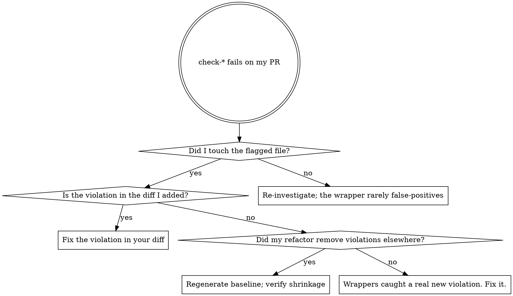

# AIPerf Baseline Bump

Two grandfathered linter wrappers gate every commit:

- `make check-ergonomics` — 9 custom AST checks (file/function/nesting size, keyword-only-args, module state, duplicate classes, pydantic-fields, stdlib-json, exception-message) via `tools/check_ergonomics.py` against `tools/ergonomics_baseline.json`.
- `make check-ruff-baselined` — 9 ruff rules (PLR0915, PLR0912, C901, TID251, BLE001, S110, S112, ANN201, D103) via `tools/ruff_baselined.py` against `tools/ruff_baseline.json`.

Both fail CI on **new** violations but grandfather existing ones via the baseline JSON. The baseline exists to allow gradual cleanup without blocking unrelated PRs.

## The rule

**Bumping the baseline is legitimate when refactoring SHRINKS the violation count. It is NOT a way to land new regressions.**

If the baseline grows on your PR, you've added violations the wrappers want to flag. Either fix them, or have a documented reason to grandfather.

## Decision tree



## Steps for a legitimate bump

### 1. Confirm the failure is real

```bash
make check-ergonomics
make check-ruff-baselined
```

Read the output carefully:
- `"ergonomics: OK (<N> total, <N> baselined, 0 new)"` — passing.
- `"ergonomics: FAIL (<N> new violations)"` — the wrapper found violations not in the baseline.

The "new" count is the actionable number.

### 2. Identify what the wrapper considers new

The failure output lists each violation by file and rule. For each:
- Is it in code I wrote in this PR? → fix the violation.
- Is it in code I touched (refactored) that previously was below threshold? → fix or split the refactor.
- Is it pre-existing and the wrapper hasn't seen it before (e.g., new file)? → fix or document why grandfather.

### 3. If grandfather is legitimate, regenerate

The Makefile provides:

```bash
make regenerate-ergonomics-baseline   # rewrites tools/ergonomics_baseline.json
make regenerate-ruff-baseline         # rewrites tools/ruff_baseline.json
```

These tools rescan the codebase and write the current violation set. Run them after the failure.

### 4. Verify the delta is shrinkage-only

```bash
git diff tools/ergonomics_baseline.json
git diff tools/ruff_baseline.json
```

For each baseline file, the diff should show entries REMOVED (your refactor fixed them) or, if new entries appear, you must justify each one:

- **Removed entries** — your refactor cleaned them up. Good.
- **Added entries** — your PR introduced new grandfathered violations. NOT good. Fix the underlying issue OR explain in the commit message why grandfather is correct (rare: e.g., a deliberate `# noqa` accompanied by a comment).

If the diff has more added entries than removed: STOP. The check is doing its job; you're trying to grandfather regressions. Fix the violations instead.

### 5. Commit the baseline change SEPARATELY (convention, not enforced)

```bash
git add tools/ergonomics_baseline.json tools/ruff_baseline.json
git commit -s -m "$(cat <<'EOF'
chore(baseline): regenerate ergonomics/ruff baselines

<one paragraph explaining what code changes drove the shrinkage>
- <file>: N violations removed (refactored to under threshold)
- ...

Co-Authored-By: Claude Opus 4.7 (1M context) <noreply@anthropic.com>
EOF
)"
```

Why separate: the baseline file is generated; mixing it with code in one commit makes review harder and reverts messier. This is hygiene preference, not a pre-commit hook — a reviewer could accept a mixed commit if the regen is clearly explained. Use `aiperf-commit` for the commit-time discipline.

## When NOT to regenerate

| Situation | Action |
|---|---|
| Failure is in a file you didn't touch | Don't regenerate — investigate. The wrapper rarely false-positives. Maybe upstream-merged main carries the violation; let upstream's PR handle it. |
| Failure is one new violation in your diff | Fix the violation. Don't grandfather single new entries. |
| Failure is many new violations in your diff | Your change is too big OR you've introduced a regression. Split the PR, or fix. |
| You hit the wrapper's threshold by adding one extra function to a file at the edge | Borderline. If your refactor's intent is to grow the file, consider splitting it. If the function is genuinely necessary, fix the underlying organization. |

## Red flags — STOP, you're rationalizing

| Thought | Reality |
|---|---|
| "I'll just regenerate to make CI pass" | The check-wrappers exist to prevent that. If the baseline grows on your PR, you're regressing. Fix the violation. |
| "It's a small new function, I'll grandfather it" | Single new violations are rarely "necessary". They're a signal the code can be smaller. Try harder. |
| "Splitting the function takes too long, just bump the baseline" | The wrapper's threshold reflects the project's ergonomics limits. The split is the work; bumping isn't a shortcut. |
| "I'll regenerate AND fix everything else later in a follow-up" | "Later" rarely happens. Fix or split now. |
| "The diff shows added entries but they're 'unrelated'" | If they're unrelated to your change, they wouldn't appear. The wrapper diffs current state vs baseline; new entries are new. |
| "Mixed-commit (code + baseline) is faster" | Faster to write, slower to review and revert. Separate commits. |

## Common mistakes

- **Regenerating without inspecting the diff** — silently grandfathers regressions you'd want to fix.
- **Committing the baseline alongside code in one commit** — review and revert become harder.
- **Re-running `make regenerate-*-baseline` on a clean tree** — produces a no-op diff but the action is suspicious in `git log`.
- **Treating `BLE001` (broad except) as a style preference** — it's structural. Fixing it usually clarifies error handling.
- **Treating `D103` (missing docstring) as a doc nicety** — required by the ergonomics review (sibling skill); leaving it grandfathered limits what `aiperf-llm-ergonomics-review` can flag.

## Composition

- `aiperf-llm-ergonomics-review` runs AFTER `check-ergonomics` and `check-ruff-baselined` pass. The ergonomics review assumes the floor is clean — bumping the baseline raises the floor, but the review's 7-axis judgment kicks in only on top of a green floor.
- `aiperf-commit` for the separate-commit step (the baseline-regen is itself a small reflow trigger when it touches `tools/ruff_baseline.json` formatting).
