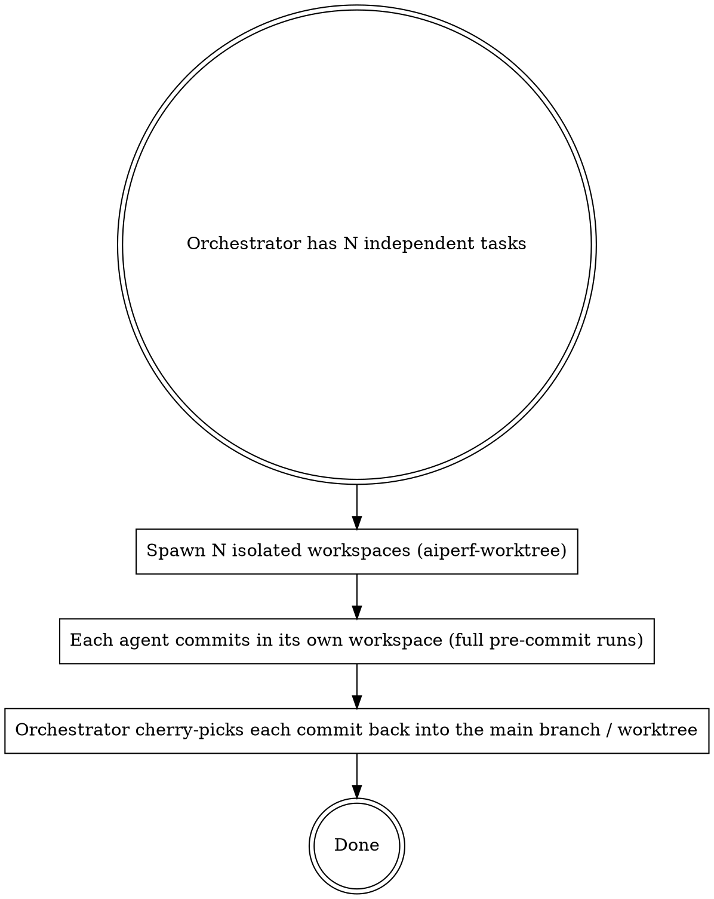
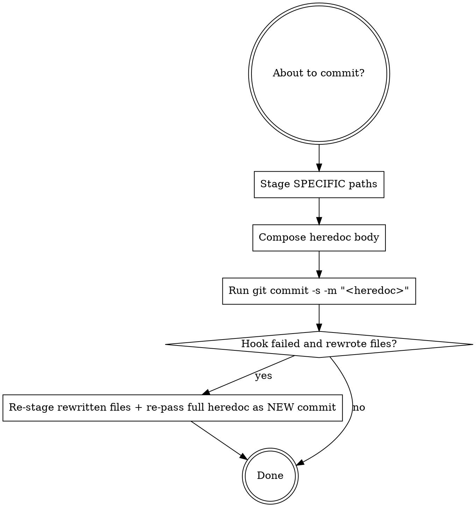

# AIPerf Commit Ritual

The commit pipeline in aiperf has one recurring failure mode that costs real work: **the heredoc commit message is lost when a hook reflows files and the commit retries.** This skill encodes the safe path through it, plus the project's other commit conventions.

For parallel work in the same repo (multiple agents committing concurrently), pre-commit's internal `git stash --include-untracked` can collide between concurrent invocations — but the right answer is NOT `--no-verify`. The right answer is **workspace isolation**: each parallel agent gets its own worktree (or temp clone — see `aiperf-worktree`), runs the full pre-commit pipeline cleanly in its isolated workspace, and the orchestrator cherry-picks the resulting commits back into the main branch / worktree.

## Hard rules

- **Always run the full pre-commit pipeline.** The Python hooks (`ruff`, `check-agent-files-sync`, `check-ergonomics`, `check-ruff-baselined`, `generate-*-docs`, `validate-plugin-schemas`, ...) catch real regressions. Do not pass `--no-verify` as a workaround for hook-stash collisions, fmt drift, or hook latency.
- **`git add <specific paths>` — never `git add -A` or `git add .`.** The wildcard variants pick up `.env`, large binaries, and accidentally generated artifacts.
- **Re-pass the full `-m` heredoc on retry — never `--amend --no-edit` after a hook reflow.** When a hook rewrites files, the commit aborts; the in-memory message buffer is dropped. Amending a previous unrelated commit, or re-committing with an empty buffer, both produce wrong messages.
- **`-s` (DCO sign-off) is required.** CI rejects unsigned commits.
- **For parallel work in the same repo, isolate workspaces.** See the section below.

## Parallel work: isolation, not `--no-verify`

When you (or an orchestrator) need multiple agents committing concurrently in the same repo:



Why this works:

- Pre-commit's internal stash operates against the worktree it runs in. Two stashes in two separate worktrees never collide.
- Each agent's commit is fully validated (hooks ran cleanly).
- Cherry-pick replays a clean, signed, validated commit into the destination — no re-validation needed (the commit was already valid when created).

Why `--no-verify` is the wrong shortcut:

- It bypasses the project's pre-commit gates (sync drift, ergonomics, plugin-schema validation, generated-doc regeneration). Bypassing them lands regressions silently.
- It's not actually faster — running hooks in an isolated workspace is the same hooks, in parallel rather than serialized.
- It accumulates technical debt: every `--no-verify` commit is a commit the next contributor has to clean up.

Compose with: `aiperf-worktree` for the isolation step; `superpowers:dispatching-parallel-agents` for the orchestration shape.

## Decision tree



## Steps

### 1. Pre-flight

```bash
git status                                   # confirm branch, untracked, staged
git diff --stat                              # what's changing
git log --oneline -5                         # local commit-message convention
git rev-parse --abbrev-ref HEAD              # commit lands HERE
```

If the branch state surprises you, surface that to the caller before continuing — switching branches mid-commit can lose work.

### 2. Stage specific paths

```bash
git add src/aiperf/some_file.py docs/cli-options.md
# NOT git add -A
# NOT git add .
# NOT git add src/   (too broad)
```

If the diff touches a file in the Four-File Sync set (`AGENTS.md`, `CLAUDE.md`, `.github/copilot-instructions.md`, `.cursor/rules/python.mdc`), stage all four together — the `check-agent-files-sync` pre-commit hook will reject otherwise.

### 3. Compose the commit message

- 1-2 sentences focused on the WHY, not the WHAT.
- "add" = new feature, "update" = enhancement, "fix" = bug fix, "refactor" = internal change.
- Use a HEREDOC for proper formatting:

```bash
git commit -s -m "$(cat <<'EOF'
fix: <one-line summary>

<short paragraph if needed — why, not what>

Co-Authored-By: Claude Opus 4.7 (1M context) <noreply@anthropic.com>
EOF
)"
```

`-s` adds the DCO sign-off line. The aiperf repo requires it; CI fails without it.

### 4. Handle hook rewrite

If pre-commit modifies files mid-commit (`ruff-format` reflows, `generate-cli-docs` regenerates, `generate-plugin-artifacts` regenerates, etc.):

```bash
git status                          # see what the hook modified
git add <the rewritten files>       # re-stage explicitly
git commit -s -m "$(cat <<'EOF'     # re-pass FULL heredoc — never --amend --no-edit
<exact same message body>
EOF
)"
```

Why: when the hook fails, the commit did NOT happen. `--amend --no-edit` would modify a previous (unrelated) commit, OR re-use git's commit buffer which has been emptied by the hook restart. Always a new commit with the full message.

If the same hook rewrites files repeatedly across retries, you've found a real problem in the staged content (e.g., an out-of-date generated file you didn't regen first). Run the relevant `make generate-*` target manually, re-stage, then retry the commit. Don't reach for `--no-verify`.

If the `test-imports` hook fails with `ModuleNotFoundError`, your venv is behind `pyproject.toml` — main added a dep your `.venv` doesn't have. Re-sync with `make first-time-setup`, or `uv pip install <missing-pkg>` for a targeted fix, then retry the commit. Always `uv pip install`, never `pip install`, and NEVER `uv sync` — `uv sync` uninstalls the editable `aiperf-mock-server` (separate package at `tests/aiperf_mock_server/`) and breaks every mock-using skill. See `aiperf-debug` "Tooling drift" for the canonical recovery.

### 5. Verify

```bash
git log --oneline -1   # confirm the commit landed with the right message
git status             # should be clean (or only deliberate untracked)
```

## Red flags — STOP, you're rationalizing

| Thought | Reality |
|---|---|
| "I'll `git add -A`, it's quick" | Adds `.env`, secrets, large generated files. Stage specific paths. |
| "I'll `--amend --no-edit` after the hook rewrote files" | The heredoc is GONE. You'll amend with an empty/wrong message. Re-pass the full message as a new commit. |
| "Parallel agents are stepping on pre-commit, I'll just `--no-verify`" | Isolate the workspaces (`aiperf-worktree` → cherry-pick back). `--no-verify` accumulates regressions; isolation runs the same hooks cleanly in parallel. |
| "The hook keeps reflowing on retry, I'll skip it" | The hook is detecting a real divergence. Run the corresponding `make generate-*` (or fix the underlying issue) manually, re-stage, retry. |
| "Same heredoc, just bump up one line, `--no-edit` is fine" | `--no-edit` re-uses the stored message buffer; after a hook restart, that buffer is empty. Always full `-m` on retry. |
| "The hook failed but I'll skip it with `--no-verify` and ship" | If the hook caught a real issue (sync drift, ergonomics violation), bypassing it lands a regression. Fix the underlying problem. |
| "Tests pass locally, I don't need to run `make check-agent-files-sync`" | The pre-commit hook will run it. If it fails, you'll hit the heredoc gotcha. Run it manually first when you touched any of the four files. |

## Common mistakes

- **`git commit -m "msg"` without `-s`** — DCO sign-off missing; CI fails on push.
- **Single-line `-m` for multi-paragraph messages** — newlines get lost. Use the heredoc form.
- **Committing four-file-sync drift on its own** without the other three files — the sync hook rejects the commit and you hit the heredoc gotcha.
- **`git commit` from inside a `cd` block in a sub-shell** — the working dir resets between shell invocations. Use absolute paths or stay in a persistent shell.
- **Reaching for `--no-verify` to "make CI pass locally"** — CI runs the same hooks. If they fail locally, they fail in CI. Fix the underlying issue.

## Special cases

- **Reverting the last commit**: `git reset --soft HEAD~1` (keeps changes staged). Don't use `--hard` without confirmation.
- **Squashing local commits**: confirm with the user first if any of the commits-to-squash have already been pushed.
- **Co-author preservation on amend**: if you must amend (explicit request), re-pass the full message including the `Co-Authored-By:` trailer.
- **Cherry-picking from an isolated workspace**: `git cherry-pick <sha>` in the destination workspace. The commit is already validated; re-running hooks here would re-validate the same content unnecessarily, but it's harmless to let them run.
