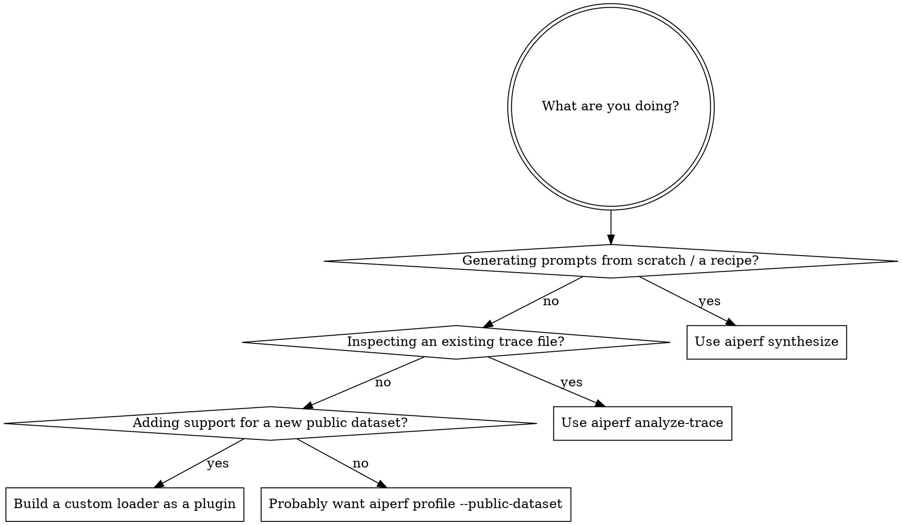

# AIPerf Dataset Synthesis & Trace Pipelines

aiperf has three distinct dataset surfaces, each with its own CLI command and its own gotchas:

| Surface | CLI | When |
|---|---|---|
| **Synthesize** | `aiperf synthesize <kind>` | Generate prompts from a known distribution (agentic-code, etc.). Outputs JSONL ready for `--input-file`. |
| **Analyze a trace** | `aiperf analyze-trace <file>` | Inspect ISL/OSL distribution, cache-hit rate, session structure of an existing trace (mooncake JSONL, ShareGPT, etc.). Read-only. |
| **Custom loader** | new plugin in `src/aiperf/dataset/loader/` | Build a new public-dataset loader (Bailian, Burst-GPT, etc.). Plugs into the `dataset` plugin category. |

## Pick the right surface



## The `--request-count N` vs `--num-conversations N` gotcha

**Read this before running ANY trace-based benchmark.**

| Flag | Semantics |
|---|---|
| `--request-count N` | Recycles the trace dataset to fill idle session slots while long traces are mid-`delay_ms`. Useful when you want to maintain N requests-in-flight regardless of trace structure. |
| `--num-conversations N` (aka `--num-sessions N`, `--conversation-num N`) | Single-pass: each conversation in the trace runs exactly once. Useful when you want trace-faithful replay. |

**Common confusion:** users say "run 1000 requests on this mooncake trace" and reach for `--request-count 1000`. If the trace has 200 conversations averaging 5 turns, `--request-count 1000` will RECYCLE conversations to maintain in-flight count. The actual unique-conversation count is still 200. `--num-conversations 1000` is what most people mean.

Always disambiguate. If unclear, ask the user "do you want recycle-to-fill, or single-pass through the trace?"

## `aiperf synthesize`

```bash
aiperf synthesize agentic-code --num-sessions N --output ./out/
# Writes a run directory under --output. Does NOT stream to stdout.
```

Flags accepted include `--num-sessions`, `--output`, `--config`, `--seed`, `--max-isl`, `--max-osl` (run `aiperf synthesize agentic-code --help` for the current set).

The output JSONL is mooncake-format-compatible: one conversation per line, each with `turns[]`, `delay_ms`, etc. It's directly consumable by `aiperf profile --input-file <file> --fixed-schedule`.

Custom synthesis recipes are NOT a plugin category today — `agentic-code` is the only built-in target, registered as a `Literal[...]` switch in `cli_commands/synthesize.py`. Adding a new recipe requires editing that file (no plugin registration needed).

The synthesis code itself lives under `src/aiperf/dataset/synthesis/` and includes:

- Radix-tree prefix analysis for shared-prefix corpora.
- Rolling-hasher for prefix dedup.
- Empirical sampler for matching a target ISL/OSL distribution.
- Synthesizer for the final assembly.

## `aiperf analyze-trace`

```bash
aiperf analyze-trace path/to/trace.jsonl
# Reports: ISL distribution, OSL distribution, KV cache-hit-rate, session-count, turns-per-session
```

For mooncake-format traces, pass `--block-size N` (the canonical flag name in `aiperf analyze-trace`, default 512) to match the inference server's KV block size — otherwise the cache-hit-rate calculation is meaningless.

Outputs a structured summary (read with the Pydantic models from `aiperf.common.models`). Useful BEFORE running a long benchmark so you know what you're about to send.

## `aiperf profile --public-dataset`

For the named public datasets that already have loaders:

```bash
aiperf profile --public-dataset sharegpt --num-conversations 50 ...
```

Check `aiperf plugins --validate` output for the list of `dataset_loader` plugins currently registered.

## Custom dataset loader (as a plugin)

The plugin categories for dataset loaders are `custom_dataset_loader` and `public_dataset_loader` (see `src/aiperf/plugin/categories.yaml`). There is no `dataset_loader` or `dataset_generator` category. Synthesis recipes (e.g. `agentic-code`) are NOT a plugin category today — they're a `Literal[...]` switch in `cli_commands/synthesize.py`. Authoring a new dataset loader follows `aiperf-add-plugin`:

1. Implement against the loader Protocol named in `categories.yaml` for the right category (`custom_dataset_loader` or `public_dataset_loader`).
2. Register in `plugins.yaml` under that category.
3. Regenerate plugin artifacts.
4. Validate via `aiperf plugins --validate`.

For the list of registered loaders, use `aiperf plugins public_dataset_loader` or `aiperf plugins custom_dataset_loader`.

Loader-specific concerns:
- **Streaming**: many public datasets are large; the loader should yield, not load all in memory.
- **Sampling**: support `--num-conversations N` by stopping after N (don't always read the whole file).
- **Schema variance**: the Protocol expects a canonical `Conversation` shape; convert per-dataset shapes to that.

## Tutorials covering each path

These tutorials under `docs/tutorials/` cover specific datasets / synthesis flows:

- `agentic-code-generator.md`
- `synthetic-dataset.md`
- `prefix-synthesis.md`
- `custom-dataset.md`
- `custom-prompt-benchmarking.md`
- `bailian-trace.md`
- `burst-gpt-trace.md`
- `aimo.md`
- `arrival-patterns.md`
- `blazedit.md`
- `embeddings.md`
- `audio.md`

When the user asks "how do I use X dataset", check whether a tutorial exists for it BEFORE re-deriving the flow.

## Red flags — STOP, you're rationalizing

| Thought | Reality |
|---|---|
| "I'll use `--request-count 1000` for trace-based replay" | That recycles. Use `--num-conversations 1000` for single-pass. Always disambiguate with the user. |
| "I'll skip `--block-size`, the default is probably fine" | Cache-hit-rate calculation depends on KV block size matching the server. Wrong default = wrong numbers. Match the server. |
| "I'll write a one-off Python script to generate prompts" | If the recipe is reusable, make it a `synthesize` plugin. One-offs accumulate as drift. |
| "I'll load the whole 50GB ShareGPT into memory" | Stream. Loader Protocol supports it; use it. |
| "I'll skip `aiperf analyze-trace` and just run the benchmark" | Without knowing ISL/OSL/cache-hit distribution, you can't interpret the latency results. Analyze first. |

## Common mistakes

- **Confusing `--num-sessions`, `--num-conversations`, `--conversation-num`** — they're aliases for the same flag. CLI shows all three; project docs typically write `--num-conversations`.
- **Hand-rolling mooncake parsing in a one-off script** — the canonical loader exists; reuse it.
- **Adding a public-dataset loader without registering as a plugin** — works mechanically but bypasses `aiperf plugins --validate` and the lazy-load discipline.
- **Forgetting `--fixed-schedule`** when replaying a trace with `delay_ms` between turns — without it, aiperf re-paces aggressively, breaking the trace's timing semantics.
- **Mis-reading `aiperf analyze-trace` output** — the ISL/OSL are token counts (tokenizer-dependent). Match the tokenizer to the model.

## Composition

- `aiperf-add-plugin` if building a new loader / synthesis recipe.
- `aiperf-correctness-testing` to smoke-test the new dataset path produces correct profile_export columns.
- `aiperf-profile-export` for analyzing benchmark output that USED the dataset.
