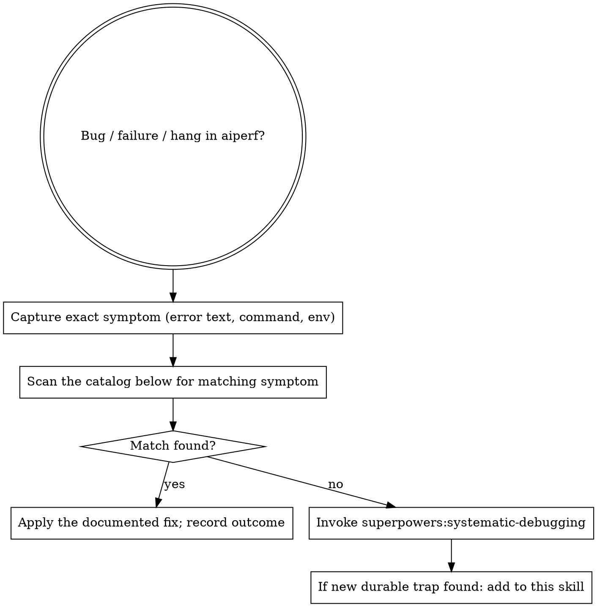

# AIPerf Debugging — Known Traps Catalog

The aiperf codebase has accumulated a recurring set of failure modes whose root causes are non-obvious and re-derivation costs hours. This skill is a *catalog*: scan for your symptom, apply the documented fix, and only fall back to systematic root-cause tracing if no match exists.

This skill does NOT replace `superpowers:systematic-debugging` — invoke that for the broader methodology. This skill codifies the *symptom → known trap* first step that's specific to aiperf.

## Decision tree

## Step 1 — Capture the symptom

Resist the urge to hypothesize. Write down, verbatim:

- The exact error text, top-level message, and most-distinctive line of any traceback. Direct quotes only — paraphrasing destroys grep targets.
- The command that triggered it (`aiperf profile --concurrency 8 ...`, `uv run pytest -n auto tests/integration/...`).
- The branch you're on.
- Environment context: in a worktree? running under `make first-time-setup`'s venv? K8s pod?

## Step 2 — Scan the catalog

The traps below are grouped by symptom family. Skim the section that matches your symptom; if anything looks close, follow its "Fix" line. Catalog entries are deliberately concise — each names the symptom, the root cause, and the canonical fix.

### Tests / pytest / xdist

**`cannot send (already closed?)` and pytest stalls at ~98% under `-n auto`.**
Two `-n auto` shells running concurrently OOM xdist workers via slow-marker corpus tests. On this branch the `slow` marker is NOT auto-deselected; you must pass `-m 'not slow' --timeout=300` to suppress the corpus and bound test runtime. Fix: `pgrep -af pytest` before launching; run one tier at a time (see `aiperf-pytest`).

**xdist `SIGABRT` under load in integration tests.**
Glibc allocator arena explosion. Fix: `MALLOC_ARENA_MAX=2` in env. **This is NOT pre-set in `tests/integration/conftest.py` on this branch — you must set it manually for every integration run.**

**`RLIMIT_AS` produces spurious `MemoryError` even at high limits.**
Address-space limits cap cffi/pydantic/native-extension virtual-memory reservations that never materialize as RSS, so a process that fits comfortably in real memory can still hit `MemoryError`. Don't cap `RLIMIT_AS` to bound memory; use an RSS watchdog or `MALLOC_ARENA_MAX=2` instead.

**`tests/unit/common/test_error_queue.py` drain tests flake under `-n auto`.**
Race in the drain assertion. Passes cleanly when run alone. Quarantine the test in a subsequent fix; for now, re-run the specific test ID without `-n auto`.

**Validator silently no-ops in tests that pass with MagicMock fixtures.**
`MagicMock` auto-creates whatever attribute path you ask for, hiding "validator reads the wrong path" bugs. At least one test for any validator must build a real Pydantic config — not a MagicMock — so the path drift surfaces.

### Pre-commit / git

**Pre-commit's internal `git stash --include-untracked` destroys peer agents' work.**
The pre-commit framework stashes the workspace during hook execution. Under concurrent dispatches in the same workspace, peer agents see their uncommitted state evaporate. Fix: isolate parallel work into separate worktrees (see `aiperf-worktree`); each agent commits cleanly in its own workspace; the orchestrator cherry-picks the resulting commits back. Do NOT reach for `--no-verify` as a workaround — see `aiperf-commit` for the canonical parallel pattern.

**Heredoc commit message lost after a pre-commit hook rewrites a file.**
When a hook rewrites files (`ruff-format`, `generate-cli-docs`, etc.), the commit aborts and the in-memory message buffer is dropped. Re-running with `--amend --no-edit` amends a previous commit with an empty message; running with `-m "..."` on a single line drops newlines. Fix: re-stage rewritten files and re-pass the FULL heredoc as a NEW commit. Never `--amend --no-edit` in this flow.

**Large merge silently auto-merges signature renames under added files.**
When merging main into a long-lived branch where the other side renamed a function's signature AND your branch added new files in the same area, git's auto-merge happily applies both — leaving callers in your new files using the OLD signature. Fix: after a large merge, audit every added file (both sides) against signature renames on the other branch.

**Agent isolation=worktree branches from `main`, not the current branch.**
Sub-agents launched with worktree isolation get a fresh `main`-based worktree. If they need branch state, they must `git reset --hard <branch-sha>` and manually copy untracked new files.

### msgspec migration

**`Encoding objects of type <ExtensibleStrEnum subclass> is unsupported`.**
AIPerf's `ExtensibleStrEnum` values (`TimingMode`, `ArrivalPattern`, etc. — see `src/aiperf/plugin/extensible_enums.py`) need msgspec encode/decode hooks at every direct `msgspec.convert` / `msgspec.encode` call-site.

**`instance lay-out conflict` on a `msgspec.Struct` with multiple `Struct` parents.**
msgspec rejects multiple `Struct` inheritance. Flatten fields and copy `@property` methods instead. Swap `model_dump`/`model_copy` for `msgspec.structs.asdict`/`replace`.

**msgspec tagged union doesn't auto-form from base+subclasses.**
Tag values are snapshotted at decoder-construction time; `tag=` rejects `ExtensibleStrEnum` directly (pass `.value`); `kw_only` doesn't propagate to subclasses. Construct unions explicitly; pass enum `.value`s.

### Networking / HTTP

**`405 Method Not Allowed` from `http://127.0.0.1:<port>` against the in-repo mock.**
A corporate `HTTP_PROXY` env routes localhost through the proxy and returns 405/502. Fix: set `NO_PROXY=127.0.0.1,localhost` in the subprocess env for aiperf and any aiohttp-based test.

### Memory / RSS

**Long-running aiperf loops with HF tokenizers, native-extension Python packages, or numpy leak RSS via glibc high-water-mark retention.**
`gc.collect()` can't bound it. Fork-per-iteration (subprocess for each unit) is the only reliable bound when running tight long loops.

### Tooling drift

**`ModuleNotFoundError: No module named '<pkg>'` when running aiperf, pytest, or pre-commit hooks (especially `test-imports`).**
The venv is behind `pyproject.toml` / `tests/aiperf_mock_server/pyproject.toml` — main added a dep that your `.venv` doesn't have yet. Two recovery paths:

1. Canonical: re-sync the whole env with `make first-time-setup`. Slow but bulletproof — it installs both the main project and `tests/aiperf_mock_server` in editable mode and refreshes every transitive dep.
2. Targeted: install just the missing package with `uv pip install <pkg>`. Faster when you know which package main added. Common recent additions that have triggered this: `crick`, `opentelemetry-sdk`, `opentelemetry-exporter-otlp-proto-http`, `python-multipart` (mock server's `/v1/images/edits` endpoint).

Always `uv pip install`, never `pip install` — `uv` ensures you target the project venv, not the system Python. **NEVER `uv sync`** — it syncs only against the main `pyproject.toml` and will uninstall the editable `aiperf-mock-server` (which lives in `tests/aiperf_mock_server/`, a separate package). After `uv sync`, `aiperf-mock-server` is gone from `$PATH` and every mock-using skill breaks. Confirm `which python` after activating the venv to make sure you're targeting `.venv/bin/python`, not the system interpreter.

**uv warns it's using a sibling `.venv` not the project's.**
Means an outer directory has a `.venv` that uv picked up. Either remove it, `cd` deeper, or set `UV_PROJECT_ENVIRONMENT` to the right path.

### Behavior misuse (not bugs, recurring confusions)

**`aiperf profile --request-count N` recycles the trace dataset to fill idle session slots.**
While long traces are mid-`delay_ms`, request-count recycles. If you want single-pass semantics over the dataset, use `--num-conversations N`.

**Individual accuracy benchmark and grader classes still `raise NotImplementedError`.**
The dispatch layer (`src/aiperf/accuracy/benchmark_loader.py::load_benchmark_problems`, `accuracy_record_processor.py`, `accuracy_results_processor.py`, and the `AccuracyDatasetLoader` plugin under `src/aiperf/dataset/loader/accuracy_dataset_loader.py`) is real and wired through the plugin registry. Of the benchmarks in `src/aiperf/accuracy/benchmarks/`, only `mmlu` is implemented today — the rest (`aime`, `aime24`, `aime25`, `bigbench`, `gpqa_diamond`, `hellaswag`, `lcb_codegeneration`, `math_500`) still raise `NotImplementedError`. Of the graders in `src/aiperf/accuracy/graders/`, only `multiple_choice` is implemented; `exact_match`, `math`, `code_execution` raise `NotImplementedError`. So a benchmark-load failure for an implemented benchmark+grader means a real bug; for an unimplemented one, the stub is the answer. Don't plumb around stubs; either implement the missing benchmark/grader or pick `mmlu` + `multiple_choice`.

## Step 3 — No match → systematic debugging

If nothing in the catalog matches, invoke `superpowers:systematic-debugging` and follow its methodology. Don't reach for a hypothesis — the catalog miss means this is unfamiliar territory.

## Step 4 — If you find a new durable trap

If your root cause is a new pattern others will hit, propose adding it as a new entry to this skill (under the appropriate symptom family). Keep entries concise: one paragraph with symptom + cause + canonical fix. The skill IS the team's durable knowledge — that's what makes the catalog work.

## Red flags — STOP, you're rationalizing

| Thought | Reality |
|---|---|
| "I'll start with a hypothesis and check from there" | Scan the catalog first. Hypothesizing wastes 20 min when the trap is documented. |
| "I'll skim a few likely files instead of scanning the catalog" | The catalog is one read. Skimming is many. |
| "Test passes alone but flakes under -n auto, must be a race" | First check the pytest section above. Known patterns. |
| "Process exit doesn't make sense, must be `sys.exit` somewhere" | Several known force-kill paths intentionally use `os._exit(1)` to bypass atexit handlers that re-hit the hang. |
| "This trap entry is wrong, I'll add my own contradictory one" | Confirm with a reproducible test case first. Don't add contradictory entries to the catalog. |

## Common mistakes

- **Grepping `src/` only.** The symptom often shows in `tests/` conftest, in `tools/`, or in `.github/workflows/`. Grep the whole tree.
- **Assuming `git log` is the source of truth for bug context.** The commit captures the diff; the root cause may live in this catalog or in `docs/`.
- **Re-deriving a fix that's already documented above.** That's the failure this skill prevents.
- **Filing a Linear issue before scanning the catalog.** Many bugs are catalog-known. Scan first; file second.
