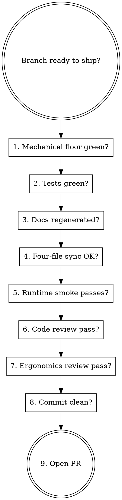

# AIPerf Finish PR

Before opening a PR, the aiperf-* skill set has a canonical order of operations. Skipping any step lands a PR that needs an immediate fix-up commit; running them out of order multiplies the rework when an earlier step's fixes invalidate a later step's evidence.

This skill is the **sequencer**. It doesn't implement any individual step — every step is its own skill — but it codifies the order and exit criteria.

## The order

This is **one defensible order**, not the only one. Each step gates on a real tool or invariant (mechanical hooks, four-file-sync, doc-regen drift, runtime smoke); the *sequence* between them is convention. If your change profile makes a different order more efficient (e.g., running code review before runtime smoke for a docs-heavy PR), reorder — but don't skip a step that's in the relevant row of the scope matrix below without recording why in the commit message.



## Steps

### 1. Mechanical floor green

```bash
make check-ergonomics
make check-ruff-baselined
ruff format --check .
ruff check .
```

All four exit 0. If any fail: invoke `aiperf-baseline-bump` (for ergonomics/ruff) or fix the formatter/lint issue directly.

**Exit criterion:** zero new violations; no baseline growth beyond shrinkage-only.

### 2. Tests green

Per tier, one invocation each (use `aiperf-pytest`):

```bash
uv run pytest -n auto tests/unit/
uv run pytest -n auto tests/component_integration/
MALLOC_ARENA_MAX=2 uv run pytest -n auto tests/integration/
```

Run only the tiers relevant to your change. If you touched any service module (under `src/aiperf/api/`, `workers/`, `timing/`, `dataset/`, `records/`, `server_metrics/`, `gpu_telemetry/`, `controller/`), integration tests are relevant; if you only touched a CLI command's docstring, unit is enough.

**Exit criterion:** every relevant tier exits 0. No skipped tests added without justification in the commit message.

### 3. Docs regenerated

Whatever your change exposes (CLI options, env vars, plugin artifacts), regenerate the docs that derive from code:

```bash
make generate-all-docs        # CLI + env-vars + (anything else generated)
make generate-all-plugin-files  # if plugin work
```

If your change is non-generative (pure source code), this is a no-op. If it is generative, the regen MUST happen before commit — pre-commit will catch it but trip the heredoc-reflow gotcha (see `aiperf-commit`).

**Exit criterion:** `git status` shows no unstaged changes to generated files after the regen.

### 4. Four-file sync OK

If your change touched any of `AGENTS.md`, `CLAUDE.md`, `.github/copilot-instructions.md`, `.cursor/rules/python.mdc`:

```bash
make check-agent-files-sync
```

All four must contain identical bodies (only headers/frontmatter differ).

**Exit criterion:** exit 0.

### 5. Runtime smoke passes

If your change touches a runtime code path (services, plugins, message bus, dataset loaders, exporters), invoke `aiperf-correctness-testing` via the `Skill` tool and wait for its output contract (`RESULT=pass|fail`, `ART_DIR=...`, `FAILED_SCENARIOS=...`). For error-path changes, also invoke `aiperf-adversarial-testing` and wait for its output contract. Skip for pure-doc / pure-test changes.

**Exit criterion:** `RESULT=pass` from each invoked runtime-testing skill, for every relevant endpoint scenario.

### 6. Code review pass

Invoke `aiperf-code-review` via the `Skill` tool. It diffs vs `origin/main`, writes a report under `artifacts/code-review-<epoch>/`, validates findings, drafts inline PR comments — but does NOT post them.

The deliverable is `artifacts/code-review-<epoch>/REPORT.md`. Address (or explicitly accept) every Confirmed-High finding before opening the PR.

**Exit criterion:** no unaddressed Confirmed-High findings.

### 7. Ergonomics review pass (optional, recommended for non-trivial changes)

Invoke `aiperf-llm-ergonomics-review` via the `Skill` tool. It only runs if the mechanical floor (step 1) is green. Skip for tiny changes (≤5 lines).

**Exit criterion:** the report exists at `artifacts/ergonomics-<epoch>/REPORT.md`; every Confirmed-High finding has an explicit accept-or-fix decision recorded (zero findings is a valid outcome).

### 8. Commit clean

If you've been amending or have a messy local history, consider squashing local commits before opening the PR (only if they haven't been pushed yet).

```bash
git log --oneline origin/main..HEAD   # what's in the PR
```

Use `aiperf-commit` for any final cleanup commits.

**Exit criterion:** `git status` clean; PR commits tell a coherent story.

### 9. Open the PR

```bash
gh pr create --title "<concise title>" --body "$(cat <<'EOF'
## Summary
- <bullet 1>
- <bullet 2>

## Test plan
- [ ] <thing tested>
- [ ] <thing tested>
EOF
)"
```

Title under 70 chars. Use the description for detail. Reference the artifact directories from steps 5/6/7 in the PR body if the reviewer would benefit. (The project's "No emojis in code or comments" rule extends to PR titles/bodies — keep them plain text.)

## Scope-based skipping

Not every change needs every step. Use this matrix:

| Change type | Steps to run |
|---|---|
| Docs-only, hand-written (`docs/**/*.md` only — no code-generated docs) | 1, 4, 8 |
| Docs-only, but touches an auto-generated doc (`docs/cli-options.md`, `docs/environment-variables.md`, plugin artifacts) | 1, 3, 4, 8 — and resolve the drift via the appropriate `aiperf-add-*` skill, not by hand-editing the generated file |
| Pure-test (`tests/**`) | 1, 2, 8 |
| Code with no docs surface | 1, 2, 5, 6, 8 |
| Code with CLI/env-var/plugin surface | 1, 2, 3, 5, 6, 8 (+ 7 if non-trivial) |
| Convention-file change (AGENTS.md etc.) | 1, 4, 8 |
| Plugin-system change | 1, 2, 3, 5, 6, 8 |
| Message-bus change | 1, 2, 5, 6, 8 (+ 7 if public-API change) |
| Refactor (no behavior change) | 1, 2, 6, 8 |

If a step is in the matrix and you skip it, the commit message MUST say why ("docs-only — skipped integration tests").

## Red flags — STOP, you're rationalizing

| Thought | Reality |
|---|---|
| "Tests pass, ship it" | Tests don't catch four-file-sync drift, docs regen drift, or stale baseline. Run the full sequence. |
| "I'll skip the code review skill, the diff is tiny" | The code-review skill validates findings against the real code; even tiny diffs hide subtle bugs. The skill is fast on small diffs. |
| "I'll regenerate docs AFTER the PR is opened" | The pre-commit hook will rewrite them mid-commit and you'll hit the heredoc gotcha during the fix-up commit. Regenerate first. |
| "Smoke test is overkill for this PR" | If the change touches a runtime path, the smoke is one minute. Skipping is risk-free only for pure-doc/pure-test changes. |
| "I'll merge in main right before opening the PR" | Fine, but use `aiperf-merge-from-main` for the merge — there are two signature-drift traps that auto-merge hides. |
| "I'll squash with `git rebase -i` interactively" | Per the global rules, `-i` flags require interactive input and aren't supported in this environment. Use `git rebase` non-interactively or `git reset --soft` + recommit. |

## Common mistakes

- **Step out of order: ergonomics review before mechanical floor.** The ergonomics axes assume the floor is clean. You'll waste effort flagging things the mechanical tools already catch.
- **Regenerating docs but forgetting to stage them.** Pre-commit will catch but trip the heredoc gotcha.
- **Running unit tests then claiming "tests green" when the change is in services.** Component-integration or integration is the relevant tier; unit alone is evidence of nothing for service-layer changes.
- **Opening the PR with un-validated reviewer-drafted comments.** The code-review skill explicitly does NOT post; you must confirm and post separately.
- **Treating "ergonomics review found nothing" as a step failure.** Clean is the expected outcome on many PRs.

## Composition

This skill composes:

- `aiperf-baseline-bump` (step 1, on failure)
- `aiperf-pytest` (step 2)
- `aiperf-add-cli` / `aiperf-add-env-var` / `aiperf-add-plugin` etc. (step 3, when generative)
- `aiperf-correctness-testing` (step 5)
- `aiperf-adversarial-testing` (step 5, for error-path changes)
- `aiperf-code-review` (step 6)
- `aiperf-llm-ergonomics-review` (step 7)
- `aiperf-commit` (step 8)
- `aiperf-merge-from-main` (if merging main first)

Also composes with `superpowers:finishing-a-development-branch` for the generic ship-options framing (PR vs merge-direct vs hold).

## Output

This skill writes no artifact of its own. The constituent skills each produce their own under `artifacts/<shortname>-<epoch>/`. The final response to the user is the PR URL + an index of artifact paths.
