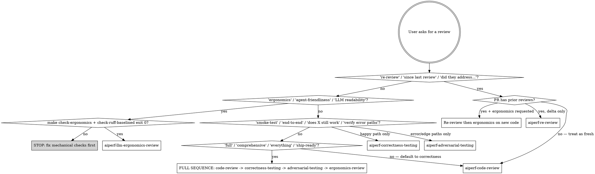

# AIPerf Review (router)

Entry point for everything labeled "review" on an aiperf branch or PR. Picks the right sub-skill(s), sequences them when more than one applies, and enforces the shared artifact-path convention. Does NOT implement review logic itself.

## Sub-skill map

### Static / analytical review

| Sub-skill | What it does | Anchored on |
|---|---|---|
| `aiperf-code-review` | Correctness review: branch vs `origin/main`, validates findings against real code, drafts inline PR comments. | `origin/main` |
| `aiperf-re-review` | Delta-since-last-review audit: classifies each prior thread as addressed / responded / ignored, flags scope creep, requires explicit baseline-review selection. | Prior review's `commit_id` |
| `aiperf-llm-ergonomics-review` | Semantic-quality review on the 7 LLM-ergonomics axes. Requires `make check-ergonomics` and `make check-ruff-baselined` green first. | `origin/main` (modified files only) |

### Runtime verification — actually executes code

| Sub-skill | What it does |
|---|---|
| `aiperf-correctness-testing` | Drives `aiperf profile` against the in-repo mock across the endpoint matrix (chat/completions/embeddings/rankings/multimodal). Asserts parquet, exit codes, error counts. Happy path. |
| `aiperf-adversarial-testing` | Drives `aiperf profile` with fault injection (error rate, slow tokens, server death, malformed inputs, conflicting flags). Asserts graceful failure — no hangs, no crashes, no silent data loss. |

### Utilities — composed by the above

| Sub-skill | Purpose |
|---|---|
| `aiperf-worktree` | Produces an isolated working copy (temp clone by default, git worktree if explicitly asked), runs `make first-time-setup`. |
| `aiperf-pr-checkout` | Composes `aiperf-worktree` + `gh pr checkout <pr>` + fetches baseline SHA. |
| `aiperf-mock-server` | Boots `aiperf-mock-server` on a free port, waits for `/health`, returns URL + PID + log path, exposes teardown. |

## Routing



## Decision rules

**Single sub-skill, common cases:**

| User phrasing | Sub-skill |
|---|---|
| "review my branch", "review this PR", "review against main", no prior reviews | `aiperf-code-review` |
| "re-review", "since my last review", "did they address my comments" | `aiperf-re-review` |
| "ergonomics review", "LLM readability review", "agent-friendliness review" | `aiperf-llm-ergonomics-review` |
| "smoke-test", "verify X still works", "end-to-end check" | `aiperf-correctness-testing` |
| "verify error paths", "make sure failures are graceful", "fuzz the CLI" | `aiperf-adversarial-testing` |
| "review for bugs", "find regressions", "validate the diff" | `aiperf-code-review` (and consider following with runtime testing skills) |

**Multi-skill sequences:**

- **"comprehensive" / "full" / "thorough" / "ship-ready" review of a fresh branch** → run in order: `aiperf-code-review` → `aiperf-correctness-testing` → `aiperf-adversarial-testing` → `aiperf-llm-ergonomics-review`. Don't interleave — finish each sub-skill's deliverable (its artifact directory) before starting the next. If any earlier step produces a hard regression, stop and surface it before continuing.
- **"re-review including ergonomics"** → `aiperf-re-review` first (the delta is the scope), then `aiperf-llm-ergonomics-review` scoped to files changed since `LAST_REVIEW_SHA` (pass the SHA range as override).
- **"re-review and re-run the smoke tests"** → `aiperf-re-review` first, then `aiperf-correctness-testing` against the PR's HEAD via `aiperf-pr-checkout`.
- **The user explicitly named sub-skills** → run in the order they listed; if ambiguous, default order: `aiperf-re-review` → `aiperf-code-review` → `aiperf-correctness-testing` → `aiperf-adversarial-testing` → `aiperf-llm-ergonomics-review`.

**Hard stops — do NOT proceed without resolving:**

- Ergonomics review requested but `make check-ergonomics` or `make check-ruff-baselined` is red → stop, report the mechanical failures, ask the user to fix first. Ergonomics axes assume the mechanical floor is clean.
- Re-review requested but the PR has no non-bot prior reviews → confirm with the user; bot-only reviews (`coderabbitai[bot]`, etc.) don't constitute a "last review."
- Re-review requested and multiple human reviewers exist → defer to `aiperf-re-review`'s ASK-if-ambiguous rule; do not pick a baseline silently.
- Runtime testing skill requested but `aiperf` binary not installed → stop, tell user to `make first-time-setup` (or delegate to `aiperf-worktree`).

## Shared artifact-path convention

Every sub-skill that writes outputs uses this layout to avoid same-day collisions:

```
artifacts/
  <shortname>-<epoch>/
    REPORT.md           # main deliverable
    meta.json           # branch, head sha, base sha, invocation timestamp, mock flags
    <scenario-or-finding-dirs>/
```

| Sub-skill | `<shortname>` |
|---|---|
| aiperf-code-review | `code-review` |
| aiperf-re-review | `re-review-<pr>` (pr number in shortname keeps multi-PR same-day audits separate) |
| aiperf-llm-ergonomics-review | `ergonomics` |
| aiperf-correctness-testing | `correctness` |
| aiperf-adversarial-testing | `adversarial` |

`<epoch>` is `$(date +%s)` (Unix epoch seconds). Get it ONCE per invocation and reuse:

```bash
EPOCH="$(date +%s)"
ART="$WORKDIR/artifacts/code-review-${EPOCH}"
mkdir -p "$ART"
```

ISO timestamps (`$(date -u +%Y%m%dT%H%M%SZ)`) are an acceptable equivalent — pick one and stay consistent within a sub-skill. The point is uniqueness across same-day re-runs and machine-parseability of the path.

If the router is sequencing multiple sub-skills, each gets its own `<shortname>-<epoch>` directory — do NOT merge them. Cross-link in the final index instead.

## How to dispatch

When you've decided which sub-skill applies, invoke it via the `Skill` tool by name (e.g. `Skill: aiperf-code-review`). Each sub-skill is fully self-contained — preflight, scope, deliverable, finish criteria.

For multi-skill sequences:

1. Announce the planned sequence up front. ("I'll run aiperf-code-review, then aiperf-correctness-testing on the same workspace, then aiperf-llm-ergonomics-review.")
2. Invoke the first sub-skill. Let it run to its own completion criteria.
3. Then invoke the next. Each sub-skill's `artifacts/<shortname>-<epoch>/` stays separate.
4. After all sub-skills finish, give the user a one-line index per artifact + any posted PR review URL.

## Common mistakes

- **Picking `aiperf-code-review` for a PR with prior reviews when the user said "re-review."** Diffing against `origin/main` loses the since-last-review framing.
- **Running ergonomics axes before mechanical checks pass.** You'll duplicate `D103`/`BLE001` findings and miss the semantic issues human judgment is for.
- **Merging artifacts from multiple sub-skills into one directory.** Keep them separate; each gets its own `<shortname>-<epoch>` subfolder.
- **Posting GitHub comments without explicit user approval.** Every sub-skill that drafts PR comments (`aiperf-code-review`, `aiperf-re-review`) requires confirmation. The router doesn't override that.
- **Skipping `make first-time-setup` on a fresh worktree.** Runtime testing sub-skills (and reproductions in `aiperf-code-review` / `aiperf-re-review`) need the editable install + mock server.
- **Hand-rolling a mock-server launch inside another sub-skill.** Use `aiperf-mock-server`; otherwise you'll reinvent port-picking, health-polling, and teardown — and miss the `NO_PROXY` gotcha.
- **Re-using the same artifact dir across runs.** Always compute `EPOCH` fresh per invocation.

## Finishing

The router writes no artifacts of its own. Final response to the user:

```
<sub-skill 1>: <artifact path>  [+ PR review URL if posted]
<sub-skill 2>: <artifact path>
<sub-skill 3>: <artifact path>
Caveats: <anything that degraded — setup failed, ergonomics axis had no in-scope files, scenario N skipped, etc.>
```
