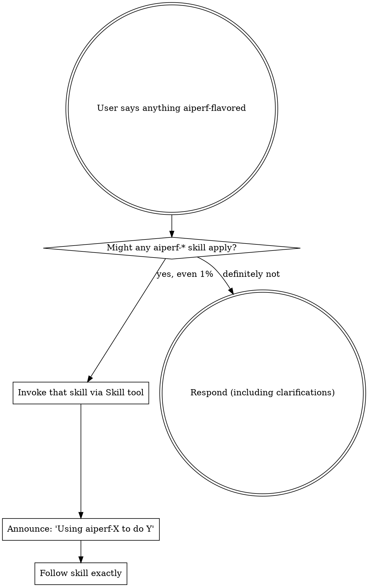

<EXTREMELY-IMPORTANT>
If you think there is even a 1% chance an `aiperf-*` skill might apply to what you are doing, you ABSOLUTELY MUST invoke that skill.

If an `aiperf-*` skill applies to your task, you do NOT have a choice. You MUST use it.

This is not negotiable. This is not optional. You cannot rationalize your way out of this.
</EXTREMELY-IMPORTANT>

# /aiperf — entry point for all aiperf work

You are working in the AIPerf repo. **Invoke the right aiperf-* skill BEFORE doing anything else** — including before clarifying questions, before reading files, before running commands.

## The rule

## Skill catalog (one-line index)

For routing details (which leaf, when, how to sequence), invoke **`aiperf-review`** — it owns the review-side decision tree and references the runtime + utility skills.

**Precedence when multiple skills could trigger:**

- Any phrasing that looks like a review request → `aiperf-review` (router) decides which leaf — do NOT pick `aiperf-code-review` directly when `aiperf-review` could route.
- A leaf skill (`aiperf-code-review`, `aiperf-correctness-testing`, etc.) is only invoked directly when the user names it or when `aiperf-review` dispatches to it.
- This skill (`aiperf`) is only invoked when intent is broad enough that no review/runtime/authoring sub-tree obviously owns the task — otherwise go straight to the relevant sub-skill.

- **Review intents** → `aiperf-review` (router) → `aiperf-code-review` / `aiperf-re-review` / `aiperf-llm-ergonomics-review`.
- **Runtime testing (executes CLI)** → `aiperf-correctness-testing` (happy path) / `aiperf-adversarial-testing` (fault injection).
- **Authoring rituals** → `aiperf-add-plugin` / `aiperf-add-service` / `aiperf-add-metric` / `aiperf-add-env-var` / `aiperf-add-cli`.
- **Daily rituals** → `aiperf-pytest` (test invocation) / `aiperf-commit` (commit hygiene) / `aiperf-debug` (symptom → known gotcha).
- **Workspace utilities** → `aiperf-worktree` / `aiperf-pr-checkout` / `aiperf-mock-server`.
- **Specialized** → `aiperf-profile-export` / `aiperf-integration-test` / `aiperf-merge-from-main`.
- **Other dev workflows (no skill, just commands)** → `make first-time-setup` / `make generate-all-docs` / `make validate-plugin-schemas` / `ruff format . && ruff check --fix .` / DGX ops in `~/.claude/workflows/aiperf-dgx/` / `linear-issue` skill for tickets.

Each leaf skill's description is its own routing trigger. If a phrase the user typed appears in a skill's description, that's your signal.

## Red flags — STOP, you're rationalizing

| Thought | Reality |
|---|---|
| "This is just a quick question" | Questions are tasks. Check for an aiperf-* skill. |
| "I'll just run pytest quickly" | `aiperf-pytest` exists. Use it. The one-liner has gotchas. |
| "I'll commit this real quick" | `aiperf-commit` exists. Heredoc reflow / parallel-agent / no-verify rules apply. |
| "I already know how to review a PR" | Knowing ≠ using. The skill encodes evidence-vs-line-proximity, baseline selection, posting flow. |
| "I'll just spin up the mock server inline" | `aiperf-mock-server` exists. The one-liner has the `NO_PROXY` / port / health-poll gotchas. |
| "I can do this without the skill" | If a skill exists for it, use it. |

## Hard stops

- **Ambiguous intent** ("can you look at aiperf?") → ask one clarifying question.
- **`aiperf: command not found`** → `make first-time-setup` (or delegate to `aiperf-worktree`). Never `uv sync` directly — `uv sync` syncs against the main project's `pyproject.toml` only, which DELETES the editable `aiperf-mock-server` install (it lives in a separate package at `tests/aiperf_mock_server/`). Use `make first-time-setup` or `uv pip install <pkg>` for targeted fixes.
- **Destructive action** (rebase, force-push, delete artifact dir, kill process) → confirm first.

## How to dispatch

When you've decided which skill applies, invoke it via the `Skill` tool by name. Each `aiperf-*` skill is fully self-contained. For multi-skill sequences (e.g. "full pre-ship pass"), invoke `aiperf-review` and let it sequence; don't re-implement routing here.

## Artifact convention

Every aiperf-* skill that writes outputs uses `artifacts/<shortname>-<epoch>/` (epoch from `$(date +%s)`, computed ONCE per invocation). Same-day re-runs get fresh dirs. Details in `aiperf-review`.
