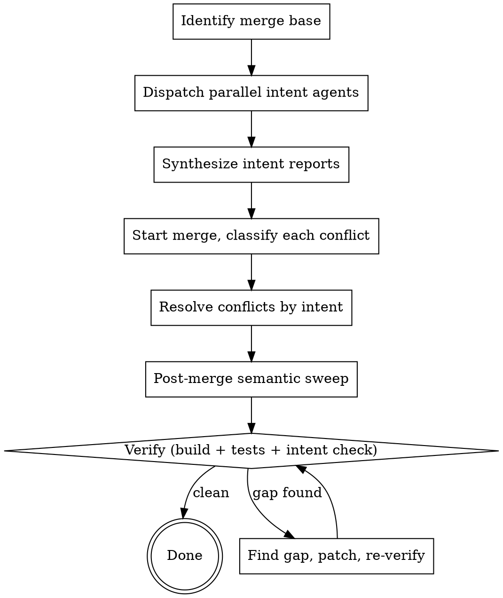

# Merging Branches by Intent

## Overview

A three-way textual merge resolves **lines**. A correct merge resolves **intent**. When branch A refactors `FooService` into `foo/` and branch B adds a new method on the old `FooService`, git will cheerfully produce a conflict-free merge that leaves branch B's new method orphaned in a file that no longer exists on the main path — or worse, it conflicts, you pick one side, and the other side's intent silently disappears.

**Core principle:** Before touching a conflict, know *why* each branch made its changes. Resolve every conflict as a synthesis of both intents, not a choice between two diffs. Then sweep the merged tree for places where one branch's intent needs to be re-applied to the other branch's new code.

This skill is methodical on purpose. Skipping steps is how bad merges happen.

## When to Use

**Use when:**
- Two branches have diverged by more than a handful of commits
- Branches overlap on the same files or systems
- One branch contains a refactor, rename, or move; the other adds/changes code in the affected area
- Merging a long-lived feature branch into `main` (or vice versa)
- A prior merge feels wrong and needs to be redone
- You can articulate what one branch did but not the other

**Do NOT use when:**
- Fast-forward merge is possible (no divergence)
- Changes are trivial, non-overlapping, and well under ~10 files per branch
- One branch is a strict subset of the other
- A pure `git rebase` with a clean history is more appropriate and the commits are small enough to review individually

## The Iron Rule

**Never resolve a conflict before you can state, in one sentence each, what both branches were trying to accomplish in that region.**

If you cannot state the intent, you are not ready to resolve. Go read more commits, more code, more PR descriptions. Guessing is how silent bugs are introduced.

## Process



### Step 1 — Identify the merge base

```bash
BASE=$(git merge-base <branchA> <branchB>)
git log --oneline "$BASE..<branchA>"   # A-side commits
git log --oneline "$BASE..<branchB>"   # B-side commits
git diff --stat "$BASE" <branchA>
git diff --stat "$BASE" <branchB>
```

Record the base commit SHA. Every subsequent diff is relative to this SHA, never to the other branch's tip.

### Step 2 — Dispatch parallel intent agents (one per branch)

**REQUIRED:** Use `superpowers:dispatching-parallel-agents`. Do this in a single message with two Agent tool calls so they run concurrently.

Each agent's job: read every commit on its branch since the merge base and produce an **intent report**, not a diff summary.

Prompt template for each intent agent:

```
You are analyzing branch <BRANCH> since merge base <BASE_SHA>.

Produce an INTENT REPORT, not a changelog. For each logical change:
  - WHAT changed (one line)
  - WHY it changed (root cause, stated goal, constraint, bug being fixed —
    look at commit messages, PR descriptions, linked issues, code comments)
  - INVARIANTS the change assumes or establishes (what must remain true)
  - BLAST RADIUS (which files/systems/APIs are affected and which are not)
  - REFACTOR FLAG: is this a rename/move/signature change that could orphan
    code on the other side? List old → new names.

Read:
  - git log --format=fuller BASE..HEAD
  - git show on any commit whose message is unclear
  - PR/issue references via gh pr view / gh issue view if available
  - Surrounding code to understand the pre-change state

If you cannot state WHY for a change, say so explicitly. Do not guess.

Return: markdown report grouped by logical change, not by commit.
```

### Step 3 — Synthesize intent

From the two intent reports, produce a **conflict risk map** before running `git merge`:

| Region / symbol | Branch A intent | Branch B intent | Risk class |
|---|---|---|---|
| e.g. `FooService` | refactored into `foo/` package | added `bulk_foo()` method | **Refactor-vs-Feature** — will orphan B's method |
| e.g. `config schema` | added field `x` | added field `y` | **Parallel extension** — safe if both added to same map |
| e.g. `retry logic` | rewrote to use backoff | changed max_retries constant | **Overlapping rewrite** — B's constant may no longer exist |

Risk classes to tag explicitly:
- **Refactor-vs-Feature** — one side moves/renames, other side adds to the old location
- **Overlapping rewrite** — both sides rewrote the same region for different reasons
- **Parallel extension** — both sides added to the same list/map/enum
- **Semantic drift** — same function name, different contract on each side
- **Cross-cutting convention** — one side changed a convention (logging, error handling, naming); the other added new code in the old style

### Step 4 — Start the merge, classify each conflict

```bash
git merge --no-commit --no-ff <branchB>   # or rebase; pick per team convention
git status                                # enumerate conflicts
```

For each conflict hunk, look it up in the risk map from Step 3. If it isn't in the map, stop and extend the map — an unclassified conflict means intent wasn't captured.

### Step 5 — Resolve by intent, not by diff

For **each** conflict, before editing, write (in a scratch file or commit message draft) one sentence:

> "Branch A wanted X here because P. Branch B wanted Y here because Q. The merged code must preserve both P and Q by doing Z."

Only then edit. Rules of thumb:

- **Parallel extension:** keep both. Order by the project's existing convention.
- **Refactor-vs-Feature:** apply the refactor, then re-apply the feature onto the refactored structure. The textual conflict is a liar — the real work is porting B's addition into A's new shape.
- **Overlapping rewrite:** pick the newer invariant, then verify the other side's *goal* is still met. Add a regression test if one doesn't already cover it.
- **Semantic drift:** stop and escalate to the humans who wrote each side. Do not guess.
- **Convention change:** adopt the new convention for all code on both sides within the affected region.

Never use `git checkout --ours` / `--theirs` on whole files for non-trivial conflicts. It is almost always the wrong answer for this class of merge.

### Step 6 — Post-merge semantic sweep (the critical step)

**This is the step most merges skip, and it is where silent bugs live.**

`git merge` only detects textual conflicts. If branch A renamed `FooService.do_thing()` to `foo.do_thing()` in a region that didn't conflict, and branch B added a *new* call site `FooService.do_thing()` in a file A never touched, the merge succeeds and the build breaks — or worse, passes because of a shadowed import.

Dispatch a **sweep agent** (or multiple in parallel, sharded by risk class). Prompt template:

```
You are auditing a just-completed merge of <branchA> into <branchB>.

Merge base: <BASE_SHA>
Intent reports: <paste or reference paths>
Risk map: <paste or reference>

For EACH refactor flagged in the intent reports (old → new names,
moved files, changed signatures, changed conventions), grep the ENTIRE
merged tree for remaining references to the OLD form. For each match,
determine whether:
  (a) it is legitimately unchanged (e.g. in a comment/docstring intentionally
      referencing history), or
  (b) it is code that branch B added which must be ported to the new form.

For EACH new feature/API added on either branch, verify that cross-cutting
concerns introduced on the OTHER branch (logging, error handling, metrics,
auth, config registration, docs index) have been applied to it.

For EACH config/enum/registry that both branches extended, verify both
extensions are present.

Return: a list of concrete gaps with file:line and the required fix. Do
NOT fix them yourself. Report only.
```

Apply the reported fixes one by one, re-running the sweep after significant changes.

### Step 7 — Verify

**REQUIRED:** Use `superpowers:verification-before-completion`.

- Build passes
- Full test suite passes (not just the files you touched)
- Run any smoke/integration workflow that exercises code from **both** branches' intents
- Re-read the intent reports and confirm every "WHY" is still satisfied by the merged tree — this is the intent check, and it's non-optional

Only then commit the merge.

## Quick Reference

| Situation | Action |
|---|---|
| Merge base unclear | `git merge-base A B` — record the SHA, anchor everything to it |
| Conflict in refactored file | Apply refactor, then re-port the other side's feature onto new shape |
| Both branches added to a list/enum | Keep both; preserve project ordering convention |
| Both branches rewrote same function | Synthesize; verify both stated goals still hold; add regression test |
| No conflict but suspicious area | Sweep agent grep for old names/signatures from refactor flag |
| Can't state WHY for a change | STOP. Read more history. Do not resolve. |
| Semantic drift between sides | Escalate to humans who wrote each side |

## Common Mistakes

| Mistake | Why it's wrong | Fix |
|---|---|---|
| Resolving conflicts in editor order | Intent is lost; you'll choose by whichever diff is prettier | Build risk map first; resolve in risk-class order |
| `git checkout --theirs` on whole files | Silently discards one side's intent | Resolve per hunk against the intent report |
| Trusting "no conflict" to mean "safe" | Refactor-vs-feature across non-overlapping files merges cleanly and breaks semantically | Run the Step 6 sweep — always |
| Skipping the intent report | You'll rediscover the WHY three times during conflict resolution | 20 min reading now saves hours later |
| One mega-agent doing everything | Context blows up; reasoning degrades | Parallel agents per branch; sharded sweep agents |
| Running full test suite only at the end | Errors compound; bisecting the merge is painful | Build + unit tests after conflicts, full suite after sweep |
| "I'll just eyeball the diff" on a long-lived branch | Human attention degrades after ~20 hunks | Agents for analysis; you for judgment on synthesis |

## Red Flags — STOP

- You're about to resolve a conflict and you cannot say *why* either side wrote what they wrote
- The merge produced zero conflicts on a >100-commit divergence — it's lying, sweep anyway
- A sweep agent reports "no gaps" but you haven't listed any refactor flags — the flags are missing, not the gaps
- You're tempted to "just take main" or "just take the feature branch" for a whole file with real changes on both sides
- Tests pass but a feature from one branch visibly doesn't exercise the new convention from the other branch

All of these mean: back up, re-read intents, do the sweep.

## Rationalizations Table

| Excuse | Reality |
|---|---|
| "It's just a small merge" | Small merges hide refactor-vs-feature gaps too; the sweep is cheap |
| "Tests pass, we're fine" | Tests pass = no detected regressions. New code paths aren't covered. |
| "I wrote both branches, I know the intent" | Write it down anyway. Your future self in hour 3 of conflicts won't remember. |
| "Git says no conflicts" | Git sees text, not meaning. Refactor-vs-feature is invisible to git. |
| "The other branch is tiny, I'll just eyeball it" | The tiny branch is often the one with the orphaned feature |
| "I'll sweep later if something breaks" | Silent breakage ships. Sweep before verifying. |
| "Escalating is slow" | Wrong merges are slower — measured in incidents |
