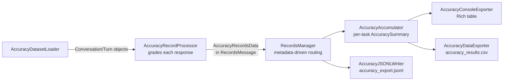

# Accuracy Benchmarking

Run accuracy evaluation alongside performance profiling using the `--accuracy-benchmark` flag.

## Quick Start

```bash
# MMLU benchmark with 5-shot prompting (chat endpoint, aligned with lighteval)
aiperf profile Qwen/Qwen2.5-1.5B-Instruct \
  --url http://localhost:8000 \
  --endpoint-type chat \
  --accuracy-benchmark mmlu \
  --accuracy-n-shots 5 \
  --num-requests 15000 \
  --concurrency 10 \
  --extra-inputs '{"temperature": 0, "stop": ["\n"]}'
```

```bash
# AIME competition math — defaults match the trt-llm benchmark recipe
# (8-shot, chain-of-thought on, sympy-backed math grader)
aiperf profile Qwen/Qwen2.5-7B-Instruct \
  --url http://localhost:8000 \
  --endpoint-type chat \
  --accuracy-benchmark aime \
  --num-requests 30 \
  --concurrency 10 \
  --extra-inputs '{"temperature": 0}'
```

## trt-llm reference alignment

The `aime` benchmark is aligned with the trt-llm benchmark recipe's
DeepEval-backed AIME path
(`trt-llm-benchmark-recipe/src/accuracy/aime/`):

- **Dataset:** `Maxwell-Jia/AIME_2024`, train split.
- **Defaults:** `n_shots=8`, `enable_cot=True` (the recipe enforces
  `n_shots <= 8` and aiperf raises `ValueError` if you exceed it).
- **Prompt format:** byte-equal to `AIMETemplate.generate_output` —
  `**Problem**: ... **Solution**: ... **Answer**: ...` blocks for
  few-shots (Solution only when CoT is on), trailing
  `Let's think step-by-step.` after the final `**Answer**:`.
- **System prompt (auto-injected):**
  `"Please reason step by step, and put your final answer within \\boxed{}."`
  This default lives in `plugins.yaml` under the `aime` benchmark's
  `default_system_prompt` metadata. Override it with
  `--accuracy-system-prompt 'your prompt here'`. Pass `--accuracy-system-prompt ''`
  to disable injection.
- **Grader:** `MathGrader` with `_math_strip.strip_string` + sympy/
  latex2sympy2-extended `math_equal`. Requires the `[accuracy]` extra:
  `uv pip install 'aiperf[accuracy]'`. Without those packages installed
  the grader falls back to a stdlib normalize+Fraction comparison and
  emits a one-time warning; reference parity is only achieved with the
  full sympy stack.

### Per-benchmark default system prompts

| Benchmark | `default_system_prompt` |
|---|---|
| `aime` | `Please reason step by step, and put your final answer within \boxed{}.` |
| `bfcl_ast` | _per-problem — built from that problem's tool schemas; `--accuracy-system-prompt` is **rejected** (see [BFCL](#bfcl-tool-call-correctness-bfcl_ast))_ |
| (others) | _none — pass via `--accuracy-system-prompt` if desired_ |

For benchmarks that accept an override, the CLI's `--accuracy-system-prompt`
flag wins; the per-benchmark default is only consulted when the flag is unset.
An empty-string default in metadata is treated as no default (aiperf doesn't
inject a zero-length system message).

`bfcl_ast` is the exception: it **rejects** the flag rather than honouring it,
because its system prompt is built per problem from that problem's tool
schemas and a global override would strip the tool definitions the model is
being asked to call.

## Available Benchmarks

| Benchmark | Default grader | Default n-shots | Source |
|---|---|---|---|
| `mmlu` | `multiple_choice` | 5 | `lighteval/mmlu` (57 subjects; non-CoT parity, `--accuracy-enable-cot` for reasoning models) |
| `mmlu_pro` | `mmlu_pro` | 5 | `TIGER-Lab/MMLU-Pro` (14 categories, up to 10 options A-J, CoT-native) |
| `aime` | `math` | 8 | `Maxwell-Jia/AIME_2024` (trt-llm reference, 8-shot CoT) |
| `hellaswag` | `exact_match` | 10 | `Rowan/hellaswag` (trt-llm/DeepEval reference; one few-shot per unique activity_label) |
| `bigbench` | `exact_match` | 3 | `lukaemon/bbh` (trt-llm/DeepEval reference; 27 subtasks, canonical CoT/non-CoT prompt files) |
| `aime24` | `lighteval_expr` | 0 | `HuggingFaceH4/aime_2024` (trt-llm/lighteval reference, bare problem text, `expr_gold_metric`) |
| `aime25` | `lighteval_expr` | 0 | `yentinglin/aime_2025` (trt-llm/lighteval reference, bare problem text, `expr_gold_metric`) |
| `math_500` | `lighteval_latex` | 0 | `HuggingFaceH4/MATH-500` (trt-llm/lighteval reference, gold is full solution containing `\boxed{answer}`, `latex_gold_metric`) |
| `gpqa_diamond` | `lighteval_gpqa` | 0 | `Idavidrein/gpqa` subset `gpqa_diamond` (trt-llm/lighteval reference, simple-evals template with SHA-256-seeded deterministic A/B/C/D shuffling, `gpqa_metric`) |
| `lcb_codegeneration` | `code_execution` | 0 | `livecodebench/code_generation_lite` (trt-llm/lighteval reference; LCB test-case payload serialized into `BenchmarkProblem.ground_truth` as an orjson blob; `code_execution` grader runs the generated code against the bundled test cases via lighteval's `codegen_metrics`) |
| `gsm8k` | `lighteval_gsm8k` | 0 | `gsm8k` subset `main` (trt-llm/lighteval reference, `gsm8k_leaderboard` config; prompt `"Question: {question}\nAnswer:"`, gold is the raw answer ending in `#### <number>`, `quasi_exact_match_gsm8k`) |
| `bfcl_ast` | `tool_call_ast` | 0 | Berkeley Function Calling Leaderboard, **Prompt mode** — question files and `possible_answer` ground truth read from the installed `bfcl-eval` wheel; single-turn AST categories + Java/JavaScript + hallucination measurement, graded by bfcl-eval's `ast_checker`. Requires the `[bfcl]` extra. See [BFCL tool-call correctness](#bfcl-tool-call-correctness-bfcl_ast) |

### LiveCodeBench (lcb_codegeneration) version pinning

LiveCodeBench publishes monthly snapshots of `livecodebench/code_generation_lite`
as HuggingFace **configs** (e.g. `v4_v5`, `v6`, …). The loader pins a
specific subset so accuracy numbers are reproducible across runs and
branches; the default is `v4_v5` (the same subset lighteval's reference
LCB task treats as its base). Override at runtime via:

```bash
export AIPERF_ACCURACY_LCB_RELEASE_TAG=v6   # or any published subset
```

The env var is read at every `load_problems` call (no module-reload needed)
and is passed as the positional `name` arg to
`load_dataset("livecodebench/code_generation_lite", name, split="test", trust_remote_code=True)` —
the standard HF config-name selector, matching lighteval's `hf_subset=`
usage. `trust_remote_code=True` is required because LCB still ships a
repository loading script; `datasets<4` runs it normally. Nothing is
bundled with the aiperf wheel — all subsets are fetched on-demand and
cached under `~/.cache/huggingface/datasets/`.

**Compatibility:** `livecodebench/code_generation_lite` requires
`datasets<4`. `datasets>=4` dropped support for repository loading scripts
entirely, and the loader surfaces a clear error when it detects this:

```text
lcb_codegeneration: cannot load 'livecodebench/code_generation_lite'
on `datasets>=4` — LCB still ships a repository loading script that
`datasets>=4` no longer executes. Pin to an earlier release:
`uv pip install 'datasets<4'`.
```

If a future LCB release renames or removes the pinned subset, the loader
raises `RuntimeError` prefixed `lcb_codegeneration: failed to load …`;
recover by bumping the env var:

```bash
export AIPERF_ACCURACY_LCB_RELEASE_TAG=v6   # or whatever LCB now ships
```

## BFCL tool-call correctness (`bfcl_ast`)

Every other accuracy benchmark grades a natural-language answer channel, so a
deployment whose tool-call parser is broken can fail every call in production
and still score 100%. `bfcl_ast` closes that gap: it runs the
[Berkeley Function Calling Leaderboard](https://gorilla.cs.berkeley.edu/leaderboard.html)
single-turn suite and grades each response with bfcl-eval's deterministic AST
checker — while the server is under whatever load the run applies.

### Install

```bash
uv pip install 'aiperf[bfcl]'
```

> **The `[bfcl]` and `[accuracy]` extras cannot be installed together.**
> `bfcl-eval` pins `numpy==1.26.4` while lighteval (`[accuracy]`) requires
> `numpy>=2`. This is declared as a uv conflict, so each extra resolves on its
> own; no benchmark needs graders from both. Install `[bfcl]` in the
> environment you run BFCL from.

### Quick start

```bash
aiperf profile \
  -m gpt-oss-120b \
  --url http://localhost:8000 \
  --endpoint-type chat \
  --accuracy-benchmark bfcl_ast \
  --accuracy-tasks simple_python,multiple,parallel,irrelevance \
  --extra-inputs '{"temperature": 0}' \
  --concurrency 32
```

Run with `temperature=0`. BFCL AST is the most reproducible of the widely used
tool-calling benchmarks, but sampling variance would otherwise sit on top of
the signal you are trying to read.

### Categories

`--accuracy-tasks` takes BFCL category names. Omitting it evaluates the
non-live set (1,390 problems).

| Category | Count | In default set | What it measures |
|---|---|---|---|
| `simple_python` | 400 | yes | One function offered, one call expected |
| `simple_java` | 100 | yes | Same, Java syntax (tree-sitter parsed) |
| `simple_javascript` | 50 | yes | Same, JavaScript syntax |
| `multiple` | 200 | yes | Several functions offered, one is correct |
| `parallel` | 200 | yes | One function, several calls — compared **order-independently** |
| `parallel_multiple` | 200 | yes | Several functions, several calls |
| `irrelevance` | 240 | yes | Hallucination measurement: no offered function fits, so the correct answer is **no call** |
| `live_simple`, `live_multiple`, `live_parallel`, `live_parallel_multiple`, `live_irrelevance`, `live_relevance` | — | no (opt-in) | The same checks over user-contributed real-world schemas |

Deliberately **not** supported, each rejected with the reason rather than an
"unknown task" error:

| Family | Why not |
|---|---|
| `exec_*` | Requires executing generated code against live external APIs (at least four API keys). AIPerf has no execution sandbox on the accuracy path. |
| `multi_turn_*` | Graded by comparing backend *system state* across turns. AIPerf's grader is stateless and per-record. |
| `web_search_*`, `memory_*` | Need live web search (SerpAPI), persistent memory and multi-run trajectories. |
| `format_sensitivity` | A non-scoring category upstream — it varies the prompt template rather than measuring correctness. |

### Reading the results

`task` is the BFCL category, so the existing per-task console table and
`accuracy_results.csv` give a per-category breakdown for free:

```text
Accuracy (Overall)                 71.2%
Accuracy (simple_python)           88.0%   Unparsed  2.5%
Accuracy (multiple)                74.5%   Unparsed  4.0%
Accuracy (parallel)                52.0%   Unparsed 11.5%
Accuracy (irrelevance)             68.0%   Unparsed  0.0%
```

**Accuracy and `Unparsed` are two different failure modes, and the split is
the point.** `Unparsed` counts responses from which no call list could be
extracted at all — the model did not follow the required output format.
Accuracy counts, among the responses that were gradeable, how many gave the
right answer. A decoded-but-wrong call is scored incorrect and **not**
unparsed.

"The right answer" is category-dependent. For the AST categories it means the
right call: correct function name, parameters and values. For the
hallucination categories (`irrelevance`, `live_irrelevance`) the right answer
is **no call at all**, so a prose refusal is scored *correct* — and
`live_relevance` inverts that again, where emitting a call is correct. Only an
empty answer channel is treated as unparsed there, since silence is not an
abstention.

Every graded record in `accuracy_export.jsonl` carries a normalized failure
bucket at the front of its `explanation`, so a run can be triaged without
extra tooling:

| Bucket | Meaning |
|---|---|
| `correct` | Verdict passed |
| `wrong_tool` | Wrong function name, or the wrong number of calls |
| `param_type_error` | Right tool, wrong argument type (e.g. `"5"` for an integer) |
| `param_value_error` | Right tool and types, wrong/missing argument value |
| `should_not_have_called` | Emitted a call on an `irrelevance` question |
| `should_have_called` | Emitted no call on a `live_relevance` question |
| `unparsed` | No call list could be extracted. On the hallucination categories only an *empty* answer channel counts — a prose refusal is a valid answer there, whereas silence is not an abstention |
| `unclassified` | An `error_type` this bfcl-eval version added that AIPerf does not yet bucket |

Parameter mismatches (right tool, wrong arguments) dominate tool-calling
failures at scale, so `param_*` vs `wrong_tool` is usually the split worth
acting on:

```bash
jq -r '.explanation | split(":")[0]' artifacts/*/accuracy_export.jsonl | sort | uniq -c | sort -rn
```

### Version pinning

BFCL ships its dataset **and** its AST checker in the same wheel, so the
package version determines both which questions are asked and how answers are
scored. Two runs on different versions are not comparable, and the drift would
otherwise be silent, so the loader hard-checks it:

```bash
export AIPERF_ACCURACY_BFCL_VERSION_PIN=2026.3.23   # default
export AIPERF_ACCURACY_BFCL_VERSION_PIN=2025.12.17  # strict BFCL v4 leaderboard parity
export AIPERF_ACCURACY_BFCL_VERSION_PIN=any         # skip the check (no version guarantee)
```

A mismatch fails in preflight — before any service starts — naming both
versions and the `uv pip install` command that reconciles them.

### What these numbers do and do not tell you

- **Report per-category numbers, not a single "BFCL score".** The public
  leaderboard averages language subcategories *unweighted* despite very
  different sample sizes (`simple_python` 400 vs `simple_javascript` 50), so a
  single aggregate is not comparable to it and hides which category regressed.
  AIPerf reports per-category natively; the `Accuracy (Overall)` row is a
  micro-average over whatever categories the run included.
- **Prompt-mode scores are not a model's native function-calling score.** In
  Prompt mode the tool schemas go in the system prompt and the model answers
  in text, using BFCL's Python-style call format. A model trained against a
  different tool-calling template can score far below its native
  function-calling ability — MCPVerse reports Claude-4-Sonnet dropping from
  62.36 to 15.10 between the two modes. Treat `bfcl_ast` as a
  model-selection and serving-reliability signal, not as a capability ceiling
  and not as a production gate.
- **`--accuracy-system-prompt` is rejected for this benchmark.** BFCL builds
  the system prompt per problem from that problem's tool schemas; a global
  override would replace it, stripping the tool definitions the model is being
  asked to call.
- Array element types are checked only one level deep, matching the official
  checker. This is upstream's deliberate simplification, mirrored rather than
  "fixed", so verdicts stay comparable.

## MMLU chain-of-thought and reasoning models

The `mmlu` benchmark has two prompting modes, selected by
`--accuracy-enable-cot`:

- **Non-CoT (default) — lighteval parity.** The prompt ends in a bare
  `Answer:` trailer and the generation budget is `generation_size=5`
  (mapped to the turn's `max_tokens`), with the `["\n"]` stop sequence.
  This is byte-identical to lighteval's reference MMLU path: the server is
  expected to emit a single answer letter immediately. Use this for
  non-reasoning instruct models where you want reference-comparable scores.

- **CoT — `--accuracy-enable-cot`.** The instruction is extended with
  `Think step by step and then output the answer in the format of "The
  answer is (X)" at the end.`, the query gets a `Let's think step by step.`
  primer, and the generation budget is raised to the full
  `generation_size=4000` so the model has room for a reasoning trace before
  the final `The answer is (X)` line. The `multiple_choice` grader parses
  the trailing letter.

  ```bash
  aiperf profile my-model --url http://localhost:8000 \
    --endpoint-type chat \
    --accuracy-benchmark mmlu \
    --accuracy-enable-cot \
    --num-requests 15000 \
    --concurrency 10 \
    --extra-inputs '{"temperature": 0}'
  ```

For reasoning models whose traces are long enough to exhaust the 4000-token
budget before reaching the answer line, raise the budget with
`--extra-inputs '{"max_completion_tokens": 16000}'`. The `--extra-inputs`
value overrides the benchmark's `generation_size` (which is what the
benchmark maps into the turn `max_tokens`), so the model can finish its
reasoning:

```bash
aiperf profile my-model --url http://localhost:8000 \
  --endpoint-type chat \
  --accuracy-benchmark mmlu \
  --accuracy-enable-cot \
  --num-requests 15000 \
  --concurrency 10 \
  --extra-inputs '{"temperature": 0, "max_completion_tokens": 16000}'
```

### Troubleshooting: 0% / all-unparsed against a reasoning model

An MMLU run that scores near 0% with (almost) every response flagged
`unparsed` against a **reasoning** model is expected in **non-CoT** mode.
The non-CoT prompt asks for a single answer letter under a 5-token budget,
but a reasoning model emits chain-of-thought that never reaches (or is
truncated before) a parseable letter, so extraction falls through every
tier. This is not a grader bug. Fix it by giving the model room to reason:

- add `--accuracy-enable-cot` (MMLU's CoT mode, full 4000-token budget), or
- switch to the CoT-native `mmlu_pro` benchmark (below).

## MMLU-Pro

The `mmlu_pro` benchmark ports TIGER-AI-Lab's MMLU-Pro
(`evaluate_from_api.py`) at parity:

- **Dataset:** `TIGER-Lab/MMLU-Pro`. Test split provides the graded
  questions; the validation split provides the per-category CoT few-shots.
- **Categories (14):** `biology`, `business`, `chemistry`,
  `computer science`, `economics`, `engineering`, `health`, `history`,
  `law`, `math`, `philosophy`, `physics`, `psychology`, `other`. Restrict
  with `--accuracy-tasks` (e.g. `--accuracy-tasks math,physics`); omit for
  all 14.
- **Options:** up to 10 per question, labeled `A`-`J` (`N/A` placeholder
  options are filtered out before lettering).
- **Defaults:** `default_n_shots: 5`, `default_enable_cot: true`,
  `default_grader: mmlu_pro`. MMLU-Pro is **CoT-native** — the per-category
  instruction always requests the `"The answer is (X)"` format and the
  generation budget is `generation_size=4000`.
- **Grader (`mmlu_pro`):** extracts the final `A`-`J` letter via the
  upstream 3-tier cascade — `answer is (X)` -> `Answer: X` -> the last lone
  in-range letter. A response parsed by a fallback tier (or not at all) is
  flagged `unparsed`. No optional dependencies are required.

Because MMLU-Pro defaults to CoT, it works with reasoning models out of the
box; as with MMLU CoT, raise the budget via
`--extra-inputs '{"max_completion_tokens": 16000}'` if long reasoning
traces get truncated before the answer line.

A **non-CoT** variant is available via `--accuracy-no-enable-cot`, which
switches the few-shots and the query to a bare `Answer:` trailer. This is an
AIPerf extension for quick low-latency runs and is **not** part of upstream
MMLU-Pro parity — use the default CoT mode for reference-comparable scores.

```bash
aiperf profile --model <model> --url <url>/v1 --endpoint-type chat --streaming \
  --tokenizer <model> --accuracy-benchmark mmlu_pro --num-requests 200 --concurrency 10 \
  --extra-inputs '{"temperature": 0}'
```

## CLI Flags

| Flag | Description | Default |
|------|-------------|---------|
| `--accuracy-benchmark` | Benchmark name (`mmlu`, `aime`, `hellaswag`, `bfcl_ast`, ...) | — |
| `--accuracy-tasks` | Specific subtasks (e.g., MMLU subjects). Accepts comma-separated values (`abstract_algebra,anatomy`) or repeated flags. Omit for all. | all |
| `--accuracy-n-shots` | Few-shot example count (0–32). `None` uses the benchmark default (e.g. MMLU=5). | benchmark default |
| `--accuracy-enable-cot` | Enable chain-of-thought prompting | false |
| `--accuracy-grader` | Override default grader (`multiple_choice`, `exact_match`, ...) | auto |
| `--accuracy-system-prompt` | Custom system prompt. Rejected by `bfcl_ast`, which builds a per-problem system prompt from each problem's tool schemas. | — |
| `--accuracy-verbose` | Show per-problem grading details | false |

## Endpoint Type: `completions` vs `chat`

Both endpoint types are supported. The choice affects prompt format and alignment with reference frameworks:

| Endpoint | Prompt format | Best for |
|----------|--------------|----------|
| `completions` | Single flat text to `/v1/completions` | Traditional MMLU evaluation |
| `chat` | Multi-turn user/assistant messages to `/v1/chat/completions` | Aligning with lighteval |

When `--endpoint-type chat` is used, MMLU few-shot examples are structured as separate user/assistant message turns (matching lighteval's `PromptManager._prepare_chat_template()`). The `completions` endpoint sends the entire prompt as a single text block.

**Temperature:** Must be explicitly set to `0` via `--extra-inputs '{"temperature": 0}'` for deterministic (greedy) decoding. Most LLM servers default to `temperature=1.0` when not specified, which introduces random sampling and causes run-to-run variance. lighteval defaults to `temperature=0` internally.

**Stop sequence:** Use `--extra-inputs '{"stop": ["\n"]}'` to match lighteval's MMLU behavior (stop at first newline). Can be combined with temperature: `--extra-inputs '{"temperature": 0, "stop": ["\n"]}'`.

**Concurrency:** Higher concurrency is faster. `--concurrency 10` or above is recommended. Minor run-to-run variance (~0.2% macro) is expected due to GPU floating-point non-determinism; this is independent of concurrency level.

**num-requests:** Set to at least the total number of benchmark problems (MMLU: 14,042 across 57 subjects).

## Examples

```bash
# Single subject, quick test
aiperf profile my-model --url http://localhost:8000 \
  --endpoint-type chat \
  --accuracy-benchmark mmlu \
  --accuracy-n-shots 5 \
  --accuracy-tasks abstract_algebra \
  --num-requests 100 \
  --concurrency 10 \
  --extra-inputs '{"temperature": 0, "stop": ["\n"]}'

# Full MMLU (57 subjects, 14042 problems)
aiperf profile my-model --url http://localhost:8000 \
  --endpoint-type chat \
  --accuracy-benchmark mmlu \
  --accuracy-n-shots 5 \
  --num-requests 15000 \
  --concurrency 50 \
  --extra-inputs '{"temperature": 0, "stop": ["\n"]}'

# Completions endpoint (traditional flat-text format)
aiperf profile my-model --url http://localhost:8000 \
  --endpoint-type completions \
  --accuracy-benchmark mmlu \
  --accuracy-n-shots 5 \
  --num-requests 15000 \
  --concurrency 50 \
  --extra-inputs '{"temperature": 0, "stop": ["\n"]}'

# AIME with explicit math grader and few-shot priming
aiperf profile my-model --url http://localhost:8000 \
  --endpoint-type chat \
  --accuracy-benchmark aime \
  --accuracy-grader math \
  --accuracy-n-shots 4 \
  --num-requests 30 \
  --concurrency 10 \
  --extra-inputs '{"temperature": 0}'
```

## Graders

| Grader | Selection rule | Coverage |
|---|---|---|
| `multiple_choice` | A/B/C/D match against gold letter (lighteval `ExactMatches`). Under `--accuracy-enable-cot` the model emits a reasoning trace ending in `The answer is (X)`. | MMLU |
| `mmlu_pro` | Extract the final `A`-`J` letter via the upstream 3-tier cascade: `answer is (X)` → `Answer: X` → last lone in-range letter. Fallback-tier or no-match responses are flagged `unparsed`. No optional dependencies. | MMLU-Pro |
| `math` | Extract last `\boxed{...}`, fall back to "answer is X" / last number. Apply trt-llm `strip_string` normalization, then compare via `math_equal` (lowercase string → numeric `isclose` → symbolic equivalence via sympy + latex2sympy2-extended). | AIME |
| `exact_match` | Strict `pred.strip() == gold.strip()` — case-sensitive, no normalization (mirrors DeepEval `Scorer.exact_match_score`). Empty/whitespace-only response scores 0 and is flagged `unparsed`. | HellaSwag, BigBench-Hard |
| `code_execution` | pass@1 by executing the model's generated code against the benchmark's bundled public + private test cases via lighteval's `codegen_metrics` (sandboxed `ProcessPoolExecutor`, 6s per-test timeout). Extracts the code block with lighteval's `extract_code`; `correct` when pass@1 == 1.0, `unparsed` when no code block was extractable. Requires the `[accuracy]` extra (lighteval). | LiveCodeBench (`lcb_codegeneration`) |
| `lighteval_expr` | Sympy-backed expression extraction and symbolic equivalence (lighteval `expr_gold_metric`): pulls the model's final expression and compares it to gold via lighteval's math parser. Requires the `[accuracy]` extra (lighteval). | AIME24, AIME25 |
| `lighteval_latex` | Same as `lighteval_expr` but the gold/prediction extractor uses lighteval's `LatexExtractionConfig` for `\boxed{...}` LaTeX answers (lighteval `latex_gold_metric`). Requires the `[accuracy]` extra. | MATH-500 |
| `lighteval_gpqa` | Multiple-choice `A`-`D` index extraction via lighteval's `gpqa_metric` (`NativeLetters`), using the simple-evals template the GPQA-Diamond loader mirrors for parity. Requires the `[accuracy]` extra. | GPQA-Diamond |
| `lighteval_gsm8k` | Extract the number after `####` from gold and the last number from the prediction (preferring a `####` marker when present); numeric comparison so `24` and `24.0` match (lighteval `quasi_exact_match_gsm8k`). Pure-regex — no lighteval install required. | GSM8K |
| `tool_call_ast` | Decode the model's Prompt-mode response into BFCL's canonical `[{"func": {"param": "val"}}]` call list, then score it with bfcl-eval's deterministic `ast_checker` (function-name match, required-vs-optional parameters, strict types, accepted values, order-independent parallel calls). Hallucination categories are graded on whether a call was emitted at all. `unparsed` when no call list was extractable — a format-adherence failure, not a wrong call. Failure modes are normalized into `wrong_tool` / `param_type_error` / `param_value_error` / `should_not_have_called` / `should_have_called` / `unparsed` / `unclassified` and prefixed onto the explanation. Requires the `[bfcl]` extra. | BFCL (`bfcl_ast`) |

The `math` grader pipeline (aligned with `trt-llm-benchmark-recipe/src/accuracy/aime/`):

1. **Extract** the model's final answer by priority:
    - The contents of the **last** `\boxed{...}` in the response (canonical MATH/AIME format).
    - The tail of an "the answer is X" / "answer: X" / "final answer X" phrase, recursively re-parsed for boxed/numeric content.
    - The last numeric literal in the response.
2. **Normalize** both prediction and gold via the recipe's `strip_string`: linebreaks/spacing/quote-style braces collapsed, `\dfrac`/`\tfrac` → `\frac`, `\left`/`\right` removed, `\text{...}` unwrapped, MathQA-derived unit tokens dropped, infinity/percent/months/dollar-sign normalization, trailing `.0` decimals trimmed, simple `a/b` rewritten as `\frac{a}{b}`.
3. **Compare** with `math_equal` (lowercase string equality → choice-prefix unwrap → numerical `isclose` (abs_tol=1e-4) with percentage variants → brace/paren strip + lowercase compare → equation-form rewrite (`f(x) = y` ↔ `y`) → symbolic equivalence via `sympy.parsing.sympy_parser.parse_expr` and `latex2sympy2_extended.latex2sympy`).

Symbolic equivalence (e.g. `\sqrt{2}` ↔ `2^{1/2}`, `\frac{1}{3}` ↔ `0.333333`, `1,2,3` ↔ `3,2,1`) requires the `[accuracy]` install:

```bash
uv pip install 'aiperf[accuracy]'
```

Without those optional dependencies (`sympy`, `latex2sympy2-extended`) the grader falls back to a stdlib normalize + `Fraction` comparison and emits a single warning the first time it runs. Reference parity with the trt-llm recipe requires the full sympy stack.

When extraction fell back past the `\boxed{}` step (i.e. the model didn't follow the boxed-answer instruction), the response is flagged `unparsed=True` in the per-record output. A correct unparsed response is still scored correct, mirroring `multiple_choice`'s convention.

## Output

Accuracy flows on a dedicated `accuracy` record-type channel (alongside the
`metric_records`, `gpu_telemetry`, and `server_metrics` channels — see
[Record-Type Channels](../architecture.md#record-type-channels)). Each graded
response is routed to two sinks: an accumulator that produces the per-task
summary, and a per-record JSONL writer.

Accuracy results are displayed in the console and exported to CSV. The console
table and the CSV both carry a per-task `Unparsed` count (responses where the
grader needed a regex fallback because the model output did not match the
expected format):

```text
                        Accuracy Benchmark Results
┏━━━━━━━━━━━━━━━━━━━━━━━━━┳━━━━━━━━━┳━━━━━━━┳━━━━━━━━━━┳━━━━━━━━━━┓
┃ Task                    ┃ Correct ┃ Total ┃ Unparsed ┃ Accuracy ┃
┡━━━━━━━━━━━━━━━━━━━━━━━━━╇━━━━━━━━━╇━━━━━━━╇━━━━━━━━━━╇━━━━━━━━━━┩
│ abstract_algebra        │      35 │   100 │        2 │   35.00% │
│ ...                     │     ... │   ... │      ... │      ... │
│ OVERALL                 │    8368 │ 14042 │       61 │   59.59% │
└─────────────────────────┴─────────┴───────┴──────────┴──────────┘
```

**Summary CSV:** `<artifact_dir>/accuracy_results.csv` — one row per task plus a
trailing `OVERALL` row. Columns: `task, total, passed, unparsed, accuracy_rate,
unparsed_rate`.

### Per-record accuracy JSONL

**Path:** `<artifact_dir>/accuracy_export.jsonl` by default, or
`<prefix>_accuracy.jsonl` when an artifact prefix is configured (see
`AIPerfConfig.artifacts.accuracy_export_jsonl_file`). One JSON object per line,
one line per graded response — the full grading detail that the summary CSV and
console table roll up. Produced independently by the `AccuracyJSONLWriter`; it
is not affected by the summary/metric bridge that feeds the CSV and console.

Each line is a serialized `AccuracyRecordsData`
(`src/aiperf/accuracy/models.py`) with these fields, in order:

| Field | Type | Meaning |
|---|---|---|
| `session_num` | int | Conversation/session index this response came from |
| `conversation_id` | str \| null | Stable id of the benchmark problem/conversation; the key to look up the full prompt in `inputs.json` |
| `x_request_id` | str \| null | Unique per-request `X-Request-ID` for tracing this exact graded response back to the raw records |
| `worker_id` | str | Record processor that produced this record |
| `benchmark_phase` | str | Benchmark phase active when grading completed (`warmup` or `profiling`) |
| `timestamp_ns` | int | Nanosecond wall-clock timestamp when grading completed |
| `task` | str \| null | Accuracy task/subtask name (e.g. an MMLU subject); `null` when the dataset has no task label |
| `grader_name` | str | Which grader scored this response (e.g. `multiple_choice`) |
| `passed` | bool | Whether the response was graded correct |
| `unparsed` | bool | Whether the model output needed a regex fallback |
| `confidence` | float | Grading confidence (0.0–1.0) |
| `expected` | str | Ground-truth answer |
| `actual` | str | Answer extracted from the model response |
| `explanation` | str | The **grader's** explanation of why it scored the response correct/incorrect |
| `model_output` | str | The full answer content the model returned (the answer channel) |
| `model_thinking` | str \| null | The **model's** own reasoning (`reasoning_content`) when it emitted a separate reasoning channel; `null` otherwise |

Three of these fields carry distinct text and are easy to conflate:

- `explanation` — the **grader's** reasoning about the *score* (why it marked the
  response right or wrong).
- `model_output` — the model's *answer* content (the answer channel).
- `model_thinking` — the model's own chain-of-thought / `reasoning_content`
  channel, `null` when the model emitted no separate reasoning channel.

The full prompt is **not** embedded in each record: it lives in `inputs.json`
keyed by `session_id`, which equals this record's `conversation_id`. Join on
that id to recover the prompt — this avoids duplicating multi-KB prompts on
every graded response.

Example line (pretty-printed here; the file emits one compact object per line):

```json
{
  "session_num": 0,
  "conversation_id": "session_000000",
  "x_request_id": "de56948f-8736-43e5-b636-303ebee20b20",
  "worker_id": "worker_1c12efdd",
  "benchmark_phase": "profiling",
  "timestamp_ns": 1784176216352916652,
  "task": "abstract_algebra",
  "grader_name": "multiple_choice",
  "passed": false,
  "unparsed": false,
  "confidence": 0.0,
  "expected": "B",
  "actual": "D",
  "explanation": "first-line-of-response extracted to 'D'; ground_truth stripped to 'B'; match=False",
  "model_output": "The answer is (D)",
  "model_thinking": "I'll reason about each option in turn. Eliminating the implausible cases narrows it down. Therefore, The answer is (D)"
}
```

Use it for per-response post-hoc analysis — e.g. inspecting exactly what a
reasoning model thought before an `unparsed` answer.

## Architecture



All components self-disable when `--accuracy-benchmark` is not set.
