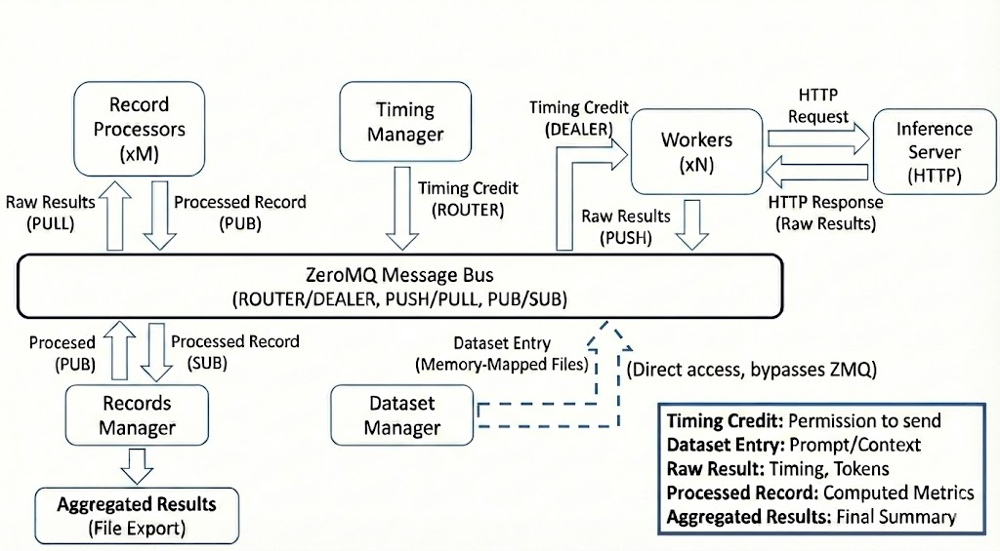

# Architecture of AIPerf

AIPerf is a distributed benchmarking tool for measuring AI inference performance. It generates load against inference endpoints, collects detailed performance metrics, and provides comprehensive analysis of throughput, latency, and resource utilization.

## Architecture Overview

AIPerf is designed as a modular, extensible benchmarking framework that separates concerns across three architectural planes. The system scales horizontally as more workers are added while maintaining centralized orchestration.


### Three-Plane Architecture

| Plane | Components | Purpose |
|-------|-----------|---------|
| **Control Plane** | SystemController, Timing Manager, Dataset Manager, Worker Manager | Decides what, when, and how many requests to send |
| **Data Plane** | Workers, Inference Server | Executes the actual I/O and request/response cycle |
| **Analytic Plane** | Record Processors, Records Manager, GPU Telemetry Manager, Server Metrics Manager | Computes metrics and collects telemetry |

### Request Lifecycle

1. **Initialization**: Dataset Manager loads data, Timing Manager prepares schedule
2. **Warmup** (optional): Workers send warmup requests to prime JIT, caches, and connection pools. Results are discarded.
3. **Profiling**: Workers receive credits, access data, send requests to inference server
4. **Collection**: Workers capture response timing and content
5. **Processing**: Record Processors compute metrics in parallel
6. **Aggregation**: Records Manager collects and exports results


## Core Components

### System Controller

The System Controller is the central orchestrator that manages the lifecycle and coordination of all major modules involved in a benchmarking run.

**Key Responsibilities:**
- Registering and initializing core components
- Orchestrating the start, execution, and shutdown of benchmarking tasks
- Handling configuration, resource allocation, and inter-module communication
- Monitoring the overall progress and health of the benchmarking process
- Managing error handling, cleanup, and graceful termination of all modules

### Dataset Manager

The Dataset Manager handles all aspects of input data management during benchmarking runs.

**Key Responsibilities:**
- Loading datasets from various sources (JSONL, CSV, synthetic generators, trace replay formats)
- Parsing and validating input data to ensure it matches the expected format
- Writing dataset to memory-mapped files, enabling workers to access data directly without message passing
- Supporting custom dataset types, such as MoonCake traces, for advanced benchmarking scenarios
- Managing the lifecycle of datasets, including initialization, iteration, and cleanup

### Timing Manager

The Timing Manager controls and coordinates the timing of requests during benchmarking runs through a credit-based system.

**Key Responsibilities:**
- Scheduling when each request should be sent based on the selected timing mode (fixed schedule, request-rate, adaptive-scale, or user-centric rate)
- Managing precise timing to accurately reproduce real-world or synthetic load patterns
- Supporting advanced timing scenarios, such as replaying traces with specific inter-arrival times or simulating bursty traffic
- Ensuring that requests are dispatched to workers at the correct intervals for reliable measurement

### Worker Manager

The Worker Manager monitors the health and status of worker processes during benchmarking. Workers are spawned group-local by the `WorkerGroupManager`, not by the System Controller — the controller's required services are the Dataset Manager, Timing Manager, Records Manager, and Worker Group Manager.

**Key Responsibilities:**
- Monitoring worker status, progress, and resource usage via `WorkerHealthMessage`
- Tracking worker health states (HEALTHY, HIGH_LOAD, ERROR, IDLE, STALE)
- Publishing worker status summaries to the message bus for the UI dashboard
- Reporting per-worker process stats at profile completion

### Workers

Workers are the processes that send HTTP requests to the inference server and measure response times.

**Key Responsibilities:**
- Send HTTP requests to inference servers and measure response timing
- Wait for timing credits before sending requests (enables precise load control)
- Track conversation state for multi-turn interactions
- Report timing measurements to Record Processors for analysis

**Scalability:**
- Run multiple workers (e.g., 10, 50, 100+) to support different workload patterns
- No coordination between workers
- Adding more workers increases load capacity and request rates

### Record Processor

The Record Processor processes and interprets the responses received from the inference server during benchmarking.

**Key Responsibilities:**
- Parsing raw inference results to extract relevant metrics (latency, output tokens, correctness)
- Handling different response formats from various model endpoints (OpenAI-compatible APIs, Cohere, Hugging Face, and other custom APIs)
- Validating and normalizing results to ensure consistency across benchmarking runs
- Computing metrics derived from individual requests (TTFT, ITL, Request Latency, Request Throughput etc.)
- Supporting error detection and handling for malformed or unexpected responses
- Scales horizontally to handle high-volume metric computation

### Records Manager

The Records Manager handles the collection, organization, and storage of benchmarking records and results.

**Key Responsibilities:**
- Aggregating data from the records processors (inference results, timing information, metrics)
- Storing records in memory and/or exporting them to files (CSV, JSON, Parquet) for later analysis
- Providing interfaces for querying, filtering, and summarizing benchmarking results
- Supporting the generation of reports and artifacts for performance evaluation
- Managing the final export of aggregated performance summaries and per-request details

### GPU Telemetry Manager

The GPU Telemetry Manager collects GPU metrics during benchmarking runs via pluggable collectors.

**Key Responsibilities:**
- Collecting GPU metrics (power, utilization, memory, temperature, errors) via three collector backends:
  - **DCGM**: Scrapes DCGM Exporter HTTP endpoints (Prometheus format)
  - **PyNVML**: Queries NVIDIA GPUs directly via the pynvml Python library (no external endpoint required)
  - **AMDSMI**: Queries AMD GPUs directly via the amdsmi Python library shipped with ROCm
- Auto-discovering DCGM endpoints
- Supporting custom endpoints via `--gpu-telemetry` flag
- Exporting GPU telemetry alongside benchmark results

### Server Metrics Manager

The Server Metrics Manager collects metrics from Prometheus-compatible endpoints during benchmarking runs.

**Key Responsibilities:**
- Collecting metrics from Prometheus-compatible endpoints (inference server application metrics, system metrics, custom metrics)
- Auto-discovering metrics endpoints from configured inference server URLs (`--url`)
- Supporting custom Prometheus endpoints via `--server-metrics` flag
- Parsing any metrics exposed in Prometheus format (gauges, counters, histograms)
- Typical metrics collected: inference server KV cache usage, request counts, latencies, batch sizes, model-specific metrics, and server resource metrics
- Auto-detecting non-Prometheus endpoints (e.g. TRT-LLM serves an iteration-stats JSON array at `/metrics` by default), probing `<base>/prometheus/metrics` once as a fallback, and disabling collection for that endpoint after a single warning if neither path yields parseable Prometheus data — see [Server Metrics Compatibility & auto-disable](server-metrics/server-metrics.md#compatibility--auto-disable)
- Exporting server metrics alongside benchmark results

### AIPerfSweep (parameter sweeps and multi-run on Kubernetes)

The `AIPerfSweep` CRD owns child `AIPerfJob` CRs via `ownerReferences` to orchestrate parameter sweeps, multi-run confidence trials, and adaptive convergence on a Kubernetes cluster. The orchestration loop runs in a dedicated **sweep-controller pod** (created by the kopf operator from a JobSet manifest), not in the operator itself; this keeps kopf as a thin reconciler. The sweep-controller uses `kubernetes_asyncio` to create child `AIPerfJob`s deterministically named per `(variation, trial)`, watches each to terminal phase, pulls per-child summary metrics from the operator's results-server, and runs `aggregate_and_export` over the cumulative `RunResult` list. Idempotency is anchored on the apiserver — deterministic child names plus owner references — so a sweep-controller pod restart resumes from the first non-existent child without re-running terminal ones. See [docs/kubernetes/sweeps.md](kubernetes/sweeps.md) for usage.

**Adaptive outer loop (BO).** When `--search-space` is set, `MultiRunOrchestrator.execute` dispatches to `execute_adaptive_search`, which drives a pluggable `SearchPlanner` (default `BayesianSearchPlanner`, a curated preset that subclasses `OptunaSearchPlanner` — BoTorch with an Optuna TPE fallback). Each iteration the planner proposes a `BenchmarkConfig` materialized as a synthesized `SweepVariation`, the orchestrator runs `plan.trials` benchmarks at it via the same `_run_independent_cell` used by grid mode, and feeds results back. A separate `search_history.json` is written incrementally next to `sweep_aggregate/`; the existing post-hoc aggregator handles BO results unchanged because `aggregate_sweep_and_export` groups by the stamped `variation_values`. BO runs both in-process (`aiperf profile --search-*`) and cluster-side via `AIPerfSweep` CRs whose `spec.sweep` block uses `type: adaptive_search` — `sweep_controller/main.py` instantiates the same `BayesianSearchPlanner` and the K8s executor creates one `AIPerfJob` per iteration; the kopf operator side stays BO-agnostic. See [docs/sweeping/bayesian-optimization.md](sweeping/bayesian-optimization.md) and [docs/kubernetes/sweeps.md](kubernetes/sweeps.md#adaptive-search-bayesian-optimization).

### Envelope vs Benchmark Body

`AIPerfConfig` is an envelope wrapping a `BenchmarkConfig`:

```python
class AIPerfConfig(BaseConfig):
    benchmark: BenchmarkConfig          # the swept body
    sweep: SweepConfig | None = None    # variation generator
    multi_run: MultiRunConfig           # trial / convergence config
    variables: dict[str, Any]            # Jinja context
    random_seed: int | None              # base seed for per-variation derivation
```

The split mirrors `AIPerfSweep` on the K8s side: cross-variation machinery (sweep, multi_run, variables, random_seed) at envelope level; the swept benchmark body as a separate concern. Sweep expansion only ever merges into the `benchmark:` subtree; envelope fields are constant across variations.

When code reads body fields, the local-alias pattern keeps call sites concise:

```python
def setup(self, config: AIPerfConfig) -> None:
    bench = config.benchmark
    if bench.endpoint.streaming:
        ...
```

YAML configs follow the same shape — see [docs/tutorials/migrating-config.md](tutorials/migrating-config.md) for examples.

## How AIPerf Works

### Credit System & Request Timing

The Timing Manager uses a **credit-based flow control system** to control when requests are sent. This enables accurate load pattern reproduction and prevents server overload.

**How Credits Work:**
- Each credit grants permission to send one request
- The Timing Manager issues credits according to the configured timing mode:
  - **Fixed schedule mode**: Replays conversation traces at precise timestamps from dataset metadata
  - **Request-rate mode**: Issues credits at a specific rate with configurable arrival patterns (constant, Poisson, gamma, concurrency burst)
  - **Adaptive-scale mode**: Single-run controller that discovers and sustains an SLA boundary by adjusting load
  - **User-centric rate mode**: Each session acts as a separate user with calculated gaps between turns

**Flow Control Benefits:**
- Prevents overwhelming the inference server
- Enables precise reproduction of load patterns
- Provides natural backpressure when the server slows down
- Allows accurate measurement without artificial delays

**Credit Distribution:**
- Credits are dispatched to workers via a ROUTER/DEALER pattern (the Timing Manager's sticky ROUTER to each worker's DEALER)
- Router selects workers based on sticky sessions (multi-turn conversations) or least-loaded worker selection
- Credit returns travel back on a dedicated PUSH/PULL fan-in channel: each worker PUSHes its `CreditReturn`/`FirstToken` to the Timing Manager's single PULL, separating the high-volume return path from credit dispatch
- The return channel carries no ZMQ envelope identity, so the returning worker id travels inside the message
- No coordination required between workers
- Scales to large numbers of workers without bottlenecks
- Efficient message routing minimizes overhead

### Data Flow & Messaging

This section describes the end-to-end message flow during a benchmark run, showing how data moves between components through the ZMQ message bus.



**Key Data Structures:**
- **Timing Credit**: Grants permission to send one request
- **Dataset Entry**: Prompt and conversation context
- **Raw Result**: Request timing, tokens, response text
- **Metric Record**: Per-request computed metrics plus trace data
- **Aggregated Results**: Final performance summary and per-request details

**Message Flow:**
1. Credit Router dispatches credits to workers via ROUTER/DEALER pattern
2. Workers access dataset entries via memory-mapped files
3. Workers send requests to Inference Server (external HTTP)
4. Workers return completed credits (and FirstToken events) to the Timing Manager over a dedicated PUSH/PULL fan-in channel
5. Workers push raw results to Record Processors
6. Record Processors push metric records to Records Manager via a dedicated msgspec MessagePack wire payload on the records PUSH/PULL channel
7. Records Manager aggregates request metrics and publishes `ProcessRecordsResultMessage` to the System Controller
8. GPU Telemetry Manager PUSHes its collector records (`TelemetryRecordsMessage`) to the Records Manager on `CommAddress.RECORDS`; the Records Manager accumulates them and is the sole publisher of `ProcessTelemetryResultMessage` to the System Controller. Server Metrics Manager, by contrast, accumulates its collector records in-process and publishes `ProcessServerMetricsResultMessage` directly to the System Controller — server metrics is the only true in-process side-channel that bypasses the Records Manager

## Communication Architecture

AIPerf services communicate internally via a **ZeroMQ (ZMQ) message bus**, designed for low-latency, high-throughput message passing between components.

### Why ZMQ?

AIPerf uses ZMQ to maintain **measurement accuracy** by decoupling orchestration logic from execution:

- **Low-overhead messaging**: Credits are routed directly to workers
- **Asynchronous by design**: No blocking calls between services, ensuring workers spend maximum time on I/O and timing
- **Efficient transport**: ZMQ is designed for low-overhead inter-process communication
- **Scalability**: Supports distributed workers across multiple nodes without code changes

### Communication Patterns

AIPerf uses **ZMQ proxies** for message routing between services and workers:

- Services publish strongly-typed messages to specific topics (Pub/Sub pattern)
- Services subscribe to relevant message types
- Router/Dealer pattern for credit dispatch (and low-frequency worker control messages) to/from workers
- PUSH/PULL fan-in for credit returns and FirstToken events from workers back to the Timing Manager
- `WorkerGroupManager` owns the group-local ROUTER/DEALER lifecycle channel for worker and record-processor registration, health/startup updates, queryable dataset state, and drain coordination
- In group-managed mode, only `WorkerGroupManager` connects to `SystemController`; workers and record processors remain group-local participants
- Workers connect to the global credit router before dataset availability, but only become dispatchable after `WorkerGroupManager` reports group-local dataset readiness
- Request/Reply patterns for synchronous operations

For low event-loop overhead, the streaming credit sockets (the dispatch DEALER/ROUTER and the return PUSH/PULL) are driven directly off the raw ZMQ file descriptor with an edge-triggered, non-blocking batch drain rather than per-message `await` wrappers.

### State Management

**Stateless design** for scalability:
- **Workers**: No shared state between workers; each maintains only local conversation context for multi-turn requests
- **Services**: All service state is ephemeral and can be reconstructed from configuration
- **Coordination**: Credit distribution happens through the message bus; dataset access via memory-mapped files
- **Results**: Only aggregated results are persistent (exported to files)

## Design Principles

AIPerf is built on three core principles:
- **Separation of Concerns**: Control plane orchestrates, workers execute, record processors compute metrics
- **Scalability**: Horizontal scaling for workers and processors with credit-based flow control
- **Extensibility**: Plugin system for datasets, endpoints, transports, and metrics

## Deployment Modes

AIPerf supports distributed execution with two deployment models:

- **Multiprocess Mode**: Each service runs as a separate process on a single node (default for single-node deployments). `WorkerGroupManager` is still the readiness and declared-capacity authority for each local worker group, even when the group lives on one host instead of one pod.
- **Kubernetes Mode**: Control-plane services run in the controller pod while each worker pod hosts a `WorkerGroupManager` plus sibling worker and record-processor containers. The same `WorkerGroupManager` group-local lifecycle contract used for local mode stays on a dedicated ROUTER/DEALER channel while credits continue to use the global credit router, so readiness and capacity semantics match across run modes. In this mode, the operator mirrors controller truth for benchmark lifecycle and aggregate worker status, so `AIPerfJob.status.phase` and `AIPerfJob.status.workers` reflect the controller's authoritative view once progress is available.

## External Dependencies

AIPerf integrates with external systems:

- **Inference Server**: The target system being benchmarked (vLLM, Dynamo, SGLang, etc.)
- **DCGM Exporter**: Optional GPU telemetry source (exposes GPU metrics in Prometheus format). Alternative: PyNVML queries GPUs directly without an external endpoint.
- **Prometheus-compatible endpoints**: Optional server/application metrics source for Server Metrics Manager (inference servers like vLLM expose metrics in Prometheus format at their /metrics endpoint)
