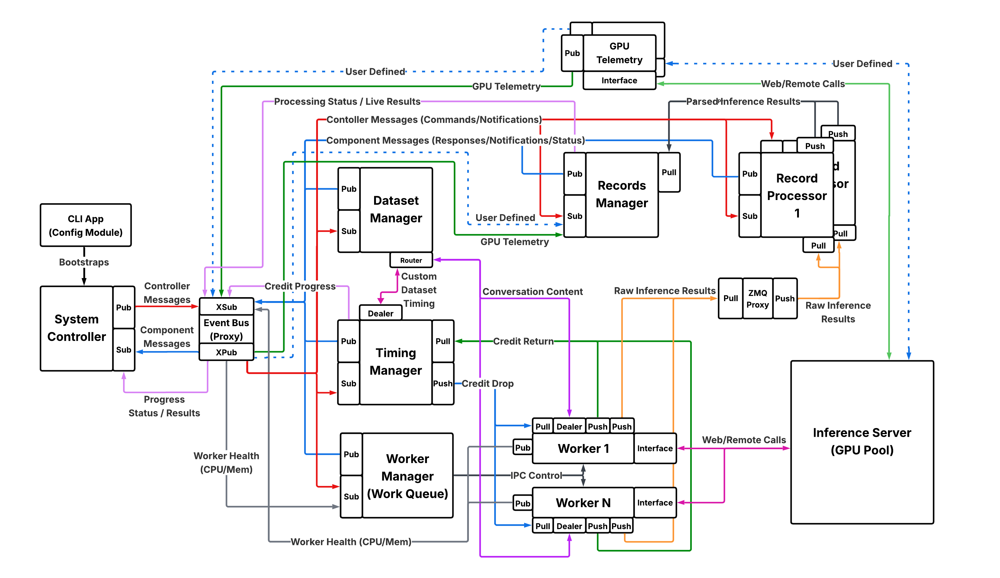

<!--
SPDX-FileCopyrightText: Copyright (c) 2024-2025 NVIDIA CORPORATION & AFFILIATES. All rights reserved.
SPDX-License-Identifier: Apache-2.0
-->

# Architecture of AIPerf



## AIPerf Architecture Overview

AIPerf is designed as a modular, extensible benchmarking framework for generative AI models. Its architecture separates concerns across several core components, enabling flexible configuration, scalable load generation, and robust metric collection. The system supports both local and distributed (Kubernetes) execution, and can be easily extended for new models, endpoints, and benchmarking scenarios.

### System Controller
The System Controller is the central orchestrator that manages the lifecycle and coordination of all major modules involved in a benchmarking run. Its main functions include:

- Registering and initializing core components.
- Orchestrating the start, execution, and shutdown of benchmarking tasks.
- Handling configuration, resource allocation, and inter-module communication.
- Monitoring the overall progress and health of the benchmarking process.
- Managing error handling, cleanup, and graceful termination of all modules.

### Dataset Manager
This is responsible for handling all aspects of input data management during benchmarking runs. Its main functions include:

- Loading datasets from various sources, such as files (JSONL, CSV), synthetic generators, or trace replay formats.
- Parsing and validating input data to ensure it matches the expected format for benchmarking.
- Providing batches or individual samples to the benchmarking workers according to the configured load pattern (e.g., concurrency, request-rate, trace replay).
- Supporting custom dataset types, such as MoonCake traces, for advanced benchmarking scenarios.
- Managing the lifecycle of datasets, including initialization, iteration, and cleanup.

### Timing Manager
This is responsible for controlling and coordinating the timing of requests during benchmarking runs. Its main functions include:

- Scheduling when each request should be sent, based on the selected benchmarking mode (e.g., fixed concurrency, request-rate, or trace replay).
- Managing precise timing to accurately reproduce real-world or synthetic load patterns.
- Supporting advanced timing scenarios, such as replaying traces with specific inter-arrival times or simulating bursty traffic.
- Ensuring that requests are dispatched to workers at the correct intervals, enabling reliable measurement of latency and throughput.
- Providing timing data and statistics for analysis and reporting.

### Worker Manager
This is responsible for orchestrating and managing the pool of worker processes that execute benchmarking tasks. Its main functions include:

- Coordinating with the system controller to spawn and shut down workers that send requests to the inference server.
- Monitoring worker status, progress, and resource usage.
- Handling worker lifecycle events, such as startup, shutdown, and error recovery.

### Worker

This is responsible for executing individual benchmarking tasks. Each worker operates as a process that sends requests to the inference server, collects responses, and records performance metrics. Its main functions include:

- Pulling timing credits from the timing manager.
- Pulling data from the dataset manager for a request.
- Formatting the data for the endpoint.
- Sending requests to the target endpoint according to the specified schedule.
- Recording request and response timestamps.
- Reporting results to the record processors for aggregation and analysis.

### Record Processor
This is responsible for processing and interpreting the responses received from the inference server during benchmarking. Its main functions include:

- Parsing raw inference results to extract relevant metrics, such as latency, output tokens, and correctness.
- Handling different response formats from various model endpoints (e.g., OpenAI, vLLM, Triton, custom APIs).
- Validating and normalizing results to ensure consistency across benchmarking runs.
- Preparing parsed data for further analysis, aggregation, and reporting by other modules (such as the records manager).
- Computing the metrics derived from individual requests.
- Supporting error detection and handling for malformed or unexpected responses.

### Records Manager
This is responsible for managing the collection, organization, and storage of benchmarking records and results. It acts as a central component for handling the data generated during benchmarking runs, such as inference results, timing information, and other metrics. Its main functions include:

- Aggregating data from the records processors, such as inference results, timing information, and metrics.
- Storing records in memory and/or exporting them to files (e.g., CSV, JSON) for later analysis.
- Providing interfaces for querying, filtering, and summarizing benchmarking results.
- Supporting the generation of reports and artifacts for performance evaluation.

### GPU Telemetry Manager
This connects to DCGM Exporter endpoints to gather GPU metrics during benchmarking. Its main functions include:

- Discovering DCGM endpoints (default: localhost:9400, localhost:9401)
- Collecting GPU metrics at regular intervals (default: 333ms, ~3Hz)
- Metrics collected: GPU utilization, memory usage, temperature, power consumption, clock speeds
- Exporting telemetry data to JSONL files for correlation with benchmark metrics
- Supporting multi-node GPU telemetry collection

See [GPU Telemetry Tutorial](tutorials/gpu-telemetry.md) for configuration details.

### Server Metrics Manager
This collects Prometheus-compatible metrics from inference servers during benchmarking. Its main functions include:

- Auto-discovering metrics endpoints (base_url + `/metrics`)
- Collecting server-side metrics at regular intervals (default: 333ms)
- Supporting custom Prometheus endpoint URLs
- Exporting metrics in multiple formats (JSON, CSV, JSONL, Parquet)
- Providing time-series data for correlation with client-side metrics

See [Server Metrics Guide](server_metrics/server-metrics.md) for configuration details.

### Inference Server
This is the external endpoint that AIPerf targets to generate benchmarking load. AIPerf sends HTTP requests to the inference server and measures response characteristics.

## Data Flow

### Benchmark Lifecycle

```
1. INITIALIZATION
   SystemController → Start all services
   ├─ DatasetManager → Load/generate dataset
   ├─ TimingManager → Initialize timing strategy
   ├─ WorkerManager → Spawn worker processes
   ├─ RecordProcessor(s) → Start metric computation
   └─ RecordsManager → Initialize aggregation

2. CONFIGURATION
   SystemController → Send PROFILE_CONFIGURE message
   ├─ DatasetManager → Pre-generate all prompts
   ├─ TimingManager → Create credit issuing strategy
   ├─ Workers → Initialize HTTP clients
   └─ RecordProcessors → Load metric definitions

3. PROFILING
   SystemController → Send PROFILE_START message
   ├─ TimingManager → Issue credits on schedule
   ├─ Workers → Pull credits → Request data → Send HTTP → Collect responses
   ├─ Workers → Send raw records to RecordProcessors
   ├─ RecordProcessors → Compute metrics → Send to RecordsManager
   └─ RecordsManager → Aggregate metrics → Export results

4. COMPLETION
   SystemController → Send PROFILE_STOP message
   └─ All services → Cleanup and shutdown
```

### Request Flow

```
TimingManager                    Workers                    Inference Server
     │                              │                              │
     ├─ Issue Credit ──────────────>│                              │
     │  (ZMQ PUSH)                  │                              │
     │                              ├─ Pull Credit                 │
     │                              │  (ZMQ PULL)                  │
     │                              │                              │
     │                              ├─ Request Dataset Entry ──────> DatasetManager
     │                              │                              │
     │                              ├─ Format Request              │
     │                              │                              │
     │                              ├─ HTTP POST ─────────────────>│
     │                              │                              │
     │                              │<──────────── SSE Stream ─────┤
     │                              │  (Token 1, Token 2, ...)     │
     │                              │                              │
     │                              ├─ Record Timestamps           │
     │                              │                              │
     │                              ├─ Send Raw Record ───────────> RecordProcessor
     │                              │  (ZMQ PUSH)                  │
     │                              │                              │
     │<─ Report Progress ───────────┤                              │
     │  (ZMQ PUB)                   │                              │
```

### Metrics Flow

```
Worker              RecordProcessor           RecordsManager          Exporters
  │                       │                          │                    │
  ├─ Raw Record ─────────>│                          │                    │
  │  (request/response)   │                          │                    │
  │                       ├─ Compute Metrics         │                    │
  │                       │  - TTFT, ITL             │                    │
  │                       │  - Token counts          │                    │
  │                       │  - Latencies             │                    │
  │                       │                          │                    │
  │                       ├─ Processed Record ──────>│                    │
  │                       │                          │                    │
  │                       │                          ├─ Aggregate         │
  │                       │                          │  - Statistics      │
  │                       │                          │  - Percentiles     │
  │                       │                          │  - Totals          │
  │                       │                          │                    │
  │                       │                          ├─ Final Results ───>│
  │                       │                          │                    │
  │                       │                          │                    ├─ Export CSV
  │                       │                          │                    ├─ Export JSON
  │                       │                          │                    └─ Export JSONL
```

## Message Bus Architecture

AIPerf uses ZeroMQ (ZMQ) for high-performance inter-service communication:

### Message Patterns

| Pattern | Use Case | Example |
|---------|----------|---------|
| **PUB/SUB** | Broadcast messages | Progress updates, status reports |
| **PUSH/PULL** | Load-balanced work distribution | Credit distribution, record processing |
| **REQ/REP** | Request-response | Service registration, commands |
| **DEALER/ROUTER** | Streaming bidirectional | Real-time UI updates |

### Auto-Subscription

Services automatically subscribe to message types based on `@on_message` decorators:

```python
class MyService(BaseComponentService):
    @on_message(MessageType.PROFILE_START)
    async def _handle_start(self, msg: ProfileStartMessage) -> None:
        # Handler registered automatically during @on_init
        await self.do_something()
```

During the `@on_init` phase, AIPerf scans all `@on_message` decorators and automatically subscribes the service to those message types.

## Scaling Architecture

### Worker Scaling

Workers scale horizontally:
- Auto-scaled based on CPU count: `min(concurrency, CPU_count * 0.75)`
- Manual override: `--workers-max N`
- Each worker is an independent process
- Load balancing via ZMQ PULL socket (automatic round-robin)

### Record Processor Scaling

Record processors scale to match workload:
- Default: 1 processor per 4 workers
- Tunable via `AIPERF_RECORD_PROCESSOR_SCALE_FACTOR`
- Processes records in parallel for high throughput
- Each processor is independent (no shared state)

### Memory Optimization

- Workers use connection pooling (shared across requests)
- Datasets can be memory-mapped for large custom datasets
- Garbage collection disabled for latency-sensitive services (Workers, TimingManager)
- Batch processing for exports reduces memory usage

## Plugin System Integration

The plugin system enables extensibility without modifying core code:

```
Plugin Registry (plugins.yaml)
       │
       ├─ Endpoint Plugins ──────> Format requests/parse responses
       │
       ├─ Transport Plugins ─────> HTTP, WebSocket (future)
       │
       ├─ Timing Strategy Plugins -> Fixed schedule, request-rate, user-centric
       │
       ├─ Dataset Plugins ───────> Synthetic, custom, public datasets
       │
       └─ Exporter Plugins ──────> CSV, JSON, Parquet, custom formats
```

All plugins are lazy-loaded (imported only when used) and validated at startup.

See [Plugin System Documentation](plugins/plugin-system.md) for details.

## Deployment Architectures

### Single Machine

```
┌──────────────────────────────────────────────────────┐
│ AIPerf (Single Host)                                  │
│                                                       │
│  SystemController                                     │
│       │                                               │
│       ├─ DatasetManager                              │
│       ├─ TimingManager                               │
│       ├─ WorkerManager                               │
│       │     ├─ Worker 1 ─┐                           │
│       │     ├─ Worker 2 ─┼──> Inference Server       │
│       │     └─ Worker N ─┘     (localhost:8000)      │
│       ├─ RecordProcessor(s)                          │
│       └─ RecordsManager                              │
└──────────────────────────────────────────────────────┘
```

### Multi-Server (Client-Side Load Balancing)

```
┌───────────────────────────┐
│ AIPerf                     │
│  Workers ─────────┐        │
└───────────────────┼────────┘
                    │
         ┌──────────┼──────────┐
         │          │          │
         ▼          ▼          ▼
    Server 1    Server 2    Server 3
    :8000       :8000       :8000
```

Use `--url http://s1:8000 --url http://s2:8000 --url http://s3:8000`

### Kubernetes Distributed

```
┌─────────────────────────────────────────────────────┐
│ Kubernetes Cluster                                   │
│                                                      │
│  ┌─────────────┐   ┌─────────────┐                 │
│  │ AIPerf Pod  │   │ AIPerf Pod  │                 │
│  │  Workers    │   │  Workers    │                 │
│  └──────┬──────┘   └──────┬──────┘                 │
│         │                  │                         │
│         └────────┬─────────┘                        │
│                  ▼                                   │
│         ┌────────────────────┐                      │
│         │  Inference Service │                      │
│         │   (Load Balanced)  │                      │
│         └────────────────────┘                      │
│                                                      │
│  ┌──────────────────────────┐                      │
│  │ Shared Dataset PVC        │ (ReadWriteMany)      │
│  └──────────────────────────┘                      │
└─────────────────────────────────────────────────────┘
```

See [Deployment Guide](deployment.md) for configuration details.

## Performance Characteristics

### Throughput

- **Single machine**: Up to 20,000 QPS (with proper tuning)
- **Bottlenecks**: Network bandwidth, worker count, server capacity
- **Optimization**: Increase workers (`--workers-max`), connection limits, buffer sizes

### Latency

- **Measurement overhead**: < 1ms per request (minimal instrumentation)
- **Worker latency**: Primarily network and server processing
- **ZMQ overhead**: < 100μs per message (high-performance messaging)

### Resource Usage

- **CPU**: ~1-2 cores per 8 workers (more for metric-heavy workloads)
- **Memory**: ~100-200MB per worker process
- **Network**: Depends on request/response sizes (typically 10-100 Mbps)

## See Also

- **[Getting Started](getting-started.md)** - Installation and first benchmark
- **[Tutorial](tutorial.md)** - Step-by-step examples
- **[Plugin System](plugins/plugin-system.md)** - Extensibility guide
- **[Deployment Guide](deployment.md)** - Production deployments
- **[Performance Tuning](performance-tuning.md)** - Optimization guide
- **[Development Patterns](dev/patterns.md)** - Code patterns for contributors
