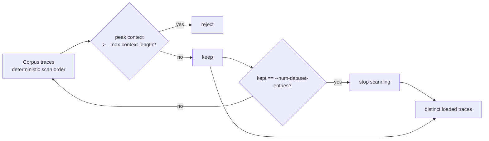

<!--
SPDX-FileCopyrightText: Copyright (c) 2025-2026 NVIDIA CORPORATION & AFFILIATES. All rights reserved.
SPDX-License-Identifier: Apache-2.0
-->

# Agentic Workloads: Native Graph IR

Agentic workloads let AIPerf benchmark the request patterns real agents produce — multi-step LLM workflows with dependencies between calls, fan-out/fan-in, and state threaded from one response into the next prompt — instead of a flat list of independent requests or a linear conversation. Replay recorded agent traces (Dynamo, Weka) or author workloads directly; either way the workload is expressed in AIPerf's **Graph IR** and executed on the graph runtime.

This page is the user guide for the **native Graph IR** file format: hand-authored `.yaml`, `.yml`, or `.jsonl` files that describe graph topology plus one or more traces. Imported Weka and Dynamo agent traces use the same agentic-workload lane and the same unified segment store. Prompts are limited to plain-string chat messages; unsupported constructs fail at parse time with an error naming the offending location (dispatch mechanics are covered under [Runtime behavior](#runtime-behavior)).

## Graph IR vs. `dag_jsonl`

Graph IR is AIPerf's native agentic workload representation. The earlier `dag_jsonl` conversation mode ([DAG Benchmarks](./dag.md)) predates it: built on the multi-turn session system, its context inheritance is tree-shaped — a session cannot have two FORK parents (no diamonds); SPAWN join gates provide control-flow fan-in. It is **legacy** — kept for its reactive fork/spawn orchestration, `BranchStats` export, and the legacy DAG child stop-condition rules, which the graph runtime does not replicate — and the graph plane replays the same `dag_jsonl` files with payload-identical profiling wire bodies (canonical order-insensitive comparison; [run-level accounting differs](./dag.md#known-documented-divergences)). New agentic workloads should target Graph IR.

| Mode | Select with | Status | File shape |
|---|---|---|---|
| **Native Graph IR** | `--graph-format native` | **Native agentic mode.** Explicit dataflow graphs: nodes read and write channels, traces provide initial channel values, and LLM nodes build prompts from graph state. Fan-out and fan-in, including context/dataflow fan-in. | Native graph YAML or graph-record JSONL. |
| **DAG JSONL (graph plane)** | `--graph-format dag_jsonl` | **Migration path.** A DAG JSONL file replayed on the graph runtime (lanes, edge-delay timing, unified-segment KV-prefix dedup), with payload-identical profiling wire bodies to the legacy plane (canonical order-insensitive comparison; [run-level accounting differs](./dag.md#known-documented-divergences)). | Conversation JSONL; see [Running a `dag_jsonl` file on the graph runtime](./dag.md#running-a-dag_jsonl-file-on-the-graph-runtime). |
| **DAG JSONL (legacy plane)** | `--custom-dataset-type dag_jsonl` | **Legacy.** Branching chat conversations where each line is a session and `forks` / `spawns` connect sessions; tree-shaped context inheritance. Sole source of `BranchStats` export, the legacy child stop-condition rules, and reactive spawn orchestration. | Conversation JSONL; see [DAG Benchmarks](./dag.md). |

Do not combine the two selectors. For a hand-authored native graph file, pass `--input-file <file>` and `--graph-format native`; to replay a DAG JSONL file on the graph plane, pass `--input-file <file>` and `--graph-format dag_jsonl`. In both cases do **not** also pass `--custom-dataset-type dag_jsonl` — that selects the separate legacy custom-dataset loader.

AIPerf auto-detects the imported trace formats (`weka_trace`, `dynamo_trace`) through graph adapters, so `--graph-format` is optional for them. Native graph files and `dag_jsonl` graph-plane runs are intentionally **not** auto-detected: a plain `.yaml` or `.jsonl` might also be a normal custom dataset — and a `dag_jsonl` file is a valid legacy custom dataset — so AIPerf treats a file as a native graph or a graph-plane `dag_jsonl` workload only when you say so explicitly with `--graph-format`.

## Replaying recorded agent traces (Dynamo, Weka)

Point `--input-file` at the recorded capture. The `dynamo_trace` and `weka_trace` formats are auto-detected; pass `--graph-format` to force one explicitly:

```bash
aiperf profile \
    --model Qwen3-0.6B \
    --endpoint-type chat \
    --url http://localhost:8000 \
    --input-file ./captures/trace.jsonl.gz \
    --graph-format dynamo_trace \
    --streaming
```

Accepted `--input-file` shapes per format:

- `dynamo_trace` — a `.jsonl` or `.jsonl.gz` request-trace file (Dynamo's `jsonl` / `jsonl_gz` file sinks), a segmented capture (`trace.000000.jsonl.gz`, `trace.000001.jsonl.gz`, ...), or a directory containing those.
- `weka_trace` — a single `.json` trace file, a directory of `.json` trace files, or a Hugging Face corpus id (e.g. `org/weka-corpus`, loaded directly via `datasets`).

AIPerf lowers each recorded trace into the unified segment store and replays it. Both formats keep the recorded inter-request delays, warped through the same per-trace idle-gap cap (60s default — see `--synthesis-idle-gap-cap`; set `synthesis.idle_gap_cap_seconds: null` in YAML to replay the raw recorded timeline), so an unbounded run spans the slowest trace's recorded duration — pass `--benchmark-duration <seconds>` to bound it. Both formats also pin each call's generation to the recorded output length (the node's `max_tokens`, mapped to the endpoint's token field; a recorded 0 upgrades to 1 with a warning), so replay never over-generates relative to the capture. [Dataset selection](#dataset-selection) documents the knobs that choose which and how many traces run (`--num-dataset-entries`, `--max-context-length`, `--allow-dataset-wrap`); the [warmup sections](#warmup-at-the-t-snapshot-window) cover recorded-replay warmup, including `--agentic-cache-warmup-duration`.

## Authoring example

Save this as `hello.graph.yaml`:

```yaml
graph:
  version: "2.0"
  system: "You are a concise assistant."

traces:
  - id: hello-1
    messages:
      - role: user
        content: "Say hello in one short sentence."
```

Run it (native files require an explicit `--graph-format native`):

```bash
aiperf profile \
    --model Qwen3-0.6B \
    --endpoint-type chat \
    --url http://localhost:8000 \
    --input-file hello.graph.yaml \
    --graph-format native
```

The YAML example uses the linear-chat shorthand: when the graph has no explicit `nodes`, the native parser derives one LLM node from the trace's `messages` and the graph-level `system` prompt. The lowering interns each trace's messages into the unified segment store at parse time (per-trace graphs, keyed by `trace.graph_ref`), so the shorthand dispatches end-to-end.

## Minimal JSONL example

Native JSONL uses one JSON object per line. Each object has a `kind` field. The `graph` record declares topology and must come before `trace` records.

```jsonl
{"kind":"graph","version":"2.0","nodes":{"ask":{"node_type":"llm","prompt":[{"role":"user","content":["Question: ","@question"]}],"output":"answer"}}}
{"kind":"trace","id":"question-1","initial_state":{"question":"What is Graph IR in one sentence?"}}
```

In the JSONL example:

- `ask` is an LLM node.
- `prompt` is a chat-message array. The string `@question` inside a message `content` list reads the `question` channel from the trace's `initial_state`.
- `output: answer` declares the channel that receives the LLM node result when the graph executes with a dispatch-capable payload path.
- `START -> ask -> END` edges are added automatically because the file has one root node and one leaf node.

## Native Graph IR schema reference

A native graph workload is parsed into these logical records:

| Record | Required? | Purpose |
|---|---:|---|
| `graph` | optional but typical | Declares schema version, channels, nodes, edges, and provenance. If omitted, AIPerf uses an empty graph and derives the linear-chat shorthand from trace messages. |
| `trace` | yes for benchmark input | Supplies one runnable instance: `id`, optional tags, optional `graph_ref`, initial channel values, and replay outputs. |

YAML can be written as one document with top-level sections:

```yaml
graph:
  version: "2.0"
  state: {}
  nodes: {}
  edges: []

traces: []
```

JSONL writes the same content as separate records:

```jsonl
{"kind":"graph","version":"2.0","nodes":{},"edges":[]}
{"kind":"trace","id":"trace-1"}
```

### Graph fields

Common `graph` fields:

| Field | Type | Notes |
|---|---|---|
| `version` | string | Current native schema version is `"2.0"`. |
| `system` | string | Optional system prompt used by the linear-chat shorthand. |
| `state` | map | Channel declarations. Missing output channels and common prompt channels are inferred with safe defaults. |
| `nodes` | map | Node id to node spec. Node ids are referenced by `edges`. |
| `edges` | list | Static (unconditional) edges, optionally carrying scheduling-delay/anchor fields. If no explicit `START` or `END` edge is present, AIPerf injects edges from roots and to leaves. |

### Node fields

`node_type: llm` is the only node type:

```yaml
nodes:
  summarize:
    node_type: llm
    prompt:
      - role: user
        content:
          - "Summarize this text: "
          - "@document"
    output: summary
    streaming: true
    max_tokens: 128
```

Important LLM fields:

| Field | Type | Notes |
|---|---|---|
| `prompt` | list | Prompt grammar that resolves to chat messages. |
| `output` | string | Channel that receives the model response. |
| `streaming` | bool | Whether this node should use streaming dispatch when the endpoint supports it. Defaults to `true`. |
| `model` | string | Model name dispatched for this call (same name and meaning as a conversation turn's `model`). Omit to use the run's `--model`. |
| `max_tokens` | int | Generation cap for this call (same name and meaning as a conversation turn's `max_tokens`). The worker maps it to the endpoint's token field (`max_completion_tokens`, or `max_tokens` under `--use-legacy-max-tokens`). Omit to leave generation uncapped. |
| `raw_tools` | list | OpenAI-compatible tool definitions for this call (same name and meaning as a conversation turn's `raw_tools`), sent as the body `tools` field. |
| `extra_headers` | map | Per-call HTTP headers (same name and meaning as a conversation turn's `extra_headers`), attached to the request headers, never the body. |
| `extra_body` | map | Per-call request-body fields such as `temperature`, `top_p`, or provider-specific keys (same name and meaning as a conversation turn's `extra_body`), passed through verbatim. Set the model, stream mode, token cap, and tools via the native fields above, not here. |

`llm` is the only node type: every live workload — imported traces and hand-authored graphs alike — is a flat graph of LLM nodes wired with static edges. Any other `node_type`/`kind` value fails at parse as unknown.

### Prompt grammar

LLM `prompt` resolves to the chat messages sent to the endpoint.

- A dict item is treated as a chat message and passed through after resolving any channel references in its `content` list.
- A top-level string `@messages_channel` splices a messages-typed channel into the prompt array.
- A string inside a message `content` list becomes a text block unless it starts with `@`, in which case it reads that channel and emits a content block of the channel's type.
- Use `@@literal` when you need a literal string that starts with `@`.

Example with a messages splice plus a text channel:

```yaml
graph:
  nodes:
    continue_chat:
      node_type: llm
      prompt:
        - "@history"
        - role: user
          content:
            - "Now answer this follow-up: "
            - "@follow_up"
      output: answer

traces:
  - id: chat-1
    initial_state:
      history:
        - role: user
          content: "Explain cache locality."
        - role: assistant
          content: "Cache locality means reusing nearby data efficiently."
      follow_up: "Give one LLM-serving example."
```

`history` is inferred as a messages channel because it is referenced at prompt-array level. `follow_up` is inferred as a text channel because it is referenced inside message content.

### Static vs. dynamic content

Whether a `@channel` reference is *static* (baked at build time) or *dynamic* (filled at run time from a predecessor's actual response) is inferred from who writes the channel:

- **Static** — the channel is only seeded by `initial_state` (or self-written by the reading node, which observes pre-write state). Its content is known at build time and interned directly. The examples above are static.
- **Dynamic** — the channel is written by one or more upstream LLM nodes. The reference lowers to a *slot* filled at run time with those nodes' real responses, so a node's prompt can splice what the model actually said upstream.

```yaml
graph:
  nodes:
    plan:
      prompt: [{role: user, content: "Draft a plan."}]
      output: plan_out
    review:
      prompt:
        - role: user
          content: ["Review this plan: ", "@plan_out"]   # dynamic: plan's real reply
      output: review_out
  edges:
    - {source: START, target: plan}
    - {source: plan, target: review}
    - {source: review, target: END}
traces:
  - id: t1
```

Dynamic composition rules and constraints:

- **Array-level splices** (`"@history"`) on a messages channel reconstruct the full **user/assistant alternation**: `initial_state` messages first, then, for each upstream writer in completion order, that writer's authored user turn followed by its *actual* reply. Each user turn is authored once (in its own node's prompt) and each assistant turn is the live response — so the naive accumulate chain below yields a well-formed conversation with **no re-stating** of prior user turns.

  ```yaml
  nodes:
    turn1: {prompt: ["@hist", {role: user, content: "Name a color."}],  output: hist}
    turn2: {prompt: ["@hist", {role: user, content: "Name an animal."}], output: hist}
    turn3: {prompt: ["@hist", {role: user, content: "Combine them."}],   output: t3}
  edges:
    - {source: turn1, target: turn2}
    - {source: turn2, target: turn3}
  ```

  `turn3`'s prompt materializes `[user "Name a color.", assistant <reply 1>, user "Name an animal.", assistant <reply 2>, user "Combine them."]`.
- **Chained writers**: when several nodes accumulate into one channel (`A` writes `hist`; `B` reads `@hist` and writes `hist`; `C` reads `@hist`), the writers must form an edge chain — completion ancestry along edges is what orders the writes deterministically; concurrent writers to a spliced channel are rejected at lowering. Every writer after the first must also itself read the channel — that read gates its dispatch behind the prior write and lets its authored turn be placed correctly in the reconstruction. If a channel has `initial_state` content, its first (root) writer must read `@hist` too (so it sees the seed the reconstruction attributes to it).
- **Block-level refs** (`"@plan_out"` inside a `content` list) compose the single writer's response into the containing message, so static instructions and the dynamic value share one message.
- Dynamic content requires per-trace **sticky routing** (automatic) so the node that produced a response and the node that splices it run on the same worker. It is not compatible with the t\* snapshot window (`--trajectory-start-max-ratio` must be `0`), which is off by default (full replay); a slot workload is rejected at load only when the window was explicitly engaged — via `--scenario inferencex-agentx-mvp` or explicit `--trajectory-start-min/max-ratio` flags.
- A producer whose request fails or returns no replayable content is *omitted* from the downstream splice (the assistant turn simply does not appear), matching how a real client would proceed past a failed turn. A tool-calls-only reply is not empty: its recorded assistant message (`tool_calls` included) splices verbatim.

### Trace fields

Common `trace` fields:

| Field | Type | Notes |
|---|---|---|
| `id` | string | Required stable trace id. |
| `tags` | list | Optional labels round-tripped with the trace (provenance); not consumed at runtime. |
| `graph_ref` | string | Optional named-graph reference for multi-graph workloads; omit for the single top-level graph. |
| `messages` | list | Linear-chat shorthand. Lifted into the `messages` channel when the graph has no explicit nodes. |
| `initial_state` | map | Initial channel values available before the first node fires. |
| `replay_outputs` | map | Optional per-node recorded output channel values (`node_id -> {channel: value}`) for replay-style workloads. |

There is no trace-level arrival-time field. To delay a node relative to trace start, set `min_start_delay_us` on the node (or on its `START` edge); inter-node pacing uses the edge delay fields described above.

## Endpoint guidance

Every graph credit dispatches against the run's global endpoint. Use the global endpoint flags:

```bash
--endpoint-type chat --url http://localhost:8000 --model Qwen3-0.6B
```

Guidelines:

- Put node-specific request-body knobs in `extra_body`; those are carried in the graph payload envelope and applied by the worker at materialization time.
- Use global `--url`, `--model`, `--header`, `--endpoint-type`, and `--custom-endpoint` for profile-time routing.

There are no graph-level endpoint pools or per-node `endpoint` references: a graph record carrying `endpoints` — or a node carrying `endpoint` — fails at parse as an unknown field. Route every credit through the global `--url`/`--model` instead.

## Session routing

`--session-routing <mode>` stamps live per-session identity on every graph request for external-router affinity (see the CLI reference for the four modes). Graph credits carry the full identity facts the routing plugins consume:

- The **session key** is the trajectory's `x_correlation_id` (one per root chain or subagent chain per trace instance, fresh per recycle), and every request also carries the instance's **root trajectory corr** for tree-level grouping.
- `is_final_turn` is the trajectory's **recorded session-final fact** (the last recorded turn of that chain), so bind/close and session-final semantics track the recording. Tree-level finality stays conservative (`is_tree_final` is always `False` on the graph plane).
- With a routing mode active, the plugin **owns session identity**: recorded `x-dynamo-*` identity headers in Dynamo captures are stripped instead of being replayed (otherwise two conflicting identities would ride one request). Without a routing mode, recorded identity headers are replayed with per-instance uniquification, as before.
- Body-mutating modes (`dynamo_nvext`) cannot rewrite the pre-serialized verbatim node bytes of recorded-trace replay; the body transform is skipped with a one-time warning (header stamping still applies). Prefer header-based modes (`dynamo_headers`, `smg_routing_key`, `session_id_header`) for byte-exact graph replay.

## Dataset selection

Imported recorded-trace workloads (the Weka and Dynamo graph adapters) honor the standard dataset-selection knobs, so you choose *which* and *how many* traces run without editing the corpus. This section documents their **graph-plane semantics** — how the graph adapters interpret each knob. `--num-dataset-entries`, `--dataset-sampling-strategy`, and `--concurrency` are general-purpose flags that synthetic and public datasets also honor (with their usual meanings); the table below describes only their graph-adapter behavior. `--max-context-length` and `--allow-dataset-wrap` are graph-adapter-specific and are ignored by synthetic and public datasets.

| Knob | Default | Effect on the graph plane |
|---|---|---|
| `--num-dataset-entries N` | unset (load all) | Caps the corpus to `N` distinct traces. **Unset loads every eligible trace** — there is no implicit default of 100 on the graph plane. |
| `--max-context-length T` | unset (no filter) | Drops any trace whose **peak context** — `input + output` tokens on its single largest request — exceeds `T`. Computed schema-only at parse time (no build, no tokenization). |
| `--allow-dataset-wrap` / `--no-allow-dataset-wrap` | derived | Whether selection may **wrap** (reuse the finite trace pool) to fill more concurrency/requests than there are distinct traces. Unset defers to a derived default computed at resolution time: **wrapping is enabled only when cache-bust is on** (`--cache-bust != none`), so plain runs default to no wrap. |
| `--dataset-sampling-strategy` | `sequential` | Order freed lanes draw templates in: `sequential` (in-order, byte-identical to the historical cursor draw), `shuffle` (per-pass seeded permutation, without replacement), or `random` (coerced to without-replacement shuffle here, so each corpus pass covers every trace once). |
| `--concurrency` | `1` | Number of trace instances replayed at once (the regular-aiperf default). |
| `--concurrency-ramp-duration` | unset | Ramps **lane admission** 1 → `--concurrency` over the duration: parked lanes start dispatching as the limit rises, spreading trace starts onto a cold server. (Graph credits bypass session slots, so this flag drives the lane limit directly on the graph plane.) |

Selection is **filter-then-cap**: `--max-context-length` rejects oversized traces *first*, then `--num-dataset-entries` keeps the first `N` of the *eligible* survivors (in the adapter's deterministic scan order — directory files by name, Dynamo trees by root session id). The cap is never applied to the raw prefix, so a rejected trace early in the corpus never eats into the `N` kept. A once-per-build summary logs `scanned`, `rejected_by_maxctx`, `eligible`, and `loaded` counts.



### Wrap-guard: over-subscription fails instead of silently cloning

When the resolved `--concurrency` exceeds the number of **distinct loaded traces** and wrapping is not allowed, AIPerf raises a `ConfigurationError` rather than silently cloning traces to fill the extra lanes (the previous behavior, ai-dynamo/aiperf#1106). This is the common trap after a `--max-context-length` filter shrinks the eligible pool well below the requested concurrency.

To resolve it, pick one:

- **Lower `--concurrency`** to at most the distinct loaded count.
- **Pass `--allow-dataset-wrap`** to intentionally reuse the finite pool across lanes/recycles.
- **Enable cache-bust** (e.g. `--cache-bust first_turn_prefix`), which both turns wrapping on by default and gives every cloned instance a distinct prefix marker.

The default `--concurrency 1` never over-subscribes a non-empty corpus, so a plain run never trips the guard.

### Duplication report

Whenever lanes recycle the finite trace pool — to sustain concurrency, satisfy `--request-count`, or satisfy `--num-conversations` — the **dispatch duplication factor** is `total instances started / distinct loaded traces`. A factor above `1` means the same recorded traces were replayed more than once. This is a report, not a failure. AIPerf emits a **WARNING** only when the duplication has no cache-bust antidote (`--cache-bust` off / `none`): identical first-turn prefixes across clones collide in the server's KV cache and inflate prefix-cache-hit metrics. With cache-bust on, every instance mints a distinct marker, so the duplication is safe and the report stays quiet. Warmup phases are exempt (their priming is meant to warm the cache).

## Runtime behavior

At runtime, AIPerf executes each trace as an async dataflow graph:

1. Seed the trace's `initial_state`.
2. Schedule nodes reachable from `START` whose inputs are satisfied.
3. For graph replay LLM nodes, map the fired runtime node to a build-time `node_ordinal`.
4. Issue a graph credit through the normal credit router; the worker materializes the request body from the unified segment store (`GraphSegmentUnifiedClient`).
5. Resolve the parked graph dispatch future when the graph return observer receives the worker return.
6. Publish node outputs, then schedule static successors as predecessor nodes finish.
7. Finish the trace when all reachable paths have reached `END` or have no more runnable successors.

Graph LLM credits are materialized on workers from the unified segment store keyed by `(trace_id, node_ordinal, phase_variant)`. Native files ride the same store: parsing lowers every LLM node's prompt into content-addressed segments (the same content plane the Weka/Dynamo adapters emit), so hand-authored graphs dispatch end-to-end through `aiperf profile`. The lowering constrains what native prompts may contain: message content must be plain strings (or lists of string blocks, concatenated in order) with `role`/`content` keys only. An `@channel` splice backed by trace `initial_state` is interned as static content; an `@channel` splice that reads a channel written by an ancestor LLM node lowers to a dynamic slot filled at run time from that node's real response (see [Static vs. dynamic content](#static-vs-dynamic-content)). Every graph is a flat set of LLM nodes wired with static edges. Unsupported constructs fail at parse time with a `NotImplementedError` naming the offending location.

Concurrency comes from two places: AIPerf can run multiple trace instances at once, and a single trace can have multiple ready graph nodes at once. Size graph lane concurrency with both levels in mind when your graph fans out.

A bare graph-workload run — `aiperf profile --input-file workload.yaml --graph-format native`, or an auto-detected Weka/Dynamo capture via `--input-file` alone — with none of `--request-count` / `--num-conversations` / `--benchmark-duration` does a **single pass over the loaded corpus**: AIPerf loads all eligible traces (`--num-dataset-entries` unset = all) and runs **each trace exactly once**, bounded by the loaded **session count** (the distinct loaded trace count) — exactly the way `dag_jsonl` bounds a bare run by its root-session count. There is no auto-`--request-count 10` truncation for agentic workloads. Two seams cooperate:

- **Config time** — the corpus size is not yet known (the weka HuggingFace corpus is streamed, and the `--max-context-length` filter runs at parse time), so the CLI-to-config converter (`_converter_profiling.py`) detects the graph workload (an explicit `--graph-format`, or an `--input-file` a graph adapter recognizes) and skips the auto-10, leaving the profiling phase unbounded. The phase then **validates** because the phase×dataset rule (`check_phase_dataset_compatibility`) exempts a no-stop phase whose dataset is a graph workload — its stop is inferred from the loaded corpus, the same way `--fixed-schedule` infers its stop from the trace. A no-stop concurrency phase against a **non-graph** dataset is still rejected.
- **Runtime** — the loaded corpus IS known when `GraphIRReplayStrategy` is built, so it derives an **explicit** session target `expected_num_sessions = len(traces)` (`_resolved_num_sessions`). The bare run therefore takes the same **bounded recycle path** as `--num-conversations`: freed lanes draw sequentially over the corpus and recycle is capped at `N`, so every distinct trace runs exactly once and then the gate closes — giving progress reporting a concrete `N`-session target instead of an implicit lane-clamp.

Non-graph concurrency runs still get the plain-aiperf `--request-count 10` default and still require a stop condition.

Set an explicit stop condition and it **overrides** the derived session target: the phase **recycles** fresh trace instances — freed lanes draw round-robin over the corpus, each instance cache-bust-marked — until the stop-condition gate closes, so `--concurrency` is sustained even beyond the corpus size. `--request-count N` caps total LLM-node dispatches (not trace instances), `--num-conversations N` caps distinct root sessions, and `--benchmark-duration D` caps wall time (it cancels still-parked idle nodes and keeps the records dispatched so far).

Because a bare run is a single pass, `--concurrency` **cannot exceed the distinct loaded traces** when wrapping is disallowed (`--cache-bust` off and `--allow-dataset-wrap` unset): there are too few distinct traces to fill the lanes without cloning, so the setup-phase wrap-guard **fails loudly** with a `ConfigurationError` rather than silently cloning to fill (the ai-dynamo/aiperf #1106 contract). Pass `--cache-bust first_turn_prefix` (or `--allow-dataset-wrap`) to intentionally recycle the corpus, or reduce `--concurrency`.

Pacing is owned by the recorded replay: node dispatch timing comes from the recorded delays and dataflow readiness, and `--concurrency` bounds how many trace instances replay at once. Flags that select a different pacing model — `--request-rate` (with any `--arrival-pattern`), `--user-centric-rate`, `--fixed-schedule`, `--adaptive-scale`, and their warmup variants — are **rejected up front** for agentic workloads rather than silently ignored. To run a graph-detected file through the linear pipeline instead, pin a loader with `--custom-dataset-type`.

### Warmup at the t\* snapshot window

Imported recorded-trace replays (trie graphs) run the **full trace by default** — the t\* window is off (`--trajectory-start-min-ratio`/`--trajectory-start-max-ratio` unset = `0.0`). Under [`--scenario inferencex-agentx-mvp`](../cli-options.md#scenario) (a named preset that locks benchmark invariants; or explicit `--trajectory-start-min/max-ratio` flags) each trace instead samples a per-trace snapshot instant `t*` inside `[min_ratio, max_ratio] × trace_duration` (the scenario applies `0.0..1.0`; it also pins `--synthesis-idle-gap-cap` to `10.0`). When the window is active (`--trajectory-start-max-ratio > 0`) and no explicit warmup phase is configured, AIPerf injects an automatic WARMUP phase ahead of PROFILING:

- Warmup dispatches exactly **one priming credit per chain live at `t*`** — that chain's *boundary turn*, the last node of the per-session chain (root chain or subagent chain) recorded before `t*`. Trie prompts are cumulative, so priming the boundary turn's prompt (output capped by `AIPERF_GRAPH_WARMUP_MAX_OUTPUT_TOKENS`, default `1`) warms the chain's whole prefix in the server KV cache.
- A chain with no pre-`t*` node needs no priming; a chain entirely before `t*` is not live and is skipped.
- Priming credits burst at phase start: leading recorded offsets are dropped and recorded inter-turn gaps are never replayed during warmup.
- With `t* = 0` (window `[0, 0]`, or a zero-duration trace) the warmup graph is empty and the phase finalizes immediately.

Profiling then replays only the at/after-`t*` portion of each trace at the full recorded output lengths, measuring against the warmed prefix. On multi-`--url` runs each trace instance keeps deterministic URL affinity across the warmup and profiling phases, so the priming and the measured replay hit the same backend.

For a lower-level architecture walkthrough, see [Graph Async Dataflow Runtime Architecture](../reference/graph-async-dataflow-runtime.md).

### Extended warmup (cache pressure + handoff)

`--agentic-cache-warmup-duration <seconds>` extends the boundary-priming warmup with a cache-pressure stage. After every priming credit returns, the warmup phase continues replaying each lane's post-`t*` remainder with zero idle delay (all recorded inter-turn gaps collapsed) and 1-token outputs, recycling fresh templates onto freed lanes, for the configured duration — driving the server KV cache to steady-state pressure before any profiled request.

When the duration elapses, in-flight requests drain and profiling resumes each lane at its **execution frontier** instead of re-firing from `t*`: nodes already executed during warmup/pressure are dropped from the profiling graph (the server holds their KV; the trie envelope keeps the full prompt prefix, so resume prompts are exact), and each chain's first pending node fires after its **residual delay** — the recorded gap to that turn minus the wall time already spent draining — so the phase boundary ramps instead of bursting.

Notes:

- Only the weka/dynamo graph-IR replay path honors this flag; it also implies a WARMUP phase even when the `t*` window is inactive (`t* = 0` runs pressure the full corpus compressed).
- Each resumed frontier's residual delay is clamped by `AIPERF_GRAPH_HANDOFF_RESIDUAL_CAP` (default 60s, matching the recorded idle-gap cap); `--burst-phase-starts` collapses the resumed leading offsets as usual (deliberately asymmetric: only true leading offsets are zeroed — a folded AND-join residual is mid-graph pacing and survives the burst collapse).
- Every pressure lane is honored at the profiling handoff: lanes still live at drain resume their execution frontier, while lanes that completed during pressure fresh-start on the next cursor template (a full `t*=0` replay in a dedicated `.f0` id namespace, not a re-run of the `t*` resume the pressure stage already executed; bounded runs only — a single-pass run keeps its cover-the-corpus-once pass and re-serves its pass-0 plan instead), and `--num-conversations` gates only recycles — never the drained lanes themselves — matching agentx's `_build_handoff_trajectories`.
- Warmup records (priming and pressure alike) are excluded from metrics as usual; only the resumed profiling turns are measured.
- Any **terminal request failure during warmup** — boundary priming or cache pressure — aborts the run before profiling (agentx parity): a warmup that could not prime the cache faithfully leaves a degraded pool, and profiling it would produce numbers that look valid but are not. Self-inflicted drain cancellations at the pressure deadline are *not* failures (the pressure stage cancels its own in-flight executors when the duration elapses) and never abort the run.
- The warmup phase is **mode-owned** when this flag is set: any user-configured warmup phase (`--warmup-request-count` / `--warmup-duration` / `--num-warmup-sessions`) is superseded by the auto boundary-priming + pressure shape (a notice is logged), so the stage always gets its full duration and no count cap can starve it. An explicit `--warmup-grace-period` is the one setting carried through verbatim; otherwise the drain waits `min(pressure duration, AIPERF_GRAPH_PRESSURE_DRAIN_GRACE_CAP)` (default cap 300s) for in-flight returns after sending completes, so a wedged or lost return cannot hang the run. On grace expiry the in-flight requests are cancelled: cancelled turns are excluded from the handoff ledger (not executed — profiling refires them), so a drain whose cancellations land yields a valid handoff, while a drain that force-completes with credits still unreturned trips the stash completeness gate and skips the re-cut (profiling then starts from the plain t\* plans).

## Validation checklist

Graph validation helpers are available for native graph files. The current profile ingest path parses agentic workloads and may surface parser/model errors before execution, but it does not run the semantic validator automatically — validator-only rules fire when you call `validate()` yourself (the full rule set is documented in [Graph IR Validation Reference](../reference/graph-ir-validation.md)). There is no CLI lint command yet; to run the semantic validator on a native file:

```bash
python -c "
from pathlib import Path
from aiperf.dataset.graph.parser import parse_native
from aiperf.dataset.graph.validator import validate
for issue in validate(parse_native(Path('hello.graph.yaml'))):
    print(issue)
"
```

| Check | Enforced | What to fix |
|---|---|---|
| Unknown record / node kind | parse time | Use `kind: graph` and `kind: trace` records with `node_type: llm` nodes; any other record or node kind (including the former `mix`, `subgraph`, rich node types, and conditional edges) fails as unknown. |
| More than one graph record | parse time | Keep one top-level graph record per file. |
| Graph record after trace records | parse time | Put the graph record first in JSONL. |
| Cycles | validator only | Native Graph IR expects an acyclic execution graph. Pre-unroll any loops in the trace topology (cycles are a future graph feature). |
| Unreachable nodes | validator only | Add edges from `START` or predecessor nodes, or remove the unused node. |
| Duplicate channel writers | validator only | Overwrite-reducer channels must have exactly one writer node. |
| Timing anchor shape | validator only | An edge carries at most one of the completion/dispatch anchors, and first-token anchors require their dispatch fallback. |

Constructs outside this list (e.g. channel splice wiring) are not statically validated; errors there surface at parse decode, at the native lowering's gates, or at runtime.

Parse and validation errors are reported with the file location or graph location when available, so fix parse-time structural errors before debugging runtime behavior.

## Choosing the right format

Use **native Graph IR** when:

- The workload is easier to describe as nodes, edges, and channel state than as chat sessions.
- You need per-node request overrides via `extra_body`.
- You want explicit fan-out/fan-in inside one trace.
- You are converting another graph-like trace format into AIPerf's canonical graph representation.

Use the **legacy `dag_jsonl` plane** only when you depend on the `BranchStats` export, the legacy DAG child stop-condition rules, or the reactive fork/spawn orchestration documented in [DAG Benchmarks](./dag.md) — the graph runtime does not replicate these. Otherwise, run existing `dag_jsonl` files on the graph plane (`--graph-format dag_jsonl`); the profiling wire bodies are payload-identical (canonical order-insensitive comparison; [run-level accounting differs](./dag.md#known-documented-divergences)).

Use regular `single_turn`, `multi_turn`, or raw-payload replay when the workload is linear and does not need graph scheduling.

## Related references

- [DAG Benchmarks](./dag.md) — the legacy branching conversation mode Graph IR supersedes.
- [Native Graph IR schema reference](#native-graph-ir-schema-reference) — record, graph, node, prompt, and trace fields on this page.
- [Validation checklist](#validation-checklist) — common authoring errors and fixes.
- [Runtime behavior](#runtime-behavior) — user-facing execution model on this page.
- [Graph Async Dataflow Runtime Architecture](../reference/graph-async-dataflow-runtime.md) — lower-level runtime reference.
- [`profile_export_aiperf.json` Schema](../reference/json-export-schema.md) — metrics export schema after a run.
