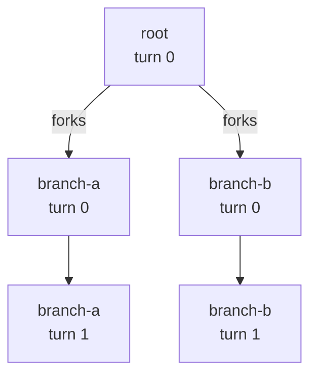

<!--
SPDX-FileCopyrightText: Copyright (c) 2025-2026 NVIDIA CORPORATION & AFFILIATES. All rights reserved.
SPDX-License-Identifier: Apache-2.0
-->

# DAG Benchmarks: Branching Conversations

Most benchmark conversations are a straight line: turn 1, then turn 2, then turn 3. DAG mode lets a single turn branch into **multiple follow-up conversations that run in parallel**. Picture a planner turn whose answer is then picked up by two different specialist turns at the same time, each continuing on its own from there.

This guide walks through the feature from zero: what it is, when to reach for it, and how to author a file. No prior AIPerf knowledge is assumed beyond the basics in the README.

## When to use DAG mode

Reach for DAG when your workload looks like one of these:

- **Prefix-cache or KV-aware routing tests.** You want several follow-up requests to share a long preamble so the server can reuse cached computation across siblings. DAG's **fork** mode (defined below) makes the children look like continuations of the parent and routes them all to the same worker so the server actually sees the shared prefix.
- **Agentic sub-agent trees.** A parent turn dispatches one or more independent sub-agents, then waits for them to finish. *Reserved for a future release.*

If your workload is a plain sequence of turns with no branching, you do **not** need DAG — stick with `multi_turn` or `raw_payload`.

## The branch mode

DAG mode exposes one primitive, selected by a shorthand key on the parent turn:

| Mode | Shorthand on parent turn | What the child sees | Routing |
|---|---|---|---|
| **fork** | `"forks": [...]` | Inherits the parent's full conversation history, including the captured model response. | Sent to the same worker as the parent so siblings share the cached prefix on the server. |

## A minimal example, walked through

Below is the shipped example at `examples/dag_jsonl/example.dag.jsonl`. Each line is one conversation; the three conversations together describe one tree.

```jsonl
{"session_id":"root","turns":[{"model":"Qwen3-0.6B","messages":[{"role":"system","content":"You are a careful assistant."},{"role":"user","content":"Please summarize the attached document."}],"max_tokens":128,"forks":["branch-a","branch-b"]}]}
{"session_id":"branch-a","turns":[{"model":"Qwen3-0.6B","messages":[{"role":"user","content":"Expand on the first section in more detail."},{"role":"user","content":"Add a brief counter-argument."}],"max_tokens":96},{"model":"Qwen3-0.6B","messages":[{"role":"user","content":"Now tighten the expansion."},{"role":"user","content":"Keep the counter-argument intact."}],"max_tokens":64}]}
{"session_id":"branch-b","turns":[{"model":"Qwen3-0.6B","messages":[{"role":"user","content":"Point out weaknesses in the summary."}],"max_tokens":128},{"model":"Qwen3-0.6B","messages":[{"role":"user","content":"Fold the critique into a revised summary."}],"max_tokens":96}]}
```

Shape of the tree:



**Line 1 — `root`.** A single turn with a `system` and `user` message. Its `forks` list names two other conversations: when `root`'s first turn completes, AIPerf dispatches `branch-a` and `branch-b` concurrently.

**Line 2 — `branch-a`.** Two turns. Because it was reached via `forks`, it starts with `root`'s full accumulated history plus the real model response already in place. Its own messages get appended onto that, then dispatched.

**Line 3 — `branch-b`.** Also two turns, also forked from `root`. Runs in parallel with `branch-a` — both are routed to the same worker as `root`, so the server sees matching prefixes across the two siblings.

Run it against any OpenAI-compatible chat endpoint:

```bash
aiperf profile \
    --model Qwen3-0.6B \
    --endpoint-type chat \
    --streaming \
    --url localhost:8000 \
    --input-file examples/dag_jsonl/example.dag.jsonl \
    --custom-dataset-type dag_jsonl \
    --concurrency 4
```

That is enough to get started. The rest of this document is reference material you can skim on demand.

---

## Reference: file format

Use `--custom-dataset-type dag_jsonl`. Each line of the input file is one conversation as a JSON object.

### Per-conversation shape

```jsonc
{
  "session_id": "root",      // required, unique across the file
  "turns": [ ... ]           // required, ordered, non-empty
}
```

### Per-turn shape

Each turn is a flat object validated against a strict schema. Top-level fields are limited to AIPerf-native turn concepts plus DAG scheduling; every other OpenAI or vendor-specific parameter goes in `extra_body`, mirroring the CLI's `--extra-inputs` split. Unknown top-level keys are rejected at load time so typos surface immediately:

```jsonc
{
  // --- AIPerf-native Turn fields (top-level) ---
  "messages": [                              // required, non-empty; appended to the session's running history
    { "role": "system", "content": "..." },  // ONLY on root/seed turn (see below)
    { "role": "user",   "content": "..." }
  ],
  "model": "Qwen3-0.6B",      // optional; per-turn model override
  "max_tokens": 128,          // optional
  "tools": [ ... ],           // optional

  // --- everything else goes here ---
  "extra_body": {
    "temperature": 0.7,
    "top_p": 0.9,
    "seed": 42,
    "stop": ["\n\n"],
    "response_format": { "type": "json_schema", "json_schema": { ... } },
    "logprobs": true,
    "presence_penalty": 0.0,
    "frequency_penalty": 0.0,
    "ignore_eos": true,       // vendor-specific (vLLM, TRT-LLM, SGLang)
    "min_tokens": 50          // vendor-specific
  },

  // --- structural DAG fields (not sent on the wire) ---
  "forks":  ["child-id-1", "child-id-2"],  // fork-mode children (inherit parent context)
  "delay":  0.0                             // milliseconds to wait before dispatching this turn
}
```

**Native vs. extra_body.** The top-level whitelist matches AIPerf's native `Turn` concepts (`messages`, `model`, `max_tokens`, `tools`) — the same fields AIPerf already tracks per-turn for any dataset. Anything else — sampling knobs (`temperature`, `top_p`, `seed`, `stop`, `logprobs`), response shaping (`response_format`), vendor tunables (`ignore_eos`, `min_tokens`, `top_k`) — lives in `extra_body`. At dispatch time the `extra_body` keys are merged into the top level of the wire body (matching the OpenAI SDK's `extra_body=` keyword), so name them exactly as the server expects.

**What gets sent on the wire.** Structural keys (`forks`, `delay`) are consumed by the scheduler; every native field and everything under `extra_body` is forwarded to the chat-completions request body.

**Message shape.** Each entry in `messages` is a free-form dict — the only structural requirement is a `role` key, matching `MooncakeTrace`. `content` may be a string, a list of OpenAI multimodal parts (e.g. `[{"type": "text", "text": "..."}, {"type": "image_url", "image_url": {"url": "..."}}]`), or omitted for assistant messages that are purely `tool_calls`. Paste whatever the server expects; AIPerf forwards it verbatim onto the wire.

### Fork mode (prefix-cache testing)

`forks: [session_id, ...]` declares fork-mode branches. When the parent turn completes, each listed child session:

- Inherits the parent's accumulated message history (including the captured real assistant response), merged under the system-prompt rule below.
- Routes to the same worker as the parent so the server sees sibling requests with a common prefix and can exercise its prefix cache.

Each listed `session_id` must be declared as its own top-level conversation in the same file. A conversation can be the fork target of **at most one** parent (otherwise the child would have two different histories to inherit). The parent has no further turns after a fork in the current release (rejoining children with a follow-up parent turn is on the roadmap).

### Spawn mode

Spawn mode is reserved for a future release. The published JSONL grammar already accommodates the future shape; the loader will reject any file that uses it today with a clear error message pointing at the deferred feature.

### `max_tokens` and other OpenAI fields

`max_tokens`, `model`, and `tools` are AIPerf-native Turn fields and sit at the top level of the turn. For any other OpenAI chat-completions parameter — `temperature`, `top_p`, `seed`, `stop`, `response_format`, `logprobs`, etc. — put it in `extra_body`. Vendor-specific knobs (`ignore_eos`, `min_tokens`, `top_k`, …) go in the same place and are merged into the top level of the wire body at dispatch time, matching the CLI's `--extra-inputs` convention.

## Reference: accumulation semantics (pure append)

DAG mode appends each turn's `messages` onto the session's running history, and after a response arrives AIPerf appends a captured `{role: assistant, content: <response_text>}` entry for the next turn to see. At dispatch time, every turn's messages are concatenated into the wire body — pure concatenation, no role inspection, no system-prompt rewriting, no deduplication.

Concretely, for a fork child's first turn:

```text
accumulated (seeded from fork parent): [root sys, root user, root assistant_response]
incoming (this turn):                  [child user_a, child user_b]

Wire payload messages:
  [root sys, root user, root assistant_response, child user_a, child user_b]
```

### Authoring rule: one `system` per conversation root

Because the merge is pure concatenation, any `system` entry on a non-root turn lands at position > 0 in the wire payload. Popular chat templates ignore system messages after index 0, so a mis-placed system entry silently disappears — a benchmarking footgun large enough that the loader rejects it.

`system` entries are permitted only on the turn that seeds the conversation's running history:

- The root conversation's turn 0.

A fork child's turn 0 is **not** a root — it inherits the parent's history (which already carries the root's system prompt), so any `system` entry there would land after that existing one and get dropped by the chat template. The loader raises on such files at load time.

If you need each phase to wrap the previous response with a new "system-like" framing, author that framing as a `user` message.

## Reference: routing (prefix-cache hits)

Each session is routed to a specific worker for all of its turns ("sticky" routing). In a DAG, every child inherits its parent's routing destination, which means:

- All siblings in a fork hit the **same worker** as the parent.
- Siblings send the same root prefix, so the worker (and its server) see a clean prefix-cache hit pattern across sibling pairs.

This is what makes fork mode useful for exercising prefix-cache and KV-aware routing — without sticky routing across the fork, siblings would scatter across workers and the prefix-share benefit would be invisible on the server.

## Reference: concurrency (fanout exceeds session slots)

Children do **not** acquire fresh session slots — they inherit the root session's slot. This keeps slot accounting sane across arbitrarily deep DAGs, but it has a user-visible consequence:

> At a fork point, in-flight request count can temporarily exceed the configured session concurrency by the fanout factor. A root with `forks: [A, B, C]` and concurrency=10 will briefly show up to **30** in-flight requests while the three children are concurrently running.

If you are using `--concurrency` as a hard cap to protect a fragile server, size it with the fanout factor in mind, or keep your DAG tree shallow. Each request's record carries `agent_depth` (0 for roots, 1 for children, 2 for grandchildren, …) and `parent_correlation_id`, so post-hoc analysis can distinguish root vs child load.

## Reference: stop conditions (`--request-count` vs. `--num-conversations`)

The two stop knobs apply differently to DAG runs because they target different things:

- **`--request-count N`** is a **literal cap on wire requests**. Children count toward it the same way multi-turn continuations do, and the run terminates the instant `requests_sent` reaches N — even if that means truncating mid-DAG. A root that's already returned and fork-spawned children when the cap fires will have any not-yet-issued children dropped, and any in-flight children whose continuation would go past the cap stop at their current turn. Use this when you want a fixed wire-volume run (e.g. a quick smoke test, or to control total cost).
- **`--num-conversations N`** is a **plan target** — "run N full conversations." DAG offspring bypass this gate so the configured N conversations always complete their full tree. Use this when you want comparable per-conversation results across runs.

The `BranchOrchestrator` records cap-truncated children separately from gracefully-completed ones — see `BranchStats.children_truncated` (visible in the `BranchOrchestrator stats:` log line and in the exported `branch_stats`). A non-zero truncated count means `--request-count` cut the run short; that is expected when the cap is mid-DAG, but if you want every spawned conversation to reach its leaf, use `--num-conversations` instead.

## Reference: runtime walkthrough (for contributors)

This section traces the example file through AIPerf's internals. Skip it unless you are debugging the orchestrator or extending DAG mode.

1. `root`'s turn 0 dispatches as-is (history is empty, so the wire body is just the authored system + user).
2. When its response arrives, the worker captures the assistant text and appends it to `root`'s history.
3. The orchestrator sees `forks=["branch-a","branch-b"]` and routes both children to `root`'s worker; the worker seeds each child's history from `root`'s. Both children's turn 0 then dispatch concurrently.
4. `branch-a`'s turn 0 has its authored messages appended onto the seeded history; the chat endpoint concatenates everything into the wire body, producing `[root sys, root user, root assistant_response, child user_a, child user_b]`. No system-prompt rewriting happens — accumulation is pure concatenation.
5. `branch-a`'s turn 1 follows the same rule, now on top of the captured response from turn 0.
6. `branch-b` runs concurrently with `branch-a`, independently.
7. `root` has no further turns, so it terminates at the fork point. Its session is held in the worker's cache (because it declared forks) so late-arriving siblings can still seed their history from it.

## Reference: validation and error messages

The loader performs strict structural checks at load time. Every error message includes the offending `file:line`.

| Failure | Example message |
|---|---|
| Invalid JSON on a line | `line 3: invalid JSON: ...` |
| Missing `session_id` | `line 3: session_id: Field required` |
| Duplicate `session_id` | `line 7: duplicate session_id 'branch-a'` |
| Missing/empty `turns` | `line 3: turns: List should have at least 1 item after validation, not 0` |
| Turn missing `messages` | `line 3: turns.0.messages: Field required` |
| `messages` not a list | `line 3: turns.0.messages: Input should be a valid list` |
| Unknown top-level turn key | `line 3: turns.0.max_token: Extra inputs are not permitted` |
| Unknown top-level conversation key | `line 3: not_a_real_field: Extra inputs are not permitted` |
| Invalid message role | `line 3: turns.0: Value error, Each message must have a 'role' key, but message at index 0 does not` |
| `system` on non-root turn | `session 'branch-a' turn 0: non-root turns may not contain a 'system' message. ...` |
| Unresolved fork target | `session 'root' turn 0: branch target 'brnch-a' not declared. Known sessions: [...]` |
| Cycle | `cycle detected: A -> B -> A` (hard error) |
| Multiple FORK parents for a session | `session 'Y' forked by both 'A' turn 0 and 'B' turn 0; FORK-mode children require a single parent` |
| Fork on non-terminal turn | `session 'X' turn 0 has branches but is not the last turn` |

Cycles are a hard error because they guarantee infinite recursion.

## Reference: environment variables

- `AIPERF_DAG_FAIL_FAST` (default `false`): when `true`, a child error aborts the parent and any sibling children that are still in flight under the same fork. The parent is recorded as failed in the `parents_failed_due_to_child_error` counter on `BranchStats`. When `false` (default), a child error is treated as if the child had simply finished, and the parent's join (when supported) still fires.

## When NOT to use DAG mode

- **Linear multi-turn conversations** — use `multi_turn` or `raw_payload`. DAG is overkill if there is no fork.
- **Pre-built traces with absolute timestamps** — use `mooncake_trace` with `--fixed-schedule`. DAG mode supports per-turn `delay` (relative wait before dispatching the turn) but not absolute wall-clock timestamps.
- **Synthetic prompt generation** — DAG mode takes authored turn objects as given (messages are appended to the running history as-is). There is no synthetic input generator in this release.
- **Diamond topologies** — a session with two parents rejoining is explicitly rejected. DAG mode ships tree topology only.

## Related docs

- [Raw Payload Replay](../tutorials/raw-payload-replay.md) — the non-forking analogue.
- [Multi-Turn Conversations](../tutorials/multi-turn.md) — linear multi-turn replay.
- [Architecture](../architecture.md) — branch orchestrator and credit plumbing.
- [Conversation Context Mode](../reference/conversation-context-mode.md) — background on how history accumulates.
