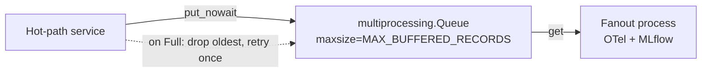

## Drop-Oldest Fanout Queue

`OTelMetricsResultsProcessor` fans out metric events to a dedicated child
process via a bounded `multiprocessing.Queue`. The queue uses drop-oldest
semantics so the hot path (the main benchmark loop) is never blocked by a slow
downstream consumer.



**Queue sizing:**

```python
import multiprocessing as mp
from aiperf.common.config import Environment

event_queue = mp.Queue(maxsize=Environment.OTEL.MAX_BUFFERED_RECORDS)  # default 10 000
```

**Backpressure algorithm:**

1. Attempt `queue.put_nowait(event)`.
2. On `queue.Full`, call `queue.get_nowait()` to discard the oldest event.
3. Retry `queue.put_nowait(event)` once.
4. If the retry also fails, increment `_fanout_dropped_events` and log at
   thresholds (1, 100, 1 000 drops).

```python
from queue import Empty, Full

def _queue_fanout_event(self, event_type: str, payload: dict[str, Any]) -> None:
    """Enqueue streaming event for the fanout process without blocking the event loop."""
    if self._fanout_queue is None:
        return

    event = {"type": event_type, "payload": payload}
    try:
        self._fanout_queue.put_nowait(event)
        self._fanout_sent_events += 1
    except Full:
        if self._drop_oldest_fanout_event():
            try:
                self._fanout_queue.put_nowait(event)
                self._fanout_sent_events += 1
                return
            except Full:
                pass
        self._record_fanout_drop(
            "OTel fanout queue remained full; dropping newest event"
        )
    except Exception as exc:
        self.warning(f"Failed to enqueue OTel fanout event: {exc!r}")
```

**Design rationale:**
- The benchmark hot path must never block on telemetry I/O.
- Dropping the oldest event (rather than the newest) preserves the most recent
  state, which is more useful for live dashboards.
- The counter `_fanout_dropped_events` is reported at shutdown so operators can
  tune `AIPERF_OTEL_MAX_BUFFERED_RECORDS` if drops are frequent.

