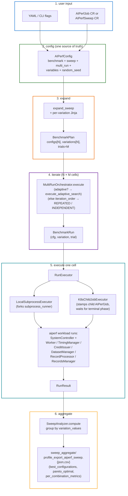
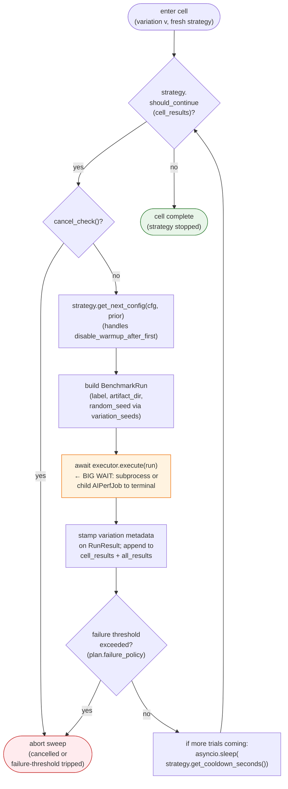
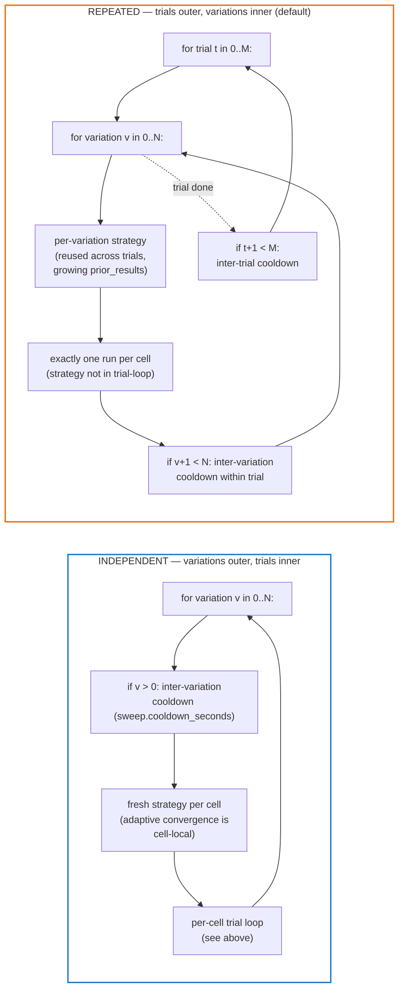
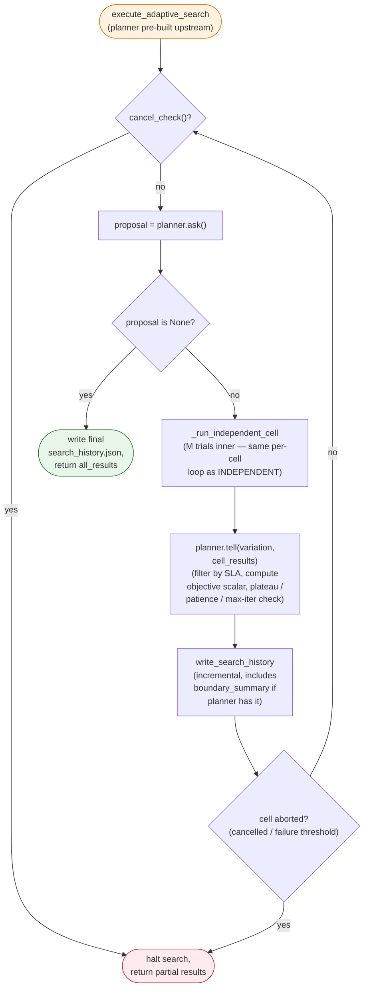
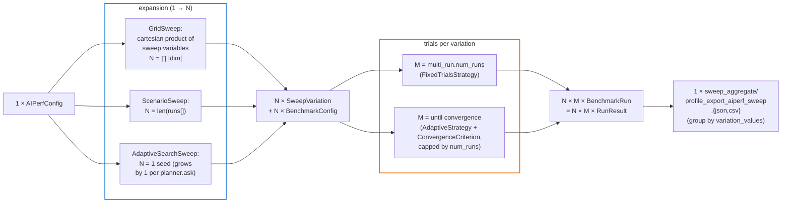
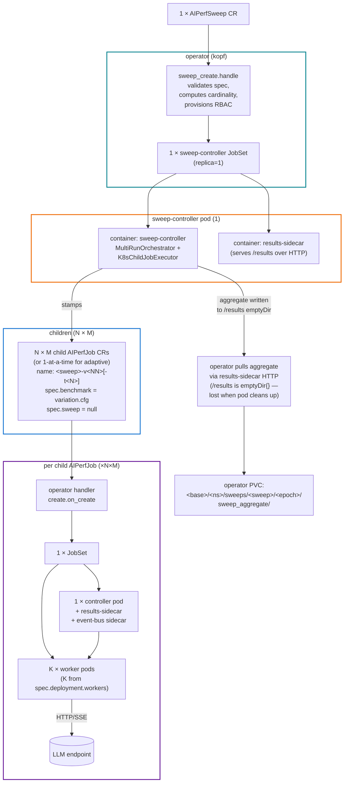

<!--
SPDX-FileCopyrightText: Copyright (c) 2025-2026 NVIDIA CORPORATION & AFFILIATES. All rights reserved.
SPDX-License-Identifier: Apache-2.0
-->

# Sweep architecture — overview

A one-page mental model for how AIPerf turns a config into a pile of benchmark results, whether you run it locally or on a Kubernetes cluster. For deep dives (per-handler kopf wiring, status field shapes, per-method signatures) see [sweep-orchestrator-flow.md](sweep-orchestrator-flow.md).

## The big idea

Every AIPerf run — single benchmark, parameter grid, or Bayesian search — is the same pipeline with different cardinalities:

```
config → expand into N variations → run each variation M trials → aggregate
```

The **same** `BenchmarkPlan` / `MultiRunOrchestrator` / `RunExecutor` machinery powers `aiperf profile` (local), `AIPerfJob` (one cluster benchmark), and `AIPerfSweep` (cluster sweep). The only thing that swaps is the executor: subprocess vs. child Kubernetes job.

## Three execution paths

| Path | Trigger | Where the orchestrator runs | Per-cell executor |
|---|---|---|---|
| **Local** | `aiperf profile -c config.yaml` | Same Python process | `LocalSubprocessExecutor` (forks `aiperf.orchestrator.subprocess_runner`) |
| **AIPerfJob** | `kubectl apply` an `AIPerfJob` CR | N/A — single-config plan, no orchestrator needed | (executor not used; controller pod runs the benchmark directly) |
| **AIPerfSweep** | `kubectl apply` an `AIPerfSweep` CR | Sweep-controller pod (always spawned) | `K8sChildJobExecutor` (stamps one child `AIPerfJob` per cell) |

`AIPerfJob` is "one benchmark, in a cluster." `AIPerfSweep` is "N benchmarks, parameterized, in a cluster" — and under the hood it just creates N (or N×M, with trials) `AIPerfJob` children.

## Key types

The whole flow uses about a dozen types. If you know these, you can read any sweep code.

- **`AIPerfConfig`** — top-level envelope. Holds a `BenchmarkConfig` body plus envelope-level knobs: `sweep`, `multi_run`, `variables`, `random_seed`.
- **`BenchmarkConfig`** — the actual benchmark settings (models, endpoint, datasets, phases, artifacts, …). The unit of "what to benchmark."
- **`SweepConfig`** — discriminated union (six variants, discriminated on `type`): `GridSweep` (cartesian over `variables`), `ZipSweep` (variables zipped in lockstep), `ScenarioSweep` (deep-merge `runs[i]`), `AdaptiveSearchSweep` (BO / monotonic), `SobolSweep`, and `LatinHypercubeSweep` (quasi-Monte-Carlo samplers over `dimensions`).
- **`MultiRunConfig`** — trial mechanics: `num_runs` (= trials per variation), cooldown, optional `convergence: ConvergenceConfig`.
- **`SweepVariation`** — `{index, label, values}`. One per variation; carries the parameter values that differ from base.
- **`BenchmarkPlan`** — the "expanded" form: `configs[N]`, `variations[N]`, `trials=M`, plus the originating `sweep` + `multi_run`. Output of `build_benchmark_plan`.
- **`BenchmarkRun`** — one cell: `(cfg, variation, trial, artifact_dir)`. The smallest unit of work.
- **`RunResult`** — `{success, summary_metrics, artifacts_path, variation_label, variation_values, trial_index, error}`. One per `BenchmarkRun`.
- **`MultiRunOrchestrator`** — drives the N×M loop. Picks REPEATED (trials outer) or INDEPENDENT (variations outer) based on `sweep.iteration_order`; dispatches to `execute_adaptive_search` if the sweep is adaptive.
- **`RunExecutor`** — ABC with `execute(run) -> RunResult`. Two implementations: `LocalSubprocessExecutor`, `K8sChildJobExecutor`.
- **`SweepAnalyzer`** — post-hoc aggregator. Groups `list[RunResult]` by `variation_values`; produces `best_configurations`, `pareto_optimal`, `per_combination_metrics`. Written to `sweep_aggregate/profile_export_aiperf_sweep.{json,csv}`.

## End-to-end flow



The flow is identical regardless of where it runs. Local: the subprocess at step 5 forks on the same machine. Cluster sweep: the orchestrator at step 4 lives inside a sweep-controller pod, and step 5 stamps a child `AIPerfJob` (which is itself a `JobSet` with a controller pod + worker pods + LLM endpoint).

## What happens between runs (per-cell loop)

A "cell" is one `(variation, trial)` slot. Inside a cell, an `ExecutionStrategy` decides whether to keep going. `FixedTrialsStrategy` stops after M trials. `AdaptiveStrategy` keeps going until its `ConvergenceCriterion` is met (or a hard cap). Around each `executor.execute(run)`, the orchestrator threads cancel-checking, sweep-wide failure thresholds, and inter-run cooldowns.



The strategy is fresh per cell in INDEPENDENT mode, so adaptive trial-convergence resets between variations. In REPEATED mode there's only one trial per cell — the "outer trial loop" replays the whole grid.

## REPEATED vs INDEPENDENT — loop nesting

Two ways to interleave variations and trials. `sweep.iteration_order` picks; default is REPEATED.



Why two modes? REPEATED interleaves trials across variations so transient cluster effects (warm caches, thermal drift) hit every variation similarly — better for cross-variation comparison. INDEPENDENT runs one variation to completion before moving on — required for convergence-based adaptive trials, since a strategy needs to observe all of one cell's results in sequence.

## Adaptive outer loop (ask / tell)

Adaptive search is the same pipeline with one swap: instead of "expand a fixed grid into N configs up front," the planner *generates* configs one at a time, learning from each result.

- The sweep block is `AdaptiveSearchSweep` (`type: adaptive_search`) instead of `GridSweep` / `ScenarioSweep`.
- `BenchmarkPlan.configs` starts with one seed config; the planner extends it as it asks.
- `MultiRunOrchestrator` dispatches to `execute_adaptive_search`, which runs `planner.ask() → execute trials → planner.tell(results)` until `planner.ask()` returns `None` (or cancellation / abort).
- Four planner plugins ship: `BayesianSearchPlanner` (curated Optuna+BoTorch preset, subclass of `OptunaSearchPlanner`), `OptunaSearchPlanner` (Optuna TPE / GP / BoTorch backends), `MonotonicSLASearchPlanner` (1D probe + bisection), and `SmoothIsotonicSLAPlanner` (1D PAVA + PCHIP isotonic regression).
- Optional `search_recipe` plugins build the whole `AdaptiveSearchSweep` from a higher-level recipe (e.g. `max-concurrency-under-sla`, `prefill-ttft-curve`).
- An optional `post_process` handler (`degradation_knee_detect`, `ttft_curve_fit`, `itl_surface_fit`, `sla_breach_knee`) runs after the final iteration.
- Cluster sweeps and adaptive search compose naturally: the sweep-controller pod's orchestrator drives the planner, and each `ask()` becomes a stamped child `AIPerfJob`.



Each iteration adds one `SearchIteration` to `planner.history()`. Convergence terminates the loop via `planner.ask()` returning `None`; the reason (plateau / improvement-patience / max-iterations) comes from `planner.convergence_reason()`. `search_history.json` is rewritten after every iteration so a crashed sweep still has a usable trail.

## Fan-out math

The cardinality of any sweep is `N variations × M trials = N×M cells`. Where N and M come from depends on the path.



For adaptive search, `N` is the iteration count: bounded above by `max_iterations`, possibly less if the planner converges early. `M` (trials per iteration) still applies — adaptive runs M trials per planner-proposed point, then `tell()`s the planner the aggregate.

## K8s fan-out — what gets stamped where

`AIPerfSweep` is the fan-out apex. The operator never stamps benchmark workloads directly — it spawns one sweep-controller pod, and *that* pod's orchestrator stamps child `AIPerfJob` CRs. Each child `AIPerfJob` is itself a fan-out: the operator sees it and produces a `JobSet` with a controller pod + N worker pods.



Two things that surprise people:

1. The sweep-controller pod's `/results` is `emptyDir{}`, not a PVC. The operator must harvest the aggregate via the results-sidecar's HTTP API before the JobSet's TTL reaper deletes the pod, or the data is gone. Fetched on `status.aggregation.phase` flipping to `Complete`.
2. Each child `AIPerfJob` runs on its own JobSet with its own controller + workers + LLM. So an N×M sweep with K workers per benchmark uses N×M×(1+K) pods plus the one sweep-controller pod. Plan capacity accordingly.

## Where it lives

| Concept | File |
|---|---|
| Envelope + body (`AIPerfConfig`, `BenchmarkConfig`) | `src/aiperf/config/config.py` |
| Multi-run / trials (`MultiRunConfig`) | `src/aiperf/config/sweep/multi_run.py` |
| Sweep variants + expansion | `src/aiperf/config/sweep/{config,expand}.py` |
| Plan loader (CLI/YAML → plan) | `src/aiperf/config/loader/plan.py` |
| Orchestrator | `src/aiperf/orchestrator/orchestrator.py` |
| Executors | `src/aiperf/orchestrator/{executor,local_executor}.py`, `src/aiperf/sweep_controller/k8s_executor.py` |
| Aggregation | `src/aiperf/orchestrator/aggregation/sweep.py` |
| Search planners + recipes | `src/aiperf/orchestrator/search_planner/`, `src/aiperf/search_recipes/` |
| Operator (kopf handlers) | `src/aiperf/operator/main.py`, `src/aiperf/operator/handlers/` |
| Sweep-controller pod entrypoint | `src/aiperf/sweep_controller/main.py` |

For the full diagrams (kopf decorators, status field shapes, child-name patterns, plugin category list), see [sweep-orchestrator-flow.md](sweep-orchestrator-flow.md).
