<!--
SPDX-FileCopyrightText: Copyright (c) 2025-2026 NVIDIA CORPORATION & AFFILIATES. All rights reserved.
SPDX-License-Identifier: Apache-2.0
-->

# Sweep / Job / Orchestrator flow

End-to-end view of how a YAML config or a CRD becomes an `AIPerfConfig` envelope, expands into a `BenchmarkPlan`, and is executed by `MultiRunOrchestrator` against a backend `RunExecutor`. Multiple zoom levels — pick whichever matches what you're trying to understand.

> **Schema-2.0 note (May 2026).** Some inset diagrams below still label
> fields with their pre-redesign names: `parameter_sweep_mode` /
> `parameter_sweep_*` (now `sweep.iteration_order` / `sweep.cooldown_seconds`
> / `sweep.same_seed`), `MultiRunConfig.adaptive_search` (now
> `AIPerfConfig.sweep` with `type: adaptive_search`), and
> `BenchmarkPlan.adaptive_search` (now `BenchmarkPlan.sweep`, accessed via
> `BenchmarkPlan.is_adaptive_search`). The high-level flow — `AIPerfConfig`
> envelope -> `BenchmarkPlan` -> `MultiRunOrchestrator` dispatch -> backend
> executor — is unchanged.

The same `BenchmarkPlan` / `MultiRunOrchestrator` / `RunExecutor` machinery powers both local (`aiperf profile`) and Kubernetes (`AIPerfJob`, `AIPerfSweep`) execution. The only swap is which `RunExecutor` implementation the controller picks.

## 1. 30,000 ft — what happens, period

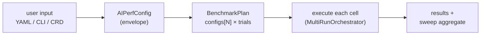

## 2. 10,000 ft — local vs K8s, same core

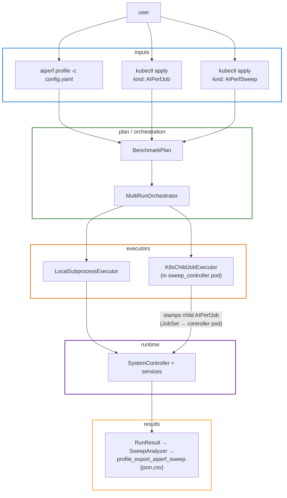

## 3. 5,000 ft — three lanes (local, single AIPerfJob, AIPerfSweep)

```mermaid
%%{init: {'flowchart': {'nodeSpacing': 60, 'rankSpacing': 80, 'padding': 18, 'htmlLabels': true, 'curve': 'basis'}, 'themeVariables': {'fontSize': '17px'}}}%%
flowchart TD
    subgraph LOCAL["local"]
        L1["YAML / CLI"] --> L2["AIPerfConfig"] --> L3["BenchmarkPlan"]
        L3 --> L4["MultiRunOrchestrator<br/>+ LocalSubprocessExecutor"]
        L4 --> L5["controller subprocess"]
        L5 --> L6["RunResults → aggregate"]
    end

    subgraph SINGLE["AIPerfJob"]
        S1["AIPerfJob CR"] --> S2["handlers/create.py"]
        S2 --> S3["JobSet"] --> S4["controller pod<br/>aiperf profile<br/>(single-config plan)"]
        S4 --> S5["AIPerfJob.status"]
    end

    subgraph SWEEP["AIPerfSweep"]
        W1["AIPerfSweep CR"] --> W2["handlers/sweep/create.py<br/>(always spawns sweep-controller)"]
        W2 --> W3["sweep_controller pod<br/>MultiRunOrchestrator<br/>+ K8sChildJobExecutor"]
        W3 -->|stamps N| W4["child AIPerfJob CRs"]
        W4 --> W5["each: handlers/create.py<br/>→ JobSet → controller pod"]
        W5 --> W6["AIPerfSweep.status<br/>(rollup)"]
    end

    style LOCAL fill:transparent,stroke:#2e7d32,stroke-width:2px,stroke-dasharray:0
    style SINGLE fill:transparent,stroke:#1976d2,stroke-width:2px,stroke-dasharray:0
    style SWEEP fill:transparent,stroke:#ef6c00,stroke-width:2px,stroke-dasharray:0
```

## 4. Sub-flow — config layer (YAML/CLI → BenchmarkPlan)

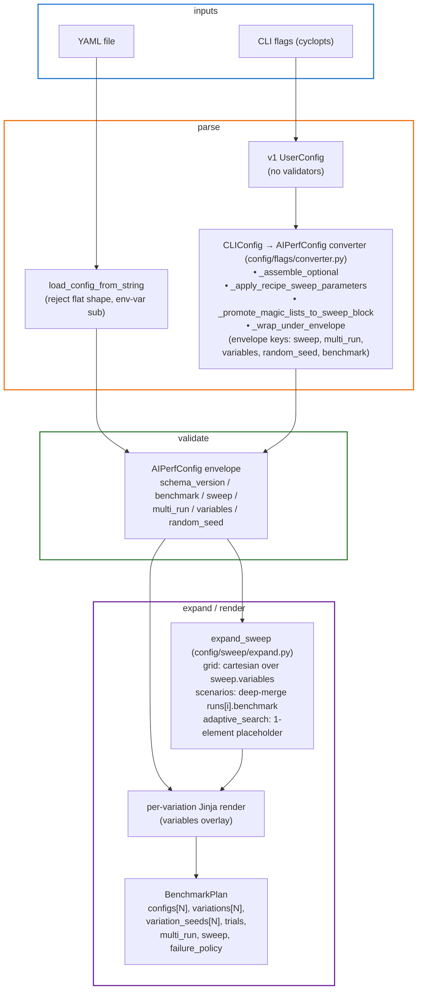

## 5. Sub-flow — orchestrator iteration

`cli_runner.run_benchmark` peels off single-run plans (`plan.is_single_run`) before the orchestrator is constructed; only multi-run plans reach `MultiRunOrchestrator.execute`. Inside `execute()`, dispatch is two-way: adaptive-search vs. grid/scenarios. Grid/scenarios further branch on `_plan_iteration_order(plan)` which reads `plan.sweep.iteration_order` (REPEATED default, or INDEPENDENT) — there is no `parameter_sweep_mode` field on `BenchmarkPlan`.

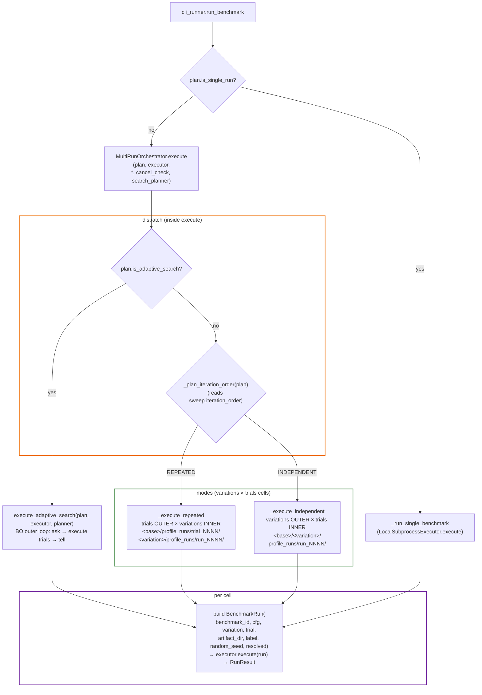

## 6. Sub-flow — RunExecutor backends

`RunExecutor` is a 2-method ABC: `execute(run) -> RunResult` and `derive_id(plan, var_idx, trial) -> str`. Local picks a fresh hex id; K8s computes the child-job name and reuses it as the id.

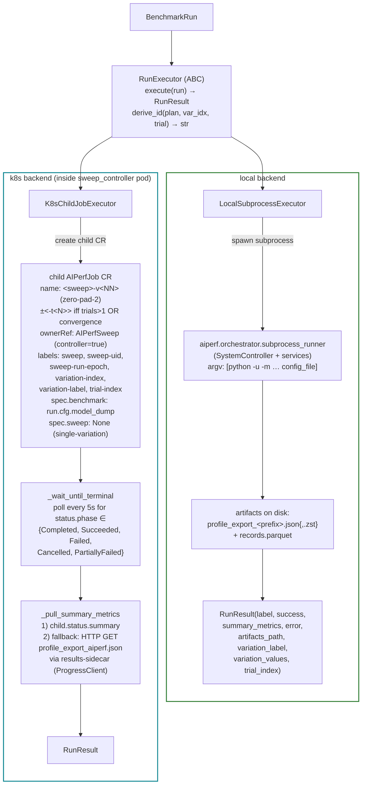

`needs_trial_suffix(trials, has_convergence)` (`sweep_controller/_naming.py`) is the source of truth on `-t<N>`: it fires whenever `trials > 1` **or** `multi_run.convergence` is set. INDEPENDENT mode does not, by itself, change the naming rule.

## 7. Sub-flow — inside one BenchmarkRun (service mesh)

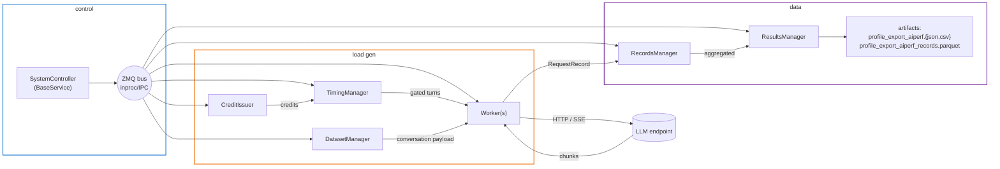

## 8. Sub-flow — K8s AIPerfSweep stamping

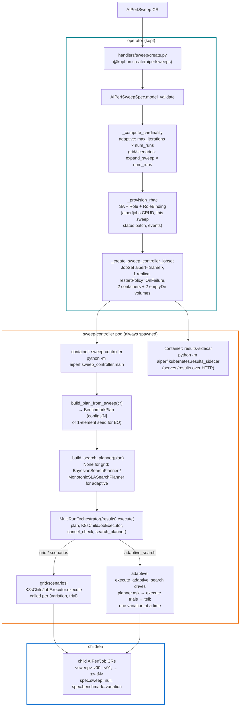

## 9. Sub-flow — K8s AIPerfJob → controller pod

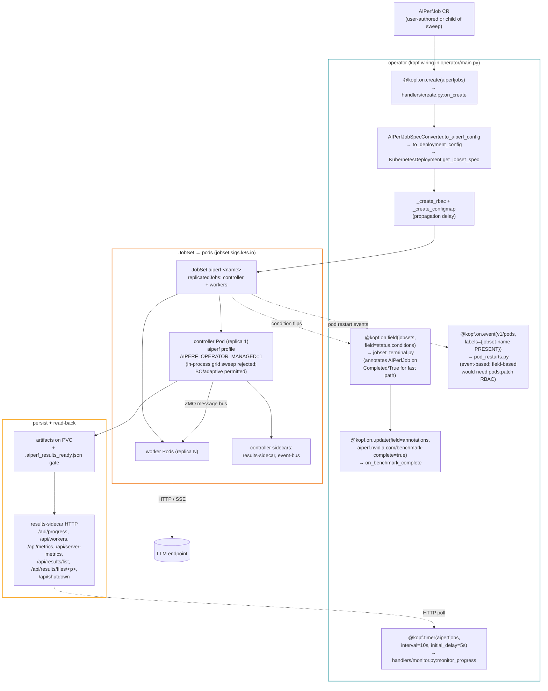

## 10. Sub-flow — status & rollup

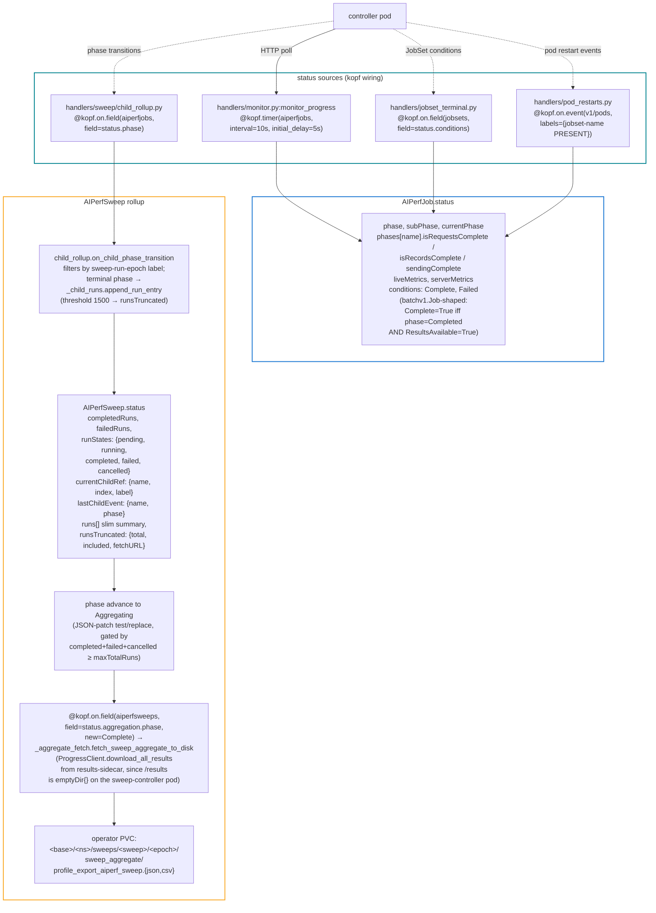

## 11. Class / module map

```mermaid
%%{init: {'class': {'titleTopMargin': 25}, 'themeVariables': {'fontSize': '15px'}}}%%
classDiagram
    class AIPerfConfig {
        schema_version: Literal["2.0"]
        benchmark: BenchmarkConfig
        sweep: SweepConfig | None
        multi_run: MultiRunConfig
        variables: dict[str, Any]
        random_seed: int | None
    }
    class BenchmarkConfig {
        models, endpoint, datasets, phases
        artifacts, slos, tokenizer
        gpu_telemetry, server_metrics
        runtime, logging, metrics, accuracy
    }
    class SweepConfig {
        <<discriminated union>>
        type: grid | scenarios | adaptive_search
    }
    class GridSweep {
        type: "grid"
        variables: dict[str, list]
        iteration_order: REPEATED | INDEPENDENT
        same_seed: bool
        cooldown_seconds, sla_filters,
        post_process
    }
    class ScenarioSweep {
        type: "scenarios"
        runs: list[dict]
        iteration_order, same_seed,
        cooldown_seconds, sla_filters,
        post_process
    }
    class AdaptiveSearchSweep {
        type: "adaptive_search"
        algorithm: "bayes"
        planner: SearchPlannerType
        search_space: list[SearchSpaceDimension]
        objective: AdaptiveObjective
        max_iterations, n_initial_points
        plateau_window, plateau_threshold
        improvement_patience, random_seed
        recipe_name, optuna_sampler
        monotonic_stability_trials
        constraint_mode
        cooldown_seconds, sla_filters,
        post_process
    }
    class SweepVariation {
        index: int
        label: str
        values: dict[str, Any]
    }
    class MultiRunConfig {
        num_runs: int
        cooldown_seconds: float
        confidence_level: float
        set_consistent_seed: bool
        disable_warmup_after_first: bool
        convergence: ConvergenceConfig | None
    }
    class ConvergenceConfig {
        metric, stat, mode,
        threshold, min_runs
    }

    class BenchmarkPlan {
        configs: list[BenchmarkConfig]
        variations: list[SweepVariation]
        variation_seeds: list[int | None]
        trials: int
        cooldown_seconds, confidence_level
        set_consistent_seed
        disable_warmup_after_first
        random_seed, variables
        export_level, export_jsonl_file
        multi_run: MultiRunConfig
        sweep: SweepConfig | None
        failure_policy: FailurePolicy | None
        use_adaptive (prop)
        is_single_run / is_sweep /
        is_adaptive_search (props)
    }
    class BenchmarkRun {
        benchmark_id: str
        cfg: BenchmarkConfig
        variation: SweepVariation | None
        trial: int
        artifact_dir: Path
        label: str
        random_seed: int | None
        resolved: ResolvedConfig
    }
    class RunResult {
        label: str
        success: bool
        summary_metrics: dict[str, JsonMetricResult]
        error: str | None
        artifacts_path: Path | None
        variation_label: str
        variation_values: dict[str, Any]
        trial_index: int
    }

    class MultiRunOrchestrator {
        base_dir: Path
        execute(plan, executor, *,
        cancel_check, search_planner)
        execute_adaptive_search(plan,
        executor, planner, *, cancel_check)
    }
    class RunExecutor {
        <<abstract>>
        execute(run) RunResult
        derive_id(plan, var_idx, trial) str
    }
    class LocalSubprocessExecutor
    class K8sChildJobExecutor
    class SweepAnalyzer {
        compute(per_combination_stats,
        sweep_parameters, sla_filters?)
    }

    AIPerfConfig --> BenchmarkConfig : benchmark
    AIPerfConfig --> SweepConfig : sweep
    AIPerfConfig --> MultiRunConfig : multi_run
    MultiRunConfig --> ConvergenceConfig : convergence
    SweepConfig <|-- GridSweep
    SweepConfig <|-- ScenarioSweep
    SweepConfig <|-- AdaptiveSearchSweep

    BenchmarkPlan --> BenchmarkConfig : configs[]
    BenchmarkPlan --> SweepVariation : variations[]
    BenchmarkPlan --> MultiRunConfig : multi_run
    BenchmarkPlan --> SweepConfig : sweep
    BenchmarkRun --> BenchmarkConfig : cfg
    BenchmarkRun --> SweepVariation : variation

    MultiRunOrchestrator ..> BenchmarkPlan : reads
    MultiRunOrchestrator ..> BenchmarkRun : builds
    MultiRunOrchestrator ..> RunExecutor : delegates
    RunExecutor <|-- LocalSubprocessExecutor
    RunExecutor <|-- K8sChildJobExecutor
    RunExecutor ..> RunResult : returns

    SweepAnalyzer ..> RunResult : aggregates
```

## 12. Sequence — a sweep run end to end

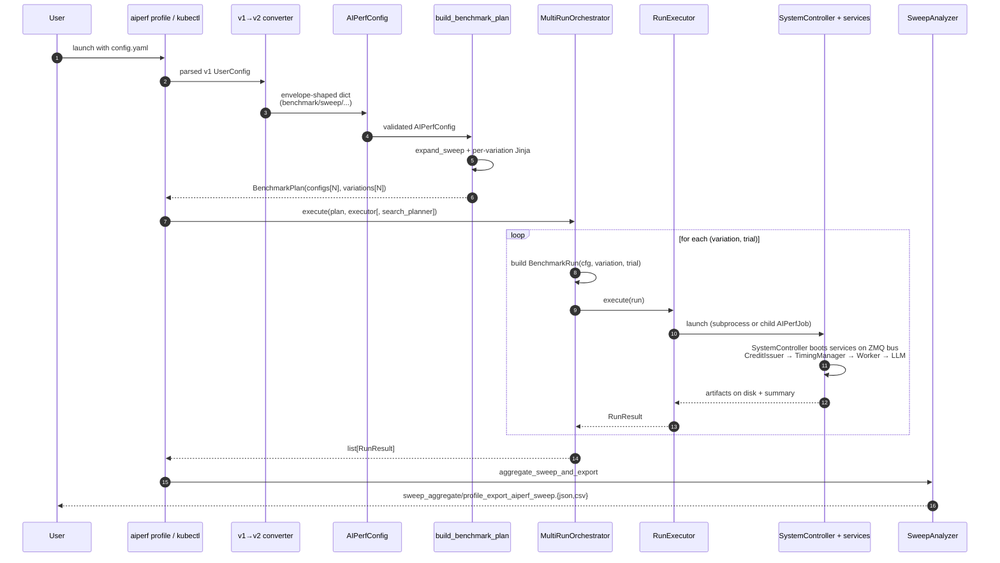

## 13. Where to look in the code

| Concept | File |
|---|---|
| `AIPerfConfig` envelope, `BenchmarkConfig` body | `src/aiperf/config/config.py` |
| `BenchmarkPlan`, `BenchmarkRun`, `ResolvedConfig` | `src/aiperf/config/resolution/plan.py` |
| `MultiRunConfig`, `ConvergenceConfig` | `src/aiperf/config/sweep/multi_run.py` |
| `SweepConfig` union / `GridSweep` / `ScenarioSweep` / `AdaptiveSearchSweep` / `AdaptiveObjective` / `SweepVariation` | `src/aiperf/config/sweep/config.py` |
| `expand_sweep` (definition) | `src/aiperf/config/sweep/expand.py` (re-exported from the `sweep` package) |
| `SearchSpaceDimension`, `SLAFilter` | `src/aiperf/config/sweep/adaptive.py` |
| `PostProcessSpec`, `SearchRecipe`, `SearchRecipeContext`, `SearchRecipeOutput` | `src/aiperf/search_recipes/_base.py` |
| `PostProcessHandler` Protocol + built-ins | `src/aiperf/search_recipes/post_process.py` |
| `build_benchmark_plan` (load → plan) | `src/aiperf/config/loader/plan.py` |
| CLIConfig→AIPerfConfig converter | `src/aiperf/config/flags/converter.py` |
| `MultiRunOrchestrator` | `src/aiperf/orchestrator/orchestrator.py` |
| `RunExecutor` ABC + `RunResult` | `src/aiperf/orchestrator/executor.py`, `src/aiperf/orchestrator/models.py` |
| `LocalSubprocessExecutor` | `src/aiperf/orchestrator/local_executor.py` |
| Subprocess runner entry (`python -m`) | `src/aiperf/orchestrator/subprocess_runner.py` |
| `K8sChildJobExecutor`, `derive_child_name`, `needs_trial_suffix` | `src/aiperf/sweep_controller/{k8s_executor,_naming}.py` |
| `build_plan_from_sweep` (CR → plan, in-pod) | `src/aiperf/sweep_controller/plan_builder.py` |
| `sweep_controller` entrypoint | `src/aiperf/sweep_controller/main.py` |
| `SearchPlanner` ABC + `SearchIteration` | `src/aiperf/orchestrator/search_planner/base.py` |
| `BayesianSearchPlanner` / `MonotonicSLASearchPlanner` / `OptunaSearchPlanner` | `src/aiperf/orchestrator/search_planner/{bayesian,monotonic,optuna_planner}.py` |
| `parse_sla_filter`, `parse_search_space` | `src/aiperf/orchestrator/search_planner/parsing.py` |
| `SweepAnalyzer` + exporters | `src/aiperf/orchestrator/aggregation/sweep.py` |
| `aggregate_sweep_and_export` (file writer) | `src/aiperf/cli_runner/_sweep_aggregate.py` |
| `write_search_history` | `src/aiperf/exporters/search_history.py` |
| `run_benchmark` (single vs multi dispatch) + `_reject_in_process_sweep_under_operator` | `src/aiperf/cli_runner/` (`__init__.py`, `_multi_run.py`) |
| Operator kopf wiring | `src/aiperf/operator/main.py` |
| AIPerfJob create / monitor / completion handlers | `src/aiperf/operator/handlers/{create,monitor,completion}.py` |
| JobSet terminal-condition + pod-restart watchers | `src/aiperf/operator/handlers/{jobset_terminal,pod_restarts}.py` |
| AIPerfSweep handlers (stamp children, rollup, aggregate fetch, lifecycle) | `src/aiperf/operator/handlers/sweep/{create,child_rollup,_aggregate_fetch,lifecycle,_child_runs}.py` |
| Plugin registry + categories | `src/aiperf/plugin/{_registry,categories.yaml,metadata.py,plugins.py}` |

## 14. Plugin system — registration & lookup

Every extensible feature in AIPerf is a registered plugin: services, datasets, exporters, telemetry, convergence criteria, search planners, UIs. Built-ins live in `plugins.yaml`; third parties register via setuptools entry points and can override built-ins by priority.

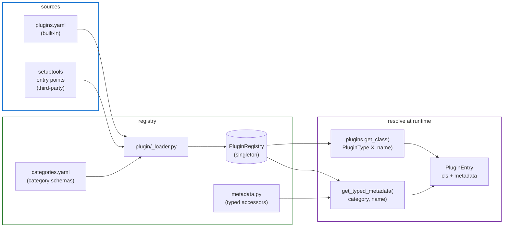

## 15. Plugin categories — grouped by domain

Each category has a Pydantic `metadata_class` and a typical interface (Protocol or ABC). New built-ins land as a `plugins.yaml` entry plus an implementation class; third-party wheels register an entry point and override by priority.

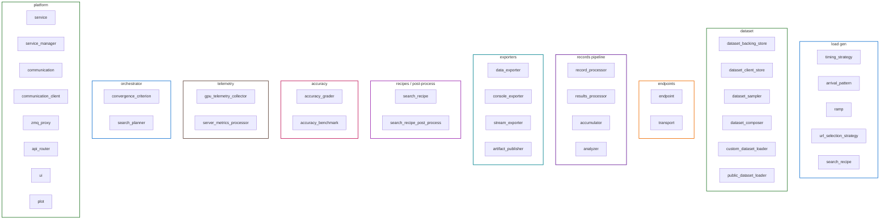

The full registry has 37 categories (see `src/aiperf/plugin/categories.yaml`). All are reachable via `plugins.get_class(PluginType.X, name)`; per-category typed metadata via `get_typed_metadata(category, name)` is available for `endpoint`, `transport`, `plot`, `service`, `custom_dataset_loader`, `convergence_criterion`, `search_planner` (others fall back to the raw metadata dict).

## 16. ABC hierarchy — orchestrator-side

The orchestrator layer's extension points are abstract base classes; implementations are registered as plugins or instantiated directly by category-aware factories.

```mermaid
%%{init: {'flowchart': {'nodeSpacing': 60, 'rankSpacing': 80, 'padding': 18, 'htmlLabels': true, 'curve': 'basis'}, 'themeVariables': {'fontSize': '17px'}}}%%
flowchart TB
    subgraph EXEC["execute a BenchmarkRun"]
        re["RunExecutor (ABC)<br/>execute(run) → RunResult"]
        loc["LocalSubprocessExecutor"]
        k8s["K8sChildJobExecutor"]
        re --> loc
        re --> k8s
    end

    subgraph STRAT["per-cell control"]
        es["ExecutionStrategy (ABC)<br/>validate_config / should_continue / record_result"]
        ft["FixedTrialsStrategy"]
        cv["ConvergenceStrategy"]
        es --> ft
        es --> cv
    end

    subgraph CONV["convergence"]
        cc["ConvergenceCriterion (ABC)<br/>from_plan / update / converged"]
        ci["CIWidthConvergence"]
        cvc["CVConvergence"]
        dc["DistributionConvergence"]
        cc --> ci
        cc --> cvc
        cc --> dc
    end

    subgraph SEARCH["adaptive search"]
        sp["SearchPlanner (ABC)<br/>propose_next / record / converged"]
        bo["BayesianSearchPlanner<br/>(skopt)"]
        sp --> bo
    end

    subgraph AGG["aggregation"]
        as["AggregationStrategy (ABC)<br/>aggregate / metric_keys"]
        sa["SweepAnalyzer<br/>(post-hoc analyzer)"]
        as --> sa
    end

    subgraph DATAS["dataset"]
        bds["BaseDatasetSampler (ABC)<br/>sample"]
        bds --> rng["RandomSampler / SeqSampler / …"]
    end

    style EXEC fill:transparent,stroke:#1976d2,stroke-width:2px
    style STRAT fill:transparent,stroke:#ef6c00,stroke-width:2px
    style CONV fill:transparent,stroke:#2e7d32,stroke-width:2px
    style SEARCH fill:transparent,stroke:#6a1b9a,stroke-width:2px
    style AGG fill:transparent,stroke:#00838f,stroke-width:2px
    style DATAS fill:transparent,stroke:#c2185b,stroke-width:2px
```

## 17. Service / lifecycle base classes

Every long-running component descends from `BaseService` (orchestrator only) or `BaseComponentService` (workers, managers). `AIPerfLifecycleMixin` powers the standalone components that don't run as services.

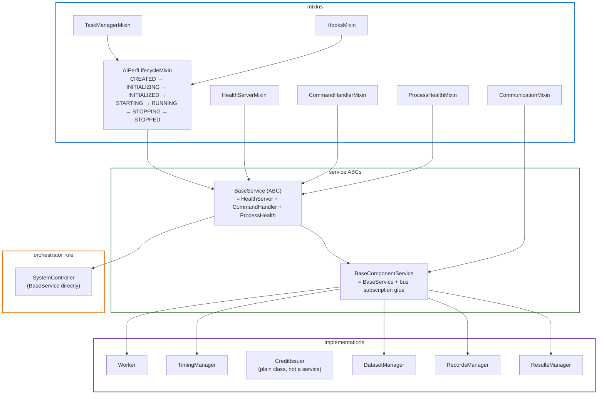

## 18. Protocol map — what each Protocol abstracts

Protocols are AIPerf's "structural typing" lever: any class shaped like the Protocol satisfies it without inheritance. Reach for them when you want plugin polymorphism without forcing a base class.

```mermaid
%%{init: {'flowchart': {'nodeSpacing': 50, 'rankSpacing': 70, 'padding': 16, 'htmlLabels': true, 'curve': 'basis'}, 'themeVariables': {'fontSize': '16px'}}}%%
flowchart TB
    subgraph DATA["dataset"]
        cdl["CustomDatasetLoaderProtocol"]
        pdl["PublicDatasetLoaderProtocol"]
        dss["DatasetSamplingStrategyProtocol"]
    end

    subgraph END["endpoints / transport"]
        ept["EndpointProtocol"]
        isr["InferenceServerResponse"]
        cred["CreditRouterProtocol"]
    end

    subgraph TIM["timing"]
        ig["IntervalGeneratorProtocol"]
        uss["URLSelectionStrategyProtocol"]
    end

    subgraph PIPE["records pipeline"]
        ar["AccumulatorResult"]
        ap["AccumulatorProtocol"]
        an["AnalyzerProtocol"]
        sep["StreamExporterProtocol"]
    end

    subgraph EXP["exporters"]
        cep["ConsoleExporterProtocol"]
        dep["DataExporterProtocol"]
        app["ArtifactPublisherProtocol"]
    end

    subgraph ACC["accuracy"]
        agp["AccuracyGraderProtocol"]
        abp["AccuracyBenchmarkProtocol"]
    end

    subgraph TEL["telemetry"]
        gtcp["GPUTelemetryCollectorProtocol"]
        gtpp["GPUTelemetryProcessorProtocol"]
        smpp["ServerMetricsProcessorProtocol"]
    end

    subgraph PLAT["platform"]
        mcp["MessageCodecProtocol"]
        alp["AIPerfLoggerProtocol"]
        wr["WatchRenderer"]
        wds["WatchdogDataSource"]
        pth["PlotTypeHandlerProtocol"]
    end

    style DATA fill:transparent,stroke:#2e7d32,stroke-width:2px
    style END fill:transparent,stroke:#1976d2,stroke-width:2px
    style TIM fill:transparent,stroke:#ef6c00,stroke-width:2px
    style PIPE fill:transparent,stroke:#6a1b9a,stroke-width:2px
    style EXP fill:transparent,stroke:#00838f,stroke-width:2px
    style ACC fill:transparent,stroke:#c2185b,stroke-width:2px
    style TEL fill:transparent,stroke:#5d4037,stroke-width:2px
    style PLAT fill:transparent,stroke:#455a64,stroke-width:2px
```

## 19. Plugin lookup — runtime sequence

How a registered plugin gets instantiated at run time. Same flow regardless of whether it's a built-in (`plugins.yaml`) or third-party (entry point).

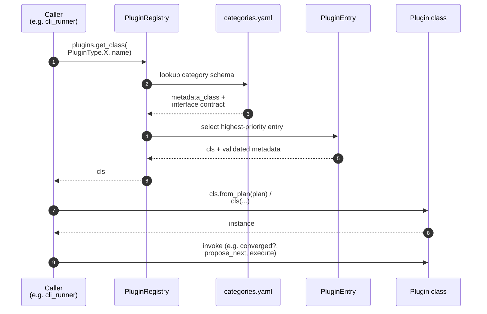

## 20. Plugin → ABC/Protocol cross-reference

Each plugin category points at the interface its implementations must satisfy. Categories under "ABC" are class-inheritance based (factory dispatches via `plugins.get_class`); categories under "Protocol" are structural (any matching shape is acceptable).

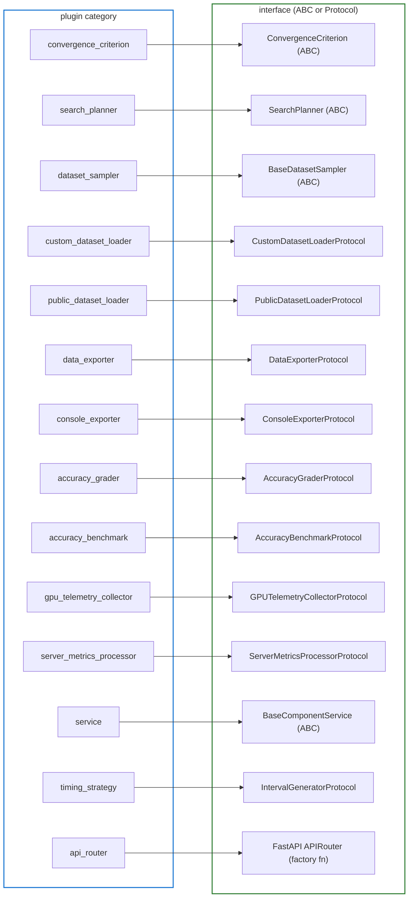

## 21. Sweep execution flow — class module map in motion

How the types from the §11 class diagram actually flow through a sweep run. Read it as: each box is an instance of a class from §11; arrows show what produces what; cardinality annotations make the fan-out explicit (1 plan → N variations × M trials → N×M results → 1 aggregate).

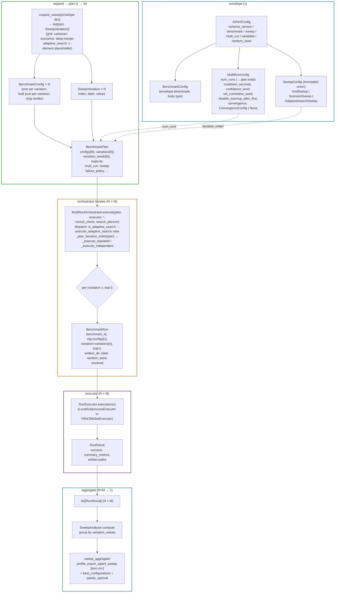

```mermaid
%%{init: {'sequence': {'actorMargin': 60, 'boxMargin': 18, 'noteMargin': 12, 'messageMargin': 40}, 'themeVariables': {'fontSize': '16px'}}}%%
sequenceDiagram
    autonumber
    participant Cfg as AIPerfConfig
    participant Loader as build_benchmark_plan
    participant Sweep as expand_sweep
    participant Plan as BenchmarkPlan
    participant Orch as MultiRunOrchestrator
    participant Run as BenchmarkRun
    participant Exec as RunExecutor
    participant Res as RunResult
    participant Ana as SweepAnalyzer

    Cfg->>Loader: validated envelope<br/>(benchmark, sweep, multi_run, …)
    Loader->>Sweep: envelope dict (with `sweep` block)
    Sweep-->>Loader: [(BenchmarkConfig_v, SweepVariation_v) × N]
    Loader->>Plan: BenchmarkPlan(<br/>configs[N], variations[N],<br/>variation_seeds[N], trials=M,<br/>multi_run, sweep, failure_policy, …)
    Loader-->>Orch: plan
    Orch->>Orch: dispatch:<br/>plan.is_adaptive_search → execute_adaptive_search<br/>else _plan_iteration_order(plan) →<br/>REPEATED (_execute_repeated) /<br/>INDEPENDENT (_execute_independent)

    loop for each (variation v in 0..N, trial t in 0..M)
        Orch->>Run: BenchmarkRun(cfg=configs[v],<br/>variation=variations[v], trial=t,<br/>artifact_dir=…)
        Orch->>Exec: execute(run)
        Exec-->>Res: RunResult(success,<br/>summary_metrics, paths)
        Res-->>Orch: append to results
    end

    Orch-->>Ana: list[RunResult] (N × M)
    Ana->>Ana: group by variation.values<br/>compute best_configurations,<br/>pareto_optimal, per_combination_metrics
    Ana-->>Cfg: profile_export_aiperf_sweep.{json,csv}
```

The two views together: the **flowchart** shows cardinality and which class produces which (the data shape of a sweep); the **sequence** shows the temporal call pattern between the same classes. Both use only the types from the §11 class diagram — no module-internal helpers.

## 22. Adaptive search — class types

The adaptive search path layers atop the same `BenchmarkPlan` / `MultiRunOrchestrator` / `RunExecutor` core. Adaptive config is **not** a separate field — it's the `AdaptiveSearchSweep` variant of the `SweepConfig` discriminated union (`type: adaptive_search`). Two plugin categories cooperate: a `search_planner` (drives the outer loop) and an optional `search_recipe` (curates the search space / objective / post-process from a higher-level recipe template). The optional terminal `post_process` is a single `PostProcessSpec` resolved via `search_recipe_post_process` plugins.

```mermaid
%%{init: {'class': {'titleTopMargin': 25}, 'themeVariables': {'fontSize': '15px'}}}%%
classDiagram
    class AdaptiveSearchSweep {
        type: "adaptive_search"
        algorithm: "bayes"
        planner: SearchPlannerType
        search_space: list[SearchSpaceDimension]
        objective: AdaptiveObjective
        max_iterations: int
        n_initial_points: int
        plateau_window / plateau_threshold
        improvement_patience
        random_seed
        recipe_name
        optuna_sampler
        monotonic_stability_trials
        constraint_mode: penalty | eic
        cooldown_seconds (from _SweepBase)
        sla_filters: list[SLAFilter]
        post_process: PostProcessSpec | None
    }
    class AdaptiveObjective {
        metric: str
        stat: avg | p50 | p90 | p95 | p99
        direction: OptimizationDirection
    }
    class SearchSpaceDimension {
        path: str  (envelope-rooted)
        low / high
        type: int | float
        log: bool
    }
    class SLAFilter {
        metric: str
        stat: avg | p50 | p90 | p95 | p99
        op: lt | gt | le | ge
        threshold: float
    }
    class PostProcessSpec {
        handler: str  (plugin name)
        params: dict
    }

    class BenchmarkPlan {
        sweep: SweepConfig | None
        is_adaptive_search: bool
        (true iff isinstance(sweep,
        AdaptiveSearchSweep))
    }

    class SearchPlanner {
        <<abstract>>
        ask() (BenchmarkConfig, SweepVariation) | None
        tell(variation, results)
        is_converged() bool
        history() list[SearchIteration]
        convergence_reason() str | None  (default None, not abstract)
    }
    class BayesianSearchPlanner {
        skopt Optimizer (lazy import)
        constraint_mode: penalty / eic
        plateau / patience checks
    }
    class MonotonicSLASearchPlanner {
        1D exponential probe + bisection
        boundary_summary() dict
        (feasible_max / infeasible_min /
        first_breach)
    }
    class OptunaSearchPlanner {
        sampler: gp | tpe | botorch
    }
    class SearchIteration {
        iteration_idx: int
        variation_values: dict[str, Any]
        objective_value: float
        results: list[RunResult]
        feasible: bool
        non_monotonic_warning: str | None
    }

    class SearchRecipe {
        <<protocol>>
        name: ClassVar[str]
        description: ClassVar[str]
        expand(ctx) SearchRecipeOutput
    }
    class SearchRecipeContext {
        benchmark_config: BenchmarkConfig
        sla_targets: dict
        sweep_overrides: dict
    }
    class SearchRecipeOutput {
        adaptive_search: AdaptiveSearchSweep
        post_process: PostProcessSpec | None
    }

    class PostProcessHandler {
        <<protocol>>
        name / description: ClassVar[str]
        process(sweep_aggregate, params) dict
    }
    class DegradationKneeDetect
    class TTFTCurveFit
    class ItlSurfaceFit
    class SLABreachKnee

    class MultiRunOrchestrator {
        execute(plan, executor, *,
        cancel_check, search_planner)
        execute_adaptive_search(plan,
        executor, planner, *, cancel_check)
    }

    AdaptiveSearchSweep --> AdaptiveObjective : objective
    AdaptiveSearchSweep --> SearchSpaceDimension : search_space[]
    AdaptiveSearchSweep --> SLAFilter : sla_filters[]
    AdaptiveSearchSweep --> PostProcessSpec : post_process
    BenchmarkPlan --> AdaptiveSearchSweep : sweep
    SearchPlanner <|-- BayesianSearchPlanner
    SearchPlanner <|-- MonotonicSLASearchPlanner
    SearchPlanner <|-- OptunaSearchPlanner
    SearchPlanner ..> SearchIteration : history
    SearchPlanner ..> AdaptiveSearchSweep : configured by
    SearchRecipe ..> SearchRecipeContext : reads
    SearchRecipe ..> SearchRecipeOutput : returns
    SearchRecipeContext --> BenchmarkConfig : benchmark_config
    SearchRecipeOutput --> AdaptiveSearchSweep : produces
    SearchRecipeOutput --> PostProcessSpec : post_process
    PostProcessHandler <|.. DegradationKneeDetect
    PostProcessHandler <|.. TTFTCurveFit
    PostProcessHandler <|.. ItlSurfaceFit
    PostProcessHandler <|.. SLABreachKnee
    PostProcessSpec ..> PostProcessHandler : resolved via plugin

    MultiRunOrchestrator ..> BenchmarkPlan : reads
    MultiRunOrchestrator ..> SearchPlanner : drives ask/tell
```

Built-in `search_recipe` plugins (`src/aiperf/search_recipes/`):

- `max-throughput-ttft-sla`, `max-throughput-itl-sla`
- `concurrency-ramp`
- `prefill-ttft-curve`, `decode-itl-curve`
- `max-goodput-under-slo`, `max-concurrency-under-sla`

Built-in `search_recipe_post_process` plugins: `degradation_knee`, `ttft_curve_fit`, `itl_surface_fit`, `sla_breach_knee`.

## 23. Adaptive search — execution flow

The BO outer loop is a `propose → execute → record` cycle inside `MultiRunOrchestrator.execute_adaptive_search`. `BenchmarkRun` and `RunExecutor` are the same as in the grid path; the difference is that `BenchmarkPlan.configs` starts with one seed config and grows by one per iteration as the planner asks for the next point.

```mermaid
%%{init: {'sequence': {'actorMargin': 60, 'boxMargin': 18, 'noteMargin': 12, 'messageMargin': 40}, 'themeVariables': {'fontSize': '16px'}}}%%
sequenceDiagram
    autonumber
    participant Plan as BenchmarkPlan<br/>(sweep is AdaptiveSearchSweep)
    participant Orch as MultiRunOrchestrator
    participant Pl as SearchPlanner<br/>(Bayesian / Monotonic / Optuna)
    participant Run as BenchmarkRun
    participant Exec as RunExecutor
    participant Res as RunResult
    participant PP as PostProcessHandler
    participant Out as search_history.json /<br/>sweep_aggregate

    Orch->>Pl: planner instantiated upstream<br/>(_build_search_planner(plan))<br/>and passed into execute()

    loop until is_converged() or max_iterations
        Orch->>Pl: ask()
        Pl-->>Orch: (BenchmarkConfig_k, SweepVariation_k)<br/>or None (converged → convergence_reason())
        alt got proposal
            Orch->>Orch: _run_independent_cell<br/>(fresh ExecutionStrategy per cell)
            loop trials inner (until strategy says stop)
                Orch->>Run: BenchmarkRun(cfg_k, variation_k, t, …)
                Orch->>Exec: execute(run)
                Exec-->>Res: RunResult
            end
            Orch->>Pl: tell(variation_k, cell_results)
            Pl->>Pl: filter by SLAFilter,<br/>compute objective scalar,<br/>plateau / patience / max-iter check
            Orch-->>Out: write_search_history(...)<br/>(incremental, includes<br/>boundary_summary if planner has it)
        end
    end

    Orch->>PP: process(sweep_aggregate, params)<br/>(per PostProcessSpec on sweep)
    PP-->>Out: knees, curve fits, …
    Orch-->>Out: profile_export_aiperf_sweep.{json,csv}
```

## 24. Adaptive search — recipe → AdaptiveSearchSweep

A user can either author an `AdaptiveSearchSweep` directly under `sweep:` (low level) or pick a `search_recipe` plugin (high level) that builds one from a recipe + the user's existing benchmark config. There is no intermediate `MultiRunConfig.adaptive_search` field — the adaptive block lives entirely on `sweep`.

```mermaid
%%{init: {'flowchart': {'nodeSpacing': 60, 'rankSpacing': 80, 'padding': 18, 'htmlLabels': true, 'curve': 'basis'}, 'themeVariables': {'fontSize': '17px'}}}%%
flowchart TB
    subgraph IN["user inputs"]
        cli["--search-recipe NAME --param k=v<br/>or<br/>sweep: { type: adaptive_search, … } in YAML<br/>or<br/>--search-space PATH:LO,HI[:KIND]<br/>--search-objective metric:stat:direction<br/>--search-sla metric:stat:op:threshold (×N)"]
        uc["AIPerfConfig.benchmark<br/>(models, endpoint, phases, …)"]
    end

    subgraph RECIPE["recipe layer (optional)"]
        ctx["SearchRecipeContext"]
        rc["SearchRecipe plugin (Protocol)<br/>built-ins:<br/>max-throughput-ttft-sla<br/>max-throughput-itl-sla<br/>concurrency-ramp<br/>prefill-ttft-curve / decode-itl-curve<br/>max-goodput-under-slo<br/>max-concurrency-under-sla"]
        out["SearchRecipeOutput<br/>(adaptive_search, post_process)"]
    end

    subgraph CFG["adaptive sweep variant"]
        asc["AdaptiveSearchSweep<br/>(SweepConfig variant,<br/>type=adaptive_search)<br/>search_space, objective,<br/>max_iterations, sla_filters,<br/>post_process, planner, …"]
    end

    subgraph DRIVE["runtime drivers"]
        plan["AIPerfConfig.sweep<br/>= AdaptiveSearchSweep"]
        plan2["BenchmarkPlan.sweep<br/>(is_adaptive_search=True)"]
        sp["SearchPlanner plugin<br/>(BayesianSearchPlanner |<br/>MonotonicSLASearchPlanner |<br/>OptunaSearchPlanner)"]
        pph["search_recipe_post_process plugin<br/>(degradation_knee, ttft_curve_fit,<br/>itl_surface_fit, sla_breach_knee)"]
    end

    cli --> rc
    uc --> ctx --> rc --> out --> asc
    cli -.direct path.-> asc

    asc --> plan
    plan --> plan2
    plan2 --> sp
    plan2 --> pph

    style IN fill:transparent,stroke:#1976d2,stroke-width:2px
    style RECIPE fill:transparent,stroke:#2e7d32,stroke-width:2px
    style CFG fill:transparent,stroke:#ef6c00,stroke-width:2px
    style DRIVE fill:transparent,stroke:#6a1b9a,stroke-width:2px
```
