<!--
SPDX-FileCopyrightText: Copyright (c) 2025-2026 NVIDIA CORPORATION & AFFILIATES. All rights reserved.
SPDX-License-Identifier: Apache-2.0
-->

# Timing Package Flow Diagrams

This document contains Mermaid diagrams for all major flows in the `aiperf/timing` package.

<br/>

## Table of Contents

**Simplified Concepts** *(plain English, no code)*
1. [What is a Credit?](#what-is-a-credit)
2. [Request Journey](#request-journey)
3. [Conversation Journey](#conversation-journey)
4. [Benchmark Journey](#benchmark-journey)
5. [Slot States](#slot-states)
6. [Phase States](#phase-states)

**Core Concepts**
7. [Credit Lifecycle](#credit-lifecycle)
8. [Phase State Machine](#phase-state-machine)
9. [High-Level Architecture](#high-level-architecture)

**Credit Issuance**
10. [Credit Issuance Decision Flow](#credit-issuance-decision-flow)
11. [Credit Issuance Data Flow](#credit-issuance-data-flow)

**Credit Returns**
12. [Credit Callback Handler Flow](#credit-callback-handler-flow)
13. [Slot Release Logic](#slot-release-logic)
14. [Credit Return Data Flow](#credit-return-data-flow)

**Conversations & Slots**
15. [Multi-Turn Conversation Flow](#multi-turn-conversation-flow)
16. [Session Slot Lifecycle](#session-slot-lifecycle)
17. [Prefill Slot Lifecycle](#prefill-slot-lifecycle)
18. [Prefill Release Paths](#prefill-release-paths)

**Stop Conditions**
19. [Stop Condition: can_send_any_turn](#stop-condition-can_send_any_turn)
20. [Stop Condition: can_start_new_session](#stop-condition-can_start_new_session)

**Phase Transitions**
21. [Phase Transition: Standard Mode](#phase-transition-standard-mode)
22. [Phase Transition: Seamless Mode](#phase-transition-seamless-mode)

**Strategy Modes**
23. [Strategy: WITH Concurrency](#strategy-with-concurrency)
24. [Strategy: WITHOUT Concurrency](#strategy-without-concurrency)

**Rate Ramping**
25. [Rate Ramping: Discrete Mode](#rate-ramping-discrete-mode)
26. [Rate Ramping: Continuous Mode](#rate-ramping-continuous-mode)

**Graceful Transitions**
27. [BAD: Hard Reset Transition](#bad-hard-reset-transition)
28. [GOOD: Debt-Based Smooth Transition](#good-debt-based-smooth-transition)

**Cancellation**
29. [Cancellation Flow](#cancellation-flow)

**Debt-Based Semaphore**
30. [Semaphore: Increase Limit](#semaphore-increase-limit)
31. [Semaphore: Decrease Limit](#semaphore-decrease-limit)
32. [Semaphore: Release with Debt](#semaphore-release-with-debt)

<br/>
<br/>

---

<br/>

## What is a Credit?

A **credit** is a "permission slip" to send one request. Think of it like a ticket at a deli counter - you need a ticket before you can be served.

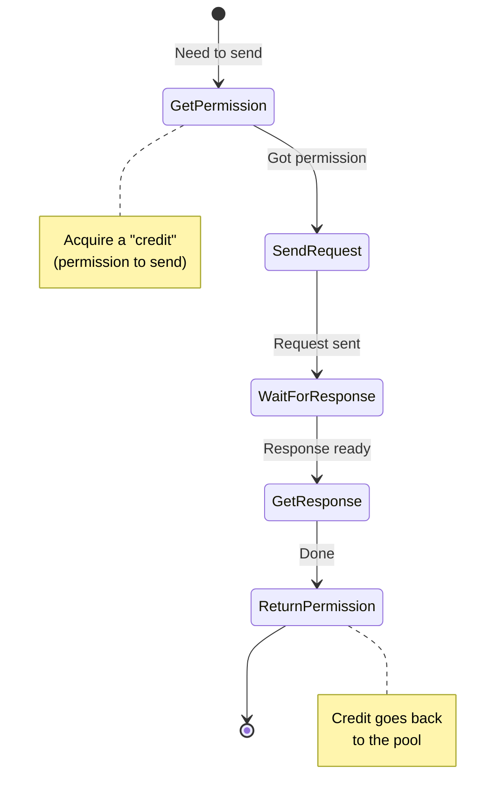

<br/>
<br/>

---

<br/>

## Request Journey

Every request goes through these states from start to finish.

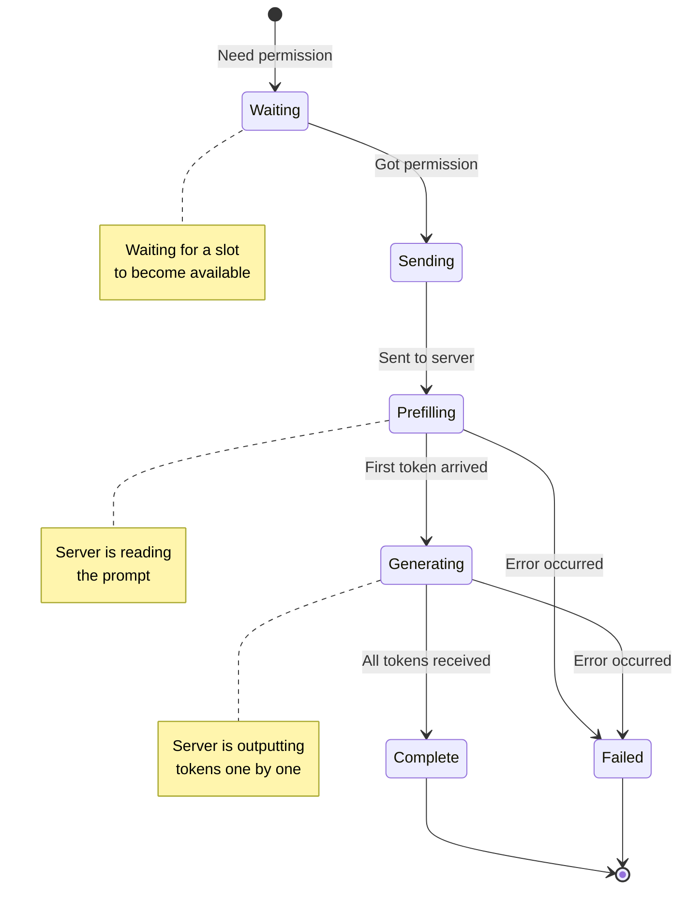

<br/>
<br/>

---

<br/>

## Conversation Journey

A multi-turn conversation (like a chat) goes through these states.

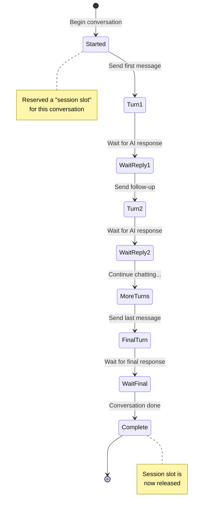

<br/>
<br/>

---

<br/>

## Benchmark Journey

The overall benchmark progresses through these phases. Note: There are only two `CreditPhase` values: **WARMUP** and **PROFILING**. The "grace period" is part of the profiling phase, not a separate phase.

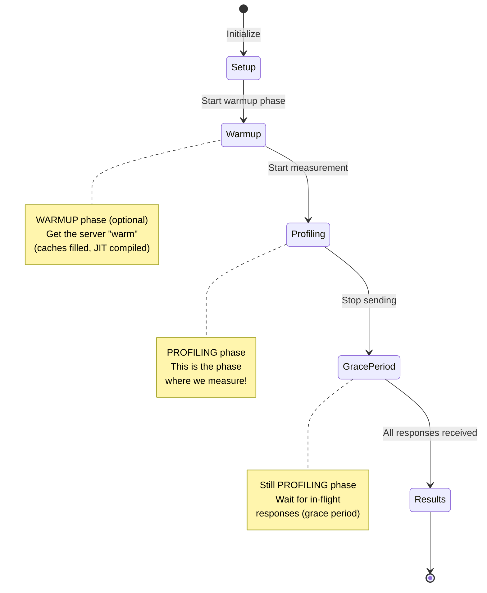

<br/>
<br/>

---

<br/>

## Slot States

Slots control how many things can happen at once. Think of them like parking spaces.

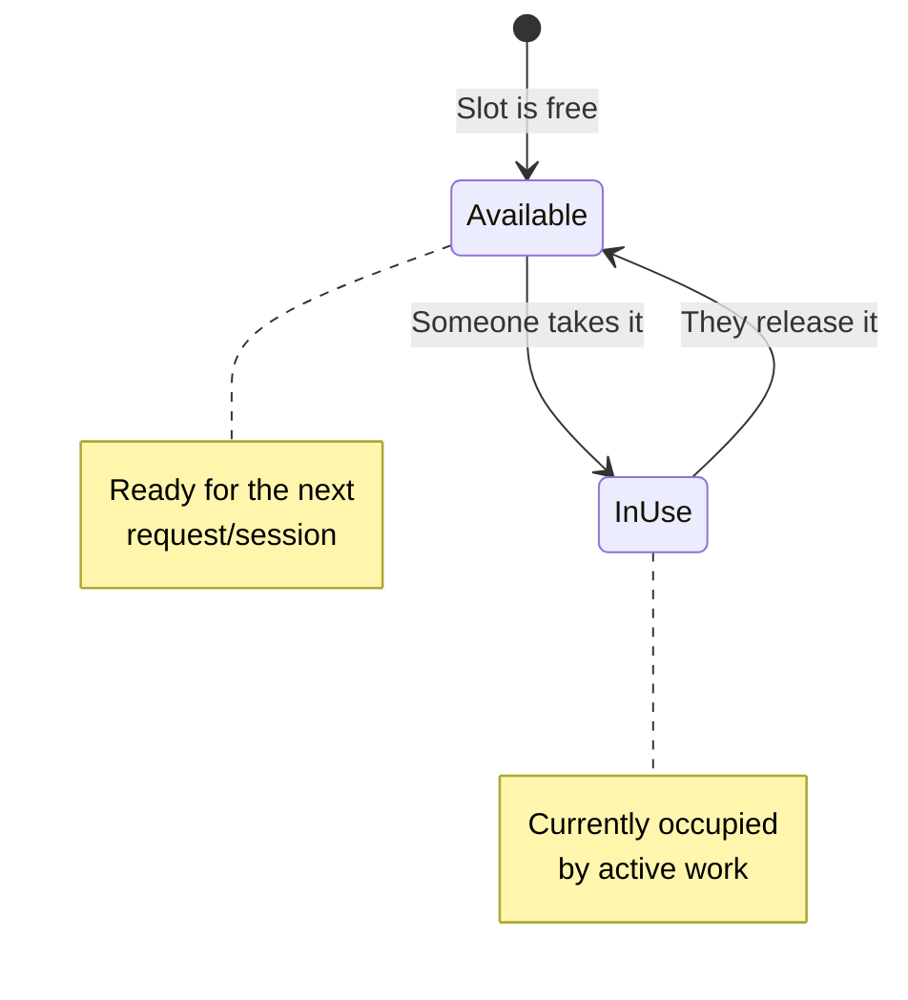

**Two types of slots:**

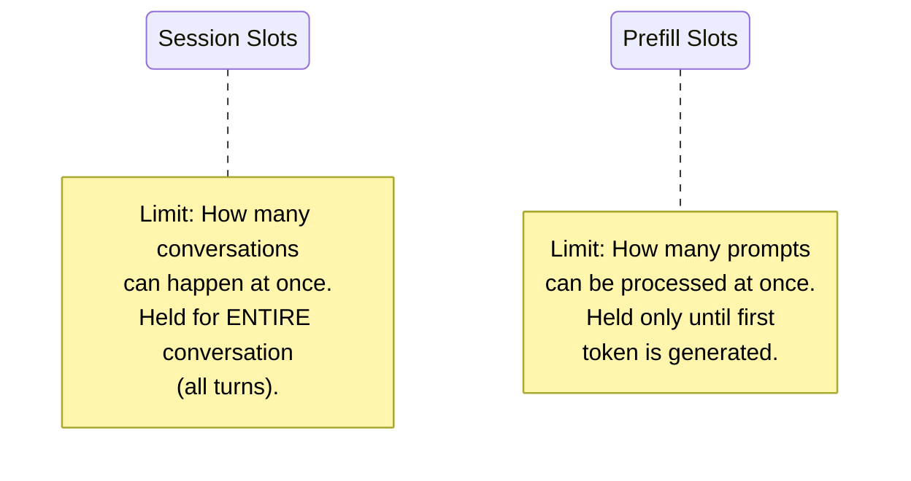

<br/>
<br/>

---

<br/>

## Phase States

Each phase (warmup, profiling) goes through these states.

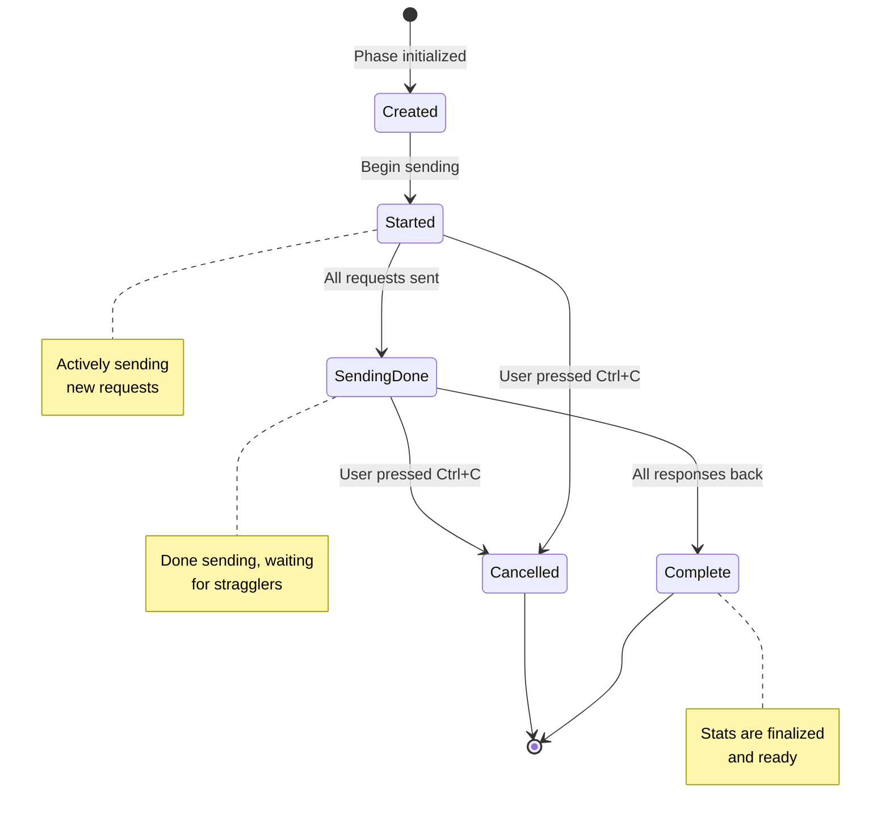

<br/>
<br/>

---

<br/>

## Credit Lifecycle

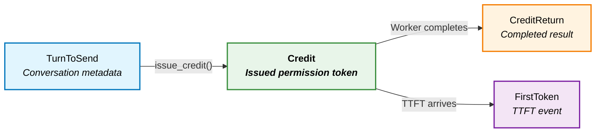

<br/>
<br/>

---

<br/>

## Phase State Machine

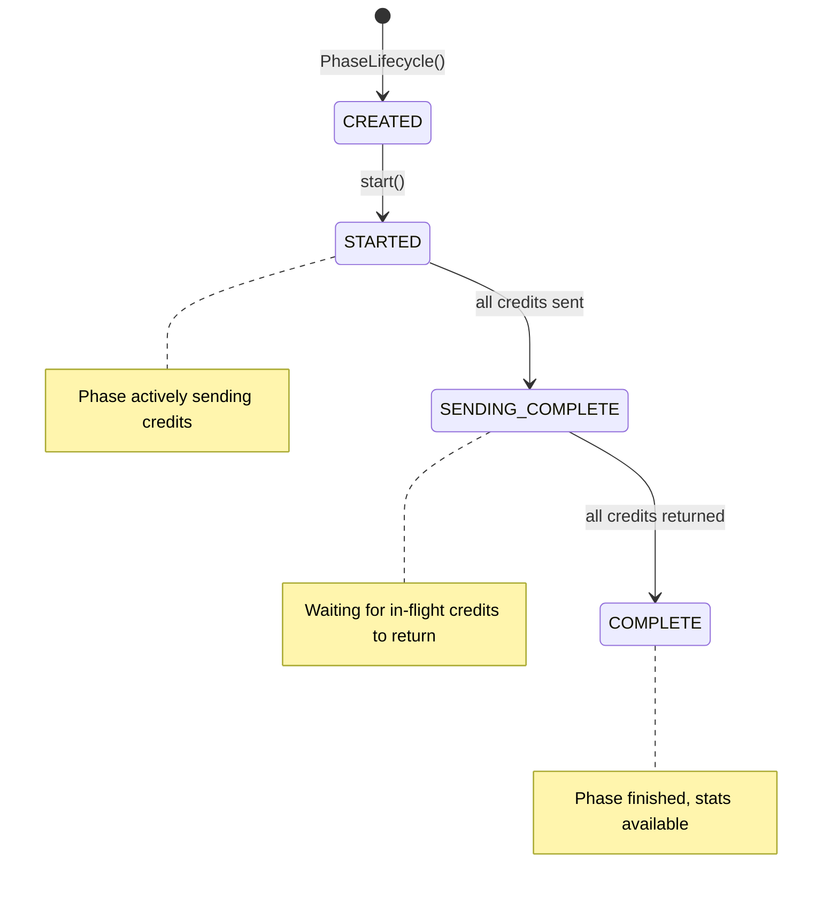

<br/>
<br/>

---

<br/>

## High-Level Architecture

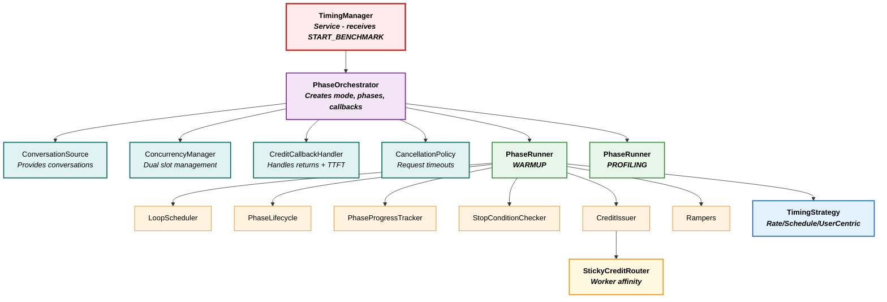

<br/>
<br/>

---

<br/>

## Credit Issuance Decision Flow

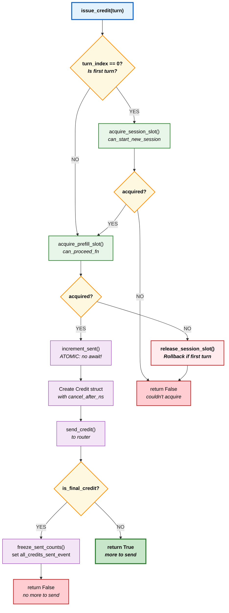

<br/>
<br/>

---

<br/>

## Credit Issuance Data Flow

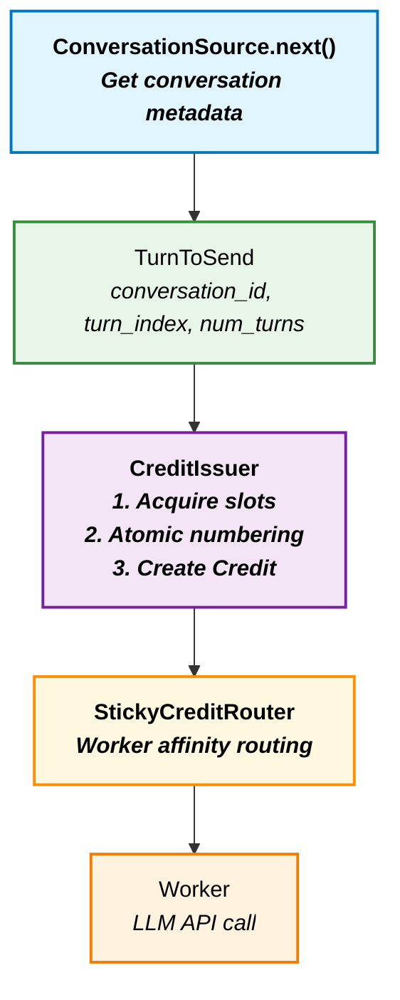

<br/>
<br/>

---

<br/>

## Credit Callback Handler Flow

Main flow for handling credit returns (see [Slot Release Logic](#slot-release-logic) for details on slot handling).

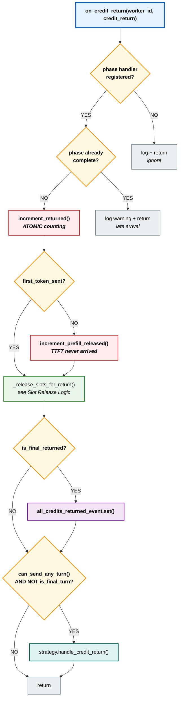

<br/>
<br/>

---

<br/>

## Slot Release Logic

Detailed view of `_release_slots_for_return()` called from the callback handler.

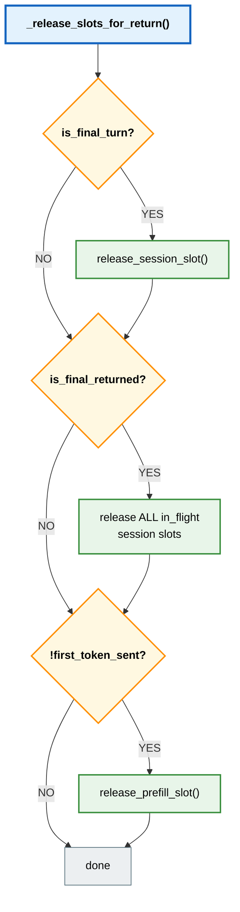

<br/>
<br/>

---

<br/>

## Credit Return Data Flow

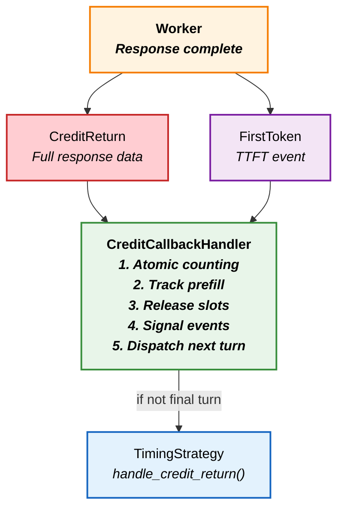

<br/>
<br/>

---

<br/>

## Multi-Turn Conversation Flow

Shows how a 3-turn conversation progresses through the system.

```mermaid
flowchart TD
    T0_ACQ_S["Turn 0: acquire_session_slot()<br/><em>First turn only</em>"]
    T0_ACQ_P["Turn 0: acquire_prefill_slot()"]
    T0_SEND["Turn 0: send Credit to Worker"]
    T0_TTFT["Turn 0: on_first_token()<br/><em>release_prefill_slot()</em>"]
    T0_RET["Turn 0: on_credit_return()<br/><em>dispatch next turn</em>"]

    T1_ACQ_P["Turn 1: acquire_prefill_slot()<br/><em>session slot still held</em>"]
    T1_SEND["Turn 1: send Credit to Worker"]
    T1_TTFT["Turn 1: on_first_token()<br/><em>release_prefill_slot()</em>"]
    T1_RET["Turn 1: on_credit_return()<br/><em>dispatch next turn</em>"]

    TN_ACQ_P["Turn N: acquire_prefill_slot()<br/><em>session slot still held</em>"]
    TN_SEND["Turn N: send Credit to Worker"]
    TN_TTFT["Turn N: on_first_token()<br/><em>release_prefill_slot()</em>"]
    TN_RET["Turn N: on_credit_return()<br/><em>release_session_slot()</em>"]
    TN_DONE["Conversation Complete"]

    T0_ACQ_S --> T0_ACQ_P
    T0_ACQ_P --> T0_SEND
    T0_SEND --> T0_TTFT
    T0_TTFT --> T0_RET
    T0_RET --> T1_ACQ_P
    T1_ACQ_P --> T1_SEND
    T1_SEND --> T1_TTFT
    T1_TTFT --> T1_RET
    T1_RET --> TN_ACQ_P
    TN_ACQ_P --> TN_SEND
    TN_SEND --> TN_TTFT
    TN_TTFT --> TN_RET
    TN_RET --> TN_DONE

    classDef acquire fill:#e8f5e9,stroke:#388e3c,stroke-width:2px,color:#000,font-weight:bold
    classDef send fill:#e3f2fd,stroke:#1565c0,stroke-width:1px,color:#000
    classDef ttft fill:#f3e5f5,stroke:#7b1fa2,stroke-width:1px,color:#000
    classDef ret fill:#fff3e0,stroke:#f57c00,stroke-width:1px,color:#000
    classDef done fill:#c8e6c9,stroke:#2e7d32,stroke-width:3px,color:#000,font-weight:bold

    class T0_ACQ_S acquire
    class T0_ACQ_P acquire
    class T1_ACQ_P acquire
    class TN_ACQ_P acquire
    class T0_SEND send
    class T1_SEND send
    class TN_SEND send
    class T0_TTFT ttft
    class T1_TTFT ttft
    class TN_TTFT ttft
    class T0_RET ret
    class T1_RET ret
    class TN_RET ret
    class TN_DONE done
```

<br/>
<br/>

---

<br/>

## Session Slot Lifecycle

Session slots are held for the **entire conversation** (all turns).

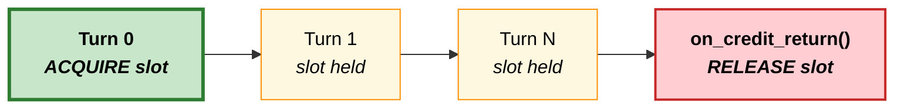

<br/>
<br/>

---

<br/>

## Prefill Slot Lifecycle

Prefill slots are acquired and released **per turn**.

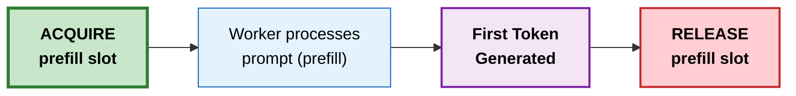

<br/>
<br/>

---

<br/>

## Prefill Release Paths

Two ways a prefill slot can be released.

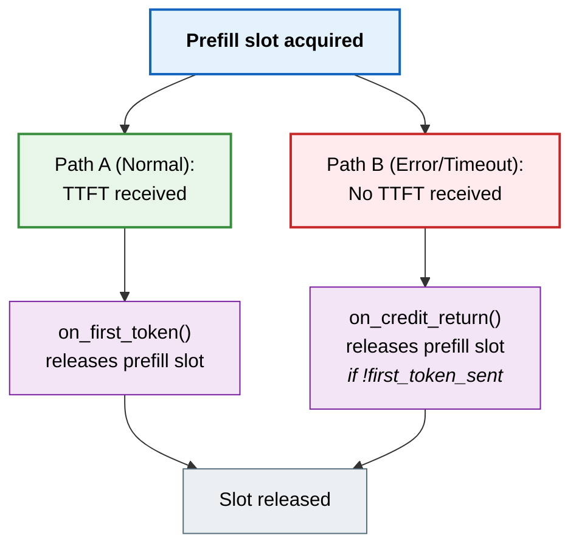

<br/>
<br/>

---

<br/>

## Stop Condition: can_send_any_turn

Evaluated before **every** credit issuance.

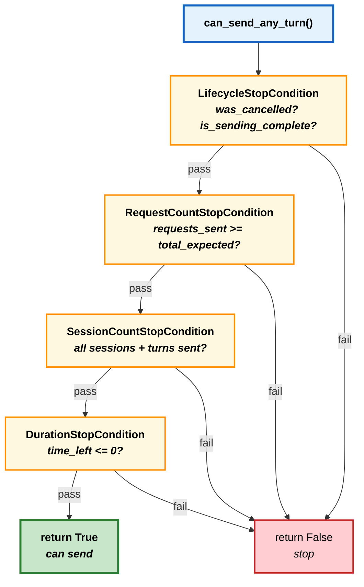

<br/>
<br/>

---

<br/>

## Stop Condition: can_start_new_session

More restrictive - checked before starting a **new conversation**.

```mermaid
flowchart TD
    START["can_start_new_session()"]
    CHECK_ANY["can_send_any_turn()?"]
    CHECK_QUOTA["SessionCountStopCondition<br/><em>sent_sessions >= expected?</em>"]
    CAN_START["return True"]
    CANNOT_START["return False"]

    START --> CHECK_ANY
    CHECK_ANY -->|"True"| CHECK_QUOTA
    CHECK_ANY -->|"False"| CANNOT_START
    CHECK_QUOTA -->|"pass"| CAN_START
    CHECK_QUOTA -->|"fail"| CANNOT_START

    classDef entry fill:#e3f2fd,stroke:#1565c0,stroke-width:3px,color:#000,font-weight:bold
    classDef condition fill:#fff8e1,stroke:#ff8f00,stroke-width:2px,color:#000,font-weight:bold
    classDef success fill:#c8e6c9,stroke:#2e7d32,stroke-width:3px,color:#000,font-weight:bold
    classDef failure fill:#ffcdd2,stroke:#c62828,stroke-width:2px,color:#000

    class START entry
    class CHECK_ANY entry
    class CHECK_QUOTA condition
    class CAN_START success
    class CANNOT_START failure
```

<br/>
<br/>

---

<br/>

## Phase Transition: Standard Mode

With `seamless=False`, PROFILING waits for all WARMUP returns.

```mermaid
flowchart TD
    S_WARMUP["WARMUP<br/>sending credits"]
    S_SEND_DONE["SENDING_COMPLETE<br/><em>all credits sent</em>"]
    S_WAIT["Wait for all<br/>credits to return"]
    S_COMPLETE["COMPLETE<br/><em>stats finalized</em>"]
    S_PROF["PROFILING<br/>starts fresh"]

    S_WARMUP --> S_SEND_DONE
    S_SEND_DONE --> S_WAIT
    S_WAIT --> S_COMPLETE
    S_COMPLETE --> S_PROF

    classDef warmup fill:#fff3e0,stroke:#f57c00,stroke-width:2px,color:#000,font-weight:bold
    classDef sendDone fill:#fff8e1,stroke:#ff8f00,stroke-width:2px,color:#000,font-weight:bold
    classDef waiting fill:#e0f2f1,stroke:#00695c,stroke-width:1px,color:#000
    classDef complete fill:#c8e6c9,stroke:#2e7d32,stroke-width:3px,color:#000,font-weight:bold
    classDef profiling fill:#e3f2fd,stroke:#1565c0,stroke-width:2px,color:#000,font-weight:bold

    class S_WARMUP warmup
    class S_SEND_DONE sendDone
    class S_WAIT waiting
    class S_COMPLETE complete
    class S_PROF profiling
```

<br/>
<br/>

---

<br/>

## Phase Transition: Seamless Mode

With `seamless=True`, PROFILING starts immediately while WARMUP drains in background.

```mermaid
flowchart TD
    SM_WARMUP["WARMUP<br/>sending credits"]
    SM_SEND_DONE["SENDING_COMPLETE<br/><em>all credits sent</em>"]
    SM_PROF["PROFILING<br/>starts immediately"]
    SM_BG["Background task:<br/>wait for WARMUP returns"]
    SM_COEXIST["Both phases coexist<br/><em>WARMUP draining + PROFILING filling</em>"]

    SM_WARMUP --> SM_SEND_DONE
    SM_SEND_DONE --> SM_PROF
    SM_SEND_DONE -.-> SM_BG
    SM_PROF --> SM_COEXIST
    SM_BG -.-> SM_COEXIST

    classDef warmup fill:#fff3e0,stroke:#f57c00,stroke-width:2px,color:#000,font-weight:bold
    classDef sendDone fill:#fff8e1,stroke:#ff8f00,stroke-width:2px,color:#000,font-weight:bold
    classDef profiling fill:#e3f2fd,stroke:#1565c0,stroke-width:2px,color:#000,font-weight:bold
    classDef background fill:#f3e5f5,stroke:#7b1fa2,stroke-width:1px,color:#000,font-style:italic
    classDef coexist fill:#e0f2f1,stroke:#00695c,stroke-width:2px,color:#000

    class SM_WARMUP warmup
    class SM_SEND_DONE sendDone
    class SM_PROF profiling
    class SM_BG background
    class SM_COEXIST coexist
```

<br/>
<br/>

---

<br/>

## Strategy: Request Rate Mode

Rate-centric mode (REQUEST_RATE timing): main loop controls timing, callbacks queue continuation turns.

The main loop:
1. Waits for the next rate interval
2. Prioritizes queued continuation turns (from completed previous turns)
3. If no continuation turns, tries to start a new session
4. Issues credits via CreditIssuer (which handles concurrency acquisition)

```mermaid
flowchart TD
    LOOP["execute_phase() loop"]
    SLEEP["Sleep for rate interval"]
    CHECK_QUEUE{"Continuation<br/>queue has turns?"}
    GET_QUEUED["Get queued turn"]
    CHECK_NEW{"can_start_new_session()?"}
    GET_NEW["Get new conversation"]
    SKIP["Skip interval<br/><em>wait for continuations</em>"]
    ISSUE_BLOCK["issue_credit()<br/><em>blocks on concurrency</em>"]
    ISSUE_TRY["try_issue_credit()<br/><em>non-blocking</em>"]

    CB["Callbacks queue turns"]
    CB_QUEUE["Put turn in queue<br/><em>after optional delay</em>"]

    LOOP --> SLEEP
    SLEEP --> CHECK_QUEUE
    CHECK_QUEUE -->|YES| GET_QUEUED
    CHECK_QUEUE -->|NO| CHECK_NEW
    CHECK_NEW -->|YES| GET_NEW
    CHECK_NEW -->|NO| SKIP
    GET_QUEUED --> ISSUE_BLOCK
    GET_NEW --> ISSUE_TRY
    SKIP --> LOOP
    ISSUE_BLOCK --> LOOP
    ISSUE_TRY --> LOOP

    CB --> CB_QUEUE
    CB_QUEUE -.-> CHECK_QUEUE

    classDef loop fill:#e3f2fd,stroke:#1565c0,stroke-width:2px,color:#000,font-weight:bold
    classDef decision fill:#fff8e1,stroke:#ff8f00,stroke-width:2px,color:#000,font-weight:bold
    classDef process fill:#fff3e0,stroke:#f57c00,stroke-width:1px,color:#000
    classDef skip fill:#e0f2f1,stroke:#00695c,stroke-width:1px,color:#000
    classDef callback fill:#f3e5f5,stroke:#7b1fa2,stroke-width:1px,color:#000
    classDef issueBlock fill:#e8f5e9,stroke:#388e3c,stroke-width:2px,color:#000
    classDef issueTry fill:#fff3e0,stroke:#f57c00,stroke-width:2px,color:#000

    class LOOP loop
    class SLEEP process
    class CHECK_QUEUE decision
    class CHECK_NEW decision
    class GET_QUEUED process
    class GET_NEW process
    class SKIP skip
    class ISSUE_BLOCK issueBlock
    class ISSUE_TRY issueTry
    class CB callback
    class CB_QUEUE callback
```

Key differences in credit issuance:
- **Continuation turns**: Use blocking `issue_credit()` — waits for concurrency slot
- **New sessions**: Use non-blocking `try_issue_credit()` — skips interval if no slot available

<br/>
<br/>

---

<br/>

## Rate Ramping: Discrete Mode

Used for **concurrency** ramping (integer steps).

```mermaid
flowchart TD
    INIT["current = start<br/>ramp_start = perf_counter()<br/>setter(current)"]
    LOOP["while True"]
    ELAPSED["elapsed = perf_counter() - ramp_start"]
    STEP["result = next_step(current, elapsed)"]
    CHECK{"result is None?"}
    SLEEP["await sleep(delay)"]
    UPDATE["current = next_value<br/>setter(current)"]
    DONE["Ramp complete"]

    INIT --> LOOP
    LOOP --> ELAPSED
    ELAPSED --> STEP
    STEP --> CHECK
    CHECK -->|YES| DONE
    CHECK -->|NO| SLEEP
    SLEEP --> UPDATE
    UPDATE --> LOOP

    classDef init fill:#c8e6c9,stroke:#2e7d32,stroke-width:2px,color:#000,font-weight:bold
    classDef loop fill:#e3f2fd,stroke:#1565c0,stroke-width:2px,color:#000,font-weight:bold
    classDef process fill:#fff3e0,stroke:#f57c00,stroke-width:1px,color:#000
    classDef decision fill:#fff8e1,stroke:#ff8f00,stroke-width:2px,color:#000,font-weight:bold
    classDef done fill:#c8e6c9,stroke:#2e7d32,stroke-width:3px,color:#000,font-weight:bold

    class INIT init
    class LOOP loop
    class ELAPSED process
    class STEP process
    class SLEEP process
    class UPDATE process
    class CHECK decision
    class DONE done
```

<br/>
<br/>

---

<br/>

## Rate Ramping: Continuous Mode

Used for **rate** ramping (float values, sampled at intervals).

```mermaid
flowchart TD
    INIT["ramp_start = perf_counter()<br/>setter(start)"]
    LOOP["while True"]
    SLEEP["await sleep(update_interval)"]
    ELAPSED["elapsed = perf_counter() - ramp_start"]
    VALUE["value = value_at(elapsed)"]
    CHECK{"value is None?"}
    TARGET["setter(target)<br/><em>ensure exact target</em>"]
    UPDATE["setter(value)"]
    DONE["Ramp complete"]

    INIT --> LOOP
    LOOP --> SLEEP
    SLEEP --> ELAPSED
    ELAPSED --> VALUE
    VALUE --> CHECK
    CHECK -->|YES| TARGET
    CHECK -->|NO| UPDATE
    TARGET --> DONE
    UPDATE --> LOOP

    classDef init fill:#c8e6c9,stroke:#2e7d32,stroke-width:2px,color:#000,font-weight:bold
    classDef loop fill:#e3f2fd,stroke:#1565c0,stroke-width:2px,color:#000,font-weight:bold
    classDef process fill:#fff3e0,stroke:#f57c00,stroke-width:1px,color:#000
    classDef decision fill:#fff8e1,stroke:#ff8f00,stroke-width:2px,color:#000,font-weight:bold
    classDef done fill:#c8e6c9,stroke:#2e7d32,stroke-width:3px,color:#000,font-weight:bold

    class INIT init
    class LOOP loop
    class SLEEP process
    class ELAPSED process
    class VALUE process
    class UPDATE process
    class TARGET process
    class CHECK decision
    class DONE done
```

<br/>
<br/>

---

<br/>

## BAD: Hard Reset Transition

What NOT to do: cancelling all requests creates gaps.

```mermaid
flowchart TD
    WARMUP["WARMUP: 10 sessions<br/><em>server is warm</em>"]
    CANCEL["Cancel all WARMUP requests"]
    GAP["GAP: No requests<br/><em>server cools down</em>"]
    PROF["PROFILING: Start fresh<br/><em>cold start penalty</em>"]

    WARMUP --> CANCEL
    CANCEL --> GAP
    GAP --> PROF

    classDef warmup fill:#fff3e0,stroke:#f57c00,stroke-width:2px,color:#000,font-weight:bold
    classDef bad fill:#ffcdd2,stroke:#c62828,stroke-width:2px,color:#000,font-weight:bold
    classDef profiling fill:#e3f2fd,stroke:#1565c0,stroke-width:2px,color:#000

    class WARMUP warmup
    class CANCEL bad
    class GAP bad
    class PROF profiling
```

<br/>
<br/>

---

<br/>

## GOOD: Debt-Based Smooth Transition

Correct approach: debt-based semaphore allows smooth transitions.

```mermaid
flowchart TD
    WARMUP["WARMUP: 10 sessions<br/><em>server is warm</em>"]
    SET["set_limit(50)<br/><em>+40 new slots available</em>"]
    COEXIST["Both phases coexist<br/><em>WARMUP drains naturally</em><br/><em>PROFILING fills new slots</em>"]
    DONE["Fully transitioned<br/><em>no gaps, no cold start</em>"]

    WARMUP --> SET
    SET --> COEXIST
    COEXIST --> DONE

    classDef warmup fill:#fff3e0,stroke:#f57c00,stroke-width:2px,color:#000,font-weight:bold
    classDef good fill:#c8e6c9,stroke:#388e3c,stroke-width:2px,color:#000
    classDef done fill:#c8e6c9,stroke:#2e7d32,stroke-width:3px,color:#000,font-weight:bold

    class WARMUP warmup
    class SET good
    class COEXIST good
    class DONE done
```

<br/>
<br/>

---

<br/>

## Cancellation Flow

What happens when user presses Ctrl+C.

```mermaid
flowchart TD
    CTRL_C["User presses Ctrl+C"]
    SO["PhaseOrchestrator.cancel()"]

    CR["CreditRouter.cancel_all_credits()"]
    CM["CancelCredits message<br/>to each worker"]
    W_CANCEL["Workers call task.cancel()"]

    PR["PhaseRunner.cancel()"]
    SET_FLAG["_was_cancelled = True"]
    CANCEL_LIFE["lifecycle.cancel()"]
    CANCEL_TASKS["Cancel tasks:<br/>execution, progress, return_wait"]
    STOP_RAMP["Stop rampers"]
    SCHED_CANCEL["scheduler.cancel_all()"]

    RUN_DETECT["run() detects _was_cancelled"]
    MARK_COMPLETE["mark_complete(grace_period=True)"]
    SET_EVENT["all_credits_returned_event.set()"]
    RETURN_FAST["Return immediately<br/><em>NO drain wait</em>"]

    CTRL_C --> SO
    SO --> CR
    SO --> PR
    CR --> CM
    CM --> W_CANCEL
    PR --> SET_FLAG
    SET_FLAG --> CANCEL_LIFE
    CANCEL_LIFE --> CANCEL_TASKS
    CANCEL_TASKS --> STOP_RAMP
    STOP_RAMP --> SCHED_CANCEL
    SCHED_CANCEL --> RUN_DETECT
    RUN_DETECT --> MARK_COMPLETE
    MARK_COMPLETE --> SET_EVENT
    SET_EVENT --> RETURN_FAST

    classDef trigger fill:#ffcdd2,stroke:#c62828,stroke-width:3px,color:#000,font-weight:bold
    classDef orchestrator fill:#f3e5f5,stroke:#7b1fa2,stroke-width:2px,color:#000,font-weight:bold
    classDef router fill:#fff8e1,stroke:#ff8f00,stroke-width:1px,color:#000
    classDef phase fill:#e3f2fd,stroke:#1565c0,stroke-width:1px,color:#000
    classDef process fill:#fff3e0,stroke:#f57c00,stroke-width:1px,color:#000
    classDef done fill:#c8e6c9,stroke:#2e7d32,stroke-width:3px,color:#000,font-weight:bold

    class CTRL_C trigger
    class SO orchestrator
    class CR router
    class CM router
    class W_CANCEL router
    class PR phase
    class SET_FLAG phase
    class CANCEL_LIFE phase
    class CANCEL_TASKS phase
    class STOP_RAMP phase
    class SCHED_CANCEL phase
    class RUN_DETECT process
    class MARK_COMPLETE process
    class SET_EVENT process
    class RETURN_FAST done
```

<br/>
<br/>

---

<br/>

## Semaphore: Increase Limit

When concurrency limit increases (e.g., 10 → 15).

```mermaid
flowchart TD
    START["set_limit(15)<br/><em>current = 10</em>"]
    DIFF["diff = 15 - 10 = +5"]
    CHECK{"debt > 0?"}
    CANCEL["Cancel debt first<br/>debt -= min(5, debt)"]
    ADD["Add remaining slots<br/>semaphore.release() x N"]
    DONE["New limit = 15<br/><em>5 more slots available</em>"]

    START --> DIFF
    DIFF --> CHECK
    CHECK -->|YES| CANCEL
    CHECK -->|NO| ADD
    CANCEL --> ADD
    ADD --> DONE

    classDef start fill:#e3f2fd,stroke:#1565c0,stroke-width:2px,color:#000,font-weight:bold
    classDef process fill:#fff3e0,stroke:#f57c00,stroke-width:1px,color:#000
    classDef decision fill:#fff8e1,stroke:#ff8f00,stroke-width:2px,color:#000,font-weight:bold
    classDef increase fill:#c8e6c9,stroke:#388e3c,stroke-width:1px,color:#000
    classDef done fill:#c8e6c9,stroke:#2e7d32,stroke-width:3px,color:#000,font-weight:bold

    class START start
    class DIFF process
    class CHECK decision
    class CANCEL increase
    class ADD increase
    class DONE done
```

<br/>
<br/>

---

<br/>

## Semaphore: Decrease Limit

When concurrency limit decreases (e.g., 15 → 10).

```mermaid
flowchart TD
    START["set_limit(10)<br/><em>current = 15</em>"]
    DIFF["diff = 10 - 15 = -5"]
    CHECK{"semaphore locked?<br/><em>waiters blocked?</em>"}
    DRAIN["Safe: drain directly<br/>_value -= min(5, _value)"]
    DEBT["All to debt<br/>debt += 5"]
    DONE["New limit = 10<br/><em>debt will absorb releases</em>"]

    START --> DIFF
    DIFF --> CHECK
    CHECK -->|NOT locked| DRAIN
    CHECK -->|locked| DEBT
    DRAIN --> DONE
    DEBT --> DONE

    classDef start fill:#e3f2fd,stroke:#1565c0,stroke-width:2px,color:#000,font-weight:bold
    classDef process fill:#fff3e0,stroke:#f57c00,stroke-width:1px,color:#000
    classDef decision fill:#fff8e1,stroke:#ff8f00,stroke-width:2px,color:#000,font-weight:bold
    classDef decrease fill:#ffcdd2,stroke:#c62828,stroke-width:1px,color:#000
    classDef done fill:#c8e6c9,stroke:#2e7d32,stroke-width:3px,color:#000,font-weight:bold

    class START start
    class DIFF process
    class CHECK decision
    class DRAIN decrease
    class DEBT decrease
    class DONE done
```

<br/>
<br/>

---

<br/>

## Semaphore: Release with Debt

How release() handles outstanding debt.

```mermaid
flowchart TD
    START["release()"]
    CHECK{"debt > 0?"}
    ABSORB["debt -= 1<br/><em>absorbed by debt</em>"]
    NORMAL["semaphore.release()<br/><em>frees slot for waiters</em>"]
    DONE["done"]

    START --> CHECK
    CHECK -->|YES| ABSORB
    CHECK -->|NO| NORMAL
    ABSORB --> DONE
    NORMAL --> DONE

    classDef start fill:#e3f2fd,stroke:#1565c0,stroke-width:2px,color:#000,font-weight:bold
    classDef decision fill:#fff8e1,stroke:#ff8f00,stroke-width:2px,color:#000,font-weight:bold
    classDef absorb fill:#ffcdd2,stroke:#c62828,stroke-width:1px,color:#000
    classDef normal fill:#c8e6c9,stroke:#388e3c,stroke-width:1px,color:#000
    classDef done fill:#eceff1,stroke:#546e7a,stroke-width:1px,color:#000

    class START start
    class CHECK decision
    class ABSORB absorb
    class NORMAL normal
    class DONE done
```

<br/>
<br/>
