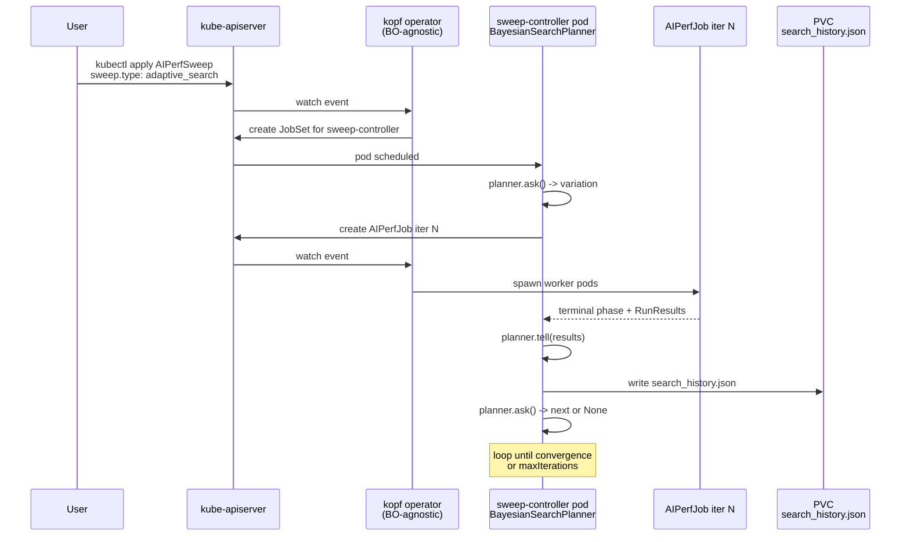

<!--
# SPDX-FileCopyrightText: Copyright (c) 2026 NVIDIA CORPORATION & AFFILIATES. All rights reserved.
# SPDX-License-Identifier: Apache-2.0
-->

# Adaptive Search on Kubernetes

Adaptive search lets the cluster choose its own sweep points instead of
exhausting a grid. The same `BayesianSearchPlanner` (Optuna-backed, with
the Gaussian-process path supplied by BoTorch via the `[botorch]` extra) used
in-process by `aiperf profile --search-*` runs cluster-side when an
`AIPerfSweep` CR sets `spec.sweep.type: adaptive_search`. The planner
proposes one variation at a time; the sweep-controller pod creates a child
`AIPerfJob` for that variation, waits for it to terminate, scores the
objective, and asks for the next point. Convergence detection (max iterations,
improvement-patience plateau, or coefficient-of-variation plateau) terminates
the loop early when further evaluations stop helping.

Reach for adaptive search when the search space is too large to grid
enumerate (e.g. concurrency 1–1000), when a single scalar objective
captures what you care about, and when you want one `AIPerfJob` per
proposed point so each iteration is durable, cancellable, and visible
through normal `kubectl get aiperfjob` workflows. For the algorithm
details, flag grammar, and `search_history.json` schema, defer to
[Bayesian-Optimization Outer Loop](../sweeping/bayesian-optimization.md);
for the in-process tutorial, see
[Adaptive Search](../tutorials/adaptive-search.md).

## Architecture



The kopf operator stays unaware of Bayesian Optimization: it only sees
ordinary `AIPerfJob` create/delete events. All planner state — the
Gaussian process model, the trial history, the convergence accumulators —
lives in the controller pod's process memory plus the on-disk
`search_history.json`. A controller restart loses in-memory GP state but
re-reads `search_history.json` on the next boot so the trajectory survives.

The optimization stack is pulled in through the AIPerf `[botorch]` extra
(alias `[optuna]`) and is present on the controller-pod image; operator
pods do not need it.

## Minimal `AIPerfSweep` CR

A single-dimension search over `phases.profiling.concurrency`, optimizing
output token throughput on Llama 3.1 8B Instruct served by vLLM:

```yaml
apiVersion: aiperf.nvidia.com/v1alpha1
kind: AIPerfSweep
metadata:
  name: bo-concurrency-llama8b
  namespace: bench
spec:
  benchmark:
    models: [meta-llama/Llama-3.1-8B-Instruct]
    endpoint:
      urls: [http://vllm.bench.svc.cluster.local:8000/v1/chat/completions]
      type: chat
      streaming: true
    datasets:
      - name: main
        type: synthetic
    phases:
      - name: profiling
        type: poisson
        rate: 1.0  # placeholder: overridden per-iteration by searchSpace below
        duration: 120
  sweep:
    type: adaptive_search
    planner: bayesian
    searchSpace:
      - path: phases.profiling.concurrency
        lo: 1
        hi: 1000
        kind: int
    objectives:
      - metric: output_token_throughput
        stat: avg
        direction: maximize
    maxIterations: 30
    nInitialPoints: 5
    improvementPatience: 8
    plateauWindow: 5
    plateauThreshold: 0.01
    randomSeed: 42
  multiRun:
    numRuns: 3
    cooldownSeconds: 30
```

`numRuns: 3` runs three benchmarks per proposed point and feeds their
average objective back to the planner — confidence per point at the cost
of triple the wall clock. Drop to `numRuns: 1` for fastest iteration.

## Multi-dimensional search

Search over concurrency and Poisson rate jointly:

```yaml
spec:
  sweep:
    type: adaptive_search
    planner: bayesian
    searchSpace:
      - path: phases.profiling.concurrency
        lo: 1
        hi: 500
        kind: int
      - path: phases.profiling.rate
        lo: 1.0
        hi: 50.0
        kind: real
    objectives:
      - metric: output_token_throughput
        stat: avg
        direction: maximize
    maxIterations: 40
    nInitialPoints: 8
  multiRun:
    numRuns: 2
```

`kind: int` declares an integer dimension — Optuna suggests integer
parameters natively, no rounding step — while `kind: real` keeps
floats. `nInitialPoints` Sobol-quasirandom draws fit before the GP
takes over — bump it for higher-dimensional spaces (rule of thumb:
`>= 2 * len(searchSpace)`).

## Status fields you can watch

The CRD declares typed counters in `status`:

| Field | Meaning under adaptive search |
|---|---|
| `status.phase` | `Pending` -> `Running` -> `Aggregating` -> `Succeeded` / `Failed` / `PartiallyFailed` / `Cancelled`. |
| `status.totalVariations` | Upper bound: equal to `maxIterations`. Actual count may be lower on early stop. |
| `status.maxTotalRuns` | Upper bound: `maxIterations * multiRun.numRuns`. |
| `status.completedRuns` | Authoritative count of finished child `AIPerfJob`s. |
| `status.failedRuns` | Authoritative failure count, fed by `failurePolicy`. |
| `status.runEpoch` | Sweep-run epoch used in the on-disk path. |

Both `totalVariations` and `maxTotalRuns` are upper bounds — early
plateau or improvement-patience convergence shrinks the actual count.
This mirrors how the trial-level convergence rule
(`multiRun.numRuns`) caps trials on grid sweeps.

```bash
$ kubectl -n bench get aiperfsweep bo-concurrency-llama8b
NAME                       PHASE       MAX-TOTAL-RUNS   AGE
bo-concurrency-llama8b     Succeeded   90               12m
```

The full BO trajectory — every proposed point, the per-iteration
objective, the running best, and the convergence reason — lives in
`search_history.json`, not on the CR. See
[Output layout](#output-layout) below and the
[search_history.json schema](../api/search-history.md).

## Mutual exclusion rules

In the flat spec envelope, `adaptive_search` is one of the
`sweep.type` discriminator values (alongside `grid` and `scenarios`), so
"adaptive plus grid" is not even expressible — the discriminator picks
one. The remaining gates protect the cardinality contract:

| Combination | Outcome | Enforced by |
|---|---|---|
| `kind: AIPerfJob` + `spec.sweep` (any type) | Rejected at admission — single benchmarks must use `kind: AIPerfJob` with `spec.sweep` unset | CRD `x-kubernetes-validations` rule (`!has(self.sweep)` on AIPerfJob) |
| `kind: AIPerfSweep` without `spec.sweep` | Rejected at admission — sweeps must declare a `sweep` block | CRD `x-kubernetes-validations` rule (`has(self.sweep)` on AIPerfSweep) |
| `sweep.type: adaptive_search` + `spec.benchmark.sweep` | Rejected — sweep axes belong on the parent CR, not embedded in the per-iteration body | `BenchmarkConfig` schema (no `sweep` field) plus operator-side validator |
| Per-iteration `AIPerfJob` containing magic-list flags (`--concurrency 10,20,30`) | Rejected inside each child by `_reject_in_process_sweep_under_operator` | `src/aiperf/cli_runner/_multi_run.py` |

These prevent sweeping on top of sweeping and keep a single source of
truth for variation generation.

## Operator-managed gate exception

The operator sets `AIPERF_OPERATOR_MANAGED=1` in every controller and
worker pod, and `cli_runner._reject_in_process_sweep_under_operator`
hard-fails any in-process magic-list sweep under that flag — so the
cluster never sweeps on top of a sweep. **Adaptive search is the
exception**: the controller pod is the BO driver, and each per-iteration
child `AIPerfJob` sees a single-config plan (no `is_sweep` shape), so the
gate never fires for adaptive runs. The exemption is documented in the
`_reject_in_process_sweep_under_operator` docstring (commit `d322a0c71`)
and tested by both the unit suite and the cluster integration tests.

## Cancellation behaviour

Deleting the parent `AIPerfSweep` (or patching `spec.cancel: true`) is
cooperative end to end:

1. The operator handles `on_delete` and calls
   `request_cancellation(job_key(ns, name))`.
2. The controller pod's main loop polls
   `is_cancellation_requested(...)` at every `await` boundary —
   between iterations, while waiting on the in-flight child, and during
   aggregation.
3. The currently-running child `AIPerfJob` is patched with
   `spec.cancel: true`, drains to a terminal phase, and contributes its
   results.
4. The controller skips remaining iterations, runs aggregation over the
   children that did complete, and writes `search_history.json` with
   `convergence_reason: null` (cancellation is not a convergence event).

Partial trajectories survive: `search_history.json` is rewritten after
every iteration, so a cancelled or crashed sweep loses at most the
current iteration's data.

## Output layout

Artifacts land under the `RESULTS_DIR` PVC, scoped by namespace, sweep
name, and the sweep run-epoch:

```
<RESULTS_DIR>/
  <namespace>/
    sweeps/
      <sweep-name>/
        <sweep-run-epoch>/
          search_history.json          # incremental BO trajectory + convergence_reason
          sweep_aggregate/             # mode-agnostic per-combination aggregate
            profile_export_aiperf_sweep.json
            profile_export_aiperf_sweep.csv
    <sweep-name>-v00-t0/               # per-iteration child AIPerfJob
      <child-run-epoch>/
        profile_export_aiperf.json     # full per-trial artifacts
        ...
    <sweep-name>-v00-t1/
    <sweep-name>-v01-t0/
    ...
```

Per-iteration child names follow the same `<sweep>-v<NN>[-t<N>]` budget
as grid sweeps (`build_child_name` in `sweep_controller/_naming.py`):
the variation index is the BO iteration index (`-v00` is the first
proposed point), and the trial suffix is present whenever
`multiRun.numRuns > 1`. Each child sits at the same path layer as a
standalone `AIPerfJob` and is reachable through the standard
`/api/v1/results/<ns>/<sweep>-v00-t1/` endpoints.

`sweep_aggregate/` carries the same per-combination CSV/JSON schema
produced by grid sweeps — `aggregate_sweep_and_export` groups by stamped
`variation_values` and is mode-agnostic, so downstream readers do not
need to know the sweep was adaptive.

## Where to read more

- [Bayesian-Optimization Outer Loop](../sweeping/bayesian-optimization.md) — algorithm, flag grammar, `search_history.json` schema, convergence reasons.
- [Adaptive Search tutorial](../tutorials/adaptive-search.md) — in-process walkthrough with `aiperf profile --search-*`.
- [Parameter Sweeps and Multi-Run on Kubernetes](./sweeps.md) — grid sweeps, multi-run confidence, cancellation, failure policy.
- [search_history.json schema](../api/search-history.md) — exact JSON shape consumed by post-run tooling.
- [AIPerfSweep CRD validation rules](./crd-validation.md) — full catalog of admission-time invariants.
