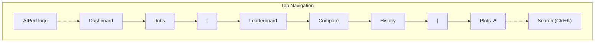
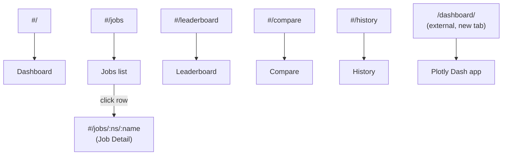
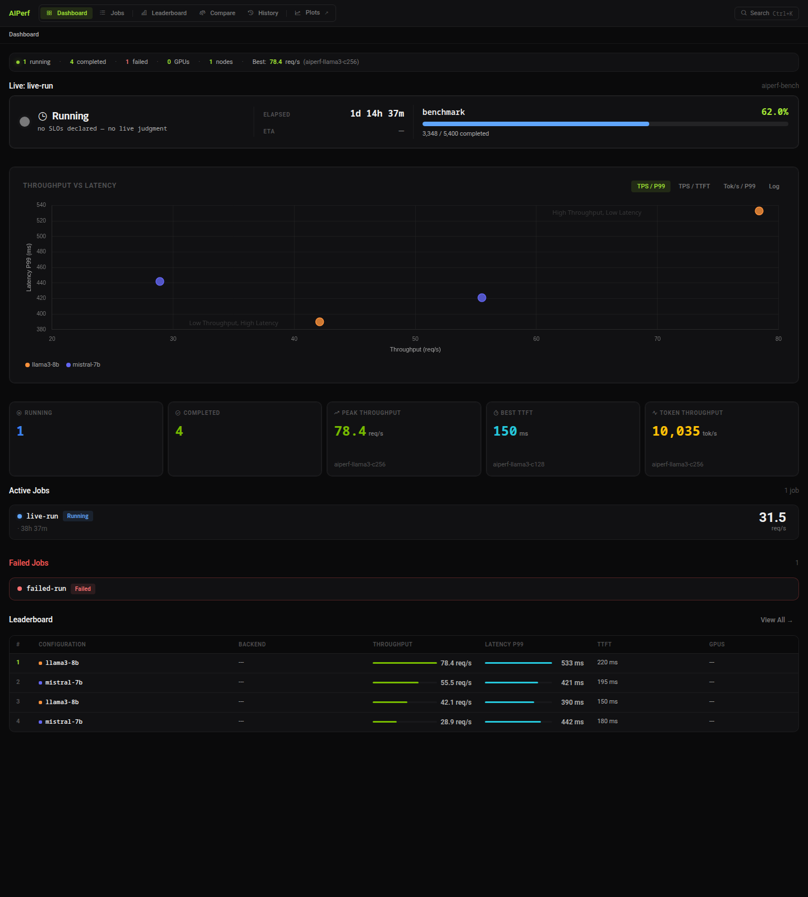
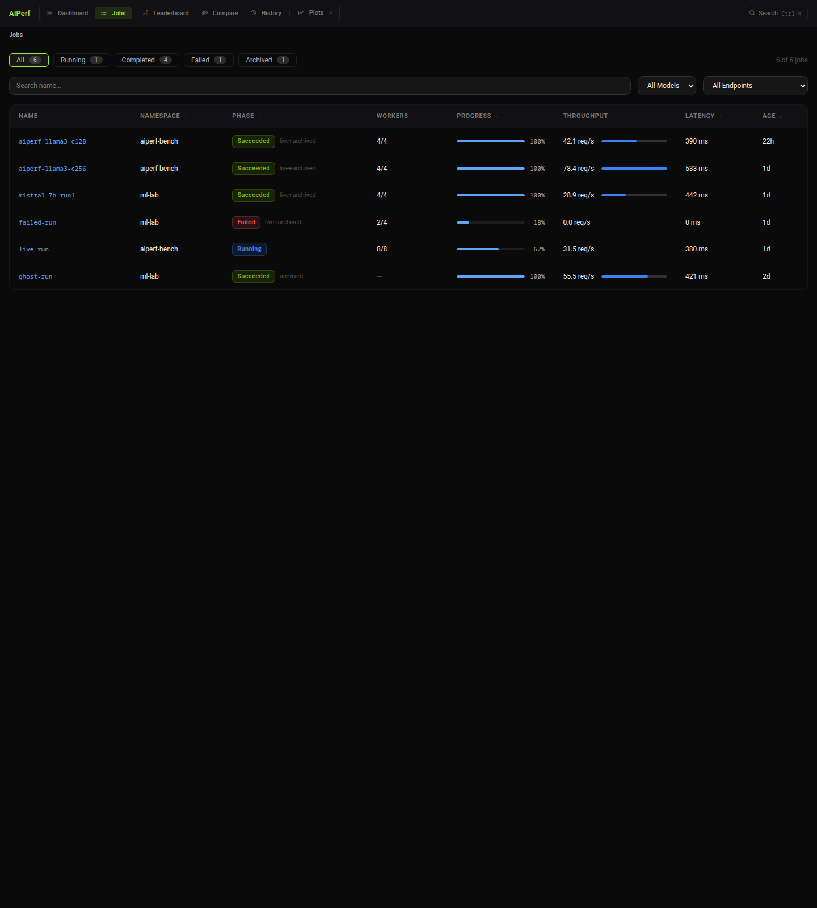
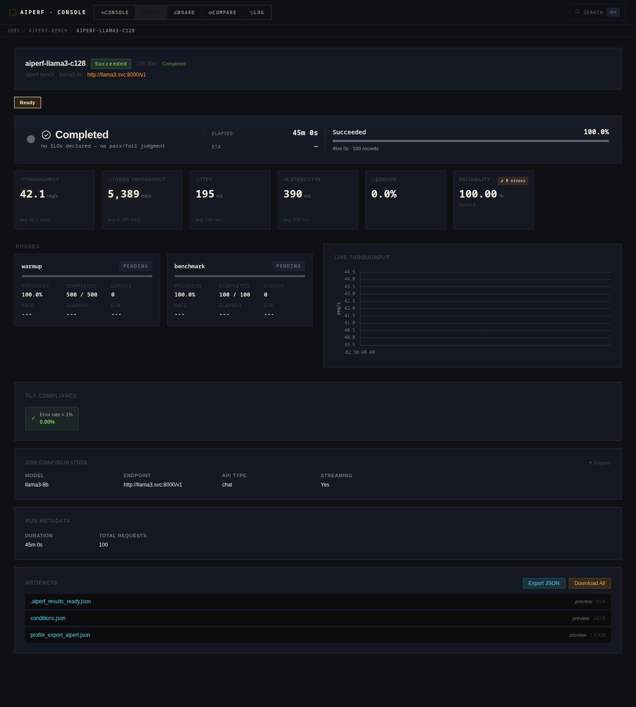
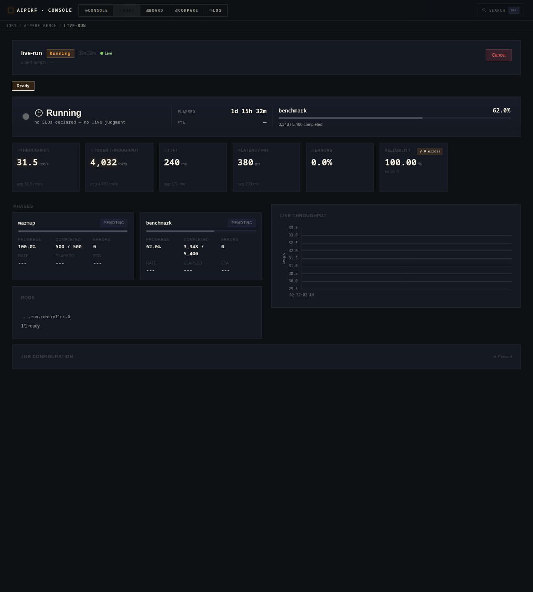
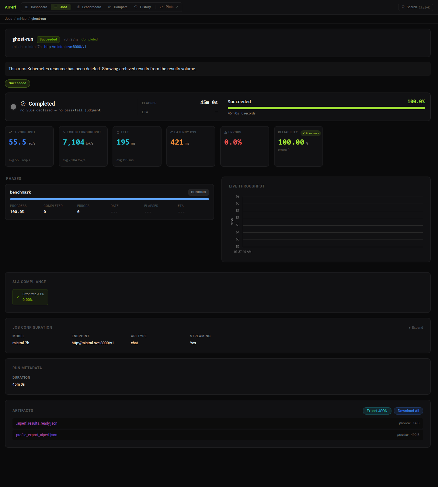
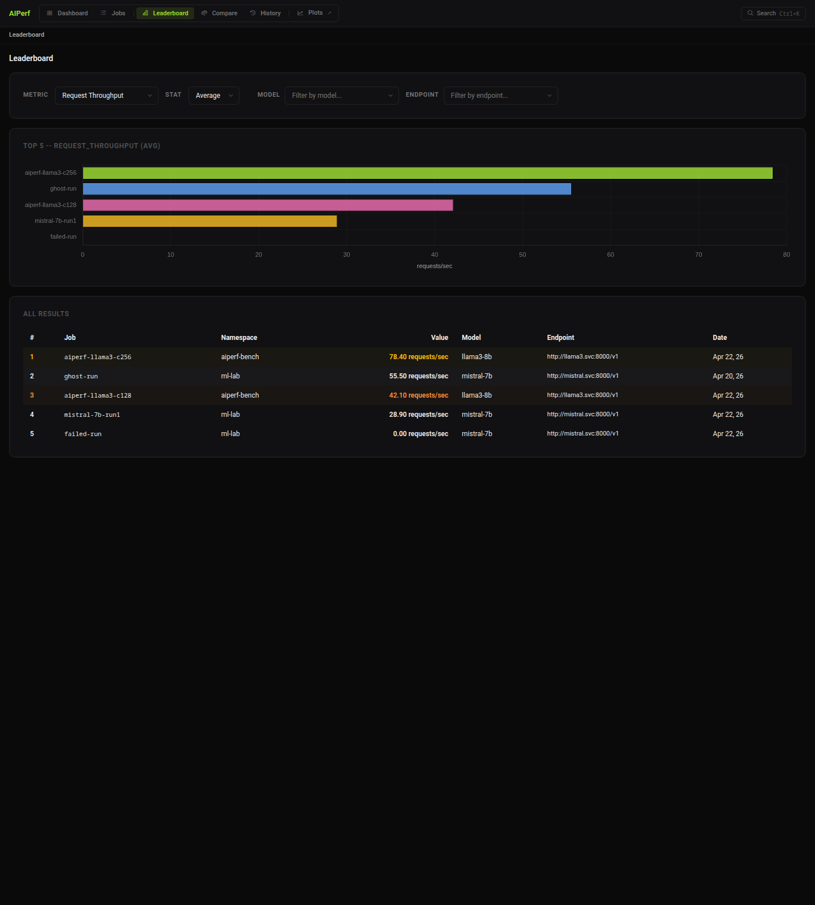
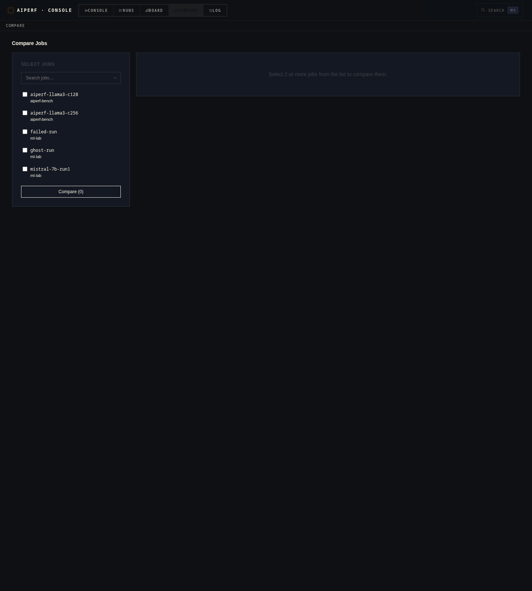
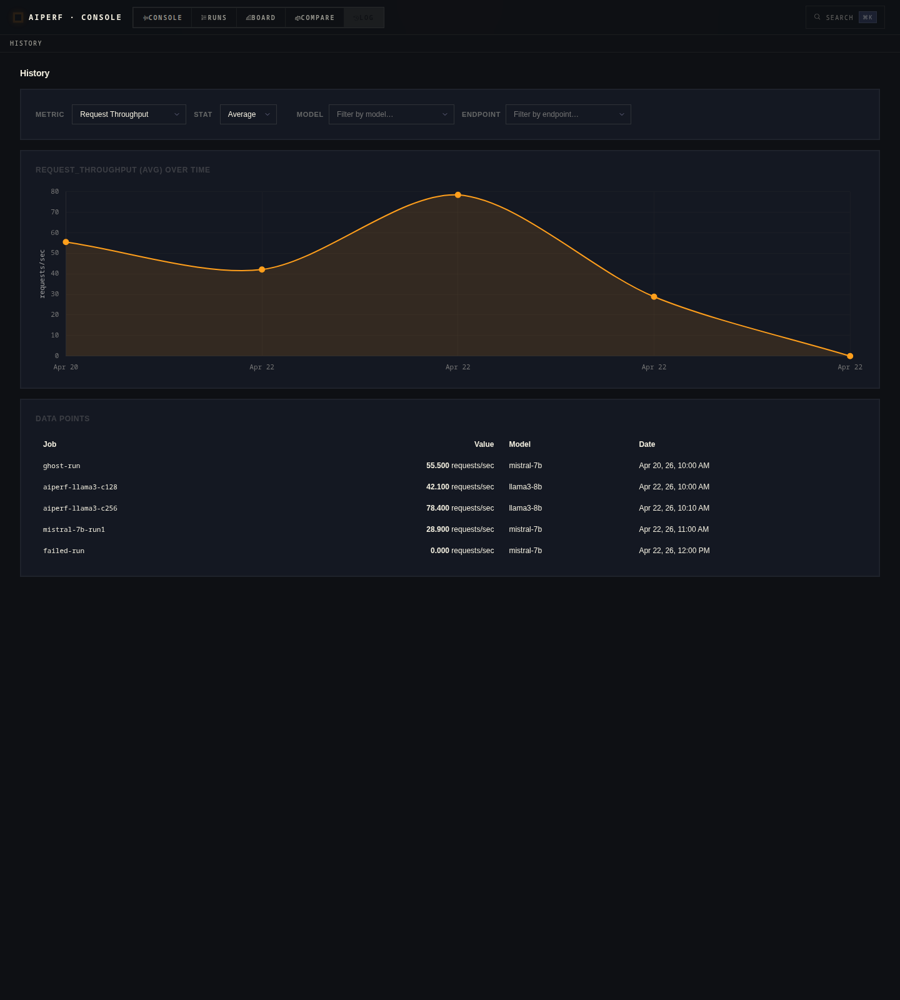

# Web Dashboard

The operator ships a browser-based dashboard for inspecting benchmark jobs,
comparing runs, and browsing historical analytics. It is a lightweight Preact
single-page application served directly from the operator's Results API
deployment — no separate service to deploy, no build step, just static assets
loaded from `src/aiperf/operator/ui/`.

This page documents every page, interaction, and keyboard shortcut in the UI.
For the HTTP endpoints that power it, see [`results-api.md`](results-api.md).

---

## Accessing the Dashboard

The dashboard and the Results API are served by the same FastAPI process and
share port **8081** inside the cluster. The SPA is mounted as a catch-all
`StaticFiles` handler, so any path that isn't an `/api/v1/...` route returns
`index.html` and lets the client-side router take over.

### Recommended: `aiperf kube dashboard`

```bash
aiperf kube dashboard
```

This command locates the operator pod, opens a `kubectl port-forward` directly
to that pod on the results server port (`RESULTS_SERVER_PORT = 8081`), and
launches your default browser at the forwarded URL. The port-forward stays
open until you press `Ctrl+C`.

Useful flags:

| Flag | Purpose |
|---|---|
| `--port 8081` | Bind to a specific local port (default: ephemeral). |
| `--no-browser` | Print the URL instead of opening a browser — useful in SSH sessions. |
| `--operator-namespace aiperf-system` | Override the namespace to look in. |

### Manual port-forward (enterprise clusters)

If your cluster policy forbids the `aiperf` CLI from spawning `kubectl`, or you
want a long-lived forward managed by your own tooling, forward the Service
directly:

```bash
kubectl port-forward -n aiperf-system svc/aiperf-operator 8081:results
# open http://localhost:8081
```

The Service name is whatever Helm's `aiperf-operator.fullname` template
renders — by default `aiperf-operator`, or `<release>-aiperf-operator` if your
release name differs from the chart name. The port is exposed under the
`results` named port (default 8081, see `resultsServer.port` in `values.yaml`).

### Authentication

The dashboard inherits the Results API's access model: **no per-user
authentication** is performed. Access control is the port-forward itself —
whoever can reach port 8081 inside the cluster (or through a forward) can view
every job, every result, and trigger `POST /api/v1/jobs/{ns}/{name}/cancel`.
Do not expose this port via an unauthenticated Ingress.

---

## Navigation

The top bar is split into two groups with a separator, followed by an
external link labelled "Plots" that points at `/dashboard/`. The link target
is a Plotly Dash app built by `aiperf.operator.dashboard_mount.build_dashboard`
and mounted on the FastAPI results server at `/dashboard/` via
`WSGIMiddleware(DashboardProxy(...))`. When no runs exist on the PVC yet the
route is served by a small WSGI stub that returns `503` until the first run
lands, so the "Plots" link is always present and friendly.



Routes are hash-based (`#/jobs`, `#/jobs/:ns/:name`, etc.), so reloading any
page works without server-side route configuration. The six top-level routes:



---

## Pages

> Screenshots in this section are reproduced from committed fixtures by
> `tools/capture_operator_ui_screenshots.py` — no cluster or running
> benchmark required to refresh them.

### Dashboard (`#/`)



Cluster-wide overview, the landing page.

**What it shows:**

- **Status bar** — running / completed / failed job counts, total GPUs and
  nodes in the cluster, and peak request throughput seen so far.
- **Throughput vs Latency scatter** — completed jobs as points, grouped by
  model (stable colors). Three axis modes (`TPS / P99`, `TPS / TTFT`,
  `Tok/s / P99`) and a log-scale toggle. Quadrant labels hint "High
  Throughput, Low Latency" (top right).
- **KPI cards** — Running, Completed, Peak Throughput, Best TTFT, Token
  Throughput.
- **Active Jobs** — one card per running/initializing/pending job with model,
  backend, elapsed time, GPU config, live throughput, and progress bar. Click
  a card to open Job Detail.
- **Failed Jobs** — surfaced separately when any exist, with the error
  message inline.
- **Leaderboard preview** — top-5 completed jobs by request throughput, with
  an inline bar chart. "View All →" navigates to the full leaderboard.

**Endpoints consumed:**

- `GET /api/v1/jobs` — polled every 5s
- `GET /api/v1/cluster` — polled every 10s (shows a banner if unavailable)
- `GET /api/v1/analytics/leaderboard?metric=request_throughput&stat=avg` —
  polled every 15s, then `GET /api/v1/analytics/summary/{ns}/{job_id}` for
  each returned entry to enrich the scatter and KPIs

### Jobs (`#/jobs`)



Tabular list of every AIPerfJob known to the operator.

**Filters:**

- Phase tabs: All / Running / Completed / Failed (with live counts).
- Free-text search on name + namespace.
- Model dropdown (populated from the distinct set of models across current
  jobs).
- Endpoint dropdown (same).
- "Clear" button resets all four.

Clicking a row navigates to Job Detail. The list re-polls
`GET /api/v1/jobs` every 5s.

### Job Detail (`#/jobs/:ns/:name`)

Completed job, with the SLO hero strip, KPI tiles, per-phase cards, and the
full artifacts + metadata tail:



Running job. The hero reports live status; KPIs read from
`status.liveSummary`; the Cancel button and Pods card appear only while
the CR is live:



Archived job (CR deleted, PVC results retained). A banner flags the missing
cluster resource; KPIs + Phases + Job Configuration are synthesized from the
`profile_export_aiperf.json` summary. Cancel and Pods are omitted:



The deepest page, scoped to one AIPerfJob. Sections shown depend on whether
the job is still running or has finished.

**Always visible:**

- **Header** — name, namespace, phase badge, model, backend, start time,
  elapsed. A "Cancel" button appears for running jobs (calls
  `POST /api/v1/jobs/{ns}/{name}/cancel` after a JS `confirm()` prompt).
- **Conditions** — kopf condition list (Ready, Progressing, Completed, …).
- **Phases** — `PhaseBar` showing which benchmark phase (warmup, measurement,
  cooldown) the job is in.
- **Pods** — `PodsBar` with per-pod status across the JobSet (controller,
  workers, timing manager, records manager).

**While running:**

- **Live Throughput** — rolling line chart (last 60 samples).
- **Latency Distribution** — live histogram.

**After completion (or once partial results exist):**

- **Full Metrics Breakdown** — collapsible tables grouped by Throughput,
  Latency, Sequence Lengths, and HTTP, each with `avg / p50 / p90 / p95 /
  p99 / min / max` columns where applicable.
- **Request Latency Percentiles** — bar chart of `p1 … p99`.
- **Concurrency vs Throughput** — curve across the sweep, if the job ran
  multiple concurrency levels.
- **Input Sequence Length Distribution** — histogram from the per-request
  parquet.
- **SLA Compliance** — pass/fail against configured SLOs.
- **Job Configuration** — the original CR `spec`, pretty-printed.
- **Run Metadata** — git SHA, container image, run ID, timestamps.
- **Server Metrics** — GPU utilization, KV cache, tokens-in-flight (when the
  backend exposed them).
- **Per-Record Analysis** — sortable per-request table (collapsed by
  default, showing first 50 rows; "Expand" reveals all).
- **Artifacts** — raw files on the PVC (`profile_export.json`,
  `profile_export_genai_perf.csv`, `aiperf_log.jsonl`, …) with per-file
  Download buttons and a "Download All" bulk action. Modal viewers preview
  JSON, CSV, and plain text inline before download.

**Endpoints consumed:**

- `GET /api/v1/jobs/{ns}/{name}` (polled for live data; the summary block
  is extracted from `status.liveSummary` / `status.summary` on this response)
- `GET /api/v1/config/{ns}/{name}`
- `GET /api/v1/results/{ns}/{name}` (file listing)
- `GET /api/v1/results/{ns}/{name}/{filename}` (downloads, plus direct
  fetches of `server_metrics_export.json` and `profile_export.jsonl`)
- `POST /api/v1/jobs/{ns}/{name}/cancel` (Cancel button)

### Leaderboard (`#/leaderboard`)



Cross-job ranking for a single metric.

**Controls:**

- Metric + statistic selector (throughput, latency, TTFT, ITL, token
  throughput, …; `avg / p50 / p90 / p95 / p99 / min / max`).
- Model and Endpoint free-text substring filters.

**Views:**

- Horizontal bar chart of the top 10.
- Ranked table of all entries with gold/silver/bronze coloring on the top
  three.
- **Percentile Heatmap** column (shown only when entries carry `p50/p90/p99`
  data): three cells per row, colored green (good) → yellow → red (poor),
  normalized across the currently filtered set. Direction flips automatically
  — lower is better for latency metrics, higher is better for throughput
  metrics.

**Endpoints:** `GET /api/v1/analytics/leaderboard?metric=...&stat=...`.

### Compare (`#/compare`)



Side-by-side diff of 2 or more completed runs.

- **Left panel** — searchable checklist of every stored job (from
  `GET /api/v1/results`). Tick 2+ jobs, press "Compare".
- **Right panel** —
  - **Metric Comparison** — table of every common metric × stat, with
    per-metric best-value highlighting (direction-aware: minimum for
    latency, maximum for throughput).
  - **Visual Comparison** — grouped bar chart, one group per metric, one
    colored bar per selected job.

**Endpoints:** `GET /api/v1/analytics/compare?jobs=id1&jobs=id2&...`.

### History (`#/history`)



Trend view of a single metric across all runs over time.

- Same metric / statistic selector as Leaderboard.
- Same model + endpoint substring filters.
- Line chart ordered by `start_time`, with point tooltips that show the
  underlying `job_id` and a formatted timestamp.
- Table of every entry below the chart.

**Endpoints:** `GET /api/v1/analytics/history?metric=...&stat=...`.

---

## Command Palette

Press **`Ctrl+K`** (or `Cmd+K` on macOS) to open the command palette. The
search icon in the top-right corner of the navigation bar opens the same modal.

The palette indexes:

- The five top-level nav pages: Dashboard, Jobs, Leaderboard, Compare, History
  (sub-label: "Page"). Job Detail is not indexed directly — reach it by
  selecting the target job instead.
- Every AIPerfJob from the current `jobs` signal (sub-label: namespace).

Type to fuzzy-match either the label or the sub-label; matching is
in-order-character, not substring. Navigation:

| Key | Action |
|---|---|
| `↑` / `↓` | Move highlight |
| `Enter` | Select the highlighted item |
| `Escape` or backdrop click | Close |
| Mouse hover | Move highlight |

Selecting a page navigates to its route; selecting a job navigates to
`#/jobs/:ns/:name`.

---

## Theme and Layout

The dashboard ships with a **single dark theme** tuned to the NVIDIA design
system (neutral grays, `#76b900` green accent). There is no light/dark toggle
and nothing is persisted to `localStorage` — the palette is defined
statically in `src/aiperf/operator/ui/lib/theme.js`. Model colors in charts
are assigned deterministically from a hash of the model name, so the same
model keeps the same color across pages and reloads.

The layout is a single column with a fixed top navigation bar, a breadcrumb
row, an optional global error banner, and the current page below. The SPA is
responsive down to tablet widths; very narrow viewports are not a supported
target.

---

## Troubleshooting

### Blank page with console 404s for `/app.js`

The UI assets were not baked into the operator image, or `ui_dir.is_dir()`
returned false at startup. Verify the image tag includes
`src/aiperf/operator/ui/` and check the Results server logs for
"UI static files mounted" output.

### "Error: API 503 …" banners

The Results API returned 503 — typically because `ResultsDB` hasn't finished
initializing, or the kubernetes_asyncio client failed to load config. Check
the operator pod logs:

```bash
kubectl logs -n aiperf-system deploy/aiperf-operator -c results --tail=200
```

If the line `kubernetes_asyncio client initialized for UI endpoints` is
missing, the live job and cluster endpoints will stay unavailable even after
the analytics engine comes up. The Dashboard page surfaces this as a
"Cluster endpoint unavailable — data may be stale" banner.

### Dashboard page scatter empty but jobs exist

The scatter only plots **completed** jobs that have both axis fields present
in their summary. If your runs never finished, or the summary lacks
`request_throughput.avg`, points are filtered out. Use the Jobs page to
inspect individual runs instead.

### Port-forward drops during operator rollout

`aiperf kube dashboard` holds a single port-forward; a rollout that
terminates the operator pod will drop the connection. Re-run the command
once the new pod is Ready, or use a managed auto-reconnecting forward (see
the `aiperf kube watch` command for an example).

### Cancel button does nothing

The "Cancel" action is wired to `POST /api/v1/jobs/{ns}/{name}/cancel`,
which patches the CR to set `spec.cancelled: true`. If the operator is
unreachable, the `fetch` call fails and an `alert()` surfaces the error
message. Verify the Results pod can talk to the Kubernetes API — the
lifespan hook logs "kubernetes_asyncio client initialized for UI endpoints"
when it can.
