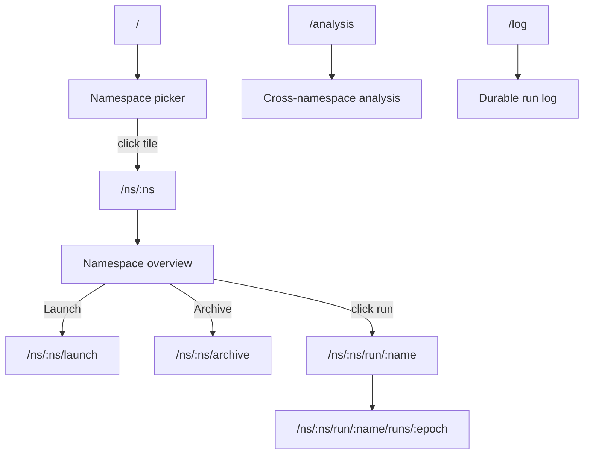

# Web Dashboard

The operator ships a browser-based dashboard for inspecting benchmark jobs,
comparing runs, and browsing historical analytics. It is a lightweight Preact
single-page application served directly from the operator's Results API
deployment — no separate service to deploy, no build step, just static assets
loaded from `src/aiperf/operator/ui/`.

This page documents every page, interaction, and keyboard shortcut in the UI.
For the HTTP endpoints that power it, see [`results-api.md`](results-api.md).

---

## Accessing the Dashboard

The dashboard and the Results API are served by the same FastAPI process and
share port **8081** inside the cluster. The SPA is mounted as a catch-all
`StaticFiles` handler, so any path that isn't an `/api/v1/...` route returns
`index.html` and lets the client-side router take over.

### Recommended: `aiperf kube dashboard`

```bash
aiperf kube dashboard
```

This command locates the operator pod, opens a `kubectl port-forward` directly
to that pod on the results server port (`RESULTS_SERVER_PORT = 8081`), and
launches your default browser at the forwarded URL. The port-forward stays
open until you press `Ctrl+C`.

Useful flags:

| Flag | Purpose |
|---|---|
| `--port 8081` | Bind to a specific local port (default: ephemeral). |
| `--no-browser` | Print the URL instead of opening a browser — useful in SSH sessions. |
| `--operator-namespace aiperf-system` | Override the namespace to look in. |

### Manual port-forward (enterprise clusters)

If your cluster policy forbids the `aiperf` CLI from spawning `kubectl`, or you
want a long-lived forward managed by your own tooling, forward the Service
directly:

```bash
kubectl port-forward -n aiperf-system svc/aiperf-operator 8081:results
# open http://localhost:8081
```

The Service name is whatever Helm's `aiperf-operator.fullname` template
renders — by default `aiperf-operator`, or `<release>-aiperf-operator` if your
release name differs from the chart name. The port is exposed under the
`results` named port (default 8081, see `resultsServer.port` in `values.yaml`).

### Authentication

The dashboard inherits the Results API's read-only access model: **no per-user
authentication** is performed for reads. Access control is the port-forward
itself — whoever can reach port 8081 inside the cluster (or through a forward)
can view every job and every result. Browser mutating actions are disabled by
default because the static SPA has no safe bearer-token delivery path; create
and cancel jobs from an authenticated terminal with `aiperf kube` or `kubectl`.
Do not expose this port via an unauthenticated Ingress.

---

## Navigation

The UI is organized as a **two-tier router**:

- **Cross-namespace tier** (unprefixed): `/`, `/analysis`, `/log`. These views
  give situational awareness across every namespace the operator has observed
  jobs in, and host analytics that benefit from a wider lens.
- **Per-namespace tier** (`/ns/<name>/...`): every operational view —
  overview, launch, archive, single run, single epoch. The namespace segment
  in the URL is the **authoritative scope** for any state-changing action: a
  Launch from `/ns/foo/launch` cannot create a job in namespace `bar`, even
  if the YAML body says so (see "Launch divergence lock" below).

Routes are hash-based, so reloading any page works without server-side route
configuration. The full route table:

| Route | Purpose |
|---|---|
| `/` | Cross-namespace picker — one tile per namespace observed in the operator's job list, with mini-status chips (running / failed-recent / completed counts) and a left-edge state tint. Click a tile to enter that namespace. |
| `/ns/:ns` | Per-namespace overview — stats hero, active runs strip, recent runs table, all scoped to one namespace. Empty namespaces show a "Launch in `<ns>`" CTA. |
| `/ns/:ns/launch` | Launch a benchmark into `:ns`. The `namespace:` field of the YAML is auto-filled from the URL. If the user edits the YAML to specify a different namespace, the LAUNCH button disables and the breadcrumb pill is tinted red until the YAML and URL agree. |
| `/ns/:ns/archive` | Namespace history — flat list of past runs in `:ns`. |
| `/ns/:ns/run/:name` | Single-run workbench. |
| `/ns/:ns/run/:name/runs/:epoch` | Single-run epoch view. |
| `/analysis` | Cross-namespace comparison view (cluster-key driven). |
| `/log` | Durable run log (cross-namespace). |



### Sticky last-namespace

When the app mounts at `/`, the router checks
`localStorage.aiperf.ui.lastNamespace`. If that value is set **and** the
namespace currently has at least one observed job in the operator's job list,
the app redirects to `/ns/<last>`. Otherwise the picker renders. New users —
and anyone whose last-used namespace has no current or historical jobs —
always see the picker on first load.

### Breadcrumb-pill switcher

On every `/ns/...` route the breadcrumb starts with a clickable pill
`[ns: <name> ▾]`. Clicking it opens a compact dropdown listing every
namespace with at least one observed job (search-filterable). Selecting a
namespace navigates to `/ns/<chosen>`. A "View all namespaces" footer item
returns to `/`.

This is the canonical way to switch namespaces — including when you want to
launch into a different namespace than the one currently in the URL.

### Launch divergence lock

The URL is the source of truth for the namespace you're launching into. On
`/ns/:ns/launch`, the YAML editor auto-fills `namespace: <ns>`. If a user
edits the YAML so the `namespace:` field disagrees with the URL segment, two
things happen at once:

- The **LAUNCH** button disables.
- The breadcrumb pill is tinted red.

To launch into a different namespace, switch namespaces via the breadcrumb
pill (which navigates to `/ns/<other>/launch`) — do not edit the YAML. This
guarantees the namespace in the URL bar always matches the namespace any
state-changing action will operate on.

### Picker visibility caveat

The `/` picker only renders namespaces with **at least one observed job**
(current or historical). Empty-but-deployable namespaces are not surfaced.
To launch into a namespace the operator has never seen, navigate to
`/ns/<name>/launch` directly — the launch view works regardless of whether
the namespace appears in the picker. After the first job lands, the
namespace will appear on subsequent picker visits.

### External Plots link

A "Plots" link in the top bar points at `/dashboard/` — a Plotly Dash app
built by `aiperf.operator.dashboard_mount.build_dashboard` and mounted on
the FastAPI results server via `WSGIMiddleware(DashboardProxy(...))`. When
no runs exist on the PVC yet the route is served by a small WSGI stub that
returns `503` until the first run lands, so the link is always present and
friendly.

---

## Pages

### Namespace picker (`/`)

The landing view for new sessions and anyone whose sticky-namespace pointer
no longer resolves to an active namespace.

**What it shows:**

- One **tile per namespace** that has at least one observed job in the
  operator's job list (current or historical).
- Per tile: the namespace name, mini-status chips (running / failed-recent /
  completed counts), and a left-edge state tint (green if anything is
  running, red if anything failed in the recent window, neutral otherwise).
- A search field for filtering the tile grid.

**Interactions:**

- Click a tile → navigate to `/ns/<name>`.
- Empty-state copy ("No namespaces yet — deploy a job into any namespace and
  it will appear here") when the operator's job list is empty.

**Endpoints consumed:**

- `GET /api/v1/jobs` — polled every 5s; the namespace tile set is the
  distinct `metadata.namespace` values across that list.

### Namespace overview (`/ns/:ns`)

Per-namespace landing page. Everything on this view is scoped to the single
namespace in the URL.

**What it shows:**

- **Stats hero** — running / completed / failed counts, total GPUs and nodes
  in jobs from this namespace, peak request throughput observed.
- **Active runs strip** — one card per running/initializing/pending job with
  model, backend, elapsed time, GPU config, live throughput, and progress
  bar. Click a card to open the run workbench.
- **Recent runs table** — completed and failed jobs in this namespace,
  newest first, with phase badge, model, duration, and headline metrics.
- **Empty state** — namespaces with no current jobs but past history show
  the recent runs table only. Namespaces with no history at all show a
  prominent "Launch in `<ns>`" CTA.

**Endpoints consumed:**

- `GET /api/v1/jobs` — polled every 5s, filtered client-side to `:ns`
- `GET /api/v1/cluster` — polled every 10s

### Launch (`/ns/:ns/launch`)

YAML editor for submitting a new AIPerfJob into `:ns`.

**Behavior:**

- The `namespace:` field of the YAML is **auto-filled** from the URL.
- Edits to the YAML that change `namespace:` to a different value trigger
  the **divergence lock**: the LAUNCH button disables and the breadcrumb
  pill turns red until the YAML and URL agree (or you switch namespaces via
  the pill).
- Templates and schema validation are unchanged from the legacy launch view.
- On success, the page navigates to `/ns/:ns/run/<new-name>`.

**Endpoints consumed:**

- `POST /api/v1/jobs/{ns}` — creates the AIPerfJob CR in `:ns`

### Archive (`/ns/:ns/archive`)

Flat list of past runs in `:ns` — completed, failed, cancelled, and any run
whose CR was deleted but whose results remain on the PVC.

**Filters:**

- Phase tabs: All / Completed / Failed / Cancelled (with live counts).
- Free-text search on name.
- Model and Endpoint dropdowns (populated from the distinct sets in this
  namespace's history).

Clicking a row navigates to the run workbench. The list re-polls
`GET /api/v1/results?ns=:ns` every 15s.

### Run workbench (`/ns/:ns/run/:name`)

The deepest page, scoped to one AIPerfJob. Sections shown depend on whether
the job is still running or has finished.

**Always visible:**

- **Header** — name, namespace, phase badge, model, backend, start time,
  elapsed. A "Cancel" button appears for running jobs (calls
  `POST /api/v1/jobs/{ns}/{name}/cancel` after a JS `confirm()` prompt).
- **Conditions** — kopf condition list (Ready, Progressing, Completed, …).
- **Phases** — `PhaseBar` showing which benchmark phase (warmup, measurement,
  cooldown) the job is in.
- **Pods** — `PodsBar` with per-pod status across the JobSet (controller,
  workers, timing manager, records manager).

**While running:**

- **Live Throughput** — rolling line chart (last 60 samples).
- **Latency Distribution** — live histogram.
- **SLO hero strip** — live pass/fail against configured SLOs.

**After completion (or once partial results exist):**

- **Full Metrics Breakdown** — collapsible tables grouped by Throughput,
  Latency, Sequence Lengths, and HTTP, each with `avg / p50 / p90 / p95 /
  p99 / min / max` columns where applicable.
- **Request Latency Percentiles** — bar chart of `p1 … p99`.
- **Concurrency vs Throughput** — curve across the sweep, if the job ran
  multiple concurrency levels.
- **Input Sequence Length Distribution** — histogram from the per-request
  parquet.
- **SLA Compliance** — pass/fail against configured SLOs.
- **Job Configuration** — the original CR `spec`, pretty-printed.
- **Run Metadata** — git SHA, container image, run ID, timestamps.
- **Server Metrics** — GPU utilization, KV cache, tokens-in-flight (when the
  backend exposed them).
- **Per-Record Analysis** — sortable per-request table (collapsed by
  default, showing first 50 rows; "Expand" reveals all).
- **Artifacts** — raw files on the PVC (`profile_export.json`,
  `profile_export_genai_perf.csv`, `aiperf_log.jsonl`, …) with per-file
  Download buttons and a "Download All" bulk action. Modal viewers preview
  JSON, CSV, and plain text inline before download.

**Archived state.** When the CR has been deleted but results remain on the
PVC, a banner flags the missing cluster resource; KPIs, Phases, and Job
Configuration are synthesized from `profile_export_aiperf.json`. Cancel and
Pods are omitted.

**Endpoints consumed:**

- `GET /api/v1/jobs/{ns}/{name}` (polled for live data; the summary block
  is extracted from `status.liveSummary` / `status.summary` on this response)
- `GET /api/v1/config/{ns}/{name}`
- `GET /api/v1/results/{ns}/{name}` (file listing)
- `GET /api/v1/results/{ns}/{name}/{filename}` (downloads, plus direct
  fetches of `server_metrics_export.json` and `profile_export.jsonl`)
- `POST /api/v1/jobs/{ns}/{name}/cancel` (Cancel button)

### Run epoch view (`/ns/:ns/run/:name/runs/:epoch`)

The same workbench, pinned to a specific historical epoch of a multi-epoch
run (concurrency sweeps, request-rate sweeps). Navigation widgets in the
header let you walk forward and back through epochs without leaving the
page; the URL updates as you navigate.

### Cross-namespace analysis (`/analysis`)

Side-by-side diff of two or more completed runs **across any namespaces**.

- **Left panel** — searchable checklist of every stored job (from
  `GET /api/v1/results`), grouped by namespace. Tick 2+ jobs, press
  "Compare".
- **Right panel** —
  - **Metric Comparison** — table of every common metric × stat, with
    per-metric best-value highlighting (direction-aware: minimum for
    latency, maximum for throughput).
  - **Visual Comparison** — grouped bar chart, one group per metric, one
    colored bar per selected job.
- **Cluster-key driven** — when comparing runs that share the same
  `clusterKey` (model + backend + key tunables) the view promotes the
  varying dimension into a per-axis selector.

**Endpoints:** `GET /api/v1/analytics/compare?jobs=id1&jobs=id2&...`.

### Durable run log (`/log`)

Append-only audit feed of every run the operator has observed, across all
namespaces — submitted, started, completed, failed, cancelled, deleted —
with timestamps. Useful for "what happened in the cluster yesterday?"
forensics.

**Endpoints:** `GET /api/v1/analytics/history`.

---

## Command Palette

Press **`Ctrl+K`** (or `Cmd+K` on macOS) to open the command palette. The
search icon in the top-right corner of the navigation bar opens the same modal.

The palette indexes:

- The cross-namespace nav pages: Picker (`/`), Analysis (`/analysis`), Log
  (`/log`) — sub-label "Page".
- For the namespace currently in the URL (when on a `/ns/...` route): the
  per-namespace views — Overview, Launch, Archive — sub-label "Namespace".
- Every namespace with at least one observed job — sub-label "Namespace",
  selecting navigates to `/ns/<name>`.
- Every AIPerfJob from the current `jobs` signal — sub-label `<namespace>`,
  selecting navigates to `/ns/<ns>/run/<name>`.

Type to fuzzy-match either the label or the sub-label; matching is
in-order-character, not substring. Navigation:

| Key | Action |
|---|---|
| `↑` / `↓` | Move highlight |
| `Enter` | Select the highlighted item |
| `Escape` or backdrop click | Close |
| Mouse hover | Move highlight |

Selecting a page navigates to its route; selecting a namespace navigates to
`/ns/<name>`; selecting a job navigates to `/ns/<ns>/run/<name>`.

---

## Theme and Layout

The dashboard ships with a **single dark theme** tuned to the NVIDIA design
system (neutral grays, `#76b900` green accent). There is no light/dark toggle
and nothing is persisted to `localStorage` — the palette is defined
statically in `src/aiperf/operator/ui/lib/theme.js`. Model colors in charts
are assigned deterministically from a hash of the model name, so the same
model keeps the same color across pages and reloads.

The layout is a single column with a fixed top navigation bar, a breadcrumb
row, an optional global error banner, and the current page below. The SPA is
responsive down to tablet widths; very narrow viewports are not a supported
target.

---

## Troubleshooting

### Blank page with console 404s for `/app.js`

The UI assets were not baked into the operator image, or `ui_dir.is_dir()`
returned false at startup. Verify the image tag includes
`src/aiperf/operator/ui/` and check the Results server logs for
"UI static files mounted" output.

### "Error: API 503 …" banners

The Results API returned 503 — typically because `ResultsDB` hasn't finished
initializing, or the kubernetes_asyncio client failed to load config. Check
the operator pod logs:

```bash
kubectl logs -n aiperf-system deploy/aiperf-operator -c results --tail=200
```

If the line `kubernetes_asyncio client initialized for UI endpoints` is
missing, the live job and cluster endpoints will stay unavailable even after
the analytics engine comes up. The Dashboard page surfaces this as a
"Cluster endpoint unavailable — data may be stale" banner.

### Namespace overview is missing throughput numbers

The overview's metric tiles only populate from **completed** jobs that have
the relevant fields present in their summary. If your runs never finished,
or the summary lacks `request_throughput.avg`, the overview falls back to
"—". Open the run workbench from the recent-runs table to inspect individual
runs instead.

### Port-forward drops during operator rollout

`aiperf kube dashboard` holds a single port-forward; a rollout that
terminates the operator pod will drop the connection. Re-run the command
once the new pod is Ready, or use a managed auto-reconnecting forward (see
the `aiperf kube watch` command for an example).

### Cancel button does nothing

The "Cancel" action is wired to `POST /api/v1/jobs/{ns}/{name}/cancel`,
which patches the CR to set `spec.cancelled: true`. If the operator is
unreachable, the `fetch` call fails and an `alert()` surfaces the error
message. Verify the Results pod can talk to the Kubernetes API — the
lifespan hook logs "kubernetes_asyncio client initialized for UI endpoints"
when it can.

---

## Isolated Plotly Dashboard Sidecar (opt-in)

The Plotly Dash plot-building runs in its own container in the operator
Pod, behind the `dashboard.enabled` Helm value (default `false`). When
enabled:

- The operator Pod runs three containers: `aiperf-operator`,
  `results-server`, and `dashboard`.
- `results-server` reverse-proxies `/dashboard/*` to
  `localhost:<dashboard.port>` so external callers still hit one URL
  (the existing `results-server.port`, default 8081).
- The SPA's "Plots ↗" top-nav link appears, opening `/dashboard/` in
  a new tab. The link is gated by `/api/v1/config/features`'s
  `dashboard_enabled` field so a misconfigured chart fails closed.
- After every benchmark completion, the operator fires a
  fire-and-forget `POST /admin/refresh` against the dashboard sidecar
  so the next `/dashboard/` view sees the new run.

### Memory budgeting

By default the dashboard container has `requests: 1Gi` and **no
memory limit** — it can burst to whatever the node has free. This
matches the original in-process behaviour but isolates blast radius
to a single container. To enforce a ceiling on shared clusters:

```yaml
dashboard:
  enabled: true
  resources:
    limits:
      memory: 4Gi
```

When the limit is exceeded, only the dashboard container is
OOMKilled — `results-server` (API, jobs router, WS) and the operator
keep running.

### Disabling

```bash
helm upgrade ... --set dashboard.enabled=false
```

When off, the `/dashboard/*` route returns 503 with a friendly body
and the SPA hides the "Plots ↗" link.

### Smoke test

1. `helm upgrade ... --set dashboard.enabled=true` — three containers
   in the operator Pod; "Plots ↗" link visible in the SPA top-nav.
2. Run a benchmark to completion. The operator log shows
   `dashboard refresh skipped` (DEBUG) on success and the dashboard
   log shows the rebuild. Click "Plots ↗" — the new run is in the
   Dash app's run picker.
3. `--set dashboard.enabled=false` — link gone; `/dashboard/` returns
   503; dashboard container absent from the Pod.
4. `--set dashboard.resources.limits.memory=512Mi` — cap enforced;
   OOMKill of dashboard alone does not restart results-server or operator.
