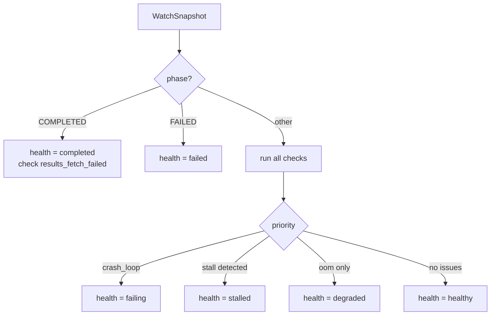

# Watch Diagnosis Issues

`aiperf kube watch` runs a pure-function pattern matcher over each `WatchSnapshot` and attaches a `DiagnosisResult` to the emitted frame. In JSON mode, this shows up as the `diagnosis` object on every NDJSON line, with a `diagnosis.issues[]` array of structured findings and a top-level `diagnosis.health` rollup.

This page documents the nine issue IDs the engine can emit, the exact thresholds that trigger them, and how they map to the overall health state. Use it when writing CI gates, alerting rules, or dashboards that consume `aiperf kube watch --output json`.

The detection logic lives in `src/aiperf/kubernetes/watch_diagnosis.py`; the data shapes are defined in `src/aiperf/kubernetes/watch_models.py`.

---

## Health Model

`DiagnosisResult.health` is one of six string values. Two are driven purely by the job phase; four are derived from the set of issues that fired during the current poll.

| Health | Meaning | Trigger |
|---|---|---|
| `healthy` | No issues detected, job is making progress | Default when no pod/stall/OOM problems fire |
| `degraded` | Job is running but at least one pod has been OOM-killed | `oom_restart` fired, no crash loop, not stalled |
| `stalled` | Job is not making forward progress | Pending >60s, or Running >30s with zero throughput and zero requests_completed |
| `failing` | A pod is in a crash loop; the job cannot recover on its own | `crash_loop` fired (any pod with restarts >3) |
| `completed` | Terminal: job phase is `Completed` | `phase == Phase.COMPLETED` |
| `failed` | Terminal: job phase is `Failed` | `phase == Phase.FAILED` |

For non-terminal phases, `_determine_health` applies a fixed priority: **failing > stalled > degraded > healthy**. A pod can be both OOM-killed *and* in a crash loop; the crash loop wins and the job is reported as `failing`.

Terminal phases short-circuit this logic. Once the job completes or fails, `health` is locked to `completed` or `failed` and no other checks run. The `COMPLETED` branch still calls `_check_results_fetch_failed`, so `results_fetch_failed` is the only issue that can appear on a completed job; on `FAILED`, `issues[]` is always empty.



---

## Issue Taxonomy

Every `DiagnosisIssue` has the same shape: `id`, `severity`, `title`, `detail`, `impact`, `suggested_fix`, and an optional `runbook` link. Severity is one of `info`, `warning`, or `critical` — the current engine only emits `warning` and `critical`.

### `oom_restart`

| | |
|---|---|
| **Severity** | `warning` |
| **Trigger** | Any pod has a container whose `lastState.terminated.reason == "OOMKilled"` |
| **Threshold** | One OOM event is enough |
| **Source** | `PodSnapshot.oom_killed`, built from `status.containerStatuses[*].lastState.terminated.reason` |
| **Health impact** | Sets health to `degraded` if no higher-priority issue fires |
| **Fix** | Increase memory limits in the deployment config. For the operator, raise `AIPERF_K8S_WORKER_MEMORY` or the per-service memory knobs documented in `docs/environment-variables.md`. |

### `crash_loop`

| | |
|---|---|
| **Severity** | `critical` |
| **Trigger** | Any pod's total container restart count exceeds the threshold |
| **Threshold** | `restarts > 3` (the test is strict `>`, so four restarts is the first trigger) |
| **Source** | `PodSnapshot.restarts`, summed across all containers in `status.containerStatuses` |
| **Health impact** | Forces health to `failing` (highest priority) |
| **Fix** | `kubectl logs <pod> --previous` to see what crashed the prior container, then address the root cause before restarting the job. |

### `stalled_pending`

| | |
|---|---|
| **Severity** | `warning` |
| **Trigger** | Job phase is `Pending` and it has been pending for longer than the threshold |
| **Threshold** | `elapsed_seconds > 60.0` |
| **Source** | `WatchSnapshot.phase`, `WatchSnapshot.elapsed_seconds` from the CR poller |
| **Health impact** | Sets health to `stalled` (beats `degraded`, loses to `failing`) |
| **Fix** | Inspect scheduling: `kubectl describe pod <controller-pod>` and node allocatable CPU/GPU. Common causes are missing GPU nodes, unsatisfiable affinity, or a pending PVC bind. |

### `stalled_running`

| | |
|---|---|
| **Severity** | `warning` |
| **Trigger** | Job phase is `Running`, elapsed beyond threshold, *and* there is no evidence of forward progress |
| **Threshold** | `elapsed_seconds > 30.0` **and** `metrics.request_throughput_rps == 0` **and** `progress.requests_completed == 0` |
| **Source** | `WatchSnapshot.metrics`, `WatchSnapshot.progress` |
| **Health impact** | Sets health to `stalled` |
| **Fix** | Check endpoint health (see `endpoint_unreachable`) and worker pod logs. A benchmark that is actively producing requests but has not updated CR annotations yet will **not** trigger this — the check intentionally requires both throughput and requests_completed to be zero. |

### `endpoint_unreachable`

| | |
|---|---|
| **Severity** | `critical` |
| **Trigger** | The JobSet condition `endpoint_reachable` is explicitly `false` |
| **Threshold** | Boolean — fires on first observation |
| **Source** | `WatchSnapshot.conditions["endpoint_reachable"]` |
| **Health impact** | No direct effect on the health rollup (does not set `failing`); surfaces only in `issues[]` |
| **Fix** | Verify the endpoint URL in the CR spec and confirm the inference server is up. If using an in-cluster service, check DNS and network policies. |

### `preflight_failed`

| | |
|---|---|
| **Severity** | `critical` |
| **Trigger** | The JobSet condition `preflight_passed` is explicitly `false` |
| **Threshold** | Boolean — fires on first observation |
| **Source** | `WatchSnapshot.conditions["preflight_passed"]` |
| **Health impact** | No direct effect on the health rollup |
| **Fix** | Review preflight output in the operator logs: `aiperf kube logs --container control-plane | grep preflight`. Typical failures are model/tokenizer mismatches, missing credentials, or unreachable HuggingFace mirrors. |

### `high_error_rate`

| | |
|---|---|
| **Severity** | `warning` |
| **Trigger** | Computed request error rate exceeds the threshold |
| **Threshold** | `error_count / request_count > 0.05` (>5%) |
| **Source** | `WatchSnapshot.metrics.error_count`, `WatchSnapshot.metrics.request_count` |
| **Health impact** | No direct effect on the health rollup |
| **Fix** | Inspect endpoint capacity and sample error responses: `aiperf kube logs -f | grep -i error`. Consider reducing concurrency or the request rate. |

### `high_latency`

| | |
|---|---|
| **Severity** | `warning` |
| **Trigger** | p99 request latency is far larger than the average, suggesting tail-latency instability |
| **Threshold** | `request_latency_p99_ms > 10.0 * request_latency_avg_ms` (with both values `> 0`) |
| **Source** | `WatchSnapshot.metrics.request_latency_avg_ms`, `WatchSnapshot.metrics.request_latency_p99_ms` |
| **Health impact** | No direct effect on the health rollup |
| **Fix** | Check endpoint load, GPU utilization, and queueing. A 10× p99/avg ratio usually points to head-of-line blocking or contention rather than raw capacity. |

### `results_fetch_failed`

| | |
|---|---|
| **Severity** | `warning` |
| **Trigger** | Job is in terminal `Completed` phase but results were not retrievable |
| **Threshold** | `phase == COMPLETED` **and** `conditions["results_available"] == false` |
| **Source** | `WatchSnapshot.conditions["results_available"]` |
| **Health impact** | Surfaces on an otherwise `completed` job; health remains `completed` |
| **Fix** | Check results storage (PVC mount, object store credentials) and the operator's sidecar logs. |

---

## JSON Schema

A single `DiagnosisIssue` is serialized as:

```json
{
  "id": "crash_loop",
  "severity": "critical",
  "title": "Pod in crash loop",
  "detail": "Pod aiperf-bench-7f2a-worker-0 has 5 restarts",
  "impact": "Benchmark cannot make progress while pod keeps crashing",
  "suggested_fix": "Check pod logs: kubectl logs aiperf-bench-7f2a-worker-0 --previous",
  "runbook": null
}
```

The wrapping `DiagnosisResult` on each watch frame looks like:

```json
{
  "diagnosis": {
    "health": "failing",
    "issues": [
      { "id": "crash_loop",  "severity": "critical", "title": "...", "detail": "...", "impact": "...", "suggested_fix": "...", "runbook": null },
      { "id": "oom_restart", "severity": "warning",  "title": "...", "detail": "...", "impact": "...", "suggested_fix": "...", "runbook": null }
    ],
    "stalled": false,
    "stall_reason": null,
    "error_rate": 0.0
  }
}
```

Fields `stalled` and `stall_reason` are populated only by the two stall issues; `error_rate` is always present and is `0.0` when metrics are unavailable or `request_count == 0`.

---

## CI Gate Recipe

The most common gate is **fail the build if any critical issue fires**. Use NDJSON mode so each poll is a complete JSON object, take the last line for the final verdict, and filter on severity with `jq`.

```bash
aiperf kube watch my-benchmark --output json > watch.ndjson

# Final snapshot only
tail -n 1 watch.ndjson > final.json

# Fail if any critical issue was surfaced on the last frame
jq -e '
  .diagnosis.issues
  | map(select(.severity == "critical"))
  | length == 0
' final.json
```

A GitHub Action step wiring this up:

```yaml
- name: Run AIPerf benchmark and gate on critical diagnosis
  run: |
    set -o pipefail
    aiperf kube profile --config bench.yaml --output json | tee watch.ndjson
    tail -n 1 watch.ndjson > final.json
    jq -e '
      .diagnosis.issues
      | map(select(.severity == "critical"))
      | length == 0
    ' final.json || {
      echo "Critical diagnosis issues detected:"
      jq '.diagnosis.issues[] | select(.severity == "critical")' final.json
      exit 1
    }
```

To gate instead on the health rollup (`failing` or `failed`), use:

```bash
jq -e '.diagnosis.health | . != "failing" and . != "failed"' final.json
```

To alert on any warning without failing the build, split the two:

```bash
jq '.diagnosis.issues[] | select(.severity == "warning")' final.json
```

Note that the engine emits only `warning` and `critical` today. If you are migrating from docs that reference `severity == "error"`, update your filter to `critical` — no issue in the current taxonomy uses `error`.
