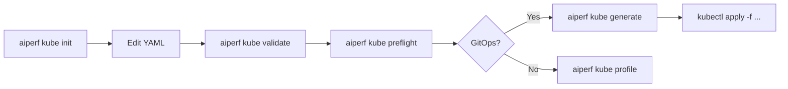

# Config Init and Manifest Generation

AIPerf ships two offline commands that let you author benchmarks as files
before touching a cluster:

- `aiperf kube init` — scaffold a starter YAML config (an `AIPerfJob` CR
  template) that you can edit by hand.
- `aiperf kube generate` — render the finished Kubernetes manifests
  (either an `AIPerfJob` CR or a raw `Namespace + RBAC + ConfigMap +
  JobSet` bundle) to stdout or a file, with no cluster calls.

Both commands are the foundation of a GitOps workflow: you commit the
rendered YAML to a repo, open a PR for review, and then `kubectl apply`
the reviewed file. No cluster access is required to run either command.

## `aiperf kube init`

### Purpose

`init` writes a commented `AIPerfJob` CR template to stdout (or to a
file with `--output`). The template is intentionally minimal — it
covers the required fields and demonstrates the most common optional
sections as commented-out blocks so you can uncomment what you need.

### CLI reference

| Flag | Type | Default | Description |
| --- | --- | --- | --- |
| `-o`, `--output` | path | `None` (stdout) | Output file path. When set, writes to disk; prompts before overwriting an existing file. |

That is the only flag. `init` is deliberately a single-purpose scaffold
command — all customization happens by editing the written file.

### Examples

```bash
# Print template to stdout (pipe it anywhere)
aiperf kube init

# Write to a file
aiperf kube init --output benchmark.yaml

# Write and confirm overwrite if benchmark.yaml already exists
aiperf kube init -o benchmark.yaml
```

### Template walkthrough

The scaffold is an `AIPerfJob` CR. Below is the template as emitted by
`init`; usage comments at the top are substituted with the filename
you wrote to (defaulting to `benchmark.yaml`).

```yaml
# AIPerf Kubernetes Benchmark - AIPerfJob Custom Resource
#
# Usage (CLI):
#   aiperf kube profile --config benchmark.yaml --image <your-image>
#
# Usage (GitOps / operator):
#   kubectl apply -f benchmark.yaml
#
# This file defines an AIPerfJob CR. When using the CLI, --image and other
# Kubernetes flags are still required; benchmark config comes from this file.

apiVersion: aiperf.nvidia.com/v1alpha1
kind: AIPerfJob
metadata:
  name: my-benchmark
spec:
  # === Benchmark Configuration ===
  benchmark:
    # Model name(s) served by the endpoint
    models:
      - "your-model-name"

    # Endpoint to benchmark (list of URLs)
    endpoint:
      urls:
        - "http://your-server:8000"
      streaming: true

    # Dataset configuration
    datasets:
      main:
        type: synthetic
        entries: 1000
        prompts:
          isl:
            mean: 512
            stddev: 0
          osl:
            mean: 128
            stddev: 0

    # Load phases
    phases:
      warmup:
        type: concurrency
        concurrency: 10
        requests: 10
        exclude_from_results: true
      profiling:
        type: concurrency
        concurrency: 50
        requests: 500

  # === Deployment Options ===
  # ttlSecondsAfterFinished: 300
  # timeoutSeconds: 0
  # resourceMode: guaranteed  # guaranteed (requests==limits), burstable (requests only), none (omit all)

  # === Pod Customization ===
  # podTemplate:
  #   nodeSelector:
  #     nvidia.com/gpu.product: "A100"
  #   tolerations:
  #     - key: nvidia.com/gpu
  #       operator: Exists
  #       effect: NoSchedule
  #   imagePullSecrets:
  #     - my-registry-secret
  #   env:
  #     - name: AIPERF_HTTP_CONNECTION_LIMIT
  #       value: "200"
  #   volumes:
  #     - name: model-cache
  #       persistentVolumeClaim:
  #         claimName: model-cache
  #   volumeMounts:
  #     - name: model-cache
  #       mountPath: /root/.cache/huggingface

  # === Kueue Scheduling ===
  # scheduling:
  #   queueName: my-queue
  #   priorityClass: high-priority
```

Replace `your-model-name` and `http://your-server:8000` with real
values before running anything else. A realistic starting point looks
like:

```yaml
benchmark:
  models:
    - "meta-llama/Llama-3.1-8B-Instruct"
  endpoint:
    urls:
      - "http://llm-service.default.svc:8000/v1"
    streaming: true
```

### Relationship with other commands

The file `init` writes is the same format accepted by every other
config-consuming command:

| Command | What it does with the file |
| --- | --- |
| `aiperf kube validate` | Parses and schema-checks the config without any cluster call. |
| `aiperf kube preflight` | Runs cluster reachability + endpoint health probes using the config. |
| `aiperf kube generate` | Renders the final manifests from the config. |
| `aiperf kube profile` | Applies and runs the benchmark on the cluster. |

When invoking `profile` or `generate`, CLI flags for Kubernetes
settings (`--image`, `--namespace`, `--workers-max`, etc.) still
overlay the CR — the file owns the benchmark config, the flags own the
deployment shape.

## `aiperf kube generate`

### Purpose

`generate` renders the YAML that would otherwise be submitted by
`profile`, and writes it to stdout. It does not connect to a cluster
and does not require the AIPerf operator to be installed.

It has two mutually exclusive modes:

- `--operator` — emits a single `AIPerfJob` CR document. Requires the
  AIPerf operator to be installed on the target cluster for
  `kubectl apply` to do anything useful.
- `--no-operator` — emits multiple documents separated by `---`:
  `Namespace`, `Role`, `RoleBinding`, `ConfigMap`, and `JobSet`. Works
  on any cluster with the JobSet controller (no operator required).

One of the two flags must be specified; the command exits with an
error if neither (or both) is given.

### CLI reference

`generate` accepts the full set of `aiperf` benchmark flags plus the
`Kubernetes` / `KubeOptions` group. The mode flags are:

| Flag | Description |
| --- | --- |
| `--operator` | Emit a single `AIPerfJob` CR. |
| `--no-operator` | Emit raw manifests (Namespace + Role + RoleBinding + ConfigMap + JobSet). |

Relevant `KubeOptions` flags that shape the rendered manifests:

| Flag | Default | Description |
| --- | --- | --- |
| `--image` | *(required)* | Container image for AIPerf pods. |
| `--image-pull-policy` | `None` | `Always` / `IfNotPresent` / `Never`. |
| `--name` | auto-generated | Human-readable DNS label, max 40 chars. |
| `--namespace` | `aiperf-benchmarks` | Target namespace. |
| `--workers-max` | `10` | Total workers; divided across pods by `workers_per_pod`. |
| `--ttl-seconds` | `300`. In `--no-operator` mode, when the flag is not set explicitly, `generate` overrides the default to `AIPERF_K8S_JOBSET_DIRECT_MODE_TTL_SECONDS` (8h / 28800s) so pods stay alive for `aiperf kube results`. | Seconds to keep pods after completion. |
| `--node-selector`, `--tolerations` | `{}`, `[]` | Pod placement. |
| `--queue-name`, `--priority-class` | `None` | Kueue scheduling. |
| `--annotations`, `--labels` | `{}` | Extra pod metadata. |
| `--image-pull-secrets`, `--env-vars`, `--env-from-secrets`, `--secret-mounts`, `--service-account` | `[]` / `{}` / `None` | Secrets and credentials. |

Output always goes to **stdout**. Redirect it to capture to a file; a
memory-usage estimate is printed to **stderr** so it does not
contaminate the YAML stream.

### Examples

```bash
# Render an AIPerfJob CR
aiperf kube generate --operator \
  --model Qwen/Qwen3-0.6B \
  --url http://server:8000 \
  --image aiperf:latest

# Render raw manifests
aiperf kube generate --no-operator \
  --model Qwen/Qwen3-0.6B \
  --url http://server:8000 \
  --image aiperf:latest

# Pipe straight to kubectl
aiperf kube generate --no-operator \
  --config benchmark.yaml --image aiperf:latest \
  | kubectl apply -f -

# Capture to disk for review
aiperf kube generate --operator \
  --config benchmark.yaml --image aiperf:latest \
  > benchmarks/nightly-llama3.yaml
```

### What's in the rendered manifest

Operator mode (`--operator`) emits one document:

- `aiperf.nvidia.com/v1alpha1` `AIPerfJob` — the CR, with `spec.benchmark`
  holding the `AIPerfConfig` and the deployment fields (`image`,
  `podTemplate`, `scheduling`, `workers`, etc.) at the top of `spec`.

Direct mode (`--no-operator`) emits, in order:

1. `v1` `Namespace` — emitted only when the deployment's namespace
   field is `None` (auto-generated). `generate` always resolves
   `namespace = --namespace or "aiperf-benchmarks"` before building
   the deployment, so in practice the Namespace document is **not**
   emitted by `aiperf kube generate --no-operator`; create the target
   namespace separately (`kubectl create namespace ...`) if it does
   not already exist.
2. `rbac.authorization.k8s.io/v1` `Role` — grants the controller pod:
   full CRUD on `configmaps`; get/list/watch/create/delete on
   `services` and `endpoints`; get/list/watch/create/patch on
   `events`; read on `pods`, `pods/log`, and `jobs`; full CRUD on
   `jobsets` with read on `jobsets/status`; and
   get/list/watch/patch/update on `aiperfjobs` /
   `aiperfjobs/status`.
3. `rbac.authorization.k8s.io/v1` `RoleBinding` — binds the Role to
   the pods' ServiceAccount (default: `default`).
4. `v1` `ConfigMap` named `aiperf-<job_id>-config`, containing a single
   key `run_config.json` with the fully materialized `BenchmarkRun`
   (1 MiB hard cap — `generate` validates this before emitting).
5. `jobset.x-k8s.io/v1alpha2` `JobSet` named `aiperf-<job_id>` — the
   controller + worker + (optional) GPU telemetry + server-metrics
   pods.

Worker count is derived from the max phase concurrency and
`connections_per_worker`; `generate` runs the same
`apply_k8s_runtime_config` + `apply_worker_config` passes that
`profile` uses, so the rendered JobSet has the correct number of
replicas baked in.

### GitOps recipe

```bash
# 1. scaffold (once)
aiperf kube init -o benchmarks/nightly-llama3.yaml
$EDITOR benchmarks/nightly-llama3.yaml

# 2. render to a reviewable artifact
aiperf kube generate --operator \
  --config benchmarks/nightly-llama3.yaml \
  --image aiperf:latest \
  --workers-max 20 \
  --namespace bench-prod \
  > manifests/nightly-llama3.yaml

# 3. commit + PR
git add benchmarks/nightly-llama3.yaml manifests/nightly-llama3.yaml
git commit -s -m "Add nightly Llama3 benchmark"
# open PR, get reviews

# 4. merge + apply
kubectl apply -f manifests/nightly-llama3.yaml
```

The source config and the rendered manifest are both tracked; the
rendered file is the one the cluster sees, so reviewers can inspect
the exact JobSet spec, RBAC rules, and ConfigMap payload that will be
applied.

### Preview vs. `profile --dry-run`

Both `generate` and `profile --dry-run` run entirely offline and
neither submits anything to the cluster. The difference is output:

| Behaviour | `aiperf kube generate` | `aiperf kube profile --dry-run` |
| --- | --- | --- |
| Cluster calls | None | None |
| AIPerfJob CR output | Yes (`--operator`) | Yes (printed as JSON, operator path) |
| Raw manifests output | Yes (`--no-operator`, YAML) | Yes (YAML, direct path / `--no-operator`) |
| Memory estimate | Yes (stderr) | Yes (stdout) |
| Intended use | GitOps, review, `kubectl apply` | Ad-hoc inspection before a live `profile` run |

Use `generate` when the YAML itself is the artifact you want (to
commit, to diff, to pipe). Use `profile --dry-run` when you just want
to see what `profile` would do without actually running it.

## Validation chain

The typical end-to-end flow is:



Each step is independent and idempotent:

1. **`init`** writes the starter file.
2. **Edit** — adjust models, endpoint, phases, pod template.
3. **`validate`** — schema-check the file; purely offline.
4. **`preflight`** — verify cluster reachability and endpoint health.
5a. **GitOps path**: **`generate`** → commit → `kubectl apply`.
5b. **CLI path**: **`profile`** — deploy and stream progress directly.

For long-lived recurring benchmarks that are reviewed and versioned,
prefer the GitOps path. For ad-hoc experiments, run `profile`
directly — it performs the same manifest generation under the hood.
