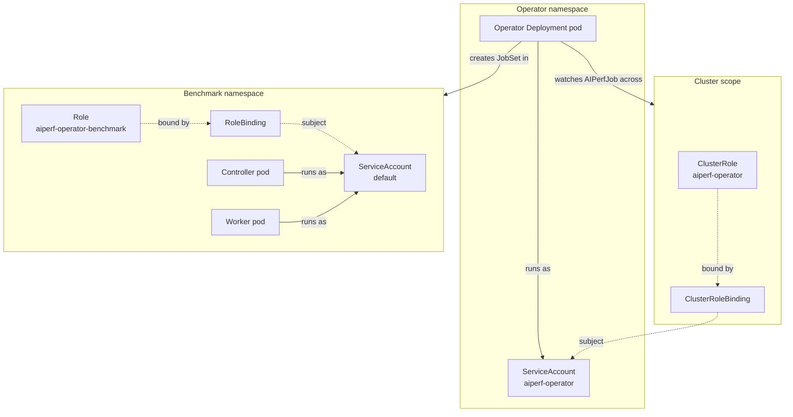

# RBAC and Security

AIPerf separates cluster-wide reconciliation authority from native workload
authority. The `aiperf-k8s-operator` Deployment runs under a ServiceAccount
bound to a `ClusterRole` that watches `AIPerfJob` resources and reconciles the
submitted native envelope into JobSets. Native controller and cell pods run
under a namespace-scoped workload identity that grants only peer discovery and
best-effort status reporting.

The split lets cluster admins pre-provision the operator's cluster-wide
RBAC once (under a security review), then hand developers a `Role` template
that cannot escalate beyond the benchmark namespace. Developers never touch
cluster-scoped resources; operators never grant benchmark pods permissions
they don't need.



The native CLI creates role-specific immutable bootstrap Secrets before it
submits an envelope. The operator's ClusterRole grants cluster-wide Secret
`get` because one operator reconciles AIPerfJobs across namespaces and their
Secret names are dynamic. Kubernetes returns each complete Secret, including
its data, but the operator performs only exact-name reads after binding the
event name and namespace to the envelope; it copies only identity metadata and
does not inspect or log `.data`. It has no Secret
list/watch/create/update/patch/delete permission. Benchmark pods read only
their mounted role material and patch their own status.

## Operator ClusterRole catalog

The operator's `ClusterRole` is rendered from
`deploy/aiperf-k8s-operator/helm/aiperf-k8s-operator/templates/clusterrole.yaml`. Every rule exists
to support a concrete operator responsibility; nothing is granted
speculatively.

| API group | Resources | Verbs | Purpose | Source |
|---|---|---|---|---|
| `apiextensions.k8s.io` | `customresourcedefinitions` | `get, list, watch` | kopf CRD discovery at startup | `clusterrole.yaml:12-14` |
| `aiperf.nvidia.com` | `aiperfjobs`, `aiperfjobs/status`, `aiperfjobs/finalizers` | `get, list, watch, create, update, patch, delete` | Reconcile AIPerfJob CRs, patch status/phase, manage finalizers | `clusterrole.yaml:17-19` |
| `aiperf.nvidia.com` | `aiperfsweeps`, `aiperfsweeps/status`, `aiperfsweeps/finalizers` | `get, list, watch, create, update, patch, delete` | Reconcile AIPerfSweep CRs, patch status, manage finalizers | `clusterrole.yaml:22-24` |
| `jobset.x-k8s.io` | `jobsets` | `create, delete, get, list, patch, update, watch` | Create/own the controller + worker JobSet for each AIPerfJob | `clusterrole.yaml:27-29` |
| `jobset.x-k8s.io` | `jobsets/status` | `get, list, watch` | Observe JobSet readiness and roll it up to AIPerfJob status | `clusterrole.yaml:30-32` |
| `kueue.x-k8s.io` | `workloads` | `get, list, watch` | Surface Kueue admission state on the AIPerfJob status | `clusterrole.yaml:35-37` |
| `batch` | `jobs` | `get, list, watch` | Monitor the Jobs that JobSet creates under the hood | `clusterrole.yaml:40-42` |
| `apps` | `deployments` | `get, list, watch` | Preflight checks for the JobSet controller and Kueue controller | `clusterrole.yaml:45-47` |
| `""` (core) | `serviceaccounts` | `get, list, watch, create` | Preflight verifies custom SA; sweep handler creates a per-sweep SA | `clusterrole.yaml:55-57` |
| `""` (core) | `resourcequotas` | `get, list, watch` | Validate namespace capacity before materializing a submitted envelope | `clusterrole.yaml` |
| `""` (core) | `secrets` | `get` | Validate each dynamically named bootstrap Secret's immutable name, namespace, run, role, and digest identity before JobSet creation | `clusterrole.yaml:21-23` |
| `networking.k8s.io` | `networkpolicies` | `get, list, watch` | Preflight checks whether the benchmark namespace has a restrictive NetworkPolicy | `clusterrole.yaml:63-65` |
| `""` (core) | `configmaps` | `create, delete, get, list, patch, update, watch` | Store benchmark configuration ConfigMap consumed by every benchmark pod | `clusterrole.yaml:68-70` |
| `""` (core) | `services`, `endpoints` | `create, delete, get, list, watch` | Headless Service for pod DNS; endpoint monitoring | `clusterrole.yaml:73-75` |
| `rbac.authorization.k8s.io` | `roles`, `rolebindings` | `create, delete, get, list, watch` | Create the per-namespace benchmark `Role`/`RoleBinding` on first deploy | `clusterrole.yaml:78-80` |
| `""` (core) | `namespaces` | `get, list, watch` | Resolve the benchmark namespace referenced by AIPerfJob | `clusterrole.yaml:83-85` |
| `""` (core) | `pods`, `pods/log` | `get, list, watch` | Surface pod status, restart counts, and logs in `aiperf kube logs` | `clusterrole.yaml:88-90` |
| `""` (core) | `nodes` | `get, list` | Count GPUs for the cluster endpoint served by the API sidecar | `clusterrole.yaml:93-95` |
| `""` (core) | `events` | `get, list, watch, create, patch` | Emit Kubernetes events and let benchmark pods read them for UI display | `clusterrole.yaml:98-100` |

The binding
(`deploy/aiperf-k8s-operator/helm/aiperf-k8s-operator/templates/clusterrolebinding.yaml:8-17`) connects
this `ClusterRole` to the operator `ServiceAccount` in the release namespace.

## Benchmark-namespace Role catalog

`deploy/aiperf-k8s-operator/helm/aiperf-k8s-operator/templates/benchmark-rbac.yaml` renders a `Role`
and a matching `RoleBinding` in every namespace where benchmark pods may
run. By default this is both `default` and the configured
`benchmarkNamespace.name` (default `aiperf-benchmarks`). The `RoleBinding`
subject is the namespace's `default` ServiceAccount — benchmark pods never
need a custom SA.

| API group | Resources | Verbs | Purpose | Source |
|---|---|---|---|---|
| `""` (core) | `pods` | `get, list, watch` | Workers discover controller and peer record processors via pod labels | `benchmark-rbac.yaml:22-24` |
| `jobset.x-k8s.io` | `jobsets` | `get, list, watch, patch, update` | Controller patches JobSet status to signal graceful completion | `benchmark-rbac.yaml:27-29` |
| `aiperf.nvidia.com` | `aiperfjobs`, `aiperfjobs/status` | `get, list, watch, patch, update` | Controller reads AIPerfJob spec and patches per-phase progress fields | `benchmark-rbac.yaml:32-34` |

Notice that benchmark pods have no create/delete permission on any
resource, no access to Secrets, no cross-namespace visibility, and no access
to Events. They can only read what the operator placed there and patch the
status subresources they own.

## `rbac.create=false` workflow

In security-sensitive clusters, RBAC is usually reviewed and committed
separately from workload charts. Set `rbac.create=false` and
`serviceAccount.create=false` to make the operator chart use a
pre-provisioned `ServiceAccount` and skip both the `ClusterRole` + `ClusterRoleBinding`
and the per-namespace `Role` + `RoleBinding`.

```bash
helm install aiperf-operator ./deploy/aiperf-k8s-operator/helm/aiperf-k8s-operator \
  --namespace aiperf-system \
  --set rbac.create=false \
  --set serviceAccount.create=false \
  --set serviceAccount.name=aiperf-operator-sa
```

The cluster admin applies the RBAC tree out-of-band. A minimal example
mirroring the chart defaults:

```yaml
---
# ServiceAccount in the operator namespace
apiVersion: v1
kind: ServiceAccount
metadata:
  name: aiperf-operator-sa
  namespace: aiperf-system
---
# ClusterRole — copy the rules from clusterrole.yaml verbatim
apiVersion: rbac.authorization.k8s.io/v1
kind: ClusterRole
metadata:
  name: aiperf-operator
rules:
- apiGroups: ["aiperf.nvidia.com"]
  resources: ["aiperfjobs", "aiperfjobs/status", "aiperfjobs/finalizers"]
  verbs: ["get", "list", "watch", "create", "update", "patch", "delete"]
# ... (remaining rules from clusterrole.yaml) ...
---
apiVersion: rbac.authorization.k8s.io/v1
kind: ClusterRoleBinding
metadata:
  name: aiperf-operator
roleRef:
  apiGroup: rbac.authorization.k8s.io
  kind: ClusterRole
  name: aiperf-operator
subjects:
- kind: ServiceAccount
  name: aiperf-operator-sa
  namespace: aiperf-system
---
# Per-benchmark-namespace Role + RoleBinding (apply once per namespace)
apiVersion: rbac.authorization.k8s.io/v1
kind: Role
metadata:
  name: aiperf-operator-benchmark
  namespace: aiperf-benchmarks
rules:
- apiGroups: [""]
  resources: ["pods"]
  verbs: ["get", "list", "watch"]
- apiGroups: ["jobset.x-k8s.io"]
  resources: ["jobsets"]
  verbs: ["get", "list", "watch", "patch", "update"]
- apiGroups: ["aiperf.nvidia.com"]
  resources: ["aiperfjobs", "aiperfjobs/status"]
  verbs: ["get", "list", "watch", "patch", "update"]
---
apiVersion: rbac.authorization.k8s.io/v1
kind: RoleBinding
metadata:
  name: aiperf-operator-benchmark
  namespace: aiperf-benchmarks
roleRef:
  apiGroup: rbac.authorization.k8s.io
  kind: Role
  name: aiperf-operator-benchmark
subjects:
- kind: ServiceAccount
  name: default
  namespace: aiperf-benchmarks
```

Under `rbac.create=false`, the operator still tries to call
`create roles` and `create rolebindings` on the first reconcile of a new
namespace (see the `rbac.authorization.k8s.io` rule in the `ClusterRole`
catalog). If the admin pre-provisions the per-namespace `Role` and
`RoleBinding` in every intended benchmark namespace, the operator's
idempotent create returns `AlreadyExists` and reconciliation proceeds.
If you intend to run in a single fixed namespace only, you can trim those
verbs from the admin-owned `ClusterRole` without functional regression.

The helper
`deploy/aiperf-k8s-operator/helm/aiperf-k8s-operator/templates/_helpers.tpl`'s
`aiperf-operator.serviceAccountName` template resolves to `.Values.serviceAccount.name`
when `serviceAccount.create` is false, so the operator Deployment will
reference the pre-provisioned SA as expected.

## Pod `securityContext`

Every container in both the controller and worker pods receives a
hardened `securityContext` assembled by
`build_security_context()` in `src/aiperf/kubernetes/jobset_helpers.py:19-47`.
The base context applied to every container is:

```yaml
securityContext:
  runAsNonRoot: true
  runAsUser: 1000
  runAsGroup: 1000
  allowPrivilegeEscalation: false
  readOnlyRootFilesystem: true
  capabilities:
    drop: ["ALL"]
  seccompProfile:
    type: RuntimeDefault
```

This context is applied to:

- The five control-plane containers in the controller pod
  (`jobset_builder.py:185`)
- The event-bus proxy sidecar (`jobset_builder.py:236`)
- The results-serving sidecar (`jobset_builder.py:263`)
- Each worker and record-processor container

### Overriding via `podTemplate.containerSecurityContext`

The CRD schema at
`deploy/aiperf-k8s-operator/helm/aiperf-k8s-operator/templates/crd-aiperfjob.yaml:837-840` exposes
`spec.podTemplate.containerSecurityContext` as a free-form object. Keys
supplied there merge on top of the base context. `capabilities` is merged
shallowly (user keys update the drop/add lists); all other keys are replaced.

```yaml
apiVersion: aiperf.nvidia.com/v1alpha1
kind: AIPerfJob
metadata:
  name: hardened-run
spec:
  podTemplate:
    containerSecurityContext:
      runAsUser: 65534
      runAsGroup: 65534
      capabilities:
        drop: ["ALL"]
        add: []
  benchmark:
    models: [meta-llama/Meta-Llama-3-8B-Instruct]
    endpoint: {type: chat, url: https://llm.example.com/v1}
    datasets:
      - name: main
        type: synthetic
    phases:
      - name: profiling
        type: concurrency
        concurrency: 10
        requests: 100
```

### What `readOnlyRootFilesystem: true` requires

The root filesystem is read-only. AIPerf writes to five locations, which
must be provided as writable volumes (the JobSet builder already mounts
these as `emptyDir` volumes on every container via
`build_shared_volumes()` in `src/aiperf/kubernetes/jobset_helpers.py`):

- `/aiperf/ipc` — ZMQ IPC socket files (controller mode)
- `/aiperf/datasets` — shared dataset mmap files (dataset-manager writes, API serves to workers)
- `/aiperf/hf_home` — HuggingFace cache (`tokenizer-cache` volume; `HF_HOME` points here)
- `/results` — exported metrics, profile artifacts
- `/tmp` — general scratch (tempfile, matplotlib config)

If you supply an alternate `podTemplate.volumeMounts`, ensure each of these
paths is covered by a writable volume. Otherwise the controller will fail
to bind IPC sockets on startup and pods will CrashLoopBackOff.

## NetworkPolicy expectations

The chart ships an opt-in `NetworkPolicy` template for the operator pod
itself (`deploy/aiperf-k8s-operator/helm/aiperf-k8s-operator/templates/networkpolicy.yaml`, enabled
via `networkPolicy.enabled=true`) — it restricts ingress to the health
port 8080 and the results-server port (`resultsServer.port`, default
8081) and permits egress to DNS (kube-system UDP/TCP 53), the Kubernetes
API server (443/6443), and the configured benchmark namespace. See
[Operator NetworkPolicy](#operator-networkpolicy) below. For benchmark-pod
traffic — the flows listed in the table below — the chart does not ship a
policy; policy is site-specific. When you enforce a default-deny policy
in the benchmark namespace, allow:

| Source | Destination | Ports | Reason |
|---|---|---|---|
| Worker pods | Controller pod | 5557, 5564, 5661/5662, 5663/5664, 5665/5666, 5667, 5668, 5669 (TCP) | ZMQ records push/pull (5557), credit router (5564), dataset-manager proxy DEALER/ROUTER (5661/5662), event-bus XPUB/XSUB (5663/5664), raw-inference PUSH/PULL (5665/5666), control ROUTER/DEALER (5667), credit-return router (5668), credit-return PUSH/PULL fan-in (5669). See `src/aiperf/config/comm/tcp.py:109-178`. |
| All benchmark pods | Controller pod | 8080-8088 (TCP) | Health and readiness probes (`src/aiperf/kubernetes/environment.py:180-215`) |
| Client / ingress | API service | 9090 (TCP) | UI dispatch, progress streaming (`environment.py:195-196`) |
| Client / ingress | Results sidecar | 9091 (TCP) | Post-run result downloads (`environment.py:197-203`) |
| Controller + worker pods | LLM inference endpoint | 443 (TCP) | Outbound HTTPS to the endpoint under benchmark |
| All benchmark pods | `kube-dns` (UDP 53) | 53 | Pod DNS lookups for headless Service peer discovery |
| Operator pod | Kube API server | 443/6443 (TCP) | Watch CRDs, create JobSets, patch status |

Sample allow-list in the benchmark namespace:

```yaml
apiVersion: networking.k8s.io/v1
kind: NetworkPolicy
metadata:
  name: aiperf-benchmark-allow
  namespace: aiperf-benchmarks
spec:
  podSelector:
    matchLabels:
      app.kubernetes.io/name: aiperf
  policyTypes: [Ingress, Egress]
  ingress:
  - from:
    - podSelector:
        matchLabels:
          app.kubernetes.io/name: aiperf
    ports:
    - {protocol: TCP, port: 5557}
    - {protocol: TCP, port: 5564}
    - {protocol: TCP, port: 5661}
    - {protocol: TCP, port: 5662}
    - {protocol: TCP, port: 5663}
    - {protocol: TCP, port: 5664}
    - {protocol: TCP, port: 5665}
    - {protocol: TCP, port: 5666}
    - {protocol: TCP, port: 5667}
    - {protocol: TCP, port: 5668}
    - {protocol: TCP, port: 5669}
  - from: []
    ports:
    - {protocol: TCP, port: 9090}
    - {protocol: TCP, port: 9091}
  egress:
  - to:
    - podSelector:
        matchLabels:
          app.kubernetes.io/name: aiperf
  - to:
    - namespaceSelector:
        matchLabels:
          kubernetes.io/metadata.name: kube-system
      podSelector:
        matchLabels:
          k8s-app: kube-dns
    ports:
    - {protocol: UDP, port: 53}
  - to: []
    ports:
    - {protocol: TCP, port: 443}
```

The final egress rule to `0.0.0.0/0:443` is the LLM endpoint reach; lock
it down to the endpoint's `Service`/`Endpoints` selector or an
`ipBlock.cidr` matching your inference gateway when the target is on-cluster.

### Operator NetworkPolicy

`deploy/aiperf-k8s-operator/helm/aiperf-k8s-operator/templates/networkpolicy.yaml` ships an opt-in
policy that locks down the **operator pod** (not the benchmark pods).
Enable with `networkPolicy.enabled=true`. The rendered policy:

- **Ingress** — allows TCP 8080 (operator health) and TCP
  `resultsServer.port` (default 8081) from the benchmark namespace plus any
  namespaces listed in `networkPolicy.allowedNamespaces`. CIDR blocks in
  `networkPolicy.allowedIngressCIDRs` are added as a second ingress rule
  for external scrapers (e.g. Prometheus, ingress controllers) on the same
  two ports.
- **Egress** — allows DNS (UDP/TCP 53 to `kube-system`), the Kubernetes
  API server (TCP 443 and 6443, no selector), and full egress to the
  benchmark namespace plus any `allowedNamespaces` entries.

Pair this with a default-deny in the operator namespace so only these
flows are permitted. The policy's `podSelector` targets the operator
Deployment labels (`aiperf-operator.selectorLabels`), so other workloads
in the namespace are unaffected.

### Ingress

`deploy/aiperf-k8s-operator/helm/aiperf-k8s-operator/templates/ingress.yaml` ships an opt-in
`Ingress` that exposes the operator's **results-server** (the `API_SERVICE`
on `resultsServer.port`, default 8081) outside the cluster. Disabled by
default — results are reachable via ClusterIP + `kubectl port-forward` or
the `aiperf kube` CLI. Enable with `ingress.enabled=true`.

Security implications:

- **TLS** — set `ingress.tls` to a list of `{hosts, secretName}` entries;
  the chart threads them straight into the Ingress `spec.tls`. Without
  this, traffic to the results server transits the ingress controller as
  plain HTTP.
- **Annotations** — `ingress.annotations` is passed through verbatim. Use
  it to wire ingress-controller-specific auth (e.g. `nginx.ingress.kubernetes.io/auth-*`,
  OIDC annotations), rate limits, and WAF rules. The results server itself
  has no built-in authentication; if the Ingress is reachable from
  untrusted networks, front it with auth at the controller layer.
- **IngressClass** — set `ingress.className` to pin the controller (e.g.
  `nginx`, `traefik`); empty uses the cluster default. Mis-pinning to a
  public-facing class when you meant internal-only is the most common
  misconfiguration.
- **Backend** — each path's default backend port is
  `resultsServer.port`; override per-path with `portNumber` if you fan
  multiple services behind a single host. The Ingress does not expose the
  kopf operator's leader-election or health endpoints.

Pair with `networkPolicy.enabled=true` (see above) so only the Ingress
controller's namespace can reach the operator pod on the results port.

## Least-privilege recipe

A hardened rollout checklist:

1. **Pre-provision operator RBAC** — apply the `ServiceAccount`,
   `ClusterRole`, and `ClusterRoleBinding` under admin review. Install the
   chart with `rbac.create=false` and `serviceAccount.create=false`.
2. **Dedicated benchmark namespace per team** — never share the benchmark
   namespace between teams. Benchmark pods have read access to every pod
   in the namespace (`benchmark-rbac.yaml:22-24`), so coexisting unrelated
   workloads leak metadata.
3. **Distinct ServiceAccounts per namespace** — the benchmark `RoleBinding`
   targets `default`. If multiple apps must coexist, rename the benchmark
   SA (e.g. `aiperf-benchmark-sa`) and set `spec.podTemplate.serviceAccountName`
   on the AIPerfJob instead of binding to `default`.
4. **`runAsNonRoot: true` everywhere** — the base context already enforces
   this. Do not override with `runAsUser: 0`.
5. **`readOnlyRootFilesystem: true`** — keep the default; cover the four
   writable paths above with `emptyDir` volumes.
6. **Drop all Linux capabilities** — the base context drops `ALL`. If a
   sidecar demands `NET_BIND_SERVICE` for a low port, add via
   `containerSecurityContext.capabilities.add` rather than reverting the
   drop.
7. **`seccompProfile: RuntimeDefault`** — default-applied. Do not downgrade
   to `Unconfined`.
8. **NetworkPolicy default-deny + allow-list** — apply the sample above
   and lock the LLM endpoint egress to a CIDR or selector.
9. **ResourceQuota on the benchmark namespace** — AIPerf preflight reads
   quotas (`clusterrole.yaml:58-60`) and will fail fast if headroom is
   insufficient.
10. **Audit logging** — enable Kubernetes audit logging on the
    `aiperf.nvidia.com` and `jobset.x-k8s.io` API groups. Operator
    reconciliation events, including status patches and JobSet creation,
    appear under the operator SA and are easy to attribute.
11. **Image pull secrets** — reference secrets via `imagePullSecrets` in
    `values.yaml` rather than mounting credentials into pods.
12. **PodSecurity admission** — enforce the `restricted` profile on the
    benchmark namespace. AIPerf's default container `securityContext`
    already satisfies it.

With this profile, a compromised benchmark pod cannot escape the
namespace, cannot read cluster-wide resources, cannot write outside its
emptyDir volumes, cannot add capabilities, and can only reach the LLM
endpoint and its own peers.
