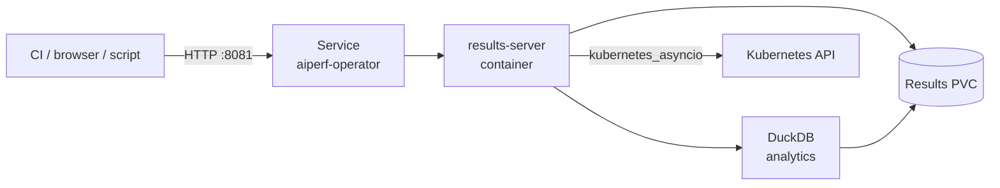

# Results Server API

The AIPerf operator ships a standalone HTTP server (the **results server**) as a sidecar inside the operator pod. It exposes a catalog of `/api/v1/...` endpoints for listing jobs, downloading raw result files, querying DuckDB-backed analytics, and introspecting live AIPerfJob state.

This reference documents every endpoint served by that process. The source of truth is `src/aiperf/operator/results_server.py` and the routers under `src/aiperf/operator/routers/`.

---

## How to reach the API

The results server listens on `resultsServer.port` (default **`8081`**) inside the operator pod. It is fronted by the operator's Service, not exposed externally by default. Two common access patterns:

### Port-forward via the CLI

```bash
aiperf kube dashboard
```

This opens the browser UI and port-forwards the results server to an ephemeral local port. Pass `--no-browser` to just print the URL, or `--port 8081` to pin a specific local port. The port-forward stays open until Ctrl+C.

### Direct `kubectl port-forward`

```bash
kubectl -n aiperf-system port-forward svc/aiperf-operator 8081:8081
```

The base URL is then `http://localhost:8081`, and all endpoints below are reachable at `http://localhost:8081/api/v1/...`.

### Request topology



The sidecar reads result files from the shared PVC and queries the Kubernetes API (via in-cluster RBAC) for live job/cluster state. There is no per-request authentication layer; see [Auth / security](#auth--security).

---

## Endpoint reference

| Method | Path | Router | Purpose |
|--------|------|--------|---------|
| GET | `/healthz` | root | Liveness probe |
| GET | `/api/v1/jobs` | jobs | List active AIPerfJob CRs |
| GET | `/api/v1/jobs/{namespace}/{name}` | jobs | Single CR + pods + raw status |
| POST | `/api/v1/jobs/{namespace}/{name}/cancel` | jobs | Set `spec.cancel=true` |
| GET | `/api/v1/cluster` | jobs | Node count, GPU total, K8s version |
| GET | `/api/v1/results` | results-files | List every stored job |
| GET | `/api/v1/results/{namespace}/{job_id}` | results-files | List files for one job |
| GET | `/api/v1/results/{namespace}/{job_id}/{filename}` | results-files | Download a result file |
| GET | `/api/v1/analytics/leaderboard` | results-analytics | Rank runs by metric |
| GET | `/api/v1/analytics/history` | results-analytics | Metric values over time |
| GET | `/api/v1/analytics/compare` | results-analytics | Side-by-side job compare |
| GET | `/api/v1/analytics/summary/{namespace}/{job_id}` | results-analytics | Full aggregated summary |
| GET | `/api/v1/index` | results-analytics | Fast job index |
| GET | `/api/v1/config/{namespace}/{job_id}` | results-analytics | Original CR spec/config |
| GET | `/dashboard/` | dashboard (WSGI) | Plotly Dash app (returns `503` until the first run lands on the PVC) |

---

## Meta

### `GET /healthz`

Liveness probe. Always returns `200 OK`.

```bash
curl http://localhost:8081/healthz
```

```json
{"status": "ok"}
```

---

## Jobs

Live state read directly from the Kubernetes API. Every endpoint in this section returns `503 Service Unavailable` if the results server could not initialize its Kubernetes client at startup (e.g. no kubeconfig and not running in-cluster).

### `GET /api/v1/jobs`

List every active `AIPerfJob` CR across all namespaces.

**Response reflects the current CR inventory only** — completed jobs whose CRs have been garbage-collected are not listed here; use `GET /api/v1/results` for historical runs.

```bash
curl http://localhost:8081/api/v1/jobs
```

```json
{
  "jobs": [
    {
      "name": "aiperf-bench-7f2a",
      "namespace": "aiperf-benchmarks",
      "phase": "Running",
      "jobId": "aiperf-bench-7f2a",
      "created": "2026-04-22T14:08:11Z"
    }
  ]
}
```

**Status codes**

- `200` — success (possibly empty list)
- `401` / `403` — surfaced verbatim if the sidecar's ServiceAccount lacks RBAC to list `aiperfjobs.aiperf.nvidia.com`
- `503` — Kubernetes client unavailable

### `GET /api/v1/jobs/{namespace}/{name}`

Fetch a single AIPerfJob CR plus its pod roster.

**Path parameters**

| Name | Type | Description |
|------|------|-------------|
| `namespace` | string | Kubernetes namespace of the AIPerfJob CR |
| `name` | string | AIPerfJob CR name |

```bash
curl http://localhost:8081/api/v1/jobs/aiperf-benchmarks/aiperf-bench-7f2a
```

```json
{
  "job": {
    "name": "aiperf-bench-7f2a",
    "namespace": "aiperf-benchmarks",
    "phase": "Running"
  },
  "status": {
    "phase": "Running",
    "conditions": [],
    "liveMetrics": {"requestThroughput": 1842.3}
  },
  "pods": [
    {"name": "aiperf-bench-7f2a-controller-0", "phase": "Running", "ready": true, "restarts": 0},
    {"name": "aiperf-bench-7f2a-worker-0",     "phase": "Running", "ready": true, "restarts": 0}
  ]
}
```

Pods are filtered by the label selector `aiperf.nvidia.com/job-id=<name>`.

**Status codes**

- `200` — success
- `404` — no AIPerfJob with that name in that namespace
- `401` / `403` — RBAC denial
- `503` — Kubernetes client unavailable

### `POST /api/v1/jobs/{namespace}/{name}/cancel`

Request cancellation of a running benchmark by patching the CR's `spec.cancel` to `true`.

**This endpoint is asynchronous.** It returns immediately after the patch; the kopf operator observes the change and drives workers to a stopped state over the next several seconds. Poll `GET /api/v1/jobs/{namespace}/{name}` and wait for `status.phase` to become `Cancelled`, `Failed`, or `Succeeded` if you need to confirm termination.

```bash
curl -X POST http://localhost:8081/api/v1/jobs/aiperf-benchmarks/aiperf-bench-7f2a/cancel
```

```json
{"cancelled": true}
```

**Status codes**

- `200` — patch submitted
- `404` — CR does not exist
- `401` / `403` — RBAC denial
- `409` — concurrent-modification conflict (retry)
- `503` — Kubernetes client unavailable

### `GET /api/v1/cluster`

Best-effort cluster-wide totals for the dashboard header.

```bash
curl http://localhost:8081/api/v1/cluster
```

```json
{
  "nodes": 12,
  "gpus": 96,
  "kubernetes_version": "v1.29.4"
}
```

Both the node list and version query are best-effort: if RBAC is insufficient or the call fails, `kubernetes_version` is reported as `"unknown"` and `nodes`/`gpus` fall back to `0`. The endpoint does not surface errors for these sub-queries.

---

## Results (file serving)

All file-serving endpoints read from the shared results PVC mounted at `AIPERF_RESULTS_DIR` (default `/data`). Files are laid out as `<namespace>/<job_id>/<filename>`.

### `GET /api/v1/results`

List every namespace/job directory with at least one stored file.

```bash
curl http://localhost:8081/api/v1/results
```

```json
{
  "jobs": [
    {
      "namespace": "aiperf-benchmarks",
      "job_id": "aiperf-bench-7f2a",
      "file_count": 8,
      "total_size_bytes": 24837211
    }
  ]
}
```

Returns an empty `jobs` list (not a 404) if the PVC base directory doesn't exist yet.

### `GET /api/v1/results/{namespace}/{job_id}`

List all result files for one job.

```bash
curl http://localhost:8081/api/v1/results/aiperf-benchmarks/aiperf-bench-7f2a
```

```json
{
  "namespace": "aiperf-benchmarks",
  "job_id": "aiperf-bench-7f2a",
  "files": [
    {
      "name": "profile_export_aiperf.csv",
      "stored_name": "profile_export_aiperf.csv.zst",
      "size_bytes": 381220,
      "compressed": true
    },
    {
      "name": "inputs.json",
      "stored_name": "inputs.json",
      "size_bytes": 4812,
      "compressed": false
    }
  ]
}
```

The `name` field is the **display name** (zstd suffix stripped); use it as the `{filename}` path parameter on the download endpoint. `stored_name` is the actual file on disk.

**Status codes**

- `200` — success
- `404` — no directory `<namespace>/<job_id>/` exists, or path traversal detected

### `GET /api/v1/results/{namespace}/{job_id}/{filename}`

Download a single result file. The server handles content negotiation automatically based on `Accept-Encoding`.

The lookup tries `<filename>.zst` first, then `<filename>` as-is. Path parameters are resolved safely under the job directory — any `..` traversal attempt returns `404`.

**Content negotiation for stored `.zst` files**

| Client `Accept-Encoding` | Response `Content-Encoding` | Server action |
|--------------------------|-----------------------------|---------------|
| `zstd` (substring match) | `zstd` | Stream raw bytes unmodified |
| `gzip` (no zstd)         | `gzip` | Decompress zstd, recompress as gzip on the fly |
| anything else / absent   | absent | Decompress zstd to identity |

**Content negotiation for stored raw files**

The `common.compression.select_encoding` helper picks the best encoding the client accepts (default `IDENTITY`). `Content-Encoding` is set only if the server is recompressing; otherwise it's omitted.

**Response headers (both paths)**

- `Content-Disposition: attachment; filename="<display-name>"`
- `X-Filename: <display-name>`

```bash
# Native zstd — smallest over the wire
curl -H "Accept-Encoding: zstd" \
  http://localhost:8081/api/v1/results/aiperf-benchmarks/aiperf-bench-7f2a/profile_export_aiperf.csv \
  --output profile.csv.zst

# Let curl transparently decompress gzip
curl --compressed \
  http://localhost:8081/api/v1/results/aiperf-benchmarks/aiperf-bench-7f2a/profile_export_aiperf.csv \
  -o profile.csv
```

**Status codes**

- `200` — stream begins (note: errors mid-stream surface as truncated bodies, not HTTP errors)
- `404` — job directory missing or neither `<filename>` nor `<filename>.zst` found

---

## Analytics (DuckDB-backed)

These endpoints run DuckDB queries directly against the result files on the PVC — no ETL step. All return `503` with message `"Analytics engine not initialized"` if the results-server lifespan hook has not yet populated the DB handle.

### `GET /api/v1/analytics/leaderboard`

Rank every run by a metric.

**Query parameters**

| Name | Type | Default | Description |
|------|------|---------|-------------|
| `metric` | string | `request_throughput` | Metric to rank by (e.g. `request_throughput`, `request_latency`) |
| `stat` | string | `avg` | Statistic (`avg`, `p50`, `p99`, `min`, `max`) |
| `order` | string | `desc` | Sort order (`asc` or `desc`) |
| `limit` | int | `20` | Max results, `[1, 1000]` |

```bash
curl "http://localhost:8081/api/v1/analytics/leaderboard?metric=request_throughput&stat=avg&limit=5"
```

```json
{
  "metric": "request_throughput",
  "stat": "avg",
  "order": "desc",
  "entries": [
    {
      "namespace": "aiperf-benchmarks",
      "job_id": "aiperf-bench-7f2a",
      "value": 1842.3,
      "unit": "requests/sec",
      "start_time": "2026-04-22T14:08:11Z",
      "end_time":   "2026-04-22T14:13:45Z",
      "model": "meta-llama/Llama-3.1-70B",
      "endpoint": "http://llama:8000/v1/chat/completions"
    }
  ]
}
```

### `GET /api/v1/analytics/history`

Return metric values over time, optionally filtered by model or endpoint.

**Query parameters**

| Name | Type | Default | Description |
|------|------|---------|-------------|
| `metric` | string | `request_throughput` | Metric to track |
| `stat` | string | `avg` | Statistic |
| `model` | string? | `None` | Filter by model name (substring match) |
| `endpoint` | string? | `None` | Filter by endpoint URL (substring match) |
| `limit` | int | `100` | Max results, `[1, 10000]` |

```bash
curl "http://localhost:8081/api/v1/analytics/history?metric=request_latency&stat=p99&model=Llama&limit=50"
```

```json
{
  "metric": "request_latency",
  "stat": "p99",
  "entries": [
    {
      "namespace": "aiperf-benchmarks",
      "job_id": "aiperf-bench-7f2a",
      "value": 412.7,
      "unit": "ms",
      "start_time": "2026-04-22T14:08:11Z",
      "model": "meta-llama/Llama-3.1-70B",
      "endpoint": "http://llama:8000/v1/chat/completions"
    }
  ]
}
```

### `GET /api/v1/analytics/compare`

Pull a side-by-side comparison of named jobs across a set of metrics. The response pivots raw DuckDB rows into `(metric, stat, unit, values={namespace/job_id: value})` entries for the UI.

**Query parameters**

| Name | Type | Default | Description |
|------|------|---------|-------------|
| `jobs` | list[string] | required | Repeat the parameter once per job ID |
| `metrics` | list[string]? | `DEFAULT_COMPARE_METRICS` | Repeat the parameter; defaults to key performance metrics |

```bash
curl "http://localhost:8081/api/v1/analytics/compare?jobs=aiperf-bench-7f2a&jobs=aiperf-bench-9d4c&metrics=request_throughput&metrics=request_latency"
```

```json
{
  "job_ids": ["aiperf-bench-7f2a", "aiperf-bench-9d4c"],
  "metrics": ["request_throughput", "request_latency"],
  "entries": [
    {
      "metric": "request_throughput",
      "stat": "avg",
      "unit": "requests/sec",
      "values": {
        "aiperf-benchmarks/aiperf-bench-7f2a": 1842.3,
        "aiperf-benchmarks/aiperf-bench-9d4c": 1790.8
      }
    }
  ]
}
```

For each metric, the server emits one entry per stat (`avg`, `p50`, `p99`). Entries where no job has a value are omitted. Value keys are `namespace/job_id` when a namespace is known, otherwise just the job ID.

### `GET /api/v1/analytics/summary/{namespace}/{job_id}`

Return the full aggregated summary for one job (as a raw JSON object — no Pydantic schema because the shape is driven by the metrics plugin registry).

```bash
curl http://localhost:8081/api/v1/analytics/summary/aiperf-benchmarks/aiperf-bench-7f2a
```

**Status codes**

- `200` — summary found
- `404` — no summary data for that `namespace/job_id`

### `GET /api/v1/index`

Return the full job index used for fast lookups (backed by `aiperf.operator.job_index`). The shape is an opaque dict consumed by the dashboard.

```bash
curl http://localhost:8081/api/v1/index
```

### `GET /api/v1/config/{namespace}/{job_id}`

Return the original CR spec/config used to run a job. The server tries three sources in order and records which one it used:

1. **Index** (`source: "index"`) — fast path, served from the in-memory job index.
2. **Standalone spec file** (`source: "file"`) — `<base>/<namespace>/<job_id>/job_spec.json` on the PVC.
3. **Summary extraction** (`source: "summary"`) — pulls `input_config` out of the aggregated summary if the spec wasn't persisted separately.

```bash
curl http://localhost:8081/api/v1/config/aiperf-benchmarks/aiperf-bench-7f2a
```

```json
{
  "source": "file",
  "spec": {
    "benchmark": {
      "model": ["meta-llama/Llama-3.1-70B"],
      "endpoint": {"url": "http://llama:8000/v1/chat/completions"}
    }
  }
}
```

**Status codes**

- `200` — config found via one of the three sources
- `404` — none of the sources had data for that `namespace/job_id`

---

## Auth / security

The results server **does not authenticate individual HTTP requests**. Security is delegated to the surrounding cluster layers:

- **In-cluster RBAC.** The sidecar uses its ServiceAccount token to call the Kubernetes API. Every `/api/v1/jobs/*` and `/api/v1/cluster` call runs with those permissions, so `list aiperfjobs`, `get pods`, `patch aiperfjobs/spec`, and `list nodes` must be granted in the operator's ClusterRole. RBAC failures surface as `401` / `403` propagated from `kubernetes_asyncio`.
- **Network isolation.** The Service is typically `ClusterIP` only. External access is expected to come via `kubectl port-forward` (trusted user), `aiperf kube dashboard` (trusted user), or an ingress controller that terminates auth in front of the pod. Add a `NetworkPolicy` if your cluster requires stricter pod-to-pod controls.
- **Path traversal.** File-serving endpoints resolve every `{namespace}/{job_id}/{filename}` under the results directory and reject resolved paths that escape the base (`404`). Callers cannot read files outside the PVC.

Do **not** expose the results server directly to the public internet without a proxy that enforces authentication — the endpoints that mutate state (`POST /api/v1/jobs/.../cancel`) trust the network path.
