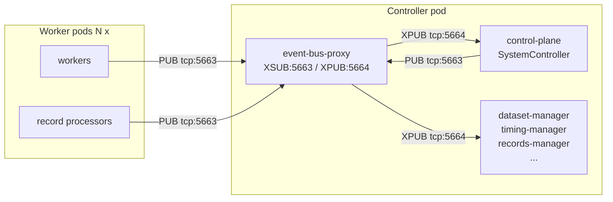

# Controller Pod Sidecars

> **Scope:** **controller-pod** sidecars only — the event-bus proxy and the
> results sidecar that ride alongside the SystemController. The operator
> Pod's `results-server` container (port 8081) is also colloquially called
> a sidecar; that one hosts the operator's HTTP API and is documented in
> [`docs/kubernetes/results-api.md`](results-api.md) and
> `docs/dev/kubernetes-flow.md`. Don't confuse
> the two — the URL stamped onto `AIPerfSweep.status.apiUrl` and the
> sweep-controller's empty-summary fallback both target the **operator**'s
> results-server, never the controller's `results-sidecar`.

Every AIPerf benchmark controller pod runs a short stack of sidecar containers alongside the control-plane process. Two of them — the **event-bus proxy** and the **results sidecar** — exist to offload load or provide a fallback surface that the SystemController itself cannot reliably host. They are invisible in normal usage, but anyone debugging fan-in hangs, startup races, or partial result retrieval needs to know what they do and how to tune them.

The source of truth is `rust/cli/src/kube/manifest.rs` (composition), `rust/cli/src/results_sidecar.rs` (FastAPI app), and `src/aiperf/kubernetes/environment.py` (resource defaults and ports).

---

## Overview

**Event-bus proxy** runs the XPUB/XSUB ZMQ proxy for the benchmark's pub/sub event bus in a dedicated container. It exposes `tcp://*:5663` (XSUB frontend — publishers connect here) and `tcp://*:5664` (XPUB backend — subscribers connect here) on the controller pod so that workers and record processors can connect and publish/subscribe without talking to the SystemController directly. It is an independent sidecar because, at high concurrency, hundreds of simultaneous RP and worker pub/sub connections arriving at pod startup previously starved the SystemController's event loop while it tried to forward socket I/O itself. Health endpoint is `:8088/healthz` and `:8088/readyz`.

**Results sidecar** runs the native `aiperf results-sidecar` artifact server on `:9091` against the controller pod's read-only `/results` volume. It exposes only a validated `results-manifest.json` and the artifacts declared by that manifest after the controller commits exports; this keeps incomplete artifacts unavailable after the controller exits.

Both sidecars are always injected into controller pods by default. Disabling them is almost never correct.

---

## Event-bus proxy

### Architecture



All pub/sub traffic for the benchmark flows through the proxy, not the SystemController. The SystemController is just another subscriber.

### Ports

| Port | Protocol | Name          | Purpose                                    |
|------|----------|---------------|--------------------------------------------|
| 5663 | TCP      | pub-frontend  | XSUB socket that publishers connect to     |
| 5664 | TCP      | sub-backend   | XPUB socket that subscribers connect to    |
| 8088 | HTTP     | health        | `/healthz` liveness, `/readyz` readiness   |

### Resource budget

Defaults are set in `_K8sEnvironment.EVENT_BUS_PROXY`:

| Setting        | Default | Env var                                |
|----------------|---------|----------------------------------------|
| CPU request    | 50m     | `AIPERF_K8S_EVENT_BUS_PROXY_CPU`       |
| Memory request | 64Mi    | `AIPERF_K8S_EVENT_BUS_PROXY_MEMORY`    |

The default request is small because the proxy is pure socket I/O forwarding. Isolating it in its own container (rather than in the SystemController event loop) is what fixed several "SystemController heartbeat timeout during initialization" incidents at 500k+ concurrency: even a brief single-core saturation during the initial subscription storm no longer starves the control plane. If you observe the proxy pegging its core at very large fan-ins, raise `AIPERF_K8S_EVENT_BUS_PROXY_CPU`.

### Startup ordering

The proxy container is prepended to the controller pod's container list, so the kubelet begins pulling and starting it before the control-plane container. The proxy's bind sockets come up in tens of milliseconds — well inside the 90-second client connection-probe timeout used by the rest of the services.

### Disabling (legacy fallback)

Set on the operator deployment:

```
AIPERF_K8S_EVENT_BUS_SIDECAR_ENABLED=false
```

This reverts to pre-sidecar behavior: the SystemController itself hosts the XPUB/XSUB proxy inside its own event loop. This is a legacy code path kept only for bisecting regressions — do not run production benchmarks with it disabled. At anything above ~50k concurrency it will reintroduce the startup fan-in stall that motivated the sidecar in the first place.

---

## Results sidecar

The native `aiperf results-sidecar` runs beside the controller with a read-only
`/results` mount and exposes the final artifact contract on port **9091**. It is
not an in-process controller API and shares no Python response-model source.

### Endpoint catalog

| Method | Path | Purpose |
|---|---|---|
| GET | `/healthz` | Liveness probe; always `200 OK`. |
| GET | `/api/results/list` | List the committed manifest and its declared artifacts. |
| GET | `/api/results/files/{filename}` | Download the manifest or one declared artifact. |

### Results-manifest authorization

The controller commits `results-manifest.json` only after all exported
artifacts are complete. It writes the file atomically, fsyncs the file and its
parent directory, writes the private `.aiperf_results_ready.json` compatibility
marker, then reports completion to the AIPerfJob. The compatibility marker is
not listed or downloadable.

A valid manifest carries the run identifier, readiness and cancellation state,
artifact root, and each artifact's relative path, digest, byte length, and
content type. Before serving any file, the sidecar validates that the manifest
is well formed, the request is the manifest itself or an exact declared
artifact path, and the file still matches its declared metadata. It never
serves checkpoints, temporary files, or other present-but-undeclared files.

Until a valid manifest exists, final artifacts are unavailable. A malformed
manifest, duplicate path, traversal path, directory, symlink escape, reserved
compatibility-marker path, missing file, size mismatch, or digest mismatch
fails closed.

### `GET /api/results/list`

The list response contains `results-manifest.json` and exactly the artifact
paths declared by its validated manifest. It returns no partial or live-run
artifacts.

### `GET /api/results/files/{filename}`

The manifest and declared regular artifacts are available after validation.
The sidecar sets an appropriate content type from manifest metadata and may use
content negotiation for the response representation without changing the
artifact's declared digest. Requests outside the manifest authorization set
return `404`; invalid paths return `400`.

---

## When the results sidecar is used

The independent `aiperf-k8s-operator` indexes the committed manifest through
the sidecar after the controller completes. Its result index and dashboard
consume the versioned artifact contract; the operator does not infer completion
from conventional filenames or read the controller's private marker. Native
`aiperf kube results` renders the indexed result reference or retrieves the
manifest-authorized artifacts through the same public sidecar surface.

---

## Tuning

### Event-bus proxy

| Env var                                | Default | Notes                                                                     |
|----------------------------------------|---------|---------------------------------------------------------------------------|
| `AIPERF_K8S_EVENT_BUS_PROXY_CPU`       | `50m`   | Raise if the proxy pegs one core at >1M concurrency                       |
| `AIPERF_K8S_EVENT_BUS_PROXY_MEMORY`    | `64Mi`  | Rarely the bottleneck                                                     |
| `AIPERF_K8S_EVENT_BUS_SIDECAR_ENABLED` | `true`  | `false` only for bisecting regressions against the pre-sidecar code path  |

### Results sidecar

The native manifest sets the artifact contract. The operator chart supplies
container resources, mount location, and port as explicit envelope material;
the operator does not synthesize native runtime settings.

---

## When to disable

- **Event-bus proxy**: basically never. The pre-sidecar code path exists only as a bisection escape hatch and will reintroduce the SystemController startup starvation it was built to fix.
- **Results sidecar**: always-on for a `native-k8s/v1` controller. Final artifact discovery depends on its manifest-authorized surface.

---

## Troubleshooting

### The `results-sidecar` container is running but final results return `404`

The controller has not committed a valid `results-manifest.json`, so the run has
no network-visible final artifacts. This is expected while export is in
progress. If the controller has exited, inspect the controller status and pod
termination reason: an interrupted export intentionally leaves partial files
unpublished. The sidecar cannot recover data that has not been committed into a
manifest.

### `event-bus-proxy` is `CrashLoopBackOff`

Check `aiperf kube logs -c event-bus-proxy <job>`. The two real failure modes:

- `AddressAlreadyInUse` on 5663/5664 — something else is bound to those ports inside the pod; almost always a sign that the main control-plane container was started with the legacy in-process proxy (`AIPERF_K8S_EVENT_BUS_SIDECAR_ENABLED=false` on one side and `true` on the other). Align both.
- Missing `run_config.json` — the ConfigMap didn't mount before the container started. `aiperf kube debug <job>` will show the volume error.

### `/healthz` returns `200` but connections to `5663`/`5664` hang

The proxy is up but has no subscribers yet. This is normal during pod startup before the control-plane container has registered as a subscriber on `tcp://127.0.0.1:5664`. If it persists more than ~30 seconds after the control-plane container reports `RUNNING`, inspect its logs for `EventBusProxy` connection errors — the control-plane may be trying to run its own in-process proxy instead of connecting to the sidecar.
