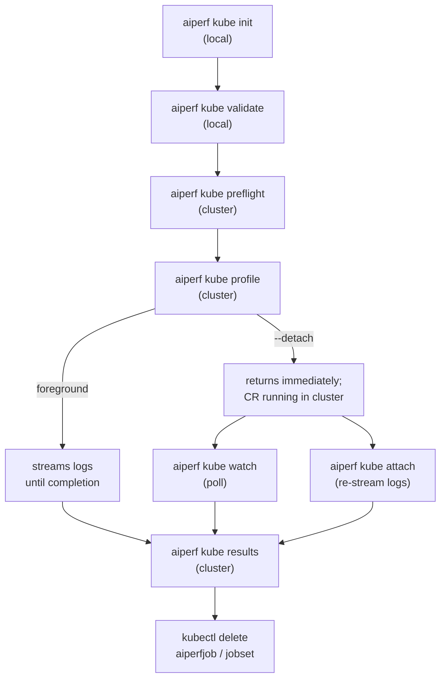

# End-to-End Workflow

This guide walks through the full lifecycle of a single AIPerf benchmark on
Kubernetes: from generating a config template all the way through retrieving
results and cleaning up. Each individual subcommand has its own reference
page; this page is the linear narrative that ties them together and shows how
state flows from one step to the next.

If you have never deployed AIPerf on Kubernetes before, start with
[Getting Started](./getting-started.md) for cluster prerequisites and
installing the operator, then return here.

## Lifecycle overview

Most runs follow the same path. Commands marked "local" run entirely on your
laptop; commands marked "cluster" talk to the Kubernetes API server.



The commands on the left-hand column (init, validate, preflight) are
pre-flight work: they write or inspect files and poke at the cluster but
never create workload resources. `profile` is the one command that actually
deploys.  `attach`, `watch`, `results`, `logs`, and `debug` all operate on an
already-deployed benchmark.

## Stage 1: `init` — scaffold a config

`aiperf kube init` prints a commented AIPerfJob YAML template to stdout, or
writes it to a file with `-o` / `--output`.

```bash
# Print to stdout
aiperf kube init

# Write to benchmark.yaml
aiperf kube init --output benchmark.yaml
```

The template is an `apiVersion: aiperf.nvidia.com/v1alpha1`, `kind: AIPerfJob`
document with commented-out sections for models, endpoints, datasets, and
phases. It is the same CR format the operator accepts, so you can either hand
it to `aiperf kube profile --config benchmark.yaml` or `kubectl apply -f
benchmark.yaml` it directly. See the template body in
`src/aiperf/kubernetes/init_template.py` for the exact fields.

`init` writes nothing else — no cluster state, no `last_kube_benchmark.json`,
no container image references. Image, workers, and namespace are still
supplied at `profile` time via CLI flags.

## Stage 2: `validate` — offline config check

`aiperf kube validate` reads one or more YAML files and validates them
against the CRD schema and the `AIPerfConfig` model, without touching the
cluster. Use it in CI or in a pre-commit hook to catch typos before you
deploy.

```bash
aiperf kube validate benchmark.yaml
aiperf kube validate recipes/**/*.yaml --strict
aiperf kube validate -o json benchmark.yaml
```

See [validate.md](./validate.md) for the full list of checks (RFC 1123 name
validation, endpoint presence, worker math, unknown-field detection, etc.)
and CI recipes.

## Stage 3: `preflight` — cluster-side check

`aiperf kube preflight` confirms that the cluster you are about to deploy
into is actually capable of running the benchmark. It is the first command
that contacts the cluster.

```bash
# Basic
aiperf kube preflight

# With image and endpoint probes and a worker-count projection
aiperf kube preflight \
    --image aiperf:latest \
    --endpoint-url http://server:8000 \
    --workers 8

# JSON output for CI
aiperf kube preflight -o json
```

It verifies connectivity, API versions, RBAC, node capacity vs. worker
projection, image pull-ability, and endpoint reachability. See
[preflight.md](./preflight.md) for the full check list and the JSON schema.
Running `validate` and `preflight` together gives you full coverage of "is
the config sane?" plus "is the cluster ready?".

## Stage 4: `profile` — deploy the benchmark

This is the load-bearing command. It parses a config (from CLI flags or from
the YAML file you validated), picks a deployment mode, submits resources to
the cluster, and optionally streams logs until the benchmark finishes.

### Operator mode vs. direct mode

On startup, `profile` looks for the `aiperfjobs.aiperf.nvidia.com` CRD on the
cluster (see `operator_available` in
`src/aiperf/cli_commands/kube/profile_deploy.py`).

- **Operator mode (default when CRD is present).** `profile` creates a
  single `AIPerfJob` custom resource. The in-cluster operator reconciles the
  CR and owns the lifecycle of the downstream `JobSet`, `ConfigMap`, `Role`,
  and `RoleBinding`. Results are fetched into a shared operator PVC as the
  benchmark runs.

- **Direct mode (CRD absent, or forced with `--no-operator`).** `profile`
  skips the operator and creates the `Namespace`, `ConfigMap`, `Role`,
  `RoleBinding`, and `JobSet` itself. There is no CR and no operator-managed
  PVC; results stay on the pod filesystem until you pull them with `aiperf
  kube results --from-pods`. See [direct-mode.md](./direct-mode.md). The
  JobSet TTL defaults to 8 hours in direct mode (vs. 5 minutes in operator
  mode) specifically so pods stay alive long enough for manual results
  retrieval.

Both modes accept the same flags. To preview the manifests without
submitting them, use `aiperf kube generate --operator` or `aiperf kube
generate --no-operator` instead — or pass `--dry-run` to `profile`, which
prints the would-be CR as JSON in operator mode, or the raw manifests as
multi-document YAML in direct mode.

### Foreground vs. `--detach`

Once the resource is created, `profile` decides whether to block:

- **Foreground (the default, when stdout is a TTY).** The CLI port-forwards
  to the controller pod, streams the log tail and progress updates, and
  exits when the benchmark finishes. Ctrl+C returns to the shell but leaves
  the cluster-side run intact.
- **`--detach` (or any non-interactive stdout, e.g. a pipe or CI).** The CLI
  submits the resource, prints "Detached" with a hint about how to re-attach,
  and exits immediately. The benchmark continues running in the cluster.
  Non-interactive environments auto-upgrade to detach mode with a warning —
  see `wait_or_detach` in `src/aiperf/cli_commands/kube/profile_deploy.py`.

### The "last benchmark" handoff

As part of a successful submit, `profile` writes
`~/.aiperf/last_kube_benchmark.json` — this is how the rest of the workflow
commands default their `job_id` and `--namespace` to "whatever you just
deployed". The file is written by both operator-mode (`deploy_via_operator`)
and direct-mode paths. See [Last benchmark persistence](#last-benchmark-persistence)
below for details.

### Common `profile` invocations

```bash
# From a CR-format YAML file (validated above), with operator auto-detect
aiperf kube profile \
    --config benchmark.yaml \
    --image aiperf:latest \
    --workers-max 10

# From pure CLI flags, foreground, follows logs until done
aiperf kube profile \
    --model Qwen/Qwen3-0.6B \
    --url http://server:8000 \
    --image aiperf:latest \
    --workers-max 8

# CI / scripted: deploy and return control immediately
aiperf kube profile \
    --config benchmark.yaml \
    --image aiperf:latest \
    --detach

# Force direct mode even if the operator is installed
aiperf kube profile \
    --model Qwen/Qwen3-0.6B \
    --url http://server:8000 \
    --image aiperf:latest \
    --no-operator
```

## Stage 5: `attach` — re-connect to a detached run

If you detached (or Ctrl-C'd out of a foreground run), `aiperf kube attach`
re-opens the log stream. It port-forwards to the controller pod's API
container and streams real-time progress over WebSocket.

```bash
# Re-attach to the last deployed benchmark
aiperf kube attach

# Re-attach to a specific job
aiperf kube attach my-benchmark --namespace aiperf-bench
```

Called without arguments, `attach` reads
`~/.aiperf/last_kube_benchmark.json` for the job-id and namespace, so the
zero-argument form works as long as you haven't deployed a second benchmark
in between. Ctrl+C disconnects from the stream without killing the
benchmark.

## Stage 6: `watch` — structured snapshots and diagnosis

`aiperf kube watch` is the "what's it doing right now?" command. Unlike
`attach` (which streams continuously), `watch` polls at a configurable
interval and renders status, metrics, pod health, and diagnosis findings.

```bash
# Default Rich TUI, last deployed job
aiperf kube watch

# Plain-text mode, useful over SSH or in tmux
aiperf kube watch --output text --interval 5

# NDJSON for scripts and AI agents (one JSON object per interval)
aiperf kube watch --output json --follow-logs

# Watch every running job across all namespaces
aiperf kube watch --all
```

`watch` shares the `last_kube_benchmark.json` default-resolution behavior
with `attach`. The diagnosis layer is the same engine `aiperf kube debug`
uses; see [diagnosis-issues.md](./diagnosis-issues.md) for the symptom
catalog.

## Stage 7: `results` — pull the artifacts

When the run is complete (phase `Completed` in `aiperf kube list`), fetch
the artifacts:

```bash
# Default: operator mode — reads from the operator's PVC via HTTP.
aiperf kube results

# Custom output directory (default is ./artifacts/{name})
aiperf kube results --output ./out

# Direct mode, or fallback if the operator hasn't imported results yet
aiperf kube results --from-pods

# Direct mode + let the controller pod exit cleanly
aiperf kube results --from-pods --shutdown

# Summary only (no per-request parquet)
aiperf kube results --summary-only
```

`results` has two retrieval paths:

1. **Operator PVC (default).** Calls the operator's results API at
   `/api/v1/results/...` over a port-forward to the operator pod. Works
   even after the benchmark pods have been TTL-deleted, because the operator
   copied everything into its persistent volume. See
   [results-api.md](./results-api.md) for the HTTP surface and PVC layout.

2. **`--from-pods`.** Goes directly to the benchmark controller pod. Tries
   the controller HTTP API first, then falls back to `kubectl cp`. Required
   for direct-mode deployments; useful in operator mode if the operator
   hasn't synced yet or if you want the raw on-pod artifact tree. Combined
   with `--shutdown`, the controller pod exits cleanly after the copy so the
   JobSet can complete.

Output directory defaults to `./artifacts/{benchmark-name}`.

## Intermediate commands

These don't fit the linear sequence but are part of everyday operation:

- **`aiperf kube list`** — enumerates AIPerfJob CRs (falls back to JobSet
  lookup in direct mode), with `--running`, `--completed`, `--failed`,
  `--watch`, and `-A`. This is how you discover names you've forgotten.
- **`aiperf kube logs`** — raw pod logs, with `--follow`, `--tail`,
  `--container`, and `--output` (save per-pod files to a directory).
- **`aiperf kube debug`** — one-shot diagnostic: pod states, recent events,
  node resources, and a slice of logs from any pod with problems. See
  [diagnosis-issues.md](./diagnosis-issues.md).
- **`aiperf kube dashboard`** — port-forwards the operator's results server
  UI and opens it in your browser. Useful for browsing multiple past
  benchmarks stored on the operator PVC.

## Stage 8: cleanup

Benchmark resources carry a TTL, but you often want to reclaim space (and the
CR name) sooner.

- **Operator mode:**
  ```bash
  kubectl delete aiperfjob my-benchmark -n aiperf-benchmarks
  ```
  The operator cleans up the downstream JobSet, ConfigMap, and RBAC as part
  of CR finalization. The `last_kube_benchmark.json` entry is not cleared
  automatically — subsequent `attach`/`watch`/`results` calls will report
  "not found". Pass `-j` / `-n` explicitly or deploy a new benchmark to
  repopulate.

- **Direct mode:**
  ```bash
  kubectl delete jobset my-benchmark -n aiperf-benchmarks
  ```
  You may also want to clean up the ConfigMap and RBAC if you do not plan to
  re-deploy the same name. In direct mode, the JobSet `ttl_seconds` defaults
  to 28800 (8 hours) so the pods stay alive long enough for `aiperf kube
  results --from-pods`; after TTL, Kubernetes garbage-collects them for you.

## Last benchmark persistence

The file `~/.aiperf/last_kube_benchmark.json` is the glue that lets
`attach`, `watch`, `results`, `logs`, and `debug` default to the most
recently deployed benchmark.

The format is:

```json
{
  "job_id": "qwen3-0-6b-openai-throughput",
  "namespace": "aiperf-benchmarks",
  "name": "my-benchmark"
}
```

`job_id` and `namespace` are always present; `name` is the
user-supplied-or-generated friendly name and is optional. See
`LastBenchmarkInfo`, `save_last_benchmark`, and `get_last_benchmark` in
`src/aiperf/kubernetes/console.py`.

Default-resolution logic lives in `resolve_job_id_and_namespace` in
`src/aiperf/kubernetes/cli_helpers.py`: if `job_id` is explicitly passed,
the flag wins. Otherwise the file is consulted, and if the file is missing
the command prints an error and exits.

**Multi-cluster pitfall.** The file is per-user, not per-kubeconfig or
per-context. If you alternate between clusters in one shell session, always
pass `-j` / `-n` (or `--kube-context`) explicitly. Otherwise "I deployed to
staging and `results` is reading from prod" is an easy way to chase a ghost.

### Command interaction matrix

| Command | Reads `last_kube_benchmark.json` | Writes it | Notes |
| --- | --- | --- | --- |
| `kube init` | no | no | Pure local file generator. |
| `kube validate` | no | no | Offline YAML validation. |
| `kube preflight` | no | no | Uses `--namespace`; no job concept. |
| `kube profile` | no | **yes** (on successful submit) | Both operator and direct paths write the file. |
| `kube generate` | no | no | Prints manifests; never hits cluster state. |
| `kube attach` | yes (if `job_id` omitted) | no | |
| `kube watch` | yes (if `job_id` omitted) | no | `--all` ignores the file. |
| `kube results` | yes (if `job_id` omitted) | no | |
| `kube logs` | yes (if `job_id` omitted) | no | |
| `kube debug` | yes (if `-j` and `-n` both omitted and `-A` not set) | no | |
| `kube list` | no | no | Enumerates the cluster directly. |
| `kube dashboard` | no | no | Operator-scoped, not job-scoped. |

## Common end-to-end recipes

### Quick smoke test, foreground

Typical developer loop: validate, deploy, watch logs inline, pull results.

```bash
aiperf kube init --output smoke.yaml
# edit smoke.yaml: set models, endpoint, datasets
aiperf kube validate smoke.yaml
aiperf kube preflight --image aiperf:latest --endpoint-url http://server:8000
aiperf kube profile --config smoke.yaml --image aiperf:latest
aiperf kube results
```

Because `profile` stays in the foreground, the last three commands are a
tight cycle: change config, re-run `profile`, inspect artifacts.

### Long-running benchmark, detached

For multi-hour runs from a laptop, CI, or SSH session, detach up front and
poll with `watch`.

```bash
aiperf kube profile --config long.yaml --image aiperf:latest --detach
# ... walk away; come back later ...
aiperf kube watch                  # current state, metrics, diagnosis
aiperf kube list --running         # or check every job
aiperf kube results                # once watch reports Completed
```

CI systems automatically hit this path because stdout is not a TTY — no need
to pass `--detach` explicitly. Poll with `aiperf kube watch --output json` in
a timeout loop if you need scripted completion detection.

### Multi-user shared cluster

On a cluster shared by multiple users, deploy each benchmark into its own
namespace and use [Kueue](./kueue.md) to gate admission.

```bash
aiperf kube profile \
    --config long.yaml \
    --image aiperf:latest \
    --namespace bench-alice \
    --kueue-local-queue aiperf-local-queue \
    --detach
aiperf kube watch --namespace bench-alice
aiperf kube results --namespace bench-alice
```

Because `last_kube_benchmark.json` is per-user (not per-namespace), Alice's
shell and Bob's shell each remember their own most-recent deploy
independently. Within a single shell, always pass `--namespace` explicitly
when you work across more than one.

## Related references

- [Getting Started](./getting-started.md) — cluster prerequisites, operator
  install.
- [Configuration](./configuration.md) — CLI and CR configuration surfaces.
- [Validate](./validate.md) — YAML validation details.
- [Preflight](./preflight.md) — cluster-readiness checks.
- [Direct mode](./direct-mode.md) — running without the operator.
- [Diagnosis issues](./diagnosis-issues.md) — symptom catalog used by
  `watch` and `debug`.
- [Results API](./results-api.md) — operator PVC retrieval and HTTP surface.
- [Kueue](./kueue.md) — multi-tenant admission control.
- [Production](./production.md) — hardening, quotas, and monitoring.
