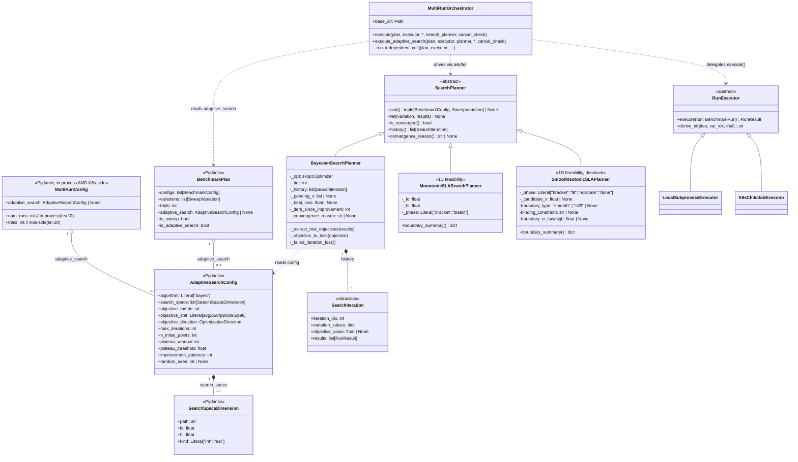
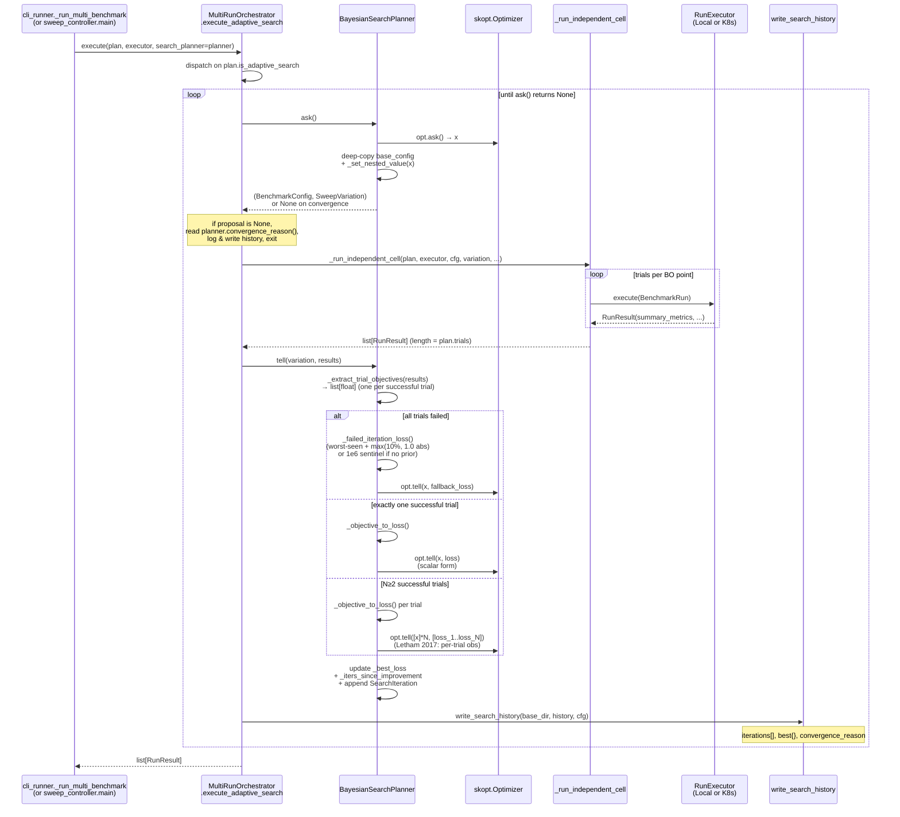
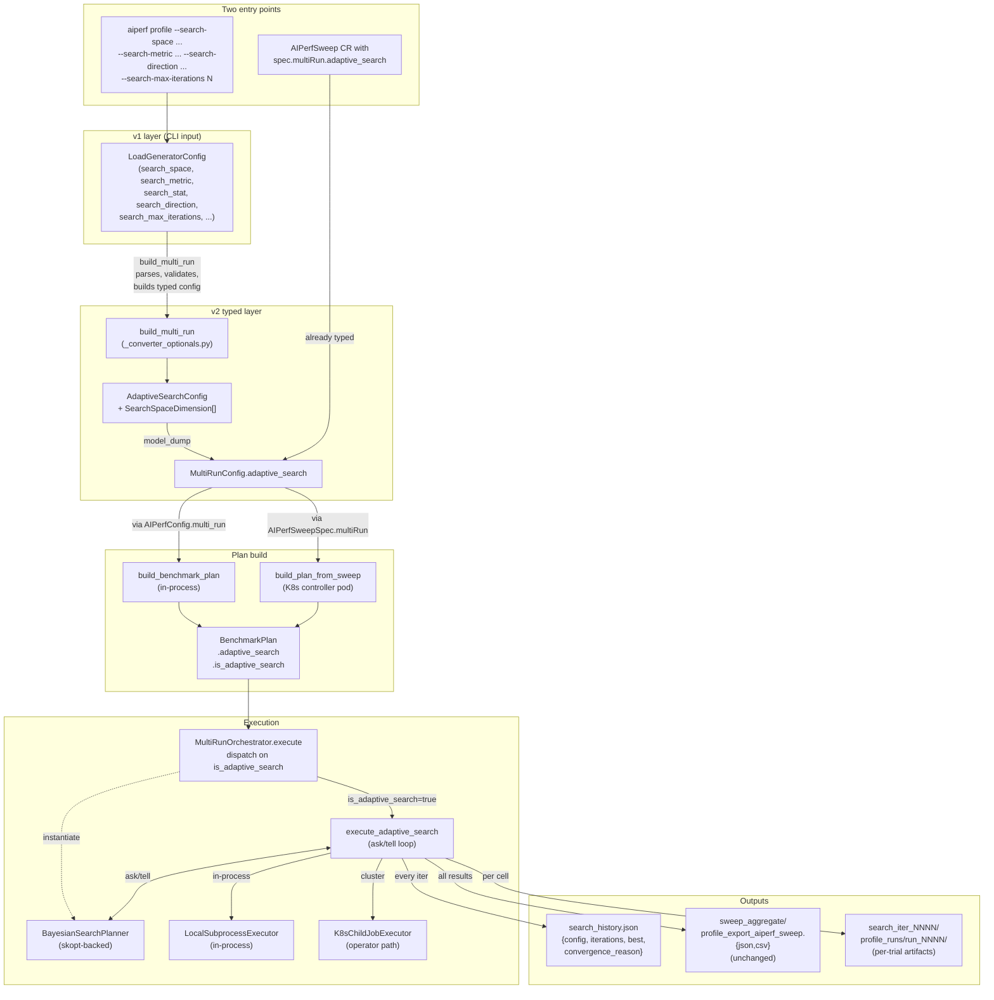

# Adaptive-Search Architecture

How AIPerf's Bayesian-Optimization outer loop is wired together: the protocols, the runtime sequence, and the config-to-execution flow. This is a developer reference; for the user-facing CLI guide see [Bayesian-Optimization Outer Loop](../sweeping/bayesian-optimization.md).

> **Schema-2.0 note (May 2026).** Class diagrams and field paths below still
> reference the pre-redesign shape: `MultiRunConfig.adaptive_search`,
> `BenchmarkPlan.adaptive_search`, and the flat
> `objective_metric`/`objective_stat`/`objective_direction` triple on
> `AdaptiveSearchConfig`. In schema 2.0 the production type is
> `AdaptiveSearchSweep` (one of the `AIPerfConfig.sweep` discriminator
> variants, alongside `GridSweep` and `ScenarioSweep`) and the objective
> triple is nested under a single `objective:` block. `AdaptiveSearchConfig`
> survives only as the recipe-author shim. Sequence diagrams and dispatch
> mechanics (`MultiRunOrchestrator.execute` / `execute_adaptive_search`,
> `BayesianSearchPlanner`, `search_history.json`) are unchanged.

## Class structure

The planner and the orchestrator talk through narrow protocols. `MultiRunOrchestrator` doesn't know about Bayesian Optimization — it only knows `SearchPlanner` and `RunExecutor`. The skopt dependency is hidden inside `BayesianSearchPlanner`; `MonotonicSLASearchPlanner` and `SmoothIsotonicSLAPlanner` are 1D-feasibility-search planners that plug in at the same `SearchPlanner` ABC. Future planners (Optuna TPE, random-search baseline, etc.) plug in identically.

### Registered planners

| Plugin name | Class | Module | Purpose |
|---|---|---|---|
| `bayes` | `BayesianSearchPlanner` | `bayesian.py` | Multi-dim BO with skopt; objective-driven; supports SLA filters via penalty / EIC mode |
| `monotonic_sla` | `MonotonicSLASearchPlanner` | `monotonic.py` | 1D exponential probe + bisection mirroring perf_analyzer's `--binary-search`. Margin-magnitude-blind. |
| `smooth_isotonic` | `SmoothIsotonicSLAPlanner` | `smooth_isotonic.py` (+ helpers `_smooth_isotonic_fit.py`, `_replicate_budget.py`, `_cliff_detect.py`, `_margin_normalize.py`) | 1D PAVA + PCHIP smooth-isotonic fit; opt-in replicates and bootstrap CI; cliff-curve guard. Default for `max-concurrency-under-sla`. |

All three are registered in `src/aiperf/plugin/plugins.yaml` under the `search_planner:` category and resolved via `plugins.get_class(PluginType.SEARCH_PLANNER, name)`.

The CLI grammar lives in `aiperf.orchestrator.search_planner.parsing.parse_search_space(values)`, which converts `--search-space "path:lo,hi[:kind]"` strings into `SearchSpaceDimension` instances. After the v1→v2 converter (`build_multi_run` in `aiperf.config.v1._converter_optionals`) packages everything into a typed `AdaptiveSearchConfig`, the CLI half of the path drops away — the cluster path arrives at the same typed config via `AIPerfSweepSpec.multi_run.adaptive_search`.

## Runtime sequence — one BO iteration

`MultiRunOrchestrator.execute_adaptive_search` is a thin loop. Every iteration: ask the planner for a `(BenchmarkConfig, SweepVariation)`; run all configured trials at that point via the same `_run_independent_cell` grid sweeps use; tell the planner what happened; write `search_history.json` incrementally. When `ask()` returns `None`, surface the planner's `convergence_reason()` and exit.

A few things this view makes explicit:

- **Per-trial observations to the GP.** When N≥2 trials succeed, the planner calls `opt.tell([x]*N, [y_1..y_N])` instead of pre-averaging — skopt's GP estimates the noise term σ²ₙ from the within-point spread. Pre-averaging discards information the GP could use. (Letham et al. 2017, [arXiv:1706.07094](https://arxiv.org/abs/1706.07094).)
- **Failed-iteration loss.** When zero trials succeed, the planner synthesizes a `worst-seen-loss + max(10%, 1.0 absolute)` margin (or a `1e6` sentinel if nothing has yet succeeded) so skopt's ask/tell pairing stays consistent and the GP kernel matrix doesn't see inf/nan.
- **Three convergence signals.** `is_converged()` checks max_iterations, then improvement-over-best patience, then coefficient-of-variation plateau. The first to fire wins; the reason is recorded in `search_history.json`.

## Config flow — CLI / YAML → execution

Two entry points feed the same typed config; from `MultiRunConfig.adaptive_search` onward, the in-process and cluster paths are identical except for which `RunExecutor` impl is plugged in.

## Notes on extension points

- **Adding a new planner backend** (Optuna TPE, random-search baseline, etc.): subclass `SearchPlanner`, implement the four abstract methods (`ask`/`tell`/`is_converged`/`history`); optionally override `convergence_reason` (default returns `None`) and `boundary_summary` (1D feasibility planners only). No orchestrator changes required — `MonotonicSLASearchPlanner` and `SmoothIsotonicSLAPlanner` are existing examples of non-BO planners reusing the same ABC. The `algorithm` field on `AdaptiveSearchConfig` is `Literal["bayes"]` today; promoting it to a `CaseInsensitiveStrEnum` and dispatching in `cli_runner._run_multi_benchmark` (or the cluster equivalent in `sweep_controller.main`) is the only wiring.
- **Adding a new executor backend**: subclass `RunExecutor`. Both `LocalSubprocessExecutor` and `K8sChildJobExecutor` already iterate one (variation, trial) at a time via `execute(BenchmarkRun)` — the seam is adaptive-shaped by construction.
- **Replacing skopt.** The `BayesianSearchPlanner` boundary is the only skopt-aware code in the project (plus the `[bo]` extra in `pyproject.toml`). Swapping to BoTorch / Optuna is a single-file change with no API break, which is what unlocks the deferred upgrades documented under "What this implementation isn't" in the [user-facing BO doc](../sweeping/bayesian-optimization.md).

## Related

- [Bayesian-Optimization Outer Loop](../sweeping/bayesian-optimization.md) — user-facing CLI guide.
- [Adaptive search on Kubernetes](../kubernetes/sweeps.md#adaptive-search-bayesian-optimization) — cluster-side wiring.
- [Parameter Sweeping](../tutorials/parameter-sweeping.md) — grid-sweep alternative when adaptive search isn't the right tool.
