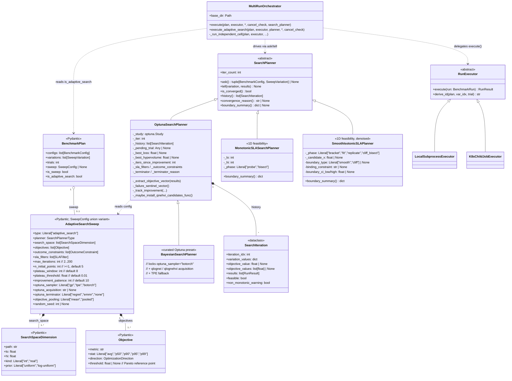
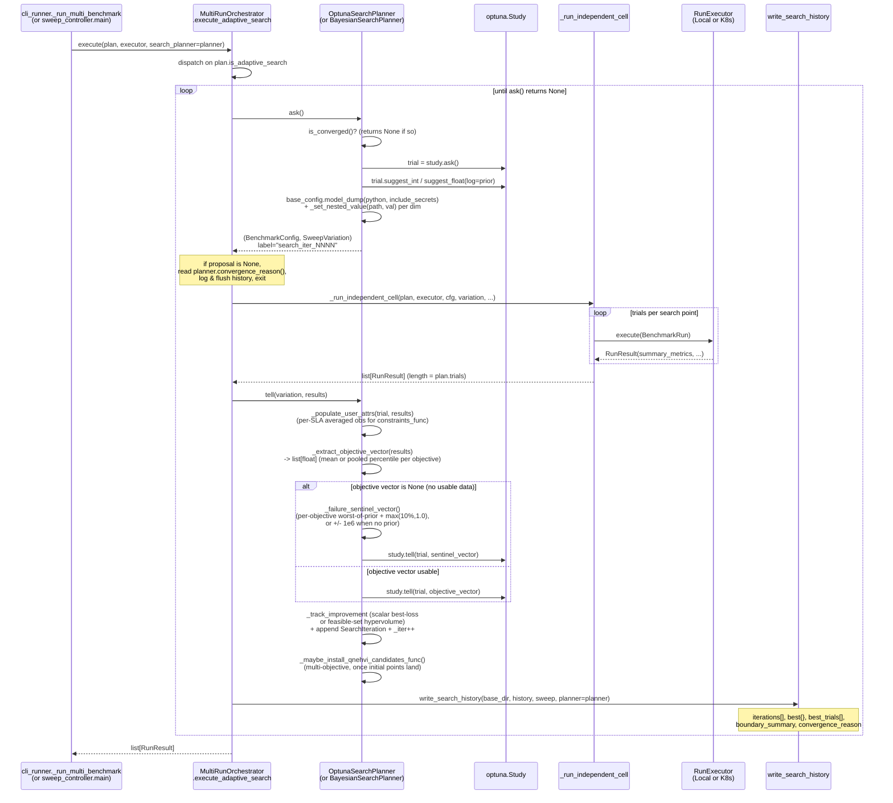
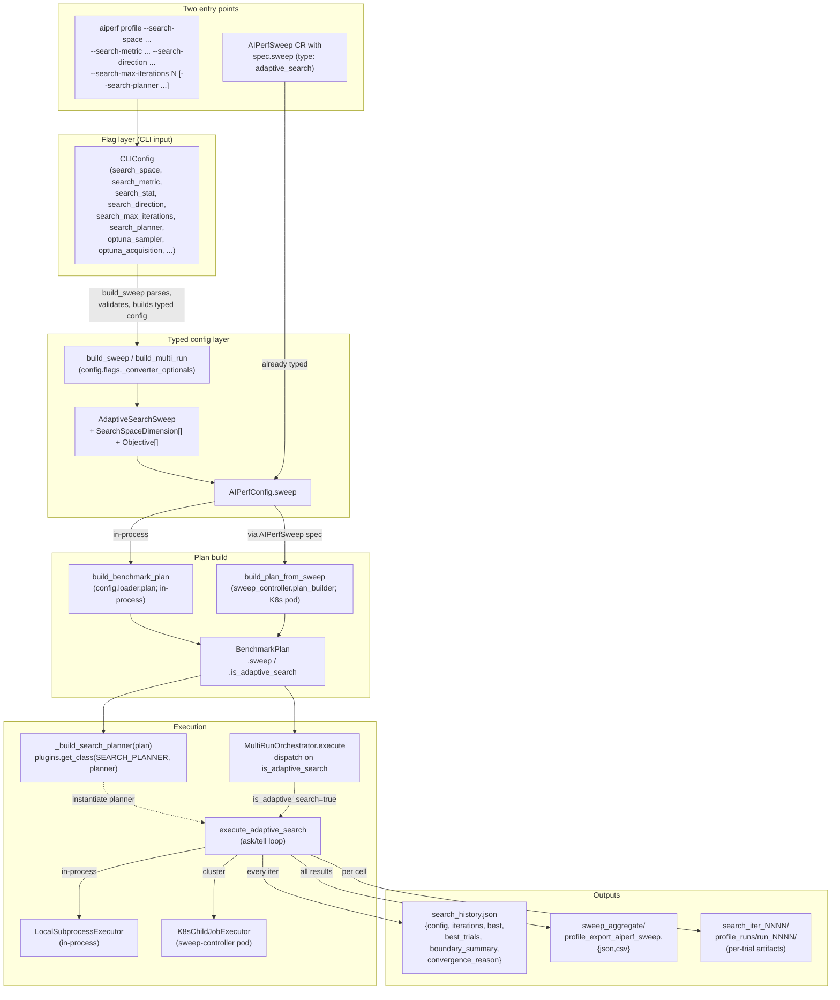

# Adaptive-Search Architecture

How AIPerf's adaptive-search outer loop is wired together: the protocols, the runtime sequence, and the config-to-execution flow. This is a developer reference; for the user-facing CLI guide see [Bayesian-Optimization Outer Loop](../sweeping/bayesian-optimization.md).

The optimization backend is [Optuna](https://optuna.org/) (a default dependency), with the modern Gaussian-process path supplied by the optional [BoTorch](https://botorch.org/) stack (`pip install aiperf[botorch]`). There is no skopt anywhere in the code — the default planner is a curated Optuna preset.

## Class structure

The planner and the orchestrator talk through narrow protocols. `MultiRunOrchestrator` doesn't know about Bayesian Optimization — it only knows `SearchPlanner` and `RunExecutor`. The Optuna dependency is hidden inside `OptunaSearchPlanner`; `BayesianSearchPlanner` is a thin curated subclass of it, and `MonotonicSLASearchPlanner` / `SmoothIsotonicSLAPlanner` are 1D-feasibility-search planners that plug in at the same `SearchPlanner` ABC.

### Registered planners

Four planners are registered in `src/aiperf/plugin/plugins.yaml` under the `search_planner:` category and resolved via `plugins.get_class(PluginType.SEARCH_PLANNER, str(cfg.planner))`.

| Plugin name | Class | Module | Purpose |
|---|---|---|---|
| `bayesian` | `BayesianSearchPlanner` | `bayesian.py` | Curated Optuna preset. Tries `optuna_sampler="botorch"` with `qlognei` (single-objective) / `qlognehvi` (multi-objective); falls back to Optuna's core TPE with a warning when the optional BoTorch stack is unavailable. Default planner. |
| `optuna` | `OptunaSearchPlanner` | `optuna_planner.py` | Expert mode. Explicit `--optuna-sampler` (`tpe` / `gp` / `botorch`) and `--optuna-acquisition` selection; optional posterior-regret terminator. `bayesian`'s superclass. |
| `monotonic_sla` | `MonotonicSLASearchPlanner` | `monotonic.py` | 1D exponential probe + bisection mirroring perf_analyzer's `--binary-search`. Requires exactly one `int` dimension and >=1 SLA filter. Margin-magnitude-blind. |
| `smooth_isotonic` | `SmoothIsotonicSLAPlanner` | `smooth_isotonic.py` (+ helpers `_smooth_isotonic_fit.py`, `_smooth_isotonic_phases.py`, `_replicate_budget.py`, `_cliff_detect.py`, `_margin_normalize.py`) | 1D PAVA + PCHIP smooth-isotonic fit; opt-in replicates and bootstrap CI; cliff-curve guard. Default for `max-concurrency-under-sla`. |

When two or more SLO tiers are configured (via `--search-sla-tier`), `_build_search_planner` overrides the selection with `MultiTierPlanner` (`multi_tier_planner.py`) regardless of `planner`.

`AdaptiveSearchSweep` is one of the `SweepConfig` discriminated-union variants (`Discriminator("type")`, alongside `GridSweep`, `ZipSweep`, `ScenarioSweep`, `SobolSweep`, `LatinHypercubeSweep`). `BenchmarkPlan.is_adaptive_search` is simply `isinstance(self.sweep, AdaptiveSearchSweep)`.

The CLI grammar lives in `aiperf.orchestrator.search_planner.parsing`: `parse_search_space(values)` converts `--search-space "path:lo,hi[:kind]"` into `SearchSpaceDimension` instances, `parse_sla_filter` / `parse_sla_tier` handle `--search-sla` / `--search-sla-tier`. The objective (`--search-metric` / `--search-stat` / `--search-direction`) is three plain Pydantic-validated fields and needs no parser.

## Runtime sequence — one search iteration

`MultiRunOrchestrator.execute_adaptive_search` is a thin loop. Every iteration: ask the planner for a `(BenchmarkConfig, SweepVariation)`; run all configured trials at that point via the same `_run_independent_cell` grid sweeps use; tell the planner what happened; write `search_history.json` incrementally. When `ask()` returns `None`, surface the planner's `convergence_reason()` and exit.

A few things this view makes explicit:

- **Pre-averaged objective per trial group.** `_extract_objective_vector` reduces the per-point trial set to one value per objective — the arithmetic mean of finite per-trial values (`objective_pooling="mean"`), or, when `objective_pooling="pooled"` and the stat is a percentile, `np.percentile` over the pooled raw-sample bag walked from each trial's `profile_export.jsonl` (requires `--export-level records`). Optuna receives exactly one `study.tell(trial, vector)` per iteration.
- **Multi-objective is first-class.** `objectives` is a list. Length 1 is single-objective BO; length N is Pareto BO (BoTorch `qLogNEHVI` / `qNEHVI` / `qEHVI`). The `study` is created with `directions=[...]` and, for the multi-objective path, `_maybe_install_qnehvi_candidates_func` binds the qNEHVI `candidates_func` once `n_initial_points` feasible probes have accumulated so a reference point can be derived.
- **Constraints via Optuna, not penalty reweighting.** SLA filters and `outcome_constraints` are written to `trial.user_attrs` during `tell()` and read back by Optuna's first-class `constraints_func` at `study.tell()` time. `iteration_feasibility` also stamps `SearchIteration.feasible` so `write_search_history` can do feasibility-first best-result selection.
- **Failed-iteration sentinel.** When zero trials produce a usable objective, `_failure_sentinel_vector` synthesizes a per-objective value strictly worse than any seen so far (worst-of-prior plus a `max(10%, 1.0)` margin in that objective's worse direction), or `±1e6` (`NO_DATA_SENTINEL_LOSS`) when nothing has yet succeeded — so the ask/tell pairing stays consistent and the GP kernel never sees NaN/inf.
- **Convergence signals.** `is_converged()` runs the shared three-signal check first (`max_iterations`, then `improvement_patience`, then `plateau_cv`), then — for `optuna` / `bayesian` only — an optional Optuna terminator (`posterior_regret_bound` for Makarova 2022, `emmr` for Ishibashi 2023). The first to fire wins; the reason is recorded in `search_history.json`. The 1D SLA planners add their own reasons (`monotonic_precision_reached` / `monotonic_no_pass_in_range` / `monotonic_no_failure_in_range`, and `smooth_isotonic_*`).

## Config flow — CLI / YAML -> execution

Two entry points feed the same typed `AdaptiveSearchSweep`; from `AIPerfConfig.sweep` onward, the in-process and cluster paths are identical except for which `RunExecutor` impl is plugged in.

## Notes on extension points

- **Adding a new planner backend**: subclass `SearchPlanner`, implement the four abstract methods (`ask` / `tell` / `is_converged` / `history`); optionally override `iter_count` (default reads `self._iter`), `convergence_reason` (default returns `None`), and `boundary_summary` (1D feasibility planners only). Register the class in `plugins.yaml` under `search_planner:` — `_build_search_planner` resolves it via `plugins.get_class(PluginType.SEARCH_PLANNER, str(cfg.planner))`, so no orchestrator changes are required. `BayesianSearchPlanner` (subclass of `OptunaSearchPlanner`) and the 1D SLA planners are existing examples spanning both the "curated preset" and "non-BO" shapes.
- **Adding a new executor backend**: subclass `RunExecutor` and implement `execute(BenchmarkRun) -> RunResult` + `derive_id`. Both `LocalSubprocessExecutor` and `K8sChildJobExecutor` already iterate one (variation, trial) at a time, so the seam is adaptive-shaped by construction.
- **Swapping the optimizer.** The Optuna boundary is confined to `OptunaSearchPlanner` plus `_optuna_helpers` (sampler construction, hypervolume, qNEHVI candidates_func) and the `botorch` extra in `pyproject.toml`. `optuna` core is a default dependency; only the GP/BoTorch path is optional, and `BayesianSearchPlanner` degrades to TPE when it is absent.

## Related

- [Bayesian-Optimization Outer Loop](../sweeping/bayesian-optimization.md) — user-facing CLI guide.
- [Adaptive search on Kubernetes](../kubernetes/sweeps.md) — cluster-side wiring.
- [Parameter Sweeping](../tutorials/parameter-sweeping.md) — grid-sweep alternative when adaptive search isn't the right tool.
