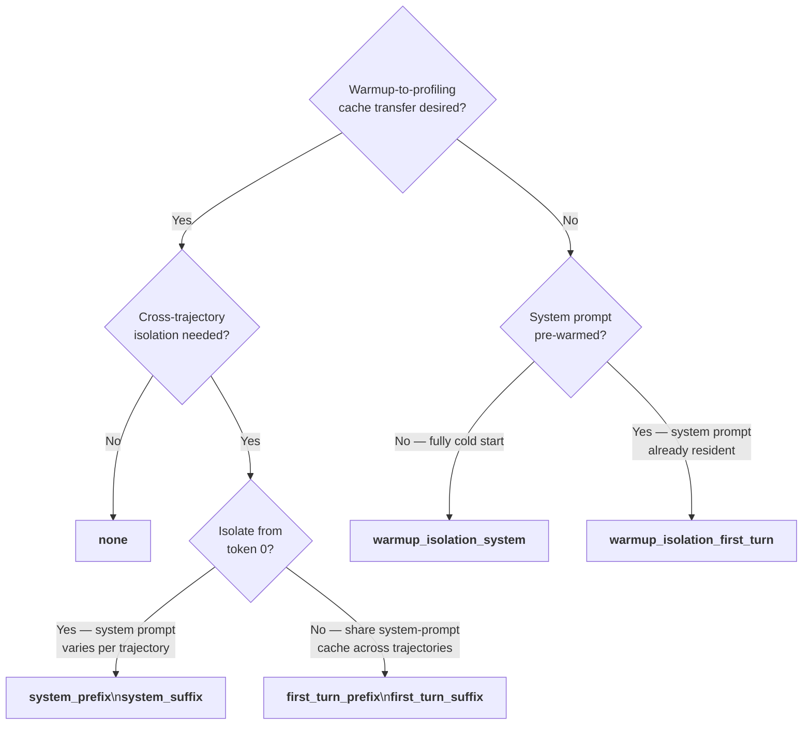

# Cache-Bust Targets

The `--cache-bust` flag (CLI) or `cache_bust.target` (YAML) controls how AIPerf mutates outgoing
request payloads to defeat the server's KV-cache prefix matching. This is essential when you need
per-trajectory isolation or want precise control over how much warmup KV-cache work carries over
into the profiling phase.

## Behavior Table

| Target | Marker | Per-trajectory unique | Injection point | Warmup→Profiling KV cache | Cross-trajectory isolation |
|---|---|---|---|---|---|
| `none` | — | — | — | Full warmup priming | None |
| `system_prefix` | `[rid:xxx]\n\n` | Yes (SHA-256 digest) | System message (token 0) | Full warmup priming (shared marker) | Yes |
| `system_suffix` | `\n\n[rid:xxx]` | Yes (SHA-256 digest) | System message (end) | Full warmup priming (shared marker) | Yes |
| `first_turn_prefix` | `[rid:xxx]\n\n` | Yes (SHA-256 digest) | First user turn (token 0) | System prompt pre-warmed; user cold | Yes |
| `first_turn_suffix` | `\n\n[rid:xxx]` | Yes (SHA-256 digest) | First user turn (end) | System prompt pre-warmed; user cold | Yes |
| `warmup_isolation_system` | `[warmup]\n\n` | No (constant) | System message (token 0) | None — fully cold start | N/A |
| `warmup_isolation_first_turn` | `[warmup]\n\n` | No (constant) | First user turn (token 0) | System prompt pre-warmed; user cold | N/A |

## `none` (default)

Cache-bust is disabled. No marker is injected. The server's KV-cache prefix matching operates
without interference: warmup turns prime the cache, and profiling requests for the same trajectory
benefit from that warm state.

**Wire payload (chat, warmup and profiling identical):**

```json
{
  "messages": [
    {"role": "system", "content": "You are a helpful assistant."},
    {"role": "user",   "content": "What is the capital of France?"}
  ]
}
```

## RID-Based Targets

`system_prefix`, `system_suffix`, `first_turn_prefix`, and `first_turn_suffix` each inject a
per-trajectory unique marker derived from a SHA-256 digest of the benchmark ID, recycle pass,
trajectory index, and base trace ID. The same trajectory always receives the same digest — across
warmup and profiling — so warmup KV-cache work transfers to profiling for that trajectory.
Different trajectories (different lanes or recycle passes) receive distinct digests, preventing
cross-trajectory cache sharing.

The marker format is `[rid:<12-hex-chars>]`. Prefix variants append `\n\n` after the marker;
suffix variants prepend `\n\n` before it.

### `system_prefix`

Injects `[rid:xxx]\n\n` at the very beginning of the system message content (token 0).

```json
{
  "messages": [
    {"role": "system", "content": "[rid:a3f9b2c1d4e5]\n\nYou are a helpful assistant."},
    {"role": "user",   "content": "What is the capital of France?"}
  ]
}
```

Both warmup and profiling payloads are identical (same digest for the same trajectory).

### `system_suffix`

Injects `\n\n[rid:xxx]` at the end of the system message content.

```json
{
  "messages": [
    {"role": "system", "content": "You are a helpful assistant.\n\n[rid:a3f9b2c1d4e5]"},
    {"role": "user",   "content": "What is the capital of France?"}
  ]
}
```

Both warmup and profiling payloads are identical (same digest for the same trajectory).

### `first_turn_prefix`

Injects `[rid:xxx]\n\n` at the very beginning of the first user turn content (token 0). The
system message is untouched, so system-prompt tokens are always prefix-cached across trajectories
while per-trajectory isolation starts at the first user turn.

```json
{
  "messages": [
    {"role": "system", "content": "You are a helpful assistant."},
    {"role": "user",   "content": "[rid:a3f9b2c1d4e5]\n\nWhat is the capital of France?"}
  ]
}
```

Both warmup and profiling payloads are identical (same digest for the same trajectory).

### `first_turn_suffix`

Injects `\n\n[rid:xxx]` at the end of the first user turn content. The system message is untouched.

```json
{
  "messages": [
    {"role": "system", "content": "You are a helpful assistant."},
    {"role": "user",   "content": "What is the capital of France?\n\n[rid:a3f9b2c1d4e5]"}
  ]
}
```

Both warmup and profiling payloads are identical (same digest for the same trajectory).

## Warmup-Isolation Targets

`warmup_isolation_system` and `warmup_isolation_first_turn` use a constant marker
(`[warmup]\n\n`) during the WARMUP phase. During PROFILING, no marker is injected (the field is
`None`). Because the warmup and profiling payloads differ, the server cannot reuse warmup KV-cache
entries for profiling requests — warmup work is deliberately discarded.

These targets are **phase-aware**: the marker is present only during warmup and absent during
profiling. This is the opposite of the RID targets, which are phase-agnostic (same marker in both
phases) so warmup primes profiling.

### `warmup_isolation_system`

Injects `[warmup]\n\n` at the very beginning of the system message during WARMUP. During
PROFILING the payload is clean — no marker anywhere.

**WARMUP phase:**

```json
{
  "messages": [
    {"role": "system", "content": "[warmup]\n\nYou are a helpful assistant."},
    {"role": "user",   "content": "What is the capital of France?"}
  ]
}
```

**PROFILING phase:**

```json
{
  "messages": [
    {"role": "system", "content": "You are a helpful assistant."},
    {"role": "user",   "content": "What is the capital of France?"}
  ]
}
```

The warmup marker poisons every prefix cache token from position 0, so profiling sees a fully
cold start — no benefit from warmup at any level.

### `warmup_isolation_first_turn`

Injects `[warmup]\n\n` at the very beginning of the first user turn during WARMUP. The system
message is untouched in both phases.

**WARMUP phase:**

```json
{
  "messages": [
    {"role": "system", "content": "You are a helpful assistant."},
    {"role": "user",   "content": "[warmup]\n\nWhat is the capital of France?"}
  ]
}
```

**PROFILING phase:**

```json
{
  "messages": [
    {"role": "system", "content": "You are a helpful assistant."},
    {"role": "user",   "content": "What is the capital of France?"}
  ]
}
```

Because the system message is identical in both phases, the server can prefix-cache system-prompt
tokens during warmup. However, the diverging first user turn means user-turn tokens onward are
cold in profiling.

## Choosing a Target



### `none`

Warmup primes the full KV cache for the profiling phase. Best for latency benchmarks where KV
cache hit rate is itself a variable under test, or when you want to measure a fully warmed
steady-state server.

### RID targets (`system_prefix`, `system_suffix`, `first_turn_prefix`, `first_turn_suffix`)

Each trajectory receives a unique digest marker. Trajectories cannot share each other's cached
prefixes. Within a single trajectory, warmup still primes the profiling phase because the digest
is phase-agnostic — the same marker appears in both warmup and profiling turns for that
trajectory. Use these when running multi-trajectory agentic workloads where cross-session cache
contamination would skew latency numbers.

Choose the `system_*` variants when the system prompt itself must be unique per trajectory.
Choose the `first_turn_*` variants when you want the system prompt pre-cached across all
trajectories (cheaper amortized cost) but each trajectory's user path isolated from others.

### `warmup_isolation_system`

Profiling sees a fully cold start — no KV cache benefit from warmup. Use this to measure
cold-cache throughput or to simulate the first ever request to a freshly started server.

### `warmup_isolation_first_turn`

The system prompt is pre-warmed (as if already resident from prior real traffic), but each user
turn arrives cold. This models a common production deployment where a shared system prompt is
always in cache while individual user queries are novel. Use this to benchmark the realistic
latency of new user queries against a pre-warmed system prompt.

## Mutual Exclusivity

Pass only one `--cache-bust` value per run. The `warmup_isolation_*` targets and the RID targets
are mutually exclusive by design: warmup-isolation targets are phase-aware (marker present only
during WARMUP) while RID targets are phase-agnostic (marker identical in both phases). Combining
them in a single run is not supported.
