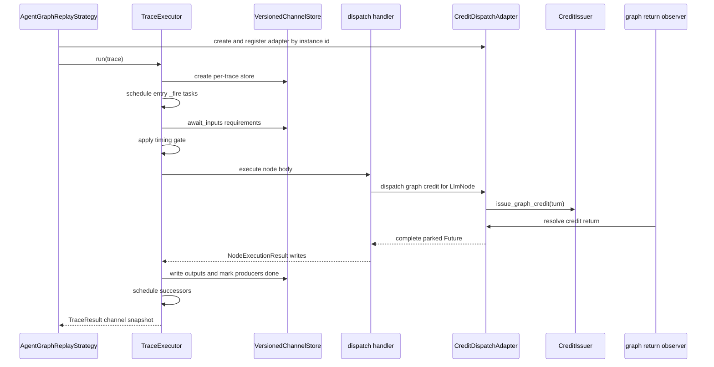
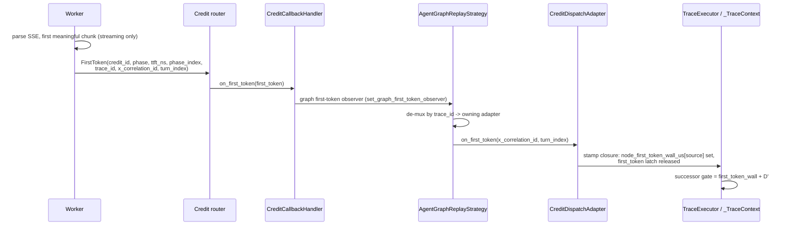

<!--
SPDX-FileCopyrightText: Copyright (c) 2025-2026 NVIDIA CORPORATION & AFFILIATES. All rights reserved.
SPDX-License-Identifier: Apache-2.0
-->

# AIPerf Graph Async Dataflow Runtime Architecture

Internal developer reference for the Graph v1 async dataflow runtime used by
graph trace replay. This document describes runtime execution, cross-trace
admission, and credit backpressure. It intentionally
separates executable runtime behavior from static graph analysis helpers.

Related graph references:

- [Graph Ingest and Build Pipeline](./graph-ingest-build-pipeline.md) and [Graph Segment Unified Store](./graph-segment-unified-store.md) for build-plane storage contracts.
- [Graph Worker Materialization](./graph-worker-materialization.md) for worker-side request reconstruction.
- [Graph Runtime Troubleshooting](./graph-runtime-troubleshooting.md) for stall, timeout, and return-routing diagnostics.

## Runtime object model

The graph runtime is built around a per-graph `TraceExecutor`. The executor owns
immutable, graph-derived collaborators: the parsed graph, the scheduler, the
injected clock, static producer counts, timing flags (`compress_edge_delays`,
`absolute_start_offsets`), and the credit issuer. The per-trace
`VersionedChannelStore` is built per run via a module-level store factory and
owns its own reducer registry. Mutable per-run state lives in `_TraceContext`,
which carries the trace, channel store, the task group, scheduled-node
bookkeeping (`scheduled_node_ids` / `tasks_by_node_id`), per-node finish /
dispatch / first-token wall timestamps, per-node first-token latches, and an
`overflow_terminated` flag for early termination.

`AgentGraphReplayStrategy` is the phase-level driver for graph replay. It owns trace
admission, lane fan-out and recycle, per-instance `CreditDispatchAdapter`
construction, graph return routing, and phase completion signaling. A graph
credit carries an instance id in `credit.trace_id`; the strategy routes each
return to the adapter registered for that instance.


## End-to-end execution lifecycle

`TraceExecutor.run()` creates one `VersionedChannelStore` for a trace and drives
the frontier. If
`Environment.GRAPH.EXECUTOR_WATCHDOG_TIMEOUT` is set, the frontier driver is
wrapped in `asyncio.wait_for`; otherwise pre-dispatch deadlocks are not bounded
inside the executor.

The frontier driver opens a per-trace `asyncio.TaskGroup`, schedules every entry
node returned by `Scheduler`, and then lets node tasks schedule successors as they
complete.



## Scheduling model

Readiness is expressed through channel waiters, futures, and `TaskGroup` task
creation; the executor creates a task per node rather than draining a central
ready queue.

`Scheduler` provides adjacency only:

- `START` static successors become entry nodes.
- `END` is suppressed and never scheduled.
- Static successors fire after a node returns a result. Start-anchored successors
  (`delay_after_predecessor_start_us`) are scheduled at the predecessor's DISPATCH
  instead, and are excluded from the completion frontier (see below).

Within a trace, concurrency is every scheduled node task whose channel inputs and
timing gate have cleared. `_schedule()` deduplicates fan-in by tracking scheduled
node ids. Rescheduling an already completed node is treated as a cycle bug.

A node firing path is:

1. Wait for declared `ChannelRequirement` values.
2. Capture the satisfying write set per declared channel.
3. Apply static and node-level timing gates. When the gate clears, stamp the
   node's dispatch wall and schedule any start-anchored successors — they are
   paced off this dispatch, not off the node's completion.
4. Execute the registered dispatch body.
5. Publish result writes to the channel store.
6. Mark all declared output producers done.
7. Schedule static successors.

A node receives only the channels it declared in `inputs`, reduced over the
capture set that satisfied its gate. `LlmNode` prompts are resolved worker-side
from the segment pool, so its dispatch body does not read the input view at all;
its `inputs` requirements act purely as a completion gate.

## Channel and producer semantics

`VersionedChannelStore` is a per-trace versioned dataflow store. Node writes
append log entries with monotonically increasing `write_seq` values; the log is
never replaced, and an overwrite-typed channel rejects a second writer for the
trace lifetime with `OverwriteConflictError`. Initial
trace state is seeded at sequence zero and participates as the reducer seed, but
it does not count as a producer arrival for `count=N` requirements.

A firing captures the first `N` non-initial writes needed for each requirement and
reduces them deterministically by `write_seq` and `writer_node_id`.

Static producer counts are computed from every node's `write_channels` and seed
`count="all"` resolution. A node marks its declared output producers done when it
finishes (`mark_producer_done` in the `_fire` finally), whether or not it wrote;
waiters whose requested count is no longer reachable wake with an
`insufficient_producers_remaining` (producer completed without writing) or
`all_producers_cancelled` (producer failed/cancelled) orphan instead of sleeping
forever.

## Dispatch by node kind

Dispatch bodies are registered as `singledispatch` implementations of
`TraceExecutor._execute` by the sibling `aiperf.graph.dispatch` package, which
imports each body module for its registration side effect. The fallback handler
on `TraceExecutor` itself only runs if registration failed, and the
`singledispatch` default raises for any node type that is not an `LlmNode`.

`LlmNode` is the only dispatched node kind — every live producer lowers to
`LlmNode` + `StaticEdge`. Its body, `_execute_llm`, builds a `DispatchRequest`
(node id) and awaits the injected credit issuer — for graph
replay the per-instance `CreditDispatchAdapter` — passing a per-dispatch
first-token stamp callback, then writes the result to `node.output`: a
type-correct empty list for messages-typed channels, the placeholder string
otherwise. It is also the only kind that issues a graph credit.

## Wire streaming mode

Graph credits use the run-level `--streaming` flag, exactly like every other
request. When the worker materializes a graph credit's body,
`apply_run_level_payload_options` stamps `payload["stream"]` from
`endpoint.streaming`; it is the sole authority for that key.
`stream_options.include_usage` keys on the stamped `stream`, so
server-token-count usage still rides the resulting mode.

On the wire, the transport's REQUEST side reads `endpoint.streaming` to pick the
`Accept` header (`text/event-stream` vs `application/json`) and the streaming URL
path. The RESPONSE read side is independent and already per-request: it parses
SSE vs JSON by the SERVER's `text/event-stream` content type (in
`AioHttpClient`), so the parse follows the actual response body regardless of the
request flag.

> **Recorded per-node stream modes do not drive dispatch.** The node envelope
> still carries a recorded `stream` key (dynamo derives it from the recorded
> `ttft_ms`), and it remains in the segment-store manifest as corpus
> provenance — but the replay does not reproduce it. A recorded non-streaming
> turn inside a `--streaming` run streams, and vice versa.

> **Result metrics are gated once, at run level.** `STREAMING_ONLY` streaming
> metrics (TTFT / TTST / TTFO / ITL / ICL) are dropped wholesale by
> `BaseMetricsProcessor.get_filters` (inherited by `MetricRecordProcessor`) when
> `--streaming` is off, for graph replays and ordinary runs alike. A graph
> replay launched without `--streaming` therefore reports none of them.

## Timing and t-star behavior

A node's firing gate is the maximum of:

- incoming static edge `delay_after_predecessor_us` from the predecessor finish
  time,
- incoming static edge `delay_after_predecessor_start_us` from the predecessor
  DISPATCH time (see below),
- incoming static edge `delay_after_predecessor_first_token_us` from the
  predecessor's OBSERVED FIRST-TOKEN time (post-TTFT anchoring; see below),
- incoming static edge `min_start_delay_us` from input readiness,
- node-level `min_start_delay_us`.

| Edge field | Anchor point | Gate | Fallback |
| --- | --- | --- | --- |
| `delay_after_predecessor_us` | predecessor finish | `node_finish_wall_us[source] + delay` | — |
| `delay_after_predecessor_start_us` | predecessor dispatch | `node_dispatch_wall_us[source] + delay` | — |
| `delay_after_predecessor_first_token_us` | predecessor observed first token | `node_first_token_wall_us[source] + delay` | falls back to the start anchor when no first token is observed |

`AIPERF_GRAPH_IGNORE_EDGE_DELAYS` bypasses all edge and node timing gates,
including the start-anchored gate. The per-executor `compress_edge_delays` flag
does the same for a single runtime instance.

A start-anchored edge (`delay_after_predecessor_start_us`) paces a successor off
when its predecessor DISPATCHES rather than when it completes — the successor
does not wait for the predecessor's result. The runtime stamps
`_TraceContext.node_dispatch_wall_us[source]` the moment the predecessor's own
firing gate clears, then schedules the start-anchored successor right there, at
predecessor dispatch. The successor's gate is
`node_dispatch_wall_us[source] + delay_after_predecessor_start_us`. Because such
a successor is scheduled at dispatch time, it is deliberately excluded from the
completion-time `Scheduler.successors_after` frontier: a child that finishes
before its still-running parent would otherwise be re-scheduled into the cycle
guard. Start-anchored edges are likewise excluded from a node's fan-in channel
requirements (`with_fan_in_inputs`), so the successor gates only on the
dispatch-relative delay and never blocks on the predecessor's `_out` channel. A
single edge is either completion-anchored (`delay_after_predecessor_us`) or
start-anchored (`delay_after_predecessor_start_us`), never both, and a
`START`-sourced edge is never start-anchored (the `START` pseudo-node never
dispatches, so such a target would be silently orphaned — `entry_nodes()` never
sees it and `start_anchored_successors("START")` is never consulted).
`apply_start_anchors` is the only emitter and always co-sets the start anchor,
so neither shape is constructible on the shipped lowering, and the runtime
relies on that construction invariant rather than a static check.

A start-anchored in-edge must be its target's ONLY in-edge, and
`_reject_mixed_anchor_fan_in` enforces that at `Scheduler` construction with a
`NotImplementedError` naming the node and two offending edges. Two shapes are
rejected, with distinct messages:

- **mixed-anchor fan-in** — one start-anchored in-edge plus at least one
  completion in-edge (a START edge counts as completion-kind).
- **multi-start-anchored fan-in** — two or more start-anchored in-edges on the
  same target, with no completion edge.

The runtime would otherwise fire the node at its start
anchor — silently ignoring the completion predecessor's recorded ordering — and
then re-schedule the completed node into the cycle guard when that predecessor
finishes (a spurious "cycle detected"). No shipped lowering emits the shape
(`apply_start_anchors` replaces an anchored node's whole in-edge set), so the
gate is a fail-loud backstop rather than a live rejection path.

A first-token-anchored edge REFINES a start-anchored one for a successor whose
recording began after the predecessor's first token arrived. Its
`delay_after_predecessor_first_token_us` (call it `D'`) paces the successor off
the predecessor's OBSERVED first token rather than off its dispatch. `D'` is only
valid alongside `delay_after_predecessor_start_us`: the start
anchor is the mandatory fallback. `_apply_firing_delay` first awaits the source's
first-token latch (`ctx.first_token_event(source)`) so the observed wall — or its
settled ABSENCE — is known before the gate is computed. When the predecessor emits
a first token the runtime stamps `ctx.node_first_token_wall_us[source]` and gates
the successor at `first_token_wall + D'`, which SUPERSEDES the dispatch fallback
for that edge. When the predecessor TERMINATES WITHOUT a first token,
`_finalize_node` still sets the latch (with no wall entry), so the gate cleanly
falls back to the start anchor `node_dispatch_wall_us[source] +
delay_after_predecessor_start_us`. `AIPERF_GRAPH_IGNORE_EDGE_DELAYS` and
`compress_edge_delays` skip the first-token wait and the gate uniformly, exactly
as they skip the other anchors.

> **First-token anchoring needs the run to stream.** The observed first token
> exists only when the worker parses the source node's SSE stream, and the wire
> mode is run-level (see [Wire streaming mode](#wire-streaming-mode)) — a node's
> recorded `streaming` mode does NOT reach the wire. A first-token edge whose
> source `LlmNode` carries `streaming=False` emits no first-token event, so every
> one of its first-token-anchored successors SILENTLY degrades to its start
> anchor (completion-relative dispatch delay) — a fidelity loss with no other
> signal.
>
> This is NOT confined to degenerate graphs. `--no-streaming` reaches the BUILD:
> `ctx.run_streaming` (the resolved `endpoint.streaming`) is forwarded into the
> dynamo lowering, where it overrides the recorded ttft-derived per-node mode
> (`trie_lowering`'s `streaming = req.ttft is not None if streaming is None else
> streaming`). A plain `--no-streaming` dynamo run therefore stamps
> `streaming=False` on EVERY node while `build_interval_edges` leaves the
> first-token anchors in place, degrading post-TTFT anchoring corpus-wide. A
> `--streaming` run is self-consistent by construction (the same recorded ttft
> drives both the edge refinement and the node's streaming mode). The
> TimingManager emits a one-shot configure-time warning when a first-token source
> has `streaming=False` (`_advise_non_streaming_first_token_sources`); drop
> `--no-streaming` to restore post-TTFT anchoring.

For graph replay, `AgentGraphReplayStrategy` can slice a trace at a sampled `t*`.
Arrivals before `t*` are warmup; arrivals at or after `t*` are profiled and
rebased to offsets relative to `t*` (zero only at the boundary). The strategy
uses absolute start offsets so surviving frontier turns are anchored to the
instance run start rather than to when their inputs happen to become ready.

`--trajectory-start-min-ratio`, `--trajectory-start-max-ratio` (per-run config),
the run's `--random-seed`, and lane index determine t-star sampling. The
ratio ordering constraint is enforced in BOTH places: by the graph conversation
source `AgentGraphConversationSource`, which raises `ValueError` when
`start_min_ratio > start_max_ratio`, and by
`BasePhaseConfig.validate_trajectory_start_range` at config validation time.

### Enabling the t-star snapshot warmup

The t-star window is OFF by default on the graph path. Both
`BasePhaseConfig.trajectory_start_{min,max}_ratio` default to `None` — the unset
state — and the two consumers resolve that `None` differently:
`resolve_graph_tstar_window` resolves it to `0.0` (window closed), while
AGENTIC_REPLAY resolves it to `0.0`/`1.0`, the full trace (`timing.config.from_run`).
So a bare graph run replays every trace in full with no
warmup phase, and setting only the upper bound is enough to open the window:

```bash
aiperf profile --input-file trace.jsonl.gz --trajectory-start-max-ratio 1.0 ...
```

In YAML the ratios live on the *profiling* phase (`resolve_graph_tstar_window` is
read per phase):

```yaml
phases:
  - name: profiling
    type: concurrency
    concurrency: 64
    trajectory_start_max_ratio: 1.0
```

When the window is open, timing-config resolution prepends an auto-injected
`CreditPhase.WARMUP` phase via `_build_graph_auto_warmup_config`. The gate is
`is_graph and not graph_warmup_phases and trajectory_start_max_ratio > 0.0` —
declaring your own warmup phase suppresses the injection. The injected phase is
`TimingMode.AGENT_GRAPH` / `ArrivalPattern.CONCURRENCY_BURST`, carries the same `t*`
window, is not `seamless`, and has an infinite grace period (warmup must fully
drain before profiling starts; a warmup failure aborts the run).

`rewrite_for_warmup` turns the parsed
graph into the priming graph: for every chain that straddles `t*` (it has both a
pre-`t*` and an at/after-`t*` node), the LAST pre-`t*` node survives as a boundary
node. The result is FLAT — surviving nodes get `inputs=[]` and
`min_start_delay_us=None`, and each gets a single `StaticEdge` from
`START_NODE_ID`, so exactly one priming credit per chain is live at `t*`. With
`t_star_us <= 0` the rewrite yields an EMPTY graph and warmup finalizes
immediately. Warmup carve-outs: `_resolved_num_sessions` returns `None` — but
only when no explicit `--num-conversations` is set, since an explicit
`expected_num_sessions > 0` is honored BEFORE the warmup check — and the
idle-gap-without-duration advisory and dispatch-duplication warning both
early-return. A `t*>0` window requires a trie-stamped graph; a non-trie parse
reaching `t*>0` raises `RuntimeError` (lowering bug).

On a graph workload the window opens ONLY via the explicit
`--trajectory-start-min/max-ratio` flags.

`--scenario inferencex-agentx-mvp` also carries `0.0`/`1.0` ratio defaults
(via the scenario validator's `_apply_trajectory_ratios`), but it does not open the
window here: the scenario's `require_loader` check rejects the run before any
graph parse. That violation IS bypassable — a graph run passes `--input-file`, so
its default dataset is a `FileDataset`, not the `SyntheticDataset` that
`_non_overridable_violations` hard-fails on, and `--unsafe-override` downgrades
it to a warning (stamping `submission_valid=False`).
See [the t*/dynamic-slot gate](./graph-ingest-build-pipeline.md#tdynamic-slot-gate)
for the mechanics.

## Concurrency and backpressure layers

Graph replay has several independent concurrency controls. They should not be
collapsed into one concept.

| Layer | Owner | What it bounds |
| --- | --- | --- |
| Node tasks | `TraceExecutor` | In-trace dataflow tasks whose inputs are ready |
| Trace lanes | `AgentGraphReplayStrategy` | Concurrent trace instances admitted for replay |
| Graph credit issue | `CreditIssuer` and stop checker | Whether another graph request may be sent |
| Prefill slots | `CreditIssuer` and callback handler | In-flight prefill pressure per sent request |
| Adapter waiters | `CreditDispatchAdapter` | Graph requests awaiting correlated worker returns |
| Router load | `StickyCreditRouter` | Worker choice and in-flight credit load |

Cross-trace concurrency is resolved by `AgentGraphReplayStrategy._resolve_concurrency`:
an explicit override wins, then the phase `concurrency` — but ONLY when the phase's
`concurrency_explicitly_set` flag is set, never from the value alone (the default
profiling phase type IS `concurrency`, so its field always carries a number) — then
`1`, the plain aiperf default. Lanes recycle templates while a stop condition exists
and still allows new work. With no stop condition, a bare graph run performs a single
corpus pass.

That resolved value is a LANE bound, and it gates admission only where lanes drive
the run. On the DEFAULT open-loop timestamped path, admission is gated only when the
concurrency was set EXPLICITLY (`gate_admission = self._concurrency_is_explicit`):
the inherited default of `1` is not treated as a ceiling, so a bare graph run is
NOT serialized to one trace at a time — every trace starts at its own recorded time.
See [Agent Graph timestamp replay](./graph-timestamp-replay-spec.md#current-behavior).

Graph credits bypass the normal linear session-slot lifecycle, but they still
check the DAG-child stop gate, acquire one prefill slot before sending, increment
normal sent counters, and route through the normal credit router. Prefill slots
release on first token, or on return when no first-token release was recorded.
Graph credits do not acquire or release session slots.

## Credit bridge and return path

`CreditDispatchAdapter.dispatch()` mints a graph correlation id and turn index,
parks one `Future` in `_waiters`, creates a `TurnToSend`, and issues it
immediately. The awaiting node
is bounded by `Environment.GRAPH.DISPATCH_TIMEOUT` once it reaches the adapter.
That timeout does not bound nodes waiting earlier on unsatisfied channel inputs.

`CreditIssuer.issue_graph_credit()` places graph work onto the normal credit
path. A refused issue sets a `GraphDispatchError` on the parked future so the
executor can unwind the node rather than wait for a return that will never
arrive.

The graph return observer is registered before any graph credit is issued. It
runs before gated phase-handler logic and routes returns by `credit.trace_id` to
the live adapter. Adapter resolution treats success, error, cancellation, and
context overflow as terminal outcomes for the parked future. Context overflow is
converted into expected early termination for the trajectory.

Unknown return keys are dropped after a debug log. Unknown adapter instance ids
are also dropped; a parked dispatch can then only resolve by timeout or external
cancellation.

## First-token fan-out (post-TTFT anchoring)

A first-token-anchored edge needs the runtime to learn a predecessor's observed
first token WHILE that predecessor is still streaming. This rides a dedicated
`FirstToken` fan-out that parallels the return path but fires earlier.

Only the nodes that SOURCE a first-token-anchored edge are opted in. The strategy
computes `first_token_sources(graph)` per trace (the set of such source node ids)
and the adapter stamps `first_token_event=True` on exactly those credits'
`TurnToSend`. The worker builds its first-token SSE callback only when prefill
concurrency limiting is active OR the credit carries `first_token_event`, so a
non-graph run without prefill-concurrency limiting — and a graph run with no
first-token edges — pays no per-chunk SSE parsing overhead.



The worker emits `FirstToken` per credit carrying `credit_id`, `phase`,
`ttft_ns`, plus the graph routing keys `trace_id` / `x_correlation_id` /
`turn_index`. The router hands it to `CreditCallbackHandler.on_first_token`,
which also releases a prefill slot when one was held. The single graph
first-token observer (installed via `set_graph_first_token_observer` before any
credit issues) de-multiplexes by `trace_id` to the owning per-trace adapter, just
as the return observer does. The adapter's `on_first_token` looks up the parked
per-dispatch first-token callback by `(x_correlation_id, turn_index)` and invokes
the executor's stamp closure, which records `node_first_token_wall_us[source]` and
releases the source's first-token latch. A late token for an unknown trace id —
after the trace unwound, or a non-graph fast-path token — is a graceful no-op, and
the successor simply falls back to its start anchor.

Because the observation depends on SSE parsing, the fan-out is inert whenever the
run is not streaming. Every graph node dispatches per the global `--streaming`
flag (see [Wire streaming mode](#wire-streaming-mode)), so with that flag off no
`FirstToken` is emitted for any edge: the latch is then released solely by
`_finalize_node` at the predecessor's completion, and its anchored successors
degrade to their start-anchor fallback. The TimingManager warns once at configure
time per that source-node condition.

## Failure, cancellation, and containment

Failure handling is intentionally not uniform across node kinds:

- `GraphDispatchError` is contained rather than re-raised. Segment-pool
  graphs receive type-correct sentinel writes to normal output channels (`[]`
  for messages-typed channels, `None` otherwise) so gate-only downstream
  readers can continue. Other IRs may receive no writes, allowing downstream
  channel waiters to orphan.
- Context overflow is treated as expected early termination. The node suppresses
  successors, and downstream orphan cascades from missing overflowed outputs are
  swallowed as clean exits.
- A graph dispatch timeout or cancellation drops the adapter waiter, so a late
  return cannot resolve a dead dispatch.

Without `AIPERF_GRAPH_EXECUTOR_WATCHDOG_TIMEOUT`, pre-dispatch dataflow
liveness bugs such as unsatisfied channel counts can hang until an external
cancellation or test timeout. `AIPERF_GRAPH_DISPATCH_TIMEOUT` only applies
after a node reaches the credit adapter.

## Environment knobs

The graph runtime reads the process-wide `Environment` singleton. Runtime code
reads live `Environment` attributes rather than reparsing `os.environ` on every
use, so tests and tools that mutate environment variables after import must also
reset or mutate the singleton state used by the code under test.

Defaults and constraints for every `AIPERF_GRAPH_*` and
`AIPERF_DATASET_DYNAMO_GRAPH_*` variable live in the generated
[Environment Variables](../environment-variables.md) reference — the source of
truth, regenerated from the `Environment` fields themselves.
[Graph Runtime Troubleshooting](./graph-runtime-troubleshooting.md#useful-knobs)
maps each knob to when you would reach for it and what it will not fix.

## Static analysis helpers

The `src/aiperf/graph/analysis/` helpers compute timeline, cohort, snapshot,
and trace-duration views over the same graph primitives. These outputs are used
for planning, t-star slicing, warmup/profiling partitioning, and diagnostics.
They are a static view over the same graph primitives, distinct from the
runtime scheduler; an LLM cohort is a grouping in that view, not a runtime
synchronization barrier. The static elaboration follows BOTH anchor kinds —
completion successors and start-anchored (dispatch-time) successors — and keeps
a scheduled-but-unsatisfied node pending until later arrivals satisfy its
fan-in, so the dry-run's fired-node set matches the executor for the DAGs the
live adapters emit (start-anchored subtrees count toward `trace_duration_us`
and partition normally in `compute_snapshot`).

Worker-side graph request materialization is stateless by node ordinal and trace
id for slot-less nodes: any worker can rebuild such a request from the shared
unified segment store (`GraphSegmentUnifiedClient`), with warmup token caps
applied during materialization. Slot-carrying nodes (dynamic content)
additionally read the per-worker dynamic pool and require per-trace sticky
routing.
