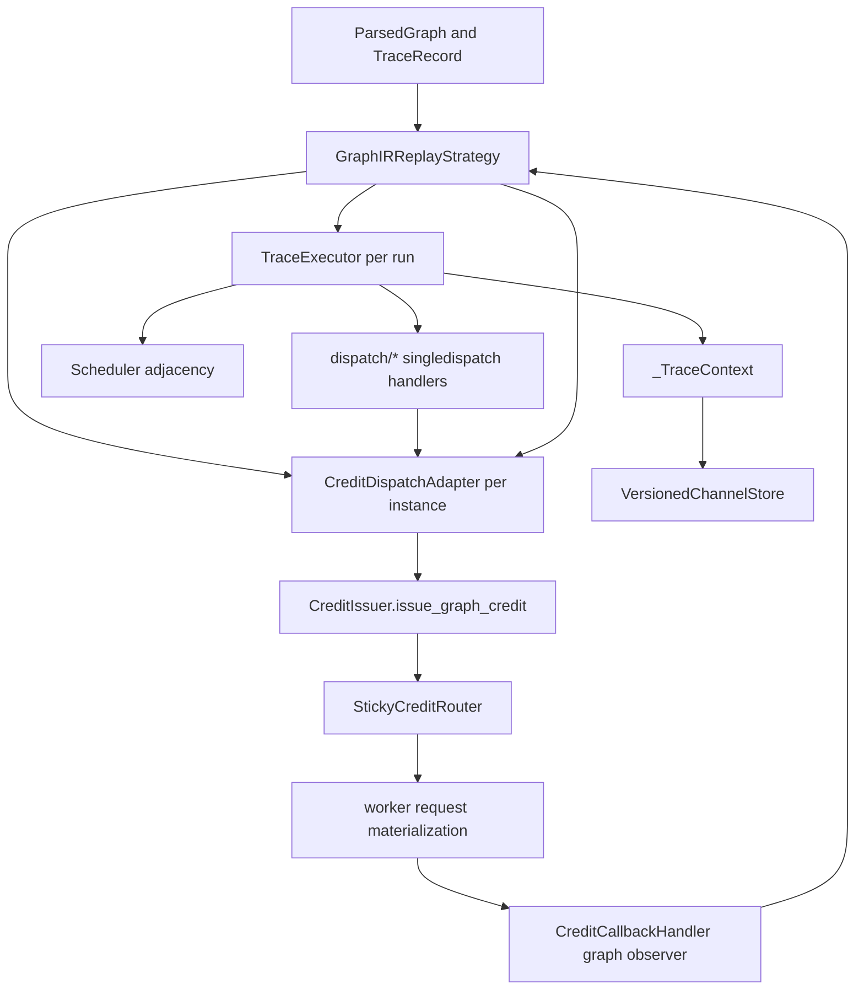
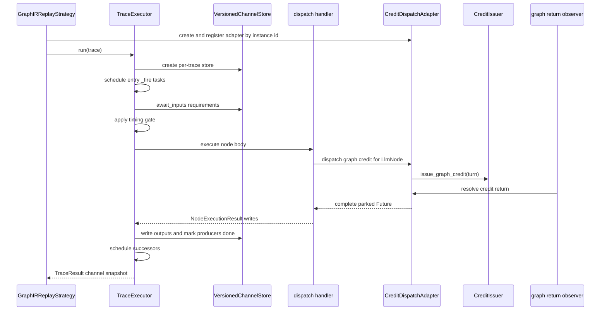
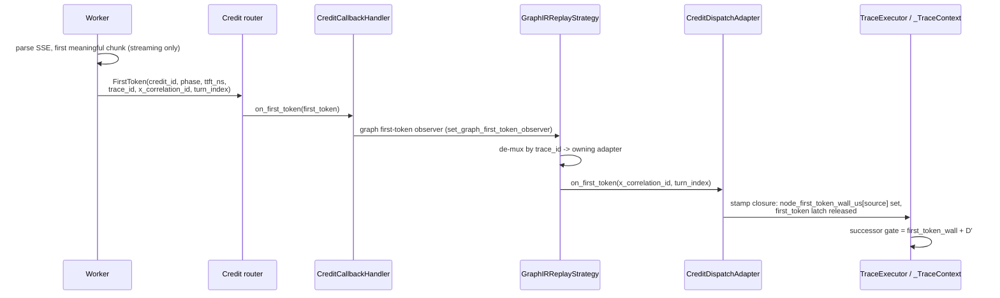

<!--
SPDX-FileCopyrightText: Copyright (c) 2025-2026 NVIDIA CORPORATION & AFFILIATES. All rights reserved.
SPDX-License-Identifier: Apache-2.0
-->

# AIPerf Graph Async Dataflow Runtime Architecture

Internal developer reference for the Graph v1 async dataflow runtime used by
Weka graph replay. This document describes runtime execution, cross-trace
admission, and credit backpressure. It intentionally
separates executable runtime behavior from static graph analysis helpers.

Primary implementation files:

- `src/aiperf/graph/executor.py`
- `src/aiperf/graph/channel_store.py`
- `src/aiperf/graph/scheduler.py`
- `src/aiperf/graph/credit_dispatch_adapter.py`
- `src/aiperf/graph/dispatch/`
- `src/aiperf/timing/strategies/graph_ir_replay.py`

Related graph references:

- [Agentic Workload Benchmarks](../benchmark-modes/agentic.md) for user-facing native Graph IR authoring and graph adapter selection.
- [Graph IR Schema](./graph-ir-schema.md) for authorable records, node types, channels, and trace fields.
- [Graph IR Validation](./graph-ir-validation.md) for parser and validator rule behavior.
- [Graph Ingest and Build Pipeline](./graph-ingest-build-pipeline.md), [Graph Structural Sidecar Handoff](./graph-structural-handoff.md), and [Graph Segment Unified Store](./graph-segment-unified-store.md) for build-plane storage contracts.
- [Graph Worker Materialization](./graph-worker-materialization.md) for worker-side request reconstruction.
- [Graph Runtime Troubleshooting](./graph-runtime-troubleshooting.md) for stall, timeout, and return-routing diagnostics.

## Runtime object model

The graph runtime is built around a per-graph `TraceExecutor`. The executor owns
immutable, graph-derived collaborators: the parsed graph, the scheduler, the
injected clock, static producer counts, timing flags (`compress_edge_delays`,
`absolute_start_offsets`), and the credit issuer. The per-trace
`VersionedChannelStore` is built per run via a module-level store factory and
owns its own reducer registry. Mutable per-run state lives in `_TraceContext`,
which carries the trace, channel store, the task group, scheduled-node
bookkeeping (`scheduled_node_ids` / `tasks_by_node_id`), per-node finish /
dispatch / first-token wall timestamps, per-node first-token latches, and an
`overflow_terminated` flag for early termination.

`GraphIRReplayStrategy` is the phase-level driver for Weka replay. It owns trace
admission, lane fan-out and recycle, per-instance `CreditDispatchAdapter`
construction, graph return routing, and phase completion signaling. A graph
credit carries an instance id in `credit.trace_id`; the strategy routes each
return to the adapter registered for that instance.

## End-to-end execution lifecycle

`TraceExecutor.run()` creates one `VersionedChannelStore` for a trace and drives
the frontier. If
`Environment.GRAPH.EXECUTOR_WATCHDOG_TIMEOUT` is set, the frontier driver is
wrapped in `asyncio.wait_for`; otherwise pre-dispatch deadlocks are not bounded
inside the executor.

The frontier driver opens a per-trace `asyncio.TaskGroup`, schedules every entry
node returned by `Scheduler`, and then lets node tasks schedule successors as they
complete.

## Scheduling model

There is no central ready queue in the executor. Readiness is expressed through
channel waiters, futures, and `TaskGroup` task creation.

`Scheduler` provides adjacency only:

- `START` static successors become entry nodes.
- `END` is suppressed and never scheduled.
- Static successors fire after a node returns a result. Start-anchored successors
  (`delay_after_predecessor_start_us`) are scheduled at the predecessor's DISPATCH
  instead, and are excluded from the completion frontier (see below).

Within a trace, concurrency is every scheduled node task whose channel inputs and
timing gate have cleared. `_schedule()` deduplicates fan-in by tracking scheduled
node ids. Rescheduling an already completed node is treated as a cycle bug.

A node firing path is:

1. Wait for declared `ChannelRequirement` values.
2. Capture the channel store sequence and compute a causal input snapshot.
3. Apply static and node-level timing gates. When the gate clears, stamp the
   node's dispatch wall and schedule any start-anchored successors — they are
   paced off this dispatch, not off the node's completion.
4. Execute the registered dispatch body.
5. Publish result writes to the channel store.
6. Mark all declared output producers done.
7. Schedule static successors.

An `LlmNode` receives a causal global snapshot at the gate sequence
(`snapshot_at_seq`), so its prompt resolution sees every channel — including ones
it did not declare in `inputs` — as of the captured sequence.

## Channel and producer semantics

`VersionedChannelStore` is a per-trace versioned dataflow store. Node writes
append log entries with monotonically increasing `write_seq` values; the log is
never replaced, and an overwrite-typed channel rejects a second writer for the
trace lifetime with `OverwriteConflictError`. Initial
trace state is seeded at sequence zero and participates as the reducer seed, but
it does not count as a producer arrival for `count=N` requirements.

A firing captures the first `N` non-initial writes needed for each requirement and
reduces them deterministically by `write_seq` and `writer_node_id`.

Static producer counts are computed from every node's `write_channels` and seed
`count="all"` resolution. A node marks its declared output producers done when it
finishes (`mark_producer_done` in the `_fire` finally), whether or not it wrote;
waiters whose requested count is no longer reachable wake with an
`insufficient_producers_remaining` (producer completed without writing) or
`all_producers_cancelled` (producer failed/cancelled) orphan instead of sleeping
forever.

## Dispatch by node kind

Dispatch bodies are registered through `TraceExecutor._execute` using sibling
modules under `src/aiperf/graph/dispatch/`. `dispatch/__init__.py` imports the
modules for registration; the fallback handler in `executor.py` only runs if
registration failed, and the `singledispatch` default raises for any node type
that is not an `LlmNode`.

`LlmNode` is the only dispatched node kind — every live producer lowers to
`LlmNode` + `StaticEdge`. Its body (`dispatch/llm.py`) builds a `DispatchRequest`
(node id) and awaits the injected credit issuer — for graph
replay the per-instance `CreditDispatchAdapter` — passing a per-dispatch
first-token stamp callback, then writes the result to `node.output`: a
type-correct empty list for messages-typed channels, the placeholder string
otherwise. It is also the only kind that issues a graph credit.

## Per-request wire streaming mode

Each graph credit resolves its wire streaming mode PER REQUEST from the recorded
per-node value, not from the global `--streaming` flag. When the worker
materializes a graph credit's body, it stamps `payload["stream"]` from the node
envelope's TOP-LEVEL `stream` key (`envelope["stream"]` in
`worker_materialize.py` — not `dispatch_overrides`), which the build plane
stamped from the recorded per-node mode (weka `"s"` → `True`, `"n"` → `False`;
dynamo derived from recorded `ttft_ms`). Only a payload whose envelope carries
NO recorded stream value (`stream` absent) falls back to the global
`endpoint.streaming`. That same
resolved value is carried onto `RequestInfo.stream_override`, and every non-graph
request leaves `stream_override=None` so it follows the global flag as before.
`stream_options.include_usage` keys on the FINAL stamped `stream`, so
server-token-count usage still rides whichever mode won.

Resolution rule, in order of precedence:

1. recorded per-node `stream` override (graph credits) — **wins**;
2. global `endpoint.streaming` (`--streaming`) — fallback for mode-less graph
   payloads and the sole control for every non-graph run.

On the wire, the transport's REQUEST side reads `RequestInfo.stream_override`
through `effective_streaming` (`base_transports.py`) to pick the `Accept`
header (`text/event-stream` vs `application/json`) and the streaming URL path per
request. The RESPONSE read side is already per-request and independent: it parses
SSE vs JSON by the SERVER's `text/event-stream` content type
(`aiohttp_client.py`), so the parse follows the actual response body regardless
of the request flag. The net effect is that a recorded-streaming source streams
(and emits its mid-flight `FirstToken`) even with the global flag OFF, while a
recorded `"n"` turn stays non-streaming — a single JSON body — inside an
otherwise-streaming run.

> **Result metrics are gated PER RECORD, not by the global flag.**
> `STREAMING_ONLY` streaming metrics (TTFT / TTST / TTFO / ITL / ICL) are
> computed over the per-record subset of requests that actually streamed on the
> wire (`RequestRecord.streamed`), counted by the visible `streamed_request_count`
> aggregate (its denominator). The run-level gate in
> `BaseMetricsProcessor.get_filters` (inherited by `MetricRecordProcessor`;
> `src/aiperf/post_processors/base_metrics_processor.py:50-57`) only drops the
> whole streaming family when NOTHING in the run can stream — i.e. global
> `--streaming` off AND the input is not a graph workload; for a graph-IR replay
> the family stays enabled and the hidden `streamed_request` predicate excludes
> each non-streamed record individually. So a graph run replayed WITHOUT
> `--streaming` still reports TTFT / ITL / ICL for its recorded-streaming nodes,
> computed over those nodes alone, while its recorded `"n"` records are simply
> excluded (never dragging their full request latency in as a first-token time).
> `--streaming` is no longer required to see these metrics for a graph replay.

## Timing and t-star behavior

A node's firing gate is the maximum of:

- incoming static edge `delay_after_predecessor_us` from the predecessor finish
  time,
- incoming static edge `delay_after_predecessor_start_us` from the predecessor
  DISPATCH time (see below),
- incoming static edge `delay_after_predecessor_first_token_us` from the
  predecessor's OBSERVED FIRST-TOKEN time (post-TTFT anchoring; see below),
- incoming static edge `min_start_delay_us` from input readiness,
- node-level `min_start_delay_us`.

| Edge field | Anchor point | Gate | Fallback |
| --- | --- | --- | --- |
| `delay_after_predecessor_us` | predecessor finish | `node_finish_wall_us[source] + delay` | — |
| `delay_after_predecessor_start_us` | predecessor dispatch | `node_dispatch_wall_us[source] + delay` | — |
| `delay_after_predecessor_first_token_us` | predecessor observed first token | `node_first_token_wall_us[source] + delay` | falls back to the start anchor when no first token is observed |

`AIPERF_GRAPH_IGNORE_EDGE_DELAYS` bypasses all edge and node timing gates,
including the start-anchored gate. The per-executor `compress_edge_delays` flag
does the same for selected runtime instances, such as accelerated warmup.

A start-anchored edge (`delay_after_predecessor_start_us`) paces a successor off
when its predecessor DISPATCHES rather than when it completes — the successor
does not wait for the predecessor's result. The runtime stamps
`_TraceContext.node_dispatch_wall_us[source]` the moment the predecessor's own
firing gate clears, then schedules the start-anchored successor right there, at
predecessor dispatch. The successor's gate is
`node_dispatch_wall_us[source] + delay_after_predecessor_start_us`. Because such
a successor is scheduled at dispatch time, it is deliberately excluded from the
completion-time `Scheduler.successors_after` frontier: a child that finishes
before its still-running parent would otherwise be re-scheduled into the cycle
guard. Start-anchored edges are likewise excluded from a node's fan-in channel
requirements (`with_fan_in_inputs`), so the successor gates only on the
dispatch-relative delay and never blocks on the predecessor's `_out` channel. A
single edge is either completion-anchored (`delay_after_predecessor_us`) or
start-anchored (`delay_after_predecessor_start_us`), never both; validator rule
54 (`_rule_54_edge_delay_exclusivity`) rejects an edge that sets both.

Anchor kinds must also be uniform PER TARGET: a node with one start-anchored
in-edge plus one completion in-edge (a START edge counts as completion-kind) is
rejected at `Scheduler` construction with a `NotImplementedError` naming the
node and both edges. The runtime would otherwise fire the node at its start
anchor — silently ignoring the completion predecessor's recorded ordering — and
then re-schedule the completed node into the cycle guard when that predecessor
finishes (a spurious "cycle detected"). No shipped lowering emits the shape
(`apply_start_anchors` replaces an anchored node's whole in-edge set), so the
gate only affects hand-authored graphs and future adapters.

A first-token-anchored edge REFINES a start-anchored one for a successor whose
recording began after the predecessor's first token arrived. Its
`delay_after_predecessor_first_token_us` (call it `D'`) paces the successor off
the predecessor's OBSERVED first token rather than off its dispatch. `D'` is only
valid alongside `delay_after_predecessor_start_us` (validator rule 55): the start
anchor is the mandatory fallback. `_apply_firing_delay` first awaits the source's
first-token latch (`ctx.first_token_event(source)`) so the observed wall — or its
settled ABSENCE — is known before the gate is computed. When the predecessor emits
a first token the runtime stamps `ctx.node_first_token_wall_us[source]` and gates
the successor at `first_token_wall + D'`, which SUPERSEDES the dispatch fallback
for that edge. When the predecessor TERMINATES WITHOUT a first token,
`_finalize_node` still sets the latch (with no wall entry), so the gate cleanly
falls back to the start anchor `node_dispatch_wall_us[source] +
delay_after_predecessor_start_us`. `AIPERF_GRAPH_IGNORE_EDGE_DELAYS` and
`compress_edge_delays` skip the first-token wait and the gate uniformly, exactly
as they skip the other anchors.

> **First-token anchoring needs the SOURCE node to stream.** The observed first
> token exists only when the worker parses the source node's SSE stream. Each
> graph node now dispatches per its own recorded `streaming` mode (a per-request
> override on the wire), so a recorded-streaming source streams regardless of the
> global `--streaming` flag — the flag is only the fallback for mode-less
> payloads and non-graph runs. The residual failure is a first-token edge whose
> source `LlmNode` carries `streaming=False`: it emits no first-token event, so
> every one of its first-token-anchored successors SILENTLY degrades to its start
> anchor (completion-relative dispatch delay) — a fidelity loss with no other
> signal. This is possible only in hand-authored/degenerate graphs; recorded
> corpora are consistent by construction (the same recorded ttft drives both the
> edge refinement and the source node's streaming mode). The TimingManager emits
> a one-shot configure-time warning when a first-token source has
> `streaming=False` (`_advise_non_streaming_first_token_sources`); set
> `streaming=True` on the source node to restore post-TTFT anchoring.

For Weka replay, `GraphIRReplayStrategy` can slice a trace at a sampled `t*`.
Arrivals before `t*` are warmup; arrivals at or after `t*` are profiled and
rebased to offsets relative to `t*` (zero only at the boundary). The strategy
uses absolute start offsets so surviving frontier turns are anchored to the
instance run start rather than to when their inputs happen to become ready.

`--trajectory-start-min-ratio`, `--trajectory-start-max-ratio` (per-run config),
the run's `--random-seed`, and lane index determine t-star sampling. The
ratio ordering constraint is enforced by the graph conversation source rather
than by the environment field definitions.

## Concurrency and backpressure layers

Graph replay has several independent concurrency controls. They should not be
collapsed into one concept.

| Layer | Owner | What it bounds |
| --- | --- | --- |
| Node tasks | `TraceExecutor` | In-trace dataflow tasks whose inputs are ready |
| Trace lanes | `GraphIRReplayStrategy` | Concurrent trace instances admitted for replay |
| Graph credit issue | `CreditIssuer` and stop checker | Whether another graph request may be sent |
| Prefill slots | `CreditIssuer` and callback handler | In-flight prefill pressure per sent request |
| Adapter waiters | `CreditDispatchAdapter` | Graph requests awaiting correlated worker returns |
| Router load | `StickyCreditRouter` | Worker choice and in-flight credit load |

Cross-trace concurrency is resolved by `GraphIRReplayStrategy`: explicit override
wins, then positive phase `concurrency`, then `1` (the plain aiperf default; raise
cross-trace parallelism with `--concurrency`). Lanes recycle templates while a stop
condition exists and still allows new work. With no stop condition, a bare graph
run performs a single corpus pass.

Graph credits bypass the normal linear session-slot lifecycle, but they still
check the DAG-child stop gate, acquire one prefill slot before sending, increment
normal sent counters, and route through the normal credit router. Prefill slots
release on first token, or on return when no first-token release was recorded.
Graph credits do not acquire or release session slots.

## Credit bridge and return path

`CreditDispatchAdapter.dispatch()` mints a graph correlation id and turn index,
parks one `Future` in `_waiters`, creates a `TurnToSend`, and issues it
immediately. The awaiting node
is bounded by `Environment.GRAPH.DISPATCH_TIMEOUT` once it reaches the adapter.
That timeout does not bound nodes waiting earlier on unsatisfied channel inputs.

`CreditIssuer.issue_graph_credit()` places graph work onto the normal credit
path. A refused issue sets a `GraphDispatchError` on the parked future so the
executor can unwind the node rather than wait for a return that will never
arrive.

The graph return observer is registered before any graph credit is issued. It
runs before gated phase-handler logic and routes returns by `credit.trace_id` to
the live adapter. Adapter resolution treats success, error, cancellation, and
context overflow as terminal outcomes for the parked future. Context overflow is
converted into expected early termination for the trajectory.

Unknown return keys are dropped after a debug log. Unknown adapter instance ids
are also dropped; a parked dispatch can then only resolve by timeout or external
cancellation.

## First-token fan-out (post-TTFT anchoring)

A first-token-anchored edge needs the runtime to learn a predecessor's observed
first token WHILE that predecessor is still streaming. This rides a dedicated
`FirstToken` fan-out that parallels the return path but fires earlier.

Only the nodes that SOURCE a first-token-anchored edge are opted in. The strategy
computes `first_token_sources(graph)` per trace (the set of such source node ids)
and the adapter stamps `first_token_event=True` on exactly those credits'
`TurnToSend`. The worker builds its first-token SSE callback only when prefill
concurrency limiting is active OR the credit carries `first_token_event`, so a
non-graph run without prefill-concurrency limiting — and a graph run with no
first-token edges — pays no per-chunk SSE parsing overhead.

The worker emits `FirstToken` per credit carrying `credit_id`, `phase`,
`ttft_ns`, plus the graph routing keys `trace_id` / `x_correlation_id` /
`turn_index`. The router hands it to `CreditCallbackHandler.on_first_token`,
which also releases a prefill slot when one was held. The single graph
first-token observer (installed via `set_graph_first_token_observer` before any
credit issues) de-multiplexes by `trace_id` to the owning per-trace adapter, just
as the return observer does. The adapter's `on_first_token` looks up the parked
per-dispatch first-token callback by `(x_correlation_id, turn_index)` and invokes
the executor's stamp closure, which records `node_first_token_wall_us[source]` and
releases the source's first-token latch. A late token for an unknown trace id —
after the trace unwound, or a non-graph fast-path token — is a graceful no-op, and
the successor simply falls back to its start anchor.

Because the observation depends on SSE parsing, the fan-out is inert only for a
successor whose SOURCE node is non-streaming. Each graph node dispatches per its
own recorded `streaming` mode (a per-request override), so a recorded-streaming
source emits its `FirstToken` — and anchors its successors — regardless of the
global `--streaming` flag; that flag is only the fallback for mode-less payloads
and non-graph runs (see [Per-request wire streaming
mode](#per-request-wire-streaming-mode)). Only when a source carries
`streaming=False` is no `FirstToken` emitted for its edges: the latch is then
released solely by `_finalize_node` at that predecessor's completion, and its
anchored successors degrade to their start-anchor fallback. The TimingManager
warns once at configure time per that source-node condition.

## Failure, cancellation, and containment

Failure handling is intentionally not uniform across node kinds:

- `GraphDispatchError` is contained rather than re-raised. Segment-pool
  graphs receive type-correct sentinel writes to normal output channels (`[]`
  for messages-typed channels, `None` otherwise) so gate-only downstream
  readers can continue. Other IRs may receive no writes, allowing downstream
  channel waiters to orphan.
- Context overflow is treated as expected early termination. The node suppresses
  successors, and downstream orphan cascades from missing overflowed outputs are
  swallowed as clean exits.
- A graph dispatch timeout or cancellation drops the adapter waiter, so a late
  return cannot resolve a dead dispatch.

Without `AIPERF_GRAPH_EXECUTOR_WATCHDOG_TIMEOUT`, pre-dispatch dataflow
liveness bugs such as unsatisfied channel counts can hang until an external
cancellation or test timeout. `AIPERF_GRAPH_DISPATCH_TIMEOUT` only applies
after a node reaches the credit adapter.

## Environment knobs

The graph runtime reads the process-wide `Environment` singleton. Runtime code
reads live `Environment` attributes rather than reparsing `os.environ` on every
use, so tests and tools that mutate environment variables after import must also
reset or mutate the singleton state used by the code under test.

Key graph runtime knobs:

| Field | Default | Runtime effect |
| --- | --- | --- |
| `AIPERF_GRAPH_DISPATCH_TIMEOUT` | `300.0` | Bounds adapter waits after a graph credit is issued or deferred |
| `AIPERF_GRAPH_EXECUTOR_WATCHDOG_TIMEOUT` | unset | Optional wall-clock timeout for the executor frontier driver |
| `AIPERF_GRAPH_IGNORE_EDGE_DELAYS` | `False` | Collapses recorded edge and node delay gates globally |
| `AIPERF_GRAPH_WARMUP_MAX_OUTPUT_TOKENS` | `1` | Caps warmup materialization output tokens |
| `--agentic-cache-warmup-duration` (config, not env) | unset | Enables compressed-delay cache-pressure warmup |
| `AIPERF_GRAPH_IDLE_GAP_NO_DURATION_WARN_SECONDS` | `30.0` | Advisory threshold for faithful idle-gap replay without duration |
| `--trajectory-start-min-ratio` (config, not env) | `0.0` | Lower t-star sampling ratio; window off by default (full replay), `--scenario inferencex-agentx-mvp` auto-applies `0.0`/`1.0` |
| `--trajectory-start-max-ratio` (config, not env) | `0.0` | Upper t-star sampling ratio; `0.0` keeps the window off (full replay) |
| `--random-seed` (config, not env) | unset | Base seed for t-star sampling (shared with content synthesis) |
| `--burst-phase-starts` (config, not env) | `False` | Controls phase start burst behavior |
| `AIPERF_DATASET_WEKA_GRAPH_PARALLEL_THRESHOLD` | `8` | Dataset ingest parallelism threshold |
| `AIPERF_DATASET_WEKA_GRAPH_PARALLEL_WORKERS` | `0` | Explicit Weka graph ingest worker count |
| `AIPERF_DATASET_WEKA_GRAPH_PARALLEL_AUTO_MAX_WORKERS` | `16` | Auto worker upper bound |
| `AIPERF_DATASET_WEKA_GRAPH_PARALLEL_PREFETCH_MULTIPLIER` | `16` | Dataset prefetch sizing multiplier |

Window-sizing rule: the submit window is `workers * multiplier` and must cover
the rows remaining behind the single heaviest trace, or fast workers stall
head-of-line while that one trace drains; the default `16` yields a window of
`256` at the auto 16 workers, which covers the 393-row weka corpus whose
heaviest row sits at index 140. Measured cost on that corpus: ~7.3 GiB parent
VmHWM (~17.5 GiB process tree) at multiplier 16 vs ~2.8 GiB parent at
multiplier 4.

The former dataset flags selecting alternate trie store shapes (the
segment-trie IR gate, the mmap segment-store toggle, and the cross-run delta
cache toggle) were retired: the segment-trie IR with the interned unified store
is the sole trie build path, and there is no cross-run cache.

## Static analysis helpers

The `src/aiperf/graph/analysis/` helpers compute timeline, cohort, snapshot,
and trace-duration views over the same graph primitives. These outputs are used
for planning, t-star slicing, warmup/profiling partitioning, and diagnostics.
They are not a second runtime scheduler, and LLM cohorts should not be described
as synchronization barriers. The static elaboration follows BOTH anchor kinds —
completion successors and start-anchored (dispatch-time) successors — and keeps
a scheduled-but-unsatisfied node pending until later arrivals satisfy its
fan-in, so the dry-run's fired-node set matches the executor for the DAGs the
live adapters emit (start-anchored subtrees count toward `trace_duration_us`
and partition normally in `compute_snapshot`).

Worker-side graph request materialization is stateless by node ordinal and trace
id for slot-less nodes: any worker can rebuild such a request from the shared
unified segment store (`GraphSegmentUnifiedClient`), with warmup token caps
applied during materialization. Slot-carrying nodes (dynamic content)
additionally read the per-worker dynamic pool and require per-trace sticky
routing.

## Test coverage map

Relevant unit tests exercise the runtime contract from multiple angles:

- `tests/unit/graph/test_executor_runs_weka.py` covers executor scheduling,
  fan-in, virtual time, and overflow behavior.
- `tests/unit/graph/test_executor_watchdog.py` covers watchdog-bounded
  frontier deadlocks.
- `tests/unit/graph/test_credit_dispatch_adapter.py` covers adapter dispatch,
  waiter, and return behavior.
- `tests/unit/graph/test_graph_return_bridge.py` covers graph return routing.
- `tests/unit/graph/test_lane_fanout_recycle.py` covers lane fan-out and
  recycle behavior.
- `tests/unit/graph/test_tstar_activation.py` and warmup tests cover t-star,
  profiling, and warmup variants.
- `tests/unit/graph/test_analysis_core.py` covers static analysis helpers.

## Pitfalls for maintainers

- Do not infer a central executor queue from the scheduling code. The executor
  uses task creation, channel waiters, and futures.
- Do not document `AIPERF_GRAPH_DISPATCH_TIMEOUT` as a whole-executor
  liveness timeout. It starts after adapter dispatch is reached.
- Do not describe graph credits as normal session-slot turns. They bypass session
  slots while still using prefill slots and the credit router.
- Do not present analysis cohorts as runtime synchronization barriers.
- Be careful when documenting environment defaults: the docs and generated tables
  describe field defaults, while runtime behavior depends on the singleton and
  the strategy or executor code that consumes those fields.
