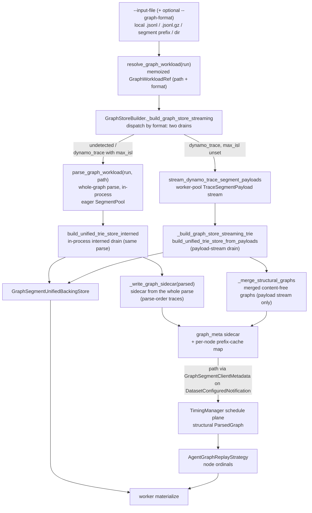

<!--
SPDX-FileCopyrightText: Copyright (c) 2025-2026 NVIDIA CORPORATION & AFFILIATES. All rights reserved.
SPDX-License-Identifier: Apache-2.0
-->

# Graph Ingest and Build Pipeline (Internal Reference)

Internal reference for the graph workload path: how a
recorded trace file becomes a `ParsedGraph`, how the segment trie is
persisted into runtime stores, and how the DatasetManager, TimingManager, and
workers agree on node addressing.

This page is build/runtime plumbing, not user-facing CLI guidance. Related
references:

- [Graph Segment Unified Store](./graph-segment-unified-store.md)
- [Graph Worker Materialization](./graph-worker-materialization.md)

## Pipeline summary



The graph path has two coupled contracts:

1. **Graph/topology contract:** every dynamo source — a local `.json` trace file
   or a directory of them — becomes an iterator of work items feeding ONE
   dispatch (`_build_fused_parallel`, over the shared `run_pool_streaming`
   pool) INSIDE the
   adapter's own parse. The build plane writes the mandatory structural sidecar;
   the schedule plane loads that sidecar from the exact path the graph-typed
   `DatasetConfiguredNotification` advertised and never re-parses (a missing or
   unloadable sidecar is a hard configure-time failure). Every build route
   resolves the same run-derived synthesis knobs into ONE `GraphParseContext`
   (`resolve_graph_parse_context(run)`), so the in-process parse and every
   spawn-started pool worker derive the same `ParsedGraph` topology and node
   ordinals.
2. **Payload contract:** build persists each node's request body materialization
   data into mmap-backed stores; workers later materialize by
   `(trace_id, node_ordinal)`.

## Workload detection and parser seam

### Detection: one memoized resolution per process

- `resolve_graph_workload(run)` is the single graph-ness accessor every
  consumer calls (DatasetManager, TimingManager, scenario validator,
  post-processors, ...). It returns a `GraphWorkloadRef`
  — the default dataset's input path
  (kept verbatim as `Path(dataset.path)`, never `.resolve()`d) plus the adapter
  format name — or `None` for a non-graph run. Detection runs AT MOST ONCE per
  process: the result is memoized on `run.resolved.graph_workload` (with a
  separate `graph_workload_resolved` marker, so "not a graph run" is
  distinguishable from "never checked"), and the config resolver chain
  (`DatasetResolver.resolve`) populates the memo eagerly in single-run mode so
  child processes inherit it through the pickled run without re-walking the
  registry. A derivation failure degrades to `None`, exactly like the
  per-consumer sniffs this accessor replaced — EXCEPT when `--graph-format` is
  set: that flag is the user asserting the input IS a graph workload, so
  `_derive_graph_workload` re-raises rather than silently degrading the run to
  the linear pipeline with no diagnostic.
- If `--graph-format` / `FileDataset.graph_format` is set, the input is forced
  into graph mode for that adapter.
- Without an override, detection walks registered `graph_adapter` plugins;
  `_AUTODETECT_EXCLUDED` is the (currently empty) opt-out set for adapters that
  must be requested explicitly via `--graph-format`.
- `is_graph_workload_path(path)` is the path-level companion (same registry
  detection, same exclusion set) for callers that have no run.
- Every runtime plane uses `resolve_graph_workload(run)` as the graph-mode
  decision. An explicit `--custom-dataset-type` (or dataset `format`) selects
  the custom loader and bypasses graph auto-detection; that loader then accepts
  or rejects the input according to its own contract. `--graph-format` bypasses
  graph auto-detection and forces its named adapter. The two explicit selectors
  are mutually exclusive regardless of input detection.

### Parse dispatch: registry-driven, one context

`parse_graph_workload(run, path)` is the shared ingest seam for in-process
graph parsing. It is a build-plane-only seam — the DatasetManager (via
`GraphStoreBuilder`) is the only production caller; the TimingManager never
parses. Every format goes through the adapter registry (`dynamo_trace` is the
only registered `graph_adapter` plugin).

1. publish the run's tokenizer trust/revision to the loader-preload env
   (`publish_graph_loader_tokenizer_env`);
2. read the memoized `GraphWorkloadRef` for the format name (asserting the
   passed path matches the run's own resolved input);
3. resolve every run-derived parse knob into ONE `GraphParseContext` via
   `resolve_graph_parse_context(run)`;
4. dispatch `parse_graph(path, format=fmt, ctx=ctx)`, which routes every
   format to the selected adapter's uniform `parse(path, ctx)`;
5. run the t*/dynamic-slot gate (`_gate_dynamic_slots_vs_tstar`) uniformly on
   the parsed result (see below).

Adapter failures surface uniformly as `GraphParseError`: the parser re-wraps
adapter-specific `ValueError` subclasses with the message text preserved, so
callers need exactly one except class. A registry-dispatched
`adapter.parse(path, ctx)` is byte-identical to the run's own parse for every
format (pinned by parity tests).

`parse_graph` is the generic parser:

- inputs dispatch through the graph adapter registry to
  `adapter_cls.parse(path, ctx)`; the ctx is passed opaquely and each adapter
  maps only the fields it consumes.

### `GraphParseContext`

A frozen dataclass carrying every
run-config-derived knob an adapter needs to parse byte-identically to the run.
`resolve_graph_parse_context(run)` populates every field with the run's
RESOLVED value — each resolver is a pure function of the run config, so
resolving a knob no live adapter consumes is harmless:

| Field | Consumers | Source |
|-------|-----------|--------|
| `content_root_seed` | dynamo | `resolve_graph_content_seed(run)` (`--random-seed`) |
| `content_tokenizer` | dynamo | `resolve_graph_content_tokenizer(run)` |
| `tokenizer_trust_remote_code` / `tokenizer_revision` | dynamo | run tokenizer config; published to the loader-preload env via `publish_ctx_tokenizer_env` (only when trust is set, so a ctx-less parse never clobbers the run path's publish) |
| `prompt_corpus` | dynamo | `synthesis.corpus` / `--prompt-corpus` (default `coding`) |
| `max_isl` / `max_osl` | dynamo | `synthesis.max_isl` filters trees by peak recorded input length; `synthesis.max_osl` caps lowered `max_tokens` |
| `num_dataset_entries` | dynamo | `--num-dataset-entries` — cap on distinct traces / session-trees selected (filter-then-cap) |
| `max_context_length` | dynamo | `--max-context-length` — per-trace context ceiling (input+output tokens) for graph-plane selection |
| `idle_gap_cap_seconds` | dynamo | `trace_idle_gap_cap_seconds` (tri-state, below) |
| `trajectory_start_max_ratio` | parse-time t\* gate | `--trajectory-start-max-ratio` (scenario-auto-applied when unset); `0.0` = window off |
| `default_model` | dispatch-knob consumers | primary model name |
| `run_streaming` | dispatch-knob consumers | resolved endpoint `stream` flag |
| `delay_cap_seconds` | dispatch-knob consumers | `inter_turn_delay_cap_seconds` |
| `ignore_trace_delays` | dynamo | `--ignore-trace-delays` maps to zero recorded idle gaps |
| `use_think_time_only` | dynamo (rejection gate) | `--use-think-time-only`; the dynamo adapter RAISES `DynamoTraceAdapterError` when set, because the Dynamo trace schema records no per-request think time |
| `endpoint_extra` | dispatch-knob consumers | `--extra-inputs` pairs |

**Forward-only-when-set.** Adapters forward a ctx field to their entry function
ONLY when it is set, so a ctx-less parse (`parse(path)` — CLI tooling, direct
callers with no run config) stays byte-equal to the protocol-default entry, and
a partial ctx never clobbers a non-`None` entry default (dynamo's
`prompt_corpus="coding"`).

**Tri-state idle-gap cap.** `idle_gap_cap_seconds` distinguishes three states:
`UNSET` (module sentinel; adapter default, 60 s), a float (that cap), and an
explicit `None` (warping DISABLED — the user's
`trace_idle_gap_cap_seconds: null`). `resolve_graph_parse_context` never
yields `UNSET` (a run always has a resolved answer), and the dynamo
adapter forwards the tri-state verbatim (`is not UNSET`, not `is not None`).

The dynamo adapter has no behavior env knob left on its `parse` entry:
generation is always pinned to the recorded `output_tokens` and
recorded delays always replay, subject to the tri-state idle-gap cap; the only
remaining `Environment.DYNAMO.*` knob is `MAX_SUBAGENT_DEPTH` (the parent-link
chain-depth cycle guard). Seed semantics are unchanged: dynamo pins
`content_root_seed` at entry via
`resolve_effective_root_seed` (explicit seed → ambient bootstrap root seed →
per-run OS entropy), so unseeded content is internally consistent within one
run and distinct unseeded runs deliberately differ.

### t*/dynamic-slot gate

`_gate_dynamic_slots_vs_tstar(parsed, ctx.trajectory_start_max_ratio)` runs
uniformly on every `parse_graph_workload` result: a graph carrying dynamic
content slots (`graph_carries_assembly_slots` — prompt refs to LlmNode-written
channels) is rejected while the t* snapshot window is engaged
(`--trajectory-start-max-ratio > 0` — off by default; on a graph workload it is
opened ONLY by the explicit `--trajectory-start-min/max-ratio` flags), because a
slot producer chopped into warmup would leave its consumer's pool value
undefined. `--scenario inferencex-agentx-mvp` carries ratio defaults too, but it
never reaches this gate — a graph workload leaves `resolved.dataset_types`
unstamped, so the scenario's `require_loader` check rejects the run first.
(AgentX, the branch-orchestrator replay path the scenario is named for,
is a separate feature from Agent Graph.)

**Explicit-zero carve-out.** The gate is skipped iff EVERY node's
`arrival_offset_us` is explicitly the int `0`; the un-stamped `None` default
does NOT qualify and keeps gating. All-zero offsets
make the recorded duration 0, so any sampled t* is 0 and the snapshot chop is a
structural no-op — rejecting could only ever false-positive. The carve-out is
keyed on that invariant, not on a format branch.

## Dynamo input forms

Implementation: `from_dynamo_trace` (build) and the dynamo trace reader
(`discover_segments` / `iter_trace_records` / `DynamoTraceAdapter.can_load`).

All forms reduce to the same thing: an ordered list of trace segments read by
`discover_segments`, whose `request_end` records are collected into per-session
chains, grouped into session-trees, and lowered one tree at a time — serially
in-process or through the fused read+build pool (see
[Unified parse dispatch](#unified-parse-dispatch-and-seed-determinism)).

### Local file

A single dynamo capture is JSONL (`.jsonl`) or gzipped JSONL (`.jsonl.gz`),
one record per line. Dynamo's file sinks wrap every line in a
`{"timestamp", "event"}` envelope; `unwrap_sink_envelope` unwraps it and bare
records (hand-authored fixtures, the stderr sink) are accepted directly.

Detection (`DynamoTraceAdapter.can_load` -> `_first_record_matches`) sniffs the
FIRST non-empty line only and requires `schema == "dynamo.request.trace.v1"`
plus a known `event_type`; `agent_context` may be absent (replay-only records).
Detection never crashes on a candidate: a truncated gzip member (`EOFError`),
corrupt deflate (`zlib.error`), a non-gzip file behind a `.gz` name
(`BadGzipFile`), and undecodable JSON all mean "not ours", not an error.

During parse, `from_dynamo_trace`:

1. reads every segment via `iter_trace_records`, keeping `request_end` records
   (deduplicated by `record_identity`, re-exported alongside `from_dynamo_trace`
   as the private `_record_identity` alias for the trace-report command) as per-session
   `_Chain`s;
2. drops records with no session identity (no `agent_context`), counting the
   skips so an all-skip capture raises `EmptyDynamoTraceError` distinctly from
   an empty file;
3. resolves ONE `trace_block_size` across the whole capture (fail-loud on a
   mix), falling back to `DEFAULT_VIRTUAL_BLOCK_SIZE` when no record carries
   replay metadata;
4. groups sessions into session-trees (`group_chains_into_trees` over
   `root_of_sessions`) and lowers each tree independently
   (`_build_trees_sequential` -> `dynamo_trie_nodes`);
5. stamps the base tag `from-dynamo-trace` on each tree's `TraceRecord` and
   merges the per-tree single-graph `ParsedGraph`s
   (`_finalize_parsed_graph` -> `merge_parsed_graphs`).

### Segmented prefix

With the `jsonl_gz` sink, dynamo rolls segments into
`prefix.000000.jsonl.gz`, `prefix.000001.jsonl.gz`, …. Passing the bare prefix
(the configured `DYN_REQUEST_TRACE_OUTPUT_PATH` value, with or without a
trailing `.jsonl`/`.jsonl.gz`) resolves every matching segment in numeric
order — `_dir_segment_sort_key` sorts by `(prefix, int(index))` so the 7-digit
rollover (`1000000` vs `999999`) does not reorder the stream.

### Local directory

A directory is claimed when it contains at least one `*.jsonl` / `*.jsonl.gz`
child and the first child in reader order passes the same first-record sniff.
All children are read in the same numeric segment order, so a session whose
records are split across segments still lands whole in one chain.

On the dynamo path the adapter reads local files, directories, and segment
prefixes.

### Session-tree selection

When `--num-dataset-entries` / `--max-context-length` are set, session-trees are
filtered-then-capped: each tree's peak context is screened against
`max_context_length` (`dynamo_tree_peak_context`, hash-free), then the first
`num_dataset_entries` eligible trees in root-sorted order are kept
(`filter_then_cap`). The serial path selects over the
already-collected chains (`_select_chains_filter_then_cap`); the fused path
selects in the parent scan (`_select_roots_filter_then_cap`) so unselected trees
are never shuffled or built. Both raise `EmptyDynamoTraceError` when every tree
is filtered out — a ceiling below the whole capture is a user error, not an
empty graph. `log_selection_summary` is emitted exactly once per build by
whichever path actually ran.

### Unified parse dispatch and seed determinism

`maybe_build_fused_parallel` is the ONE parallel-or-serial decision, taken in
`from_dynamo_trace` BEFORE the expensive full read (the fused path must avoid
collecting hash-bearing chains in the parent at all). It runs the cheap Phase-1
grouping scan (`_scan_grouping`: session ids, parent links, block size, byte
weights — never the giant `input_sequence_hashes` arrays) to learn the tree
count, then returns `None` — caller stays serial, no pool spawn — when the tree
count is at or below `AIPERF_DATASET_DYNAMO_GRAPH_PARALLEL_THRESHOLD`
(default 8), the resolved worker count collapses to 1, a single-session filter
is set, or a live `direct_store` write-through sink is in play (it cannot cross
a process boundary).

Otherwise three phases run on the shared pool lifecycle
(`run_pool_streaming` — forkserver on Linux, spawn on macOS,
parent-built shared-memory corpus, bounded ordered window, graceful shutdown):

1. **Grouping scan** (parent, `_scan_grouping`) as above.
2. **Shuffle** (parent, `_shuffle_to_batch_files`): each raw record line is
   appended VERBATIM to a per-batch gzip temp file routed by its session's
   batch, so every batch file is self-contained and every worker sees COMPLETE
   trees even when a session's records span segments.
3. **Fused build** (workers, `_build_batch_file_to_blob`): each worker reads
   its batch file and builds it with the parent-pinned seed and block size via
   the STRICTLY sequential `_build_trees_sequential` (no nested pool), returning
   its batch's list of per-tree `ParsedGraph` msgpack blobs
   (`_encode_batch_result` / `_decode_batch_result`). No `ParsedGraph` instance
   ever crosses the pool boundary. The raw hashes never cross it either — they
   are parsed only inside the worker that consumes them.

The parent decodes frames in input (batch) order and flattens them, so the
flattened per-tree list is byte-identical to `_build_trees_sequential` over the
same capture: same per-tree node keys/order, same edge set, same
content-addressed `segment_pool`.

Worker count resolution (`_dynamo_workers`): `0` = auto
(`min(cpu_count - 1, AIPERF_DATASET_DYNAMO_GRAPH_PARALLEL_AUTO_MAX_WORKERS)`),
a positive value pins it, and it is always capped at the tree count so a
two-tree capture never spawns sixteen idle workers.

The content seed is pinned to a concrete int by `resolve_effective_root_seed`
in `from_dynamo_trace` before any dispatch decision: an
explicit `--random-seed` wins; otherwise the ambient bootstrap-seeded manager's
root seed; otherwise a fresh OS-entropy seed (`secrets.randbits(64)`) generated
once per resolution. Within ONE run the serial path and every pool worker
therefore synthesize identical bytes at any threshold, while distinct unseeded
runs deliberately differ. The schedule
plane never re-parses (it ingests the structural sidecar this build wrote and
broadcast), so no content bytes ever need to agree across the build/schedule
split; the only determinism that matters is between the in-process parse and
its pool workers.

## `ParsedGraph` shape from the segment-trie builder

Implementation: the dynamo-specific flatten/walk is `dynamo_trie_nodes`,
`dynamo_recon_callbacks`, and `build_dynamo_llm_node`. The shared,
format-agnostic trie core they call into is the
`aiperf.dataset.graph.segment_trie` package — `build_segment_trie` and
`resolve_content_parents` for content, `build_interval_edges` for timing,
`SegmentPool` for pooling, `stamp_prompt_segment_ids` for envelopes, and the
unified-store builders. The block-geometry, idle-gap-warp, and message-chaining
helpers (`compute_turn_block_geometry`, `apply_idle_gap_warp`,
`add_message_chain`) sit alongside the content core. The t* snapshot chop
(`chop_trie_at_tstar`) lives next to its only consumer in the timing plane. The
trie primitives are imported directly from
`aiperf.dataset.graph.segment_trie`.

The lowering emits one per-tree `(ParsedGraph, SegmentPool)`. The emitted
graph is intentionally small:

- one `LlmNode` per recorded `request_end` (`{session_id}:{k}`), including
  recursive subagent-inner requests;
- `StaticEdge` waits-for dependencies only;
- no reducer, channel topology, or chain/aux classification on the trie path;
- one top-level graph, no subgraphs;
- a `SegmentPool` containing prompt segments and assistant response segments.

### Content lineage

Every leaf request is flattened in recorded order. Its content parent is chosen
from prior requests by the recorded `hash_ids` (`resolve_content_parents`,
an incremental prefix-trie pass, byte-for-byte equal
to the pairwise scan but without the O(n²·m) double loop):

1. prefer the earlier request whose `hash_ids` are the longest full prefix of the
   current request;
2. tie-break full-prefix matches toward the most recent prior request;
3. if there is no full prefix, use the prior request with the longest partial LCP
   as the branch point;
4. with no overlap, the request is a fresh root.

The content parent serves two roles: **role-boundary inheritance** (below) and
reconstruction statistics (LCP coverage). Timing dependency is derived independently — see
[Timing and dependency edges](#timing-and-dependency-edges).

**Per-block frozen tags.** A single global pass (`compute_asst_caps` +
`assign_block_tags`) assigns every covered block a `(role, starts_new_message)`
tag. A block's tag is **frozen at the first node that creates it** and inherited
verbatim by every later node that shares it — never relabeled or coalesced. This
is the cache-safety invariant: any two requests sharing a block-aligned prefix see
the identical role segmentation over that prefix, so they render an identical
leading message chain. Assistant caps come from the recorded `out` of the
content-parent chain; the trailing user turn is guaranteed at block-creation time
(`asst -= 1` when a node would otherwise end assistant-only).

**Message-unit emission.** `assemble_messages` groups the frozen per-block tags
into messages (a new message begins at each `starts_new_message`) and emits one
content-addressed pool entry per message via the existing
`segment_id(parent_id, role, tokens)` (blake2b-16), chained root→tip. Because tags
are frozen per trie position, a shared block prefix yields an identical
`(parent_id, role, tokens)` chain → identical segment ids → a real prefix-cache
hit. Emission is block-aligned: no partial tails, no synthesis of missing whole
blocks. A hard build-time gate (`assert_covered_isl` → `TrieISLMismatchError`) asserts each
node's reconstructed prompt equals the block-aligned **covered-count**
`min(len(hash_ids), in // block_size) * block_size` (covered-count, not
`(in // bs) * bs`, so a request storing fewer hash blocks than `in // bs` does not
abort the build).

Non-block-aligned inputs are format-normalized before the trie: dynamo records
one trailing partial-tail hash spanning the remainder
(`(n-1)*bs < input_length <= n*bs`), which its lowering DROPS — engines
cache/share full blocks only, so
a partial block is never a prefix-cache hit — while `input_length` keeps the
tail tokens. Both recorded adapters then sample the sub-block remainder from
the same trace-scoped node seed, and both pass `small_prompt_fallback=True` so
a covered-count-0 (sub-block) recorded prompt synthesizes a single sampled
user message instead of an unreplayable empty prompt. The same recording
therefore lowers identically from either format.

Each `LlmNode` receives:

- `prompt=[]` -- the trie route carries NO inline prompt text on the node (the
  content lives in the segment pool / unified store, and `strip_replay_text`
  forces `prompt=[]` for the `graph_meta` sidecar); workers reconstruct the
  request body from resolved segment handles, never from `node.prompt`;
- `metadata["trie"]["prompt_segment_ids"]`, the build-time per-message id chain
  resolved to integer segment `handles` in the unified store (the assistant
  response segment is reachable as the assistant pool entry chained onto the
  prompt tip); these ids do not reach worker materialization;
- the first-class dispatch fields: `model` and `max_tokens` from the recorded request,
  `streaming` from the request type;
- `arrival_offset_us` on the idle-gap-warped timeline.

The build resolves `prompt_segment_ids` to integer `handles`; the worker uses
those handles, not the build-time ids or predecessor channel values, to build
the request body.

The lowering sets `dispatch_overrides["stream"]` from the recorded `ttft_ms`
(present → streaming) and the value is retained in the segment-store manifest as
corpus provenance. The wire mode itself comes from the run-level
`endpoint.streaming`; see
[wire streaming mode](./graph-async-dataflow-runtime.md#wire-streaming-mode)
for how the worker and transport consume it, and for the run-level gating of the
`STREAMING_ONLY` metric family.

### Timing and dependency edges

Timing dependency is derived independently of content ancestry, by an
**interval-order** pass over the flattened nodes (`build_interval_edges`,
consuming the time-consistent `rank` from
`compute_ranks`). The pass runs per SESSION-TREE: a root plus its
`parent_trajectory_id` descendants is lowered independently, so edges stay
within a tree and independent trees never gain a cross-parent edge.

- **Rank** is a linear extension of finished-before: nodes sorted by
  `(warped_start, warped_end, node_id)`. Idle-warp monotonicity makes this a valid
  topological order of the causality DAG.
- **Edge rule:** `A → B` iff `A` finished before `B` started on the raw recorded
  clock (`A.raw_end <= B.raw_start`, i.e. `B.request.t`) **and** `rank(A) < rank(B)`. A request that
  fully finished before another fully started must precede it; anything mid-flight
  at that instant is off the hook (concurrent), so genuine racers stay parallel.
- **Async exclusion** (`_excluded_async`) drops fire-and-forget (`async_launched`)
  subtree children from the candidate set before the frontier filter, so a
  detached background agent never becomes a timing prerequisite of later work.
- **Frontier (transitive reduction):** only the maximal finished-before candidates
  are kept — a candidate `c` transitively covered by another candidate `d`
  (`c → d → B`) is dropped. So a node's edges are its immediate causes, not its
  whole ancestry. (A content parent is therefore not automatically a timing
  predecessor; it is dropped when a later cause dominates it.)
- **Binding-cause delay:** the latest-ending frontier predecessor (`max by .end`)
  carries the warped end-to-start delay; every other frontier predecessor is a
  zero-delay AND-join wait.
- **Empty frontier:** the node roots at `START` with `min_start_delay_us` equal to
  its own warped arrival offset, preserving recorded concurrency.

**Causal-overlap carve-out (start-anchored edges).** The finished-before rule
cannot express a request that BEGINS while its causal predecessor is still in
flight — a subagent spawned mid-turn, or a chain request that overlaps the
previous one. Interval-order alone would bind such a node to whatever unrelated
request happened to finish just before its start, embedding the causal parent's
concurrent server time as fake idle "think time." To fix this, the walk stamps
each node's `TrieNode.causal_parent_id` — the spawner for a subagent's first
inner request, else the previous n/s request in the same list (the dynamo
adapter stamps the same field: the previous turn in a chain, else the latest
parent-session turn at or before the child's start). After `build_interval_edges`,
`apply_start_anchors` tests each node against
that parent: when the node's recorded start falls inside the parent's recorded
interval (`parent.raw_start <= node.raw_start < parent.raw_end`), it REPLACES the
node's interval-order edges with ONE start-anchored `StaticEdge(parent → node,
delay_after_predecessor_start_us=D)`, where `D` is the warped start-to-start gap.
At replay the successor is scheduled at the parent's DISPATCH and gated `D` later,
so recorded mid-flight concurrency tracks the parent causally instead of freezing
to the wall clock — see
[edge-gate semantics](./graph-async-dataflow-runtime.md#timing-and-t-star-behavior).
Nodes whose causal parent had already finished keep their interval-order edges
(end-anchoring is correct there by construction).

On the SemiAnalysis 062126 corpus (393 traces, 98,827 requests) the carve-out
fires for 6,981 requests: 33.7% of subagent spawns (572 of 1,697) begin while
their spawner is still in flight, and 6.5% of all requests (6,409) overlap their
chain predecessor. Before it, interval-order bound each overlapped spawn to an
unrelated earlier request whose binding end-to-start delay was p50 97% concurrent
server time (the parent's own in-flight processing) rather than real idle time.
After it, all 6,981 overlapped nodes anchor to their stamped causal parent
(verified zero mismatches).

**Post-TTFT refinement (first-token-anchored edges).** A start anchor still
overcounts when the child began after the parent's FIRST TOKEN rather than at the
parent's dispatch: the child's true "think time" starts once the parent began
streaming, not when it was sent. When the parent is a streaming request that
carries a recorded time-to-first-token (`parent.request.ttft`, in seconds — the
dynamo adapter stamps `ttft = ttft_ms / 1000.0`) AND the child's start falls at or after that first
token (`node.raw_start - parent.raw_start >= ttft`), `apply_start_anchors`
additionally carries `delay_after_predecessor_first_token_us = D' = max(0,
D - ttft*1e6)` on the same edge (`D` is the warped start-to-start gap). At replay
the runtime gates the child at the parent's OBSERVED first token `+ D'`,
superseding the dispatch anchor; the start anchor remains the mandatory fallback
for when the parent terminates without a first token. A
non-streaming parent (`ttft is None`) and a child that began BEFORE the parent's
first token keep the pure dispatch/start anchor.

Of the 6,981 anchored nodes on the 062126 corpus, 1,097 gain a first-token
refinement (streaming parent, child begins post-TTFT → get `D'`); 908 began
pre-TTFT (streaming parent, child starts before the first token → no refinement);
and 4,976 have a non-streaming parent (no recorded `ttft`) — the latter two groups
stay purely dispatch-anchored.

> **Post-TTFT anchoring needs the run to stream.** `D'` is only stamped
> when the parent is a streaming request (recorded `ttft`), so on a `--streaming`
> run every first-token edge's source node is itself `streaming=True` and the
> runtime observes that parent's first token (see the
> [runtime first-token fan-out](./graph-async-dataflow-runtime.md#first-token-fan-out-post-ttft-anchoring)).
>
> `--no-streaming` breaks that pairing corpus-wide, and it does so HERE at build
> time, not on the wire: `ctx.run_streaming` is forwarded into
> `build_dynamo_llm_node`, whose `streaming = req.ttft is not None if streaming is
> None else streaming` lets the run-level flag OVERRIDE the recorded ttft-derived
> mode. Every node is then stamped `streaming=False` while `build_interval_edges`
> has already stamped the first-token anchors, so every refined child silently
> falls back to its start anchor. The TimingManager warns once at configure time
> when it sees that shape.

The per-node frontier filter is `O(candidates²)` (up to `Θ(n²)` per node for a
pathological wide fan-in); accepted deliberately (wide fan-in is rare; no synthetic
barrier/collapse node is inserted).

The idle-gap warp caps only true inactive gaps: it builds active intervals from
all flattened requests, collapses idle stretches longer than the cap, and never
cuts inside a request's `api_time` or overlapping subagent activity. This keeps
request durations and overlap relationships intact while preventing multi-hour
recorded dead air from parking warmup indefinitely.

### t* snapshot chop

`chop_trie_at_tstar(graph, t_star_us)` (which lives next to its only consumer in
the timing plane, not in the trie build core) trims pre-`t*` nodes for resume.
Surviving
nodes keep their full `prompt_segment_ids` path, because pre-`t*` turns were
warmed and the server should already hold their KV. Nodes whose predecessors were
chopped are re-rooted from `START` with a t*-relative absolute offset, and input
requirements for dropped predecessor output channels are removed.

## Build plane: DatasetManager routing and `GraphStoreBuilder`

Implementation: `GraphStoreBuilder` (the build itself), `DatasetManager` (thin
routing), and the segment-trie store builders `build_unified_trie_store_interned`
/ `build_unified_trie_store_from_payloads` (the drains' store primitives).

`DatasetManager._configure_dataset` routes a graph run
(`resolve_graph_workload(run)` non-`None`) to `_configure_graph_dataset`, whose
build seam is `_build_graph_store`: first the endpoint gate
(`workload_detect.validate_graph_endpoint_type` — the graph dispatch path emits
a chat-completions body verbatim, so a non-chat endpoint would 422 on every
request; rejected at configure time, before any store work), then
`GraphStoreBuilder(run).build(graph_path)`. `_configure_graph_workload` is the
facet-only wrapper over the same seam for direct callers.

`GraphStoreBuilder.build` owns the whole build:

1. publishes the run's tokenizer trust/revision to the loader-preload env and
   prestarts the trace-loader forkserver on the loop at a known-quiet point
   (a lazily started helper inside the offloaded parse would race its
   process-wide stdio swap against live logging);
2. resolves the mmap base path from `AIPERF_DATASET_MMAP_BASE_PATH` or the
   system temp directory;
3. reads the memoized `GraphWorkloadRef` for the format and calls
   `_build_graph_store_streaming` — the store build for every graph workload.
   It routes `dynamo_trace` (with `ctx.max_isl is None`) to the worker-pool
   payload-stream drain, and everything else — an undetected format, and
   dynamo when `--synthesis-max-isl` is set — to the in-process interned drain
   over one whole-graph parse;
4. the drain finalizes the unified store and writes the mandatory structural
   sidecar (a catalog-divergent sidecar raises `DatasetError`; an unwritable
   path fails the build with the underlying I/O error — the run is
   unschedulable without it; a drain that completes without recording a sidecar
   path is a hard build failure);
5. derives the per-node prefix-cache map (`_build_graph_prefix_cache_by_trace`)
   from the structural graph the drain returned — the merged graph on the
   payload-stream route, the full parse on the interned route;
6. returns a `GraphStoreBuildResult` — the `GraphDatasetMetadata` facet (the
   trace universe `trace_ids` plus the per-node prefix-cache map, no
   conversations), the sidecar path, and the store base path.

`DatasetManager._configure_graph_dataset` then broadcasts
`DatasetMetadata(conversations=[], graph=...)` and a
`GraphSegmentClientMetadata` (unified-store base path, benchmark id, and the
exact sidecar path from the build result) on the
`DatasetConfiguredNotification`. The conversation list is empty by design:
workers read the real graph request bodies from the unified store by
`(trace_id, node_ordinal)`, and the TimingManager plans from the advertised
sidecar.

### Build drains

`GraphStoreBuilder._build_graph_store_streaming` builds the unified store for
EVERY graph workload. It dispatches on the workload format to one of two drains:

- **Worker-pool payload stream (`_build_graph_store_streaming_trie`)** — the
  route `dynamo_trace` takes by DEFAULT, whenever `ctx.max_isl is None`. The
  builder calls `stream_dynamo_trace_segment_payloads`, which streams worker-parsed `TraceSegmentPayload` values one trace at a time,
  so the parent never holds a whole-corpus real-content `ParsedGraph`. A dynamo
  capture groups its sessions into independent SESSION-TREES (a root plus its
  `parent_trajectory_id` descendants), each lowered on its own node set so
  interval-order edges stay WITHIN a tree and cross-parent edges never form; the
  fan-out is tuned by `AIPERF_DATASET_DYNAMO_GRAPH_PARALLEL_*`. Dynamo's
  structural graph therefore comes from `_merge_structural_graphs` over the
  streamed per-trace graphs — never written straight from a whole parse.
- **In-process interned drain (`_build_interned_unified_store`)** — the
  FALLBACK: an undetected `fmt=None` (which then fails inside
  `parse_graph`'s own detection), and `dynamo_trace` when `--synthesis-max-isl`
  is set, because that selection changes lowering semantics.
  `parse_graph_workload` runs once in-process (off-loop), and that SAME parse is
  drained directly through `build_unified_trie_store_interned` — no payload
  round trip. Every
  adapter lowers through the shared segment-trie core at parse time, so `parsed`
  carries a `segment_pool` plus per-node `prompt_segment_ids`; a pool-less parse
  raises (it is a lowering bug). See
  [the in-process interned drain](#in-process-interned-drain) below.

Each streamed payload contains:

- `trace_id`;
- `node_ordinals`;
- profiling `NodeEnvelope` envelopes (carrying `prompt_segment_ids`);
- `(segment_id, role, content, wire_json)` segment tuples, where `wire_json` is
  the verbatim `orjson.dumps(message)` raw-JSON blob for a raw-authored segment
  (persisted byte-for-byte) and `None` for a role/content segment (the store
  derives the `{"role", "content"}` blob);
- `structural_graph`: the content-free structural `ParsedGraph` (msgpack
  bytes; `replay_outputs` and the segment pool emptied) — a pool producer emits
  one single-trace parse per payload and attaches its structural graph (and
  pool segments) to that payload. The streaming consumer merges the collected
  graphs into the corpus structural graph that feeds the sidecar and
  prefix-cache map.

`_build_graph_store_streaming_trie` drains these payloads into the ONE
interned unified store via `build_unified_trie_store_from_payloads` — the SAME
unified store the in-process interned drain builds — the sole build output.
Streaming
`put_segment` deduplicates by content-addressed segment id, keeping parent
memory bounded.

Alongside the store drain, each streamed trace's content-free structural graph
is collected and merged ONCE (`_merge_structural_graphs`, which hard-fails on an
empty or unmergeable stream); the merged graph feeds both the mandatory
`graph_meta` sidecar (`_write_graph_sidecar`) and the per-node prefix-cache map,
so payload-stream builds report both identically to the interned drain.

The interned unified node envelope contains int handles, not hex segment ids:

```json
{
  "handles": [0, 1, 2],
  "dispatch_overrides": {"max_tokens": 123, "model": "...", "stream": true},
  "stream": true
}
```

See [Graph Segment Unified Store](./graph-segment-unified-store.md) for the
on-disk file layout.

Node ordinals are assigned by `trie_node_ordinals`: sort trie `LlmNode`s by
`arrival_offset_us`, tie-break by node id, and assign dense ordinals. The schedule
plane uses the same ordinal function, so `(trace_id, node_ordinal, "profiling")`
resolves to the manifest written at build time.

### In-process interned drain

The fallback route — an undetected format, and `dynamo_trace` with
`--synthesis-max-isl` set — parses once in-process and
drains that SAME whole-graph parse through the interned builder, with no payload
round trip: `_build_interned_unified_store` drains the content-addressed pool
and every node's `prompt_segment_ids` manifest into the interned
`GraphSegmentUnifiedBackingStore` via `build_unified_trie_store_interned`
(resolving hex segment ids to int handles at build time), then the sidecar is
written DIRECTLY from the stripped whole parse
(`_write_graph_sidecar(parsed, ...)`), so its traces stay in PARSE order (the
structural merge on the payload-stream drain reorders by id).

The store is always constructed AFTER the parse here: `GraphStoreBuilder` calls
`parse_graph_workload(run, graph_path)` with no adapter kwargs on every route, so
the parse fills a plain in-RAM `SegmentPool` that the drain then walks. The
dynamo adapter's `direct_store` write-through
(`StoreBackedSegmentPool`) would let a
caller intern segments straight into `content.blob` at parse time and skip that
second copy, but NO production caller passes it — it is a supported-but-unwired
adapter capability exercised only by tests. See
[Dynamo direct write-through](./graph-segment-unified-store.md#dynamo-direct-write-through-a-supported-but-unwired-adapter-capability)
for the shim contract, the parity pins, and the measured content-pool collapse.

This is also the only drain that persists dynamic-slot envelopes: a
slot-carrying graph cannot ride the streaming payload envelope
(`_trace_trie_envelopes` rejects slot metadata loudly). No shipped lowering
stamps slots — the dynamo adapter never does — so the streaming rejection is a
fail-loud guard, not a route the corpora take.
`graph_carries_assembly_slots` does not route the store build; it survives
only as the build-plane t\*-gate predicate
(`workload_detect._gate_dynamic_slots_vs_tstar`, run inside
`parse_graph_workload`).

`build_unified_trie_store_interned` also serves as the parity-test oracle for
the payload-stream drain: a dedicated parity test pins the payload-stream store
byte-for-byte against the interned build for a dynamo capture. The unwired
direct write-through shim and the `**adapter_kwargs` seam have their own
pinning test.

### Store shape summary

Every graph parse lowers onto the one interned unified store, selected by
neither flag nor graph shape.

| Build path | Build function | Store written |
|------|-------|-------------|
| Worker-pool payload stream (`dynamo_trace` with no `--synthesis-max-isl` — the default dynamo route) | `build_unified_trie_store_from_payloads` | `GraphSegmentUnifiedBackingStore` (drained from worker-streamed payloads). See [unified store](./graph-segment-unified-store.md). |
| In-process interned drain (undetected formats, and `dynamo_trace` with `--synthesis-max-isl` — one whole-graph parse) | `build_unified_trie_store_interned` | `GraphSegmentUnifiedBackingStore` (same store; interned, A2, drained from the whole-graph parse — the only drain that persists dynamic-slot envelopes). |

The worker opens that one unified store.

## Worker materialization

Workers resolve the store from the same `(base_path, benchmark_id)` the
DatasetManager used, open one `GraphSegmentUnifiedClient` on the first credit,
and reuse that result — success or failure — for the rest of the run. The open
is fail-loud: a failed open becomes a cached fatal
`GraphStoreUnavailable`, and a missing node manifest becomes
`GraphEnvelopeMissing` naming trace, instance, ordinal, and phase.

[Graph Worker Materialization](./graph-worker-materialization.md) owns the
worker side in full: envelope fields, the bytes-vs-dict path selection,
dispatch overrides, warmup caps, cache busting, and the error modes.

## Structural sidecar handoff

The `graph_meta.msgpack` sidecar is the mandatory artifact that hands a
pre-built structural `ParsedGraph` from the DatasetManager build plane to the
TimingManager schedule plane, so the schedule plane never re-parses the graph
workload file. The DatasetManager writes it on every build route and advertises
its exact path on the graph-typed `DatasetConfiguredNotification`; the
TimingManager ingests it from that broadcast path only.

### Two-plane architecture

An agent graph workload is processed by two independent services in separate
processes:

| Plane | Service | Responsibility |
|-------|---------|----------------|
| Build | `DatasetManager` (build owned by `GraphStoreBuilder`) | Build the unified segment store via one of the two drains above, then write the mandatory sidecar — from the merged structural graphs on the payload-stream route, DIRECTLY from the stripped parse (in parse order) on the interned route — and broadcast the resulting store and sidecar paths on the graph-typed `DatasetConfiguredNotification` |
| Schedule | `TimingManager` | Ingest the sidecar from the broadcast path (hard fail if the broadcast is not graph-typed or the sidecar is unloadable), hand the `ParsedGraph` to `PhaseOrchestrator` |

The sidecar bridges these planes: the build plane writes it once and advertises
its location on the broadcast, the schedule plane reads it later from that exact
path — never a second parse of the workload.

```mermaid
sequenceDiagram
    participant DM as DatasetManager
    participant B as GraphStoreBuilder
    participant FS as Filesystem
    participant TM as TimingManager

    DM->>DM: validate_graph_endpoint_type(run)
    DM->>B: GraphStoreBuilder(run).build(graph_path)
    alt dynamo_trace, no --synthesis-max-isl (payload stream)
        B->>B: stream_dynamo_trace_segment_payloads (worker pool)
        B->>FS: drain payloads into unified segment store
        B->>B: _merge_structural_graphs(structural_sink) → merged structural ParsedGraph
    else undetected / dynamo with --synthesis-max-isl (in-process interned drain)
        B->>B: parse_graph_workload(run, path) → whole-graph ParsedGraph
        B->>FS: build_unified_trie_store_interned(parsed) → unified segment store
    end
    B->>B: catalogs_match(parsed_or_merged, store_catalog)?
    alt catalogs match
        B->>FS: write_graph_meta_sidecar() → graph_meta.msgpack
        B-->>DM: GraphStoreBuildResult(facet, sidecar_path, base_path)
        DM->>TM: DatasetConfiguredNotification(GraphSegmentClientMetadata: store + sidecar path)
    else catalogs diverge / empty or unmergeable stream
        B->>B: raise DatasetError (run fails; the sidecar is mandatory)
    end

    TM->>FS: read sidecar_path from GraphSegmentClientMetadata
    alt graph-typed, present, decodable, index cross-check passes
        FS-->>TM: graph_meta.msgpack bytes
        TM->>TM: decode_graph_meta_sidecar() → structural ParsedGraph
        TM->>TM: use sidecar graph (never re-parses)
    else not graph-typed / missing / undecodable / index-divergent
        TM->>TM: raise InvalidStateError (hard configure-time failure)
    end
```

### The `graph_meta.msgpack` sidecar

**File location:** `<MMAP_BASE_PATH>/aiperf_graph_meta_<benchmark_id>/graph_meta.msgpack`

resolved by `sidecar_path_for` (the unified segment store lives in its own
`aiperf_graph_segments_<benchmark_id>/` directory).

**Producer:** `GraphStoreBuilder._write_graph_sidecar`, called on both build
routes. Trie ordinals are rebuilt via `flat_trie_ordinals` (keyed on the graph
topology), so the sidecar catalog matches the store. Either way the write is
mandatory: a catalog-divergent sidecar raises `DatasetError` (an unwritable path
fails the build with the underlying I/O error) — a divergent sidecar would
describe a DIFFERENT topology than the envelopes the worker reads.

**Consumer:** `TimingManager._load_graph_sidecar` (ingests from the
`GraphSegmentClientMetadata` on the graph-typed `DatasetConfiguredNotification`).
The TimingManager never re-parses: a broadcast that is not graph-typed, or whose
advertised sidecar is missing, undecodable, or index-divergent, is a hard
`InvalidStateError` at configure time — no re-parse, no env-convention path
re-derivation.

**Content-free:** The sidecar encodes a **structural** `ParsedGraph` produced by
`strip_replay_text`: graph topology, node ids/types, edges, `arrival_offset_us`,
catalog keys, and the first-class dispatch fields (model / max_tokens /
raw_tools / extra_headers / theoretical prefix-cache counts) are preserved, but
per-trace content is stripped: every trace's `replay_outputs` (per-node recorded
output channel values, `node_id -> {channel: value}`) is cleared to empty. For
the segment trie (`segment_pool is not None`) the strip is deeper: the
`SegmentPool` is emptied (kept non-`None` so the loaded graph still takes the
trie ordinal scheme), and each `LlmNode`'s inline `prompt` and `metadata["trie"]`
contents are cleared to `{}` — only the `"trie"` marker key is kept. Those
contents are `prompt_segment_ids` (the only key dynamo stamps) plus the
dynamic-slot `assembly` / `capture` keys the envelope contract reserves; no raw
`hash_ids` are ever stamped there. The real content lives in the unified segment
store; the sidecar never duplicates it.

**Wire format** (`encode_graph_meta_sidecar` / `decode_graph_meta_sidecar`):

```text
[header, pg_bytes]
```

where `header` is
`{"kind": "parsed_graph", "schema_version": int, "source_fingerprint": dict}`
and `pg_bytes` is the canonical `encode_parsed_graph_msgpack` output (a nested
blob). The `kind` discriminator is **required**: `decode_graph_meta_sidecar`
rejects any frame whose `kind` is missing or not `"parsed_graph"` (raising
`ValueError`, which the TimingManager surfaces as a hard `InvalidStateError`),
which is why the schema version was bumped from 2 to 3 — a pre-v3 kind-less
sidecar decodes as invalid and fails the run until it is rebuilt.
`GRAPH_META_SCHEMA_VERSION` is 4: the 3→4 bump marks the verbatim raw-JSON
`Segment.wire_json` variant and is **advisory provenance only**, with the
`kind` requirement remaining the one reader-side gate. A v3 blob still decodes
because `Segment.wire_json` defaults to `None`, the normalized role/content
segment. The outer `_SIDECAR_DECODER` is untyped so the frame is decoded without
knowing the inner type; `pg_bytes` is then decoded by the typed
`_PG_MSGPACK_DECODER`.

### Promote-time catalog cross-check

Before writing the sidecar, `GraphStoreBuilder._write_graph_sidecar` verifies the
graph's catalog matches the store's. The gate runs on the UNSTRIPPED graph — the
strip happens later, inside `write_graph_meta_sidecar`:

```python
if not catalogs_match(parsed, catalog):
    raise DatasetError("graph_meta sidecar catalog mismatch: ...")
write_graph_meta_sidecar(parsed, ...)  # calls strip_replay_text internally
```

On the in-process interned drain `parsed` is the real-content `ParsedGraph` that
built the unified store. On the payload-stream drain it is the merged structural
graph — assembled from the per-trace content-free graphs emitted alongside the
store payloads by the pool workers (each worker calls
`iter_trace_segment_payloads` on its parsed item). Stripping is idempotent on the
already-content-free merged graph.

`catalogs_match` calls `build_catalog_context` on the structural graph and
compares its `.catalog` dict to the content-build catalog. Because both come from
the same parse(s), a divergence would indicate a bug in the strip/merge rather
than a separate-parse race — the check is a safety net. A mismatch raises
`DatasetError` and fails the run: the sidecar is mandatory, and one describing a
different topology than the stored envelopes would misschedule the workers.

### Load-time index cross-check

When the TimingManager loads an existing sidecar, `_sidecar_passes_index_check`
performs a best-effort verification against the unified store's per-node manifest
index (the store the worker will actually read):

```python
sidecar_matches_index(graph, index_offsets)
```

`sidecar_matches_index` is a pure comparison: it checks that every node ordinal
in the sidecar's per-trace catalog is present in the supplied store-index ordinal
set. A missing ordinal means the sidecar's topology diverged from the stored
manifests, so it returns `False` and the TimingManager raises
`InvalidStateError`. The surrounding `TimingManager._sidecar_passes_index_check`
handles reachability: any I/O failure while opening the unified store — including
an absent store — is treated as "not reachable" and returns `True`, so the
sidecar is accepted rather than triggering a spurious hard failure.

### Sidecar key symbols

| Symbol | Module |
|--------|--------|
| `strip_replay_text` | `aiperf.dataset.graph.graph_meta_sidecar` |
| `write_graph_meta_sidecar` | `aiperf.dataset.graph.graph_meta_sidecar` |
| `sidecar_path_for` | `aiperf.dataset.graph.graph_meta_sidecar` |
| `catalogs_match` | `aiperf.dataset.graph.graph_meta_sidecar` |
| `sidecar_matches_index` | `aiperf.dataset.graph.graph_meta_sidecar` |
| `encode_graph_meta_sidecar` / `decode_graph_meta_sidecar` | `aiperf.dataset.graph.codecs` |
| `GRAPH_META_SIDECAR_FILENAME` | `aiperf.dataset.graph.codecs` |
| `_load_graph_sidecar` | `aiperf.timing.manager` |
| `_sidecar_passes_index_check` | `aiperf.timing.manager` |
| `GraphSegmentClientMetadata` / `GraphDatasetMetadata` | `aiperf.common.models.dataset_models` |
| `DatasetManager._configure_graph_dataset` / `_configure_graph_workload` / `_build_graph_store` | `aiperf.dataset.dataset_manager` |
| `GraphStoreBuilder` / `GraphStoreBuildResult` | `aiperf.dataset.graph.store_build` |
| `GraphStoreBuilder._write_graph_sidecar` | `aiperf.dataset.graph.store_build` |
| `GraphStoreBuilder._merge_structural_graphs` | `aiperf.dataset.graph.store_build` |
| `iter_trace_segment_payloads` | `aiperf.dataset.graph.segment_trie.store_builder` |

## Environment knobs

Defaults and constraints are in the generated
[Environment Variables](../environment-variables.md) reference. All variables
below are under the `AIPERF_DATASET_` prefix; this table records only what each
one does to THIS pipeline.

| Variable | Pipeline effect |
|----------|-----------------|
| `MMAP_BASE_PATH` | Base directory for the unified store (`aiperf_graph_segments_<benchmark_id>`) and the graph-meta sidecar (`aiperf_graph_meta_<benchmark_id>`). Falls back to system temp. Must be visible to DatasetManager and workers. |
| `DYNAMO_GRAPH_PARALLEL_THRESHOLD` | Session-tree count above which a dynamo parse switches from serial in-process parsing to the fused-parallel tree build. `0` forces the pool for any MULTI-tree capture — a single-tree capture stays serial regardless, because `_dynamo_workers` caps the worker count at the tree count and a resolved count of 1 declines the pool. |
| `DYNAMO_GRAPH_PARALLEL_WORKERS` | Parse worker count. `0` auto-sizes from CPU count, item count, and auto max. |
| `DYNAMO_GRAPH_PARALLEL_AUTO_MAX_WORKERS` | Upper bound for auto worker sizing. |
| `DYNAMO_GRAPH_PARALLEL_PREFETCH_MULTIPLIER` | Ordered pool submit-window multiplier; bounds in-flight items to `workers * multiplier`. The window must cover the items remaining behind the single heaviest trace, or fast workers stall head-of-line while it drains — at the auto 16 workers the default multiplier yields a 256-item window, which covers the heaviest-trace tail of the corpora measured to date. |
| `DYNAMO_GRAPH_PARALLEL_ITEM_TIMEOUT_SECONDS` | Per-item bound on one pool result. A worker killed mid-parse (OOM kill / external SIGKILL) otherwise presents as a silent indefinite hang; on expiry the parse raises a `RuntimeError` naming that cause. |

Run config synthesis fields also affect graph parsing even though they are not
`Environment` fields — they reach every parse route through the ONE
`GraphParseContext` resolved by `resolve_graph_parse_context(run)`:

- `trace_idle_gap_cap_seconds` / `--trace-idle-gap-cap-seconds`: per-trace idle
  gap cap; default `60.0`, `null` disables warping.
- `synthesis.max_osl` / `--synthesis-max-osl`: caps each top-level chain
  request's lowered `max_tokens` to `min(recorded out, max_osl)`. `None`
  (default) leaves the recorded `out` uncapped.
- `synthesis.max_isl` / `--synthesis-max-isl`: filters session trees whose
  peak recorded input length exceeds the cap, before `--num-dataset-entries`.
- `--ignore-trace-delays`: collapses recorded idle gaps by using a zero-second
  graph idle-gap cap. Dynamo has no `think_time` field, so
  `--use-think-time-only` is rejected for Dynamo traces.
- `--inter-turn-delay-cap-seconds` is not supported for Dynamo graph traces:
  it caps derived per-turn delays, while Dynamo replays concurrent recorded
  intervals. Use `--trace-idle-gap-cap-seconds` for graph timeline compression.
- `synthesis.corpus` / `--prompt-corpus`: prompt corpus for content synthesis;
  default `coding`, with `sonnet` selecting the Shakespeare pool.
- run random seed: pinned to a concrete int in the parent by
  `resolve_effective_root_seed` before any parse — explicit `--random-seed`
  first, else the ambient bootstrap-seeded root seed, else a fresh OS-entropy
  seed (`secrets.randbits(64)`) generated once per resolution. One run's serial
  and pool-worker parses synthesize identical bytes at any threshold; distinct
  unseeded runs deliberately differ (no hardcoded fallback seed). The schedule
  plane never re-parses — it ingests the structural sidecar this build wrote and
  broadcast — so content bytes never need to cross the build/schedule split; the
  only synthesis determinism that matters is between the in-process parse and
  its spawn-started pool workers. The dynamo adapter resolves the identical
  ladder at `from_dynamo_trace` entry, so dynamo content synthesis follows the
  same seed semantics.

## Corpus-scale memory measurement

The build-plane RAM cost at corpus scale (order 1M dynamo nodes) is sized by an
opt-in, `@pytest.mark.slow` measurement isolate rather than a committed
multi-GB fixture:

- The synthetic-corpus harness (`write_synthetic_dynamo_capture`)
  emits a deterministic, chain-heavy `dynamo.request.trace.v1` capture: each
  turn re-lists its full prefix plus `new_blocks_per_turn` fresh globally-unique
  64-bit hashes, so `input_sequence_hashes` grows every turn (the hash-id-slot
  amplification real captures show) while `input_length` stays block-consistent
  with the covered-count ISL gate.
- The corpus-scale memory test runs a
  real `from_dynamo_trace` under `tracemalloc` (corpus pre-warmed outside the
  traced region), attributes the peak-window snapshot by allocation site
  into four tiers, and linearly extrapolates each to 1M nodes:
  **hash-id ints/lists** (the dynamo trace reader and trie lowering),
  the **decode cache** (`CorpusContentSynthesizer`), the **resolution-trie**
  transient (`resolve_content_parents`, measured in its own phase isolate
  because it is freed before emission), and the **content pool**
  (`SegmentPool`). The budget is a calibrated RATIO (measured peak within
  1.5x an analytic per-tier model derived from the generator parameters), never
  an absolute-bytes gate; peak RSS is logged, never asserted.

Run it (deselected by default) and, for a manual corpus-scale run, override the
node count via the scale env knob:

```bash
uv run pytest -m slow -k dynamo_corpus_scale_memory -s
AIPERF_TEST_DYNAMO_SCALE_NODES=200000 uv run pytest -m slow \
  -k dynamo_corpus_scale_memory -s
```

The measured tier table (recorded in the test's module docstring) is the go/no-go
instrument for the trie-memory reduction work: the hash-id-int tier is the
dominant residue at ~1M-node scale, followed by the decode cache, the
resolution-trie transient, and the content pool.

### Dynamo decode-cache mechanics

`dynamo_recon_callbacks` keeps a PRIVATE
per-parse decode cache (the shared synthesizer's `pg._cache` is keyed by bare
hash id, so mixing dynamo's 16-token blocks with another adapter's block size in
it would return wrong-sized blocks across adapters). That cache stores one `int`
corpus **offset** per unique hash id — not the decoded token list — via
`CorpusContentSynthesizer._decode_block_tokens_offset_cached`: a cache miss
issues the identical
`reseed_for_hash_id(h)` + `randrange(corpus_size)` pair the list-cache decoder
would (a full per-hash reseed, so the start offset is a pure function of
`(seed, scope, hash_id, corpus_size)`), and every decode re-slices the block
from the shared corpus window. This shrinks the decode-cache tier from
`~block_size` ints per entry to one int per entry (measured at 1M-node
extrapolation: isolate 9.0 to 4.4 GB, full-parse window 5.5 to 0.9 GB) at a
measured ~2% full-parse CPU cost, byte-identical
by construction and pinned by a differential test plus the golden store-digest.
The cached offsets assume the corpus is immutable for the synthesizer's
lifetime (the `attach_shared_corpus` byte-identical-rebind contract); a
size-changing rebind fails loud. Adapters that do not opt in are untouched — they
call `_decode_block_tokens` (the list cache) directly.

### Dynamo hash-id interning

Dynamo records the FULL prompt block-hash list on every `request_end`, so a
chain re-lists each earlier block on every later turn. `_collect_records`
is the single point where the streaming reader
is fully drained into memory before lowering — every recorded
`input_sequence_hashes` slot across the whole capture is simultaneously live (the
"record-window plateau") before a single `TrieRequest` exists. As each record is
kept, `_intern_replay_hashes` rewrites its hash list in place through a per-parse
`dict[int, int]` intern table, so every re-listed occurrence of a hash VALUE
across all turns and sessions shares ONE canonical `int` object instead of a
fresh ~36 B `orjson` allocation. The `list()` copy in `dynamo_trie_nodes`
preserves that shared identity into `TrieRequest.hash_ids`, so the canonical
objects persist through resolution and the content loop. This collapses the
recorded hash-id-int tier from one int per re-listed slot to one per unique value
(measured ~149.0 → ~42.7 MB at the corpus-scale isolate; ~24.8 → ~7.1 GB @1M),
leaving only the per-slot list pointers on the total-slot count.

The change is values-only: the table is keyed and probed by `==`, no value ever
changes, and every downstream consumer of the hashes is value-semantic, so the
store `content`/`nodes` bytes, the envelope `prompt_segment_ids`, and the
`graph_meta` sidecar are all byte-identical (the golden store digest and the
three-way direct/eager/streaming parity gate this). The intern table is a
per-parse local — born before the read loop, dropped when collection returns,
never module state and never crossing parses. Negative ids never enter it:
recorded hashes are validated non-negative at read time and the virtual negative
ids are minted later at lowering, so `hash(-1) == hash(-2)` is at most an extra
bucket probe, never a value collision. Only dynamo records flow through
`_collect_records`, so no other adapter is affected.

### Dynamo sid-string interning

Each node's `prompt_segment_ids` re-lists its whole message chain root→tip, so a
`segment_id` hexdigest born once at a segment's first
occurrence is re-minted as a fresh 32-char str on every later re-listing — ~246k
duplicate strings for only ~17,850 unique segments at the corpus-scale isolate,
retained for the whole `ParsedGraph` lifetime on BOTH dynamo routes. `SegmentPool`
already stores exactly one canonical `Segment` (hence one canonical `Segment.id`
string) per unique value, so the fix reuses that as the intern table: the eager
route builds an `InterningSegmentPool` whose `add*` returns `self._by_id[sid].id`
(the first-born canonical), and the direct write-through `StoreBackedSegmentPool`
keeps a handle-indexed `_sids` list (dense `put_segment` insertion indexes) and
returns `_sids[handle]` on a repeat. Both are dynamo-side `SegmentPool` shims.
This collapses the
sid-string addressing tier to one str per unique segment (measured ~19.7 → ~3.0 MB
eager / ~18.0 → ~1.3 MB direct at the isolate; ~3.0 → ~0.5 GB @1M), the
direct `_sids` pointer list adding ~0.2 MB (~24 MB @1M).

The change is values-only — interning shares string OBJECTS, never changes VALUES.
`put_segment` receives identical sid/role/content in identical first-occurrence
order (the intern happens on `add`'s RETURN, after the store/pool write), so the
`content`/`nodes` store bytes are byte-identical and the golden digest passes
without re-pinning; the envelope serializes `prompt_segment_ids` by value
(`orjson.dumps`), and `strip_replay_text` empties `metadata["trie"]` and swaps in a
fresh `SegmentPool` before the sidecar is encoded, so equal-valued strings encode
identically regardless of identity. The eager subclass depends on `Segment.id`
being the first-born string (stable while `SegmentPool` is frozen); the direct shim's
defensive fall-through degrades to a fresh value-correct sid if the store was
pre-populated (never in production). The worker-pool payload stream is out of
scope — per-worker payloads can't share a per-parse intern table, and they
construct plain `SegmentPool`s.

## Operational invariants

- Graph dispatch emits chat-completions request bodies verbatim; non-chat endpoint
  types are rejected before store build.
- Build and schedule must derive node ordinals from the same parsed graph shape;
  trie ordinals are dense per trace and sorted by `(arrival_offset_us, node_id)`.
- Trie prompt bytes are addressed through interned int handles, not through
  predecessor channel contents.
- The interned unified store is the sole build output for every graph shape:
  `dynamo_trace` drains into it through the worker-pool payload stream (or the
  in-process interned drain when `--synthesis-max-isl` is set), undetected
  formats through the in-process interned drain of one whole-graph parse.
  Each run builds its stores fresh in its own benchmark directory.
- Timing edges are interval-order (`A → B` iff `A` finished-before `B` and
  `rank(A) < rank(B)`), reduced to the finished-before frontier, over the pass's
  node set — per SESSION-TREE
  (each root + `parent_trajectory_id` descendants is lowered independently, so
  independent trees never gain a cross-parent edge). The one carve-out
  is `apply_start_anchors`: a node whose recorded start overlaps its stamped
  `causal_parent_id` interval has that frontier replaced by a single start-anchored
  edge, optionally REFINED with a `delay_after_predecessor_first_token_us` when the
  parent streamed and the child began post-TTFT. No candidate set feeds the base
  rule; `causal_parent_id` is a single hint consumed only by the overlap carve-out.
- Post-TTFT anchoring is inert when the SOURCE node is non-streaming: the
  refinement is built into the parsed graph unconditionally, but the runtime
  observes a first token only when the worker parses that parent's SSE stream,
  and the wire mode is run-level, never per node
  (see [wire streaming mode](./graph-async-dataflow-runtime.md#wire-streaming-mode)).
  A first-token edge whose source carries `streaming=False` silently degrades
  its refined children to their start anchor — which `--no-streaming` causes
  corpus-wide, since the run flag overrides the recorded per-node mode at
  lowering; the TimingManager warns once at configure time for that shape.
- A block's `(role, starts_new_message)` tag is frozen at its first creator and
  inherited verbatim; two requests sharing a block-aligned prefix render an
  identical leading message-id chain (never relabeled or coalesced).
- Reconstructed prompt length equals the block-aligned covered-count
  `min(len(hash_ids), in // block_size) * block_size`; a mismatch is a hard build
  abort (`TrieISLMismatchError`).

## Validation boundary

The offline unit and component tests for the dynamo adapter assert the
**structural** invariants: interval-order edge topology, frozen per-block tags,
shared-prefix identical message-id chains, boundary preservation, and the
block-aligned covered-count ISL gate. These are provable in-process because they
are properties of the reconstructed graph, not of any server.

The **end-to-end cache-hit claim** — that a shared block prefix actually produces
a KV prefix-cache hit — is provable only against a real prefix-caching inference
engine (vLLM, SGLang, or a real Dynamo deployment). AIPerf's own mock server is
throughput-only: it has no KV cache or prefix-cache simulation, so it can neither
confirm nor refute the cache-hit claim. The trie path is **synthesize-only** (it
reconstructs faithful request bodies from the recorded blocks); it does not emit a
`hash_replay` dispatch. Block-hash replay against a KV simulator is validated
against `dynamo-mocker`.
