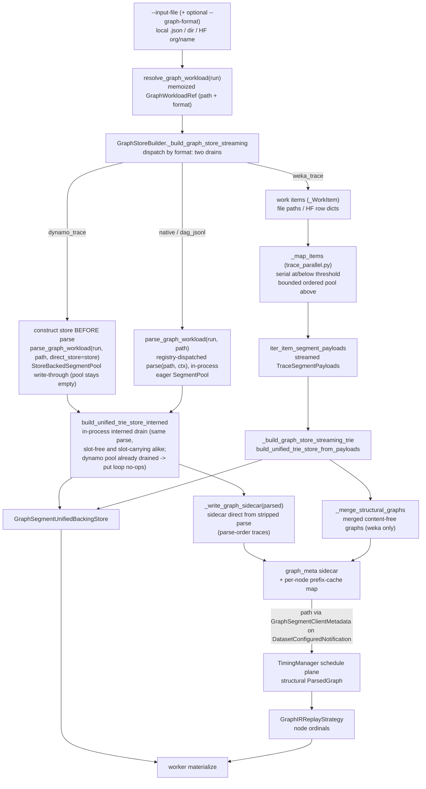

<!--
SPDX-FileCopyrightText: Copyright (c) 2025-2026 NVIDIA CORPORATION & AFFILIATES. All rights reserved.
SPDX-License-Identifier: Apache-2.0
-->

# Graph Ingest and Build Pipeline (Internal Reference)

Internal reference for the graph workload path (weka, dynamo, native, and
dag_jsonl): how a local JSON file, a local directory of JSON files, or a
HuggingFace corpus id becomes a `ParsedGraph`, how the segment-trie IR is
persisted into runtime stores, and how the DatasetManager, TimingManager, and
workers agree on node addressing.

This page is build/runtime plumbing, not user-facing CLI guidance. Related
references:

- [Graph Structural Sidecar Handoff](./graph-structural-handoff.md)
- [Graph Segment Unified Store](./graph-segment-unified-store.md)

## Pipeline summary



The Weka path has two coupled contracts:

1. **Graph/topology contract:** every weka source — a local `.json` file, a
   directory of `.json` files, or a weka-marked HuggingFace `org/name` id —
   becomes an iterator of work items feeding ONE dispatch (`_map_items` in
   `trace_parallel.py`). The build plane streams store payloads through
   `stream_weka_trace_segment_payloads` and writes the mandatory structural
   sidecar; the schedule plane loads that sidecar from the exact path the
   graph-typed `DatasetConfiguredNotification` advertised and never re-parses
   (a missing or unloadable sidecar is a hard configure-time failure). Every
   build route resolves the same run-derived synthesis knobs into ONE
   `GraphParseContext` (`resolve_graph_parse_context(run)`); the weka entry
   functions thread them into each per-item parse via `_resolve_parse_kwargs`,
   so the in-process parse and every spawn-started pool worker derive the same
   `ParsedGraph` topology and node ordinals.
2. **Payload contract:** build persists each node's request body materialization
   data into mmap-backed stores; workers later materialize by
   `(trace_id, node_ordinal, phase_variant)`.

## Workload detection and parser seam

Entry points live in `src/aiperf/dataset/graph/workload_detect.py`.

### Detection: one memoized resolution per process

- `resolve_graph_workload(run)` is the single graph-ness accessor every
  consumer calls (DatasetManager, TimingManager, scenario validator,
  post-processors, ...). It returns a `GraphWorkloadRef`
  (`src/aiperf/config/resolution/plan.py`) — the default dataset's input path
  (kept verbatim for HF `org/name` ids, never `.resolve()`d) plus the adapter
  format name — or `None` for a non-graph run. Detection runs AT MOST ONCE per
  process: the result is memoized on `run.resolved.graph_workload` (with a
  separate `graph_workload_resolved` marker, so "not a graph run" is
  distinguishable from "never checked"), and the config resolver chain
  (`DatasetResolver.resolve`) populates the memo eagerly in single-run mode so
  child processes inherit it through the pickled run without re-walking the
  registry. Any derivation failure degrades to `None`, exactly like the
  per-consumer sniffs this accessor replaced.
- If `--graph-format` / `FileDataset.graph_format` is set, the input is forced
  into graph mode for that adapter, including `native`.
- Without an override, detection walks registered `graph_adapter` plugins and
  excludes `native` and `dag_jsonl` (`_AUTODETECT_EXCLUDED`), so plain JSONL/YAML
  conversation datasets — and legacy `--custom-dataset-type dag_jsonl` runs — are
  not hijacked into graph mode (the `dag_jsonl` graph adapter is opt-in via
  `--graph-format dag_jsonl` only).
- `is_graph_workload_path(path)` is the path-level companion (same registry
  detection, same `native`/`dag_jsonl` exclusion) for callers that have no run.
- The schedule plane composes its own veto on top of the accessor:
  `timing/config.py` routes the warmup and profiling phases to
  `TimingMode.GRAPH_IR` iff `resolve_graph_workload(run)` is non-`None` AND
  `_explicit_non_graph_format(run)` is `False` — a user who pinned a
  graph-incompatible `--custom-dataset-type` is never silently rerouted to the
  graph pipeline for timing purposes.

### Parse dispatch: registry-driven, one context

`parse_graph_workload(run, path)` is the shared ingest seam for in-process
graph parsing. It is a build-plane-only seam — the DatasetManager (via
`GraphStoreBuilder`) is the only production caller; the TimingManager never
parses. There is no per-format call ladder: every non-native format goes
through the adapter registry; native is decoded directly by the parser
(byte-identical to the registered `NativeGraphAdapter`).

1. publish the run's tokenizer trust/revision to the loader-preload env
   (`publish_graph_loader_tokenizer_env`);
2. read the memoized `GraphWorkloadRef` for the format name (asserting the
   passed path matches the run's own resolved input);
3. resolve every run-derived parse knob into ONE `GraphParseContext` via
   `resolve_graph_parse_context(run)`;
4. dispatch `parse_graph(path, format=fmt, ctx=ctx)` (`parser.py`), which
   short-circuits native to a direct decode and routes every non-native
   format to the selected adapter's uniform `parse(path, ctx)`;
5. run the t*/dynamic-slot gate (`_gate_dynamic_slots_vs_tstar`) uniformly on
   the parsed result (see below).

Adapter failures surface uniformly as `GraphParseError`: the parser re-wraps
adapter-specific `ValueError` subclasses with the message text preserved, so
callers need exactly one except class. A registry-dispatched
`adapter.parse(path, ctx)` is byte-identical to the run's own parse for every
format (pinned by parity tests).

`src/aiperf/dataset/graph/parser.py` provides the generic parser:

- native YAML/JSONL graph files are decoded directly, assembled, start/end edges
  are auto-injected, and `auto_derive` runs;
- non-native inputs dispatch through the graph adapter registry to
  `adapter_cls.parse(path, ctx)`; the ctx is passed opaquely and each adapter
  maps only the fields it consumes.

### `GraphParseContext`

`src/aiperf/dataset/graph/parse_context.py`. A frozen dataclass carrying every
run-config-derived knob an adapter needs to parse byte-identically to the run.
`resolve_graph_parse_context(run)` populates every field with the run's
RESOLVED value — each resolver is a pure function of the run config, so
resolving dag knobs for a weka run (and vice versa) is harmless:

| Field | Consumers | Source |
|-------|-----------|--------|
| `content_root_seed` | weka, dynamo | `resolve_graph_content_seed(run)` (`--random-seed`) |
| `content_tokenizer` | weka, dynamo | `resolve_graph_content_tokenizer(run)` |
| `tokenizer_trust_remote_code` / `tokenizer_revision` | weka, dynamo | run tokenizer config; published to the loader-preload env via `publish_ctx_tokenizer_env` (only when trust is set, so a ctx-less parse never clobbers the run path's publish) |
| `prompt_corpus` | weka, dynamo | `synthesis.corpus` / `--prompt-corpus` (default `coding`) |
| `max_osl` | weka | `synthesis.max_osl` — caps each top-level chain request's wire `max_tokens` to `min(recorded out, max_osl)`; subagent-body chains stay uncapped |
| `num_dataset_entries` | weka, dynamo | `--num-dataset-entries` — cap on distinct traces / session-trees selected (filter-then-cap) |
| `max_context_length` | weka, dynamo | `--max-context-length` — per-trace context ceiling (input+output tokens) for graph-plane selection |
| `idle_gap_cap_seconds` | weka, dynamo | `synthesis.idle_gap_cap_seconds` (tri-state, below) |
| `trajectory_start_max_ratio` | parse-time t\* gate | `--trajectory-start-max-ratio` (scenario-auto-applied when unset); `0.0` = window off |
| `default_model` | dag_jsonl | primary model name |
| `run_streaming` | dag_jsonl | resolved endpoint `stream` flag |
| `delay_cap_seconds` | dag_jsonl | legacy `inter_turn_delay_cap_seconds` |
| `endpoint_extra` | dag_jsonl | `--extra-inputs` pairs |

**Forward-only-when-set.** Adapters forward a ctx field to their entry function
ONLY when it is set, so a ctx-less parse (`parse(path)` — CLI tooling, direct
callers with no run config) stays byte-equal to the protocol-default entry, and
a partial ctx never clobbers a non-`None` entry default (dynamo's
`prompt_corpus="coding"`, dag_jsonl's `run_streaming=True`).

**Tri-state idle-gap cap.** `idle_gap_cap_seconds` distinguishes three states:
`UNSET` (module sentinel; adapter default, 60 s), a float (that cap), and an
explicit `None` (warping DISABLED — the user's
`synthesis.idle_gap_cap_seconds: null`). `resolve_graph_parse_context` never
yields `UNSET` (a run always has a resolved answer), and the weka and dynamo
adapters forward the tri-state verbatim (`is not UNSET`, not `is not None`).

The dynamo adapter has no behavior env knob left on its `parse` entry:
generation is always pinned to the recorded `output_tokens` (weka parity) and
recorded delays always replay, subject to the tri-state idle-gap cap; the only
remaining `Environment.DYNAMO.*` knob is `MAX_SUBAGENT_DEPTH` (the parent-link
chain-depth cycle guard). Seed semantics are unchanged: both
weka and dynamo pin `content_root_seed` at entry via
`resolve_effective_root_seed` (explicit seed → ambient bootstrap root seed →
per-run OS entropy), so unseeded content is internally consistent within one
run and distinct unseeded runs deliberately differ.

### t*/dynamic-slot gate

`_gate_dynamic_slots_vs_tstar(parsed, ctx.trajectory_start_max_ratio)` runs
uniformly on every `parse_graph_workload` result: a graph carrying dynamic
content slots (`graph_carries_assembly_slots` — prompt refs to LlmNode-written
channels) is rejected while the t* snapshot window is engaged
(`--trajectory-start-max-ratio > 0` — off by default; applied by
`--scenario inferencex-agentx-mvp` or explicit
`--trajectory-start-min/max-ratio` flags), because a slot producer
chopped into warmup would leave its consumer's pool value undefined.

**Explicit-zero carve-out.** The gate is skipped iff EVERY node's
`arrival_offset_us` is explicitly the int `0`; `None` (the un-stamped default
on natively authored nodes) does NOT qualify and keeps gating. All-zero offsets
make the recorded duration 0, so any sampled t* is 0 and the snapshot chop is a
structural no-op — rejecting could only ever false-positive. dag_jsonl lowering
stamps `arrival_offset_us=0` on every node, and `DagJsonlGraphAdapter.parse`
enforces that invariant at its own seam (`_assert_dag_zero_arrival_offsets`);
if dag ever emits recorded offsets, that guard raises AND the carve-out stops
matching, so the gate re-engages by construction. The carve-out is keyed on the
invariant, not on a format branch: a NATIVE graph authored with all-zero
offsets now passes too (an intentional contract delta — the t*-degeneracy
argument is identical there, so the old rejection was the same false
positive).

## Weka input forms

Implementation: `src/aiperf/dataset/graph/adapters/weka/trace.py`.

All three forms reduce to the same thing: an iterator of `_WorkItem` values
(a trace file path OR an in-memory row dict) fed to the unified dispatch in
`trace_parallel.py` — see
[Unified parse dispatch](#unified-parse-dispatch-and-seed-determinism).

### Local file

A single Weka trace is a JSON object with top-level discriminator keys including
`id`, `models`, `block_size`, `hash_id_scope`, and `requests`. Detection is a
bounded sniff: it reads roughly the first 4 KiB and only falls back to full-file
parse if the signature keys are already present. The adapter rejects foreign
objects with extra top-level keys rather than silently accepting objects that only
look Weka-like.

During parse, the adapter:

1. loads JSON with `orjson`;
2. validates into `WekaTrace`;
3. rejects an unrecognized `hash_id_scope` (anything other than `local` /
   `global`) before Pydantic turns it into a generic schema error;
4. rejects empty traces;
5. builds the segment-trie graph through `build_trie_graph`;
6. attaches one `TraceRecord(id=weka_trace.id, tags=["from-weka-trace"])`;
7. returns a `ParsedGraph` whose `segment_pool` carries the deduplicated prompt
   segments used by the build plane.

A nonexistent local path surfaces the file-read error (`FileNotFoundError`)
directly; the "did you mean a HuggingFace dataset id?" hint appears only for
weka-marked `org/name` ids (see below).

### Local directory

A directory is detected as Weka when its lexicographically first `*.json` child
matches the same local-file sniff. Parsing wraps each `*.json` child (sorted by
name) as a file work item and feeds the unified dispatch; each item parses
through the same `_parse_single_file` / `_parse_trace_dict` core used by the
single-file and HF paths.

Worker count defaults to `AIPERF_DATASET_WEKA_GRAPH_PARALLEL_WORKERS=0`, meaning
auto-size. The auto cap is controlled by
`AIPERF_DATASET_WEKA_GRAPH_PARALLEL_AUTO_MAX_WORKERS`; the switch to the
multiprocess path is controlled by
`AIPERF_DATASET_WEKA_GRAPH_PARALLEL_THRESHOLD`.

### HuggingFace corpus id

A non-existing `org/name` argument is treated as a Weka HF dataset id only when:

- it has exactly one slash and matches the repo-id shape;
- it has no graph/file suffix such as `.json`, `.jsonl`, `.yaml`, or `.yml`;
- it contains the case-insensitive marker `weka`;
- it does not already exist as a filesystem path;
- its leading path component does not exist as a local directory
  (`_looks_like_hf_dataset_id`, `return not p.parent.exists()`), so a typo'd
  relative path like `traces/weka-061526` under an existing `traces/` dir stays a
  local-path error instead of being routed to HuggingFace.

The HF path uses `datasets.load_dataset(..., streaming=True)` and never writes a
temporary JSON file. The row iterator is controlled by:

- `AIPERF_DATASET_WEKA_HF_SPLIT` (default `train`; slice syntax such as
  `train[:100]` bounds the streamed rows);
- `AIPERF_DATASET_WEKA_HF_REVISION` (optional branch/tag/SHA pin).

Each streamed row is shallow-copied to a plain dict and wrapped as a row work
item (`org/name#index` source label) for the same unified dispatch the file and
directory forms use. When an HF load fails, the error presents BOTH
interpretations (typo'd local path vs. inaccessible HF repo), because the
weka-marker heuristic can fire on a misspelled local path shaped like
`org/name`.

### Unified parse dispatch and seed determinism

Implementation: `src/aiperf/dataset/graph/adapters/weka/trace_parallel.py`.

`_map_items` is the ONE serial-or-pool dispatch every weka route funnels
through. It prefetches at most `threshold + 1` items (lazy sources are never
fully consumed up front): at or below
`AIPERF_DATASET_WEKA_GRAPH_PARALLEL_THRESHOLD` (default 8) items, every item
parses serially in-process (no pool, no codec round-trip); above it, items
stream through a bounded, ordered pool window (forkserver on Linux, spawn on
macOS; `_loader_pool_context`) via
`_run_pool_streaming` (shared-memory corpus, per-item timeout, graceful
shutdown). Pool workers parse via the shared core (`_parse_single_file` for
file items, `_parse_trace_dict` for row items) — they never re-enter the
public `from_weka_trace` dispatcher. What crosses the pool boundary depends on
the consumer: the merged consumer's workers (`_parse_item_to_msgpack`) return
msgpack (msgspec codec) `ParsedGraph` blobs, while the streaming consumer's
workers (`_parse_item_to_segment_payloads`) return plain pickled
`list[TraceSegmentPayload]`. Either way no `ParsedGraph` instance crosses the
pool boundary, side-stepping the historically broken cross-process pickling of
`ParsedGraph` instances.

The dispatch has two consumers:

- `parse_items` merges the per-item results into ONE multi-graph `ParsedGraph`
  (traces sorted by trace id, byte-deterministic across worker counts). This
  backs `from_weka_trace` — the whole-graph weka adapter API used by direct
  callers and tests (the DatasetManager's weka store build uses the streaming
  consumer below, not this one).
- `iter_item_segment_payloads` streams per-trace `TraceSegmentPayload`s. This
  backs `stream_weka_trace_segment_payloads` — the build plane serializes each
  trace's envelopes into the unified store and drops the payloads before the
  next arrive, so resident memory stays at ~one trace regardless of corpus
  size.

Both consumers pass the same `_resolve_parse_kwargs` dict, which pins the
content seed to a concrete int via `resolve_effective_root_seed`
(`shared/content.py`): an explicit `--random-seed` wins; otherwise the ambient
bootstrap-seeded manager's root seed; otherwise a fresh OS-entropy seed
(`secrets.randbits(64)`) generated once per resolution. Within ONE run the
serial path and every pool worker therefore synthesize identical bytes at any
threshold, while distinct unseeded runs deliberately differ — there is no
hardcoded fallback seed. The schedule plane never re-parses — it ingests the
structural sidecar this build wrote and broadcast — so no content bytes ever
need to agree across the build/schedule split; the only determinism that
matters is between the in-process parse and its spawn-started pool workers.

## `ParsedGraph` shape from the segment-trie builder

Implementation: the Weka-specific flatten/walk lives in
`src/aiperf/dataset/graph/adapters/weka/trie_build.py` (`build_trie_graph`).
The shared, format-agnostic trie core it calls into lives under
`src/aiperf/dataset/graph/segment_ir/` (`trie_content.py`,
`interval_order.py`, `pool.py`, `envelope.py`,
`store_builder.py`). The block-geometry, idle-gap-warp, and message-chaining
helpers now live inside `trie_content.py`. The t* / frontier snapshot chop
(`chop_trie_at_tstar` / `chop_trie_at_frontier`) has moved next to its only
consumer at `src/aiperf/timing/snapshot_chop.py`.
`weka/trie_build.py` re-exports only `ReconCallbacks` and `build_trie_graph`; the
trie primitives are imported directly from `segment_ir/` (there are no
back-compat aliases).

`build_trie_graph(trace, ...)` returns `(ParsedGraph, SegmentPool)`. The emitted
IR is intentionally small:

- one `LlmNode` per recorded normal (`type: "n"`) or streaming (`type: "s"`)
  request, including recursive subagent-inner requests;
- `StaticEdge` waits-for dependencies only;
- no `SubgraphNode`, `SpawnNode`, `AwaitNode`, reducer, channel topology, or
  chain/aux classification on the trie path;
- one top-level graph, no subgraphs;
- a `SegmentPool` containing prompt segments and assistant response segments.

### Content lineage

Every leaf request is flattened in recorded order. Its content parent is chosen
from prior requests by Weka `hash_ids` (`resolve_content_parents` in
`segment_ir/trie_content.py`, an incremental prefix-trie pass, byte-for-byte equal
to the pairwise scan but without the O(n²·m) double loop):

1. prefer the earlier request whose `hash_ids` are the longest full prefix of the
   current request;
2. tie-break full-prefix matches toward the most recent prior request;
3. if there is no full prefix, use the prior request with the longest partial LCP
   as the branch point;
4. with no overlap, the request is a fresh root.

The content parent no longer drives an incremental prompt "advance"; it now
serves two narrower roles: **role-boundary inheritance** (below) and reconstruction
statistics (LCP coverage). Timing dependency is derived independently — see
[Timing and dependency edges](#timing-and-dependency-edges).

**Per-block frozen tags.** A single global pass (`compute_asst_caps` +
`assign_block_tags`) assigns every covered block a `(role, starts_new_message)`
tag. A block's tag is **frozen at the first node that creates it** and inherited
verbatim by every later node that shares it — never relabeled or coalesced. This
is the cache-safety invariant: any two requests sharing a block-aligned prefix see
the identical role segmentation over that prefix, so they render an identical
leading message chain. Assistant caps come from the recorded `out` of the
content-parent chain; the trailing user turn is guaranteed at block-creation time
(`asst -= 1` when a node would otherwise end assistant-only).

**Message-unit emission.** `assemble_messages` groups the frozen per-block tags
into messages (a new message begins at each `starts_new_message`) and emits one
content-addressed pool entry per message via the existing
`segment_id(parent_id, role, tokens)` (blake2b-16), chained root→tip. Because tags
are frozen per trie position, a shared block prefix yields an identical
`(parent_id, role, tokens)` chain → identical segment ids → a real prefix-cache
hit. Emission is block-aligned: no partial tails, no synthesis of missing whole
blocks. A hard build-time gate (`assert_covered_isl` → `TrieISLMismatchError`) asserts each
node's reconstructed prompt equals the block-aligned **covered-count**
`min(len(hash_ids), in // block_size) * block_size` (covered-count, not
`(in // bs) * bs`, so a request storing fewer hash blocks than `in // bs` does not
abort the build).

Non-block-aligned inputs are format-normalized before the trie: dynamo records
one trailing partial-tail hash spanning the remainder
(`(n-1)*bs < input_length <= n*bs`), which its lowering DROPS — engines
cache/share full blocks only, so
a partial block is never a prefix-cache hit — while `input_length` keeps the
tail tokens. Both recorded adapters then sample the sub-block remainder from
the same trace-scoped node seed, and both pass `small_prompt_fallback=True` so
a covered-count-0 (sub-block) recorded prompt synthesizes a single sampled
user message instead of an unreplayable empty prompt. The same recording
therefore lowers identically from either format.

Each `LlmNode` receives:

- `prompt`, materialized from the message-unit segment path for in-memory graph use;
- `metadata["trie"]["prompt_segment_ids"]`, the persisted per-message id chain used
  by the worker (the sole trie metadata key; the assistant response segment is
  reachable as the assistant pool entry chained onto the prompt tip);
- the native dispatch fields: `model` and `max_tokens` from the recorded request,
  `streaming` from the request type;
- `arrival_offset_us` on the idle-gap-warped timeline.

The worker ultimately uses `prompt_segment_ids`, not predecessor channel values,
to build the request body.

The recorded `stream` override now REACHES THE WIRE per credit: weka lowering
sets `dispatch_overrides["stream"]` from the request type (`type: "s"` → `True`,
`type: "n"` → `False`) and the dynamo adapter derives it from recorded `ttft_ms`
(present → streaming). When the worker materializes a graph credit's body,
`apply_run_level_payload_options` stamps `payload["stream"]` from that recorded
value and carries it onto `RequestInfo.stream_override`, so the recorded per-node
mode WINS over the global `--streaming` flag (which is now only the fallback for
mode-less payloads and the sole control for non-graph runs). A recorded `"s"`
parent therefore streams — and emits its mid-flight first token — even without
`--streaming`, while a recorded `"n"` turn stays a single non-streaming JSON body
inside an otherwise-streaming run. `STREAMING_ONLY` result metrics
(TTFT / TTST / TTFO / ITL / ICL) are gated PER RECORD, not by the global flag:
they are computed over exactly the requests that streamed on the wire
(`RequestRecord.streamed`), counted by the visible `streamed_request_count`
aggregate. The run-level gate (`base_metrics_processor.py:50-57`) drops the whole
streaming family only when nothing can stream (global `--streaming` off AND not a
graph workload); for a graph replay the family stays enabled and each non-streamed
record is excluded individually by the hidden `streamed_request` predicate. So a
weka replay reports TTFT / ITL / ICL for its recorded `"s"` nodes even without
`--streaming`, over those nodes alone — the recorded `"n"` records are excluded
rather than reporting their full request latency as a first-token time. See
[per-request wire streaming mode](./graph-async-dataflow-runtime.md#per-request-wire-streaming-mode)
for the transport-side resolution.

### Timing and dependency edges

Timing dependency is derived independently of content ancestry, by an
**interval-order** pass over the flattened nodes (`build_interval_edges` in
`segment_ir/interval_order.py`, consuming the time-consistent `rank` from
`compute_ranks`). It replaces the older
`chain_prev` / subagent `spawner` / joined-leaf candidate set — those fields are
gone. The pass runs over ONE node set: global for weka/native/dag_jsonl, but per
SESSION-TREE for dynamo (a root plus its `parent_trajectory_id` descendants is
lowered independently, so edges stay within a tree and independent trees never
gain a cross-parent edge).

- **Rank** is a linear extension of finished-before: nodes sorted by
  `(warped_start, warped_end, node_id)`. Idle-warp monotonicity makes this a valid
  topological order of the causality DAG.
- **Edge rule:** `A → B` iff `A` finished before `B` started on the raw recorded
  clock (`A.raw_end <= B.raw_start`, i.e. `B.request.t`) **and** `rank(A) < rank(B)`. A request that
  fully finished before another fully started must precede it; anything mid-flight
  at that instant is off the hook (concurrent), so genuine racers stay parallel.
- **Async exclusion** (`_excluded_async`) drops fire-and-forget (`async_launched`)
  subtree children from the candidate set before the frontier filter, so a
  detached background agent never becomes a timing prerequisite of later work.
- **Frontier (transitive reduction):** only the maximal finished-before candidates
  are kept — a candidate `c` transitively covered by another candidate `d`
  (`c → d → B`) is dropped. So a node's edges are its immediate causes, not its
  whole ancestry. (A content parent is therefore not automatically a timing
  predecessor; it is dropped when a later cause dominates it.)
- **Binding-cause delay:** the latest-ending frontier predecessor (`max by .end`)
  carries the warped end-to-start delay; every other frontier predecessor is a
  zero-delay AND-join wait.
- **Empty frontier:** the node roots at `START` with `min_start_delay_us` equal to
  its own warped arrival offset, preserving recorded concurrency.

**Causal-overlap carve-out (start-anchored edges).** The finished-before rule
cannot express a request that BEGINS while its causal predecessor is still in
flight — a subagent spawned mid-turn, or a chain request that overlaps the
previous one. Interval-order alone would bind such a node to whatever unrelated
request happened to finish just before its start, embedding the causal parent's
concurrent server time as fake idle "think time." To fix this, the walk stamps
each node's `TrieNode.causal_parent_id` — the spawner for a subagent's first
inner request, else the previous n/s request in the same list (the dynamo
adapter stamps the same field: the previous turn in a chain, else the latest
parent-session turn at or before the child's start). After `build_interval_edges`,
`apply_start_anchors` (in `segment_ir/interval_order.py`) tests each node against
that parent: when the node's recorded start falls inside the parent's recorded
interval (`parent.raw_start <= node.raw_start < parent.raw_end`), it REPLACES the
node's interval-order edges with ONE start-anchored `StaticEdge(parent → node,
delay_after_predecessor_start_us=D)`, where `D` is the warped start-to-start gap.
At replay the successor is scheduled at the parent's DISPATCH and gated `D` later,
so recorded mid-flight concurrency tracks the parent causally instead of freezing
to the wall clock — see
[edge-gate semantics](./graph-async-dataflow-runtime.md#timing-and-t-star-behavior).
Nodes whose causal parent had already finished keep their interval-order edges
(end-anchoring is correct there by construction).

On the SemiAnalysis 062126 corpus (393 traces, 98,827 requests) the carve-out
fires for 6,981 requests: 33.7% of subagent spawns (572 of 1,697) begin while
their spawner is still in flight, and 6.5% of all requests (6,409) overlap their
chain predecessor. Before it, interval-order bound each overlapped spawn to an
unrelated earlier request whose binding end-to-start delay was p50 97% concurrent
server time (the parent's own in-flight processing) rather than real idle time.
After it, all 6,981 overlapped nodes anchor to their stamped causal parent
(verified zero mismatches).

**Post-TTFT refinement (first-token-anchored edges).** A start anchor still
overcounts when the child began after the parent's FIRST TOKEN rather than at the
parent's dispatch: the child's true "think time" starts once the parent began
streaming, not when it was sent. When the parent is a streaming request that
carries a recorded time-to-first-token (`parent.request.ttft`, in seconds — weka
lowering stamps it only for `type: "s"` requests; the dynamo adapter stamps
`ttft = ttft_ms / 1000.0`) AND the child's start falls at or after that first
token (`node.raw_start - parent.raw_start >= ttft`), `apply_start_anchors`
additionally carries `delay_after_predecessor_first_token_us = D' = max(0,
D - ttft*1e6)` on the same edge (`D` is the warped start-to-start gap). At replay
the runtime gates the child at the parent's OBSERVED first token `+ D'`,
superseding the dispatch anchor; the start anchor remains the mandatory fallback
(validator rule 55) for when the parent terminates without a first token. A
non-streaming parent (`ttft is None`) and a child that began BEFORE the parent's
first token keep the pure dispatch/start anchor.

Of the 6,981 anchored nodes on the 062126 corpus, 1,097 gain a first-token
refinement (streaming parent, child begins post-TTFT → get `D'`); 908 began
pre-TTFT (streaming parent, child starts before the first token → no refinement);
and 4,976 have a non-streaming parent (no recorded `ttft`) — the latter two groups
stay purely dispatch-anchored.

> **Post-TTFT anchoring needs the SOURCE node to stream.** `D'` is only stamped
> when the parent is a streaming request (recorded `ttft`), so in a built corpus
> every first-token edge's source node is itself `streaming=True` — the runtime
> observes that parent's first token because each graph node now dispatches per
> its own recorded `streaming` mode (a per-request override), independent of the
> global `--streaming` flag (see the
> [runtime first-token fan-out](./graph-async-dataflow-runtime.md#first-token-fan-out-post-ttft-anchoring)).
> The only degradation path is a hand-authored/degenerate graph whose first-token
> source carries `streaming=False`; the TimingManager warns once at configure time
> for exactly that case.

The per-node frontier filter is `O(candidates²)` (up to `Θ(n²)` per node for a
pathological wide fan-in); accepted deliberately (wide fan-in is rare; no synthetic
barrier/collapse node is inserted). A sweep-line optimization is a deferred
follow-up.

The idle-gap warp caps only true inactive gaps: it builds active intervals from
all flattened requests, collapses idle stretches longer than the cap, and never
cuts inside a request's `api_time` or overlapping subagent activity. This keeps
request durations and overlap relationships intact while preventing multi-hour
recorded dead air from parking warmup indefinitely.

### t* snapshot chop

`chop_trie_at_tstar(graph, t_star_us)` (in `src/aiperf/timing/snapshot_chop.py`,
next to its only consumer, not the weka trie build module) trims pre-`t*` nodes
for resume. Surviving
nodes keep their full `prompt_segment_ids` path, because pre-`t*` turns were
warmed and the server should already hold their KV. Nodes whose predecessors were
chopped are re-rooted from `START` with a t*-relative absolute offset, and input
requirements for dropped predecessor output channels are removed.

## Build plane: DatasetManager routing and `GraphStoreBuilder`

Implementation: `src/aiperf/dataset/graph/store_build.py` (the build itself),
`src/aiperf/dataset/dataset_manager.py` (thin routing), and
`src/aiperf/dataset/graph/segment_ir/store_builder.py` (the drains' store
primitives).

`DatasetManager._configure_dataset` routes a graph run
(`resolve_graph_workload(run)` non-`None`) to `_configure_graph_dataset`, whose
build seam is `_build_graph_store`: first the endpoint gate
(`workload_detect.validate_graph_endpoint_type` — the graph dispatch path emits
a chat-completions body verbatim, so a non-chat endpoint would 422 on every
request; rejected at configure time, before any store work), then
`GraphStoreBuilder(run).build(graph_path)`. `_configure_graph_workload` is the
facet-only wrapper over the same seam for direct callers.

`GraphStoreBuilder.build` owns the whole build:

1. publishes the run's tokenizer trust/revision to the loader-preload env and
   prestarts the trace-loader forkserver on the loop at a known-quiet point
   (a lazily started helper inside the offloaded parse would race its
   process-wide stdio swap against live logging);
2. resolves the mmap base path from `AIPERF_DATASET_MMAP_BASE_PATH` or the
   system temp directory;
3. reads the memoized `GraphWorkloadRef` for the format and calls
   `_build_graph_store_streaming` — the store build for every graph workload,
   which dispatches by format to one of two drains: `weka_trace` streams
   worker-pool payloads and merges their structural graphs; every other format
   (dynamo / native / dag_jsonl) parses ONCE in-process and drains that whole
   parse through the interned builder (`build_unified_trie_store_interned`),
   which persists dynamic-slot envelopes too — so slot-carrying graphs
   (live-reply dag_jsonl lineage, `@channel` native trie assembly items/capture)
   ride this route with no separate fallback;
4. both drains finalize the unified store and write their own mandatory
   structural sidecar (a catalog-divergent sidecar raises `DatasetError`; an
   unwritable path fails the build with the underlying I/O error — the run is
   unschedulable without it; a drain that completes without recording a sidecar
   path is a hard build failure);
5. derives the per-node prefix-cache map (`_build_graph_prefix_cache_by_trace`)
   from the full in-process parse (dynamo / native / dag_jsonl) or, on the weka
   payload-stream drain, from the merged structural graphs;
6. returns a `GraphStoreBuildResult` — the `GraphDatasetMetadata` facet (the
   trace universe `trace_ids` plus the per-node prefix-cache map, no
   conversations), the sidecar path, and the store base path.

`DatasetManager._configure_graph_dataset` then broadcasts
`DatasetMetadata(conversations=[], graph=...)` and a
`GraphSegmentClientMetadata` (unified-store base path, benchmark id, and the
exact sidecar path from the build result) on the
`DatasetConfiguredNotification`. There are no stub conversations, no
conversation mmap store, and no `inputs.json`: workers read the real graph
request bodies from the unified store by `(trace_id, node_ordinal)`, and the
TimingManager plans from the advertised sidecar.

### Build drains (dispatched by format)

`GraphStoreBuilder._build_graph_store_streaming` builds the unified store for
EVERY graph workload, dispatching on format to one of two drains:

- **weka** (HF corpus id, local file, or local directory): the builder
  resolves the run's parse knobs ONCE via `resolve_graph_parse_context` and
  spreads its fields (seed, tokenizer, corpus, `max_osl`, idle-gap cap — the
  tri-state cap forwards AS-IS, an explicit `None` means warping disabled)
  verbatim into `stream_weka_trace_segment_payloads`, then streams the
  worker-built `TraceSegmentPayload` values (`iter_item_segment_payloads`) into
  `_build_graph_store_streaming_trie`, so the per-item parse is parallelized and
  the parent never holds the whole corpus's real content. The rest of this
  subsection describes that payload contract.
- **dynamo / native / dag_jsonl** (dag_jsonl is opt-in via `--graph-format
  dag_jsonl`; an undetected `fmt=None` fails inside `parse_graph`'s
  own detection): the parse is a single in-process lowering (a dynamo capture
  groups its sessions into independent SESSION-TREES — a root plus its
  `parent_trajectory_id` descendants — each lowered on its own node set so
  interval-order edges stay WITHIN a tree and cross-parent edges never form;
  the live write-through store pins this route to the serial tree-by-tree
  build — the fused-parallel tree build, tuned by
  `AIPERF_DATASET_DYNAMO_GRAPH_PARALLEL_*`, engages only for direct
  callers/tooling with no `direct_store` — and dag_jsonl expands whole
  conversation trees, so the store build has no per-item decomposition to fan
  out).
  `parse_graph_workload` runs once in-process (off-loop), and that SAME parse is
  drained directly through `build_unified_trie_store_interned` — no payload
  round trip, because in-process there is no worker pool to fan out to. Every
  adapter lowers through the shared segment-trie core at parse time, so `parsed`
  carries a `segment_pool` plus per-node `prompt_segment_ids`; a pool-less parse
  raises (it is a lowering bug). **`dynamo_trace` additionally takes the DIRECT
  write-through route:** the store is constructed BEFORE the parse and threaded as
  `direct_store`, so the parse's `pool.add` calls (via `StoreBackedSegmentPool`)
  intern each segment straight into the store's `content.blob` at parse time —
  no second in-RAM `SegmentPool` copy — and the interned drain then no-ops over
  the empty returned pool. Byte-identical to the eager drain by construction. See
  [the in-process interned drain](#in-process-interned-drain-non-weka) below.

Each weka payload contains:

- `trace_id`;
- `node_ordinals`;
- profiling `NodeEnvelope` envelopes (carrying `prompt_segment_ids`);
- `(segment_id, role, content, wire_json)` segment tuples, where `wire_json` is
  the verbatim `orjson.dumps(message)` raw-JSON blob for a raw-authored segment
  (persisted byte-for-byte) and `None` for a role/content segment (the store
  derives the `{"role", "content"}` blob);
- `structural_graph`: the content-free structural `ParsedGraph` (msgpack
  bytes; `replay_outputs` and the segment pool emptied) — the weka pool emits
  one single-trace parse per payload and attaches its structural graph (and
  pool segments) to that payload. The streaming consumer merges the collected
  graphs into the corpus structural graph that feeds the sidecar and
  prefix-cache map.

`_build_graph_store_streaming_trie` drains these weka payloads into the ONE
interned unified store via `build_unified_trie_store_from_payloads` — the SAME
unified store the non-weka in-process interned drain builds. There is no legacy
per-node store lane; the unified store is the sole build output. Streaming
`put_segment` deduplicates by content-addressed segment id, keeping parent
memory bounded.

Alongside the store drain, each streamed trace's content-free structural graph
is collected and merged ONCE (`_merge_structural_graphs`, which hard-fails on an
empty or unmergeable stream); the merged graph feeds both the mandatory
`graph_meta` sidecar (`_write_graph_sidecar`) and the per-node prefix-cache map,
so weka payload-stream builds report both identically to the non-weka interned
drain.

The interned unified node envelope contains int handles, not hex segment ids:

```json
{
  "handles": [0, 1, 2],
  "dispatch_overrides": {"max_tokens": 123, "model": "...", "stream": true},
  "stream": true
}
```

See [Graph Segment Unified Store](./graph-segment-unified-store.md) for the
on-disk file layout.

Node ordinals are assigned by `trie_node_ordinals`: sort trie `LlmNode`s by
`arrival_offset_us`, tie-break by node id, and assign dense ordinals. The schedule
plane uses the same ordinal function, so `(trace_id, node_ordinal, "profiling")`
resolves to the manifest written at build time.

### In-process interned drain (non-weka)

Every non-weka format — dynamo, native, dag_jsonl — parses once in-process and
drains that SAME whole-graph parse through the interned builder, with no payload
round trip: `_build_interned_unified_store` drains the content-addressed pool
and every node's `prompt_segment_ids` manifest into the interned
`GraphSegmentUnifiedBackingStore` via `build_unified_trie_store_interned`
(resolving hex segment ids to int handles at build time), then the sidecar is
written DIRECTLY from the stripped whole parse
(`_write_graph_sidecar(parsed, ...)`), so its traces stay in PARSE order (the
weka merge reorders by id).

**Dynamo direct write-through.** For `dynamo_trace` the store is constructed
BEFORE the parse and threaded into `parse_graph_workload(..., direct_store=store)`:
the adapter hands `build_trie_ir` a `StoreBackedSegmentPool`
(`adapters/dynamo/store_backed_pool.py`) whose `add()` write-throughs each segment
into `content.blob` at parse time, so the content pool is never materialized a
second time in RAM. The returned `ParsedGraph.segment_pool` (the shim) has an
empty `_by_id`, so the subsequent `_build_interned_unified_store` put loop
no-ops over it. Byte-identical to the eager drain by construction (both intern in
`build_trie_ir`'s content-loop first-occurrence order; three-way parity
direct == eager == streaming plus the golden digest pin it). Because the store is
live before the parse, the dynamo branch's `try/except → abort() + rmtree` covers
the parse too, so a mid-parse failure leaves no partial store. Native and
dag_jsonl keep the eager `SegmentPool` → drain path (their parse can fail before
any store dir exists). See
[Dynamo direct write-through route](./graph-segment-unified-store.md#dynamo-direct-write-through-route-storebackedsegmentpool)
for the shim contract and the measured content-pool collapse.

This is also the only drain that persists dynamic-slot envelopes, so
slot-carrying graphs ride it with no separate fallback. A slot-carrying graph —
live-reply dag_jsonl lineage, or trie assembly items/capture stamped by the
native `@channel` lowering — cannot ride the weka streaming envelope
(`_trace_trie_envelopes` rejects slot metadata loudly), but it never reaches
that envelope: weka corpora carry no slots, and every non-weka format takes this
interned drain regardless of slots. `graph_carries_assembly_slots` no longer
routes the store build — it survives only as the schedule-plane t\*-gate
predicate (`workload_detect._gate_dynamic_slots_vs_tstar`). In practice most real
dag workloads carry slots (fork children inherit the parent's history including
its assistant reply, a live-reply lineage slot, so 7 of the 8 in-repo dag
fixtures carry slots; only spawn-only dag graphs are slot-free), but all of them
take the same interned drain.

`build_unified_trie_store_interned` also serves as the parity-test oracle for
the weka payload-stream drain
(`tests/unit/dataset/test_dynamo_streaming_store_parity.py` and
`tests/unit/dataset/test_dag_jsonl_streaming_store_parity.py` pin the
payload-stream store byte-for-byte against the interned build); the non-weka
route face is pinned by `tests/unit/dataset/test_nonweka_interned_route.py`.

### Store shape summary

There is no environment flag and no per-shape branch selecting the store: every
graph parse (weka, dynamo, native, dag_jsonl) lowers onto the one interned
unified store.

| Build path | Build function | Store written |
|------|-------|-------------|
| Weka payload stream (local file / dir / HF corpus id) | `build_unified_trie_store_from_payloads` | `GraphSegmentUnifiedBackingStore` (interned, A2, drained from worker-streamed payloads). See [unified store](./graph-segment-unified-store.md). |
| In-process interned drain (dynamo, native, dag_jsonl — one whole-graph parse, slot-free and slot-carrying alike; dynamo additionally write-throughs via `StoreBackedSegmentPool`, no second RAM pool copy) | `build_unified_trie_store_interned` | `GraphSegmentUnifiedBackingStore` (same store, drained from the whole-graph parse — the only drain that persists dynamic-slot envelopes). |

The worker opens that one unified store; there is no other store shape.

## Worker materialization

Implementation: `src/aiperf/workers/worker.py` (store selection / error handling);
the `materialize_graph_request_unified` / `..._bytes` helpers live in
`src/aiperf/graph/worker_materialize.py` and are called from the worker.

Workers resolve the store from the same `(base_path, benchmark_id)` used by
DatasetManager.

`_graph_unified_reader` tries to open one `GraphSegmentUnifiedClient` for the run's
`benchmark_id` on the first credit and reuses the result (success or failure) for
the rest of the run.

- `_graph_store_reader` returns that `GraphSegmentUnifiedClient`, or `None` after
  caching a fatal `GraphStoreUnavailable` on the credit when the store is
  absent or rejected. There is no legacy fallback.
- The one `GraphSegmentUnifiedClient` carries both the addressing face
  (`get_node_envelope`) and the content face (`materialize_handles` /
  `build_request_body_handles`); there is no separate segment-content store.

Materialization then branches (both paths read the unified store):

1. **Unified interned bytes path:** when cache busting is disabled
   (`endpoint.cache_bust == CacheBustTarget.NONE`) and the node carries no dynamic
   `items`, workers build the pre-serialized request body once from the unified
   store's mmap content-pool slices via `materialize_graph_request_unified_bytes`.
2. **Unified interned dict path:** otherwise workers materialize a `messages` dict
   via `materialize_graph_request_unified` (composing dynamic slots from the worker
   pool when present), apply run-level payload options and cache-bust markers, then
   send it.

A failed store open becomes an explicit `GraphStoreUnavailable` (folding in
the A2-strict rejection reason when the store existed but was rejected); a missing
node manifest becomes `GraphEnvelopeMissing` with trace, instance, ordinal, and phase
variant in the message.

## Structural handoff and trie caveat

The structural sidecar mechanism is documented in
[Graph Structural Sidecar Handoff](./graph-structural-handoff.md).

The sidecar is **mandatory** and written on both routes via
`_write_graph_sidecar`. For the non-weka in-process interned drain (dynamo,
native, dag_jsonl), the SAME real-content parse that built the store is stripped
to a content-free structural graph (`_write_graph_sidecar` → `strip_replay_text`)
and written to `graph_meta.msgpack` DIRECTLY — so its traces stay in parse order.
Trie ordinals are rebuilt via `flat_trie_ordinals` (keyed on the graph
topology), so the sidecar catalog matches the store; a structural catalog that
diverges from the store's build catalog raises `DatasetError` and fails the run
(a divergent sidecar would describe a DIFFERENT topology than the envelopes the
worker reads).

The weka payload-stream build writes the same mandatory sidecar from a
**merged** structural graph: each streamed trace's content-free structural graph
is collected and merged once (`_merge_structural_graphs`, which raises
`DatasetError` on an empty or unmergeable stream), then written after the same
catalog cross-check. The merged structural graph also supplies the per-node
prefix-cache map.

The TimingManager never re-parses: it ingests the sidecar from the exact path
the graph-typed `DatasetConfiguredNotification` advertised. A broadcast that is
not graph-typed, or whose advertised sidecar is missing, undecodable, or
index-divergent, is a hard `InvalidStateError` at configure time — no re-parse,
no env-convention path re-derivation.

## Environment knobs

All variables are under the `AIPERF_DATASET_` prefix unless noted.

| Variable | Default | Pipeline effect |
|----------|---------|-----------------|
| `MMAP_BASE_PATH` | `None` | Base directory for the unified store (`aiperf_graph_segments_<benchmark_id>`) and the graph-meta sidecar (`aiperf_graph_meta_<benchmark_id>`). Falls back to system temp. Must be visible to DatasetManager and workers. |
| `WEKA_GRAPH_PARALLEL_THRESHOLD` | `8` | Work-item count (local trace files or HF rows) above which every weka route switches from serial in-process parsing to the multiprocess pool. `0` forces pool for any non-empty corpus. |
| `WEKA_GRAPH_PARALLEL_WORKERS` | `0` | Parse worker count. `0` auto-sizes from CPU count, item count, and auto max. |
| `WEKA_GRAPH_PARALLEL_AUTO_MAX_WORKERS` | `16` | Upper bound for auto worker sizing. |
| `WEKA_GRAPH_PARALLEL_PREFETCH_MULTIPLIER` | `16` | Ordered pool submit-window multiplier; bounds in-flight items to `workers * multiplier`. The window must cover the rows remaining behind the single heaviest trace, or fast workers stall head-of-line while it drains; the default `16` yields a `256`-row window at the auto 16 workers, covering the 393-row corpus whose heaviest row sits at index 140. Measured on that corpus: ~7.3 GiB parent VmHWM (~17.5 GiB tree) at `16` vs ~2.8 GiB parent at `4`. |
| `WEKA_GRAPH_PARALLEL_ITEM_TIMEOUT_SECONDS` | `600.0` | Per-item bound on one pool result. A worker killed mid-parse (OOM kill / external SIGKILL) otherwise presents as a silent indefinite hang; on expiry the parse raises a `RuntimeError` naming that cause. |
| `WEKA_HF_SPLIT` | `train` | HF split or slice syntax for Weka repo-id input; a slice such as `train[:100]` bounds the streamed rows. |
| `WEKA_HF_REVISION` | `None` | Optional HF revision pin for reproducible streamed ingest. |

The former dataset flags that selected alternate trie store shapes (the
segment-trie IR gate, the mmap segment-store toggle, the unified-store toggle, and
the cross-run cache) were retired: the interned unified store is the sole
build path for every graph shape, and there is no cross-run cache.

Run config synthesis fields also affect Weka parsing even though they are not
`Environment` fields — they reach every parse route through the ONE
`GraphParseContext` resolved by `resolve_graph_parse_context(run)`:

- `synthesis.idle_gap_cap_seconds` / `--synthesis-idle-gap-cap`: per-trace idle
  gap cap; default `60.0`, `null` disables warping.
- `synthesis.max_osl` / `--synthesis-max-osl`: caps each top-level chain
  request's `dispatch_overrides["max_tokens"]` to `min(recorded out, max_osl)`;
  subagent-body chains stay uncapped. `None` (default) leaves the recorded
  `out` uncapped.
- `synthesis.corpus` / `--prompt-corpus`: prompt corpus for content synthesis;
  default `coding`, with `sonnet` selecting the legacy Shakespeare pool.
- run random seed: pinned to a concrete int in the parent by
  `resolve_effective_root_seed` before any parse — explicit `--random-seed`
  first, else the ambient bootstrap-seeded root seed, else a fresh OS-entropy
  seed (`secrets.randbits(64)`) generated once per resolution. One run's serial
  and pool-worker parses synthesize identical bytes at any threshold; distinct
  unseeded runs deliberately differ (no hardcoded fallback seed). The schedule
  plane never re-parses — it ingests the structural sidecar this build wrote and
  broadcast — so content bytes never need to cross the build/schedule split; the
  only synthesis determinism that matters is between the in-process parse and
  its spawn-started pool workers. The dynamo adapter resolves the identical
  ladder at `from_dynamo_trace` entry, so dynamo content synthesis follows the
  same seed semantics.

## Corpus-scale memory measurement

The build-plane RAM cost at corpus scale (order 1M dynamo nodes) is sized by an
opt-in, `@pytest.mark.slow` measurement isolate rather than a committed
multi-GB fixture:

- `tests/harness/dynamo_synth_corpus.py` (`write_synthetic_dynamo_capture`)
  emits a deterministic, chain-heavy `dynamo.request.trace.v1` capture: each
  turn re-lists its full prefix plus `new_blocks_per_turn` fresh globally-unique
  64-bit hashes, so `input_sequence_hashes` grows every turn (the hash-id-slot
  amplification real captures show) while `input_length` stays block-consistent
  with the covered-count ISL gate.
- `tests/unit/dataset/graph/adapters/test_dynamo_corpus_scale_memory.py` runs a
  real `from_dynamo_trace` under `tracemalloc` (corpus pre-warmed outside the
  traced region), attributes the peak-window snapshot by allocation-site
  filename into four tiers, and linearly extrapolates each to 1M nodes:
  **hash-id ints/lists** (`dynamo/trace_reader.py` + `dynamo/trie_lowering.py`),
  the **decode cache** (`adapters/shared/content.py`), the **resolution-trie**
  transient (`segment_ir/trie_content.py`, measured in its own phase isolate
  because it is freed before emission), and the **content pool**
  (`segment_ir/pool.py`). The budget is a calibrated RATIO (measured peak within
  1.5x an analytic per-tier model derived from the generator parameters), never
  an absolute-bytes gate; peak RSS is logged, never asserted.

Run it (deselected by default) and, for a manual corpus-scale run, override the
node count following the `AIPERF_TEST_WEKA_CORPUS_DIR` precedent:

```bash
uv run pytest -m slow \
  tests/unit/dataset/graph/adapters/test_dynamo_corpus_scale_memory.py -s
AIPERF_TEST_DYNAMO_SCALE_NODES=200000 uv run pytest -m slow \
  tests/unit/dataset/graph/adapters/test_dynamo_corpus_scale_memory.py -s
```

The measured tier table (recorded in the test's module docstring) is the go/no-go
instrument for the trie-memory reduction work: the hash-id-int tier is the
dominant residue at ~1M-node scale, followed by the decode cache, the
resolution-trie transient, and the content pool.

### Dynamo decode-cache mechanics

`dynamo_recon_callbacks` (`adapters/dynamo/trie_lowering.py`) keeps a PRIVATE
per-parse decode cache (the shared synthesizer's `pg._cache` is keyed by bare
hash id, so mixing dynamo's 16-token blocks with weka's 64-token blocks in it
would return wrong-sized blocks across adapters). That cache stores one `int`
corpus **offset** per unique hash id — not the decoded token list — via
`CorpusContentSynthesizer._decode_block_tokens_offset_cached`
(`adapters/shared/content.py`): a cache miss issues the identical
`reseed_for_hash_id(h)` + `randrange(corpus_size)` pair the list-cache decoder
would (a full per-hash reseed, so the start offset is a pure function of
`(seed, scope, hash_id, corpus_size)`), and every decode re-slices the block
from the shared corpus window. This shrinks the decode-cache tier from
`~block_size` ints per entry to one int per entry (measured at 1M-node
extrapolation: isolate 9.0 to 4.4 GB, full-parse window 5.5 to 0.9 GB) at a
measured ~2% full-parse CPU cost, byte-identical
by construction and pinned by a differential test plus the golden store-digest.
The cached offsets assume the corpus is immutable for the synthesizer's
lifetime (the `attach_shared_corpus` byte-identical-rebind contract); a
size-changing rebind fails loud. The weka path is untouched — it calls
`_decode_block_tokens` (the list cache) directly.

### Dynamo hash-id interning

Dynamo records the FULL prompt block-hash list on every `request_end`, so a
chain re-lists each earlier block on every later turn. `_collect_records`
(`adapters/dynamo/trace.py`) is the single point where the streaming reader
is fully drained into memory before lowering — every recorded
`input_sequence_hashes` slot across the whole capture is simultaneously live (the
"record-window plateau") before a single `TrieRequest` exists. As each record is
kept, `_intern_replay_hashes` rewrites its hash list in place through a per-parse
`dict[int, int]` intern table, so every re-listed occurrence of a hash VALUE
across all turns and sessions shares ONE canonical `int` object instead of a
fresh ~36 B `orjson` allocation. The `list()` copy in `dynamo_trie_nodes`
preserves that shared identity into `TrieRequest.hash_ids`, so the canonical
objects persist through resolution and the content loop. This collapses the
recorded hash-id-int tier from one int per re-listed slot to one per unique value
(measured ~149.0 → ~42.7 MB at the corpus-scale isolate; ~24.8 → ~7.1 GB @1M),
leaving only the per-slot list pointers on the total-slot count.

The change is values-only: the table is keyed and probed by `==`, no value ever
changes, and every downstream consumer of the hashes is value-semantic, so the
store `content`/`nodes` bytes, the envelope `prompt_segment_ids`, and the
`graph_meta` sidecar are all byte-identical (the golden store digest and the
three-way direct/eager/streaming parity gate this). The intern table is a
per-parse local — born before the read loop, dropped when collection returns,
never module state and never crossing parses. Negative ids never enter it:
recorded hashes are validated non-negative at read time and the virtual negative
ids are minted later at lowering, so `hash(-1) == hash(-2)` is at most an extra
bucket probe, never a value collision. The weka path is untouched — its records
never flow through `_collect_records`.

### Dynamo sid-string interning

Each node's `prompt_segment_ids` re-lists its whole message chain root→tip, so a
`segment_id` hexdigest (`segment_ir/pool.py`) born once at a segment's first
occurrence is re-minted as a fresh 32-char str on every later re-listing — ~246k
duplicate strings for only ~17,850 unique segments at the corpus-scale isolate,
retained for the whole `ParsedGraph` lifetime on BOTH dynamo routes. `SegmentPool`
already stores exactly one canonical `Segment` (hence one canonical `Segment.id`
string) per unique value, so the fix reuses that as the intern table: the eager
route builds an `InterningSegmentPool` whose `add*` returns `self._by_id[sid].id`
(the first-born canonical), and the direct write-through `StoreBackedSegmentPool`
keeps a handle-indexed `_sids` list (dense `put_segment` insertion indexes) and
returns `_sids[handle]` on a repeat. Both live in
`adapters/dynamo/store_backed_pool.py` (the dynamo pool shims). This collapses the
sid-string addressing tier to one str per unique segment (measured ~19.7 → ~3.0 MB
`pool.py` eager / ~18.0 → ~1.3 MB direct at the isolate; ~3.0 → ~0.5 GB @1M), the
direct `_sids` pointer list adding ~0.2 MB (~24 MB @1M).

The change is values-only — interning shares string OBJECTS, never changes VALUES.
`put_segment` receives identical sid/role/content in identical first-occurrence
order (the intern happens on `add`'s RETURN, after the store/pool write), so the
`content`/`nodes` store bytes are byte-identical and the golden digest passes
without re-pinning; the envelope serializes `prompt_segment_ids` by value
(`orjson.dumps`), and `strip_replay_text` empties `metadata["trie"]` and swaps in a
fresh `SegmentPool` before the sidecar is encoded, so equal-valued strings encode
identically regardless of identity. The eager subclass depends on `Segment.id`
being the first-born string (stable while `pool.py` is frozen); the direct shim's
defensive fall-through degrades to a fresh value-correct sid if the store was
pre-populated (never in production). Weka is out of scope — its per-worker payload
stream can't share a per-parse intern table, and it constructs plain `SegmentPool`s.

## Operational invariants

- Weka `hash_id_scope` must be `local` (per-trace hash namespace: equal hash ids
  across traces synthesize different bytes) or `global` (one hash namespace
  shared across all traces: equal hash ids synthesize byte-identical blocks,
  reproducing recorded cross-trace KV sharing); any other value is rejected
  with `WekaHashScopeError`.
- Graph dispatch emits chat-completions request bodies verbatim; non-chat endpoint
  types are rejected before store build.
- Build and schedule must derive node ordinals from the same parsed graph shape;
  trie ordinals are dense per trace and sorted by `(arrival_offset_us, node_id)`.
- Trie prompt bytes are addressed through interned int handles, not through
  predecessor channel contents.
- The interned unified store is the sole build output for every graph shape
  (weka — file, directory, or HF id — via the worker-pool payload stream;
  dynamo, native, and dag_jsonl — slot-free and slot-carrying alike — via the
  in-process interned drain of one whole-graph parse); the legacy per-node store
  was removed. There is no cross-run graph cache.
- Timing edges are interval-order (`A → B` iff `A` finished-before `B` and
  `rank(A) < rank(B)`), reduced to the finished-before frontier, over the pass's
  node set — global for weka/native/dag_jsonl, but per SESSION-TREE for dynamo
  (each root + `parent_trajectory_id` descendants is lowered independently, so
  independent trees never gain a cross-parent edge). The one carve-out
  is `apply_start_anchors`: a node whose recorded start overlaps its stamped
  `causal_parent_id` interval has that frontier replaced by a single start-anchored
  edge, optionally REFINED with a `delay_after_predecessor_first_token_us` when the
  parent streamed and the child began post-TTFT. There is still no `spawner` /
  `chain_prev` / joined-leaf CANDIDATE SET feeding the base rule; `causal_parent_id`
  is a single hint consumed only by the overlap carve-out.
- Post-TTFT anchoring is inert only when the SOURCE node is non-streaming: the
  refinement is built into the IR unconditionally, and the runtime observes a first
  token whenever the worker parses that parent's SSE stream. Each graph node
  dispatches per its own recorded `streaming` mode (a per-request override), so a
  recorded-streaming source is anchored regardless of the global `--streaming`
  flag — the flag is only the fallback for mode-less payloads and non-graph runs.
  Only a first-token edge whose source carries `streaming=False` silently degrades
  its refined children to their start anchor; the TimingManager warns once at
  configure time for exactly that case.
- A block's `(role, starts_new_message)` tag is frozen at its first creator and
  inherited verbatim; two requests sharing a block-aligned prefix render an
  identical leading message-id chain (never relabeled or coalesced).
- Reconstructed prompt length equals the block-aligned covered-count
  `min(len(hash_ids), in // block_size) * block_size`; a mismatch is a hard build
  abort (`TrieISLMismatchError`).

## Validation boundary

The offline unit and component tests
(`tests/unit/graph/test_weka_trie_interval_order.py`,
`tests/component_integration/graph/test_weka_trace_fidelity.py`) assert the
**structural** invariants: interval-order edge topology, frozen per-block tags,
shared-prefix identical message-id chains, boundary preservation, and the
block-aligned covered-count ISL gate. These are provable in-process because they
are properties of the reconstructed IR, not of any server.

The **end-to-end cache-hit claim** — that a shared block prefix actually produces
a KV prefix-cache hit — is provable only against a real prefix-caching inference
engine (vLLM, SGLang, or a real Dynamo deployment). AIPerf's own mock server is
throughput-only: it has no KV cache or prefix-cache simulation, so it can neither
confirm nor refute the cache-hit claim. The weka trie path is **synthesize-only**
(it reconstructs faithful request bodies from the recorded blocks); it does not
emit a `hash_replay` dispatch. Block-hash replay against a KV simulator is a
Dynamo-path concern (validated against `dynamo-mocker`) and is out of scope for
the weka path regardless of its declared `hash_id_scope`.

## Key symbols

| Symbol | Location |
|--------|----------|
| `resolve_graph_workload` / `is_graph_workload_path` / `parse_graph_workload` / `resolve_graph_parse_context` / `validate_graph_endpoint_type` / `_gate_dynamic_slots_vs_tstar` | `src/aiperf/dataset/graph/workload_detect.py` |
| `GraphParseContext` / `UNSET` / `publish_ctx_tokenizer_env` | `src/aiperf/dataset/graph/parse_context.py` |
| `GraphWorkloadRef` | `src/aiperf/config/resolution/plan.py` |
| `GraphAdapterProtocol` | `src/aiperf/dataset/graph/adapters/protocols.py` |
| `parse_graph` / `GraphParseError` | `src/aiperf/dataset/graph/parser.py` |
| `WekaTraceAdapter` / `from_weka_trace` | `src/aiperf/dataset/graph/adapters/weka/trace.py` |
| `stream_weka_trace_segment_payloads` | `src/aiperf/dataset/graph/adapters/weka/trace.py` |
| `DynamoTraceAdapter` / `from_dynamo_trace` | `src/aiperf/dataset/graph/adapters/dynamo/trace.py` |
| `_WorkItem` / `file_work_items` / `row_work_items` | `src/aiperf/dataset/graph/adapters/weka/trace_parallel.py` |
| `_map_items` / `parse_items` / `iter_item_segment_payloads` | `src/aiperf/dataset/graph/adapters/weka/trace_parallel.py` |
| `resolve_effective_root_seed` | `src/aiperf/dataset/graph/adapters/shared/content.py` |
| `build_trie_graph` (Weka flatten/walk) | `src/aiperf/dataset/graph/adapters/weka/trie_build.py` |
| `build_trie_ir` / `resolve_content_parents` / `compute_asst_caps` / `assign_block_tags` / `assemble_messages` / `assert_covered_isl` / `TrieISLMismatchError` | `src/aiperf/dataset/graph/segment_ir/trie_content.py` |
| `compute_ranks` / `build_interval_edges` / `apply_start_anchors` / `_excluded_async` | `src/aiperf/dataset/graph/segment_ir/interval_order.py` |
| `apply_idle_gap_warp` / `ActiveIdleWarp` / `compute_turn_block_geometry` / `block_role_split` / `add_message_chain` | `src/aiperf/dataset/graph/segment_ir/trie_content.py` |
| `chop_trie_at_tstar` | `src/aiperf/timing/snapshot_chop.py` |
| `Segment` / `SegmentPool` / `segment_id` | `src/aiperf/dataset/graph/segment_ir/pool.py` |
| `DatasetManager._configure_graph_dataset` / `_configure_graph_workload` / `_build_graph_store` | `src/aiperf/dataset/dataset_manager.py` |
| `GraphStoreBuilder` / `GraphStoreBuildResult` | `src/aiperf/dataset/graph/store_build.py` |
| `GraphStoreBuilder._build_graph_store_streaming` / `_build_graph_store_streaming_trie` / `_build_interned_unified_store` / `_write_graph_sidecar` | `src/aiperf/dataset/graph/store_build.py` |
| `GraphStoreBuilder._merge_structural_graphs` / `_build_graph_prefix_cache_by_trace` | `src/aiperf/dataset/graph/store_build.py` |
| `trie_node_ordinals` / `flat_trie_ordinals` / `TraceSegmentPayload` / `iter_trace_segment_payloads` / `graph_carries_assembly_slots` | `src/aiperf/dataset/graph/segment_ir/store_builder.py` |
| `build_unified_trie_store_interned` / `build_unified_trie_store_from_payloads` | `src/aiperf/dataset/graph/segment_ir/store_builder.py` |
| `TimingManager._load_graph_sidecar` / `_sidecar_passes_index_check` | `src/aiperf/timing/manager.py` |
| `GraphSegmentClientMetadata` / `GraphDatasetMetadata` | `src/aiperf/common/models/dataset_models.py` |
| `Worker._graph_unified_reader` / `Worker._graph_store_reader` | `src/aiperf/workers/worker.py` |
