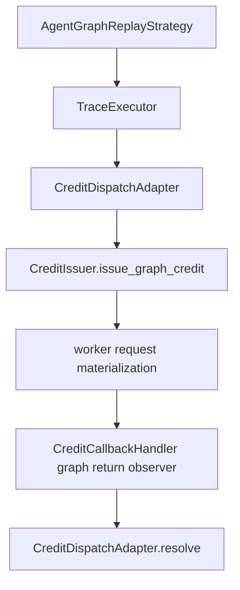
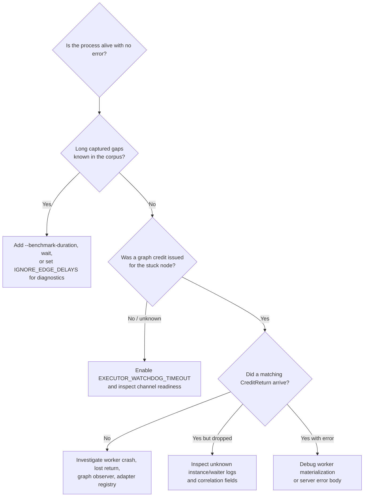

<!--
SPDX-FileCopyrightText: Copyright (c) 2025-2026 NVIDIA CORPORATION & AFFILIATES. All rights reserved.
SPDX-License-Identifier: Apache-2.0
-->

# Graph Runtime Troubleshooting

Symptom-to-action runbook for the AIPerf graph v1 runtime used by dynamo trace graph replay.

This page focuses on runtime stalls and dropped-return diagnostics in the path:



For the architecture view, see
[AIPerf Graph Async Dataflow Runtime Architecture](./graph-async-dataflow-runtime.md).

## First classify the stall

| Symptom | Most likely layer | First action |
| --- | --- | --- |
| No new requests for a long time, but no error; corpus has captured idle time | Faithful idle-gap replay | Check whether the run has `--benchmark-duration`; see [Idle gaps](#idle-gaps). |
| No credit appears to have been issued for the stuck node | Executor pre-dispatch channel readiness | Enable `AIPERF_GRAPH_EXECUTOR_WATCHDOG_TIMEOUT`; see [Pre-dispatch deadlocks](#pre-dispatch-deadlocks). |
| A credit was issued, but the awaiting node eventually raises `TimeoutError` | Adapter waiter did not receive a matching return | Inspect graph return routing and worker health; see [Dispatch timeout](#dispatch-timeout). |
| Logs mention `unknown waiter key` or `unknown instance_id` | Late, duplicate, or unrouted return | Decide whether it is benign after cancellation or a routing bug; see [Unknown return or waiter](#unknown-return-or-waiter). |
| Worker returns an error for a graph credit, or materialized prompt/body is missing | Worker materialization / graph store / ordinal path | Verify `trace_id`, `node_ordinal`, and mmap stores; see [Worker materialization failure](#worker-materialization-failure). |

## Idle gaps

### Symptom

The run appears idle for seconds or minutes with no new console output. There is no traceback, and the process is still alive.

Typical cases:

- Graph replay is running without `--benchmark-duration`.
- The input corpus has non-zero `min_start_delay_us`, `delay_after_predecessor_us`, or `delay_after_predecessor_start_us` values.
- `AgentGraphReplayStrategy` logs a notice like: the replay corpus parks up to `Ns` between turns and no `--benchmark-duration` is set.

Note that these parks are not necessarily idle time in the original capture. `--trace-idle-gap-cap-seconds` collapses only stretches where the *whole* trace was idle, so a `delay_after_predecessor_us` that spans a concurrent long-running recorded request is busy in the recording and is deliberately left uncapped. Reaching for a smaller idle-gap cap will not shorten those.

### Why it happens

`TraceExecutor` faithfully honors recorded graph timing. Edge and node delay gates are not runtime-clamped. In count/session/bare graph runs, the phase can therefore span the slowest admitted trace's recorded wall time.

This is expected behavior, not by itself a deadlock.

`AIPERF_GRAPH_DISPATCH_TIMEOUT` does not bound idle gaps. It starts only after a node reaches `CreditDispatchAdapter.dispatch()` and a graph credit is issued or deferred.

### Actions

1. If you want a wall-clock bound, rerun with `--benchmark-duration <seconds>`. When the duration budget elapses, in-flight executors are cancelled and already returned records are kept.
2. If you are doing a diagnostic speed run and do not care about faithful inter-turn timing, set `AIPERF_GRAPH_IGNORE_EDGE_DELAYS=1` to collapse recorded edge and node delays globally.
3. Do not set a short `AIPERF_GRAPH_EXECUTOR_WATCHDOG_TIMEOUT` merely to shorten legitimate idle gaps. The watchdog wraps the whole executor run and can convert a faithful long wait into a failure.
4. If the process must be stopped, Ctrl+C should finalize and export partial results rather than waiting for every parked idle node to fire.

## Pre-dispatch deadlocks

### Symptom

A trace never reaches the worker for one or more nodes. There is no `CreditDispatchAdapter` timeout because no graph credit was issued for the stuck node.

Typical causes:

- A `ChannelRequirement` can never be satisfied.
- Producer accounting is wrong for an AND-fan-in channel.
- A producer that terminated without writing its output channel did not advance the AND-fan-in count (`mark_producer_done` miscount).
- A graph shape has a liveness bug where every candidate entry waits on another node's output.

### Why it happens

The executor waits for channel readiness before dispatching an LLM/tool request. `AIPERF_GRAPH_DISPATCH_TIMEOUT` only protects the post-dispatch Future bridge. A node stuck in `VersionedChannelStore.await_inputs()` has no parked adapter Future to time out.

### Actions

1. Reproduce with a generous executor watchdog:

   ```bash
   AIPERF_GRAPH_EXECUTOR_WATCHDOG_TIMEOUT=600 \
     aiperf ...
   ```

   Use a value comfortably above legitimate recorded idle gaps for the corpus.
2. If the watchdog raises `TimeoutError`, inspect the graph around the last scheduled node frontier:
   - declared `inputs` on the blocked node,
   - the AND-fan-in count each channel requires vs. the number of live producers that will ever write it,
   - producers that exit without writing (a contained `GraphDispatchError` still marks output channels done; verify that path).
3. Keep `AIPERF_GRAPH_DISPATCH_TIMEOUT` unchanged while debugging this class. Raising or lowering it will not affect a pre-dispatch wedge.
4. For CI regression tests, enable the watchdog with a short timeout on intentionally wedged test graphs. Leave the production default unset to preserve faithful unbounded idle-gap replay unless the run already has a duration budget.

## Dispatch timeout

### Symptom

A node reaches the adapter, `issue_graph_credit()` is called, but the awaiting dispatch raises `asyncio.TimeoutError` after `AIPERF_GRAPH_DISPATCH_TIMEOUT`.

### Why it happens

`CreditDispatchAdapter.dispatch()`:

1. resolves the runtime node to a build-time `node_ordinal`,
2. mints a correlation key from `x_correlation_id` and `turn_index`,
3. parks an `asyncio.Future`,
4. issues a graph credit through `CreditIssuer.issue_graph_credit()`,
5. waits for `CreditCallbackHandler`'s unconditional graph-return observer to route the matching return back to `resolve()`.

A timeout means the parked Future did not receive a matching return in time.

### Actions

1. Determine whether the credit was actually placed on the wire.
   - If `issue_graph_credit()` refused because the stop gate, duration, request-count cap, or prefill acquisition blocked it, the adapter should raise `GraphDispatchError` promptly, not wait for the full dispatch timeout.
   - If it timed out, treat it as an issued-or-deferred credit whose matching return was not observed.
2. Check worker-side logs for request failure, crash, or lost return.
3. Check callback routing:
   - `CreditCallbackHandler` must have a graph return observer installed before credits are sent.
   - The returned `credit.trace_id` must match a live `AgentGraphReplayStrategy` adapter registry key.
   - The returned `(credit.x_correlation_id, credit.turn_index)` must match a parked adapter waiter.
4. Search logs for related messages:
   - `graph return for unknown instance_id=... dropped`
   - `graph return for unknown waiter key ... dropped` (DEBUG level — requires verbose logging)
   - `graph dispatch errored: ...`
   - `graph dispatch cancelled by worker return`
5. Raise `AIPERF_GRAPH_DISPATCH_TIMEOUT` only when a single valid request can legitimately exceed the default timeout, for example very large prefill plus long generation. Do not use it to mask dropped returns.

## Unknown return or waiter

### Symptom

Logs mention one of these return-routing diagnostics:

```text
graph return for unknown instance_id=... dropped: no live adapter is registered
```

or:

```text
graph return for unknown waiter key (...) dropped
```

### Meaning

`unknown instance_id` is logged by `AgentGraphReplayStrategy._on_graph_return()`. The callback handler delivered a graph credit return, but the strategy had no live adapter registered under `credit.trace_id`.

`unknown waiter key` is logged by `CreditDispatchAdapter.resolve()`. The adapter was found, but the exact `(x_correlation_id, turn_index)` waiter was absent.

### When it is benign

A small number of unknown waiter logs can be expected after cancellation or timeout:

- the adapter removes orphaned waiters when a dispatch times out or is cancelled;
- a late worker return can arrive after that cleanup;
- an already resolved or duplicate return is dropped.

### When it is actionable

Treat the message as a bug if it coincides with dispatch timeouts, missing records, or a phase that fails to drain.

Actions:

1. For `unknown instance_id`, verify adapter lifetime:
   - `credit.trace_id` should be the per-instance id `{template}::{nonce}`, for example `t-1::3f2a9c1b`.
   - The strategy should register the adapter before `TraceExecutor.run()` and keep it until the parent is done and no in-flight waiters remain.
   - The adapter is retained until its instance's executor finishes AND no in-flight waiters remain (`inflight_count == 0`); a return arriving after that reap finds no adapter.
2. For `unknown waiter key`, verify correlation uniqueness and return fidelity:
   - `x_correlation_id` is `{conversation_id}::{uuid4().hex}`, minted lazily once per SCOPE per adapter instance (the scope comes from the `{scope}:{turn}` split of the node id). It carries no node id and no phase variant, and every turn of one trajectory shares it.
   - `turn_index` is the node's own recorded 0-based turn coordinate from that same `{scope}:{turn}` node id (catalog `node_ordinal` for author-chosen bare ids), not a counter. Key uniqueness comes from the executor firing each node at most once per instance run, guarded by the duplicate-waiter `RuntimeError`.
   - Worker returns must preserve both fields exactly.
3. If the log appears immediately after phase teardown, verify no old observer remains registered into a new phase. `AgentGraphReplayStrategy.teardown_phase()` should detach the observer and clear retained adapters.
4. If the return carries the wrong `trace_id`, distinguish base trace id from instance id. The worker strips the `::{nonce}` suffix when looking up graph-store content, but the credit return router must preserve the full instance id for adapter de-mux.

## Worker materialization failure

### Symptom

A graph credit reaches the worker, but the worker cannot rebuild the request body or returns an error for that graph node. The adapter converts non-overflow worker errors into `GraphDispatchError`; context-overflow errors are treated as a clean early trajectory termination.

Related diagnostics can include:

```text
no node_ordinal for trace=... key=...; credit will carry node_ordinal=None
```

or a worker-side error referencing a missing graph-store envelope, missing segment content, an unknown ordinal, or an unexpected phase variant.

### Why it happens

Worker-side graph request materialization is addressed by graph metadata on the credit:

- `credit.trace_id`: the per-instance id used for return routing; graph-store lookup uses the base template trace id after recycle suffix stripping.
- `credit.node_ordinal`: build-time ordinal for the fired node.
- `credit.phase`: `warmup` or `profiling`.

For segment-trie replay, the worker reconstructs the prompt/body from the unified segment store rather than from `node.output` in the executor. If the ordinal or phase variant is wrong, or the mmap stores are missing/stale, materialization fails before a useful model response can be produced.

### Actions

1. Check adapter ordinal resolution warnings; node ids resolve directly against the per-trace catalog.
2. If `node_ordinal=None` appears, inspect the build-time catalog for the base trace and the bare node id. A credit with `node_ordinal=None` is unlikely to materialize into the intended request.
3. Confirm the worker can open the graph store for the current benchmark id:
   - the interned unified segment store (`aiperf_graph_segments_<benchmark_id>`), which every graph build writes and the worker opens at exactly the location the graph-typed dataset broadcast advertised (`GraphSegmentClientMetadata.store_base_path` + `meta.benchmark_id`). The worker never re-derives the path from env.
   - The BUILD side chooses that location from `AIPERF_DATASET_MMAP_BASE_PATH` (or the system temp dir); in distributed runs that path must be on a filesystem shared with all workers, since they open the advertised path verbatim.
4. Confirm phase variant:
   - WARMUP applies the warmup output-token cap during materialization.
   - PROFILING sends the recorded payload as-is.
5. If the error body is a context length / maximum context / `context_length_exceeded` style error, the adapter classifies it as context overflow and terminates the trajectory cleanly instead of continuing to dispatch later turns that would also overflow.
6. If materialization succeeds but downstream nodes still fail, remember that recorded LLM `node.output` is intentionally a placeholder in the executor. Downstream prompt content comes from the recorded unified-store content-pool handles (or, for slot-carrying nodes, the worker-local dynamic pool), not the live LLM output channel.

## `did not carry GraphSegmentClientMetadata` / `graph_meta sidecar missing at ...` / `failed the unified-store index cross-check`

Graph runs hard-fail at timing configure time if the structural sidecar is
not loadable — the DatasetManager broadcasts the store and sidecar locations
on the graph-typed `DatasetConfiguredNotification`, and the TimingManager and
workers use those exact paths (nothing re-parses the workload and nothing
re-derives paths from env conventions).

- **Not graph-typed:** the broadcast carried no `GraphSegmentClientMetadata`
  for a graph run — a build-plane bug or a version-skewed DatasetManager;
  check the DatasetManager logs for the `graph_meta sidecar written:` line.
- **Missing:** the advertised path does not exist on this service's
  filesystem. In multi-host or containerized deployments, point
  `AIPERF_DATASET_MMAP_BASE_PATH` at a filesystem shared by the
  DatasetManager, the TimingManager, and all workers.
- **Unreadable:** a truncated or foreign file at the sidecar path — remove
  the `aiperf_graph_meta_<benchmark_id>/` directory and re-run.
- **Index cross-check failure:** the sidecar topology no longer matches the
  unified store's manifests (stale artifacts from an earlier build under the
  same benchmark id). Remove both `aiperf_graph_meta_<id>/` and
  `aiperf_graph_segments_<id>/` and re-run.

## Graph credit slot and completion checks

Graph credits intentionally bypass linear session-slot lifecycle accounting:

- `CreditIssuer.issue_graph_credit()` does not acquire a session slot.
- It still acquires a prefill slot per request.
- `CreditCallbackHandler._release_slots_for_return()` does not release a session slot for graph credits.
- `CreditCounter` does not let graph credits trip `is_final_credit`; graph phase completion is owned by `AgentGraphReplayStrategy`.

Actions when diagnosing apparent phase deadlocks:

1. Do not look for a final graph credit to set linear completion. The strategy calls `mark_graph_sending_complete()` after executor admission/drain or duration cancellation.
2. If no credits were issued, the strategy sets the graph returned event directly.
3. If credits were issued, the callback handler increments returned counts and signals all-returned once every issued-and-not-cancelled graph credit has returned.
4. Session-slot underflow or session-slot leaks usually indicate a graph credit accidentally went through a non-graph path or lost its `trace_id`.

## Useful knobs

Defaults and constraints are in the generated
[Environment Variables](../environment-variables.md) reference; the tables below
carry only when to reach for each knob and what it will not fix.

### Runtime knobs

| Knob | Use when | Caution |
| --- | --- | --- |
| `AIPERF_GRAPH_DISPATCH_TIMEOUT` | Bound a node after it issued/deferred a graph credit and is waiting for a return. | Does not detect pre-dispatch channel deadlocks or shorten idle gaps. |
| `AIPERF_GRAPH_EXECUTOR_WATCHDOG_TIMEOUT` | Convert executor frontier deadlocks into `TimeoutError`. | Set generously; it wraps the whole executor run and can trip on legitimate long replay gaps. |
| `AIPERF_GRAPH_IGNORE_EDGE_DELAYS` | Collapse graph edge and node timing for diagnostic/stress runs. | Not faithful to recorded trace timing. |
| `AIPERF_GRAPH_IDLE_GAP_NO_DURATION_WARN_SECONDS` | Tune the no-duration long-park advisory threshold. | Advisory only; does not change replay timing. Compared against the effective park (recorded delay / `--replay-speedup`). |
| `--trajectory-start-min-ratio` (config) | Lower bound for per-trace t-star sampling. | Window off by default (full replay). Unset resolves to `0.0`/`1.0` (the full trace) on AGENTIC_REPLAY instead — the same pair `--scenario inferencex-agentx-mvp` pins (AgentX, the branch-orchestrator replay path, is a separate feature from Agent Graph). |
| `--trajectory-start-max-ratio` (config) | Upper bound for per-trace t-star sampling. | Must be greater than or equal to min ratio; `0.0` keeps the window off (full replay). Any value `>0.0` also auto-injects the graph WARMUP phase — see [Enabling the t-star snapshot warmup](./graph-async-dataflow-runtime.md#enabling-the-t-star-snapshot-warmup). |
| `--random-seed` (config) | Reproduce or sweep t-star snapshot selection. | The SAME seed drives synthesized content, so one seed reproduces the whole run. |
| `--burst-phase-starts` (config) | Collapse phase-start leading offsets so initial WARMUP/PROFILING frontier fires immediately. | Inter-turn delays after the first are still honored. |
| `AIPERF_GRAPH_WARMUP_MAX_OUTPUT_TOKENS` | Adjust warmup request generation cap. | Applies to WARMUP boundary turns, not PROFILING. |

### Dataset and materialization knobs

| Knob | Use when |
| --- | --- |
| `AIPERF_DATASET_MMAP_BASE_PATH` | Put mmap artifacts (the interned unified store and the graph-meta sidecar) on a shared filesystem for multi-process or distributed workers. |
| `AIPERF_DATASET_DYNAMO_GRAPH_PARALLEL_WORKERS` | Force a specific dynamo graph parse worker count (`0` auto-sizes). |
| `AIPERF_DATASET_DYNAMO_GRAPH_PARALLEL_THRESHOLD` | Session-tree count at/below which the build stays serial and in-process. |

The interned unified store is the sole trie build path, chosen by graph
structure, and each run builds its stores fresh in its own benchmark directory.

### CLI-level bounds

| Option | Use when |
| --- | --- |
| `--benchmark-duration <seconds>` | Bound faithful idle-gap replay by wall time and cancel in-flight executors at the duration stop condition. |
| `--concurrency <N>` | Set graph lane fan-out / trace admission pressure. |
| `--num-conversations <N>` | Cap total admitted root graph instances. |
| `--request-count <N>` | Cap issued node requests through the graph issue gate. |
| Ctrl+C | Finalize and export partial results when a no-duration idle-gap run is intentionally stopped. |

## Log messages and next steps

| Message fragment | Interpretation | Next step |
| --- | --- | --- |
| `replay corpus parks up to <N>s between turns` | Faithful replay is sleeping through recorded delays without a duration bound. The reported number is the effective park (recorded delay / `--replay-speedup`). Not necessarily idle time in the capture, so `--trace-idle-gap-cap-seconds` does not bound it. | Add `--benchmark-duration`, wait, or Ctrl+C for partial export. |
| `TimeoutError` from `TraceExecutor.run` with watchdog enabled | Pre-dispatch frontier deadlock or watchdog too low for legitimate replay time. | Inspect channel requirements and producer accounting; raise watchdog if gaps are expected. |
| `graph dispatch errored:` | Worker returned an error for an issued graph credit. | Inspect worker error body and materialization inputs. |
| `graph dispatch cancelled by worker return` | Worker reported cancellation for the request. | Check cancellation policy, duration/request-count caps, and worker cancellation logs. |
| `graph credit refused by issuer` | Stop gate, request-count cap, duration/cancel gate, or prefill acquisition refused before a return could arrive. | Treat as clean trace stop unless unexpected; inspect stop condition values. |
| `graph return for unknown waiter key` | Adapter found but specific Future was already gone or never parked. | Benign after timeout/cancel; actionable if paired with missing records or dispatch timeouts. |
| `graph return for unknown instance_id` | Return could not find a live adapter for `credit.trace_id`. | Check adapter registry lifetime (parent-done + zero in-flight reap), phase teardown, and instance id preservation. |
| `no node_ordinal for trace` | Runtime node could not be mapped to a build-time catalog ordinal. | Inspect the per-trace catalog for the base trace id and confirm the t-star snapshot rewrite preserved the fired node's id (a rewritten node id will miss the catalog and yield `node_ordinal=None`). |

## Quick decision tree


