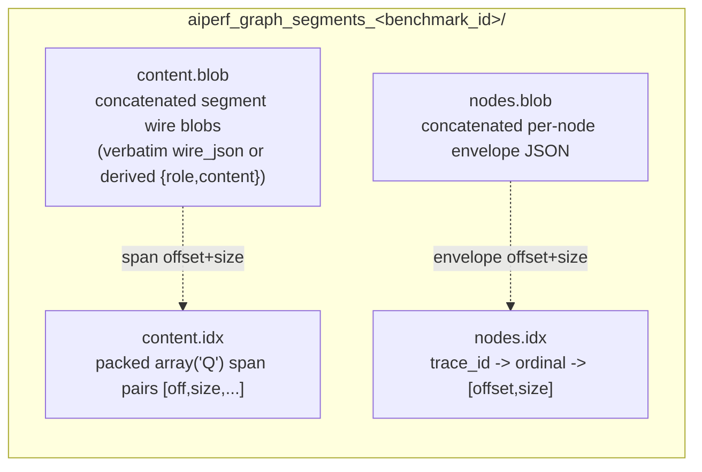

<!--
SPDX-FileCopyrightText: Copyright (c) 2025-2026 NVIDIA CORPORATION & AFFILIATES. All rights reserved.
SPDX-License-Identifier: Apache-2.0
-->

# Graph Segment Unified Store (Internal Reference)

Internal developer reference for the **unified segment store**, the sole on-disk
store shape for segment-trie graph builds. It
describes build-path mechanics that are not user-facing. The implementation is
the write-side `GraphSegmentUnifiedBackingStore` plus the read-side
`GraphSegmentUnifiedClient`.

## What it is

A graph build persists everything a worker needs to reconstruct a node's
request into ONE directory. It is the only graph store shape, and every graph
parse lowers onto it.

The unified store folds content and per-node addressing into ONE directory so a
worker opens a single client that carries **both** faces (the envelope
addressing face `get_node_envelope` and the interned content face
`materialize_handles` / `build_request_body_handles`).
`GraphSegmentUnifiedClient` is the ONE object the worker resolves via
`Worker._graph_store_reader` and hands to the worker materialization functions
(e.g. `materialize_graph_request_unified`).

## On-disk layout

The store lives in a directory named
`aiperf_graph_segments_<benchmark_id>/` (distinct from the graph-meta sidecar's
`aiperf_graph_meta_<benchmark_id>/`) and holds four files:



- **`content.blob`** — every unique segment's wire blob serialized once,
  concatenated back-to-back. A raw-authored segment (one carrying
  `Segment.wire_json`, e.g. a verbatim recorded message) persists its
  `wire_json` VERBATIM — key order and extra keys preserved byte-for-byte;
  only `wire_json`-less segments derive the normalized
  `orjson.dumps({"role": ..., "content": ...})` blob (see
  `GraphSegmentUnifiedBackingStore.put_segment`). Each blob is streamed
  straight to this file at `put` time (the incremental spill, below), so the
  encoded content is never accumulated in a RAM `bytearray`; the on-disk bytes
  and their order are identical to an accumulate-then-flush build.
- **`content.idx`** — the index INTO `content.blob`, a raw `array('Q')` of
  64-bit unsigned integers laid out as `[off0, size0, off1, size1, ...]`, one
  span pair per segment handle. The `i`-th segment drained into the pool gets
  handle `i`.
- **`nodes.blob`** — every node's envelope, concatenated. Each envelope is
  `{"handles": [...], "dispatch_overrides": {...}, "stream": ...}` plus the
  optional dynamic-content keys `items` / `capture` for slot-carrying corpora,
  the optional `endpoint_extra_applied: True` marker (set when the adapter
  already folded the run's `--extra-inputs` into `dispatch_overrides` at parse,
  telling the worker NOT to re-merge `endpoint.extra` — the adapter-owned values
  win), and the optional `extra_headers` map (per-node HTTP headers, e.g. dynamo's
  `x-dynamo-*` session identity) the worker attaches to the request HEADERS
  via the synthetic `Turn.extra_headers` — never the body. The stored values
  are the RECORDED session ids; at dispatch the worker suffixes
  `x-dynamo-session-id` / `x-dynamo-parent-session-id` with the credit's
  phase variant and trace-instance suffix
  (`uniquify_dynamo_session_headers`, e.g.
  for a trace instance `t-1::ab12`, `sess-X` → `sess-X::profiling-ab12`) so concurrent replay instances of one
  trace open distinct server-side sessions — parent/child linkage within an
  instance is preserved by applying the same suffix to both headers, and
  `x-dynamo-session-final` is forwarded untouched (each instance closes only
  its own session). Optional keys are omitted when unset, so envelopes for
  corpora without them stay byte-identical.
- **`nodes.idx`** — an `orjson` map `trace_id -> "<ordinal>" -> [offset, size]`
  locating each node's envelope in `nodes.blob`. The inner key is the node
  ordinal rendered as a string (`str(node_ordinal)`).

Blobs are `mmap`ed read-only (`ACCESS_READ`) so all workers share one physical
copy; a zero-length blob maps to `None` rather than an empty mmap.

## Interned packed-handle format (A2-strict)

The store is **interned only**: segments are addressed by their
**insertion-index int handle** (not by hex segment id), and `content.idx` is the
raw packed `array('Q')` span table described above — mmap-friendly with no JSON
parse. Node envelopes carry an int `handles` list, and the worker materializes
messages through the int-handle faces `materialize_handles(handles)` /
`build_request_body_handles(handles, ...)`.

The reader is A2-strict: `GraphSegmentUnifiedClient._load_content_idx` peeks the
first byte of `content.idx` and accepts only the packed form. A JSON
(hex-composition) index — which begins with `b"{"` — is rejected loudly with a
`ValueError` (`"legacy non-interned unified store (pre-v3) ...; re-parse
required"`). Recovering from that shape means re-parsing the workload.

The build-time writer `GraphSegmentUnifiedBackingStore` always emits the packed
`content.idx` (its `finalize` writes the flat `array('Q')`); it takes no
`interned` argument. The hex->handle map (`_ids`) lives ONLY in the writer at
build time and never reaches disk or workers.

## When the unified store is written

The unified store is the sole graph store shape, and both build drains produce
it byte-identically.
[Graph Ingest and Build Pipeline](./graph-ingest-build-pipeline.md#build-drains)
owns the drain-selection rule and what each drain sources its structural graph
from; only the store-side differences matter here:

- The **payload-stream drain** calls `build_unified_trie_store_from_payloads`.
  Each per-row worker serializes its own trace's envelopes, so the parent never
  decodes a full `ParsedGraph` only to re-serialize the same content; streaming
  `put_segment` dedup on the content-addressed id bounds parent RAM at corpus
  scale.
- The **in-process interned drain** calls `build_unified_trie_store_interned`
  over one whole-graph parse, with no payload round trip. It is the only drain
  that persists dynamic-slot envelopes (`items` / `capture`), though no shipped
  lowering stamps them.

`build_unified_trie_store_interned` is also the parity-test oracle for the
payload-stream drain: `tests.unit.dataset.test_dynamo_streaming_store_parity`
pins payload-stream == interned store byte-for-byte for a dynamo capture.

## Trie-route `prompt=[]` convention

Trie-route adapters stamp an EMPTY inline prompt (`LlmNode.prompt == []`) —
`build_dynamo_llm_node` in the dynamo adapter's trie lowering is the only
producer. Prompt content lives ONLY in the run's content-addressed
`SegmentPool`, reached through the node's
`metadata["trie"]["prompt_segment_ids"]` path. The inline `prompt` field stays a
required `LlmNode` field, but on the trie route it is deliberately left empty.

The inline prompt would be dead weight here: one `{"role", "content"}` dict per
prompt message per node — O(sum of path lengths) across the graph, held for the
entire store build — while the deduplicated `SegmentPool` already holds the
content once. Nothing on the trie route reads `node.prompt`:

- The store build drains only the segment pool plus the per-node trie envelope
  (`prompt_segment_ids`, the first-class dispatch fields, `stream`, the optional
  `extra_headers`, and the optional `endpoint_extra_applied: True` marker).
- The `graph_meta` sidecar strip (`strip_replay_text`) forces `prompt=[]` for
  trie graphs — the strip is conditional on `segment_pool is not None`, so a
  non-trie graph keeps its inline prompts.
- The worker materializes prompts from the mmap segment store, not the node.

Consumers reach content two ways. Build and worker plane: walk
`metadata["trie"]["prompt_segment_ids"]` against the store / `SegmentPool`.
In-process debugging: read the path with `read_prompt_segment_ids(node)` and,
once it is confirmed non-`None` (it returns `list[str] | None`, while
`SegmentPool.materialize` takes a `list[str]`), pass it to
`segment_pool.materialize(path)`. New trie-route consumers MUST go through the
segment path; reading `node.prompt` on a trie graph yields `[]`.

**Invariant.** The persisted store bytes are a function of `(segment pool, trie
envelope)` only — never the inline `node.prompt`. This is pinned by
`tests.unit.dataset.test_dynamo_streaming_store_parity::test_store_bytes_independent_of_inline_prompt`,
which builds byte-identical stores through both the eager and streaming drains
from a real-content parse and a sentinel-prompt copy.

## Incremental content spill

`put_segment` writes each segment's wire blob straight to an open
`content.blob` handle (opened in `__init__` for buffered binary write) and
advances a running `_content_bytes_written` counter, so the encoded content
never accumulates in a RAM `bytearray`. The span offset a segment records is
`off = self._content_bytes_written` sampled before the write, which makes the
spill a **write-side-only reshaping**: `content.blob` and the packed
`content.idx` are byte-identical to an accumulate-then-flush build, and the
read-side `GraphSegmentUnifiedClient` is unaffected.

Only `_ids` (dedup + handle resolution) and `_spans` (the `content.idx` source)
stay resident on the content side; the encoded content itself is on disk as it
is produced, so `finalize` flushes and closes the handle instead of writing a
`bytes(self._content_buf)` transient double. The handle is plain buffered
binary file I/O with NO event-loop coupling, so the store can be constructed on
the event-loop thread and drained / finalized inside `asyncio.run` on a worker
thread (`GraphStoreBuilder`'s two drains do exactly this).

`_nodes_buf` is deliberately NOT spilled: the manifest region fills only in the
drain window (below the parse peak) and stays small (~0.2–0.3 GB even at 1M
nodes), so a second write handle would add complexity for no meaningful
peak-RAM win. It remains a RAM `bytearray` flushed once at `finalize`.

**`abort()` (partial-file cleanup).** Because content is spilled as the drain
runs, a drain that raises before `finalize` would leave a half-written
`content.blob` on disk. `abort()` closes the write handle and unlinks the four
store files; it is idempotent and non-raising, and a `_finalized` guard skips
the unlink after a successful finalize so a complete store is never deleted.
`GraphStoreBuilder`'s interned and streaming drains both wrap their drain in
`try/except → unified.abort() + shutil.rmtree(data_dir) → re-raise`, so a
mid-drain failure leaves no store directory for a later open to trip on.

## Dynamo direct write-through: a supported-but-UNWIRED adapter capability

> **Not a production route.** `GraphStoreBuilder` NEVER passes `direct_store` —
> it calls `parse_graph_workload(run, graph_path)` with no adapter kwargs on
> every route. `StoreBackedSegmentPool` therefore has no
> production call site; only tests construct it. The section below documents the
> adapter capability and its parity/memory pins, not the shape of a real run.

The in-process interned drain fills the content side in TWO passes: the
adapter parses into an in-RAM `SegmentPool` (one `Segment`
per unique message segment in `_by_id`), then `build_unified_trie_store_interned`
walks that pool and `put_segment`s each segment into the store. Passing a live
`GraphSegmentUnifiedBackingStore` as `from_dynamo_trace(direct_store=...)` would
skip the second copy: the adapter then hands `build_segment_trie` a
`StoreBackedSegmentPool` instead of a plain `SegmentPool`.

`StoreBackedSegmentPool.add` computes the identical content-addressed
`segment_id(parent_id, role, tokens)` and calls `store.put_segment(sid, role,
content)` directly, so every prompt/response segment is interned STRAIGHT INTO
`content.blob` at parse time and the pool's `_by_id` stays empty. The store's
`_ids` first-occurrence dedup yields the same handle stream the eager drain
assigns — both intern in `build_segment_trie`'s content-loop first-occurrence order,
the single ordering authority — so the on-disk store is **byte-identical** to the
eager route. This is pinned three-way (direct == eager == streaming) by
`tests.unit.dataset.test_dynamo_streaming_store_parity`, by
`tests.unit.dataset.test_dynamo_direct_store_route` (the shim's own face plus
the `**adapter_kwargs` seam), and by the golden store-digest test
`tests.unit.dataset.test_dynamo_store_golden_digest`.

Because the shim's `_by_id` is empty, the returned `ParsedGraph.segment_pool`
would no-op the interned drain's put loop, and `strip_replay_text` replaces it with a
fresh empty `SegmentPool` before the content-free sidecar is msgpack-encoded (the
live shim is never encoded). `add()` is the ONLY real operation — the sole pool
call the dynamo content path makes; `add_text` / `add_raw_message` / `get` /
`materialize` all raise `NotImplementedError` naming the dynamo-only
write-through contract, so any non-dynamo adopter fails loud rather than silently
interning into a pool the store never sees. The shim lives in its own module so
the `SegmentPool` module stays a stdlib-only leaf (the store type is referenced only under
`TYPE_CHECKING`). Every production parse keeps the plain pool.

A caller that DOES thread a live store through a parse owns the pre-finalize
cleanup itself: content spills as the parse runs, so a mid-parse failure (e.g. a
`DynamoISLMismatchError` on a block-inconsistent record) needs the same
`abort() + rmtree` bracket the builder's drains apply, or it leaves a partial
store directory.

**Memory effect (measured).** The write-through empties the resident content
pool: on a corpus-scale synthetic parse the eager route holds ~17,850 live
`Segment` objects while the direct route holds **0** (measured by
`tests.unit.dataset.graph.adapters.test_dynamo_corpus_scale_memory::test_direct_route_content_tier_collapses`).
Freeing those Segments also stops pinning their `content` strings, so the
measured parse peak drops as well. It does NOT remove the per-node
segment-ADDRESSING cost (the hex `prompt_segment_ids` each node retains, allocated
by `segment_id`) — that is a distinct tier present on both routes.

## Build-memory snapshot and buffer release

`GraphSegmentUnifiedBackingStore.finalize` brackets its writes with two
build-memory concerns.

**`build_stats` (finalize ENTRY).** As its FIRST act — before any remaining
file write — `finalize` computes a `GraphStoreBuildStats` snapshot
(`_compute_build_stats`) and stashes it on `self._build_stats`. The snapshot is
a cheap `O(traces) + O(1)` derivation from state the store already holds:
`content_bytes` reads the running `_content_bytes_written` counter (the seam the
spill consumes),
`manifest_bytes` is a `len(self._nodes_buf)` read (the manifest region is not
spilled), plus one `len()` over the trace map and one `len()` per trace's inner
map — no pass over content. The counter is monotonic, so the finalize-ENTRY
snapshot still measures the full content footprint even though the blob was
streamed to disk during the write. It costs nothing yet turns a
pool/envelope-size regression into a visible build-log delta instead of mystery
RSS at corpus scale. Its counters (`segment_count`, `content_bytes`,
`node_manifest_count`, `manifest_bytes`, `trace_count`) reflect APPENDED
(write-side) totals: a duplicate `(trace, ordinal, variant)` write orphans the
earlier blob in `_nodes_buf` while `node_manifest_count` tracks live index
entries, so a future count/bytes divergence reads as that duplicate-write bug.
`peak_rss_mib` is a `RUSAGE_SELF`-only process peak (`None` on Windows; macOS
reports bytes, Linux KiB, each normalized to MiB) — it excludes pool workers and
is log-only. The `build_stats` property is `None` until `finalize` runs, and
both build-complete log lines
(`GraphStoreBuilder._build_graph_store_streaming_trie` for the payload-stream
drain, and `_build_graph_store_streaming` itself — not the logging-free
`_build_interned_unified_store` — for the in-process interned drain) render it through
the module-level `_format_store_build_stats`, which totals over `None`
(`build_stats=unavailable`) rather than crashing a pre-finalize success line.

**Write-buffer release (finalize END).** Once every file is flushed, `finalize`
drops all five write-side buffers — `_ids`, `_spans`, `_content_buf`,
`_nodes_buf`, `_node_offsets`. Post-spill the load-bearing clears are `_ids` and
`_spans` (the content-side state that survived the drain); `_content_buf` is
already empty (content spilled at `put` time) so its clear is a formality. The
store object then lives on through the structural-merge / sidecar / prefix-cache
tail with zero readers of those buffers (the snapshot was already taken at
entry), so retaining them would just pin RAM. Once they are released, the
mutating/reading writer methods (`put_segment`, `add_node_manifest`,
`segment_handle`) all guard on `self._finalized` and raise loudly if called
post-finalize; `segment_handle` in particular raises rather than silently
returning `None` (its id map is released), directing callers to read handles via
`GraphSegmentUnifiedClient` instead.

## Worker read path

The worker resolves the store from the graph-typed dataset broadcast
(`GraphSegmentClientMetadata.store_base_path` + `benchmark_id`) — never from an
env convention or a temp-dir guess — and takes the interned handle path for
whatever it opens there. It
pre-reads the node envelope once (`read_node_envelope`) and passes it into
whichever materialize function it selects, so the manifest is decoded only once
per credit. Which function it selects, and what each one does with the
envelope, is owned by
[Graph Worker Materialization](./graph-worker-materialization.md#unified-store-paths).

The store open is fail-loud: a graph credit whose unified store cannot be opened
raises a cached fatal `GraphStoreUnavailable` on every credit (see
`Worker._graph_store_reader`), and a node whose envelope is absent from an
opened store raises `GraphEnvelopeMissing`.

## Artifact lifetime and reclamation

A build writes two per-benchmark dirs under the mmap base path
(`Environment.DATASET.MMAP_BASE_PATH`, or the system temp dir when unset —
which is a RAM-backed tmpfs on many hosts): this store's
`aiperf_graph_segments_<benchmark_id>/` and the sidecar's
`aiperf_graph_meta_<benchmark_id>/`. Both are sized by the corpus — roughly
2.5 GB per hour of a single-model production trace, and 11–12 GB for the
larger ones — so leaking them across runs exhausts the device quickly. The
failure that surfaces is not a disk warning but an `OSError(28) No space left
on device` raised during dataset configuration, which names neither dir.

Reclamation has two halves, because a graph run can end two ways.

**The stop path.** `DatasetManager._cleanup` (its `@on_stop` hook) removes both
dirs. It records them in `_build_graph_store`, the shared seam that both the
production broadcast route and the facet-only callers pass through, so every
route that creates them also reclaims them. Workers hold the store open for the
whole run and are torn down before the DatasetManager stops, so nothing is
reading by then. Note that `GraphSegmentUnifiedBackingStore.abort()` does NOT
cover this: it deliberately skips the unlink once finalized, so it only ever
cleans up a build that FAILED.

**The abrupt path.** The stop path does not run when the process dies without
unwinding — the `os._exit` force-kill that ends every `cli_runner` benchmark,
a SIGKILL from the service manager, or a hard crash. Those runs orphan both
dirs with nothing left to remove them, so the next graph build sweeps them
(`aiperf.dataset.graph.artifact_gc.sweep_orphaned_graph_artifacts`, called from
`DatasetManager._claim_and_sweep_graph_artifacts`).

Ordering is load-bearing, and both halves run BEFORE `GraphStoreBuilder.build`:

1. **Claim** — create both dirs and take their owner locks. The build is what
   would otherwise create them, so claiming afterwards leaves them lock-less
   for the build's whole duration (measured at 26–70 s on single-file
   production corpora, and growing with corpus size while the grace below stays
   constant). A concurrent sweep hitting that window deletes a live store.
2. **Sweep** — reclaim dead runs' dirs. This is what frees the device *for*
   the build. Sweeping afterwards cannot prevent the mid-build `OSError(28)`
   that motivated reclamation in the first place.

An age-only sweep would not be safe: the dirs are keyed by `benchmark_id`
rather than pid, so age says nothing about whether a concurrent long-running
benchmark is still reading one. The liveness signal is an owner lock —
`.aiperf-owner.lock` inside each dir, held for the run — because the kernel
drops an `flock` when the holder dies by ANY means, including SIGKILL and
`os._exit`:

| Lock file | Acquirable? | Meaning |
|---|---|---|
| present | yes | the owning run is gone; reclaim |
| present | no (contended) | a live run owns the dir; leave it |
| absent | n/a | predates the lock convention; only here does the `ORPHAN_GRACE_SECONDS` age grace decide |

Because the claim precedes the build, a current run's dirs are never lock-less,
so the third row applies only to dirs written by a build from before this
convention existed.

**Cross-host safety (defensive only).** `flock` means nothing between observers
that do not share a kernel, so a dir reachable from two hosts could have a live
run's lock acquired by a peer and its store reclaimed underneath it.

The shipped Kubernetes deployment does **not** create that situation: volumes
are RWO, and the dataset is distributed by shipping a zstd archive from the
control plane to each worker-group manager over HTTP, which decompresses it to
**node-local** storage (`memory_map_utils` module docstring, "Flow
(Kubernetes)"). Every observer of a given path therefore shares a kernel and
`flock` is sound.

The host stamp in `.aiperf-owner.json` exists only because a user *can* still
point `MMAP_BASE_PATH` at shared storage by hand — the env var's own
description suggests it, and `timing/manager.py` suggests it for the graph
sidecar when the TimingManager and DatasetManager are split. It is cheap
insurance for a configuration the product does not itself produce, not a
mitigation for the deployment model. A dir stamped by a different host is
disqualified from liveness-based reclamation and falls back to
`FOREIGN_HOST_GRACE_SECONDS` (7 days).

### Why reconciliation rather than kernel-managed lifetime

The strongest guarantee for scratch data is to never give it a name: `O_TMPFILE`
(or create-then-`unlink`) leaves an inode the kernel frees when the last fd
closes, including on SIGKILL, so no cleanup code exists to fail. That is not
available here — workers open the store **by path** as separate processes, and
under Kubernetes a different pod entirely receives it, so an unnamed inode
cannot be reached. Passing fds instead would not survive the control-plane HTTP
hop that ships the dataset between pods.

The next option down is supervisor-managed teardown (systemd's
`RuntimeDirectory=`/`PrivateTmp=`, or a Kubernetes `emptyDir`, which kubelet
deletes with the pod). AIPerf runs as a CLI process, not a systemd unit, so
that lever is the operator's rather than ours — a pod spec putting
`MMAP_BASE_PATH` on an `emptyDir` gets exactly this property for free and should
prefer it.

That leaves startup reconciliation, which is what the sweep above implements,
and it is the same conclusion PostgreSQL reached for crash-orphaned temp files:
sweep at startup, and namespace the state so orphans are *identifiable* rather
than guessed at from age. Hence the identity stamp — boot id first (a proof),
then host, with age only as the last resort.

An OS-level sweeper is the final backstop, not a substitute: it is time-delayed
and cannot tell an orphan from a live process's file. Two are usually already
in play — most modern distributions mount `/tmp` as tmpfs, so a reboot clears
it, and `systemd-tmpfiles` ages `/tmp` at 10 days and `/var/tmp` at 30 by
default. Neither helps within a single uptime, which is where this leak bites:
50 GB accumulated across eight runs in one session here. An operator who points
`MMAP_BASE_PATH` at persistent storage has neither backstop and should add a
rule of their own:

```
# /etc/tmpfiles.d/aiperf.conf -- backstop only; AIPerf reclaims its own dirs
e /var/lib/aiperf-scratch/aiperf_graph_segments_* - - - 10d
e /var/lib/aiperf-scratch/aiperf_graph_meta_*     - - - 10d
e /var/lib/aiperf-scratch/aiperf_mmap_*           - - - 10d
```

### What this does not cover

- Reclamation is driven by the next **graph** build. A crashed run whose
  orphans are never followed by another graph benchmark keeps them; there is no
  global or startup GC.
- Only the current base path is swept. Orphans under a previously-configured
  `MMAP_BASE_PATH` are not discovered.
- On a filesystem without `flock`, liveness is unprovable and both entry points
  fail closed, so orphans there leak rather than risk a live run's store.
- The conversation mmap store (`aiperf_mmap_<benchmark_id>/`) takes no owner
  lock, so a run killed abruptly still orphans one. Its *clean* exit is covered
  — `MemoryMapDatasetBackingStore._cleanup` `rmdir`s the run dir — but the
  crash case has no equivalent of the sweep above.
- Windows uses `msvcrt` locking rather than `flock`; the release-on-kill
  behaviour the sweep depends on has not been verified there.

On a filesystem without `flock` (some NFS and FUSE mounts) liveness is
unprovable, so both entry points fail closed: nothing is reclaimed and the dir
leaks rather than risking deletion out from under a live run.

One consequence worth knowing when debugging: SIGKILL-ing the `aiperf profile`
process alone does not necessarily free the lock, because the DatasetManager
runs in its own child process and can outlive it. Until that child dies the
dir is correctly treated as in use.
