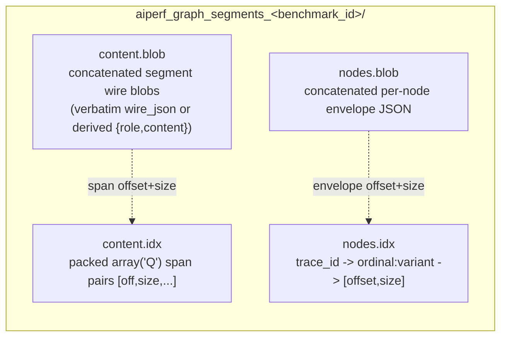

<!--
SPDX-FileCopyrightText: Copyright (c) 2025-2026 NVIDIA CORPORATION & AFFILIATES. All rights reserved.
SPDX-License-Identifier: Apache-2.0
-->

# Graph Segment Unified Store (Internal Reference)

Internal developer reference for the **unified segment store**, the sole on-disk
store shape for segment-trie graph builds (weka, dynamo, native, dag_jsonl). It
describes build-path mechanics that are not user-facing. See
`src/aiperf/dataset/graph_segment_unified_store.py` for the implementation.

## What it is

A graph build persists everything a worker needs to reconstruct a node's
request into ONE directory. Earlier revisions split this across two on-disk
stores (a separate content pool plus a per-node envelope store); those were
retired and the unified store is now the only graph store shape. Every graph
parse — weka, dynamo, native (via `lower_native_to_unified`), and dag_jsonl —
lowers onto it.

The unified store folds content and per-node addressing into ONE directory so a
worker opens a single client that carries **both** faces (the envelope
addressing face `get_node_envelope` and the interned content face
`materialize_handles` / `build_request_body_handles`).
`GraphSegmentUnifiedClient` is the ONE object the worker resolves via
`Worker._graph_store_reader` and hands to the `worker_materialize` module's
functions (e.g. `materialize_graph_request_unified`).

## On-disk layout

The store lives in a directory named
`aiperf_graph_segments_<benchmark_id>/` (distinct from the graph-meta sidecar's
`aiperf_graph_meta_<benchmark_id>/`) and holds four files:

- **`content.blob`** — every unique segment's wire blob serialized once,
  concatenated back-to-back. A raw-authored segment (one carrying
  `Segment.wire_json`, e.g. a verbatim dag_jsonl message) persists its
  `wire_json` VERBATIM — key order and extra keys preserved byte-for-byte;
  only `wire_json`-less segments derive the normalized
  `orjson.dumps({"role": ..., "content": ...})` blob (see
  `GraphSegmentUnifiedBackingStore.put_segment`). Each blob is streamed
  straight to this file at `put` time (the incremental spill, below), so the
  encoded content is never accumulated in a RAM `bytearray`; the on-disk bytes
  and their order are identical to an accumulate-then-flush build.
- **`content.idx`** — the index INTO `content.blob`, a raw `array('Q')` of
  64-bit unsigned integers laid out as `[off0, size0, off1, size1, ...]`, one
  span pair per segment handle. The `i`-th segment drained into the pool gets
  handle `i`.
- **`nodes.blob`** — every node's envelope, concatenated. Each envelope is
  `{"handles": [...], "dispatch_overrides": {...}, "stream": ...}` plus the
  optional dynamic-content keys `items` / `capture` for slot-carrying corpora
  and the optional `extra_headers` map (per-node HTTP headers, e.g. dynamo's
  `x-dynamo-*` session identity) the worker attaches to the request HEADERS
  via the synthetic `Turn.extra_headers` — never the body. The stored values
  are the RECORDED session ids; at dispatch the worker suffixes
  `x-dynamo-session-id` / `x-dynamo-parent-session-id` with the credit's
  phase variant and trace-instance suffix
  (`worker_materialize.uniquify_dynamo_session_headers`, e.g.
  `sess-X` → `sess-X#profiling.0.0`) so concurrent replay instances of one
  trace open distinct server-side sessions — parent/child linkage within an
  instance is preserved by applying the same suffix to both headers, and
  `x-dynamo-session-final` is forwarded untouched (each instance closes only
  its own session). Optional keys are omitted when unset, so envelopes for
  corpora without them stay byte-identical.
- **`nodes.idx`** — an `orjson` map `trace_id -> "<ordinal>:<variant>" ->
  [offset, size]` locating each node's envelope in `nodes.blob`. The inner key
  is the store's `"<ordinal>:<variant>"` form (`_encode_inner_key`).

Blobs are `mmap`ed read-only (`ACCESS_READ`) so all workers share one physical
copy; a zero-length blob maps to `None` rather than an empty mmap.

## Interned packed-handle format (A2-strict)

The store is **interned only**: segments are addressed by their
**insertion-index int handle** (not by hex segment id), and `content.idx` is the
raw packed `array('Q')` span table described above — mmap-friendly with no JSON
parse. Node envelopes carry an int `handles` list, and the worker materializes
messages through the int-handle faces `materialize_handles(handles)` /
`build_request_body_handles(handles, ...)`.

The reader is A2-strict: `GraphSegmentUnifiedClient._load_content_idx` peeks the
first byte of `content.idx`, and a legacy JSON (hex-composition) index — which
begins with `b"{"` — is rejected loudly with a `ValueError` (`"legacy
non-interned unified store (pre-v3) ...; re-parse required"`). There is no
runtime auto-detect between two formats and no dict/hex-id fallback inside the
unified store; an on-disk legacy shape is a re-parse, not a soft fallback.

The build-time writer `GraphSegmentUnifiedBackingStore` always emits the packed
`content.idx` (its `finalize` writes the flat `array('Q')`); it takes no
`interned` argument. The hex->handle map (`_ids`) lives ONLY in the writer at
build time and never reaches disk or workers.

## When the unified store is written

There is no environment flag gating the unified store — it is the sole graph
store shape. `GraphStoreBuilder._build_graph_store_streaming`
(`src/aiperf/dataset/graph/store_build.py`) dispatches on the workload format
to ONE of two drains; both build the SAME on-disk unified store and each writes
its own mandatory content-free `graph_meta` sidecar:

- **Weka — worker-pool payload stream (`_build_graph_store_streaming_trie`)**:
  weka sources (local file, directory, or HF corpus id) stream worker-parsed
  `TraceSegmentPayload`s into the unified store via
  `build_unified_trie_store_from_payloads`, interned. Each per-row worker
  serializes its trace's envelopes so the parent never decodes a full
  `ParsedGraph` only to re-serialize the same content; streaming `put_segment`
  dedup on the content-addressed id bounds RAM at corpus scale. Each row also
  ships a content-free structural graph, which the parent merges
  (`_merge_structural_graphs`) into the corpus structural graph that feeds BOTH
  the sidecar and the per-node prefix-cache map. `_build_graph_store_streaming`
  returns `(catalog, merged_structural)`.
- **Every other format — in-process interned drain
  (`_build_interned_unified_store`)**: dynamo, native, and dag_jsonl parse ONCE
  in-process (a whole-graph lowering — a dynamo capture lowers each session-tree
  on its own node set, with the live write-through store pinning the store build
  to the serial in-process path, and dag_jsonl expands whole trees, so the store
  build has no per-item parse to fan out) and drain that SAME parse into the interned unified store
  via `build_unified_trie_store_interned`. In-process there is no worker pool to
  fan out to, so the payload round trip is pure overhead; the interned drain is
  also the only one that persists dynamic-slot envelopes (native `@channel`
  assembly items/capture, dag_jsonl live-reply lineage), so slot-carrying graphs
  ride this route with no separate fallback. The mandatory sidecar is written
  DIRECTLY from the stripped whole parse (`_write_graph_sidecar(parsed, ...)`),
  so its traces are in PARSE order (the retired weka-style merge sorted them by
  id). `_build_graph_store_streaming` returns `(catalog, parsed)` — the full
  parse is the prefix-cache source. `build_unified_trie_store_interned` is also
  the parity-test oracle for the weka payload-stream drain
  (`tests/unit/dataset/test_dynamo_streaming_store_parity.py` and
  `tests/unit/dataset/test_dag_jsonl_streaming_store_parity.py` pin
  payload-stream == interned store byte-for-byte); the non-weka route face is
  pinned by `tests/unit/dataset/test_nonweka_interned_route.py`.

`graph_carries_assembly_slots` no longer routes the store build (every non-weka
format takes the interned drain regardless); it survives only as the
schedule-plane t\*-gate predicate (`workload_detect._gate_dynamic_slots_vs_tstar`).

## Incremental content spill

`put_segment` writes each segment's wire blob straight to an open
`content.blob` handle (opened in `__init__` for buffered binary write) and
advances a running `_content_bytes_written` counter, rather than appending to a
RAM `bytearray` and flushing the whole thing at `finalize`. The span offset a
segment records (`off = self._content_bytes_written` before the write) is
byte-for-byte the value the old `len(self._content_buf)` produced, so
`content.blob` and the packed `content.idx` are identical to the pre-spill
build — the spill is a **write-side-only reshaping** and the read-side
`GraphSegmentUnifiedClient` is untouched.

Only `_ids` (dedup + handle resolution) and `_spans` (the `content.idx` source)
stay resident on the content side; the encoded content itself is on disk as it
is produced, so `finalize` flushes and closes the handle instead of writing a
`bytes(self._content_buf)` transient double. The handle is plain buffered
binary file I/O with NO event-loop coupling, so the store can be constructed on
the event-loop thread and drained / finalized inside `asyncio.run` on a worker
thread (`GraphStoreBuilder`'s two drains do exactly this).

`_nodes_buf` is deliberately NOT spilled: the manifest region fills only in the
drain window (below the parse peak) and stays small (~0.2–0.3 GB even at 1M
nodes), so a second write handle would add complexity for no meaningful
peak-RAM win. It remains a RAM `bytearray` flushed once at `finalize`.

**`abort()` (partial-file cleanup).** Because content is spilled as the drain
runs, a drain that raises before `finalize` would leave a half-written
`content.blob` on disk. `abort()` closes the write handle and unlinks the four
store files; it is idempotent and non-raising, and a `_finalized` guard skips
the unlink after a successful finalize so a complete store is never deleted.
`GraphStoreBuilder`'s interned and streaming drains both wrap their drain in
`try/except → unified.abort() + shutil.rmtree(data_dir) → re-raise`, so a
mid-drain failure leaves no store directory for a later open to trip on.

## Dynamo direct write-through route (`StoreBackedSegmentPool`)

The in-process interned drain normally fills the content side in TWO passes: the
adapter parses into an in-RAM `SegmentPool` (`segment_ir/pool.py`, one `Segment`
per unique message segment in `_by_id`), then `build_unified_trie_store_interned`
walks that pool and `put_segment`s each segment into the store. The **dynamo
route skips the second copy**: `GraphStoreBuilder._build_graph_store_streaming`
constructs the `GraphSegmentUnifiedBackingStore` BEFORE the parse and threads it
into `from_dynamo_trace(direct_store=...)`. The adapter then hands
`build_trie_ir` a `StoreBackedSegmentPool`
(`adapters/dynamo/store_backed_pool.py`) instead of a plain `SegmentPool`.

`StoreBackedSegmentPool.add` computes the identical content-addressed
`segment_id(parent_id, role, tokens)` and calls `store.put_segment(sid, role,
content)` directly, so every prompt/response segment is interned STRAIGHT INTO
`content.blob` at parse time and the pool's `_by_id` stays empty. The store's
`_ids` first-occurrence dedup yields the same handle stream the eager drain
assigns — both intern in `build_trie_ir`'s content-loop first-occurrence order,
the single ordering authority — so the on-disk store is **byte-identical** to the
eager route. This is pinned three-way (direct == eager == streaming) by
`tests/unit/dataset/test_dynamo_streaming_store_parity.py` and by the golden
store-digest (`test_dynamo_store_golden_digest.py`).

Because the shim's `_by_id` is empty, the returned `ParsedGraph.segment_pool`
no-ops the interned drain's put loop, and `strip_replay_text` replaces it with a
fresh empty `SegmentPool` before the content-free sidecar is msgpack-encoded (the
live shim is never encoded). `add()` is the ONLY real operation — the sole pool
call the dynamo content path makes; `add_text` / `add_raw_message` / `get` /
`materialize` all raise `NotImplementedError` naming the dynamo-only
write-through contract, so any non-dynamo adopter fails loud rather than silently
interning into a pool the store never sees. The shim lives in its own module so
`pool.py` stays a stdlib-only leaf (the store type is referenced only under
`TYPE_CHECKING`). Native and dag_jsonl keep the eager pool→drain path.

Because the store is live before the parse, the dynamo branch wraps BOTH the
parse and the drain in the same `try/except → abort() + rmtree`, so a mid-parse
failure (e.g. a `DynamoISLMismatchError` on a block-inconsistent record) after
content has already spilled leaves no partial store directory.

**Memory effect (measured).** The write-through empties the resident content
pool: on a corpus-scale synthetic parse the eager route holds ~17,850 live
`Segment` objects while the direct route holds **0** (measured by
`tests/unit/dataset/graph/adapters/test_dynamo_corpus_scale_memory.py::test_direct_route_content_tier_collapses`).
Freeing those Segments also stops pinning their `content` strings, so the
measured parse peak drops as well. It does NOT remove the per-node
segment-ADDRESSING cost (the hex `prompt_segment_ids` each node retains, allocated
by `segment_id`) — that is a distinct tier present on both routes.

## Build-memory snapshot and buffer release

`GraphSegmentUnifiedBackingStore.finalize` brackets its writes with two
build-memory concerns.

**`build_stats` (finalize ENTRY).** As its FIRST act — before any remaining
file write — `finalize` computes a `GraphStoreBuildStats` snapshot
(`_compute_build_stats`) and stashes it on `self._build_stats`. The snapshot is
a cheap `O(traces) + O(1)` derivation from state the store already holds:
`content_bytes` reads the running `_content_bytes_written` counter (the seam the
`build_stats` docstring used to name as future work, now consumed by the spill),
`manifest_bytes` is a `len(self._nodes_buf)` read (the manifest region is not
spilled), plus one `len()` over the trace map and one `len()` per trace's inner
map — no pass over content. The counter is monotonic, so the finalize-ENTRY
snapshot still measures the full content footprint even though the blob was
streamed to disk during the write. It costs nothing yet turns a
pool/envelope-size regression into a visible build-log delta instead of mystery
RSS at corpus scale. Its counters (`segment_count`, `content_bytes`,
`node_manifest_count`, `manifest_bytes`, `trace_count`) reflect APPENDED
(write-side) totals: a duplicate `(trace, ordinal, variant)` write orphans the
earlier blob in `_nodes_buf` while `node_manifest_count` tracks live index
entries, so a future count/bytes divergence reads as that duplicate-write bug.
`peak_rss_mib` is a `RUSAGE_SELF`-only process peak (`None` on Windows; macOS
reports bytes, Linux KiB, each normalized to MiB) — it excludes pool workers and
is log-only. The `build_stats` property is `None` until `finalize` runs, and
both build-complete log lines
(`GraphStoreBuilder._build_graph_store_streaming_trie` for the weka
payload-stream drain and `_build_interned_unified_store` for the non-weka
in-process interned drain) render it through
the module-level `_format_store_build_stats`, which totals over `None`
(`build_stats=unavailable`) rather than crashing a pre-finalize success line.

**Write-buffer release (finalize END).** Once every file is flushed, `finalize`
drops all five write-side buffers — `_ids`, `_spans`, `_content_buf`,
`_nodes_buf`, `_node_offsets`. Post-spill the load-bearing clears are `_ids` and
`_spans` (the content-side state that survived the drain); `_content_buf` is
already empty (content spilled at `put` time) so its clear is a formality. The
store object then lives on through the structural-merge / sidecar / prefix-cache
tail with zero readers of those buffers (the snapshot was already taken at
entry), so retaining them would just pin RAM. Because the buffers are gone, the
mutating/reading writer methods (`put_segment`, `add_node_manifest`,
`segment_handle`) all guard on `self._finalized` and raise loudly if called
post-finalize; `segment_handle` in particular raises rather than silently
returning `None` (its id map is released), directing callers to read handles via
`GraphSegmentUnifiedClient` instead.

## Worker read path

The worker selects the interned handle path whenever the unified store exists on
disk for the run's `benchmark_id` (existence-based, not flag-driven). It
pre-reads the node envelope once (`read_node_envelope`) and passes it into
whichever materialize function it selects, so the manifest is decoded only once
per credit. See
[Graph Worker Materialization](./graph-worker-materialization.md) for the full
selection logic:

- `materialize_graph_request_unified` (dict path) reads the envelope and
  resolves `handles` through `materialize_handles` (or `_assemble_items` for
  slot-splice `items` programs), then applies dispatch overrides / warmup cap /
  stream. The worker then layers run-level payload options and cache-bust
  markers on the returned dict.
- `materialize_graph_request_unified_bytes` builds the pre-serialized body once
  from mmap content-pool slices via `build_request_body_handles`, folding all
  outer fields into the overrides tail. Taken only when
  `endpoint.cache_bust == CacheBustTarget.NONE` (a pre-serialized body cannot
  have a cache-bust marker prepended) AND the envelope carries no dynamic-slot
  `items` program (slot-carrying nodes always take the dict path because their
  messages are composed per-request from the dynamic pool).

There is no fallback store: a graph credit whose unified store cannot be opened
fails loudly with a cached fatal `GraphStoreUnavailable` error on every credit
(see `Worker._graph_store_reader`), and a node whose envelope is absent from an
opened store fails with `GraphEnvelopeMissing`.
