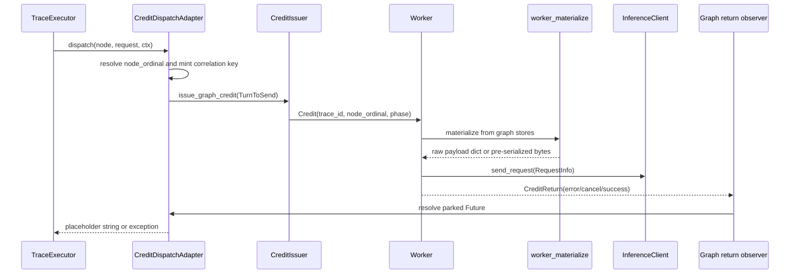

<!--
SPDX-FileCopyrightText: Copyright (c) 2025-2026 NVIDIA CORPORATION & AFFILIATES. All rights reserved.
SPDX-License-Identifier: Apache-2.0
-->

# Graph Worker Materialization Reference

Internal developer reference for how an agent-graph credit becomes an inference-server
request on a worker. This page covers the worker-side materialization path, the
runtime identities stamped by the executor bridge, phase and warmup variants,
store opening and error behavior, and how the path relates to the async
`TraceExecutor`.

## End-to-end shape

Graph replay intentionally keeps scheduling and payload reconstruction in separate
planes:

1. `TraceExecutor` fires graph nodes according to dataflow readiness and recorded
   timing.
2. `CreditDispatchAdapter.dispatch()` maps the fired node to a build-time
   `node_ordinal`, mints a correlation identity, and issues a graph `TurnToSend`
   through `CreditIssuer.issue_graph_credit()`.
3. The normal credit router delivers a `Credit` to any worker.
4. The worker detects `credit.trace_id is not None` and bypasses the linear
   sticky-session path.
5. The worker reads mmap-backed graph stores, materializes the node request, sends
   it through the normal `InferenceClient`, and returns the credit.
6. The graph return observer resolves the parked adapter `Future`, allowing the
   executor node to complete.



## Runtime identity carried by graph credits

A graph worker request is addressed by three graph fields on `TurnToSend` and
`Credit`:

| Field | Meaning | Producer | Worker use |
| --- | --- | --- | --- |
| `trace_id` | Runtime trace **instance** id, `{template}::{nonce}` — for example `t-1::3f2a...`. | `AgentGraphReplayStrategy` / `CreditDispatchAdapter` | Return de-mux key and cache-bust marker salt. The worker strips the `::{nonce}` instance suffix before reading graph stores, because stores are keyed by the base template trace id. |
| `node_ordinal` | Build-time ordinal of the graph node inside the base trace. | `CreditDispatchAdapter._resolve_ordinal()` using `CatalogContext` | Store lookup key for the node envelope. |
| `phase` | The credit's `CreditPhase` (`warmup` / `profiling`). | `CreditPhaseConfig.phase`, carried by `CreditDispatchAdapter` | Selects the warmup output-token cap during materialization. |

Other request metadata remains normal credit metadata:

- `x_correlation_id` and `turn_index` are minted by the adapter as the parked
  Future key. `x_correlation_id` is a trajectory-INSTANCE id,
  `{conversation_id}::{uuid4().hex}`, minted lazily once per SCOPE per adapter
  instance — all turns of one trajectory share it, exactly like a linear
  session. It contains no node id and no phase variant; the scope comes from the
  `{scope}:{turn}` split of the node id, and uniqueness comes from the uuid4.
  `turn_index` is not a counter: it is the node's own recorded 0-based turn
  coordinate parsed out of that same `{scope}:{turn}` node id (falling back to
  the catalog `node_ordinal` for author-chosen bare ids). Waiter-key uniqueness
  follows from the executor firing each node at most once per instance run — a
  re-fire raises the adapter's duplicate-waiter `RuntimeError` rather than
  silently sharing a waiter.
- `conversation_id` and `agent_depth` are metadata labels.
  `_conversation_identity` returns the trajectory TEMPLATE id — the base
  `trace_id` for root-scope nodes, `{trace_id}::{scope}` for `{scope}:{turn}`-shaped
  ids, which is exactly what live dynamo lowering emits (`{session_id}:{k}`). It
  is recycle-stable and is never the per-instance id (instance identity rides
  `credit.trace_id` and `x_correlation_id`). `_dag_identity` supplies the per-node
  `(agent_depth, parent_correlation_id)` pair (depth from a
  `metadata["dag"]` stamp, else `0`). These do not change the graph-store
  lookup.
- `parent_correlation_id` is carried for DAG metadata, but graph credits bypass
  the linear sticky session lifecycle.

The worker's base-store lookup is:

```python
base_trace_id = credit.trace_id.split("::", 1)[0]
```

For example, `credit.trace_id == "t-1::3f2a9c1b"` materializes from store key `"t-1"`.
The full instance id is still used for return routing and cache-bust marker
rotation.

## Materialization inputs

The worker materializer consumes a node envelope plus, for trie-style stores, a
segment store.

### Common envelope fields

All materialization paths apply the node's own outer fields after rebuilding
`messages`:

| Envelope field | Purpose |
| --- | --- |
| `dispatch_overrides` | Per-node request fields such as `model`, token caps, or provider-specific options. `max_output_tokens` is mapped to the endpoint wire token field. Other keys pass through verbatim. |
| `stream` | Recorded per-node stream flag (dynamo derives it from the recorded `ttft_ms`). Corpus provenance only — it does NOT reach the wire. `apply_run_level_payload_options` stamps wire `stream` unconditionally from the run-level `endpoint.streaming`, overwriting whatever the envelope carried. See [Wire streaming mode](./graph-async-dataflow-runtime.md#wire-streaming-mode). |
| `handles` | Interned unified-store path: ordered integer segment handles that form the full prompt. This is the only trie-store shape; build-time `prompt_segment_ids` are resolved to handles at build time and never reach the worker. |
| `items` | Dynamic-content nodes only (omitted otherwise): the ordered assembly program that interleaves static segment handles with dynamic slots filled at run time. See "Dynamic content slots". |
| `capture` | Dynamic-content producers only (omitted otherwise): `true` when this node's response is spliced into a downstream node, so the worker pools it after dispatch. |
| `extra_headers` | Recorded per-node request headers. The worker reads them through `uniquify_dynamo_session_headers()`, which suffixes any dynamo session-identity headers per replay instance so concurrent instances of one trace never share (or session-final-evict) a server session. |
| `endpoint_extra_applied` | `true` when the adapter already folded the run's `--extra-inputs` into this node's `dispatch_overrides` at parse time. The worker passes it as `skip_endpoint_extra` so the run-level `endpoint.extra` merge does not clobber the adapter-owned values. |

Both the dict and bytes paths also apply a run-level `model` fallback: when the
node carries no `dispatch_overrides["model"]` (the dynamo trace
adapter always stamps its recorded model), the run's `--model` is set into the wire body via
`setdefault`, mirroring the linear path's `turn.model or primary_model_name`.
The endpoint's `format_payload` is bypassed for graph credits, so nothing else
would add it.

### Unified store paths

The unified interned store is the SOLE graph store shape: every graph build
writes it, and the worker reads nothing else. `GraphStoreBuilder` picks between
TWO drains — see
[Graph Ingest and Build Pipeline](./graph-ingest-build-pipeline.md#build-drains)
for the selection rule. Nothing about that choice reaches the worker: both
drains build the SAME on-disk store (content pool + per-node manifests) and each
writes its own mandatory content-free `graph_meta` sidecar. The one worker-
visible difference is that only the interned drain can persist a dynamic-slot
(`items` / `capture`) envelope; the payload-stream drain writes `handles`
manifests only.

The two drains are byte-identical for slot-free graphs, pinned by
`tests.unit.dataset.test_dynamo_streaming_store_parity`. `direct_store` (the
dynamo adapter's live write-through sink) is a supported-but-UNWIRED adapter
capability: no production caller passes it -- `GraphStoreBuilder` always calls
`parse_graph_workload(run, path)` with no adapter kwargs -- so it is exercised
only by tests. `_graph_unified_reader()` attempts to open one
`GraphSegmentUnifiedClient` for the BROADCAST's `benchmark_id` (from the
graph-typed `GraphSegmentClientMetadata`, not the worker's own run id) on the
first credit; the
client carries both the addressing face (`get_node_envelope`) and the content face
(`materialize_handles` / `build_request_body_handles`). That one client is the
worker's only source of request content.

The unified store is interned-only (A2-strict): every node envelope carries an int
`handles` list. The worker materializes it through the int-handle faces:

- `materialize_graph_request_unified()` returns a `messages` dict via
  `client.materialize_handles(handles)`, for the dict path (cache busting or
  run-level options that need a mutable payload).
- `materialize_graph_request_unified_bytes()` builds the pre-serialized body once
  from mmap content-pool slices via `client.build_request_body_handles(...)`,
  taken when `endpoint.cache_bust == CacheBustTarget.NONE`.

Both only proceed when the envelope carries `handles`; a `None` return is a
genuine address miss (every interned-store envelope carries `handles`). A legacy
JSON (hex) `content.idx` on disk is rejected loudly by the reader with a
`ValueError` ("re-parse required") rather than silently falling back.

### Pre-serialized bytes path

The bytes path (`materialize_graph_request_unified_bytes`) avoids decoding and
re-encoding the `messages` array. It reads the same unified envelope, only
proceeds for nodes carrying `handles`, and builds a complete request body from
mmap slices plus an encoded override tail. Because bytes cannot be mutated after
build, the bytes path folds all outer fields into the body up front:

- mapped per-node `dispatch_overrides`,
- warmup token cap if applicable,
- the wire `stream` (stamped from the run-level `endpoint.streaming`), endpoint
  `extra`, and `stream_options.include_usage`.

It returns the `(body, model)` pair. The worker stores `body`
on `Turn.raw_payload_bytes` and discards the returned model: `Turn.model` is
deliberately left unset on both the bytes and dict paths. The recorded per-node
model rides only the wire body (sent verbatim), while `record.model_name` falls
back to the run `--model` in `_finalize_request_record`, so tokenizer selection
behaves like plain aiperf — recorded deployment ids are usually not resolvable
tokenizer repos. The wire `stream` mode is not carried per request: both paths
stamp it from the run-level `endpoint.streaming`.

The bytes path is deliberately skipped when cache busting is enabled
(`endpoint.cache_bust != CacheBustTarget.NONE`). Cache busting mutates the first
user message content, which a pre-serialized body cannot do.

## Dispatch overrides and run-level payload options

Materialization happens in two layers.

First, `worker_materialize` applies node-local fields:

- `dispatch_overrides["max_output_tokens"]` maps to `max_tokens` when
  `endpoint.use_legacy_max_tokens` is true, otherwise to
  `max_completion_tokens`.
- Other dispatch override keys pass through verbatim, including `model`,
  provider-specific fields, and the node's recorded `stream` — which the
  run-level layer below then overwrites.

Second, `Worker._process_graph_credit()` applies run-level endpoint behavior with
`apply_run_level_payload_options()` unless the bytes path already folded it into
the body:

1. `payload["stream"]` is stamped UNCONDITIONALLY from the run-level
   `endpoint.streaming`, overwriting any recorded per-node value the node's
   `dispatch_overrides` carried. Every graph credit of a run therefore uses the
   same wire mode: a recorded `"n"` turn streams inside a `--streaming` run, and
   a recorded `"s"` turn does not stream with the flag off.
2. Each `(key, value)` pair in `endpoint.extra` is merged, with the user-provided
   run-level value winning over any per-node key. This step is SKIPPED when the
   caller passes `skip_endpoint_extra=True`, which the worker does whenever the
   envelope carries `endpoint_extra_applied`: an adapter that already folded the
   run's `--extra-inputs` into the node's `dispatch_overrides` at parse time owns
   those keys, and re-merging would clobber the adapter-owned values. The
   `stream` stamp and the `include_usage` forcing are unaffected by the flag.
3. If the FINAL stamped `stream` is on and `endpoint.use_server_token_count` is
   true, `stream_options.include_usage` defaults to `True` only when that key is
   absent; an explicit existing `include_usage` value is preserved along with any
   other `stream_options` keys.

This mirrors the normal chat endpoint formatting that graph credits bypass by
sending a raw payload.

## Dynamic content slots

Recorded corpora materialize a node's prompt entirely from build-time content.
The envelope contract also reserves a **dynamic slot** form, where a node's
prompt is composed at run time from a predecessor's actual pooled response
instead of from interned content. No shipped lowering emits slots — the dynamo
adapter never does — so the machinery below is the retained read side of that
contract, exercised by its unit tests rather than by any corpus.

### Envelope `items` program

A slot-carrying node's envelope replaces `handles` with an ordered `items`
program (slot-less envelopes keep `handles` and are byte-identical to recorded
corpora). Each token is one of:

| Token | Meaning |
| --- | --- |
| `{"h": <handle>}` | A static message: the interned segment handle, materialized like the non-dynamic path. |
| `{"s": {"src": <ordinal>}}` | An array-level splice slot: the producer node's pooled reply as a single assistant message — the verbatim recorded assistant message (`tool_calls` preserved) when the capture is structured, else `{"role": "assistant", "content": text}` — or nothing when the producer failed / returned no replayable content (omission). |
| `{"m": {"role": <r>, "parts": [...]}}` | A composed message whose content concatenates `{"t": text}` static parts and `{"sv": <ordinal>}` slot texts; a failed / empty producer substitutes the empty string, so the role and static instruction survive. |

The build plane (`_resolve_assembly_items`) resolves the
lowering's producer node ids to node ordinals and hex segment ids to int
handles, so the persisted envelope carries only the worker's own keys.

An array-level `@channel` messages splice reconstructs the **full
user/assistant alternation** at the read point: the interleaved program emits
the channel's init-seed messages (the trace's `initial_state` for that channel,
interned static) first, then, for each upstream writer in completion order
(writers of one spliced channel must be totally completion-ordered or the
lowering gates), that writer's authored user turn
(static `{"h"}` handles — its "delta", its prompt minus the `@channel` it read)
followed by its reply `{"s"}` slot. So each `{"s"}` slot is preceded by its
producer's user turn, and a downstream reader sees a well-formed conversation
rather than back-to-back assistant messages. The delta handles dedup with the
producer's own prompt interning (content-addressed), so this costs no extra
store bytes.

### Worker pool and capture

The worker keeps a per-worker `GraphDynamicPool` keyed two levels deep —
`trace_id -> node_ordinal -> value`, so a whole trace entry is
the eviction unit — holding each captured response as a
structured `GraphCapturedReply` (the reply's joined text plus, for chat
`tool_calls` / structured replies, the verbatim orjson-serialized assistant
message), `FAILED`, or `EMPTY`. The pool is the graph twin of the linear
path's worker-cached `UserSession` state; content never returns to the timing
plane.

- **Capture** — after dispatching a `capture: true` node, the worker extracts
  the assembled response via `endpoint.build_assistant_turn(record)` and pools
  it: a `GraphCapturedReply` on success (a `raw_messages`-bearing Turn —
  tool_calls / structured content — also carries the verbatim assistant
  message JSON so the splice byte-matches the child-seed rendering),
  `EMPTY` for a successful response with no replayable content at all,
  `FAILED` on a dispatch error, cancellation, or extraction failure. The pool
  write lands strictly before the credit return.
- **Splice** — slot-carrying nodes always take the dict path;
  `_assemble_items` composes `messages` from the pool. A `FAILED`/`EMPTY` value
  omits (array slot) or substitutes empty text (composed part). A **missing**
  value — broken stickiness (worker death re-route) or backstop eviction — sets
  a `credit_context.error` with the `aiperf.graph.pool_missing:` prefix, which
  the adapter raises as `GraphStickinessError`; the executor treats it as a
  non-containable trace-stop (never a silent default).
- **Sticky routing** — dynamic content requires every credit of one trace
  instance to reach the same worker. Graph credits key their router session
  on `Credit.trace_id` (the instance id), so every trajectory of one
  instance shares one session/worker; linear credits keep the legacy
  `parent_correlation_id or x_correlation_id` key (a linear DAG child pins to
  its parent's worker, otherwise a credit pins to itself). The strategy closes the instance session with ONE
  explicit `GraphTraceEnd` at adapter-reap, which evicts the worker's pool
  entry (deferred while the trace still has in-flight credits).
- **Recorded dynamo identity headers** — replayed with per-instance
  uniquification (`uniquify_dynamo_session_headers`), which suffixes the
  recorded `x-dynamo-session-id` / `x-dynamo-parent-session-id` values so
  concurrent instances of one trace never share a server session.
- **Lifecycle backstop** — `AIPERF_GRAPH_DYNAMIC_POOL_MAX_BYTES`
  (default 64 MiB/worker) LRU-evicts whole trace entries; evicting a live trace
  surfaces as the loud `pool_missing` error above, never a silent truncation.
- **Consecutive-user merge** — omitting a failed producer's assistant turn can
  leave adjacent user messages, which some chat APIs reject.
  `AIPERF_GRAPH_MERGE_CONSECUTIVE_USER` (default False) merges consecutive
  user-role messages in a spliced prompt into one (contents newline-joined).

The t\* snapshot window is incompatible with dynamic slots (a producer chopped
into warmup would leave its consumer's pool value undefined); a slot workload
loaded with `--trajectory-start-max-ratio > 0` is rejected at parse
(`workload_detect._gate_dynamic_slots_vs_tstar`), the single parse seam — the
DatasetManager is the only production parser; the TimingManager ingests the
broadcast sidecar and never re-parses.

## Warmup overrides

The materializer reads the credit's `CreditPhase` directly -- there is no
separate variant label. Envelopes are stored once per node, so warmup and
profiling read the SAME bytes; only the payload treatment differs.

| Phase | Store lookup | Payload behavior |
| --- | --- | --- |
| `profiling` | The node's envelope bytes. | Use recorded messages and recorded dispatch overrides. |
| `warmup` | The same envelope bytes. | Use the same input prefix, then force a warmup output cap. |

Warmup intentionally does **not** require duplicate warmup envelopes in the
store. It applies warmup capping after per-node dispatch overrides:

```python
request.pop("max_completion_tokens", None)
request["max_tokens"] = Environment.GRAPH.WARMUP_MAX_OUTPUT_TOKENS
```

`Environment.GRAPH.WARMUP_MAX_OUTPUT_TOKENS` defaults to `1`. Warmup therefore
uses the exact profiling input prefix but forces a one-token output cap.

## Cache busting

Graph cache busting is applied after dict materialization and run-level options:

```python
stamp_cache_bust_marker(
    payload,
    benchmark_id=benchmark_id,
    trace_instance_id=trace_instance_id,
    target=target,
)
```

The marker is deterministic per `(benchmark_id, trace_instance_id)` and is
prepended to the first user message. The full runtime instance id is used, so
recycled instances of the same base trace get distinct markers. A `NONE` target is
a no-op.

Because this changes message content, cache busting forces the dict path. The
bytes path is only selected when `endpoint.cache_bust == CacheBustTarget.NONE`.

## Store opening and error modes

The worker lazily opens graph stores on the first graph credit for a benchmark.
Store paths are resolved SOLELY from the graph-typed dataset broadcast — the
`GraphSegmentClientMetadata` carried on `DatasetConfiguredNotification`:

```text
base_path    = meta.store_base_path
benchmark_id = meta.benchmark_id
```

The broadcast is the worker's only source for the store location: a graph credit
whose broadcast carried none is a recorded failure (a `GraphStoreUnavailable`
`ErrorDetails`), never a temp-dir guess. The
`Environment.DATASET.MMAP_BASE_PATH or tempfile.gettempdir()` expression exists
only BUILD-side, where the DatasetManager chooses the location it then
broadcasts.

### Store unavailable

`Worker._graph_store_reader()` resolves the unified client via
`_graph_unified_reader()` (attempted exactly once,
`_graph_unified_open_attempted`, and reused across credits). If the store is
absent or corrupt the worker:

- creates an `ErrorDetails` with type `GraphStoreUnavailable`,
- records an actionable message naming the expected store directory and mmap base
  path (folding in the A2-strict "pre-v3, re-parse required" reason when the
  store exists but was rejected),
- caches that error on the worker, and
- returns `None` so no inference request is sent.

The cached open error prevents a missing shared filesystem or bad base path from
becoming a per-credit retry loop. Content and per-node addressing both live in
the one lazily-opened `GraphSegmentUnifiedClient` returned by
`_graph_store_reader()` (which delegates to `_graph_unified_reader()`); there is
no separate segment-content reader.

### Node address miss

If a materializer returns `None` for the addressed node, the worker records a clean
`GraphEnvelopeMissing` error and sends no request. The message includes:

- base trace id,
- runtime instance id,
- node ordinal,
- phase variant.

This is distinct from a store-open failure: the store exists, but the requested
node envelope is absent.

### Materialization faults

Malformed envelope JSON, corrupt read-time mmap slices, or segment ids/handles
that cannot be resolved are treated as faults rather than graceful misses. They
should be investigated as build/store consistency bugs.

## Relationship to the executor

`TraceExecutor` does not build HTTP payloads. Its job is to execute the graph:
wait for channel inputs, honor timing gates, run node dispatch handlers, publish
node outputs, and schedule successors.

For `LlmNode` dispatches in graph replay:

1. The dispatch handler builds a `DispatchRequest` and calls the injected
   `credit_issuer.dispatch(...)`.
2. In production graph replay, that issuer is a per-instance
   `CreditDispatchAdapter`.
3. The adapter maps executor runtime identity to store identity:
   - Every live producer lowers to a flat `LlmNode` graph, so the fired node's
     bare `node_id` is its catalog key (`_resolve_ordinal`), and the runtime trace
     id is always the bare instance id.
   - The base `trace_id` keys the catalog and graph stores.
   - The instance id keys return routing and cache-bust marker scope.
4. The adapter issues one graph credit and awaits the corresponding return.
5. The worker materializes and sends the payload.
6. The graph return observer resolves the adapter Future.
7. The executor receives a placeholder string on success. Downstream LLM request
   bodies are reconstructed from the recorded unified-store content-pool handles,
   not from the live LLM output channel — the one exception being a dynamic slot
   splice (see "Dynamic content slots"), which no shipped lowering emits.

Errors propagate back through the same Future bridge:

- worker-reported errors become `GraphDispatchError`, except recognized context
  overflow, which is converted into expected early termination for the trajectory;
- cancelled returns become `GraphDispatchError`;
- refused issue attempts reject immediately rather than waiting for a return that
  will never arrive;
- a missing return is bounded by `Environment.GRAPH.DISPATCH_TIMEOUT` once the
  node has reached the adapter.

