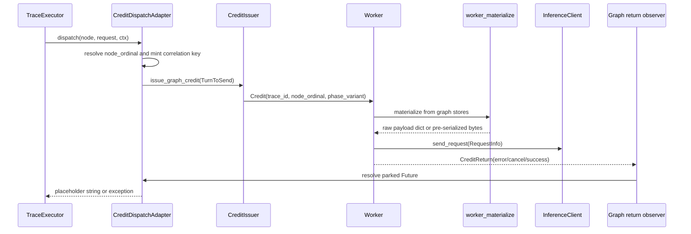

<!--
SPDX-FileCopyrightText: Copyright (c) 2025-2026 NVIDIA CORPORATION & AFFILIATES. All rights reserved.
SPDX-License-Identifier: Apache-2.0
-->

# Graph Worker Materialization Reference

Internal developer reference for how a graph-IR credit becomes an inference-server
request on a worker. This page covers the worker-side materialization path, the
runtime identities stamped by the executor bridge, phase and warmup variants,
store opening and error behavior, and how the path relates to the async
`TraceExecutor`.

Primary implementation files:

- `src/aiperf/graph/worker_materialize.py`
- `src/aiperf/workers/worker.py`
- `src/aiperf/graph/credit_dispatch_adapter.py`
- `src/aiperf/timing/strategies/graph_ir_replay.py`
- `src/aiperf/dataset/graph_segment_unified_store.py`

## End-to-end shape

Graph replay intentionally keeps scheduling and payload reconstruction in separate
planes:

1. `TraceExecutor` fires graph nodes according to dataflow readiness and recorded
   timing.
2. `CreditDispatchAdapter.dispatch()` maps the fired node to a build-time
   `node_ordinal`, mints a correlation identity, and issues a graph `TurnToSend`
   through `CreditIssuer.issue_graph_credit()`.
3. The normal credit router delivers a `Credit` to any worker.
4. The worker detects `credit.trace_id is not None` and bypasses the linear
   sticky-session path.
5. The worker reads mmap-backed graph stores, materializes the node request, sends
   it through the normal `InferenceClient`, and returns the credit.
6. The graph return observer resolves the parked adapter `Future`, allowing the
   executor node to complete.



## Runtime identity carried by graph credits

A graph worker request is addressed by three graph fields on `TurnToSend` and
`Credit`:

| Field | Meaning | Producer | Worker use |
| --- | --- | --- | --- |
| `trace_id` | Runtime trace **instance** id, for example `t-1#0.0`. | `GraphIRReplayStrategy` / `CreditDispatchAdapter` | Return de-mux key and cache-bust marker salt. The worker strips the first `#...` suffix before reading graph stores, because stores are keyed by the base template trace id. |
| `node_ordinal` | Build-time ordinal of the graph node inside the base trace. | `CreditDispatchAdapter._resolve_ordinal()` using `CatalogContext` | Store lookup key for the node envelope. |
| `phase_variant` | Graph materialization variant, currently `profiling` or `warmup`. | `GraphIRReplayStrategy._phase_variant()` | Selects profiling bytes or warmup override behavior. |

Other request metadata remains normal credit metadata:

- `x_correlation_id` and `turn_index` are minted by the adapter as the parked
  Future key. The id includes the runtime trace id, node id, and phase variant;
  `turn_index` is a per-correlation monotonic counter, so two in-flight dispatches
  of the same node never share a waiter.
- `conversation_id` and `agent_depth` are metadata labels. Every live producer
  lowers to a flat `LlmNode` graph, so `_conversation_identity` returns the bare
  instance id; `_dag_identity` supplies the per-node
  `(agent_depth, parent_correlation_id)` pair (depth from a dag_jsonl
  `metadata["dag"]` stamp, else `0`). These do not change the graph-store
  lookup.
- `parent_correlation_id` is carried for DAG metadata, but graph credits bypass
  the linear sticky session lifecycle.

The worker's base-store lookup is:

```python
base_trace_id = credit.trace_id.split("#", 1)[0]
```

For example, `credit.trace_id == "t-1#3.0"` materializes from store key `"t-1"`.
The full instance id is still used for return routing and cache-bust marker
rotation.

## Materialization inputs

The worker materializer consumes a node envelope plus, for trie-style stores, a
segment store.

### Common envelope fields

All materialization paths apply the node's own outer fields after rebuilding
`messages`:

| Envelope field | Purpose |
| --- | --- |
| `dispatch_overrides` | Per-node request fields such as `model`, token caps, or provider-specific options. `max_output_tokens` is mapped to the endpoint wire token field. Other keys pass through verbatim. |
| `stream` | Recorded per-node stream flag (weka `"s"` → `True`, `"n"` → `False`; dynamo derived from recorded `ttft_ms`). The recorded per-node mode **wins**: the worker's extraction rule stamps wire `stream` from it, and only a payload that carries NO recorded value falls back to the global `endpoint.streaming` setting. |
| `handles` | Interned unified-store path: ordered integer segment handles that form the full prompt. This is the only trie-store shape; build-time `prompt_segment_ids` are resolved to handles at build time and never reach the worker. |
| `items` | Dynamic-content nodes only (omitted otherwise): the ordered assembly program that interleaves static segment handles with dynamic slots filled at run time. See "Dynamic content slots". |
| `capture` | Dynamic-content producers only (omitted otherwise): `true` when this node's response is spliced into a downstream node, so the worker pools it after dispatch. |

### Unified store paths

The unified interned store is the SOLE graph store shape: every graph build
(weka / dynamo / native / dag_jsonl — one streaming store build, with an
eager interned drain (slot fallback) for slot-carrying graphs) writes it, and
the worker reads nothing else. `_graph_unified_reader()` attempts to open one
`GraphSegmentUnifiedClient` for the run's `benchmark_id` on the first credit; the
client carries both the addressing face (`get_node_envelope`) and the content face
(`materialize_handles` / `build_request_body_handles`). There is no build-side
environment flag and no fallback store. The retired legacy ancestor-delta
store path was removed when native graphs started lowering onto the unified
store.

The unified store is interned-only (A2-strict): every node envelope carries an int
`handles` list. The worker materializes it through the int-handle faces:

- `materialize_graph_request_unified()` returns a `messages` dict via
  `client.materialize_handles(handles)`, for the dict path (cache busting or
  run-level options that need a mutable payload).
- `materialize_graph_request_unified_bytes()` builds the pre-serialized body once
  from mmap content-pool slices via `client.build_request_body_handles(...)`,
  taken when `endpoint.cache_bust == CacheBustTarget.NONE`.

Both only proceed when the envelope carries `handles`; a `None` return is a
genuine address miss (every interned-store envelope carries `handles`). A legacy
JSON (hex) `content.idx` on disk is rejected loudly by the reader with a
`ValueError` ("re-parse required") rather than silently falling back.

### Pre-serialized bytes path

The bytes path (`materialize_graph_request_unified_bytes`) avoids decoding and
re-encoding the `messages` array. It reads the same unified envelope, only
proceeds for nodes carrying `handles`, and builds a complete request body from
mmap slices plus an encoded override tail. Because bytes cannot be mutated after
build, the bytes path folds all outer fields into the body up front:

- mapped per-node `dispatch_overrides`,
- warmup token cap if applicable,
- the resolved wire `stream` (the recorded per-node value winning, else the
  global `endpoint.streaming` fallback for a mode-less payload), endpoint
  `extra`, and `stream_options.include_usage`.

It returns the `(body, model, effective_stream)` triple. The worker stores `body`
on `Turn.raw_payload_bytes` and discards the returned model: `Turn.model` is
deliberately left unset on both the bytes and dict paths. The recorded per-node
model rides only the wire body (sent verbatim), while `record.model_name` falls
back to the run `--model` in `_finalize_request_record`, so tokenizer selection
behaves like plain aiperf — recorded deployment ids are usually not resolvable
tokenizer repos. The `effective_stream` value (the FINAL
stamped wire `stream` mode) is carried onto `RequestInfo.stream_override` so the
transport picks the matching wire mode per-request (`effective_streaming` in
`base_transports.py`).

The bytes path is deliberately skipped when cache busting is enabled
(`endpoint.cache_bust != CacheBustTarget.NONE`). Cache busting mutates the first
user message content, which a pre-serialized body cannot do.

## Dispatch overrides and run-level payload options

Materialization happens in two layers.

First, `worker_materialize` applies node-local fields:

- `dispatch_overrides["max_output_tokens"]` maps to `max_tokens` when
  `endpoint.use_legacy_max_tokens` is true, otherwise to
  `max_completion_tokens`.
- Other dispatch override keys pass through verbatim, including `model` and
  provider-specific fields.
- `stream` is stamped from the envelope's recorded `stream` value **only when the
  envelope carries one**; a key-absent envelope leaves `stream` unset so the
  worker's extraction resolves it to the global fallback (identical to the bytes
  path, which reads the raw envelope).

Second, `Worker._process_graph_credit()` applies run-level endpoint behavior with
`apply_run_level_payload_options()` unless the bytes path already folded it into
the body:

1. `payload["stream"]` is stamped from the RECORDED per-node stream override when
   the payload carries one; a mode-less payload falls back to the global
   `endpoint.streaming`. The recorded per-node mode **wins**, so a recorded `"n"`
   turn stays non-streaming inside an otherwise-streaming run (and a recorded
   `"s"` turn streams even with the global flag off).
2. Each `(key, value)` pair in `endpoint.extra` is merged, with the user-provided
   run-level value winning over any per-node key.
3. If the FINAL stamped `stream` is on and `endpoint.use_server_token_count` is
   true, `stream_options.include_usage` defaults to `True` only when that key is
   absent; an explicit existing `include_usage` value is preserved along with any
   other `stream_options` keys.

This mirrors the normal chat endpoint formatting that graph credits bypass by
sending a raw payload.

## Dynamic content slots

Recorded corpora (weka, dynamo) and static native graphs materialize a node's
prompt entirely from build-time content. A hand-authored native graph may
instead reference a predecessor node's **actual response** via an `@channel`
prompt reference whose channel is written by an upstream `LlmNode`. Such a
reference lowers to a dynamic slot; the successor's prompt is composed at run
time from the producers' pooled responses. See the dynamic-content-pool design
spec and the authoring guide (`docs/benchmark-modes/agentic.md`, "Static vs.
dynamic content") for the composition rules.

### Envelope `items` program

A slot-carrying node's envelope replaces `handles` with an ordered `items`
program (slot-less envelopes keep `handles` and are byte-identical to recorded
corpora). Each token is one of:

| Token | Meaning |
| --- | --- |
| `{"h": <handle>}` | A static message: the interned segment handle, materialized like the non-dynamic path. |
| `{"s": {"src": <ordinal>}}` | An array-level splice slot: the producer node's pooled reply as a single assistant message — the verbatim recorded assistant message (`tool_calls` preserved) when the capture is structured, else `{"role": "assistant", "content": text}` — or nothing when the producer failed / returned no replayable content (omission). |
| `{"m": {"role": <r>, "parts": [...]}}` | A composed message whose content concatenates `{"t": text}` static parts and `{"sv": <ordinal>}` slot texts; a failed / empty producer substitutes the empty string, so the role and static instruction survive. |

The build plane (`store_builder._resolve_assembly_items`) resolves the
lowering's producer node ids to node ordinals and hex segment ids to int
handles, so the persisted envelope carries only the worker's native keys.

An array-level `@channel` messages splice reconstructs the **full
user/assistant alternation** at the read point: the interleaved program emits,
for each upstream writer in completion order, that writer's authored user turn
(static `{"h"}` handles — its "delta", its prompt minus the `@channel` it read)
followed by its reply `{"s"}` slot. So each `{"s"}` slot is preceded by its
producer's user turn, and a downstream reader sees a well-formed conversation
rather than back-to-back assistant messages. The delta handles dedup with the
producer's own prompt interning (content-addressed), so this costs no extra
store bytes.

### Worker pool and capture

The worker keeps a per-worker `GraphDynamicPool` keyed
`(trace_id, phase_variant, node_ordinal)` holding each captured response as a
structured `GraphCapturedReply` (the reply's joined text plus, for chat
`tool_calls` / structured replies, the verbatim orjson-serialized assistant
message), `FAILED`, or `EMPTY`. The pool is the graph twin of the linear
path's worker-cached `UserSession` state; content never returns to the timing
plane.

- **Capture** — after dispatching a `capture: true` node, the worker extracts
  the assembled response via `endpoint.build_assistant_turn(record)` and pools
  it: a `GraphCapturedReply` on success (a `raw_messages`-bearing Turn —
  tool_calls / structured content — also carries the verbatim assistant
  message JSON so the splice byte-matches the legacy child-seed rendering),
  `EMPTY` for a successful response with no replayable content at all,
  `FAILED` on a dispatch error, cancellation, or extraction failure. The pool
  write lands strictly before the credit return.
- **Splice** — slot-carrying nodes always take the dict path;
  `_assemble_items` composes `messages` from the pool. A `FAILED`/`EMPTY` value
  omits (array slot) or substitutes empty text (composed part). A **missing**
  value — broken stickiness (worker death re-route) or backstop eviction — sets
  a `credit_context.error` with the `aiperf.graph.pool_missing:` prefix, which
  the adapter raises as `GraphStickinessError`; the executor treats it as a
  non-containable trace-stop (never a silent default).
- **Sticky routing** — dynamic content requires every credit of one trace
  instance to reach the same worker. Graph credits key their router session
  on `Credit.trace_id` (the instance id), so every trajectory of one
  instance shares one session/worker; linear credits keep the legacy
  `x_correlation_id` key. The strategy closes the instance session with ONE
  explicit `GraphTraceEnd` at adapter-reap, which evicts the worker's pool
  entry (deferred while the trace still has in-flight credits).
- **Recorded dynamo identity headers** — replayed with per-instance
  uniquification (`uniquify_dynamo_session_headers`) by default. When a
  `--session-routing` plugin is active it owns session identity, so the
  recorded `x-dynamo-*` identity headers are STRIPPED
  (`strip_dynamo_session_headers`) and the plugin stamps live identity at the
  request chokepoint instead.
- **Lifecycle backstop** — `AIPERF_GRAPH_DYNAMIC_POOL_MAX_BYTES`
  (default 64 MiB/worker) LRU-evicts whole trace entries; evicting a live trace
  surfaces as the loud `pool_missing` error above, never a silent truncation.
- **Consecutive-user merge** — omitting a failed producer's assistant turn can
  leave adjacent user messages, which some chat APIs reject.
  `AIPERF_GRAPH_MERGE_CONSECUTIVE_USER` (default False) merges consecutive
  user-role messages in a spliced prompt into one (contents newline-joined).

The t\* snapshot window is incompatible with dynamic slots (a producer chopped
into warmup would leave its consumer's pool value undefined); a slot workload
loaded with `--trajectory-start-max-ratio > 0` is rejected at parse
(`workload_detect._gate_dynamic_slots_vs_tstar`), the single parse seam — the
DatasetManager is the only production parser; the TimingManager ingests the
broadcast sidecar and never re-parses.

## Phase variants and warmup overrides

`phase_variant` is separate from the router-level `CreditPhase` enum. It selects
the graph request variant used by the materializer.

| Variant | Store lookup | Payload behavior |
| --- | --- | --- |
| `profiling` | Look up `profiling` envelope bytes. | Use recorded messages and recorded dispatch overrides. |
| `warmup` | Reuse `profiling` envelope bytes. | Use the same input prefix, then force a warmup output cap. |
| Other strings | Look up that exact variant. | No special override unless implemented by the caller/store. |

Warmup intentionally does **not** require duplicate warmup envelopes in the store.
The materializer translates `phase_variant == "warmup"` to a `profiling` lookup:

```python
lookup_variant = "profiling" if phase_variant == "warmup" else phase_variant
```

Then it applies AgentX-style warmup capping after per-node dispatch overrides:

```python
request.pop("max_completion_tokens", None)
request["max_tokens"] = Environment.GRAPH.WARMUP_MAX_OUTPUT_TOKENS
```

`Environment.GRAPH.WARMUP_MAX_OUTPUT_TOKENS` defaults to `1`. Warmup therefore
uses the exact profiling input prefix but forces a one-token output cap. This cap
is independent of accelerated warmup pacing; the pacing knob controls delays in
`GraphIRReplayStrategy`, while the materializer controls payload token limits.

## Cache busting

Graph cache busting is applied after dict materialization and run-level options:

```python
stamp_cache_bust_marker(
    payload,
    benchmark_id=benchmark_id,
    trace_instance_id=trace_instance_id,
    target=target,
)
```

The marker is deterministic per `(benchmark_id, trace_instance_id)` and is
prepended to the first user message. The full runtime instance id is used, so
recycled instances of the same base trace get distinct markers. A `NONE` target is
a no-op.

Because this changes message content, cache busting forces the dict path. The
bytes path is only selected when `endpoint.cache_bust == CacheBustTarget.NONE`.

## Store opening and error modes

The worker lazily opens graph stores on the first graph credit for a benchmark.
All store paths are resolved from:

```text
Environment.DATASET.MMAP_BASE_PATH or tempfile.gettempdir()
benchmark_id = worker.run.benchmark_id
```

### Store unavailable

`Worker._graph_store_reader()` resolves the unified client via
`_graph_unified_reader()` (attempted exactly once,
`_graph_unified_open_attempted`, and reused across credits). If the store is
absent or corrupt the worker:

- creates an `ErrorDetails` with type `GraphStoreUnavailable`,
- records an actionable message naming the expected store directory and mmap base
  path (folding in the A2-strict "pre-v3, re-parse required" reason when the
  store exists but was rejected),
- caches that error on the worker, and
- returns `None` so no inference request is sent.

The cached open error prevents a missing shared filesystem or bad base path from
becoming a per-credit retry loop. Content and per-node addressing both live in
the one lazily-opened `GraphSegmentUnifiedClient` returned by
`_graph_store_reader()` (which delegates to `_graph_unified_reader()`); there is
no separate segment-content reader.

### Node address miss

If a materializer returns `None` for the addressed node, the worker records a clean
`GraphEnvelopeMissing` error and sends no request. The message includes:

- base trace id,
- runtime instance id,
- node ordinal,
- phase variant.

This is distinct from a store-open failure: the store exists, but the requested
node envelope is absent.

### Materialization faults

Malformed envelope JSON, corrupt read-time mmap slices, or segment ids/handles
that cannot be resolved are treated as faults rather than graceful misses. They
should be investigated as build/store consistency bugs.

## Relationship to the executor

`TraceExecutor` does not build HTTP payloads. Its job is to execute the graph:
wait for channel inputs, honor timing gates, run node dispatch handlers, publish
node outputs, and schedule successors.

For `LlmNode` dispatches in graph replay:

1. The dispatch handler builds a `DispatchRequest` and calls the injected
   `credit_issuer.dispatch(...)`.
2. In production graph replay, that issuer is a per-instance
   `CreditDispatchAdapter`.
3. The adapter maps executor runtime identity to store identity:
   - Every live producer lowers to a flat `LlmNode` graph, so the fired node's
     bare `node_id` is its catalog key (`_resolve_ordinal`), and the runtime trace
     id is always the bare instance id.
   - The base `trace_id` keys the catalog and graph stores.
   - The instance id keys return routing and cache-bust marker scope.
4. The adapter issues one graph credit and awaits the corresponding return.
5. The worker materializes and sends the payload.
6. The graph return observer resolves the adapter Future.
7. The executor receives a placeholder string on success. Downstream LLM request
   bodies are reconstructed from the recorded unified-store content-pool handles,
   not from the live LLM output channel — except a hand-authored graph that
   splices a predecessor's real response through a dynamic slot (see "Dynamic
   content slots").

Errors propagate back through the same Future bridge:

- worker-reported errors become `GraphDispatchError`, except recognized context
  overflow, which is converted into expected early termination for the trajectory;
- cancelled returns become `GraphDispatchError`;
- refused issue attempts reject immediately rather than waiting for a return that
  will never arrive;
- a missing return is bounded by `Environment.GRAPH.DISPATCH_TIMEOUT` once the
  node has reached the adapter.

## Test coverage map

Representative tests protecting this behavior:

| Behavior | Tests |
| --- | --- |
| Graph credits bypass linear sessions and use worker materialization | `tests/unit/graph/test_worker_graph_branch.py` |
| Trie materialization via unified handles | `tests/component_integration/graph/test_weka_trie_e2e_materialize.py` |
| Worker materialization paths (dict / bytes selection) | `tests/unit/graph/test_worker_materialize.py` |
| Unified store and interned handle parity | `tests/unit/graph/test_unified_interned_materialize.py` |
| Bytes path body parity and per-node model preservation | `tests/unit/graph/test_worker_bytes_path.py` |
| Run-level endpoint options and store-open error handling | `tests/unit/graph/test_worker_payload_features.py` |
| Warmup profiling-byte reuse and one-token cap | `tests/unit/graph/test_warmup_variants.py` |
| Adapter identity, correlation, and return handling | `tests/unit/graph/test_credit_dispatch_adapter.py`, `tests/unit/graph/test_graph_return_bridge.py` |
| Per-trace sticky routing and `GraphTraceEnd` lifecycle | `tests/unit/credit/test_graph_sticky_lifecycle.py`, `tests/unit/graph/test_graph_sticky_stamp.py` |
| Dynamic pool lifecycle (deferred eviction, LRU backstop) | `tests/unit/graph/test_dynamic_pool.py` |
| Worker response capture (structured reply / FAILED / EMPTY) | `tests/unit/graph/test_worker_graph_capture.py` |
| Dynamic slot lowering and composition gates | `tests/unit/dataset/graph/test_native_lowering_slots.py` |
| Dynamic slots end-to-end (splice, omission, pool-missing) | `tests/unit/graph/test_dynamic_slots_e2e.py` |
