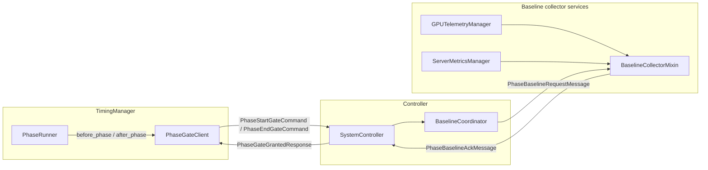
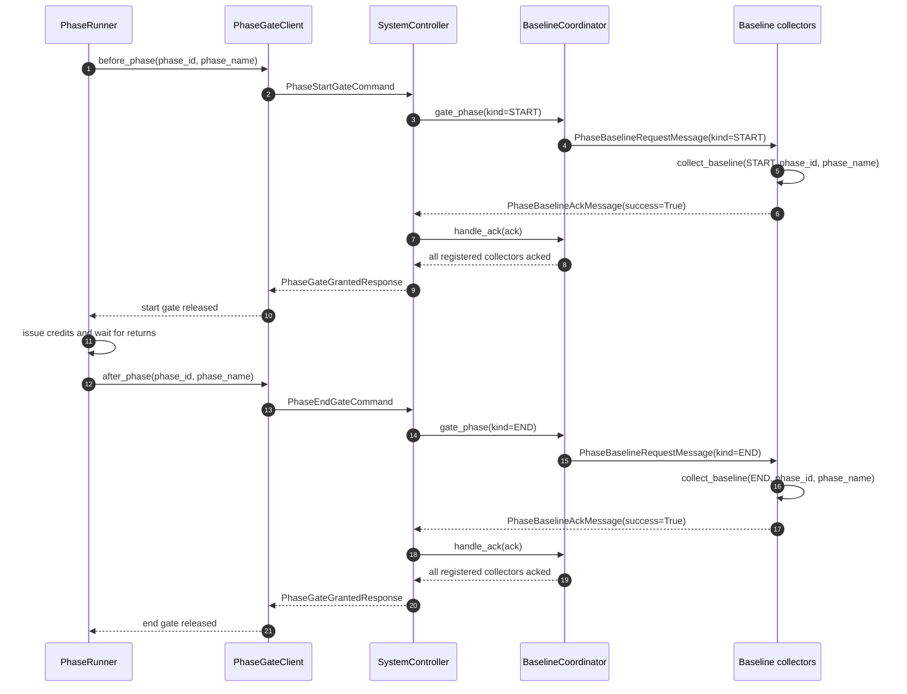
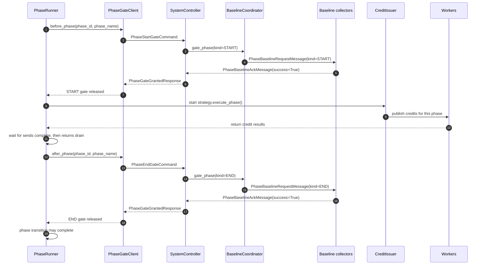
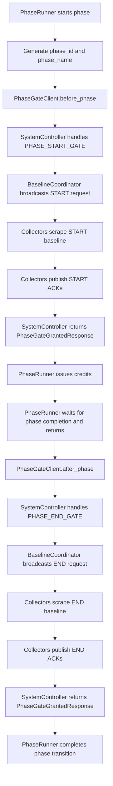

# Phase Baseline Handshake

The phase baseline handshake captures point-in-time baseline readings at phase boundaries without coupling `TimingManager` to specific collectors. `PhaseRunner` pauses at each boundary through `PhaseGateClient`; `SystemController` fans the request out through `BaselineCoordinator`; registered baseline collectors scrape once and ACK; then the gate releases and the benchmark continues.

## Component map

## Per-phase message sequence

## Credit ordering at phase boundaries

## TimingManager phase flow

