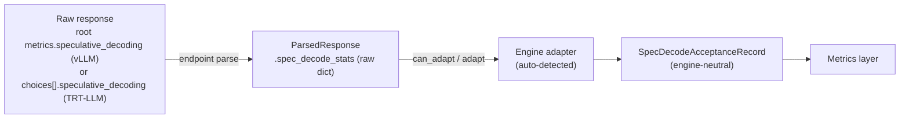

<!--
SPDX-FileCopyrightText: Copyright (c) 2026 NVIDIA CORPORATION & AFFILIATES. All rights reserved.
SPDX-License-Identifier: Apache-2.0
-->

# Per-Request Speculative-Decoding Acceptance

When an inference server runs speculative decoding, it can report how well the
draft model did on each request: how many draft tokens it proposed, how many
were accepted, and the distribution of accepted-draft counts per verify step.
AIPerf captures this as an **engine-neutral per-request record** so the metrics
layer can reason about acceptance without knowing which engine produced it.

This page documents the record, the adapter interface that fills it, and the
two supported engines: vLLM and TensorRT-LLM. They emit genuinely different
payloads -- different field names and different placement in the response -- and
the adapter layer is what keeps that difference from reaching the metrics layer.
An SGLang adapter is future work and reuses the same record.

## The engine-neutral record

`SpecDecodeAcceptanceRecord`
([`src/aiperf/common/models/spec_decode_models.py`](https://github.com/ai-dynamo/aiperf/blob/main/src/aiperf/common/models/spec_decode_models.py))
is one record per request, attached to `ParsedResponseRecord.spec_decode_acceptance`.
It is deliberately **tree-agnostic** (a histogram, not per-position arrays) and
**adaptive-safe** (no fixed `k` assumption) so it survives variable-length
drafting such as DSpark-style adaptive verification.

| Field | Description |
| --- | --- |
| `engine` | Serving engine that produced the stats: `vllm` or `tensorrt_llm`. Set by the adapter for provenance; no metric branches on it. |
| `mean_acceptance_length` | Mean tokens per verify step including the bonus token: `1 + num_accepted_draft_tokens / num_spec_steps`. Ranges `1.0` … `num_spec_tokens + 1`. |
| `draft_acceptance_rate` | `num_accepted_draft_tokens / num_draft_tokens`. Draft-only. |
| `acceptance_histogram` | Sparse `{accepted_draft_count: num_steps}` map with **integer** keys. Zero-count buckets omitted. Excludes the bonus token. |
| `num_accepted_draft_tokens` | Total accepted draft tokens (excludes bonus). |
| `num_draft_tokens` | Total proposed draft tokens counted toward acceptance (the denominator of `draft_acceptance_rate`). Engines that discard some proposals before counting report the post-adjustment total; see the engine section. |
| `num_spec_steps` | Number of verify steps. Equals the sum of the histogram counts. |
| `num_spec_tokens` | Maximum draft length per step (`k`) when the engine has a fixed per-step bound. `None` (the field is optional) when the engine reports no fixed bound, e.g. fully variable-length drafting. |
| `completion_tokens` | Output tokens for the request, copied from the response `usage` so a consumer holding only this record can normalize acceptance against output length. `None` when the response carried no usage. |
| `per_step_accepted` / `per_step_drafted` | Ordered arrays, one entry per verify step (a temporal axis — not positions in a draft tree). Present only when the engine reports per-step data; `None` otherwise. |

Descriptions here are engine-neutral; how a specific engine populates them (field
names, which level emits the per-step arrays, counting caveats) lives in that
engine's section below.

## The adapter interface

An adapter is the **only** component that knows an engine's on-the-wire
spec-decode shape. It reads the raw payload captured on the parsed responses
(`ParsedResponse.spec_decode_stats`) and returns a `SpecDecodeAcceptanceRecord`,
so nothing engine-specific leaks into the metrics layer.

Adapters are a plugin category (`spec_decode_adapter`) and are resolved by
**auto-detection**: AIPerf never learns which engine it is pointed at, so every
payload is offered to every registered adapter, and each recognizes its own by
an engine-specific signature. Both methods are classmethods (adapters are
stateless).

Detection therefore depends on those signatures being **disjoint**, and each
adapter's signature must contain at least one key the other engines do not emit.
The two current signatures are:

| Adapter | Signature keys |
| --- | --- |
| vLLM | `acceptance_histogram`, `num_spec_steps`, `mean_acceptance_length` |
| TensorRT-LLM | `total_accepted_draft_tokens`, `total_draft_tokens` |

`mean_acceptance_length` is load-bearing: the other two vLLM keys are also
emitted by TensorRT-LLM, and because the shared field names parse, a signature
without it would let the vLLM adapter build a record from a TRT-LLM payload and
label it `engine: "vllm"` — with no error to notice.

Plugin **priority does not order detection**: `priority` resolves conflicts only
between plugins registering the same *name*, so `iter_all` yields declaration
order from `plugins.yaml`. Rather than let YAML line order decide, the parser
collects every match and, if more than one adapter claims a payload, logs a
warning and produces **no record** — an ambiguous payload is a bug in AIPerf's
signatures, and dropping it is better than attributing it arbitrarily.

```python
@runtime_checkable
class SpecDecodeAdapterProtocol(Protocol):
    @classmethod
    def can_adapt(cls, responses: list[ParsedResponse]) -> bool: ...
    @classmethod
    def adapt(cls, responses: list[ParsedResponse]) -> SpecDecodeAcceptanceRecord | None: ...
```



## The vLLM adapter

`VLLMSpecDecodeAdapter` reads vLLM's response-root `metrics.speculative_decoding`
object, emitted when the server runs with `--per-request-spec-decode-metrics`
(`summary` or `detailed`). The field names and shape track vLLM PR
[#48915](https://github.com/vllm-project/vllm/pull/48915); its *Per-Request
Acceptance Metrics* feature doc is the authoritative wire-format reference. It is
present on chat and completions, streaming and non-streaming; in streaming it
rides the trailing `include_usage` chunk (empty `choices`) at the response root.

Because vLLM emits that trailing chunk only when `stream_options.include_usage`
is set, AIPerf requests it on **every** streaming run -- not just when
`--use-server-token-count` is on, which would otherwise silently drop the
metrics. The chunk carries no content, so it is excluded from timing metrics via
`ParsedResponseRecord.content_responses`, and token counting still follows the
`use_server_token_count` config rather than the presence of `usage`. To opt out,
set the field explicitly: `--extra-inputs '{"stream_options":
{"include_usage": false}}'`.

The wire object maps to the record one-to-one, except:

- **`acceptance_histogram` is a dense `list[int]`** -- index `j` holds the number
  of verify steps that accepted exactly `j` draft tokens (length
  `num_spec_tokens + 1`). AIPerf inflates it into the record's sparse
  `{j: count}` map, dropping zero-count buckets.
- **`completion_tokens`** is copied from the response `usage` (not the payload)
  so the record trace carries it next to acceptance; no metric consumes it yet.
  `None` when the server omits usage.
- **`num_draft_tokens`** is vLLM's post-adjustment count: drafts invalidated by
  structured-output/grammar constraints are already subtracted server-side.
- **`num_spec_tokens`** is always present (the configured `num_speculative_tokens`);
  vLLM's DSpark/DFlash drafters are fixed-block, so `k` stays defined even there.
- The `detailed` level adds `per_step_accepted` / `per_step_drafted`; `summary`
  omits them (they stay `None`).
- `mean_acceptance_length` / `draft_acceptance_rate` are taken verbatim
  (the server already computes them safely, including the zero-step case).

### Missing-field and edge cases

- **Field absent** (spec decode off, or the request had no verify steps): the
  record is `None` and dependent metrics simply do not show. This is the common
  case and is not an error.
- **Zero-step / fully-rejected**: reported verbatim (empty or `{0: N}`
  histogram, `mean_acceptance_length == 1.0`).
- **Malformed payload**: the adapter degrades to `None` rather than raising, so
  one bad response cannot abort a run. Records whose aggregate counts contradict
  each other (histogram not summing to `num_spec_steps`, etc.) are rejected the
  same way.
- **`n > 1`**: vLLM populates `metrics.speculative_decoding` only when the stats
  are attributable to a single generation stream, leaving it `null` otherwise --
  for `n > 1` on both endpoints, and additionally for **multi-prompt** requests
  on completions (`prompt: ["a", "b"]`), where timestamps would span prompts.
  Because the object is at the response root -- not per-choice -- AIPerf simply
  reads it as present or absent; no client-side suppression is needed, and such
  requests yield no record. AIPerf sends one prompt per request, so in practice
  only `n > 1` triggers this.
- **Behind Dynamo** the custom field is currently stripped, so this path is
  direct-to-vLLM only.

## The TensorRT-LLM adapter

`TRTLLMSpecDecodeAdapter` reads TensorRT-LLM's **per-choice**
`speculative_decoding` object. Unlike vLLM's, it rides the choice rather than the
response root — the placement TRT-LLM already uses for its
`avg_decoded_tokens_per_iter` field. In streaming it arrives on the **terminal
chunk's choice** (the one carrying `finish_reason`), not on a trailing usage
chunk.

```json
{
  "index": 0,
  "message": {"role": "assistant", "content": "..."},
  "finish_reason": "stop",
  "avg_decoded_tokens_per_iter": 2.5,
  "speculative_decoding": {
    "acceptance_rate": 0.5,
    "total_accepted_draft_tokens": 30,
    "total_draft_tokens": 60,
    "num_spec_steps": 20,
    "acceptance_histogram": [8, 0, 6, 6],
    "num_spec_tokens": 3
  }
}
```

Read that as: 20 verify steps; 8 accepted nothing, 6 accepted 2 drafts, 6
accepted all 3. So 30 accepted of 60 proposed, and 2.5 tokens emitted per step
instead of 1.

The mapping to the record differs from vLLM's in three ways:

- **Different field names.** `acceptance_rate` → `draft_acceptance_rate`,
  `total_accepted_draft_tokens` → `num_accepted_draft_tokens`,
  `total_draft_tokens` → `num_draft_tokens`. These are TensorRT-LLM's own names
  for the quantities, already used internally for the same counters.
- **`mean_acceptance_length` is derived, not read.** TRT-LLM does not send it,
  because it already reports acceptance length per choice as
  `avg_decoded_tokens_per_iter`; carrying it twice would let the two drift. The
  adapter computes `1 + num_accepted_draft_tokens / num_spec_steps` — the
  record's own definition — so the reported length can never contradict the
  histogram it sits beside.
- **`per_step_accepted` / `per_step_drafted` are never populated.** TRT-LLM keeps
  per-*position* vectors (a survival curve), not per-step sequences, so it has no
  per-step data to report. This is a real fidelity gap versus vLLM's `detailed`
  level.

`acceptance_histogram` uses the same dense `list[int]` encoding as vLLM's and is
inflated by the same shared helper.

### Enabling it

TensorRT-LLM has no CLI flag for metrics; these are `TorchLlmArgs` fields set
through the YAML passed to `--extra_llm_api_options`. Enablement is two-level —
the server declares the capability once, and the client asks per request, so
requests that do not ask pay nothing:

```yaml
# extra-llm-api-config.yaml
per_request_spec_decode_stats: true
```

```bash
trtllm-serve <model> --extra_llm_api_options extra-llm-api-config.yaml
```

That server-side field is the entire opt-in: a client sends nothing extra, so
AIPerf discovers the payload by shape exactly as it does for vLLM. It is
deliberately independent of `return_perf_metrics`, which also mounts the
Prometheus endpoint.

### Missing-field and edge cases

- **`num_spec_tokens` is `null` under `draft_len_schedule`**, where the per-step
  draft bound varies by batch size. This is legal and expected: the record's
  field is optional, and the histogram-length cross-check is skipped. The
  record's identity validators still apply in full.
- **PyTorch backend only.** The C++/TRT path populates spec metrics via
  `updateNumTokensPerIteration` and has no per-position vectors, so the field is
  simply absent there.
- **Absent when the request never drafted**, rather than reported as zeros.
- **`n > 1`**: because the payload is per-choice, a response carrying more than
  one choice is suppressed client-side — a single per-request record cannot
  attribute request-level `completion_tokens` to one sequence.
- **Tree drafting** (EAGLE3 dynamic-tree, Medusa) works unchanged: the histogram
  counts how many steps produced each output length and encodes no
  parent/child structure.
