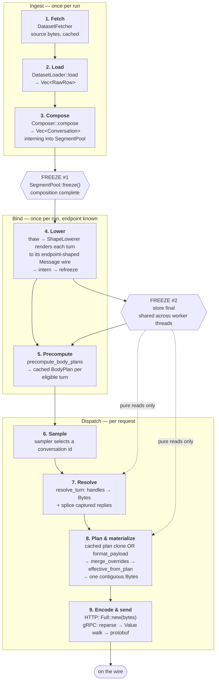

<!--
SPDX-FileCopyrightText: Copyright (c) 2025-2026 NVIDIA CORPORATION & AFFILIATES. All rights reserved.
SPDX-License-Identifier: Apache-2.0
-->

# Content to wire

## Purpose

The end-to-end path one piece of request content travels: from a byte in a
dataset source to a byte in an outbound request. Nine stages, two freeze
boundaries, and a serialization budget that must be spent exactly once.

This record owns the **path** — stage boundaries, what each stage may and may not
do, and the invariants that span stages. It does not restate what the stage-owning
records specify:

- [dataset.md](dataset.md) owns the segment store, loaders, composers, and the
  pool/freeze/thaw cycle.
- [endpoint-body-construction.md](endpoint-body-construction.md) owns the plan
  vocabulary, the override set, and materialization.
- [endpoints.md](endpoints.md) owns dialect adapters and endpoint identity.
- [http-transport.md](http-transport.md) and [grpc-transport.md](grpc-transport.md)
  own the wire clients.

Read this one when you need to know *where* something happens, or why a cost
appears where it does. Read the others for the rules within a stage.

## Built

### The nine stages



| # | Stage | Input | Output | May allocate? |
|---|---|---|---|---|
| 1 | Fetch | source URI / path | bytes, cached on disk | yes |
| 2 | Load | source bytes | `Vec<RawRow>` | yes |
| 3 | Compose | `Vec<RawRow>` | `Vec<Conversation>` + populated `SegmentPool` | yes |
| 4 | Lower | frozen store + `ShapeLowerer` | store with appended `Message` wires | yes |
| 5 | Precompute | frozen store + prepared endpoint | `body_plans` cache | yes |
| 6 | Sample | conversation ids | one id | no |
| 7 | Resolve | handles + captured replies | `EndpointTurn` with `Bytes` | small |
| 8 | Plan & materialize | turn + overrides | one `Bytes` body | one buffer |
| 9 | Encode & send | `Bytes` | wire frames | HTTP: none |

Stages 1-5 run before the clock starts. Stages 6-9 are the timed hot path, and
everything in them is bounded: no content serialization, no store mutation, no
lock.

### Stage 1-2: fetch and load

A `DatasetFetcher` retrieves and caches the source. A `DatasetLoader` parses it
into `RawRow`s — the format-neutral ingest unit:

| `RawRow` field | Meaning |
|---|---|
| `value: Value` | Decoded row, used for validation and canonical field access |
| `wire: Option<Bytes>` | The **exact authored object bytes**, retained when the format supports verbatim replay or raw-message interning |
| `session_id: Option<SessionId>` | Authored session identity, when the format exposes one outside `value` |
| `group_key: Option<String>` | Loader-private key grouping rows into one conversation |
| `origin: RowOrigin` | Source coordinate, for diagnostics |

`wire` is the reason verbatim replay is byte-exact: the authored bytes are carried
from parse to intern without a round trip through `Value`. A loader that drops
`wire` forfeits verbatim replay for its format.

Loaders parse and fetch only. They do not tokenize, intern, or compose — a loader
that reaches for a `SegmentPool` is in the wrong stage. Format selection is by
explicit name or ordered structural auto-detection over a probe row; see
[dataset.md](dataset.md) for the registered set.

### Stage 3: compose

```rust
fn compose(
    &self,
    rows: Vec<RawRow>,
    config: &ComposeConfig,
    tokenizer: &dyn TextTokenizer,
    segments: &mut SegmentPool,
) -> Result<Vec<Conversation>>;
```

The composer is the **only** stage holding a mutable `SegmentPool` and a
tokenizer at the same time, and it interns every payload in one pass. It performs
turn finalization, ISL/OSL sequence-distribution sampling, context injection,
model selection, `max_tokens` resolution, and synthetic media generation.

Two consequences worth stating:

- **Tokenization happens here or nowhere.** Text that must become token-keyed
  segments is encoded during composition. Verbatim `raw_payload` and `inputs_json`
  bodies stay opaque and leave `Turn::input_tokens` unset (`None`) — they are
  never BPE-encoded to synthesize a count.
- **Authored payload bytes are released after interning.** Once `RawRow::wire` is
  interned, the row's copy is dropped; the store holds the single retained copy.

Composition ends at **freeze #1**. From here, `Conversation` and `Turn` carry
handles, not bytes.

### Stage 4: endpoint lowering

Composition does not know the endpoint dialect. Lowering does.

`lower_static_messages` (`multiturn.rs:558`) resolves the default prepared
endpoint, obtains its `ShapeLowerer`, and calls
`Dataset::lower_messages_for_endpoint`, which **thaws** the frozen store, interns
each turn rendered to its exact endpoint-shaped `Message` wire, and **refreezes**
once.

This is the stage that makes the whole design work, and it depends on one
guarantee from [dataset.md](dataset.md): a thaw → intern → freeze cycle never
renumbers an existing handle. New segments append after the existing arena, so
every handle minted during composition stays valid.

A dialect with no `ShapeLowerer` skips this stage entirely and renders live at
dispatch. That is a correctness-preserving fallback, not a failure.

### Stage 5: precompute

`precompute_body_plans` builds and caches a `BodyPlan` per eligible
`(conversation, turn)`. Eligibility gates and their reasons are specified in
[endpoint-body-construction.md](endpoint-body-construction.md); the stage-level
point is that this is the **last** thing that runs before the clock starts, and
that a cache miss is always safe — it costs a live `format_payload`, never a
different body.

### Stages 6-9: the timed path

```mermaid
sequenceDiagram
    autonumber
    participant SC as Scheduler
    participant DS as Dataset
    participant ST as Frozen store
    participant EP as Endpoint dialect
    participant MZ as JsonBodyMaterializer
    participant TR as Transport

    SC->>DS: next conversation + turn index
    DS->>DS: cached_body_plan(id, turn)?

    alt cache hit (profiling phase)
        DS-->>MZ: share cached BodyPlan (Arc, not a copy)
        Note over DS,MZ: a DeltasWithoutResponses continuation plan<br/>holds only the authored turns; this dispatch's<br/>captured reply wires are bound to the splice<br/>positions the plan reserved
    else miss / warmup / live turn
        DS->>ST: resolve_turn — message_wire(handle)
        ST-->>DS: Bytes (refcount clone, no copy)
        DS->>DS: splice captured assistant replies
        DS->>EP: format_payload(PreparedRequest)
        EP->>EP: assemble wires; position marker<br/>fixes field position
        EP->>EP: from_object_reserving → Literal + Wires + Reserved
        EP->>EP: fill_reserved fills the reserved slot
        EP-->>MZ: BodyPlan::Fields
    end

    MZ->>MZ: merge_overrides (insert-order semantics)
    MZ->>MZ: effective_from_plan reads back<br/>model / stream / token cap
    MZ->>MZ: splice into one contiguous BytesMut
    MZ-->>TR: Bytes

    alt HTTP
        TR->>TR: Full::new(bytes) — no copy
        TR->>TR: POST
    else gRPC
        TR->>TR: serde_json::from_slice → Value
        Note over TR: full parse of bytes just produced<br/>known defect
        TR->>TR: tree walk → ModelInferRequest
    end
```

Stage 7 is the only place captured replies enter. A conversation in a
`WithoutResponses` context mode splices the server's actual prior reply into the
turn list (`endpoint_turns`, `dataset/request.rs:1251-1254`) on the live path, or
straight into the emitted body at the cached plan's reserved positions on the
cached path — content the frozen store never held,
which is why the plan vocabulary carries inline bytes as a first-class kind
rather than addressing everything by handle.

Graph predecessor outputs are the second such case, though on the fast path they
arrive already serialized as `Vec<Bytes>` rather than as values needing
serialization. A third, warmup's system-prompt fold, is written but unreachable —
see [endpoint-body-construction.md](endpoint-body-construction.md) for why.

## The serialization budget

Every byte of request content is serialized exactly once, and this table says
where. A stage that serializes content outside its row is a conformance failure
even if the resulting bytes are identical.

| Content | Serialized at | By | Retained as |
|---|---|---|---|
| Authored verbatim body | never — carried from parse | `RawRow::wire` | `Payload::Raw` |
| Composed message content | stage 3 (compose) | composer, into the pool | `Payload::Message` |
| Endpoint-shaped message wire | stage 4 (lower) | `ShapeLowerer` | `Payload::Message` |
| Endpoint literals (`model`, `stream`, cap) | stage 8, per dispatch | `serde_json::to_writer` into the body buffer | transient |
| Override tail | stage 8, per dispatch | `Overrides::inner_bytes` | transient |
| **Captured assistant reply** | stage 8, per dispatch | `serialize_rendered_messages` | transient |
| **Graph predecessor output** | stage 8, per dispatch — only on the value path (warmup / cache-bust); the fast path arrives as `Bytes` | `serialize_rendered_messages` | transient |
| Warmup system-prompt fold | unreachable in the shipped product | — | — |

The two bolded rows are the irreducible per-dispatch content serializations. They
exist because the content did not exist at freeze time. Everything else on the hot
path is a `Bytes` refcount clone or a small literal.

Four further per-dispatch parses exist that this table does not excuse, because
they re-derive structure the runtime already had rather than producing new
content: input-token counting (`multiturn.rs:1018-1022`), multipart form
re-encoding (`transport/http/transport/endpoint_binding.rs:305-315`),
content-URL tagging (`transport/http/sink.rs:1068-1081`, a parse *and* a full
re-serialize), and the gRPC round trip. They are defects, tracked under
[Future requirements](#future-requirements).

### Per-dispatch cost accounting

For a cached static turn on HTTP — the best case, and the common one:

| Operation | Cost |
|---|---|
| `cached_body_plan` lookup | two index lookups |
| plan clone | `SmallVec` of `(Cow<str>, FieldValue)`; `Bytes` elements are refcount bumps |
| `merge_overrides` + `effective_from_plan` | linear scan of a small field list |
| `materialize` | **one** `BytesMut` allocation, `memcpy` of each wire |
| `Full::new(bytes)` | move |

No store read, no hash, no lock, no content serialization. On a cache miss, add
`resolve_turn` (a store read per message handle, each a refcount clone) and
`format_payload` (a `serde_json::Map` build plus literal serialization).

A `BodyPlan::Raw` dispatch with an empty override set is cheaper still:
`splice_raw_object` returns the stored `Bytes` unchanged — a refcount bump from
store to wire, with no buffer at all.

## Cross-stage invariants

These span stage boundaries, so no single stage-owning record can enforce them.

1. **Handle stability across freeze cycles.** A thaw → intern → freeze cycle
   preserves every existing handle index and stored `SegmentId`. Stage 4 depends
   on this to append endpoint wires to a store whose handles stage 3 already
   distributed into `Conversation`s.
2. **Content identity survives rehashing.** `thaw` reconstructs the dedup map from
   stored `SegmentId`s rather than re-hashing, so content keeps the identity it
   was interned under even if the hashing scheme later changes.
3. **The store is immutable after stage 4.** Stages 6-9 perform pure reads. No
   dispatch path may intern.
4. **Cached and live plans are byte-identical.** For any turn stage 5 accepts,
   the stage-8 cached path must produce exactly the bytes the stage-8 live path
   would have produced. Every eligibility gate exists to preserve this; a gate
   that admits a turn whose body varies is a wire bug.
5. **Live and lowered content are indistinguishable at the field level.** A wire
   resolved from the store and one serialized from a just-captured reply splice
   identically. Provenance must not reach the wire.
6. **Verbatim means verbatim.** Authored bytes retained in `RawRow::wire` reach
   the wire unchanged except for an override tail folded into the top-level
   object. No parse, no re-serialize, no key reordering.
7. **The timed path allocates a bounded amount.** One body buffer per dispatch,
   plus transient literals. Growth proportional to conversation history, message
   count, or dataset size on the hot path is a defect.

## Failure and fallback behavior

| Condition | Behavior |
|---|---|
| Loader cannot detect format | Load fails at stage 2, before the clock starts |
| Endpoint has no `ShapeLowerer` | Stage 4 skipped; every dispatch renders live |
| Turn ineligible for precompute | Stage 5 leaves the slot empty; stage 8 takes the live path |
| `format_payload` fails during stage 5 | Non-fatal — slot stays empty, the identical error resurfaces at dispatch |
| Malformed message wire | Construction error at splice time, not a silent bad body |
| Non-spliceable segment domain as a JSON field | Construction error |

The pattern throughout: every stage-5 failure degrades to the stage-8 live path,
which is always correct and merely slower. Precompute is an optimization and is
never load-bearing for correctness.

## Testing

The path is verified at both ends and across the seam:

- **Stage 3-4 seam:** a lowered wire must equal the bytes the dispatch formatter
  would emit for that turn in isolation. This is the `TurnMessageLowerer`
  contract; violating it makes stage 4 change the wire.
- **Stage 5-8 seam:** a cached plan and a fresh `format_payload` for the same
  turn must materialize to identical bytes.
- **End to end:** against a deterministic `aiperf-mock-server`, inspecting raw
  per-record output — static chat, multi-turn live-reply splicing, verbatim raw
  replay, and a non-streaming input-array dialect. The multi-turn case is
  load-bearing: it is the only one that exercises content created after freeze.

Per-record byte assertions, not summary checks, per the repository's end-to-end
verification requirement.

## Future requirements

Tracked against this path; details and sequencing in
`~/.aiperf/docs/superpowers/plans/2026-08-03-body-plan-consolidation.md`.

- **Consumers that still re-derive structure stage 8 discarded.** The boundary
  type shipped: `MaterializedRequest.body` is a `RequestBody`
  (`dataset/request.rs:39`), which carries assembled bytes, a store-free program,
  or a decoded value, so a transport can take the form it wants. What remains is
  the consumers that have not been moved onto it. The gRPC sink takes a decoded
  `RequestBody::Value` as it stands but still assembles-and-parses every other
  form (`transport/grpc/sink.rs:349-355`); its second full re-serialize runs only
  when a raw artifact or `inputs.json` will read it. Input-token counting on the
  issuance path, multipart form re-encoding
  (`transport/http/transport/endpoint_binding.rs`), content-URL tagging
  (`transport/http/sink.rs`), and the agentic-replay cache-bust rewrite
  (`agentic_replay.rs`) still parse the bytes back.
- **Stage 8 carries an unreachable vocabulary.** `FieldValue::Segment` and
  `Segments` address content by handle at materialize time, but every Fields plan
  materializes against an empty store, so constructing one is a runtime
  `UnknownHandle` on every dispatch. Either resolve them to bytes before the
  boundary or remove them; leaving a public builder that cannot work is the
  hazard.
- **A stage-5 collapse that reaches one dialect.** `BodyPlan::Prebuilt` and
  `prebuilt_if_static` collapse a fully-static plan into one cloneable buffer.
  Only `image_retrieval` satisfies the gates today (`endpoints/tier2.rs:932`
  emits no `model`; `tier2.rs:221` is non-streaming). Widening it to the other
  inline-media dialects requires moving `model` into the override tail, which
  changes field order on the wire.

## Source anchors

- `rust/runtime/src/dataset/loader/mod.rs` — `DatasetLoader`, `RawRow`,
  `LoadConfig`, `DatasetProbe`, `LoaderRegistry`.
- `rust/runtime/src/dataset/compose.rs` — `Composer`, `ComposeConfig`,
  `ComposeState`, turn finalization.
- `rust/runtime/src/dataset/segment.rs` — `SegmentPool` (`intern_*`, `thaw`,
  `freeze`) and `InMemorySegmentStore`.
- `rust/runtime/src/dataset/dataset.rs` — `lower_messages_for_endpoint`,
  `precompute_body_plans`, `cached_body_plan`.
- `rust/runtime/src/multiturn.rs` — `lower_static_messages`, the stage 4-5
  orchestration.
- `rust/runtime/src/dataset/request.rs` — `resolve_turn`, `endpoint_turns`
  (captured-reply splice), `materialize` / `materialize_prepared`,
  `effective_from_plan`.
- `rust/runtime/src/endpoints/endpoints.rs` — `ShapeLowerer`,
  `rendered_turn_messages`, `serialize_rendered_messages`, the reference dialect
  pattern.
- `rust/runtime/src/body_plan.rs` — `BodyPlan`, `FieldValue`,
  `JsonBodyMaterializer`.
- `rust/runtime/src/transport/http/sink.rs` and
  `transport/http/client/connection.rs` — the bytes-passthrough wire path
  (`Full::new`).
- `rust/runtime/src/transport/grpc/sink.rs` and `transport/grpc/codec.rs` — the
  gRPC JSON round trip.
