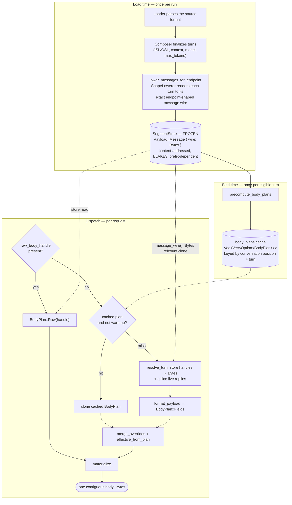
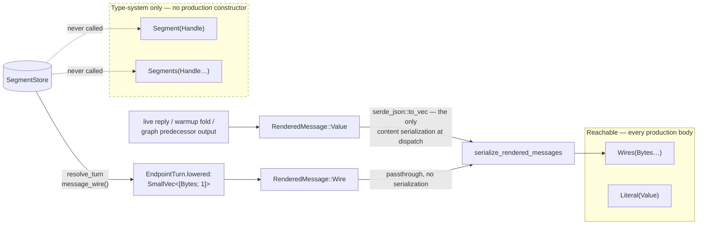
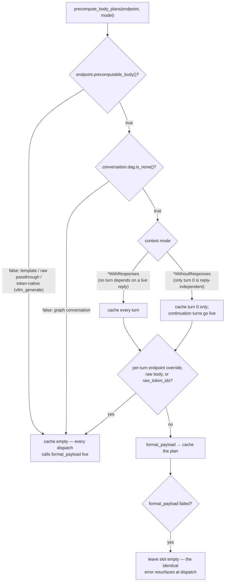
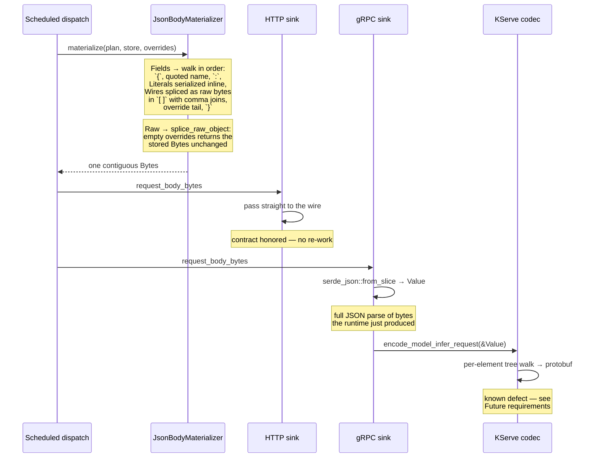

<!--
SPDX-FileCopyrightText: Copyright (c) 2025-2026 NVIDIA CORPORATION & AFFILIATES. All rights reserved.
SPDX-License-Identifier: Apache-2.0
-->

# Endpoint body construction

## Purpose

Define how an endpoint declares the *shape* of a request body, and how that shape
becomes wire bytes.

This record owns the **plan vocabulary** and the **plan → wire bytes** contract.
Content interning, addressing, and load-time lowering belong to
[dataset.md](dataset.md). The design is language-neutral: it exists today as a
Rust realization, but every rule below is stated so another implementation can
reproduce it byte-for-byte.

## The constraint that shapes everything

A load generator wants to serialize request content **once**, at load, and do
nothing at dispatch but concatenate bytes. The obvious way to express that is to
address content by handle into a frozen store and let the materializer splice
from it.

That design cannot work alone, because **not all content exists when the store is
frozen.** Three cases produce content mid-run:

1. **Captured assistant replies.** A multi-turn conversation in a
   `WithoutResponses` context mode splices the server's actual reply into the
   next request's message array (`dataset/request.rs:1020-1022`). The reply is
   whatever the endpoint under test returned milliseconds earlier.
2. **Warmup's system-prompt fold.** Warmup re-renders turn 0 as a mutable value
   so the system prompt can be prepended in place (`endpoints/endpoints.rs:869-877`),
   producing a message the store never held.
3. **Graph node outputs.** A graph node's turn is built per dispatch from its
   predecessors' outputs (`engine/graph_execution.rs:980-992`).

So the plan vocabulary must carry **inline pre-serialized bytes** as a
first-class content kind, not as a fallback. That is what `FieldValue::Wires` is,
and it is the mechanism every JSON body actually uses.

Handles still matter — they are how static content gets from the store to the
plan without a copy — but they are resolved **before** the plan is built, in
`resolve_turn`, not inside the materializer.

## Built

### End-to-end path

The dotted edges are the only store reads on the dispatch path. Both are
refcount clones of an already-serialized `Bytes` — no copy, no re-serialization
(`dataset/materialize.rs:179-188`).

### Content lowering happens at load

`Dataset::lower_messages_for_endpoint` (`dataset/dataset.rs:200`) walks every turn
through the endpoint's `ShapeLowerer` (`endpoints/endpoints.rs:943`, implementing
`TurnMessageLowerer`), which renders the turn to **exactly** the bytes the
dispatch formatter would emit for that turn in isolation. Those bytes are interned
as `Payload::Message` segments and the store is refrozen once.

This is the "serialize once" guarantee. Everything downstream moves `Bytes`.

### The plan vocabulary

A body plan is one of two shapes:

- **`Raw(Handle)`** — a handle to a complete, opaque prebuilt body
  (recorded-payload replay). The only plan shape the materializer resolves against
  the real store.
- **`Fields([(name, value)])`** — an **ordered** list of named fields describing a
  JSON object. Order is significant and preserved into the wire bytes; endpoints
  and downstream diff tooling depend on stable key order.

A field value is one of four kinds. **Two are reachable in production**; the other
two exist in the type system with no production constructor:

| Kind | Meaning | Reachable? |
|---|---|---|
| **`Literal(Value)`** | An endpoint-generated scalar or small struct (`model`, `stream`, `max_tokens`, a nested options object). Serialized into the buffer at materialize time; small. | **Yes** — every dialect |
| **`Wires(SmallVec<[Bytes; 1]>)`** | An ordered array of already-serialized JSON values carried inline. Spans **both** store-lowered content (resolved to `Bytes` by `resolve_turn`) and live content produced mid-run. Serialized exactly once by its producer, never here. | **Yes** — every message array |
| **`Segment(Handle)`** | One stored content segment spliced by handle at materialize time. | **No production constructor** |
| **`Segments(SmallVec<[Handle; 1]>)`** | An ordered array of stored message handles spliced by handle. | **No production constructor** |

`Segment`/`Segments` are a parallel mechanism the call graph never reaches: the
builders that construct them (`.array()`, `.segment()`, `.opt_segment()`,
`BodyPlan::new()`) appear only inside `body_plan.rs` and its test module. They are
scheduled for removal — see [Future requirements](#future-requirements).

### How an endpoint builds a plan

Every dialect follows one pattern (`endpoints/endpoints.rs:340-385` is the
reference implementation for chat):

1. Assemble message wires — `format_chat_message_wires` resolves each turn to
   `RenderedMessage::Wire(bytes)` when the turn carries a lowered wire, or
   `RenderedMessage::Value(v)` when it must be rendered live. Only the latter is
   serialized (`endpoints/endpoints.rs:830-842`).
2. Build the scalar payload as a `serde_json::Map`, inserting an **empty-array
   placeholder** for the message field purely to fix its ordinal position
   (`endpoints/endpoints.rs:351-352`).
3. Bridge the map to a plan with `BodyPlan::from_object`, which turns non-empty
   arrays-of-objects into `Wires` and everything else into `Literal`
   (`body_plan.rs:166-184`).
4. Replace the placeholder with the real wires via `splice_message_wires`, which
   preserves the field's position (`body_plan.rs:188-197`).

The placeholder is load-bearing: because it is empty, `from_object` classifies it
as a `Literal` and never serializes a message array, so step 4's replacement costs
nothing. Three call sites use this pattern — `messages` for chat
(`endpoints.rs:383`) and Anthropic (`anthropic.rs:248`), `input` for Responses
(`endpoints.rs:597`).

**The endpoint declares shape only.** It chooses field names, field order, and
which slot is a literal versus content. It never emits commas or brackets, and
never serializes lowered content.

### The override set

Per-dispatch variation is carried in a small ordered map applied at materialize
time — `model`, the token cap (`max_tokens` **or** `max_completion_tokens` per
dialect), `stream`, `stream_options.include_usage`, `seed`, and arbitrary user
`extra_body` keys.

Overrides fold in with **insert-order map semantics**: an existing key is replaced
**in place** (position unchanged), a new key is **appended**. This is exactly what
"take the object, `insert` each override, serialize" produces, and the materialized
bytes must equal that key-for-key.

Two equivalent foldings exist and must agree byte-for-byte:

- **Merge into the plan** (`merge_overrides` → `set_literal`, `body_plan.rs:250-268`),
  used when downstream logic must read the effective model / cap / stream flag back
  off the plan.
- **Override tail** — serialized members appended after the plan's fields at
  materialize time (`materialize_fields`, `body_plan.rs:359-364`).

`effective_from_plan` (`dataset/request.rs:730-756`) reads five field names back
off the merged plan to derive the effective request: `model`, `stream`,
`max_tokens`, `max_completion_tokens`, `max_output_tokens`.

### The precompute cache

A Fields plan for a static turn does not vary between profiling dispatches, so
eligible plans are built once at bind and cloned per dispatch
(`Dataset::precompute_body_plans`, `dataset/dataset.rs:266`).

Only the **profiling** phase reads the cache; warmup always takes the live path
because it folds the system prompt inside the formatter
(`dataset/request.rs:469-474`). The pass is idempotent — it rebuilds the whole
cache from the current conversations on each call.

`precomputable_body()` defaults to `true` (`endpoints/registry.rs:390`). Exactly
three dialect families opt out, each because its body genuinely cannot be known at
bind: the Jinja template dialect (may reference per-dispatch identity such as
`x_request_id`), raw passthrough (splices the dispatching turn's own authored
payload), and `vllm_generate` (sends exact per-turn raw token IDs). **Every other
dialect qualifies, including the non-message-array input-array shapes** —
embeddings, rankings, image retrieval. Those are the biggest beneficiaries: a
32-image batch inlined as data URLs pays its whole `format_payload` serialization
once at bind instead of once per timed request.

### Materialization and the two wire paths

The plan is wire-agnostic; materialization is not.

**JSON path** (`JsonBodyMaterializer`, `body_plan.rs:290-367`). Walks the Fields
plan in order into a single contiguous `BytesMut`. Message wires are validated as
JSON objects as they are spliced — a malformed wire is a construction error, not a
silent bad body (`body_plan.rs:370-375`). The result is **one** buffer, no
scatter-gather, honoring transports that require a complete body. HTTP passes it
to the wire unchanged (`transport/http/sink.rs:387`).

A `Raw` plan takes a shortcut: `splice_raw_object` returns the stored `Bytes`
unchanged when the override set is empty (`dataset/materialize.rs:238-242`), so
verbatim replay costs a refcount bump.

**gRPC path.** There is **no protobuf materializer.** The scheduled path hands gRPC
the same materialized JSON bytes (`transport/core/dispatch.rs:238`); the sink
parses them back into a `serde_json::Value` (`transport/grpc/sink.rs:336`); and
`encode_model_infer_request` walks that tree into protobuf
(`transport/grpc/codec.rs:54-55`). Every gRPC request therefore pays a full JSON
serialize **and** a full JSON parse for structure the runtime already had. This is
a known defect, scoped in [Future requirements](#future-requirements).

### Store reads on the dispatch path

For precision, these are all of them:

| Site | What it reads | Cost |
|---|---|---|
| `resolve_turn` → `message_wire` (`dataset/request.rs:1181`) | lowered message wires | `Bytes` refcount clone |
| `raw_body_handle` → `BodyPlan::Raw` materialize (`dataset/request.rs:349`, `:449`) | a complete prebuilt body | `Bytes` refcount clone |
| `resolve_prompt` (system / user context) | prompt text | owned `String` |

`JsonBodyMaterializer::materialize(plan, store, overrides)` has exactly two
non-test callers, both passing `BodyPlan::raw`. Every Fields plan goes through
`materialize_standalone` (`body_plan.rs:272-275`), which materializes against a
freshly-constructed **empty** store — sound precisely because no reachable Fields
plan contains a handle. The empty store costs nothing (`InMemorySegmentStore`
wraps a `Box<[Segment]>`, whose `Default` does not allocate).

## Invariants (the acceptance contract)

A conforming implementation, in any language, must satisfy all of:

1. **Content serializes exactly once.** Lowered message content is serialized at
   load and moves as bytes thereafter. Only endpoint literals, the override tail,
   and genuinely-live content (a captured reply, a warmup fold, a graph
   predecessor output) serialize at dispatch. Re-serializing lowered content on
   the hot path is a conformance failure even if the bytes happen to match.
2. **Byte-identity to the object-merge baseline.** For any plan, the materialized
   body must be byte-for-byte identical to constructing the equivalent JSON object
   (message array + literals + overrides, in the plan's field order) and
   serializing it once with overrides applied via insert-order map semantics. This
   is the primary test oracle.
3. **Field order is preserved** from the plan into the wire, including where an
   in-place override replaces an existing field (position unchanged) versus a new
   override key (appended).
4. **Optional fields are omitted, not nulled** — an absent content handle produces
   no field.
5. **Raw plans replay verbatim** — a Raw segment's bytes reach the wire unchanged
   except for the override tail folded into its top-level object.
6. **Live content is indistinguishable from lowered content at the field level.**
   A `Wires` field built from store-resolved bytes and one built from a
   just-captured reply splice identically. Provenance must not leak into the wire.
7. **The cached plan equals the live plan.** For any turn the precompute cache
   accepts, cloning the cached plan and folding overrides must produce the bytes a
   fresh `format_payload` would have produced. Every eligibility gate exists to
   preserve this.
8. **Domain safety** — only Message and Raw segments are field-spliceable on the
   JSON path. Text-only / Token-IDs / Media / Trace-hash-IDs segments are a
   construction error there; token and tensor content reaches the wire only
   through the gRPC codec.
9. **Single contiguous body** on the JSON path — no scatter-gather.
10. **Numeric boundary discipline** — values are finite or explicitly absent at
    the serialization boundary.

## Testing

The defining tests assert **byte-identity**, not structural equality.

Unit level (`body_plan.rs` tests) — exact bytes are available here:

- A messages-array plan materializes byte-identically to the shared message-splice
  path and to a hand-written expected byte string.
- A `Wires` plan and a `Segments` plan of the same content materialize identically.
- The object-bridge plan materializes byte-identically to serializing the source
  object once — messages array, scalars, nested objects, string arrays, arbitrary
  user keys.
- Override folding matches "clone the object, `insert` each override, serialize"
  for both in-place and append cases.
- A Raw plan reproduces the verbatim payload, with and without an override tail.
- Splicing a non-spliceable segment domain as a JSON field is rejected.

Product level (`rust/e2e-tests/`) — against a deterministic `aiperf-mock-server`,
inspecting raw per-record output:

- Static single-turn chat: field order and content.
- **Multi-turn live-reply splice**: turn 1's message array carries turn 0's user
  message, the captured assistant reply, and turn 1's user message — and turn 0's
  wire is byte-stable across both dispatches. This is the load-bearing case; a
  handle-only design cannot express it.
- Raw replay: the authored body reaches the wire verbatim.
- A non-streaming input-array dialect (embeddings/rankings).

New endpoint dialects add a test asserting their exact wire bytes against the mock
server, per the repository's end-to-end verification requirement.

## Future requirements

Explicitly planned, not built. Implementation plan:
`~/.aiperf/docs/superpowers/plans/2026-08-03-body-plan-consolidation.md`.

- **Remove the unreachable handle-addressed field vocabulary.** `FieldValue::Segment`,
  `FieldValue::Segments`, and their builders have no production constructor and no
  path to one: message content reaches a plan as `Bytes` via `resolve_turn`, and
  live content cannot be addressed by a handle at all. Removing them leaves
  `Literal` and `Wires`, and leaves `BodyPlan::Raw` as the sole store-addressed
  shape. Blocked on the protobuf work below, which may reclaim them for token
  tensors.
- **A real protobuf materializer.** The gRPC sink must stop parsing materialized
  JSON back into a `serde_json::Value`. The target is an encoder that packs
  token-ID and tensor content into `ModelInferRequest` without an intermediate
  `Value`, proven byte-equivalent to the current codec before the sink switches
  over. Scoped by measurement: the reparse cost is benchmarked before the work is
  committed to, and the payoff concentrates in `vllm_generate`, which is
  token-native and opts out of plan caching.
- **Resolve the static collapse.** A third plan shape, `BodyPlan::Prebuilt(Bytes)`,
  and its gate `prebuilt_if_static` were added to collapse a fully-static Fields
  plan into one cloneable buffer. It cannot fire: streaming dialects fail the
  `supports_streaming` gate, and every non-streaming dialect emits `model`, which
  the per-dispatch-literal gate refuses to freeze. It is to be deleted, unless a
  measurement shows the multi-MB inline-media dialects justify moving `model` into
  the override tail so the static remainder collapses — a change that would alter
  field order on the wire and needs sign-off.
- **Enforce the collapse-gate / effective-field agreement.** `PER_DISPATCH_LITERALS`
  (`body_plan.rs:213-219`) and the fields `effective_from_plan` reads back
  (`dataset/request.rs:730-756`) must cover the same names. They agree today by
  convention with nothing enforcing it; a dialect adding a sixth per-dispatch field
  would silently freeze it into a collapsed body. Moot if the collapse is deleted.

## Source anchors

- `rust/runtime/src/body_plan.rs` — plan vocabulary (`BodyPlan`, `FieldValue`), the
  JSON materializer (`JsonBodyMaterializer`), the object bridge
  (`BodyPlan::from_object`), the live-content splice (`splice_message_wires`),
  override folding (`set_literal` / `merge_overrides`), and the unfired static
  collapse (`prebuilt_if_static`, `PER_DISPATCH_LITERALS`).
- `rust/runtime/src/dataset/materialize.rs` — the override set (`Overrides`), the
  zero-copy store read (`message_wire`), and verbatim raw splicing
  (`splice_raw_object`).
- `rust/runtime/src/dataset/segment.rs` — segment domains, handles, and the frozen
  store (`SegmentStore`, `Payload`, `InMemorySegmentStore`).
- `rust/runtime/src/dataset/dataset.rs` — load-time lowering
  (`lower_messages_for_endpoint`) and the plan cache (`precompute_body_plans`,
  `cached_body_plan`).
- `rust/runtime/src/dataset/request.rs` — the dispatch materialize paths
  (`materialize`, `materialize_prepared`), turn resolution (`resolve_turn`,
  `endpoint_turns`) including the live-reply splice, and `effective_from_plan`.
- `rust/runtime/src/endpoints/endpoints.rs` — the reference dialect pattern
  (placeholder → `from_object` → `splice_message_wires`), wire assembly
  (`rendered_turn_messages`, `serialize_rendered_messages`), and the load-time
  lowering seam (`ShapeLowerer`, `TurnMessageLowerer`).
- `rust/runtime/src/endpoints/registry.rs` — the `format_payload → BodyPlan`
  contract and the `precomputable_body` gate.
- `rust/runtime/src/transport/http/sink.rs` — the bytes-passthrough wire path.
- `rust/runtime/src/transport/grpc/sink.rs` / `transport/grpc/codec.rs` — the gRPC
  JSON round trip and the `Value`-walking KServe encoder.
- `rust/runtime/src/engine/graph_execution.rs` — per-dispatch graph node turns and
  their uncached `format_payload` path.
