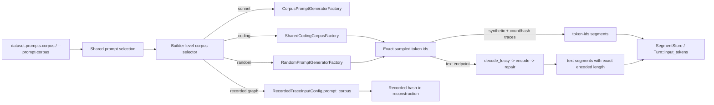

<!--
SPDX-FileCopyrightText: Copyright (c) 2025-2026 NVIDIA CORPORATION & AFFILIATES. All rights reserved.
SPDX-License-Identifier: Apache-2.0
-->

# Prompt corpus selection

## Purpose

Define the named prompt-corpus seam used by every path that synthesizes prompt
content from token counts or hash identities. The authored field is
`dataset.prompts.corpus`, surfaced on the CLI as `--prompt-corpus`.
`dataset.synthesis` remains the home for structural/timing transforms such as
prefix multipliers, caps, idle-gap handling, and dataset wrapping; it does not
own prompt-corpus selection.

## Current design

### Shared authored surface

The parent dataset/input object owns prompt-corpus selection:

- synthetic datasets author it in `SyntheticPromptsSpec.corpus`;
- file and public dataset specs author it through a shared `prompts` object;
- direct recorded-graph inputs lower that same `prompts.corpus` field when they
  synthesize message content from recorded hash identities.

The builder layer resolves the authored value once and passes it through the
shared runtime seams:

- `ComposeConfig.prompt_generator` for synthetic datasets and count/hash-based
  trace loaders;
- `RecordedTraceInputConfig.prompt_corpus` for recorded-graph reconstruction.

Individual composers and graph adapters do not parse corpus strings
independently.

### Eligible consumers

`prompts.corpus` is honored only where prompt content is synthesized rather than
replayed verbatim:

- synthetic datasets;
- count/hash-based file trace loaders such as `mooncake_trace`,
  `bailian_trace`, and `burst_gpt`;
- recorded-graph adapters such as `weka_trace`, `dynamo_trace`, and
  `aiperf_trace`.

### Verbatim-text loaders

Datasets that already carry real authored text, message arrays, or raw request
bodies skip this seam. Examples include `baseten_trace`, `single_turn`,
`multi_turn`, `sharegpt`, `raw_payload`, and similar loaders that replay prompt
content verbatim.

### Supported values and defaults

Supported authored values are:

- `sonnet`: the embedded Shakespeare corpus;
- `coding`: the seeded procedural coding/tool/conversation corpus;
- `random`: tokenizer-driven synthetic generation.

When omitted:

- synthetic datasets and count/hash-based file traces preserve the normal
  sonnet default through `CorpusPromptGeneratorFactory::default()`;
- recorded-graph reconstruction preserves the existing `coding` default.

### Coding corpus contract

`coding` is a seeded structural corpus, not a static embedded text file. It is
built from the shared template families under `rust/runtime/src/dataset/coding/`
that produce code, tool-use transcripts, CI output, JSON, SQL, config
fragments, and multi-turn conversation text. For one tokenizer and root seed,
corpus construction is deterministic.

Synthetic generation and recorded reconstruction share the same seeded coding
corpus implementation; there is no recorded-only fork.

### Random generator contract

`random` is a tokenizer-driven generator, not arbitrary bytes and not free-form
English text. For a selected `TextTokenizer` and `RngRoot`, the generator:

- sample deterministic token sequences of exact requested length;
- preserve exact-length block reuse when `hash_ids` and `block_size` are
  supplied;
- memoize per-hash block content within one generator instance so identical
  recorded blocks and synthetic prefix blocks stay stable inside one run;
- avoid terminal special tokens that would make token-native requests invalid,
  especially EOS.

The random generator is another implementation of the existing
`PromptGenerator` seam; callers do not get a parallel prompt-generation API.

### Exactness by endpoint mode

Raw-token endpoints remain the authoritative exact-id path.
`generate_token_ids` returns the exact ids to intern in a `token-ids` segment,
and `Turn::input_tokens` equals that vector length.

Ordinary text endpoints must also hit the authored ISL exactly. The generator
therefore owns a bounded decode/re-encode repair loop:

1. Sample a deterministic token sequence of the target length.
2. Decode with `decode_lossy` when strict decode is unavailable.
3. Re-encode with the selected `TextTokenizer`.
4. If the encoded length differs, deterministically trim or extend with more
   sampled ids and retry until the encoded length matches the target or the
   bound is exhausted.

Success guarantees exact token counts on the text actually sent. It does not
require the final re-encoded ids to equal the first sampled raw-token sequence
byte-for-byte; count exactness and determinism are the contract for text mode.

The repair loop runs before timed execution and uses whichever tokenizer
implementation is configured, including network-backed tokenizer adapters, so
correctness stays with the tokenizer seam even when preparation is slower.

### Validation and failures

- `corpus: sonnet`, `corpus: coding`, and `corpus: random` all require the same
  tokenizer-backed prompt-generation seam used by synthetic and count/hash-based
  trace synthesis today.
- Requested token length must stay positive.
- Hash-id reuse still requires `block_size > 0` and compatible final-block
  sizing.
- If a tokenizer exposes no usable non-terminal token space for raw-token
  sampling, fail with a tokenizer error naming the tokenizer.
- If text-mode repair cannot reach the requested length within the bounded
  attempts, fail closed with a validation/tokenizer error naming the tokenizer
  and target ISL; never silently approximate.

### Data flow

### Verification

Because this changes dataset generation semantics, implementation requires both
focused seam coverage and an end-to-end mock-server run that inspects raw
per-record output.

- Unit and seam tests:
  - synthetic, file, and public dataset parsing plus CLI/YAML projection of
    `prompts.corpus`;
  - deterministic `coding` corpus construction under a fixed seed;
  - deterministic random generation under a fixed seed;
  - exact raw-token length, EOS avoidance, and block/hash reuse stability;
  - text-mode repair reaching exact ISL for built-in tokenizers;
  - clear failure when repair bounds are exhausted.
- Integration tests:
  - `--prompt-corpus coding` produces deterministic prompt content for a fixed
    seed and exact `input_tokens`;
  - text endpoint path records exact `input_tokens` and emits the expected
    prompt count;
  - raw-token endpoint path interns `token-ids` bodies directly and preserves
    exact counts;
  - prefix reuse with `random` preserves shared leading token runs at the
    requested reuse ratio.
- Product end-to-end coverage:
  - run the real `aiperf` binary against `aiperf-mock-server` with
    `--prompt-corpus random`;
  - inspect per-record output for exact ISL/OSL, streaming mode, status, and
    content presence;
  - include one token-native endpoint case and one ordinary text endpoint case.
- Recorded-graph coverage:
  - parser accepts `prompts.corpus: random`;
  - deterministic hash-id reuse reproduces stable block content across repeated
    requests.

## Source anchors

- `rust/runtime/src/dataset/prompt.rs` (`PromptGenerator`,
  `PromptGeneratorFactory`, `CorpusPromptGeneratorFactory`).
- `rust/runtime/src/dataset/corpus.rs` (embedded built corpora and corpus
  tokenization helpers).
- `rust/runtime/src/dataset/coding/` (shared procedural coding corpus).
- `rust/runtime/src/dataset/loader/synthetic.rs` (`SyntheticComposer`, raw-token
  and text composition branches, prefix reuse).
- `rust/runtime/src/dataset/loader/trace.rs` (count/hash-based trace composers
  using `ComposeConfig.prompt_generator`).
- `rust/runtime/src/dataset/tokenizer.rs` (`TextTokenizer`, `decode_lossy`,
  tokenizer identity and vocabulary helpers).
- `rust/runtime/src/engine/dataset_input.rs` (`SyntheticPromptsSpec`,
  `PromptSelectionSpec`, dataset decode).
- `rust/cli/src/model/dataset.rs` (typed dataset surfaces and shared
  `prompts.corpus` serialization).
- `rust/cli/src/flags.rs`, `rust/cli/src/load.rs`, and `rust/cli/src/yaml.rs`
  (CLI and YAML projection into the typed dataset model).
- `rust/runtime/src/graph/recorded/` and `rust/runtime/src/engine/graph_input.rs`
  (recorded-trace corpus selection and compilation).
- `rust/runtime/src/rng/` (deterministic seed derivation and RNG namespaces).
