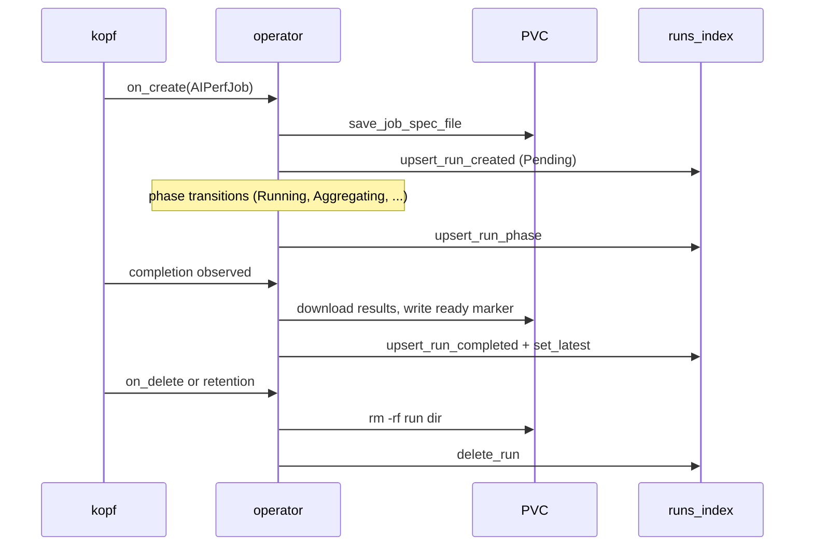

# Fast Job + Sweep Index Implementation Plan

> **For agentic workers:** REQUIRED SUB-SKILL: Use superpowers:subagent-driven-development (recommended) or superpowers:executing-plans to implement this plan task-by-task. Steps use checkbox (`- [ ]`) syntax for tracking.

**Goal:** Replace the `jobs_index.json` cache and the DuckDB JSON-glob analytics path with a single SQLite index at `<RESULTS.DIR>/.aiperf_index.sqlite` covering both runs and sweep variations, so dashboard / leaderboard / history / compare / file-listing queries answer in O(1) instead of scanning every run dir.

**Architecture:** One SQLite DB, WAL mode, one writer (the operator's kopf-owning process), many readers. Two tables (`runs`, `sweep_variations`) carry the six DEFAULT_COMPARE_METRICS as flat columns plus a zstd `metrics_json` blob for full summary access. Read sites in `results_layout`, `results_db`, `routers/results_files` go index-first with disk fallback + lazy backfill so a stale index degrades to slower, never wrong. Bootstrap on operator startup populates the DB from existing PVC contents.

**Tech Stack:** Python 3.10+, `aiosqlite` (new dep), `zstandard` (already in deps), SQLite WAL mode, pytest + pytest-asyncio, kopf handlers, FastAPI routers, cyclopts CLI subcommands.

**Spec:** `docs/superpowers/specs/2026-04-29-fast-job-sweep-index-design.md`

**Branch:** `ajc/k8s` (commit on this branch — do NOT spin off a feature branch).

---

## Conventions for every task

- **TDD always.** Write the failing test, run it to confirm failure, write the minimal implementation, run it to confirm pass, run the wider test suite once, commit.
- **One pytest invocation per task** for unit tests: `uv run pytest -n auto tests/unit/`. For component-integration tasks: `uv run pytest -n auto -m component_integration`. Never run two pytest commands in one task — run the broadest one that covers your changes.
- **Commit on `ajc/k8s`.** Conventional commits with scope `(operator)`, `(test)`, `(docs)`. Trailer: `Co-Authored-By: Claude Opus 4.7 (1M context) <noreply@anthropic.com>`.
- **No `--no-verify`.** This is the python aiperf repo (not aiperf-rs); pre-commit hooks must pass.
- **Project conventions:** `Field(description=...)` on every Pydantic field, type hints everywhere, `X | None` not `Optional[X]`, `orjson` not `json`, no emojis, no `# what` comments — only `# why` when non-obvious.
- **`AIPerfBaseModel`** for data classes that need serialization; `@dataclass(slots=True)` for hot-path inner models. Read `docs/dev/patterns.md` if you're unsure.

---

## File structure

**New files:**

| Path | Responsibility |
|---|---|
| `src/aiperf/operator/runs_index.py` | Schema, connection management, write API, read API, analytics queries, bootstrap, lazy backfill, integrity-check + corruption recovery. The single owner of the SQLite DB. |
| `src/aiperf/operator/runs_index_models.py` | `RunIndexRow`, `SweepVariationRow`, `BootstrapStats` data models (`AIPerfBaseModel` subclasses). |
| `src/aiperf/operator/job_spec_file.py` | Standalone home for `save_job_spec_file()` extracted from the deleted `job_index.py`. Unrelated to the index — writes a self-describing `job_spec.json` per run dir. |
| `src/aiperf/operator/routers/admin.py` | `GET /admin/index/stats`, `POST /admin/index/rebuild`. |
| `src/aiperf/cli_commands/kube/index.py` | `aiperf kube index rebuild` subcommand. |
| `tests/unit/operator/test_runs_index.py` | Schema + write API + read API + bootstrap + corruption recovery unit tests. |
| `tests/unit/operator/test_job_spec_file.py` | Unit tests for the extracted `save_job_spec_file`. |
| `tests/component_integration/operator/test_runs_index_handlers.py` | Drives create→completion→delete handlers + lazy fallback. |

**Modified files:**

| Path | Change |
|---|---|
| `pyproject.toml` | Add `aiosqlite>=0.19.0` dep. |
| `src/aiperf/operator/handlers/create.py` | Replace `index_job_created` call with `runs_index.upsert_run_created`; keep `save_job_spec_file` (now imported from new module). |
| `src/aiperf/operator/handlers/completion.py` | Replace `index_job_completed` call with `runs_index.upsert_run_completed` + `runs_index.set_latest`; reuse `_update_job_index_safe` shape. |
| `src/aiperf/operator/handlers/cleanup.py` | Add `runs_index.delete_run` on per-job cleanup. |
| `src/aiperf/operator/handlers/sweep/child_rollup.py` | On parent phase → terminal, ingest sweep aggregate via `runs_index.upsert_sweep_variation` + `mark_sweep_pareto`. |
| `src/aiperf/operator/handlers/lifecycle.py` | Add `runs_index.upsert_run_phase` on phase observation. |
| `src/aiperf/operator/results_layout.py` | Wrap `list_runs`, `list_sweep_epochs` with index-first + lazy fallback; rename existing impls to `_list_runs_from_disk`, `_list_sweep_epochs_from_disk`; call `runs_index.delete_run` from `enforce_retention`. |
| `src/aiperf/operator/results_db.py` | Phase B: replace DuckDB JSON-glob queries with `runs_index.{leaderboard,history,compare}` calls; `summary` reads `metrics_json` blob. Drop DuckDB import + `_find_summary_files`, `_extract_job_path_parts`, `_latest_epoch_filter`, `_epoch_clause`, `_summarize_telemetry`. |
| `src/aiperf/operator/routers/results_files.py` | Swap "all jobs latest" walk for `runs_index.list_all_latest`. Update the docstring nit referencing `operator/job_index.py`. |
| `src/aiperf/operator/routers/results_analytics.py` | Replace `from aiperf.operator.job_index import get_index, get_job_spec` with `runs_index` equivalents. |
| `src/aiperf/operator/main.py` | Open `runs_index` and schedule `bootstrap()` at operator startup; close on shutdown. |
| `src/aiperf/cli_commands/kube/_app.py` | Register `index` subcommand group. |
| `src/aiperf/operator/dashboard_mount.py` (or wherever routers wire up) | Mount `routers/admin.py`. |
| `tests/unit/operator/test_create_handler.py` | Patch new symbol path (`runs_index.upsert_run_created`). |
| `tests/unit/operator/test_completion_handler.py` | Patch new symbol path. |
| `tests/kubernetes/test_kueue_integration.py` | Patch new symbol path. |
| `tests/kubernetes/audit/` | Add `index_consistency` bucket to existing audit. |
| `CLAUDE.md` + `AGENTS.md` + `.github/copilot-instructions.md` + `.cursor/rules/python.mdc` | New "Run/sweep index" subsection (sync-required). |
| `docs/dev/kubernetes-flow.md` | Sequence diagram + paragraph on index writes. |
| `docs/kubernetes/results-api.md` | Note analytics are now index-backed. |
| `llms.txt` | One-line entry. |

**Deleted files:**

| Path | Why |
|---|---|
| `src/aiperf/operator/job_index.py` | Superseded by `runs_index.py` + `job_spec_file.py`. |
| `tests/unit/operator/test_job_index.py` | Tests deleted module. |

---

# Phase A — Index core

## Task 1: Schema, connection, integrity check

**Files:**
- Create: `src/aiperf/operator/runs_index_models.py`
- Create: `src/aiperf/operator/runs_index.py`
- Create: `tests/unit/operator/test_runs_index.py`
- Modify: `pyproject.toml`

- [ ] **Step 1: Add `aiosqlite` dependency**

```bash
uv add 'aiosqlite>=0.19.0'
```

Expected: `pyproject.toml` shows `"aiosqlite>=0.19.0"` in `dependencies`. `uv.lock` updated.

- [ ] **Step 2: Create `runs_index_models.py` with row dataclasses**

```python
# src/aiperf/operator/runs_index_models.py
# SPDX-FileCopyrightText: Copyright (c) 2025-2026 NVIDIA CORPORATION & AFFILIATES. All rights reserved.
# SPDX-License-Identifier: Apache-2.0
"""Row dataclasses for the runs/sweep_variations SQLite index.

Plain ``@dataclass(slots=True)`` rather than Pydantic — these are constructed
from raw ``sqlite3.Row`` tuples on every read, and the Pydantic overhead would
dominate the query cost we're trying to eliminate.
"""

from __future__ import annotations

from dataclasses import dataclass


@dataclass(slots=True)
class RunIndexRow:
    """One row from the ``runs`` table, hydrated for read API consumers."""

    namespace: str
    job_id: str
    epoch: str
    phase: str
    is_latest: bool
    start_time: str | None
    end_time: str | None
    created_unix: int
    mtime_epoch: int | None
    error: str | None
    model: str | None
    endpoint: str | None
    gpu_count: int
    gpu_name: str | None
    file_count: int
    total_size_bytes: int
    sweep_namespace: str | None
    sweep_name: str | None
    sweep_epoch: str | None
    sweep_variation_idx: int | None


@dataclass(slots=True)
class SweepVariationRow:
    """One row from the ``sweep_variations`` table."""

    namespace: str
    sweep_name: str
    sweep_epoch: str
    variation_idx: int
    mode: str
    phase: str | None
    pareto_rank: int | None
    is_best: bool
    child_namespace: str | None
    child_job_id: str | None
    child_epoch: str | None


@dataclass(slots=True)
class BootstrapStats:
    """Returned from ``runs_index.bootstrap()`` — used by the rebuild CLI."""

    runs_indexed: int
    sweep_variations_indexed: int
    duration_seconds: float
```

- [ ] **Step 3: Write the failing schema-creation test**

```python
# tests/unit/operator/test_runs_index.py
# SPDX-FileCopyrightText: Copyright (c) 2025-2026 NVIDIA CORPORATION & AFFILIATES. All rights reserved.
# SPDX-License-Identifier: Apache-2.0
"""Unit tests for runs_index.py — the SQLite-backed runs + sweep variation index."""

from __future__ import annotations

from pathlib import Path

import pytest

from aiperf.operator import runs_index


@pytest.fixture
async def index_path(tmp_path: Path) -> Path:
    """Open a fresh runs_index DB rooted at tmp_path; close on teardown."""
    path = tmp_path / ".aiperf_index.sqlite"
    await runs_index.open(path)
    yield path
    await runs_index.close()


@pytest.mark.asyncio
async def test_open_creates_schema_idempotently(tmp_path: Path) -> None:
    path = tmp_path / ".aiperf_index.sqlite"
    await runs_index.open(path)
    await runs_index.close()
    assert path.exists()

    # Re-opening must not raise and must not duplicate rows in meta
    await runs_index.open(path)
    schema_version = await runs_index.get_meta("schema_version")
    assert schema_version == "1"
    await runs_index.close()


@pytest.mark.asyncio
async def test_integrity_check_detects_corruption(tmp_path: Path) -> None:
    path = tmp_path / ".aiperf_index.sqlite"
    await runs_index.open(path)
    await runs_index.close()

    # Stomp the file with garbage
    path.write_bytes(b"not a sqlite db")
    ok = await runs_index.integrity_check(path)
    assert ok is False
```

Run: `uv run pytest -n auto tests/unit/operator/test_runs_index.py::test_open_creates_schema_idempotently tests/unit/operator/test_runs_index.py::test_integrity_check_detects_corruption -v`
Expected: FAIL — `ImportError` on `aiperf.operator.runs_index`.

- [ ] **Step 4: Implement `runs_index.py` schema + open/close/integrity**

```python
# src/aiperf/operator/runs_index.py
# SPDX-FileCopyrightText: Copyright (c) 2025-2026 NVIDIA CORPORATION & AFFILIATES. All rights reserved.
# SPDX-License-Identifier: Apache-2.0
"""SQLite-backed index of runs and sweep variations.

Single-writer model: only the operator's kopf-owning process writes; readers
(operator FastAPI workers, results-server sidecar) open the DB read-only.
The single-writer assumption matches the operator's existing single-replica
deployment and the completion-claim mechanic in ``client_cache.py``. If the
operator is ever scaled up, only the kopf-owning process must call write APIs.

The DB lives at ``<RESULTS.DIR>/.aiperf_index.sqlite`` in WAL mode. WAL mode
gives us non-blocking readers across processes; ``BEGIN IMMEDIATE`` plus
``busy_timeout=5000`` serializes writes without explicit locks.

The index is a cache, never a source of truth. Every read site falls back to
a filesystem scan on miss and lazy-backfills the row in the background, so a
corrupt or stale index degrades to slower, never wrong.
"""

from __future__ import annotations

import logging
from pathlib import Path
from typing import Any

import aiosqlite

logger = logging.getLogger(__name__)

SCHEMA_VERSION = 1

_DB: aiosqlite.Connection | None = None
_DB_PATH: Path | None = None

_SCHEMA_V1 = """
CREATE TABLE IF NOT EXISTS runs (
    namespace             TEXT    NOT NULL,
    job_id                TEXT    NOT NULL,
    epoch                 TEXT    NOT NULL,
    phase                 TEXT    NOT NULL,
    is_latest             INTEGER NOT NULL DEFAULT 0,
    start_time            TEXT,
    end_time              TEXT,
    created_unix          INTEGER NOT NULL,
    mtime_epoch           INTEGER,
    error                 TEXT,
    model                 TEXT,
    endpoint              TEXT,
    gpu_count             INTEGER NOT NULL DEFAULT 0,
    gpu_name              TEXT,
    file_count            INTEGER NOT NULL DEFAULT 0,
    total_size_bytes      INTEGER NOT NULL DEFAULT 0,
    spec_json             BLOB,
    request_throughput_avg                       REAL,
    request_throughput_p50                       REAL,
    request_throughput_p99                       REAL,
    request_throughput_unit                      TEXT,
    request_latency_avg                          REAL,
    request_latency_p50                          REAL,
    request_latency_p99                          REAL,
    request_latency_unit                         TEXT,
    time_to_first_token_avg                      REAL,
    time_to_first_token_p50                      REAL,
    time_to_first_token_p99                      REAL,
    time_to_first_token_unit                     TEXT,
    output_token_throughput_avg                  REAL,
    output_token_throughput_p50                  REAL,
    output_token_throughput_p99                  REAL,
    output_token_throughput_unit                 TEXT,
    output_token_throughput_per_user_avg         REAL,
    output_token_throughput_per_user_p50         REAL,
    output_token_throughput_per_user_p99         REAL,
    output_token_throughput_per_user_unit        TEXT,
    inter_token_latency_avg                      REAL,
    inter_token_latency_p50                      REAL,
    inter_token_latency_p99                      REAL,
    inter_token_latency_unit                     TEXT,
    metrics_json          BLOB,
    sweep_namespace       TEXT,
    sweep_name            TEXT,
    sweep_epoch           TEXT,
    sweep_variation_idx   INTEGER,
    PRIMARY KEY (namespace, job_id, epoch)
);

CREATE UNIQUE INDEX IF NOT EXISTS runs_one_latest
    ON runs(namespace, job_id) WHERE is_latest = 1;
CREATE INDEX IF NOT EXISTS runs_model        ON runs(model);
CREATE INDEX IF NOT EXISTS runs_start_time   ON runs(start_time);
CREATE INDEX IF NOT EXISTS runs_sweep_link   ON runs(sweep_namespace, sweep_name, sweep_epoch);

CREATE VIEW IF NOT EXISTS runs_latest AS
    SELECT * FROM runs WHERE is_latest = 1;

CREATE TABLE IF NOT EXISTS sweep_variations (
    namespace             TEXT    NOT NULL,
    sweep_name            TEXT    NOT NULL,
    sweep_epoch           TEXT    NOT NULL,
    variation_idx         INTEGER NOT NULL,
    variation_values_json BLOB    NOT NULL,
    mode                  TEXT    NOT NULL,
    phase                 TEXT,
    pareto_rank           INTEGER,
    is_best               INTEGER NOT NULL DEFAULT 0,
    child_namespace       TEXT,
    child_job_id          TEXT,
    child_epoch           TEXT,
    request_throughput_avg                       REAL,
    request_throughput_p50                       REAL,
    request_throughput_p99                       REAL,
    request_throughput_unit                      TEXT,
    request_latency_avg                          REAL,
    request_latency_p50                          REAL,
    request_latency_p99                          REAL,
    request_latency_unit                         TEXT,
    time_to_first_token_avg                      REAL,
    time_to_first_token_p50                      REAL,
    time_to_first_token_p99                      REAL,
    time_to_first_token_unit                     TEXT,
    output_token_throughput_avg                  REAL,
    output_token_throughput_p50                  REAL,
    output_token_throughput_p99                  REAL,
    output_token_throughput_unit                 TEXT,
    output_token_throughput_per_user_avg         REAL,
    output_token_throughput_per_user_p50         REAL,
    output_token_throughput_per_user_p99         REAL,
    output_token_throughput_per_user_unit        TEXT,
    inter_token_latency_avg                      REAL,
    inter_token_latency_p50                      REAL,
    inter_token_latency_p99                      REAL,
    inter_token_latency_unit                     TEXT,
    metrics_json          BLOB,
    PRIMARY KEY (namespace, sweep_name, sweep_epoch, variation_idx)
);

CREATE INDEX IF NOT EXISTS sweep_variations_best   ON sweep_variations(sweep_name, is_best);
CREATE INDEX IF NOT EXISTS sweep_variations_pareto ON sweep_variations(pareto_rank);

CREATE TABLE IF NOT EXISTS meta (
    key   TEXT PRIMARY KEY,
    value TEXT NOT NULL
);
"""


async def open(path: Path) -> None:
    """Open the DB at ``path``, creating + migrating schema as needed.

    Idempotent — calling twice is safe and does not duplicate state.
    """
    global _DB, _DB_PATH

    if _DB is not None:
        return

    path.parent.mkdir(parents=True, exist_ok=True)
    db = await aiosqlite.connect(str(path), isolation_level=None)
    await db.execute("PRAGMA journal_mode = WAL")
    await db.execute("PRAGMA synchronous = NORMAL")
    await db.execute("PRAGMA busy_timeout = 5000")
    await db.executescript(_SCHEMA_V1)

    cur = await db.execute("SELECT value FROM meta WHERE key = 'schema_version'")
    row = await cur.fetchone()
    await cur.close()
    if row is None:
        await db.execute(
            "INSERT INTO meta(key, value) VALUES ('schema_version', ?)",
            (str(SCHEMA_VERSION),),
        )
    else:
        # Forward-only migrations live here when SCHEMA_VERSION bumps.
        # Today: only v1, no migration needed.
        existing = int(row[0])
        if existing > SCHEMA_VERSION:
            raise RuntimeError(
                f"runs_index DB at {path} has schema_version={existing} but this "
                f"build only knows up to {SCHEMA_VERSION}. Refusing to open."
            )

    _DB = db
    _DB_PATH = path
    logger.info("runs_index opened at %s (schema_version=%d)", path, SCHEMA_VERSION)


async def close() -> None:
    """Close the DB. Safe to call when never opened."""
    global _DB, _DB_PATH
    if _DB is not None:
        await _DB.close()
    _DB = None
    _DB_PATH = None


def _conn() -> aiosqlite.Connection:
    if _DB is None:
        raise RuntimeError("runs_index.open() has not been called")
    return _DB


async def get_meta(key: str) -> str | None:
    """Read a single ``meta`` row by key."""
    cur = await _conn().execute("SELECT value FROM meta WHERE key = ?", (key,))
    row = await cur.fetchone()
    await cur.close()
    return row[0] if row else None


async def set_meta(key: str, value: str) -> None:
    """Upsert a single ``meta`` row."""
    await _conn().execute(
        "INSERT INTO meta(key, value) VALUES(?, ?) "
        "ON CONFLICT(key) DO UPDATE SET value = excluded.value",
        (key, value),
    )


async def integrity_check(path: Path | None = None) -> bool:
    """Run ``PRAGMA integrity_check`` against ``path`` (or the open DB).

    Returns False on any failure mode (file unreadable, not a SQLite DB,
    PRAGMA returns anything other than ``ok``). Used at startup to drive
    corruption recovery — never raises.
    """
    target = path or _DB_PATH
    if target is None:
        return False
    try:
        async with aiosqlite.connect(str(target)) as db:
            cur = await db.execute("PRAGMA integrity_check")
            rows = await cur.fetchall()
            await cur.close()
        return rows == [("ok",)]
    except (aiosqlite.Error, OSError) as exc:
        logger.warning("integrity_check failed for %s: %s", target, exc)
        return False
```

- [ ] **Step 5: Run unit tests**

Run: `uv run pytest -n auto tests/unit/operator/test_runs_index.py -v`
Expected: PASS — both schema-idempotency and integrity-check tests green.

- [ ] **Step 6: Commit**

```bash
git add pyproject.toml uv.lock src/aiperf/operator/runs_index.py src/aiperf/operator/runs_index_models.py tests/unit/operator/test_runs_index.py
git commit -m "$(cat <<'EOF'
feat(operator): runs_index module skeleton (schema, open/close, integrity)

Adds aiosqlite dependency and the SQLite schema for runs +
sweep_variations + meta tables with the partial-unique index that
enforces one is_latest=1 row per (namespace, job_id). Connection
management is module-global single-writer per the spec; integrity_check
opens read-only and never raises.

Co-Authored-By: Claude Opus 4.7 (1M context) <noreply@anthropic.com>
EOF
)"
```

---

## Task 2: Run-row write API (created, phase, completed, failed, set_latest, delete)

**Files:**
- Modify: `src/aiperf/operator/runs_index.py`
- Modify: `tests/unit/operator/test_runs_index.py`

- [ ] **Step 1: Write the failing tests**

Append to `tests/unit/operator/test_runs_index.py`:

```python
import asyncio

import orjson
import pytest
import zstandard

from aiperf.operator.runs_index_models import RunIndexRow


@pytest.mark.asyncio
async def test_upsert_run_created_inserts_row(index_path) -> None:
    spec = {"benchmark": {"models": {"items": [{"name": "llama-3"}]},
                          "endpoint": {"urls": ["http://server:8000"]}}}
    await runs_index.upsert_run_created("ns", "job-a", "1714069323", spec=spec)

    row = await runs_index.get_run("ns", "job-a", "1714069323")
    assert row is not None
    assert row.phase == "Pending"
    assert row.model == "llama-3"
    assert row.endpoint == "http://server:8000"
    assert row.is_latest is False  # not flipped yet


@pytest.mark.asyncio
async def test_upsert_run_phase_updates_only_phase(index_path) -> None:
    await runs_index.upsert_run_created("ns", "j", "100", spec={})
    await runs_index.upsert_run_phase("ns", "j", "100", phase="Running")

    row = await runs_index.get_run("ns", "j", "100")
    assert row.phase == "Running"
    assert row.end_time is None  # completion didn't happen


@pytest.mark.asyncio
async def test_upsert_run_completed_populates_metrics_and_blob(index_path) -> None:
    await runs_index.upsert_run_created("ns", "j", "100", spec={})

    metrics = {
        "request_throughput": {"avg": 42.5, "p50": 40.0, "p99": 50.0, "unit": "rps"},
        "request_latency": {"avg": 0.123, "p50": 0.1, "p99": 0.2, "unit": "s"},
        "telemetry_data": {"endpoints": {"e1": {"gpus": {"g1": {"gpu_name": "H100"},
                                                        "g2": {"gpu_name": "H100"}}}}},
    }
    summary_blob = zstandard.ZstdCompressor().compress(orjson.dumps(metrics))

    await runs_index.upsert_run_completed(
        "ns", "j", "100",
        summary_blob=summary_blob, metrics=metrics,
        files=["a.json", "b.parquet"], mtime_epoch=1714069400, end_time="2024-04-25T18:23:20Z",
    )

    row = await runs_index.get_run("ns", "j", "100")
    assert row.phase == "Succeeded"
    assert row.file_count == 2
    assert row.gpu_count == 2
    assert row.gpu_name == "H100"
    assert row.mtime_epoch == 1714069400

    blob = await runs_index.get_summary_blob("ns", "j", "100")
    assert orjson.loads(zstandard.ZstdDecompressor().decompress(blob))["request_throughput"]["avg"] == 42.5


@pytest.mark.asyncio
async def test_upsert_run_failed_records_error(index_path) -> None:
    await runs_index.upsert_run_created("ns", "j", "100", spec={})
    await runs_index.upsert_run_failed("ns", "j", "100", error="OOMKilled", phase="Failed")

    row = await runs_index.get_run("ns", "j", "100")
    assert row.phase == "Failed"
    assert row.error == "OOMKilled"


@pytest.mark.asyncio
async def test_set_latest_flips_one_row_only(index_path) -> None:
    for ep in ("100", "200", "300"):
        await runs_index.upsert_run_created("ns", "j", ep, spec={})
    await runs_index.set_latest("ns", "j", "200")

    rows = await runs_index.list_runs_for_job("ns", "j")
    latest = [r for r in rows if r.is_latest]
    assert len(latest) == 1
    assert latest[0].epoch == "200"

    # Re-pointing must atomically clear the prior is_latest
    await runs_index.set_latest("ns", "j", "300")
    rows = await runs_index.list_runs_for_job("ns", "j")
    assert sum(1 for r in rows if r.is_latest) == 1
    assert next(r for r in rows if r.is_latest).epoch == "300"


@pytest.mark.asyncio
async def test_delete_run_removes_row(index_path) -> None:
    await runs_index.upsert_run_created("ns", "j", "100", spec={})
    await runs_index.delete_run("ns", "j", "100")
    assert await runs_index.get_run("ns", "j", "100") is None


@pytest.mark.asyncio
async def test_concurrent_upsert_no_clobber(index_path) -> None:
    """The bug ``_index_lock`` papered over for jobs_index.json must not regress."""
    await runs_index.upsert_run_created("ns", "j", "100", spec={})

    await asyncio.gather(*[
        runs_index.upsert_run_phase("ns", "j", "100", phase=p)
        for p in ("Running", "Aggregating", "Running", "Succeeded")
    ])

    # All four upserts must have written the row exactly once each — final
    # phase is one of the four, no row duplication, no missing row.
    rows = await runs_index.list_runs_for_job("ns", "j")
    assert len(rows) == 1
    assert rows[0].phase in {"Running", "Aggregating", "Succeeded"}
```

- [ ] **Step 2: Run tests to confirm failure**

Run: `uv run pytest -n auto tests/unit/operator/test_runs_index.py -v`
Expected: FAIL — `AttributeError: module 'aiperf.operator.runs_index' has no attribute 'upsert_run_created'`.

- [ ] **Step 3: Implement run-row write API in `runs_index.py`**

Append to `src/aiperf/operator/runs_index.py`:

```python
import time
from typing import Any

import orjson
import zstandard

from aiperf.operator.runs_index_models import RunIndexRow

_NARROW_METRICS = (
    "request_throughput",
    "request_latency",
    "time_to_first_token",
    "output_token_throughput",
    "output_token_throughput_per_user",
    "inter_token_latency",
)


def _summarize_telemetry(telemetry: Any) -> tuple[int, str | None]:
    """Extract (gpu_count, representative_gpu_name) from a telemetry payload.

    Equivalent to the legacy ``_summarize_telemetry`` in results_db.py — moved
    to the write side so analytics never parse telemetry per request.
    """
    if not telemetry:
        return 0, None
    endpoints = telemetry.get("endpoints") or {}
    if not isinstance(endpoints, dict):
        return 0, None
    count = 0
    name: str | None = None
    for ep in endpoints.values():
        gpus = (ep or {}).get("gpus") or {}
        if not isinstance(gpus, dict):
            continue
        count += len(gpus)
        if name is None:
            for gpu in gpus.values():
                if gpu and gpu.get("gpu_name"):
                    name = gpu["gpu_name"]
                    break
    return count, name


def _extract_model_endpoint(spec: dict[str, Any]) -> tuple[str | None, str | None]:
    """Pull (model_name, endpoint_url) out of a CR spec, tolerant of shape variance."""
    benchmark = spec.get("benchmark", spec)
    endpoint_cfg = benchmark.get("endpoint", {}) or {}
    models_cfg = benchmark.get("models", {}) or {}
    if isinstance(models_cfg, list):
        items = models_cfg
    else:
        items = models_cfg.get("items", models_cfg.get("modelNames", [])) or []
    model: str | None = None
    if isinstance(items, list) and items:
        first = items[0]
        model = first.get("name", first) if isinstance(first, dict) else str(first)
    urls = endpoint_cfg.get("urls", endpoint_cfg.get("url", []))
    endpoint = (
        urls[0] if isinstance(urls, list) and urls
        else (urls if isinstance(urls, str) else None)
    )
    return model, endpoint


def _zstd_compress(payload: dict[str, Any]) -> bytes:
    return zstandard.ZstdCompressor().compress(orjson.dumps(payload))


def _narrow_metric_columns(metrics: dict[str, Any]) -> dict[str, Any]:
    """Flatten the six DEFAULT_COMPARE_METRICS into the 24 flat-column dict."""
    out: dict[str, Any] = {}
    for name in _NARROW_METRICS:
        m = metrics.get(name) or {}
        out[f"{name}_avg"] = m.get("avg")
        out[f"{name}_p50"] = m.get("p50")
        out[f"{name}_p99"] = m.get("p99")
        out[f"{name}_unit"] = m.get("unit")
    return out


async def upsert_run_created(
    namespace: str, job_id: str, epoch: str, *, spec: dict[str, Any]
) -> None:
    """Insert (or refresh-on-conflict) the row for a newly-observed AIPerfJob.

    Sets ``phase='Pending'`` and ``created_unix=now``. Pre-existing fields
    populated by a previous completion (e.g. on operator restart) are preserved
    via ``COALESCE`` so an out-of-order create event after completion does not
    erase metrics.
    """
    model, endpoint = _extract_model_endpoint(spec)
    spec_blob = _zstd_compress(spec)
    now = int(time.time())
    await _conn().execute(
        """
        INSERT INTO runs (
            namespace, job_id, epoch, phase, is_latest, created_unix,
            model, endpoint, spec_json
        )
        VALUES (?, ?, ?, 'Pending', 0, ?, ?, ?, ?)
        ON CONFLICT(namespace, job_id, epoch) DO UPDATE SET
            model      = COALESCE(runs.model, excluded.model),
            endpoint   = COALESCE(runs.endpoint, excluded.endpoint),
            spec_json  = COALESCE(runs.spec_json, excluded.spec_json)
        """,
        (namespace, job_id, epoch, now, model, endpoint, spec_blob),
    )


async def upsert_run_phase(
    namespace: str, job_id: str, epoch: str, *, phase: str
) -> None:
    """Update phase only — no metric or completion-time mutation.

    Inserts a stub row if the create event was missed (e.g. controller saw
    the job before the operator did).
    """
    now = int(time.time())
    await _conn().execute(
        """
        INSERT INTO runs (namespace, job_id, epoch, phase, created_unix)
        VALUES (?, ?, ?, ?, ?)
        ON CONFLICT(namespace, job_id, epoch) DO UPDATE SET phase = excluded.phase
        """,
        (namespace, job_id, epoch, phase, now),
    )


async def upsert_run_completed(
    namespace: str, job_id: str, epoch: str, *,
    summary_blob: bytes,
    metrics: dict[str, Any],
    files: list[str],
    mtime_epoch: int,
    end_time: str | None = None,
    start_time: str | None = None,
    total_size_bytes: int = 0,
    phase: str = "Succeeded",
) -> None:
    """Record the post-run state: phase, metrics, blob, file inventory."""
    gpu_count, gpu_name = _summarize_telemetry(metrics.get("telemetry_data"))
    narrow = _narrow_metric_columns(metrics)

    cols = [
        "namespace", "job_id", "epoch", "phase", "created_unix",
        "start_time", "end_time", "mtime_epoch",
        "gpu_count", "gpu_name", "file_count", "total_size_bytes",
        "metrics_json",
    ]
    vals: list[Any] = [
        namespace, job_id, epoch, phase, int(time.time()),
        start_time, end_time, mtime_epoch,
        gpu_count, gpu_name, len(files), total_size_bytes,
        summary_blob,
    ]
    for k, v in narrow.items():
        cols.append(k)
        vals.append(v)

    placeholders = ", ".join("?" * len(cols))
    update_assignments = ", ".join(
        f"{c} = excluded.{c}"
        for c in cols
        if c not in ("namespace", "job_id", "epoch", "created_unix")
    )

    sql = (
        f"INSERT INTO runs ({', '.join(cols)}) VALUES ({placeholders}) "
        f"ON CONFLICT(namespace, job_id, epoch) DO UPDATE SET {update_assignments}"
    )
    await _conn().execute(sql, vals)


async def upsert_run_failed(
    namespace: str, job_id: str, epoch: str, *, error: str, phase: str = "Failed"
) -> None:
    """Record a failure — phase + error string, end_time stamped now."""
    now = int(time.time())
    await _conn().execute(
        """
        INSERT INTO runs (namespace, job_id, epoch, phase, error, created_unix, end_time)
        VALUES (?, ?, ?, ?, ?, ?, datetime('now'))
        ON CONFLICT(namespace, job_id, epoch) DO UPDATE SET
            phase    = excluded.phase,
            error    = excluded.error,
            end_time = excluded.end_time
        """,
        (namespace, job_id, epoch, phase, error, now),
    )


async def set_latest(namespace: str, job_id: str, epoch: str) -> None:
    """Atomically flip ``is_latest`` so exactly one row per (ns, job) is latest.

    Uses a single transaction: clear all is_latest rows for the job, then set
    the target. The ``runs_one_latest`` partial unique index turns any race
    into a hard error rather than silent dual-latest.
    """
    db = _conn()
    await db.execute("BEGIN IMMEDIATE")
    try:
        await db.execute(
            "UPDATE runs SET is_latest = 0 WHERE namespace = ? AND job_id = ? AND is_latest = 1",
            (namespace, job_id),
        )
        await db.execute(
            "UPDATE runs SET is_latest = 1 WHERE namespace = ? AND job_id = ? AND epoch = ?",
            (namespace, job_id, epoch),
        )
        await db.execute("COMMIT")
    except Exception:
        await db.execute("ROLLBACK")
        raise


async def delete_run(namespace: str, job_id: str, epoch: str) -> None:
    """Remove one run row. Used by retention and on_delete handlers."""
    await _conn().execute(
        "DELETE FROM runs WHERE namespace = ? AND job_id = ? AND epoch = ?",
        (namespace, job_id, epoch),
    )


async def get_run(
    namespace: str, job_id: str, epoch: str
) -> RunIndexRow | None:
    cur = await _conn().execute(
        f"SELECT {_RUN_ROW_COLS} FROM runs WHERE namespace = ? AND job_id = ? AND epoch = ?",
        (namespace, job_id, epoch),
    )
    row = await cur.fetchone()
    await cur.close()
    return _row_to_run(row) if row else None


async def list_runs_for_job(namespace: str, job_id: str) -> list[RunIndexRow]:
    cur = await _conn().execute(
        f"SELECT {_RUN_ROW_COLS} FROM runs WHERE namespace = ? AND job_id = ? "
        "ORDER BY mtime_epoch DESC NULLS LAST, epoch DESC",
        (namespace, job_id),
    )
    rows = await cur.fetchall()
    await cur.close()
    return [_row_to_run(r) for r in rows]


async def get_summary_blob(
    namespace: str, job_id: str, epoch: str
) -> bytes | None:
    cur = await _conn().execute(
        "SELECT metrics_json FROM runs WHERE namespace = ? AND job_id = ? AND epoch = ?",
        (namespace, job_id, epoch),
    )
    row = await cur.fetchone()
    await cur.close()
    return row[0] if row and row[0] else None


_RUN_ROW_COLS = (
    "namespace, job_id, epoch, phase, is_latest, start_time, end_time, "
    "created_unix, mtime_epoch, error, model, endpoint, gpu_count, gpu_name, "
    "file_count, total_size_bytes, sweep_namespace, sweep_name, sweep_epoch, "
    "sweep_variation_idx"
)


def _row_to_run(row: tuple) -> RunIndexRow:
    return RunIndexRow(
        namespace=row[0], job_id=row[1], epoch=row[2], phase=row[3],
        is_latest=bool(row[4]), start_time=row[5], end_time=row[6],
        created_unix=row[7], mtime_epoch=row[8], error=row[9],
        model=row[10], endpoint=row[11], gpu_count=row[12], gpu_name=row[13],
        file_count=row[14], total_size_bytes=row[15],
        sweep_namespace=row[16], sweep_name=row[17], sweep_epoch=row[18],
        sweep_variation_idx=row[19],
    )
```

- [ ] **Step 4: Run tests to confirm pass**

Run: `uv run pytest -n auto tests/unit/operator/test_runs_index.py -v`
Expected: PASS — all run-row write/read tests green.

- [ ] **Step 5: Add a hypothesis property test for upsert reordering**

Append to `test_runs_index.py`:

```python
from hypothesis import given, settings, strategies as st

_PHASE_EVENTS = st.sampled_from(["created", "phase_running", "phase_aggregating", "completed", "failed"])


@settings(max_examples=20, deadline=None)
@given(events=st.lists(_PHASE_EVENTS, min_size=1, max_size=6))
@pytest.mark.asyncio
async def test_upsert_reordering_invariants(tmp_path: Path, events) -> None:
    db = tmp_path / ".aiperf_index.sqlite"
    await runs_index.open(db)
    try:
        for e in events:
            if e == "created":
                await runs_index.upsert_run_created("ns", "j", "100", spec={})
            elif e == "phase_running":
                await runs_index.upsert_run_phase("ns", "j", "100", phase="Running")
            elif e == "phase_aggregating":
                await runs_index.upsert_run_phase("ns", "j", "100", phase="Aggregating")
            elif e == "completed":
                await runs_index.upsert_run_completed(
                    "ns", "j", "100", summary_blob=b"", metrics={},
                    files=[], mtime_epoch=100,
                )
            elif e == "failed":
                await runs_index.upsert_run_failed("ns", "j", "100", error="x")

        # Invariants: exactly one row, phase set, no NULL pk fields
        rows = await runs_index.list_runs_for_job("ns", "j")
        assert len(rows) == 1
        assert rows[0].phase
        assert rows[0].namespace == "ns"
        assert rows[0].job_id == "j"
        assert rows[0].epoch == "100"
    finally:
        await runs_index.close()
```

Run: `uv run pytest -n auto tests/unit/operator/test_runs_index.py::test_upsert_reordering_invariants -v`
Expected: PASS — 20 hypothesis cases all uphold the invariants.

- [ ] **Step 6: Commit**

```bash
git add src/aiperf/operator/runs_index.py tests/unit/operator/test_runs_index.py
git commit -m "$(cat <<'EOF'
feat(operator): runs_index run-row write/read API

upsert_run_created/phase/completed/failed, set_latest with
runs_one_latest partial-unique-index enforcement, delete_run, and
get_run / list_runs_for_job / get_summary_blob readers. Telemetry
GPU summarization moves to write-time so analytics never parse
telemetry per request.

Co-Authored-By: Claude Opus 4.7 (1M context) <noreply@anthropic.com>
EOF
)"
```

---

## Task 3: Sweep-variation write API

**Files:**
- Modify: `src/aiperf/operator/runs_index.py`
- Modify: `tests/unit/operator/test_runs_index.py`

- [ ] **Step 1: Write the failing tests**

Append to `test_runs_index.py`:

```python
@pytest.mark.asyncio
async def test_upsert_sweep_variation_inserts(index_path) -> None:
    metrics = {
        "request_throughput": {"avg": 100.0, "p50": 95.0, "p99": 110.0, "unit": "rps"},
        "request_latency": {"avg": 0.05, "p50": 0.05, "p99": 0.08, "unit": "s"},
    }
    await runs_index.upsert_sweep_variation(
        "ns", "satsweep", "1714069323", 0,
        variation_values={"concurrency": 10},
        mode="REPEATED",
        phase="Succeeded",
        metrics=metrics,
        child_ref=("ns", "satsweep-c10", "1714069324"),
        metrics_blob=b"\x28\xb5\x2f\xfd",  # not real zstd; just a sentinel
    )

    rows = await runs_index.list_sweep_variations("ns", "satsweep", "1714069323")
    assert len(rows) == 1
    assert rows[0].variation_idx == 0
    assert rows[0].mode == "REPEATED"
    assert rows[0].child_job_id == "satsweep-c10"


@pytest.mark.asyncio
async def test_mark_sweep_pareto_sets_ranks_and_best(index_path) -> None:
    for idx in range(3):
        await runs_index.upsert_sweep_variation(
            "ns", "s1", "100", idx,
            variation_values={"concurrency": 10 * (idx + 1)},
            mode="INDEPENDENT", phase="Succeeded", metrics={},
            child_ref=None, metrics_blob=b"",
        )

    await runs_index.mark_sweep_pareto(
        "ns", "s1", "100",
        rankings=[(0, 1, False), (1, 0, True), (2, 2, False)],
    )

    rows = sorted(
        await runs_index.list_sweep_variations("ns", "s1", "100"),
        key=lambda r: r.variation_idx,
    )
    assert rows[0].pareto_rank == 1 and not rows[0].is_best
    assert rows[1].pareto_rank == 0 and rows[1].is_best
    assert rows[2].pareto_rank == 2 and not rows[2].is_best
```

- [ ] **Step 2: Run tests, confirm fail**

Run: `uv run pytest -n auto tests/unit/operator/test_runs_index.py -v`
Expected: FAIL — `AttributeError: upsert_sweep_variation`.

- [ ] **Step 3: Implement sweep-variation write API + reader**

Append to `runs_index.py`:

```python
from aiperf.operator.runs_index_models import SweepVariationRow


async def upsert_sweep_variation(
    namespace: str, sweep_name: str, sweep_epoch: str, variation_idx: int, *,
    variation_values: dict[str, Any],
    mode: str,
    phase: str | None,
    metrics: dict[str, Any],
    child_ref: tuple[str, str, str] | None,
    metrics_blob: bytes,
) -> None:
    """Insert (or update on conflict) one variation row.

    ``child_ref`` is ``(namespace, job_id, epoch)`` of the runs row produced by
    the variation's controller pod, or ``None`` for in-process / aggregate-only
    variations.
    """
    narrow = _narrow_metric_columns(metrics)
    child_ns, child_job, child_epoch = child_ref or (None, None, None)

    cols = [
        "namespace", "sweep_name", "sweep_epoch", "variation_idx",
        "variation_values_json", "mode", "phase",
        "child_namespace", "child_job_id", "child_epoch",
        "metrics_json",
    ]
    vals: list[Any] = [
        namespace, sweep_name, sweep_epoch, variation_idx,
        _zstd_compress(variation_values), mode, phase,
        child_ns, child_job, child_epoch,
        metrics_blob,
    ]
    for k, v in narrow.items():
        cols.append(k)
        vals.append(v)

    placeholders = ", ".join("?" * len(cols))
    update_assignments = ", ".join(
        f"{c} = excluded.{c}"
        for c in cols
        if c not in ("namespace", "sweep_name", "sweep_epoch", "variation_idx")
    )
    sql = (
        f"INSERT INTO sweep_variations ({', '.join(cols)}) VALUES ({placeholders}) "
        f"ON CONFLICT(namespace, sweep_name, sweep_epoch, variation_idx) "
        f"DO UPDATE SET {update_assignments}"
    )
    await _conn().execute(sql, vals)


async def mark_sweep_pareto(
    namespace: str, sweep_name: str, sweep_epoch: str, *,
    rankings: list[tuple[int, int, bool]],
) -> None:
    """Apply ``[(variation_idx, pareto_rank, is_best), ...]`` in one transaction."""
    db = _conn()
    await db.execute("BEGIN IMMEDIATE")
    try:
        for idx, rank, best in rankings:
            await db.execute(
                "UPDATE sweep_variations SET pareto_rank = ?, is_best = ? "
                "WHERE namespace = ? AND sweep_name = ? AND sweep_epoch = ? "
                "AND variation_idx = ?",
                (rank, 1 if best else 0, namespace, sweep_name, sweep_epoch, idx),
            )
        await db.execute("COMMIT")
    except Exception:
        await db.execute("ROLLBACK")
        raise


async def list_sweep_variations(
    namespace: str, sweep_name: str, sweep_epoch: str
) -> list[SweepVariationRow]:
    cur = await _conn().execute(
        "SELECT namespace, sweep_name, sweep_epoch, variation_idx, mode, phase, "
        "       pareto_rank, is_best, child_namespace, child_job_id, child_epoch "
        "FROM sweep_variations "
        "WHERE namespace = ? AND sweep_name = ? AND sweep_epoch = ? "
        "ORDER BY variation_idx ASC",
        (namespace, sweep_name, sweep_epoch),
    )
    rows = await cur.fetchall()
    await cur.close()
    return [
        SweepVariationRow(
            namespace=r[0], sweep_name=r[1], sweep_epoch=r[2], variation_idx=r[3],
            mode=r[4], phase=r[5], pareto_rank=r[6], is_best=bool(r[7]),
            child_namespace=r[8], child_job_id=r[9], child_epoch=r[10],
        )
        for r in rows
    ]


async def list_sweep_epochs_for_sweep(
    namespace: str, sweep_name: str
) -> list[str]:
    cur = await _conn().execute(
        "SELECT DISTINCT sweep_epoch FROM sweep_variations "
        "WHERE namespace = ? AND sweep_name = ? ORDER BY sweep_epoch DESC",
        (namespace, sweep_name),
    )
    rows = await cur.fetchall()
    await cur.close()
    return [r[0] for r in rows]
```

- [ ] **Step 4: Run tests, confirm pass**

Run: `uv run pytest -n auto tests/unit/operator/test_runs_index.py -v`
Expected: PASS.

- [ ] **Step 5: Commit**

```bash
git add src/aiperf/operator/runs_index.py src/aiperf/operator/runs_index_models.py tests/unit/operator/test_runs_index.py
git commit -m "$(cat <<'EOF'
feat(operator): runs_index sweep-variation write/read API

upsert_sweep_variation, mark_sweep_pareto in one transaction,
list_sweep_variations / list_sweep_epochs_for_sweep readers.

Co-Authored-By: Claude Opus 4.7 (1M context) <noreply@anthropic.com>
EOF
)"
```

---

## Task 4: Read API — list_all_latest

**Files:**
- Modify: `src/aiperf/operator/runs_index.py`
- Modify: `tests/unit/operator/test_runs_index.py`

- [ ] **Step 1: Write the failing test**

```python
@pytest.mark.asyncio
async def test_list_all_latest_returns_only_latest_rows(index_path) -> None:
    for ns, job, ep in [("a", "j1", "100"), ("a", "j1", "200"),
                        ("a", "j2", "100"), ("b", "j3", "100")]:
        await runs_index.upsert_run_created(ns, job, ep, spec={})
    await runs_index.set_latest("a", "j1", "200")
    await runs_index.set_latest("a", "j2", "100")
    await runs_index.set_latest("b", "j3", "100")

    rows = await runs_index.list_all_latest()
    keys = sorted((r.namespace, r.job_id, r.epoch) for r in rows)
    assert keys == [("a", "j1", "200"), ("a", "j2", "100"), ("b", "j3", "100")]
```

- [ ] **Step 2: Run, confirm fail**

Run: `uv run pytest -n auto tests/unit/operator/test_runs_index.py::test_list_all_latest_returns_only_latest_rows -v`

- [ ] **Step 3: Implement**

Append to `runs_index.py`:

```python
async def list_all_latest() -> list[RunIndexRow]:
    """All ``is_latest=1`` rows, ordered by end_time DESC NULLS LAST."""
    cur = await _conn().execute(
        f"SELECT {_RUN_ROW_COLS} FROM runs WHERE is_latest = 1 "
        "ORDER BY end_time DESC NULLS LAST, created_unix DESC"
    )
    rows = await cur.fetchall()
    await cur.close()
    return [_row_to_run(r) for r in rows]


async def get_latest_run(namespace: str, job_id: str) -> RunIndexRow | None:
    """Return the ``is_latest=1`` row for a job, or None if no latest is set."""
    cur = await _conn().execute(
        f"SELECT {_RUN_ROW_COLS} FROM runs "
        "WHERE namespace = ? AND job_id = ? AND is_latest = 1 LIMIT 1",
        (namespace, job_id),
    )
    row = await cur.fetchone()
    await cur.close()
    return _row_to_run(row) if row else None


async def get_run_spec(
    namespace: str, job_id: str, epoch: str | None = None
) -> dict[str, Any] | None:
    """Decompress and return the CR spec stored in ``runs.spec_json``.

    When ``epoch`` is None, uses the is_latest row. Returns None when no row
    matches or spec_json is null.
    """
    if epoch is None:
        cur = await _conn().execute(
            "SELECT spec_json FROM runs "
            "WHERE namespace = ? AND job_id = ? AND is_latest = 1 LIMIT 1",
            (namespace, job_id),
        )
    else:
        cur = await _conn().execute(
            "SELECT spec_json FROM runs "
            "WHERE namespace = ? AND job_id = ? AND epoch = ?",
            (namespace, job_id, epoch),
        )
    row = await cur.fetchone()
    await cur.close()
    if row is None or row[0] is None:
        return None
    return orjson.loads(zstandard.ZstdDecompressor().decompress(row[0]))
```

- [ ] **Step 4: Run, confirm pass**

Run: `uv run pytest -n auto tests/unit/operator/ -v`
Expected: PASS, full test_runs_index.py green.

- [ ] **Step 5: Commit**

```bash
git add src/aiperf/operator/runs_index.py tests/unit/operator/test_runs_index.py
git commit -m "$(cat <<'EOF'
feat(operator): runs_index list_all_latest reader

Replaces the double-iterdir walk over <base>/<ns>/<job> in
routers/results_files.py.

Co-Authored-By: Claude Opus 4.7 (1M context) <noreply@anthropic.com>
EOF
)"
```

---

## Task 5: Bootstrap + lazy backfill helper

**Files:**
- Modify: `src/aiperf/operator/runs_index.py`
- Modify: `tests/unit/operator/test_runs_index.py`

- [ ] **Step 1: Write failing tests**

Append to test file:

```python
@pytest.mark.asyncio
async def test_bootstrap_walks_pvc_and_indexes_runs(tmp_path: Path) -> None:
    base = tmp_path / "results"
    # <base>/<ns>/<job>/<epoch>/profile_export_aiperf.json + ready marker
    run = base / "ns1" / "job-a" / "1714069323"
    run.mkdir(parents=True)
    (run / "profile_export_aiperf.json").write_bytes(orjson.dumps({
        "request_throughput": {"avg": 5.0, "p50": 5.0, "p99": 6.0, "unit": "rps"},
        "input_config": {"models": {"items": [{"name": "m"}]},
                          "endpoint": {"urls": ["http://e"]}},
    }))
    (run / ".aiperf_results_ready.json").write_text("{}")
    (base / "ns1" / "job-a" / "latest.txt").write_text("1714069323")

    # A sweeps-collision distractor — must be skipped
    (base / "ns1" / "sweeps" / "satsweep" / "1714069324").mkdir(parents=True)

    db_path = tmp_path / ".aiperf_index.sqlite"
    await runs_index.open(db_path)
    try:
        stats = await runs_index.bootstrap(base)
        assert stats.runs_indexed == 1
        rows = await runs_index.list_all_latest()
        assert len(rows) == 1
        assert rows[0].is_latest is True
        assert rows[0].model == "m"
    finally:
        await runs_index.close()


@pytest.mark.asyncio
async def test_bootstrap_skips_runs_without_ready_marker(tmp_path: Path) -> None:
    base = tmp_path / "results"
    run = base / "ns" / "j" / "100"
    run.mkdir(parents=True)
    (run / "profile_export_aiperf.json").write_bytes(orjson.dumps({}))
    # No .aiperf_results_ready.json — mid-write run

    db_path = tmp_path / ".aiperf_index.sqlite"
    await runs_index.open(db_path)
    try:
        stats = await runs_index.bootstrap(base)
        assert stats.runs_indexed == 0
        assert await runs_index.list_all_latest() == []
    finally:
        await runs_index.close()
```

- [ ] **Step 2: Run, confirm fail**

Run: `uv run pytest -n auto tests/unit/operator/test_runs_index.py::test_bootstrap_walks_pvc_and_indexes_runs tests/unit/operator/test_runs_index.py::test_bootstrap_skips_runs_without_ready_marker -v`

- [ ] **Step 3: Implement bootstrap + per-run-from-disk helper**

Append to `runs_index.py`:

```python
import asyncio
import time as _time

from aiperf.operator.results_layout import (
    EPOCH_RE,
    LATEST_POINTER,
    list_run_epochs,
    resolve_latest,
)
from aiperf.operator.runs_index_models import BootstrapStats

READY_MARKER = ".aiperf_results_ready.json"


async def bootstrap(base: Path, *, force: bool = False) -> BootstrapStats:
    """Walk the PVC and ingest every run + sweep variation found.

    - ``<base>/<ns>/<job>/<epoch>/`` for runs (excludes name == 'sweeps')
    - ``<base>/<ns>/sweeps/<name>/<epoch>/`` for sweep variations
    - Only indexes runs whose ``.aiperf_results_ready.json`` marker is present
    - is_latest is set per ``latest.txt``, not "newest mtime in the table"
    - When ``force=True``, drops + recreates the tables before walking
    """
    if force:
        db = _conn()
        await db.execute("DELETE FROM runs")
        await db.execute("DELETE FROM sweep_variations")

    started = _time.monotonic()
    runs_count = 0
    sweep_count = 0

    if not base.is_dir():
        return BootstrapStats(0, 0, _time.monotonic() - started)

    for ns_dir in base.iterdir():
        if not ns_dir.is_dir():
            continue

        # Runs walk: every <ns>/<job>/, EXCLUDING <ns>/sweeps/.
        for job_dir_path in ns_dir.iterdir():
            if not job_dir_path.is_dir() or job_dir_path.name == "sweeps":
                continue
            ns = ns_dir.name
            job = job_dir_path.name
            latest_epoch = resolve_latest(base, ns, job)
            for epoch in list_run_epochs(base, ns, job):
                run_path = job_dir_path / epoch
                marker = run_path / READY_MARKER
                if not marker.exists():
                    continue
                if await _index_run_from_disk(
                    base, ns, job, epoch, is_latest=(epoch == latest_epoch)
                ):
                    runs_count += 1

        # Sweeps walk
        sweeps_root = ns_dir / "sweeps"
        if sweeps_root.is_dir():
            for sweep_dir in sweeps_root.iterdir():
                if not sweep_dir.is_dir():
                    continue
                for epoch_dir in sweep_dir.iterdir():
                    if not epoch_dir.is_dir() or not EPOCH_RE.match(epoch_dir.name):
                        continue
                    if await _index_sweep_from_disk(
                        ns_dir.name, sweep_dir.name, epoch_dir.name, epoch_dir
                    ):
                        sweep_count += 1

    elapsed = _time.monotonic() - started
    await set_meta("last_bootstrap_unix", str(int(_time.time())))
    logger.info(
        "bootstrap: indexed %d runs, %d sweep variations in %.2fs",
        runs_count, sweep_count, elapsed,
    )
    return BootstrapStats(runs_count, sweep_count, elapsed)


async def _index_run_from_disk(
    base: Path, namespace: str, job_id: str, epoch: str, *, is_latest: bool
) -> bool:
    """Read profile_export_aiperf.json[.zst] and upsert a runs row.

    Returns True on success, False on read error / missing summary.
    Skips when the row already exists with metrics_json populated (post-restart
    no-op). Bootstrap can be re-run safely.
    """
    run_path = base / namespace / job_id / epoch
    summary_path_zst = run_path / "profile_export_aiperf.json.zst"
    summary_path_raw = run_path / "profile_export_aiperf.json"

    try:
        if summary_path_zst.exists():
            blob = summary_path_zst.read_bytes()
            metrics = orjson.loads(zstandard.ZstdDecompressor().decompress(blob))
            summary_blob = blob
        elif summary_path_raw.exists():
            raw = summary_path_raw.read_bytes()
            metrics = orjson.loads(raw)
            summary_blob = zstandard.ZstdCompressor().compress(raw)
        else:
            return False
    except (OSError, orjson.JSONDecodeError, zstandard.ZstdError) as exc:
        logger.warning("bootstrap: cannot read summary at %s: %s", run_path, exc)
        return False

    files = [f.name for f in run_path.iterdir() if f.is_file()]
    total_size = sum((run_path / f).stat().st_size for f in files)
    mtime_epoch = int(run_path.stat().st_mtime)

    spec = metrics.get("input_config", {}) or {}
    await upsert_run_created(namespace, job_id, epoch, spec={"benchmark": spec})
    await upsert_run_completed(
        namespace, job_id, epoch,
        summary_blob=summary_blob, metrics=metrics,
        files=files, mtime_epoch=mtime_epoch,
        start_time=metrics.get("start_time"),
        end_time=metrics.get("end_time"),
        total_size_bytes=total_size,
        phase="Succeeded",
    )
    if is_latest:
        await set_latest(namespace, job_id, epoch)
    return True


async def _index_sweep_from_disk(
    namespace: str, sweep_name: str, sweep_epoch: str, epoch_dir: Path
) -> bool:
    """Ingest <ns>/sweeps/<name>/<epoch>/ — variations + pareto if present.

    Looks for ``children.json`` and ``aggregate.json`` (the format
    sweep_controller writes). Variations without these files are skipped.
    """
    aggregate_path = epoch_dir / "aggregate.json"
    if not aggregate_path.exists():
        return False
    try:
        agg = orjson.loads(aggregate_path.read_bytes())
    except (OSError, orjson.JSONDecodeError):
        return False

    indexed = False
    for v in agg.get("per_combination_metrics", []) or []:
        idx = v.get("variation_idx")
        if idx is None:
            continue
        await upsert_sweep_variation(
            namespace, sweep_name, sweep_epoch, int(idx),
            variation_values=v.get("variation_values", {}),
            mode=agg.get("metadata", {}).get("mode", "INDEPENDENT"),
            phase="Succeeded",
            metrics=v.get("metrics", {}),
            child_ref=None,
            metrics_blob=zstandard.ZstdCompressor().compress(orjson.dumps(v)),
        )
        indexed = True

    pareto_idxs = {p.get("variation_idx") for p in agg.get("pareto_optimal", []) or []}
    best_idxs = {b.get("variation_idx") for b in agg.get("best_configurations", []) or []}
    if pareto_idxs or best_idxs:
        rankings = []
        for v in agg.get("per_combination_metrics", []) or []:
            idx = v.get("variation_idx")
            if idx is None:
                continue
            rankings.append((
                int(idx),
                int(idx) if int(idx) in pareto_idxs else None,
                int(idx) in best_idxs,
            ))
        await mark_sweep_pareto(
            namespace, sweep_name, sweep_epoch,
            rankings=[(i, r if r is not None else 999, b) for i, r, b in rankings],
        )

    return indexed


async def lazy_backfill_run(base: Path, namespace: str, job_id: str, epoch: str) -> None:
    """Background task fired from read-path fallback. Best-effort, never raises."""
    try:
        latest_epoch = resolve_latest(base, namespace, job_id)
        await _index_run_from_disk(
            base, namespace, job_id, epoch,
            is_latest=(epoch == latest_epoch),
        )
    except Exception as exc:
        logger.warning(
            "lazy_backfill_run failed for %s/%s/%s: %s",
            namespace, job_id, epoch, exc,
        )
```

- [ ] **Step 4: Run tests**

Run: `uv run pytest -n auto tests/unit/operator/test_runs_index.py -v`
Expected: PASS — bootstrap, sweeps-collision skip, ready-marker skip all green.

- [ ] **Step 5: Commit**

```bash
git add src/aiperf/operator/runs_index.py tests/unit/operator/test_runs_index.py
git commit -m "$(cat <<'EOF'
feat(operator): runs_index bootstrap + lazy backfill

Walk PVC at startup excluding <ns>/sweeps/, only ingest runs with the
.aiperf_results_ready.json marker, set is_latest from latest.txt as
authoritative source. lazy_backfill_run is the fire-and-forget hook
fired from read-path fallback.

Co-Authored-By: Claude Opus 4.7 (1M context) <noreply@anthropic.com>
EOF
)"
```

---

## Task 6: Move `save_job_spec_file` to its own module

**Files:**
- Create: `src/aiperf/operator/job_spec_file.py`
- Create: `tests/unit/operator/test_job_spec_file.py`

`job_index.py` is going away in Task 11. `save_job_spec_file` is the unrelated belt-and-suspenders helper that needs a new home now so callers in Task 7 can import from a stable place.

- [ ] **Step 1: Write failing test**

```python
# tests/unit/operator/test_job_spec_file.py
# SPDX-FileCopyrightText: Copyright (c) 2025-2026 NVIDIA CORPORATION & AFFILIATES. All rights reserved.
# SPDX-License-Identifier: Apache-2.0
"""Unit tests for job_spec_file.save_job_spec_file."""

from pathlib import Path
from unittest.mock import patch

import orjson
import pytest

from aiperf.operator.job_spec_file import save_job_spec_file


@pytest.mark.asyncio
async def test_save_job_spec_file_writes_indented_json(tmp_path: Path) -> None:
    with patch("aiperf.operator.job_spec_file.OperatorEnvironment") as env:
        env.RESULTS.DIR = tmp_path
        spec = {"benchmark": {"models": {"items": [{"name": "m"}]}}}
        await save_job_spec_file("ns", "job-1", spec, epoch="100")

    out = tmp_path / "ns" / "job-1" / "100" / "job_spec.json"
    assert out.exists()
    assert orjson.loads(out.read_bytes()) == spec
```

- [ ] **Step 2: Run, confirm fail**

Run: `uv run pytest -n auto tests/unit/operator/test_job_spec_file.py -v`
Expected: FAIL — ImportError.

- [ ] **Step 3: Create module by extracting from `job_index.py`**

```python
# src/aiperf/operator/job_spec_file.py
# SPDX-FileCopyrightText: Copyright (c) 2025-2026 NVIDIA CORPORATION & AFFILIATES. All rights reserved.
# SPDX-License-Identifier: Apache-2.0
"""Standalone CR-spec disk dump.

Writes ``<run_dir>/job_spec.json`` so the PVC is self-describing under
``kubectl cp`` recovery, independent of the runs_index DB. The index
stores the same spec as a column, but a standalone file makes the run
dir interpretable when the DB is missing.
"""

from __future__ import annotations

import asyncio
import logging
from typing import Any

import orjson

from aiperf.operator.environment import OperatorEnvironment
from aiperf.operator.results_layout import run_dir

logger = logging.getLogger(__name__)


async def save_job_spec_file(
    namespace: str,
    job_id: str,
    spec: dict[str, Any],
    *,
    epoch: str,
) -> None:
    """Persist ``spec`` as ``job_spec.json`` in the run directory."""
    dest_dir = run_dir(OperatorEnvironment.RESULTS.DIR, namespace, job_id, epoch)
    path = dest_dir / "job_spec.json"
    payload = orjson.dumps(spec, option=orjson.OPT_INDENT_2)

    def _write() -> None:
        dest_dir.mkdir(parents=True, exist_ok=True)
        path.write_bytes(payload)

    await asyncio.to_thread(_write)
    logger.info("Saved CR spec to %s", path)
```

- [ ] **Step 4: Run, confirm pass**

Run: `uv run pytest -n auto tests/unit/operator/test_job_spec_file.py -v`
Expected: PASS.

- [ ] **Step 5: Commit**

```bash
git add src/aiperf/operator/job_spec_file.py tests/unit/operator/test_job_spec_file.py
git commit -m "$(cat <<'EOF'
refactor(operator): extract save_job_spec_file to its own module

Pre-step for deleting job_index.py — save_job_spec_file is the
unrelated belt-and-suspenders helper that needs a stable home before
callers can move off the old module.

Co-Authored-By: Claude Opus 4.7 (1M context) <noreply@anthropic.com>
EOF
)"
```

---

## Task 7: Wire create + completion handlers to runs_index

**Files:**
- Modify: `src/aiperf/operator/handlers/create.py`
- Modify: `src/aiperf/operator/handlers/completion.py`
- Modify: `tests/unit/operator/test_create_handler.py`
- Modify: `tests/unit/operator/test_completion_handler.py`
- Modify: `tests/kubernetes/test_kueue_integration.py` (mock-path update only)

- [ ] **Step 1: Update create.py imports + call**

Replace lines around `create.py:30` and `:291-292`:

```python
# was:
# from aiperf.operator.job_index import index_job_created, save_job_spec_file
from aiperf.operator import runs_index
from aiperf.operator.job_spec_file import save_job_spec_file
```

```python
# was: await index_job_created(namespace, job_id, plain_spec)
await runs_index.upsert_run_created(namespace, job_id, epoch, spec=plain_spec)
```

Note: `epoch` must be in scope at the call site — `epoch_key_from_body(body)` is already used a few lines earlier in `create.py` to compute `epoch` for `save_job_spec_file`. Reuse that variable; do not call again.

- [ ] **Step 2: Update completion.py imports + `_update_job_index_safe`**

Replace lines around `completion.py:38` and `:387-410`:

```python
# was:
# from aiperf.operator.job_index import index_job_completed
from aiperf.operator import runs_index
```

Rewrite `_update_job_index_safe` to take the same kwargs but call `runs_index.upsert_run_completed` (or `upsert_run_failed`) and `runs_index.set_latest`:

```python
async def _update_job_index_safe(
    namespace: str,
    job_id: str,
    epoch: str,
    *,
    phase: str,
    summary_blob: bytes | None,
    metrics: dict | None,
    downloaded_files: list[str],
    error: str | None,
    mtime_epoch: int,
    end_time: str | None,
    total_size_bytes: int,
) -> None:
    try:
        if phase in ("Succeeded", "PartiallyFailed") and summary_blob is not None:
            await runs_index.upsert_run_completed(
                namespace, job_id, epoch,
                summary_blob=summary_blob, metrics=metrics or {},
                files=downloaded_files, mtime_epoch=mtime_epoch,
                end_time=end_time, total_size_bytes=total_size_bytes, phase=phase,
            )
        else:
            await runs_index.upsert_run_failed(
                namespace, job_id, epoch, error=error or "unknown", phase=phase,
            )
        await runs_index.set_latest(namespace, job_id, epoch)
    except Exception as exc:
        logger.warning(
            "runs_index update failed for %s/%s/%s (phase=%s): %s — non-fatal",
            namespace, job_id, epoch, phase, exc,
        )
```

Update the caller at `completion.py:167` to pass the new kwargs (`summary_blob`, `mtime_epoch`, `end_time`, `total_size_bytes`). The summary blob is already produced for `metrics_json` storage by the existing zstd path in `completion.py:469`+`:499` — pass that bytes value through.

- [ ] **Step 3: Update test mock paths**

In `tests/unit/operator/test_create_handler.py` lines 94, 98, 175, 179, 282, 286:

```python
# was: "aiperf.operator.handlers.create.save_job_spec_file"
"aiperf.operator.handlers.create.save_job_spec_file"   # unchanged - import name same
# was: "aiperf.operator.handlers.create.index_job_created"
"aiperf.operator.handlers.create.runs_index"            # patches module reference
```

The cleanest pattern: patch `aiperf.operator.handlers.create.runs_index` and assert on `.upsert_run_created.await_count`.

In `tests/kubernetes/test_kueue_integration.py:505,509` apply the same path update.

In `tests/unit/operator/test_completion_handler.py`, the existing tests reference `index_job_completed` indirectly via `_update_job_index_safe` — adjust mocks to patch `runs_index.upsert_run_completed` / `upsert_run_failed` / `set_latest` instead.

- [ ] **Step 4: Run unit tests**

Run: `uv run pytest -n auto tests/unit/operator/ -v`
Expected: PASS — create + completion handler tests green with the new module.

- [ ] **Step 5: Commit**

```bash
git add src/aiperf/operator/handlers/create.py src/aiperf/operator/handlers/completion.py tests/unit/operator/test_create_handler.py tests/unit/operator/test_completion_handler.py tests/kubernetes/test_kueue_integration.py
git commit -m "$(cat <<'EOF'
feat(operator): wire create + completion handlers to runs_index

Replaces calls into the old jobs_index.json path with
runs_index.upsert_run_created / upsert_run_completed / set_latest.
The set_latest call was previously implicit (via write_latest on
disk) — now explicit so the index latest pointer matches latest.txt.

Co-Authored-By: Claude Opus 4.7 (1M context) <noreply@anthropic.com>
EOF
)"
```

---

## Task 8: Wire phase transitions, cleanup, retention, sweep aggregate

**Files:**
- Modify: `src/aiperf/operator/handlers/lifecycle.py`
- Modify: `src/aiperf/operator/handlers/cleanup.py`
- Modify: `src/aiperf/operator/results_layout.py`
- Modify: `src/aiperf/operator/handlers/sweep/child_rollup.py`

- [ ] **Step 1: Phase transitions in `lifecycle.py`**

Find the existing handler that observes phase transitions on `AIPerfJob`. Add a single call after the kopf phase write:

```python
from aiperf.operator import runs_index
# ... after the existing phase update logic
try:
    await runs_index.upsert_run_phase(namespace, name, epoch, phase=new_phase)
except Exception as exc:
    logger.warning("runs_index.upsert_run_phase failed: %s", exc)
```

If `lifecycle.py` does not have a phase-observing handler today (the phase is written from `client_cache.py` and `child_rollup.py`), add the call at each phase-write site instead. Read the file to find the actual sites; do not invent ones that don't exist.

- [ ] **Step 2: Cleanup handler `delete_run`**

In `handlers/cleanup.py`, after the on-disk job dir cleanup:

```python
from aiperf.operator import runs_index
# inside on_delete after the directory is removed
for epoch in list_run_epochs(base, namespace, name):
    await runs_index.delete_run(namespace, name, epoch)
```

If the cleanup handler removes the entire job dir (not per-epoch), enumerate epochs from the index instead:

```python
for row in await runs_index.list_runs_for_job(namespace, name):
    await runs_index.delete_run(namespace, name, row.epoch)
```

Use whichever matches the existing cleanup semantics — read the file first.

- [ ] **Step 3: Retention drift**

In `src/aiperf/operator/results_layout.py:enforce_retention`, after each `shutil.rmtree(child)`:

```python
# after the existing shutil.rmtree(child) line
try:
    asyncio.create_task(runs_index.delete_run(namespace, name, child.name))
except Exception as exc:
    logger.warning("runs_index.delete_run failed during retention: %s", exc)
```

Note: `enforce_retention` is currently sync. If `runs_index.delete_run` is async-only and `enforce_retention` is called from a sync context, expose a sync helper `runs_index.delete_run_sync(...)` that uses `asyncio.run_coroutine_threadsafe(...)` against the running operator loop, OR change `enforce_retention` to async. Read the callers of `enforce_retention` first; if all callers are async, convert it to async.

- [ ] **Step 4: Sweep aggregate ingest in `child_rollup.py`**

When the sweep-controller pod has written `aggregate.json` and the operator transitions the parent CR to a terminal phase, ingest:

```python
from aiperf.operator import runs_index
from aiperf.operator.results_layout import resolve_sweep_dir

# inside child_rollup, after parent terminal phase is computed
if terminal_phase in ("Succeeded", "Failed", "PartiallyFailed"):
    sweep_epoch_dir = resolve_sweep_dir(base, namespace, sweep_name)
    if sweep_epoch_dir is not None:
        try:
            await runs_index._index_sweep_from_disk(
                namespace, sweep_name, sweep_epoch_dir.name, sweep_epoch_dir,
            )
        except Exception as exc:
            logger.warning("runs_index sweep ingest failed: %s", exc)
```

`_index_sweep_from_disk` was added in Task 5; it's underscore-prefixed but reused here as the canonical "ingest one sweep epoch" path. Promote to public `ingest_sweep_from_disk` if you want a stable name; otherwise keep underscore-internal and add a brief comment at the call site.

- [ ] **Step 5: Run unit + component-integration tests**

Run: `uv run pytest -n auto tests/unit/operator/ -v`
Expected: PASS, no regressions.

- [ ] **Step 6: Commit**

```bash
git add src/aiperf/operator/handlers/lifecycle.py src/aiperf/operator/handlers/cleanup.py src/aiperf/operator/handlers/sweep/child_rollup.py src/aiperf/operator/results_layout.py
git commit -m "$(cat <<'EOF'
feat(operator): wire phase / cleanup / retention / sweep-aggregate to runs_index

Phase transitions trigger upsert_run_phase; on_delete + retention
both call delete_run so the index never lags disk; sweep-controller
aggregate ingest fires on parent terminal-phase transition.

Co-Authored-By: Claude Opus 4.7 (1M context) <noreply@anthropic.com>
EOF
)"
```

---

## Task 9: Wrap `results_layout.list_runs` / `list_sweep_epochs` with index-first

**Files:**
- Modify: `src/aiperf/operator/results_layout.py`
- Create/extend: `tests/component_integration/operator/test_runs_index_handlers.py`

- [ ] **Step 1: Write failing component-integration test for lazy fallback**

```python
# tests/component_integration/operator/test_runs_index_handlers.py
# SPDX-FileCopyrightText: Copyright (c) 2025-2026 NVIDIA CORPORATION & AFFILIATES. All rights reserved.
# SPDX-License-Identifier: Apache-2.0
"""Component-integration tests for runs_index lazy fallback + handler wiring."""

import asyncio
from pathlib import Path

import orjson
import pytest

from aiperf.operator import runs_index
from aiperf.operator.results_layout import list_runs


@pytest.fixture
async def open_index(tmp_path):
    db = tmp_path / ".aiperf_index.sqlite"
    await runs_index.open(db)
    yield tmp_path
    await runs_index.close()


@pytest.mark.component_integration
@pytest.mark.asyncio
async def test_list_runs_falls_back_to_disk_when_index_empty(open_index: Path) -> None:
    base = open_index
    run = base / "ns" / "j" / "100"
    run.mkdir(parents=True)
    (run / "profile_export_aiperf.json").write_bytes(orjson.dumps({}))
    (run / ".aiperf_results_ready.json").write_text("{}")
    (base / "ns" / "j" / "latest.txt").write_text("100")

    # Index is empty; list_runs must fall back to disk
    rows = list_runs(base, "ns", "j")
    assert len(rows) == 1
    assert rows[0].epoch == "100"

    # Within ~1s the lazy backfill must populate the index
    for _ in range(20):
        await asyncio.sleep(0.05)
        if await runs_index.get_run("ns", "j", "100") is not None:
            break
    assert await runs_index.get_run("ns", "j", "100") is not None
```

- [ ] **Step 2: Run, confirm fail**

Run: `uv run pytest -n auto -m component_integration tests/component_integration/operator/test_runs_index_handlers.py -v`
Expected: FAIL — backfill never happens because `list_runs` doesn't yet consult the index.

- [ ] **Step 3: Modify `results_layout.py`**

Rename existing `list_runs` and `list_sweep_epochs` to `_list_runs_from_disk` and `_list_sweep_epochs_from_disk`. Add new index-first wrappers:

```python
# new imports
import asyncio
from aiperf.operator import runs_index as _runs_index


def list_runs(base: Path, namespace: str, name: str) -> list[RunEntry]:
    """List run dirs newest-first. Index-first with disk fallback + lazy backfill."""
    try:
        rows = asyncio.get_event_loop().run_until_complete(
            _runs_index.list_runs_for_job(namespace, name)
        ) if not asyncio.get_event_loop().is_running() else None
    except RuntimeError:
        rows = None

    # When called from an async context (FastAPI handler), the loop IS running —
    # callers in routers should use list_runs_async instead. The sync wrapper
    # falls back to disk and fires backfill via asyncio.create_task.
    if rows is None:
        return _list_runs_with_lazy_backfill_sync(base, namespace, name)

    if rows:
        return [
            RunEntry(epoch=r.epoch, mtime_epoch=r.mtime_epoch or 0,
                     file_count=r.file_count, total_size_bytes=r.total_size_bytes,
                     is_latest=r.is_latest)
            for r in rows
        ]
    if not job_dir(base, namespace, name).is_dir():
        return []
    return _list_runs_with_lazy_backfill_sync(base, namespace, name)


def _list_runs_with_lazy_backfill_sync(
    base: Path, namespace: str, name: str
) -> list[RunEntry]:
    out = _list_runs_from_disk(base, namespace, name)
    for entry in out:
        try:
            asyncio.create_task(_runs_index.lazy_backfill_run(
                base, namespace, name, entry.epoch
            ))
        except RuntimeError:
            pass  # no running loop — caller is fully sync, skip backfill
    return out
```

This pattern is messy because `list_runs` has both sync and async callers. Cleaner: add `list_runs_async` and `list_sweep_epochs_async` as the index-first path used by routers. Keep the sync `list_runs` as the legacy disk-walk for callers that can't await.

```python
async def list_runs_async(base: Path, namespace: str, name: str) -> list[RunEntry]:
    rows = await _runs_index.list_runs_for_job(namespace, name)
    if rows:
        return [
            RunEntry(epoch=r.epoch, mtime_epoch=r.mtime_epoch or 0,
                     file_count=r.file_count, total_size_bytes=r.total_size_bytes,
                     is_latest=r.is_latest)
            for r in rows
        ]
    if not job_dir(base, namespace, name).is_dir():
        return []
    out = _list_runs_from_disk(base, namespace, name)
    for entry in out:
        asyncio.create_task(
            _runs_index.lazy_backfill_run(base, namespace, name, entry.epoch)
        )
    return out
```

Mirror for `list_sweep_epochs_async`. Then update routers in Task 9 (see callsites in `routers/jobs.py:390`, `routers/sweeps.py`, `routers/results_files.py:352`) to call the `_async` variants. The sync `list_runs` / `list_sweep_epochs` keep their existing behavior — used only from non-async contexts (tests, retention path, CLI).

- [ ] **Step 4: Update router callers**

In `routers/jobs.py:390`, `routers/sweeps.py:303,438`, `routers/results_files.py:352`, swap `list_runs(...)` for `await list_runs_async(...)` and `list_sweep_epochs(...)` for `await list_sweep_epochs_async(...)`.

- [ ] **Step 5: Run tests**

Run: `uv run pytest -n auto tests/unit/operator/ -v` and `uv run pytest -n auto -m component_integration tests/component_integration/operator/test_runs_index_handlers.py -v`
Expected: PASS — both unit and the new fallback test green.

- [ ] **Step 6: Commit**

```bash
git add src/aiperf/operator/results_layout.py src/aiperf/operator/routers/jobs.py src/aiperf/operator/routers/sweeps.py src/aiperf/operator/routers/results_files.py tests/component_integration/operator/test_runs_index_handlers.py
git commit -m "$(cat <<'EOF'
feat(operator): index-first list_runs_async / list_sweep_epochs_async

Routers swap to async wrappers that read from runs_index and fall
back to the legacy disk walk only on miss, firing a lazy backfill in
the background. Sync list_runs / list_sweep_epochs keep legacy
behavior for non-async callers.

Co-Authored-By: Claude Opus 4.7 (1M context) <noreply@anthropic.com>
EOF
)"
```

---

## Task 10: Operator startup wiring

**Files:**
- Modify: `src/aiperf/operator/main.py`

- [ ] **Step 1: Hook `runs_index.open()` and `bootstrap()` into operator startup**

In the kopf startup handler (or wherever the operator's startup hooks live), add:

```python
import asyncio
import kopf

from aiperf.operator import runs_index
from aiperf.operator.environment import OperatorEnvironment


@kopf.on.startup()
async def open_runs_index(**_: Any) -> None:
    base = OperatorEnvironment.RESULTS.DIR
    await runs_index.open(base / ".aiperf_index.sqlite")
    if not await runs_index.integrity_check():
        logger.warning("runs_index corrupt; renaming and rebuilding")
        broken = base / f".aiperf_index.sqlite.broken-{int(time.time())}"
        (base / ".aiperf_index.sqlite").rename(broken)
        await runs_index.close()
        await runs_index.open(base / ".aiperf_index.sqlite")
    asyncio.create_task(runs_index.bootstrap(base))


@kopf.on.cleanup()
async def close_runs_index(**_: Any) -> None:
    await runs_index.close()
```

If `main.py` already has @kopf.on.startup hooks, append into the existing module rather than introducing a new one. Read main.py first.

- [ ] **Step 2: Run unit tests**

Run: `uv run pytest -n auto tests/unit/operator/ -v`
Expected: PASS.

- [ ] **Step 3: Commit**

```bash
git add src/aiperf/operator/main.py
git commit -m "$(cat <<'EOF'
feat(operator): open runs_index + bootstrap at operator startup

Bootstrap runs as an asyncio task so it doesn't block readiness.
Integrity check at startup; corrupt DB is renamed to .broken-<unix>
for forensics and a fresh DB created.

Co-Authored-By: Claude Opus 4.7 (1M context) <noreply@anthropic.com>
EOF
)"
```

---

## Task 11: Delete `job_index.py` + update remaining callsites

**Files:**
- Delete: `src/aiperf/operator/job_index.py`
- Delete: `tests/unit/operator/test_job_index.py`
- Modify: `src/aiperf/operator/routers/results_analytics.py`
- Modify: `src/aiperf/operator/routers/results_files.py`

- [ ] **Step 1: Update `routers/results_analytics.py`**

Lines 222-243 import `get_index` and `get_job_spec` from `job_index`. Replace:

```python
# was: from aiperf.operator.job_index import get_index as _get_idx
from aiperf.operator import runs_index


async def get_index() -> dict[str, Any]:
    rows = await runs_index.list_all_latest()
    out: dict[str, Any] = {}
    for r in rows:
        out[f"{r.namespace}/{r.job_id}"] = {
            "namespace": r.namespace,
            "job_id": r.job_id,
            "epoch": r.epoch,
            "phase": r.phase,
            "model": r.model,
            "endpoint": r.endpoint,
            "start_time": r.start_time,
            "end_time": r.end_time,
            "error": r.error,
            "file_count": r.file_count,
        }
    return out


# was: from aiperf.operator.job_index import get_job_spec
async def get_job_spec(namespace: str, job_id: str) -> dict[str, Any] | None:
    return await runs_index.get_run_spec(namespace, job_id)
```

`get_run_spec` was added to `runs_index.py` in Task 4.

- [ ] **Step 2: Update `routers/results_files.py:196,218`**

The docstring nit referencing `operator/job_index.py` becomes "Mirrors the extraction in `operator/runs_index.py`". The shape-tolerance comment at 218 same swap.

- [ ] **Step 3: Delete `job_index.py` and `test_job_index.py`**

```bash
git rm src/aiperf/operator/job_index.py tests/unit/operator/test_job_index.py
```

- [ ] **Step 4: Confirm nothing else imports from the deleted module**

```bash
grep -rn "from aiperf.operator.job_index\|aiperf.operator.job_index" src/ tests/ 2>/dev/null
```

Expected: zero hits.

- [ ] **Step 5: Run full unit suite**

Run: `uv run pytest -n auto tests/unit/operator/ -v`
Expected: PASS.

- [ ] **Step 6: Commit**

```bash
git add src/ tests/
git commit -m "$(cat <<'EOF'
refactor(operator): delete job_index.py — superseded by runs_index

Removes the in-process jobs_index.json cache and its tests. Last
callers in routers/results_analytics.py and routers/results_files.py
swap to runs_index. The standalone job_spec.json belt-and-suspenders
file lives on under operator/job_spec_file.py.

Co-Authored-By: Claude Opus 4.7 (1M context) <noreply@anthropic.com>
EOF
)"
```

---

# Phase B — Analytics swap

## Task 12: Add analytics methods to `runs_index`

**Files:**
- Modify: `src/aiperf/operator/runs_index.py`
- Modify: `tests/unit/operator/test_runs_index.py`

- [ ] **Step 1: Write failing tests**

```python
@pytest.mark.asyncio
async def test_leaderboard_orders_by_metric(index_path) -> None:
    for ep, tput in [("100", 10.0), ("200", 50.0), ("300", 25.0)]:
        spec = {}
        await runs_index.upsert_run_created("ns", "j", ep, spec=spec)
        await runs_index.upsert_run_completed(
            "ns", "j", ep,
            summary_blob=b"", metrics={
                "request_throughput": {"avg": tput, "p50": tput, "p99": tput, "unit": "rps"},
            },
            files=[], mtime_epoch=int(ep),
        )
    await runs_index.set_latest("ns", "j", "200")  # only "200" is latest

    rows = await runs_index.leaderboard(metric="request_throughput", stat="avg",
                                          order="desc", limit=10)
    # Only the latest epoch participates
    assert len(rows) == 1
    assert rows[0]["value"] == 50.0


@pytest.mark.asyncio
async def test_compare_returns_metrics_for_named_jobs(index_path) -> None:
    metrics = {
        "request_throughput": {"avg": 100.0, "p50": 95.0, "p99": 110.0, "unit": "rps"},
        "request_latency": {"avg": 0.05, "p50": 0.05, "p99": 0.08, "unit": "s"},
    }
    for j in ("j1", "j2"):
        await runs_index.upsert_run_created("ns", j, "100", spec={})
        await runs_index.upsert_run_completed(
            "ns", j, "100", summary_blob=b"", metrics=metrics,
            files=[], mtime_epoch=100,
        )
        await runs_index.set_latest("ns", j, "100")

    rows = await runs_index.compare(["j1", "j2"], metrics=["request_throughput"])
    assert {r["job_id"] for r in rows} == {"j1", "j2"}
    assert all(r["request_throughput_avg"] == 100.0 for r in rows)
```

- [ ] **Step 2: Run, confirm fail**

Run: `uv run pytest -n auto tests/unit/operator/test_runs_index.py::test_leaderboard_orders_by_metric tests/unit/operator/test_runs_index.py::test_compare_returns_metrics_for_named_jobs -v`

- [ ] **Step 3: Implement leaderboard / history / compare**

Append to `runs_index.py`:

```python
_VALID_IDENTIFIER_CHARS = frozenset("abcdefghijklmnopqrstuvwxyz_0123456789")


def _validate_identifier(name: str) -> None:
    if not name or not all(c in _VALID_IDENTIFIER_CHARS for c in name.lower()):
        raise ValueError(f"Invalid SQL identifier: {name!r}")


async def leaderboard(
    metric: str = "request_throughput",
    stat: str = "avg",
    order: str = "desc",
    limit: int = 20,
    *,
    epoch: str | None = None,
) -> list[dict[str, Any]]:
    _validate_identifier(metric)
    _validate_identifier(stat)
    order_dir = "DESC" if order.lower() == "desc" else "ASC"
    col = f"{metric}_{stat}"

    if epoch is None:
        sql = (
            f"SELECT namespace, job_id, epoch, {col} AS value, "
            f"       {metric}_unit AS unit, start_time, end_time, model, endpoint "
            f"FROM runs WHERE is_latest = 1 AND {col} IS NOT NULL "
            f"ORDER BY value {order_dir} LIMIT ?"
        )
        params = (limit,)
    else:
        sql = (
            f"SELECT namespace, job_id, epoch, {col} AS value, "
            f"       {metric}_unit AS unit, start_time, end_time, model, endpoint "
            f"FROM runs WHERE epoch = ? AND {col} IS NOT NULL "
            f"ORDER BY value {order_dir} LIMIT ?"
        )
        params = (epoch, limit)

    return await _select_dicts(sql, params)


async def history(
    *, model: str | None = None, endpoint: str | None = None,
    metric: str = "request_throughput", stat: str = "avg",
    limit: int = 100, epoch: str | None = None,
) -> list[dict[str, Any]]:
    _validate_identifier(metric)
    _validate_identifier(stat)
    col = f"{metric}_{stat}"

    where = [f"{col} IS NOT NULL"]
    params: list[Any] = []
    if epoch is None:
        where.append("is_latest = 1")
    else:
        where.append("epoch = ?")
        params.append(epoch)
    if model:
        where.append("model LIKE ?")
        params.append(f"%{model}%")
    if endpoint:
        where.append("endpoint LIKE ?")
        params.append(f"%{endpoint}%")
    params.append(limit)

    sql = (
        f"SELECT namespace, job_id, epoch, {col} AS value, "
        f"       {metric}_unit AS unit, start_time, model, endpoint "
        f"FROM runs WHERE {' AND '.join(where)} "
        f"ORDER BY start_time ASC LIMIT ?"
    )
    return await _select_dicts(sql, tuple(params))


async def compare(
    job_ids: list[str], metrics: list[str] | None = None, *,
    epoch: str | None = None,
) -> list[dict[str, Any]]:
    if not job_ids:
        return []
    if metrics is None:
        metrics = list(_NARROW_METRICS)
    for m in metrics:
        _validate_identifier(m)

    cols = ["namespace", "job_id", "epoch", "start_time", "model", "endpoint",
            "gpu_count", "gpu_name"]
    for m in metrics:
        for stat in ("avg", "p50", "p99"):
            cols.append(f"{m}_{stat}")
        cols.append(f"{m}_unit")

    placeholders = ", ".join("?" * len(job_ids))
    where = [f"job_id IN ({placeholders})"]
    params: list[Any] = list(job_ids)
    if epoch is None:
        where.append("is_latest = 1")
    else:
        where.append("epoch = ?")
        params.append(epoch)

    sql = (
        f"SELECT {', '.join(cols)} FROM runs WHERE {' AND '.join(where)}"
    )
    return await _select_dicts(sql, tuple(params))


async def _select_dicts(sql: str, params: tuple) -> list[dict[str, Any]]:
    cur = await _conn().execute(sql, params)
    cols = [d[0] for d in cur.description]
    rows = await cur.fetchall()
    await cur.close()
    return [dict(zip(cols, r, strict=True)) for r in rows]
```

- [ ] **Step 4: Run tests, confirm pass**

Run: `uv run pytest -n auto tests/unit/operator/test_runs_index.py -v`
Expected: PASS.

- [ ] **Step 5: Commit**

```bash
git add src/aiperf/operator/runs_index.py tests/unit/operator/test_runs_index.py
git commit -m "$(cat <<'EOF'
feat(operator): runs_index leaderboard / history / compare

Pure-SQLite analytics against indexed flat columns. Each query is one
SELECT over runs.is_latest = 1 (or an explicit epoch); the
correlated-subquery latest-epoch trick from the DuckDB path is
replaced by a single boolean column.

Co-Authored-By: Claude Opus 4.7 (1M context) <noreply@anthropic.com>
EOF
)"
```

---

## Task 13: Rewrite `results_db.py` — drop DuckDB JSON-glob path

**Files:**
- Modify: `src/aiperf/operator/results_db.py`

- [ ] **Step 1: Rewrite `ResultsDB` to delegate to `runs_index`**

```python
# src/aiperf/operator/results_db.py
# SPDX-FileCopyrightText: Copyright (c) 2025-2026 NVIDIA CORPORATION & AFFILIATES. All rights reserved.
# SPDX-License-Identifier: Apache-2.0
"""Analytics facade for stored benchmark results, backed by runs_index.

This module is now a thin compatibility wrapper around runs_index — the
DuckDB JSON-glob path has been removed in favour of indexed flat-column
SELECTs. The wrapper exists so the FastAPI routers in
``routers/results_analytics.py`` can keep their existing dependency-injected
``get_db()`` factory without rewiring.
"""

from __future__ import annotations

import logging
from pathlib import Path
from typing import Any

import orjson
import zstandard

from aiperf.operator import runs_index
from aiperf.operator.results_layout import resolve_run_dir

logger = logging.getLogger(__name__)

DEFAULT_COMPARE_METRICS = list(runs_index._NARROW_METRICS)


class ResultsDB:
    """Thin facade over runs_index. Stateless — the DB is module-global."""

    def __init__(self, results_dir: Path) -> None:
        self._results_dir = results_dir

    def close(self) -> None:
        # runs_index lifecycle is managed by the operator startup hook.
        pass

    async def leaderboard(self, *args, **kwargs):
        return await runs_index.leaderboard(*args, **kwargs)

    async def history(self, *args, **kwargs):
        return await runs_index.history(*args, **kwargs)

    async def compare(self, *args, **kwargs):
        return await runs_index.compare(*args, **kwargs)

    async def summary(
        self, namespace: str, job_id: str, *, epoch: str | None = None,
    ) -> dict[str, Any] | None:
        # epoch=None means "latest" — pull from is_latest column
        if epoch is None:
            row = await runs_index.get_latest_run(namespace, job_id)
            if row is None:
                return await self._summary_from_disk(namespace, job_id, None)
            epoch = row.epoch

        blob = await runs_index.get_summary_blob(namespace, job_id, epoch)
        if blob:
            return orjson.loads(zstandard.ZstdDecompressor().decompress(blob))
        return await self._summary_from_disk(namespace, job_id, epoch)

    async def _summary_from_disk(
        self, namespace: str, job_id: str, epoch: str | None,
    ) -> dict[str, Any] | None:
        """Fallback when metrics_json is null (mid-completion race)."""
        run_dir = resolve_run_dir(self._results_dir, namespace, job_id, epoch)
        if run_dir is None:
            return None
        zst = run_dir / "profile_export_aiperf.json.zst"
        raw = run_dir / "profile_export_aiperf.json"
        if zst.exists():
            return orjson.loads(zstandard.ZstdDecompressor().decompress(zst.read_bytes()))
        if raw.exists():
            return orjson.loads(raw.read_bytes())
        return None
```

- [ ] **Step 2: Add `_get_latest_run` helper to `runs_index.py`**

Already added in Task 4 as the public `get_latest_run`. No new code needed here.

- [ ] **Step 3: Run unit + analytics tests**

Run: `uv run pytest -n auto tests/unit/operator/ -v`
Expected: PASS — analytics tests now run via the new path.

- [ ] **Step 4: Commit**

```bash
git add src/aiperf/operator/results_db.py src/aiperf/operator/runs_index.py
git commit -m "$(cat <<'EOF'
feat(operator): rewrite results_db.py to delegate to runs_index

Removes the DuckDB read_json glob path entirely. ResultsDB is now a
thin facade so routers/results_analytics.py keeps its existing
dependency-injected get_db() shape unchanged. Summary endpoint reads
the metrics_json blob directly; mid-completion race falls back to
direct file read.

Co-Authored-By: Claude Opus 4.7 (1M context) <noreply@anthropic.com>
EOF
)"
```

---

# Phase C — CLI, admin, audit, docs

## Task 14: Admin endpoints + `aiperf kube index rebuild` CLI

**Files:**
- Create: `src/aiperf/operator/routers/admin.py`
- Create: `src/aiperf/cli_commands/kube/index.py`
- Modify: `src/aiperf/cli_commands/kube/_app.py`
- Modify: wherever the operator's FastAPI app mounts routers (likely `dashboard_mount.py` or `results_server.py`)

- [ ] **Step 1: Create `routers/admin.py`**

```python
# src/aiperf/operator/routers/admin.py
# SPDX-FileCopyrightText: Copyright (c) 2025-2026 NVIDIA CORPORATION & AFFILIATES. All rights reserved.
# SPDX-License-Identifier: Apache-2.0
"""Operator admin endpoints — index stats and manual rebuild."""

from __future__ import annotations

import asyncio
from pathlib import Path

from fastapi import APIRouter
from pydantic import BaseModel, Field

from aiperf.operator import runs_index


class IndexStatsResponse(BaseModel):
    runs_count: int = Field(description="Total rows in the runs table.")
    sweep_variations_count: int = Field(description="Total rows in sweep_variations.")
    db_bytes: int = Field(description="On-disk size of the SQLite file.")
    last_bootstrap_unix: int | None = Field(description="Unix epoch of the last bootstrap completion, or null if never run.")
    schema_version: int = Field(description="Compiled-in schema version.")


class IndexRebuildResponse(BaseModel):
    runs_indexed: int = Field(description="Runs ingested by the rebuild walk.")
    sweep_variations_indexed: int = Field(description="Sweep variations ingested.")
    duration_seconds: float = Field(description="Wall-clock duration of the rebuild.")


def create_admin_router(base_dir: Path, db_path: Path) -> APIRouter:
    router = APIRouter(prefix="/admin/index", tags=["admin"])

    @router.get("/stats", response_model=IndexStatsResponse)
    async def stats() -> IndexStatsResponse:
        s = await runs_index.stats(db_path)
        return IndexStatsResponse(**s)

    @router.post("/rebuild", response_model=IndexRebuildResponse)
    async def rebuild() -> IndexRebuildResponse:
        result = await runs_index.bootstrap(base_dir, force=True)
        return IndexRebuildResponse(
            runs_indexed=result.runs_indexed,
            sweep_variations_indexed=result.sweep_variations_indexed,
            duration_seconds=result.duration_seconds,
        )

    return router
```

- [ ] **Step 2: Add `runs_index.stats()`**

```python
async def stats(db_path: Path) -> dict[str, Any]:
    cur = await _conn().execute("SELECT COUNT(*) FROM runs")
    runs_count = (await cur.fetchone())[0]
    await cur.close()
    cur = await _conn().execute("SELECT COUNT(*) FROM sweep_variations")
    sweep_count = (await cur.fetchone())[0]
    await cur.close()
    last = await get_meta("last_bootstrap_unix")
    return {
        "runs_count": runs_count,
        "sweep_variations_count": sweep_count,
        "db_bytes": db_path.stat().st_size if db_path.exists() else 0,
        "last_bootstrap_unix": int(last) if last else None,
        "schema_version": SCHEMA_VERSION,
    }
```

- [ ] **Step 3: Mount the router**

Find the operator FastAPI app construction site (likely `dashboard_mount.py` or `results_server.py`) and add:

```python
from aiperf.operator.routers.admin import create_admin_router
app.include_router(create_admin_router(base_dir, base_dir / ".aiperf_index.sqlite"))
```

- [ ] **Step 4: Create `aiperf kube index rebuild` CLI**

```python
# src/aiperf/cli_commands/kube/index.py
# SPDX-FileCopyrightText: Copyright (c) 2025-2026 NVIDIA CORPORATION & AFFILIATES. All rights reserved.
# SPDX-License-Identifier: Apache-2.0
"""`aiperf kube index` — manual control of the operator's runs index."""

from __future__ import annotations

import logging
from typing import Annotated, Literal

import cyclopts
import httpx
import orjson

from aiperf.config.kube import KubeManageOptions
from aiperf.kubernetes import console as kube_console

app = cyclopts.App(
    name="index",
    help="Manage the operator's runs/sweep_variations SQLite index.",
)


@app.command(name="rebuild")
async def rebuild(
    *,
    output: Annotated[Literal["text", "json"], cyclopts.Parameter(help="Output format.")] = "text",
    api_url: Annotated[str, cyclopts.Parameter(help="Operator HTTP API base URL.")] = "http://localhost:38465",
    options: KubeManageOptions | None = None,
) -> None:
    """Rebuild the operator's runs index from the PVC."""
    if output == "json":
        logging.getLogger("aiperf.kube").setLevel(logging.WARNING)

    try:
        async with httpx.AsyncClient(base_url=api_url, timeout=300.0) as client:
            resp = await client.post("/admin/index/rebuild")
            resp.raise_for_status()
            data = resp.json()
        if output == "json":
            kube_console.print(orjson.dumps(data, option=orjson.OPT_INDENT_2).decode())
        else:
            kube_console.print(
                f"Indexed {data['runs_indexed']} runs and "
                f"{data['sweep_variations_indexed']} sweep variations "
                f"in {data['duration_seconds']:.2f}s"
            )
    finally:
        if output == "json":
            logging.getLogger("aiperf.kube").setLevel(logging.INFO)


@app.command(name="stats")
async def stats(
    *,
    output: Annotated[Literal["text", "json"], cyclopts.Parameter(help="Output format.")] = "text",
    api_url: Annotated[str, cyclopts.Parameter(help="Operator HTTP API base URL.")] = "http://localhost:38465",
    options: KubeManageOptions | None = None,
) -> None:
    """Show runs index statistics."""
    if output == "json":
        logging.getLogger("aiperf.kube").setLevel(logging.WARNING)
    try:
        async with httpx.AsyncClient(base_url=api_url) as client:
            resp = await client.get("/admin/index/stats")
            resp.raise_for_status()
            data = resp.json()
        if output == "json":
            kube_console.print(orjson.dumps(data, option=orjson.OPT_INDENT_2).decode())
        else:
            kube_console.print(
                f"runs={data['runs_count']} sweep_variations={data['sweep_variations_count']} "
                f"size={data['db_bytes']}B schema_version={data['schema_version']} "
                f"last_bootstrap_unix={data['last_bootstrap_unix']}"
            )
    finally:
        if output == "json":
            logging.getLogger("aiperf.kube").setLevel(logging.INFO)
```

- [ ] **Step 5: Register subcommand in `_app.py`**

```python
from aiperf.cli_commands.kube.index import app as index_app
kube_app.command(index_app)
```

- [ ] **Step 6: Run unit tests + smoke-test CLI loads**

Run: `uv run pytest -n auto tests/unit/operator/ -v` and `uv run aiperf kube index --help`
Expected: tests PASS, CLI shows help.

- [ ] **Step 7: Run `make generate-cli-docs`**

```bash
make generate-cli-docs
```

Expected: `docs/cli-options.md` updated with the new subcommand.

- [ ] **Step 8: Commit**

```bash
git add src/aiperf/operator/routers/admin.py src/aiperf/operator/runs_index.py src/aiperf/cli_commands/kube/index.py src/aiperf/cli_commands/kube/_app.py docs/cli-options.md src/aiperf/operator/dashboard_mount.py
git commit -m "$(cat <<'EOF'
feat(operator): /admin/index/{stats,rebuild} + aiperf kube index CLI

GET /admin/index/stats and POST /admin/index/rebuild expose runs_index
state for confirmation and manual recovery. The kube CLI subcommand
wraps both with --output text|json.

Co-Authored-By: Claude Opus 4.7 (1M context) <noreply@anthropic.com>
EOF
)"
```

---

## Task 15: Audit-suite consistency bucket

**Files:**
- Modify: `tests/kubernetes/audit/` (existing harness)

- [ ] **Step 1: Identify the existing audit harness**

```bash
grep -rn "k8s_audit\|audit_buckets\|tolerance" tests/kubernetes/audit/ | head -20
```

Read the harness to understand how buckets are defined (the spec says buckets are exact / tolerance / structural).

- [ ] **Step 2: Add `index_consistency` bucket**

Inside the audit harness, after each operator-side run:

```python
from aiperf.operator import runs_index

async def assert_index_matches_disk(namespace: str, job_id: str, epoch: str, run_dir: Path) -> None:
    row = await runs_index.get_run(namespace, job_id, epoch)
    assert row is not None, f"index missing row for {namespace}/{job_id}/{epoch}"

    summary = orjson.loads((run_dir / "profile_export_aiperf.json").read_bytes())
    for metric in ("request_throughput", "request_latency"):
        for stat in ("avg", "p50", "p99"):
            disk_val = summary.get(metric, {}).get(stat)
            row_val = getattr(row, "...")  # narrow column lookup
            if disk_val is None:
                assert row_val is None
            else:
                assert abs(disk_val - row_val) < 1e-9, (
                    f"{metric}.{stat}: disk={disk_val} index={row_val}"
                )
```

The exact wiring depends on the harness's existing bucket-comparison API. Read the harness code in this task; do not invent shape.

- [ ] **Step 3: Run audit suite locally if a kind cluster is available, else just confirm imports work**

```bash
uv run pytest -m k8s_audit tests/kubernetes/audit/ -n auto --collect-only
```

Expected: collection succeeds; `index_consistency` bucket is registered.

- [ ] **Step 4: Commit**

```bash
git add tests/kubernetes/audit/
git commit -m "$(cat <<'EOF'
test(operator): add index_consistency bucket to k8s audit suite

After each operator-side workflow case, asserts the runs_index row
matches the on-disk profile_export_aiperf.json for the six narrow
metrics (within float tolerance). Catches drift silently.

Co-Authored-By: Claude Opus 4.7 (1M context) <noreply@anthropic.com>
EOF
)"
```

---

## Task 16: Doc updates

**Files:**
- Modify: `CLAUDE.md`, `AGENTS.md`, `.github/copilot-instructions.md`, `.cursor/rules/python.mdc`
- Modify: `docs/dev/kubernetes-flow.md`
- Modify: `docs/kubernetes/results-api.md`
- Modify: `llms.txt`

- [ ] **Step 1: Add "Run/sweep index" subsection to the four sync files**

Append to the `## Kubernetes` section of each of `CLAUDE.md`, `AGENTS.md`, `.github/copilot-instructions.md`, `.cursor/rules/python.mdc` (identical content):

```markdown
- **Runs/sweep index** — `<RESULTS.DIR>/.aiperf_index.sqlite`, owned by `src/aiperf/operator/runs_index.py`. Single writer (the operator's kopf-owning process); readers open `mode=ro&cache=shared`. Two tables: `runs` (one row per `(ns, job, epoch)`) and `sweep_variations` (one row per `(ns, sweep, epoch, variation_idx)`). Both carry the six `DEFAULT_COMPARE_METRICS` as flat columns plus a zstd-compressed `metrics_json` blob. All read sites in `results_layout.list_runs_async`, `results_db.ResultsDB`, and `routers/results_files.py` go index-first with disk fallback + lazy backfill, so a stale or missing index degrades to slower never wrong. Bootstrap runs as an asyncio task at operator startup; manual rebuild via `aiperf kube index rebuild` (calls `POST /admin/index/rebuild`).
```

- [ ] **Step 2: Run sync check**

```bash
make check-agent-files-sync
```

Expected: PASS.

- [ ] **Step 3: Update `docs/dev/kubernetes-flow.md`**

Add the following section near the existing operator-handler narrative:

````markdown
### Runs/sweep index writes

The operator maintains a SQLite index at `<RESULTS.DIR>/.aiperf_index.sqlite` that mirrors disk state for fast queries. Writes happen at fixed handler points:



Read sites (`results_layout.list_runs_async`, `results_db.ResultsDB`, `routers/results_files.py`) consult the index first and fall back to disk only when a row is missing, firing a lazy backfill in the background.
````

- [ ] **Step 4: Update `docs/kubernetes/results-api.md`**

Add a paragraph: "Analytics endpoints (`/analytics/leaderboard`, `/history`, `/compare`, `/summary`) are now backed by `runs_index` — flat-column SQLite SELECTs against indexed rows, with a `metrics_json` blob for full-summary access. The cold-start cost (one PVC walk) moves to operator startup bootstrap; subsequent queries are O(1) regardless of run count."

- [ ] **Step 5: Update `llms.txt`**

Add one line under the Kubernetes section pointing at `docs/superpowers/specs/2026-04-29-fast-job-sweep-index-design.md`.

- [ ] **Step 6: Run the full pre-commit hook suite**

```bash
pre-commit run --files CLAUDE.md AGENTS.md .github/copilot-instructions.md .cursor/rules/python.mdc docs/dev/kubernetes-flow.md docs/kubernetes/results-api.md llms.txt
```

Expected: all hooks pass, especially `check-agent-files-sync` and `check-docs-index`.

- [ ] **Step 7: Commit**

```bash
git add CLAUDE.md AGENTS.md .github/copilot-instructions.md .cursor/rules/python.mdc docs/dev/kubernetes-flow.md docs/kubernetes/results-api.md llms.txt
git commit -m "$(cat <<'EOF'
docs: document runs/sweep SQLite index in agent files + kube docs

Adds the four-file-synced "Runs/sweep index" subsection, sequence
diagram in kubernetes-flow.md, results-api.md note, and llms.txt
pointer. Spec is at
docs/superpowers/specs/2026-04-29-fast-job-sweep-index-design.md.

Co-Authored-By: Claude Opus 4.7 (1M context) <noreply@anthropic.com>
EOF
)"
```

---

## Final verification

- [ ] **Step 1: Run full unit suite**

```bash
uv run pytest -n auto tests/unit/ -v
```

Expected: PASS, no regressions, all new runs_index tests green.

- [ ] **Step 2: Run component-integration suite**

```bash
uv run pytest -n auto -m component_integration -v
```

Expected: PASS.

- [ ] **Step 3: Run pre-commit on all files**

```bash
pre-commit run --all-files
```

Expected: PASS, clean baseline.

- [ ] **Step 4: Confirm git log shape**

```bash
git log --oneline origin/main..HEAD | head -20
```

Expected: ~16 commits on `ajc/k8s`, each one a coherent slice.
