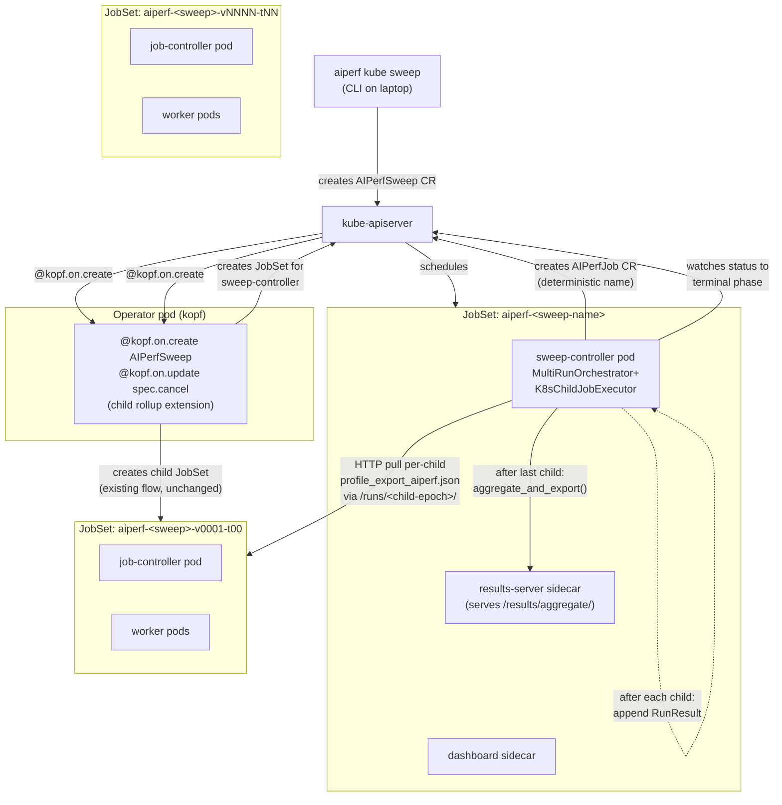

# Native Kubernetes Sweep & Multi-Run Support (`AIPerfSweep`)

**Date:** 2026-04-25
**Status:** Spec, pending plan
**Branch:** `ajc/k8s`
**Depends on:** `docs/superpowers/specs/2026-04-24-uid-keyed-results-layout.md` (merged: epoch-keyed results layout)
**Related:** `docs/tutorials/sweeps.md`, `docs/tutorials/multi-run-confidence.md`, commit `1d70d3c46` (removed dead sweep surface)

## Problem

`aiperf profile` (the local CLI) supports three composable knobs for multi-run benchmarks:

1. **Parameter sweep** — `expand_sweep()` produces N variation configs from `sweep: {type: grid|scenarios, ...}` or magic-list fields (`concurrency: [8,32,64]`).
2. **Multi-run trials** — `--num-profile-runs N` runs the same config N times for confidence intervals (`FixedTrialsStrategy`).
3. **Adaptive convergence** — `--convergence-metric` stops early once a metric stabilizes (`AdaptiveStrategy`, bounded by `min_runs`/`max_runs`).

The Kubernetes flow today supports **none** of these. `aiperf kube profile` creates a single `AIPerfJob` CR; the operator's `spec_converter.build_benchmark_run` logs an explicit `WARNING` and pops `sweep:` / `multi_run:` keys (`src/aiperf/operator/spec_converter.py:212`). Commit `1d70d3c46` removed a previous half-built sweep surface from the operator: dead status fields (`status.runs[]`, `status.sweepResults`), unused labels (`AIPerfLabels.{SWEEP_RUN, VARIATION_INDEX, RUN_INDEX}`), and CRD documentation that promised orchestration the operator never performed.

We have a clean slate to design native K8s sweep support correctly. The constraints:

- Reuse the local CLI's orchestration code where possible (`MultiRunOrchestrator`, strategies, `expand_sweep`, `aggregate_and_export`).
- Integrate with the recently-shipped epoch-keyed results layout (every CR's results live under `<base>/<ns>/<name>/<epoch>/` with `latest.txt`, retention, run-history dropdown, run-diff view).
- Match the AIPerfJob lifecycle conventions (declarative `spec.cancel`, `ttlSecondsAfterFinished`, owner-reference cascade, ServiceAccount/Role provisioning).
- Make the parent sweep a first-class `kubectl get` object — single object to describe, watch, cancel, and reference from results URLs.

## Approach

Introduce a new `AIPerfSweep` CRD that owns child `AIPerfJob` CRs via `ownerReferences`. The orchestration loop runs in a dedicated **sweep-controller pod** (created by the kopf operator from a JobSet manifest the same way job-controller pods are created today), which uses `kubernetes_asyncio` to create child `AIPerfJob`s deterministically named by `(variation_index, trial_index)`, watch each one to terminal phase, pull per-child summary metrics from the operator's results-server, and run `aggregate_and_export` over the cumulative `RunResult` list. The kopf operator gains two new `@kopf.on.*` handlers (`AIPerfSweep` create and `spec.cancel` update) plus a child-status rollup; everything else is a sweep-controller pod responsibility.

The design is **idempotent by construction**: the apiserver — not status fields, not in-pod state, not journal entries — is the source of truth for "which variations have been started." A restarted sweep-controller pod re-reads the CR, lists owned children, and re-derives every decision (`should_continue`, convergence, abort threshold) from the cached metrics on terminal children. No state is held in pod memory.



### Key properties

- **The kopf operator stays a thin reconciler.** Its only new responsibilities are translating `AIPerfSweep` → JobSet for sweep-controller, mirroring `spec.cancel` to `status.conditions`, and bubbling child status into parent counts. No long-running workflow state in kopf handlers.
- **Children are unmodified `AIPerfJob`s.** Existing per-child JobSet creation, results-server, dashboard, lifecycle, completion-fetch — all reused with zero changes. A child cannot tell whether it is standalone or part of a sweep.
- **Sequential execution only.** One child runs at a time. Parallel fan-out is explicitly out of scope for v1 (see "Out of scope" below for rationale).
- **Sweep epoch is independent from child epochs.** The sweep CR has its own `metadata.creationTimestamp` and its own `status.runEpoch`; the existing epoch-keyed results layout serves the sweep aggregate at `<base>/<ns>/<sweep>/<sweep-epoch>/aggregate/`.
- **No new HTTP endpoints in the operator's results-server.** All existing `/api/v1/results/<ns>/<name>/...` routes work for sweep CRs because the sweep aggregate is served as the sweep CR's results.

## CRD: `AIPerfSweep`

### What a user writes

```yaml
apiVersion: aiperf.nvidia.com/v1
kind: AIPerfSweep
metadata:
  name: saturation-sweep
  namespace: aiperf-runs
spec:
  # Variation generation (optional). Mutually exclusive with nothing in v1.
  sweep:
    type: grid                                          # grid | scenarios
    variables:
      phases.profiling.concurrency: [8, 32, 64, 128]
      phases.profiling.rate: [10, 50, 100]

  # Per-variation trial configuration (optional; default: 1 trial per variation).
  multiRun:
    trials: 3                          # rejected when `convergence` is set
    cooldownSeconds: 30
    autoSetSeed: true
    disableWarmupAfterFirst: true

  # Per-variation adaptive early-stop (optional). Requires `multiRun`.
  # Composes with `sweep`: each cell of the grid runs adaptive trials.
  # convergence:
  #   metric: ttft_p99
  #   criterion: cv_threshold
  #   minRuns: 3
  #   maxRuns: 10
  #   threshold: 0.05

  # Failure policy.
  failurePolicy:
    onChildFailure: continue           # continue | abort   (default continue)
    maxFailures: 0                     # 0 = unbounded     (default 0)

  # Declarative cancel; propagates to currently-running child.
  cancel: false

  # Parent CR retention; child CRs use their own ttlSecondsAfterFinished.
  ttlSecondsAfterFinished: 86400

  # The child stamp: byte-for-byte an AIPerfJobSpec, sweep-free.
  template:
    metadata:
      labels:                          # merged into every child
        team: perf-eng
    spec:
      benchmark:                       # base AIPerfConfig (no sweep:/multi_run:)
        models: [Qwen/Qwen3-0.6B]
        endpoint:
          urls: [http://server:8000/v1/chat/completions]
          type: chat
          streaming: true
        datasets:
          main: { type: synthetic, entries: 2000, prompts: { isl: { mean: 512 }, osl: { mean: 128 } } }
        phases:
          profiling: { type: poisson, dataset: main, duration: 120, rate: 10, concurrency: 8 }
      image: nvcr.io/.../aiperf:latest
      imagePullPolicy: IfNotPresent
      podTemplate: { ... }
      scheduling: { ... }
```

`template.spec` is byte-for-byte an `AIPerfJobSpec`. The child the sweep-controller creates is a normal `AIPerfJob` — anyone reading the cluster cannot tell it from a hand-submitted job aside from the owner-reference and label set.

### Spec models (Pydantic)

```python
# src/aiperf/kubernetes/sweep_models.py (new file)

class AIPerfSweepSpec(BaseConfig):
    sweep: SweepConfig | None = Field(
        default=None,
        description="Variation generator (grid | scenarios). Reuses aiperf.config.sweep.SweepConfig verbatim.",
    )
    multi_run: MultiRunConfig | None = Field(
        default=None,
        alias="multiRun",
        description="Per-variation trial configuration. Required when `convergence` is set.",
    )
    convergence: ConvergenceConfig | None = Field(
        default=None,
        description="Per-variation adaptive early-stop. Requires `multiRun`. Composes with `sweep`.",
    )
    failure_policy: FailurePolicy = Field(
        default_factory=FailurePolicy,
        alias="failurePolicy",
        description="When and whether to abort on child failure.",
    )
    cancel: bool = Field(
        default=False,
        description="Cooperative cancel: signals the current child and skips remaining variations.",
    )
    ttl_seconds_after_finished: int | None = Field(
        default=None,
        alias="ttlSecondsAfterFinished",
        description="Parent CR retention after terminal phase; children use their own TTL.",
    )
    template: AIPerfJobTemplate = Field(
        ...,
        description="Child stamp; spec is an AIPerfJobSpec.",
    )

class MultiRunConfig(BaseConfig):
    trials: int | None = Field(
        default=None, ge=1, le=20,
        description="Fixed trials per variation. Must be unset when `convergence` is set.",
    )
    cooldown_seconds: float = Field(default=0.0, ge=0, alias="cooldownSeconds",
        description="Sleep duration between trials within a variation.")
    auto_set_seed: bool = Field(default=True, alias="autoSetSeed",
        description="Auto-set random seed for workload consistency across trials.")
    disable_warmup_after_first: bool = Field(default=True, alias="disableWarmupAfterFirst",
        description="Skip warmup on trials 2..N for steady-state measurement.")

class ConvergenceConfig(BaseConfig):
    metric: str = Field(
        ...,
        description="Metric name from docs/metrics-reference.md (e.g., ttft_p99, request_throughput).",
    )
    criterion: Literal["cv_threshold"] = Field(
        default="cv_threshold",
        description="Convergence criterion. v1 supports cv_threshold only; extensible.",
    )
    min_runs: int = Field(default=3, ge=2, alias="minRuns",
        description="Minimum trials per variation before convergence is checked.")
    max_runs: int = Field(default=10, ge=2, alias="maxRuns",
        description="Maximum trials per variation; hard cap regardless of convergence.")
    threshold: float = Field(default=0.05, gt=0, lt=1,
        description="Criterion-specific threshold. For cv_threshold, the coefficient-of-variation cap.")

class FailurePolicy(BaseConfig):
    on_child_failure: Literal["continue", "abort"] = Field(
        default="continue", alias="onChildFailure",
        description="continue: failed child becomes a status entry, advance to next variation. "
                    "abort: any failure terminates the sweep with phase=Failed.",
    )
    max_failures: int = Field(
        default=0, ge=0, alias="maxFailures",
        description="0 = unbounded. Otherwise, terminate the sweep when failed-child count reaches this value.",
    )
```

`SweepConfig` reuses `aiperf.config.sweep.SweepConfig` (`GridSweep | ScenarioSweep` discriminated union) verbatim. `AIPerfJobTemplate` wraps `AIPerfJobSpec` with optional `metadata.labels`/`annotations` that get merged into every child.

### Validation rules

Implemented in both the Pydantic model (CLI/operator-side) and CRD `x-kubernetes-validations` (apiserver-side):

1. **At least one of `sweep`, `multiRun`, `convergence`** must be set. Otherwise the user wants `AIPerfJob`, not `AIPerfSweep`. Error message points at `aiperf kube profile`.
2. **`convergence` requires `multiRun` to be set.** `multiRun.trials` must be unset (or rejected with a clear error) when `convergence` is set, to avoid two competing trial bounds.
3. **`sweep` and `convergence` compose freely.** Per-cell adaptive trials of a grid sweep are valid.
4. **`template.spec.benchmark` must not contain `sweep` or `multi_run` keys.** The CLI fails fast with a hand-off message; the operator's create handler rejects with a clear error if a hand-edited CR slips past the apiserver.
5. **`spec.sweep`, `spec.multiRun`, `spec.convergence` are immutable post-creation.** Implemented as CEL `x-kubernetes-validations` rules on the CRD (no validating webhook required). Mutating these mid-sweep would invalidate the deterministic child-name map.
6. **`spec.failurePolicy` and `spec.cancel` are mutable.** Failure-policy adjustments mid-sweep apply on the next iteration; `spec.cancel: true` flips the cancel signal on the current child.
7. **Sweep CR name length ≤ 40 chars.** Same constraint already applied to `AIPerfJob`, to leave room for the JobSet `aiperf-` prefix and child variation/trial suffix within the 63-char DNS-label limit.

### Status schema

```yaml
status:
  phase: Running                            # Pending | Running | Aggregating | Succeeded | PartiallyFailed | Failed | Cancelled
  runEpoch: 1714069323                       # decimal epoch-seconds from metadata.creationTimestamp; mirrors AIPerfJob.status.runEpoch
  totalVariations: 12                        # n_cells (always exact; from expand_sweep)
  maxTotalRuns: 120                          # n_cells × max-trials-per-cell (worst case under convergence)
  completedRuns: 47                          # children with terminal-success
  failedRuns: 2                              # children with terminal-failure
  currentCell:                               # advisory; written by sweep-controller
    variationIndex: 8
    label: "concurrency=128, rate=50"
    trial: 4
    converged: false
  cells:                                     # running summary (NOT a list)
    converged: 5                             # cells stopped via convergence
    completedFixed: 3                        # cells stopped via maxRuns
    inFlight: 1
    pending: 3
  aggregation:
    phase: NotStarted                        # NotStarted | Running | Complete | Failed
    completedAt: null
    error: ""
  aggregateRef:                              # set when aggregation completes
    resultsServerHost: aiperf-saturation-sweep-controller-0-0.aiperf-saturation-sweep.aiperf-runs.svc.cluster.local
    port: 19090
    apiPath: /api/v1/results/aiperf-runs/saturation-sweep/aggregate
  runtimeRef:
    jobSetName: aiperf-saturation-sweep
    sweepControllerHost: aiperf-saturation-sweep-controller-0-0.aiperf-saturation-sweep.aiperf-runs.svc.cluster.local
  childRunEpochsRef:                         # advisory pointer; per-child epochs are NOT enumerated in status
    apiPath: /api/v1/results/aiperf-runs/saturation-sweep/runs   # parent endpoint
    childLabelSelector: aiperf.nvidia.com/sweep=saturation-sweep
  startTime: "2026-04-25T12:34:56Z"
  completionTime: null
  lastChildEvent:
    name: saturation-sweep-v0007-t00
    phase: Succeeded
    transitionTime: "2026-04-25T13:02:11Z"
  conditions:
    - { type: Progressing, status: "True", reason: ChildRunning, message: "running variation 8/12 trial 4", lastTransitionTime: ... }
    - { type: Aggregating, status: "False", reason: NotStarted }
    - { type: Cancelling, status: "False" }
```

**Status is summary-only.** No `status.cells[]` array enumerating every variation; no `status.runs[]` enumerating every child. Per-cell detail is reachable via `kubectl get aiperfjobs -l aiperf.nvidia.com/sweep=<name>` and via the aggregate JSON's `child_runs[]` / `per_cell_aggregates[]` blocks. This avoids the dead-array trap of commit `1d70d3c46`.

### Field-manager partition (Server-Side Apply)

| Field | Owner |
|---|---|
| `phase`, `totalVariations`, `maxTotalRuns`, `runEpoch` | operator |
| `completedRuns`, `failedRuns`, `lastChildEvent`, `cells.*` | operator (derived from owner-reference list query on each child reconcile) |
| `runtimeRef`, `startTime`, `completionTime`, `childRunEpochsRef` | operator |
| `currentCell` | sweep-controller (advisory) |
| `aggregation`, `aggregateRef` | sweep-controller |
| `conditions[type=Progressing]`, `conditions[type=Cancelling]` | operator |
| `conditions[type=Aggregating]` | sweep-controller |

Two managers, no overlapping fields. SSA picks the owner unambiguously.

### Printer columns

```
NAME                  PHASE              RUNS         FAILED   CURRENT                          AGE
saturation-sweep      Running            47/120       2        c=128, r=50 trial=4               1h
confidence-test       PartiallyFailed    9/10         1                                          2h
big-grid              Cancelled          18/24        0        c=512, r=200                      45m
```

### Deterministic child names

```
needs_trial_suffix = (multi_run.trials > 1) or (convergence is set)

<sweep-name>-v{idx:04d}                    # needs_trial_suffix == False
<sweep-name>-v{idx:04d}-t{trial:02d}      # needs_trial_suffix == True
```

`idx` is the variation index from `expand_sweep` (or `0` if no `sweep` is set). Each child gets these labels, set by the sweep-controller at create time:

```yaml
labels:
  aiperf.nvidia.com/sweep: <sweep-name>
  aiperf.nvidia.com/sweep-uid: <sweep-uid>             # extra defense for "is this child mine?"
  aiperf.nvidia.com/variation-index: "0007"
  aiperf.nvidia.com/variation-label: "concurrency-128-rate-50"   # sanitized to DNS-label
  aiperf.nvidia.com/trial-index: "04"                  # only when needs_trial_suffix
ownerReferences:
  - { apiVersion: aiperf.nvidia.com/v1, kind: AIPerfSweep, name: <sweep-name>, uid: <sweep-uid>, controller: true, blockOwnerDeletion: true }
```

The label values are bounded (DNS-safe, sanitized, ≤63 chars); the *exact* `SweepVariation.values` dict still lives on each child's `BenchmarkRun` and in its `profile_export_aiperf.json`. `kubectl get aiperfjobs -l aiperf.nvidia.com/sweep=saturation-sweep` lists children. `kubectl delete aiperfsweep saturation-sweep` cascades to children via owner reference.

## Sweep-controller pod

### Pod shape

```yaml
# Created by kopf operator from AIPerfSweep.spec.template's deployment fields.
apiVersion: jobset.x-k8s.io/v1alpha2
kind: JobSet
metadata:
  name: aiperf-<sweep-name>
  ownerReferences:
    - { kind: AIPerfSweep, name: <sweep-name>, uid: <sweep-uid>, controller: true }
spec:
  replicatedJobs:
  - name: controller
    replicas: 1
    template:
      spec:
        template:
          spec:
            restartPolicy: OnFailure
            serviceAccountName: aiperf-sweep-controller-<sweep-name>   # provisioned by operator
            containers:
            - name: sweep-controller
              image: <template.spec.image>
              command: ["python", "-m", "aiperf.sweep_controller.main"]
              env:
                - { name: AIPERF_SWEEP_NAME,      value: <sweep-name> }
                - { name: AIPERF_SWEEP_NAMESPACE, value: <namespace> }
                - { name: AIPERF_SWEEP_UID,       value: <sweep-uid> }
                - { name: AIPERF_SWEEP_EPOCH,     value: <sweep-epoch> }
              volumeMounts:
                - { name: results, mountPath: /results }
            - name: results-server                  # existing sidecar, unchanged
            - name: dashboard                       # existing sidecar, unchanged
```

`failurePolicy.maxRestarts` on the JobSet caps how many times the sweep-controller can restart before the sweep is marked `Failed`. The sweep-controller process re-reads its target sweep CR from the apiserver on every startup — never from a baked-in spec, never from local memory.

### Orchestration loop (entry point: `src/aiperf/sweep_controller/main.py`)

```python
async def main() -> None:
    api = await k8s_client()
    sweep = await api.read_aiperf_sweep(name, namespace)
    plan = build_plan_from_sweep(sweep)                         # variations × strategy
    executor = K8sChildJobExecutor(api, sweep)
    orchestrator = MultiRunOrchestrator(base_dir=Path("/results"))

    all_results = await orchestrator.execute(plan, executor)

    if not _aggregation_marker_exists():
        await _patch_status(aggregation={"phase": "Running"})
        try:
            aggregate_and_export(all_results, plan, base_dir=Path("/results"))
            _write_aggregate_manifest(sweep, all_results, plan)   # epoch-lineage record
            _write_ready_marker()
            await _patch_status(aggregation={"phase": "Complete", "completedAt": now()})
        except Exception as e:
            await _patch_status(aggregation={"phase": "Failed", "error": str(e)})
            raise

    await _idle_until_terminated()                                # results-server sidecar serves /results/aggregate/
```

The `if not _aggregation_marker_exists()` guard, plus the existing `write_ready_marker` pattern from `client_cache.py`, is the entire restart-resume idempotency for aggregation.

### `K8sChildJobExecutor` — the swap-in point

```python
# src/aiperf/sweep_controller/k8s_executor.py
class K8sChildJobExecutor(RunExecutor):
    async def execute(self, run: BenchmarkRun) -> RunResult:
        child_name = self._derive_child_name(run)                  # deterministic: <sweep>-v{idx:04d}[-t{trial:02d}]
        child = await self._get_or_create(child_name, run)
        await self._wait_until_terminal(child_name)                # apiserver watch + periodic list fallback
        terminal = await self._api.read_aiperf_job(child_name, self.namespace)
        return await self._collect_run_result(terminal, run)

    async def _get_or_create(self, name: str, run: BenchmarkRun) -> dict:
        existing = await self._api.try_read_aiperf_job(name, self.namespace)
        if existing is not None and self._is_my_child(existing):
            return existing                                         # resume: child already exists
        if existing is not None:
            raise ChildNameConflictError(name)                      # name conflict not under our owner-ref
        spec = self._build_child_spec(run)
        return await self._api.create_aiperf_job(name, self.namespace, spec)

    def _is_my_child(self, child: dict) -> bool:
        meta = child["metadata"]
        owner_match = any(
            ref.get("uid") == self.sweep_uid for ref in meta.get("ownerReferences", [])
        )
        label_match = meta.get("labels", {}).get("aiperf.nvidia.com/sweep") == self.sweep_name
        return owner_match and label_match

    def _build_child_spec(self, run: BenchmarkRun) -> dict:
        spec = copy.deepcopy(self.sweep["spec"]["template"]["spec"])
        spec["benchmark"] = run.cfg.model_dump(by_alias=True)        # variation-applied config
        # variation/trial reach the child via run_config.json built from BenchmarkRun
        # (existing build_benchmark_run path); the child's controller pod sees these
        # natively and surfaces them in artifacts and dashboard.
        return spec

    async def _collect_run_result(self, child: dict, run: BenchmarkRun) -> RunResult:
        status = child["status"]
        if status["phase"] != "Succeeded":
            return RunResult(label=run.label, success=False,
                             error=status.get("message", "child terminated non-success"),
                             artifacts_path=None)
        # Pull child's profile_export_aiperf.json via the operator's epoch-pinned route.
        epoch = status["runEpoch"]
        url = (f"http://{status['runtimeRef']['controllerHost']}:19090"
               f"/api/v1/results/{self.namespace}/{child['metadata']['name']}"
               f"/runs/{epoch}/profile_export_aiperf.json")
        metrics = parse_summary_metrics(await self._http.get(url))
        return RunResult(label=run.label, success=True,
                         summary_metrics=metrics, artifacts_path=None)
```

`_wait_until_terminal` uses a `kubernetes_asyncio` watch with periodic falls-back to `list`, mirroring the pattern in `src/aiperf/operator/progress_client.py`. The child is terminal when `status.phase ∈ {Succeeded, Failed, Cancelled, PartiallyFailed}`.

### Idempotent restart property

If the sweep-controller pod crashes mid-sweep:

1. JobSet restart launches a fresh pod.
2. New process re-reads sweep CR from apiserver.
3. Calls `MultiRunOrchestrator.execute(plan, executor)` from variation 0.
4. For each `(variation, trial)` in order, `K8sChildJobExecutor._get_or_create` sees the existing child (by deterministic name) if there is one — `await _wait_until_terminal` returns immediately for already-terminal children, attaches a fresh watch for in-flight ones.
5. `_collect_run_result` re-pulls metrics from the (still-alive) results-server.
6. Strategy's `should_continue` re-derives "did we converge / hit max-failures" from cached metrics.
7. Aggregation either re-runs (if no marker on disk) or is skipped (if marker exists).

End state is identical regardless of when the crash happened.

### Cancel propagation

When `AIPerfSweep.spec.cancel: true` is observed (the sweep-controller polls its own CR every 5s as part of `_wait_until_terminal`):

1. The current child gets `spec.cancel: true` patched by the sweep-controller (one PATCH call).
2. The kopf operator's existing `@kopf.on.update(field="spec.cancel")` handler on `AIPerfJob` triggers the same code path as `aiperf kube cancel <child-name>`.
3. Sweep-controller awaits the child's terminal phase, marks `RunResult.success=False, error="cancelled"`.
4. After child terminates, sweep-controller skips remaining variations, runs aggregation over completed children only, writes `status.phase: Cancelled`, exits.

No new cancel plumbing in the operator; the sweep-controller is just another caller of the existing per-child cancel.

## Aggregation & epoch lineage

### Output layout (epoch-keyed)

```
<base>/<namespace>/<sweep-name>/<sweep-epoch>/
  ├── aggregate/
  │     ├── profile_export_aiperf_aggregate.json
  │     ├── profile_export_aiperf_aggregate.csv
  │     ├── profile_export_aiperf_aggregate.parquet     # if enabled
  │     └── per_cell_summaries.json
  ├── manifest.json                                       # epoch lineage record
  └── .aiperf_results_ready.json                          # ready marker
```

Children land at their own epoch dirs: `<base>/<ns>/<sweep>-v0007-t04/<child-epoch>/...`. The epoch-keyed layout's existing `latest.txt`, retention (`AIPERF_RESULTS_RETAIN_DAYS`), and `/api/v1/results/<ns>/<name>/runs/<epoch>/<filename>` machinery serves both unchanged.

### Aggregate manifest

```json
{
  "sweep": "saturation-sweep",
  "sweep_namespace": "aiperf-runs",
  "sweep_uid": "ce261f51-...",
  "sweep_epoch": "1714069323",
  "total_variations": 12,
  "max_total_runs": 120,
  "completed_runs": 23,
  "failed_runs": 1,
  "child_runs": [
    {"variation_index": 0, "trial": 0,
     "name": "saturation-sweep-v0000-t00",
     "epoch": "1714069330",
     "label": "concurrency=8, rate=10",
     "values": {"phases.profiling.concurrency": 8, "phases.profiling.rate": 10},
     "status": "Succeeded"},
    ...
  ],
  "per_cell_aggregates": [
    {"variation_index": 0,
     "label": "concurrency=8, rate=10",
     "n_trials": 2,
     "summary_metrics": { ... },
     "convergence": {"converged": true, "at_trial": 1, "reason": "cv<0.05"}}
  ],
  "cross_cell_summary": { ... }
}
```

This is the durable record of which child epochs went into the sweep. The downstream UI's run-diff view (compare two epochs of the same CR) gets a "diff two sweep epochs" capability for free.

### Existing endpoints work for sweeps

- `GET /api/v1/results/<ns>/<sweep>/aggregate/profile_export_aiperf_aggregate.json` — resolves via `latest.txt`.
- `GET /api/v1/results/<ns>/<sweep>/runs/<sweep-epoch>/aggregate/...` — pinned.
- `GET /api/v1/results/<ns>/<sweep>/runs` — list of historical sweep runs.
- `aiperf kube results <sweep-name> --run <epoch>` — pin to a past sweep run.
- Run-history dropdown / run-diff view work for sweeps the same way they work for jobs.

## Operator changes

### New handlers in `src/aiperf/operator/main.py`

```python
@kopf.on.create(AIPERF_GROUP, AIPERF_VERSION, "aiperfsweeps")
async def on_sweep_create(body, spec, name, namespace, patch, **_):
    """Validate spec, compute totalVariations/maxTotalRuns, provision RBAC,
    create sweep-controller JobSet."""
    return await sweep_handlers.create.handle(
        body=body, spec=spec, name=name, namespace=namespace, patch=patch
    )

@kopf.on.update(AIPERF_GROUP, AIPERF_VERSION, "aiperfsweeps", field="spec.cancel")
async def on_sweep_cancel(body, spec, name, namespace, patch, **_):
    """Mirror cancel signal into status.conditions[Cancelling].
    The sweep-controller pod observes spec.cancel directly via its own poll."""
    return await sweep_handlers.lifecycle.cancel(
        body=body, spec=spec, name=name, namespace=namespace, patch=patch
    )
```

A new `@kopf.on.field(AIPERF_PLURAL, field="status.phase")` handler on `aiperfjobs` is added (the operator today watches `aiperfjobs` only via `spec.cancel`, the `BENCHMARK_COMPLETE` annotation, and a timer — it does not watch `status.phase` directly). On every child phase transition, the handler looks for `metadata.ownerReferences[].kind == AIPerfSweep`, and if found, patches `status.completedRuns` / `status.failedRuns` / `status.lastChildEvent` / `status.cells.*` on the parent. When all children are terminal, the handler transitions `AIPerfSweep.status.phase` to `Aggregating`; the sweep-controller's aggregation step then flips it to `Succeeded` / `PartiallyFailed`. Children without a sweep owner-reference are ignored — the handler is a no-op for hand-submitted `AIPerfJob`s.

`@kopf.on.delete` cascade is automatic via `ownerReferences[].blockOwnerDeletion: true` — children clean up when the sweep is deleted, the sweep-controller JobSet cleans up when the sweep is deleted. No new delete handler needed.

### Module skeleton

```
src/aiperf/operator/handlers/
  └── sweep/                                # new package
      ├── __init__.py
      ├── create.py                         # validate spec, provision RBAC, create sweep-controller JobSet
      ├── lifecycle.py                      # cancel signal mirror to status.conditions
      └── child_rollup.py                   # bubble child status into AIPerfSweep.status counts
```

`create.py` reuses existing JobSet primitives (`spec_converter.apply_worker_config`, `k8s_helpers.build_jobset_manifest`) — sweep-controller is just a JobSet with `replicas: 1` and a different command. ~150 LOC of new code, mostly schema validation, RBAC provisioning, and `kubernetes_asyncio` plumbing.

### CRD generation

`tools/generate_crd.py` gains `_emit_aiperfsweep_crd()` parallel to `_emit_aiperfjob_crd()`. The two share field definitions for `template.spec` (which is `AIPerfJobSpec`); extract that block into `_emit_aiperfjob_spec_schema()` to keep the schema in sync. Helm chart adds `deploy/helm/aiperf-operator/templates/crd-aiperfsweep.yaml`.

### RBAC

The operator's existing `ClusterRole` (`deploy/helm/aiperf-operator/templates/rbac.yaml`) gains `aiperfsweeps` in the verbs list. The sweep-controller pod's ServiceAccount needs:

- `create`, `get`, `list`, `watch`, `patch` on `aiperfjobs` (namespace-scoped Role).
- `get`, `patch` on its own `AIPerfSweep` (namespace-scoped Role).

These are provisioned in `sweep/create.py` per-sweep, mirroring the existing pattern that creates per-`AIPerfJob` Roles for results-server-sidecar access.

## CLI: `aiperf kube sweep`

### New file: `src/aiperf/cli_commands/kube/sweep.py`

Modeled on `profile.py:172` (`async def profile()`). Same `KubeOptions`, same `--detach` / `--no-wait` / `--attach-port` / `--dry-run` flags. New flags:

```python
@app.default
async def sweep(
    *,
    cli_model: CLIModel,
    kube_options: KubeOptions,
    sweep_concurrency: Annotated[str | None, Parameter(...)] = None,    # magic-list shorthand
    sweep_rate: Annotated[str | None, Parameter(...)] = None,
    sweep_var: Annotated[list[str], Parameter(...)] = (),               # repeat: --sweep-var <field>=v1,v2,v3
    multi_run_trials: Annotated[int | None, Parameter(name="--trials")] = None,
    cooldown_seconds: Annotated[float, Parameter(name="--cooldown")] = 0.0,
    convergence_metric: Annotated[str | None, Parameter(...)] = None,
    convergence_min_runs: Annotated[int, Parameter(...)] = 3,
    convergence_max_runs: Annotated[int, Parameter(...)] = 10,
    convergence_threshold: Annotated[float, Parameter(...)] = 0.05,
    detach: Annotated[bool, _DETACH_PARAM] = False,
    ...
) -> None:
    """Run a parameter sweep or multi-run benchmark in Kubernetes."""
```

YAML config file (`-f sweep.yaml`) is the canonical input for non-trivial sweeps; flag form is for one-axis quick tests.

Reusable helpers from `profile.py` factored into a new `_kube_common.py`:
- `_resolve_config(cli_model, config_file)` (verbatim).
- `_print_memory_estimate(config, kube_options, spec)` extends to print **worst-case across variations** for sweeps.
- `generate_benchmark_name(config)` extends with a `-sweep` suffix.

### `aiperf kube profile` hand-off

In `profile.py`, where `_resolve_config` returns a config containing `sweep:` or `multi_run:`, raise `cli_utils.raise_startup_error_and_exit`:

```
Error: This config has 'sweep:' set, but `aiperf kube profile` runs a single benchmark.
       Use `aiperf kube sweep -f <config>` to run it as a parameter sweep,
       or remove the 'sweep:' key to run a single benchmark.
```

The existing `WARNING + pop` in `spec_converter.build_benchmark_run` stays as defense in depth — it now means "a hand-edited AIPerfJob CR slipped through the apiserver."

### Other CLI commands extend automatically

These work on any CR name and pick up sweeps with minimal new code:

- `aiperf kube watch <sweep-name>` — needs a new `WatchRenderer` for the sweep view (per-variation rows). One file in `src/aiperf/cli_commands/kube/_watch_renderers/`, ~200 LOC, parallel to the existing job renderer.
- `aiperf kube logs <sweep-name>` — tails the sweep-controller pod by default; `--child <child-name>` tails a specific variation.
- `aiperf kube attach <sweep-name>` — attaches to the sweep-controller pod's TTY.
- `aiperf kube show <sweep-name>` — extends to render `AIPerfSweep` (one new format function in `show.py`'s renderer dispatch).
- `aiperf kube list` — already lists CRs by kind; gains `aiperf kube list sweeps`.
- `aiperf kube results <sweep-name>` — works unchanged (epoch integration above).
- `aiperf kube dashboard <sweep-name>` — port-forwards to the sweep-controller's dashboard sidecar.

## Code reuse refactor

This is the only change to existing non-additive code paths.

### Three changes in `src/aiperf/orchestrator/`

**1. Add `RunExecutor` interface** (~30 LOC, new file):

```python
# src/aiperf/orchestrator/executor.py
class RunExecutor(ABC):
    @abstractmethod
    async def execute(self, run: BenchmarkRun) -> RunResult:
        """Execute one benchmark run. Implementations: subprocess, k8s child job."""
    @abstractmethod
    def derive_id(self, plan: BenchmarkPlan, var_idx: int, trial: int) -> str:
        """Derive a stable benchmark_id for this run."""
```

**2. Extract `LocalSubprocessExecutor` from `MultiRunOrchestrator._execute_single_run`** (~80 LOC, current code lifted):

```python
# src/aiperf/orchestrator/local_executor.py
class LocalSubprocessExecutor(RunExecutor):
    async def execute(self, run: BenchmarkRun) -> RunResult:
        # body of _execute_single_run from src/aiperf/orchestrator/orchestrator.py:115, unchanged
```

The local CLI wraps this in `asyncio.to_thread` since its current call site is sync.

**3. Refactor `MultiRunOrchestrator.execute` to take `(plan, executor)` and iterate variations × trials** (~50 LOC change):

```python
async def execute(self, plan: BenchmarkPlan, executor: RunExecutor) -> list[RunResult]:
    all_results: list[RunResult] = []
    for var_idx, (cfg, variation) in enumerate(zip(plan.configs, plan.variations)):
        strategy = self._strategy_for_cell(plan)            # FRESH strategy per cell
        cell_results: list[RunResult] = []
        trial = 0
        while strategy.should_continue(cell_results):
            next_cfg = strategy.get_next_config(cfg, cell_results)
            run = build_benchmark_run(
                cfg=next_cfg, variation=variation, trial=trial,
                label=strategy.get_run_label(trial),
                benchmark_id=executor.derive_id(plan, var_idx, trial),
            )
            cell_results.append(await executor.execute(run))
            trial += 1
            if self._sweep_failure_threshold_exceeded(all_results + cell_results, plan):
                return all_results + cell_results
        all_results.extend(cell_results)
        if self._convergence_terminates_sweep(all_results, plan):
            break
    return all_results
```

**Side-effect bug-fix:** the local CLI today calls `orchestrator.execute(plan.configs[0], strategy)` (`src/aiperf/cli_runner.py:350`), iterating only `plan.trials` runs of the first variation — variations beyond index 0 get silently dropped. The refactored signature fixes this latent gap. Comment on `BenchmarkPlan` already promises "The orchestrator iterates configs × trials"; this delivers it.

### Two new files in the new sweep-controller package

```
src/aiperf/sweep_controller/
  ├── __init__.py
  ├── main.py                # entry point: read CR, build plan, run orchestrator, aggregate
  ├── k8s_executor.py        # K8sChildJobExecutor (RunExecutor impl)
  ├── plan_builder.py        # AIPerfSweep CR -> BenchmarkPlan
  └── status_writer.py       # SSA patches to AIPerfSweep.status (controller-owned fields)
```

Roughly **400-500 LOC of new sweep-controller code**, dominated by `k8s_executor.py` (watch + create + result-pull logic).

### Reuse audit table

| Component | LOC | Reuse |
|---|---|---|
| `expand_sweep` and `SweepConfig`/`GridSweep`/`ScenarioSweep`/`SweepVariation` | ~220 | 100% — schema for `AIPerfSweep.spec.sweep` |
| `RunResult` dataclass | ~30 | 100% |
| `FixedTrialsStrategy`, `AdaptiveStrategy`, `ConvergenceCriterion` | ~440 | 100% — pure functions of accumulated results |
| `aggregate_and_export`, `ConfidenceAggregation`, `DetailedAggregation` | ~300 | 100% |
| `BenchmarkRun`, `BenchmarkPlan` | ~150 | 100% |
| `MultiRunOrchestrator.execute` iteration body | ~50 | 90% (small refactor) |
| `MultiRunOrchestrator._execute_single_run` (subprocess path) | ~80 | 100% (extracted to `LocalSubprocessExecutor`) |
| Subprocess plumbing (FD_CLOEXEC, mp start method, tokenizer preload, stdin/stdout) | ~150 | 0% (not applicable in K8s) |
| Operator results-server, retention, run-history dropdown, `aiperf kube results` | ~existing | 100% (sweep is just another CR) |
| Existing `AIPerfJob` JobSet creation, lifecycle, completion-fetch | ~existing | 100% (children unmodified) |

**Roughly 800 of 1,000 LOC of existing orchestration code reuses verbatim.** New sweep-specific code is ~1,000-1,200 LOC across operator handlers, sweep-controller package, CLI, CRD generator, Helm chart, and tests.

## Tests

- **Unit:** `tests/unit/sweep_controller/test_k8s_executor.py` (against `kubernetes_asyncio` fakes); `tests/unit/orchestrator/test_executor_interface.py` (regression for `LocalSubprocessExecutor` + new `FakeExecutor` for sweep × convergence × failure-policy combinations); `tests/unit/operator/test_sweep_handlers.py` (validation, RBAC provisioning, child-status rollup).
- **Integration:** `tests/integration/test_aiperfsweep_e2e.py` — real kind cluster, mock-server endpoint, 4-cell × 2-trial sweep, asserts aggregate JSON shape and `status.phase: Succeeded`.
- **Chaos:** `tests/kubernetes/chaos/test_sweep_controller_kill.py` — kill sweep-controller pod mid-sweep, assert resume-from-correct-variation behavior. Uses existing `podTemplate.shareProcessNamespace` + `kubectl exec kill` pattern documented in `docs/superpowers/specs/2026-04-23-chaos-expansion-design.md`.
- **CRD validation:** `tests/unit/operator/test_aiperfsweep_crd_validation.py` — exercises every validation rule (mutex constraints, immutability, name-length cap).

## Out of scope (v1)

- **Parallel fan-out across variations.** Sequential only. Adding `parallelism: N` later is purely additive (one new field, no schema break). The decision rests on saved feedback that aggregation across runs sharing a target endpoint is not meaningful when those runs interfere with each other's measurements.
- **Custom convergence criteria beyond `cv_threshold`.** Schema accepts a `criterion` literal, but only `cv_threshold` is implemented. Adding more is additive.
- **Sweep-of-sweeps / nested sweeps.** Not supported.
- **Cross-namespace child jobs.** Children always live in the sweep's namespace.
- **Resume after `kubectl delete aiperfsweep`.** Owner-reference cascade is destructive by design; resume is only across sweep-controller pod restarts within a single sweep CR's lifetime.
- **Run-history dropdown / run-diff view UI integration for sweeps.** Data is available via existing endpoints; wiring into the dashboard is a follow-up.
- **Editing `spec.sweep` mid-sweep.** CRD CEL validation rejects the edit; if a user wants a new sweep, they create a new CR.

## Migration / backwards compatibility

- **No breaking changes to `AIPerfJob`.** The existing CRD, schema, and operator code paths are untouched. The `WARNING + pop` in `spec_converter.build_benchmark_run` for stray `sweep:`/`multi_run:` keys stays as defense-in-depth.
- **No breaking changes to `aiperf profile` (local CLI).** The `MultiRunOrchestrator` refactor changes its internal call site to use `LocalSubprocessExecutor`; observable behavior is identical except for the latent sweep × trials bug that gets fixed.
- **Helm chart bumps a minor version** to indicate the new CRD; existing single-job deployments unaffected.

## Documentation

Per `CLAUDE.md`'s documentation-update table, the following files are updated as part of this work:

- `docs/architecture.md` — add `AIPerfSweep` to component list, sweep-controller pod role.
- `docs/dev/patterns.md` — add `RunExecutor` pattern; cite `K8sChildJobExecutor` and `LocalSubprocessExecutor`.
- `docs/dev/kubernetes-flow.md` — add sweep-controller pod lifecycle, kopf handler diagram extension.
- `docs/kubernetes/sweeps.md` — new file, parallel to `docs/tutorials/sweeps.md` for K8s flow.
- `docs/cli-options.md` — auto-regenerated via `make generate-cli-docs` after `aiperf kube sweep` lands.
- `llms.txt` — add `docs/kubernetes/sweeps.md` index entry.
- `README.md` — tutorial index entry for K8s sweeps.

## File inventory

### New files

```
src/aiperf/kubernetes/sweep_models.py                       # AIPerfSweepSpec, MultiRunConfig, ConvergenceConfig, FailurePolicy, AIPerfJobTemplate
src/aiperf/operator/handlers/sweep/__init__.py
src/aiperf/operator/handlers/sweep/create.py                # validate, provision RBAC, create sweep-controller JobSet
src/aiperf/operator/handlers/sweep/lifecycle.py             # cancel mirror
src/aiperf/operator/handlers/sweep/child_rollup.py          # child-status -> parent counts
src/aiperf/orchestrator/executor.py                         # RunExecutor ABC
src/aiperf/orchestrator/local_executor.py                   # LocalSubprocessExecutor
src/aiperf/sweep_controller/__init__.py
src/aiperf/sweep_controller/main.py                         # pod entry point
src/aiperf/sweep_controller/k8s_executor.py                 # K8sChildJobExecutor
src/aiperf/sweep_controller/plan_builder.py                 # AIPerfSweep CR -> BenchmarkPlan
src/aiperf/sweep_controller/status_writer.py                # SSA patches
src/aiperf/cli_commands/kube/sweep.py                       # CLI subcommand
src/aiperf/cli_commands/kube/_kube_common.py                # extracted from profile.py
src/aiperf/cli_commands/kube/_watch_renderers/sweep.py      # per-variation watch renderer
deploy/helm/aiperf-operator/templates/crd-aiperfsweep.yaml
docs/kubernetes/sweeps.md
tests/unit/sweep_controller/test_k8s_executor.py
tests/unit/orchestrator/test_executor_interface.py
tests/unit/operator/test_sweep_handlers.py
tests/unit/operator/test_aiperfsweep_crd_validation.py
tests/integration/test_aiperfsweep_e2e.py
tests/kubernetes/chaos/test_sweep_controller_kill.py
```

### Modified files

```
src/aiperf/operator/main.py                                 # +2 kopf handlers, extend status.phase rollup
src/aiperf/operator/spec_converter.py                       # no functional change; reuse helpers
src/aiperf/orchestrator/orchestrator.py                     # refactor execute(plan, executor)
src/aiperf/cli_runner.py                                    # call MultiRunOrchestrator with LocalSubprocessExecutor
src/aiperf/cli_commands/kube/profile.py                     # fail-fast hand-off to `aiperf kube sweep`
src/aiperf/cli_commands/kube/_app.py                        # register `sweep` subcommand
src/aiperf/cli_commands/kube/show.py                        # render AIPerfSweep
src/aiperf/cli_commands/kube/watch.py                       # dispatch to sweep renderer
tools/generate_crd.py                                       # _emit_aiperfsweep_crd
deploy/helm/aiperf-operator/templates/rbac.yaml             # add aiperfsweeps verbs
docs/architecture.md
docs/dev/patterns.md
docs/dev/kubernetes-flow.md
llms.txt
README.md
```

## Open questions

None. All design decisions are settled. Plan should sequence the file inventory above into independent PRs:

1. CRD generator + Helm chart + RBAC + Pydantic models (no behavior change).
2. `RunExecutor` interface + `LocalSubprocessExecutor` extraction + `MultiRunOrchestrator.execute` refactor (local-CLI bug-fix delivered here).
3. Sweep-controller pod (`sweep_controller/`) + `K8sChildJobExecutor`.
4. Operator handlers (`operator/handlers/sweep/`) + status rollup extension.
5. CLI (`aiperf kube sweep`) + profile hand-off + watch renderer.
6. Documentation (sweeps tutorial, architecture updates, llms.txt index).
7. E2E + chaos tests.
