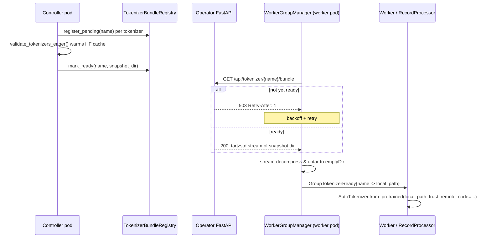

# Tokenizer Distribution Design (Kubernetes)

**Date:** 2026-04-26
**Status:** Design — pending implementation plan
**Scope:** Kubernetes deployments only. Local (multiprocessing) mode is unchanged.

## 1. Problem

Today, every K8s worker pod prefetches its tokenizer(s) directly from the
HuggingFace Hub:

- `WorkerGroupManagerBase` (`src/aiperf/workers/worker_pod_manager.py:74,178,219-220`)
  spawns `_tokenizer_prefetch_task`, which calls
  `prefetch_tokenizers()` → `validate_tokenizer_early()` →
  `AutoTokenizer.from_pretrained(name)` per pod.
- `kubernetes/jobset_helpers.py:206` injects `HF_HOME=/tmp/hf_home` into pods so
  the HF cache has a writable location under a read-only root FS.
- `bootstrap.py:66` skips the offline-mode lockdown (`HF_HUB_OFFLINE=1`,
  `TRANSFORMERS_OFFLINE=1`) in K8s precisely because pods need network egress
  for that prefetch.

This pattern fails two production concerns:

1. **Air-gapped clusters.** Pods often cannot reach `huggingface.co`. Only the
   controller plane has (or is given) HF egress.
2. **Pod startup latency.** Every pod paying its own HF download is slow and
   wasteful — the same bytes get downloaded N times across the run.

## 2. Goal

Make the **operator API service the sole authority for tokenizer bytes** in
K8s. The controller pre-warms the HF cache once; pods fetch tokenizer bundles
from the operator over the existing FastAPI surface; pods never touch HF
themselves.

This mirrors how datasets are already distributed in K8s: load once on the
control plane → expose over the operator HTTP API → workers download into
emptyDir → workers consume the local files.

Non-goals:

- Local-mode changes. The forkserver-CoW preload path
  (`src/aiperf/records/_tokenizer_preload.py`) stays as-is; it already gives
  in-process workers shared-memory tokenizers without any HTTP round-trip.
- A new `TokenizerManager` *service* with its own message bus surface. The
  controller already loads tokenizers via
  `tokenizer_validator.validate_tokenizers_eager()`. We are adding a router
  and a downloader, not a service.
- Lazy proxying of arbitrary HF Hub API calls. Bundles are produced eagerly
  on the controller; pods receive a single bundle per tokenizer.

## 3. Architecture

### 3.1 Controller side

`tokenizer_validator.validate_tokenizers_eager()` (today in
`src/aiperf/common/tokenizer_validator.py:67-116`) already warms
`~/.cache/huggingface/hub/...` for every unique tokenizer the run requires,
using a `ProcessPoolExecutor`. It is invoked from the control-plane bootstrap
before any worker is launched.

We extend it to record, for each requested tokenizer name, the resolved
**snapshot directory** (the real filesystem path under `.../snapshots/<sha>/`
inside the HF cache) and a `ready_event`. This is exposed as a small registry
object — `TokenizerBundleRegistry` — kept on the controller and queried by the
new HTTP router.

The registry's API is intentionally tiny:

```python
class TokenizerBundleRegistry:
    def register_pending(self, name: str) -> None: ...
    def mark_ready(self, name: str, snapshot_dir: Path) -> None: ...
    def get(self, name: str) -> tuple[Path, asyncio.Event] | None: ...
```

`validate_tokenizers_eager()` calls `register_pending(name)` up front and
`mark_ready(name, snapshot_dir)` after each per-tokenizer warmer process
finishes. The registry is held by the operator's FastAPI app state and
accessed from the new router.

### 3.2 Endpoint shape

New router in `src/aiperf/api/routers/tokenizer.py`, mounted on the existing
operator FastAPI app next to `DatasetRouter`:

```
GET /api/tokenizer/{name:path}/bundle
```

- `name` is the tokenizer name as the user supplied it
  (e.g. `meta-llama/Llama-3.1-8B`). FastAPI's `:path` converter preserves the
  embedded slash without URL-encoding tricks.
- Response: `Content-Type: application/zstd`, `Transfer-Encoding: chunked`.
  The body is `tar | zstd` of the snapshot directory's contents. Symlinks
  inside the HF cache (snapshot files → `blobs/<hash>`) are resolved to real
  files during the tar so the receiver does not need to reconstruct the HF
  cache layout.
- If the tokenizer is registered but not yet ready, the endpoint responds
  `503 Service Unavailable` with `Retry-After: 1`. The pod-side downloader
  retries with backoff (it already does this for the dataset endpoint).
- If the tokenizer is not registered at all (typo / config mismatch), `404`.

`zstd` level is taken from the existing `Environment.COMPRESSION.ZSTD_LEVEL`
setting that the dataset path already uses.

There is **no manifest endpoint**. Each pod knows its tokenizer name(s) from
its config and asks for them by name.

### 3.3 Pod side

New module `src/aiperf/workers/worker_pod_tokenizer_download.py`, structured
to mirror `worker_pod_dataset_download.py`:

```python
async def download_tokenizer(
    *,
    name: str,
    api_base_url: str,
    dest_root: Path,
    max_retries: int,
) -> Path:
    """Stream {api_base_url}/api/tokenizer/{name}/bundle, decompress zstd,
    untar into {dest_root}/{slug(name)}/, return that directory.

    Retries 503/transient HTTP failures with the same backoff helper used by
    the dataset download path.
    """
```

- Destination path: `{MMAP_BASE_PATH}/aiperf_tokenizers/{benchmark_id}/{slug}/`
  where `slug` is the URL-quoted tokenizer name. URL-quoting (rather than a
  hash) keeps the on-disk layout debuggable: an operator opening a shell into
  the pod sees `meta-llama%2FLlama-3.1-8B/` and immediately knows what it is.
- Decompression and untar are streamed (no temp tarball on disk). The same
  pattern as `worker_pod_dataset_download.py` for zstd streaming.

`WorkerGroupManager._tokenizer_prefetch_task` is rewritten:

1. For each tokenizer name the pod's config requires, call
   `download_tokenizer(...)`. Run them concurrently with
   `asyncio.gather` — bundles are independent.
2. Once all downloads complete, publish a pod-local
   `GroupTokenizerReady` message carrying `{name -> local_path}` (a new
   message type parallel to `GroupDatasetReady` in
   `src/aiperf/common/pod_lifecycle_structs.py`). This message is for the
   in-process workers managed by the WGM only — it does not reach sibling
   containers.
3. In-process workers subscribe to `GroupTokenizerReady` and, when it
   arrives, call

   ```python
   AutoTokenizer.from_pretrained(local_path, trust_remote_code=trc)
   ```

   No `HF_HOME` indirection, no `HF_HUB_OFFLINE` toggling. The path is a
   regular local directory; HF treats it as a "local model" and never
   contacts the Hub.

**RecordProcessor (sibling container) path.** In K8s, the RecordProcessor
runs as its own container in the worker pod and cannot consume the WGM's
pod-local message bus. It calls `download_tokenizer(...)` directly against
the operator API on its own startup, with the same retry/backoff. The
emptyDir is shared across containers in the pod, so when both WGM and RP
target the same `{MMAP_BASE_PATH}/aiperf_tokenizers/{benchmark_id}/{slug}/`
directory the second container to arrive will find an already-extracted
snapshot and skip the untar. The downloader takes a per-bundle file lock
(`{slug}/.download.lock`) to make this race-safe.

`trust_remote_code` is preserved from user config and passed through to
`from_pretrained` — the snapshot dir already contains any custom Python
modules from the HF repo because we tar the full snapshot.

### 3.4 Local mode (unchanged)

Local mode keeps its current path entirely:

- `cli_runner._configure_tokenizer_preload()` writes
  `AIPERF_PRELOAD_TOKENIZERS` env vars before forkserver spawn.
- `tokenizer_validator.validate_tokenizers_eager()` warms the HF cache.
- `records/_tokenizer_preload.py` instantiates each tokenizer in the
  forkserver helper for CoW sharing.
- `bootstrap.py` sets `HF_HUB_OFFLINE=1` so children stay offline.

The new K8s flow does *not* touch any of these. The two paths diverge cleanly
at `WorkerGroupManager` startup.

### 3.5 Removed code paths

Once the new flow lands and tests pass, these are deleted (not deprecated —
they are dead in K8s):

- `worker_pod_helpers.prefetch_tokenizers` HF-call path. Replaced by
  `download_tokenizer`.
- `worker_pod_helpers.validate_tokenizer_early` thread shim on the pod side.
  The controller still has its own warmer; pods do not.
- `HF_HOME=/tmp/hf_home` injection in `kubernetes/jobset_helpers.py:206`.
  Pods no longer maintain an HF cache.
- `bootstrap.py:66` K8s special-case (`if not os.environ.get("AIPERF_JOB_ID")`).
  Pods now run with `HF_HUB_OFFLINE=1` and `TRANSFORMERS_OFFLINE=1` set
  unconditionally, because they really are offline.

The `AIPERF_PRELOAD_TOKENIZERS` env-var wiring stays for local mode but is
not set by the K8s launch path.

## 4. Data flow



## 5. Failure & edge cases

- **Pod boots before controller has finished warming.** Downloader sees 503,
  backs off, retries. Bounded by the same `DOWNLOAD_MAX_RETRIES` setting the
  dataset path uses; on exhaustion, the pod fails its lifecycle and the
  operator restarts it (kopf retry semantics).
- **Tokenizer name typo / config mismatch.** Endpoint returns 404. Downloader
  raises a non-retryable error; pod fails with a clear message naming the
  missing tokenizer.
- **Pod restart mid-download.** emptyDir survives within the pod sandbox but
  not across pod recreations, so a new pod re-downloads. Idempotent.
- **WGM and RP racing on the same bundle.** Per-bundle lock file
  `{slug}/.download.lock` ensures only one container performs the
  decompress + untar; the other waits and then reads the finished
  directory.
- **`trust_remote_code=True` tokenizers.** Snapshot dir contains the custom
  Python modules; `AutoTokenizer.from_pretrained(local_path,
  trust_remote_code=True)` finds them locally with no Hub call.
- **Multiple tokenizers per run (sweep).** Each is a separate bundle and a
  separate HTTP fetch. Controller warms them concurrently
  (`ProcessPoolExecutor`); pods download them concurrently
  (`asyncio.gather`).
- **Symlinks in HF cache.** Tar with `dereference=True` so blobs are
  inlined; receiver sees a flat snapshot dir.
- **Large tokenizers.** Streamed end-to-end; no full-bundle materialisation
  in memory on either side.

## 6. Interfaces & file map

New files:

- `src/aiperf/api/routers/tokenizer.py` — `TokenizerRouter` + bundle endpoint.
- `src/aiperf/workers/worker_pod_tokenizer_download.py` — pod-side
  downloader, mirrors `worker_pod_dataset_download.py`.
- `src/aiperf/common/tokenizer_bundle_registry.py` — `TokenizerBundleRegistry`
  used by the controller and the router.

Modified files:

- `src/aiperf/common/tokenizer_validator.py` — populate the registry as
  warming completes.
- `src/aiperf/workers/worker_pod_manager.py` — rewrite
  `_tokenizer_prefetch_task` to call the downloader and publish
  `GroupTokenizerReady`.
- `src/aiperf/workers/worker_pod_helpers.py` — delete
  `prefetch_tokenizers` and `validate_tokenizer_early` (pod-side).
- `src/aiperf/common/pod_lifecycle_structs.py` — add `GroupTokenizerReady`
  parallel to `GroupDatasetReady`.
- `src/aiperf/common/enums/communication_enums.py` — add a pod-local
  message type for `GroupTokenizerReady` (parallel to the existing
  `GroupDatasetReady` enum value).
- `src/aiperf/kubernetes/jobset_helpers.py` — drop `HF_HOME=/tmp/hf_home`
  injection.
- `src/aiperf/common/bootstrap.py` — remove the K8s offline-mode skip.
- `src/aiperf/operator/main.py` (or wherever the FastAPI app is built) —
  mount the new router.

## 7. Testing

- **Unit (`tests/unit/api/routers/test_tokenizer_router.py`):**
  - 503 with `Retry-After` before warming completes.
  - 200 with valid `tar|zstd` body after warming.
  - 404 for unregistered tokenizer.
  - Round-trip: untar + decompress equals the original snapshot directory
    tree (file contents, mode bits, no broken symlinks).

- **Unit (`tests/unit/workers/test_worker_pod_tokenizer_download.py`):**
  - Successful download writes a usable snapshot dir.
  - 503 → backoff → retry → success path.
  - 404 raises non-retryable error.
  - Concurrent download of multiple tokenizers via `asyncio.gather`.

- **Component-integration:**
  - Controller fixture warms a small real tokenizer (`gpt2`).
  - Spin up the FastAPI app on a free port.
  - Run `download_tokenizer` against it into a tempdir.
  - `AutoTokenizer.from_pretrained(local_dir)` succeeds and tokenizes a
    known string identically to the controller's tokenizer.

- **K8s chaos (extends `tests/kubernetes/chaos/k8s_slow`):**
  - Pod boots before controller finishes warming. Downloader retries through
    503s; eventually succeeds. Validates the no-message-needed retry
    contract.

- **Offline guarantee:**
  - Pod-side test that runs with `HF_HUB_OFFLINE=1` and
   `TRANSFORMERS_OFFLINE=1` set unconditionally. Downloaded path loads
    without any network access. (Asserted by patching `requests`/`hf_hub`
    to raise on any outbound call.)

- **Removal verification:**
  - Grep guard in CI confirming `HF_HOME=/tmp/hf_home`,
    `prefetch_tokenizers`, `validate_tokenizer_early` (pod-side) are gone
    from K8s code paths.

## 8. Out of scope (documented for follow-ups)

- **Cross-run cache reuse.** Today emptyDir means every pod restart
  re-downloads. A persistent cache (PVC) is a future optimisation; not
  needed for correctness or for the air-gap goal.
- **Tokenizer revisions / pinning.** `revision` is already part of the
  tokenizer config and gets passed through to `from_pretrained` on both
  controller and worker. The bundle is implicitly the resolved revision the
  controller warmed; if revision changes, the bundle URL is the same name
  and pods just get whatever the controller resolved. A separate spec can
  add explicit revision pinning to the URL if drift becomes a real concern.
- **Local mode unification.** Eventually the same registry abstraction
  could let local mode skip its forkserver path, but the CoW savings are
  real and there is no reason to disrupt that for this change.

---

## 9. Post-deploy amendment (2026-04-26)

The first DGX deploy (`5cf3cc175`) failed; three real bugs surfaced that
the unit + same-process component-integration tests had missed. The
revised shipped design differs from §3 in two material ways. This
section documents what actually shipped and the lesson behind each
change.

### 9.1 The controller pod is multi-container

§3.1 / §3.2 assumed the warmer (in `tokenizer_validator._prefetch_tokenizers`)
and the router (in `aiperf.api.routers.tokenizer`) could share an
in-memory `TokenizerBundleRegistry` because both run "on the controller."
**They don't.** The K8s controller pod has eight separate containers —
`api`, `control-plane`, `dataset-manager`, `records-manager`,
`server-metrics-manager`, `timing-manager`, `event-bus-proxy`,
`gpu-telemetry-manager`, `results-sidecar` — each its own process with
its own Python interpreter and module-level globals. The warmer runs in
`control-plane`/`dataset-manager`; the router runs in `api`. Module-level
state never crossed the boundary, so every bundle request returned 404.

**What shipped instead** (commit `956cd5920`): the router calls
`huggingface_hub.snapshot_download(name, allow_patterns=[*.json, *.txt,
*.model, *.tiktoken, *.jinja, *.py])` on demand inside a worker thread.
The api container has network access (it always did — health probes,
metrics scraping, etc.), and the on-disk HF cache amortises repeats
within an api-container lifetime. `TokenizerBundleRegistry`,
`set_default_registry`, and the registry-mounted-on-FastAPI plumbing are
no longer used by the router; the registry class still exists but is
load-bearing on nothing.

This trades the §3.1 "eager warm + 503-until-ready" contract for "first
request per tokenizer pays HF latency (~1-2s for `gpt2`)." Worker pods
retry through transient failures via the existing backoff in
`download_tokenizer`; ready-state coordination is no longer needed.

### 9.2 The controller pod still needs HF egress and a writable HF cache

§3.5 deleted `HF_HOME=/tmp/hf_home` from `kubernetes/jobset_helpers.py`
and force-set `HF_HUB_OFFLINE=1` in `bootstrap.py` for **all** pods,
on the assumption that "pods no longer need HF." That assumption only
holds for **worker pods**. The controller pod's `dataset_manager`
container still loads the tokenizer for prompt-token counting and
synthetic dataset generation via `Tokenizer.from_pretrained(name)`; it
**must** be able to write to its HF cache and **must** be able to reach
the HF Hub. With both env settings dropped/forced, the controller died
with `OSError: [Errno 30] Read-only file system: '/app/.cache/huggingface'`
during `dataset_manager._configure_tokenizer`.

**What shipped instead:** D2 and D3 reverted (commits `7bec45c49`,
`b29dec486`). `HF_HOME=/tmp/hf_home` is back on every pod (harmless on
workers, required on controller), and `HF_HUB_OFFLINE=1` is again
skipped in K8s pods via the `AIPERF_JOB_ID` guard in `bootstrap.py`.
Worker air-gap is enforced by the **application code** (`download_tokenizer`
+ `from_pretrained(local_path)`) rather than by env-var policy — proven
by the smoke test which recorded zero `huggingface.co` hits across all
worker-pod containers.

### 9.3 There are two parallel tokenizer-load sites in `records/`

§3.3 said the RP "loads via `AutoTokenizer.from_pretrained(local_path,
trust_remote_code=...)` against the extracted dir." Plan task C4 asked
the agent to grep for `AutoTokenizer.from_pretrained` calls inside
`src/aiperf/records/` and patched the only hit it found,
`RecordProcessor.get_tokenizer` (`record_processor_service.py:230-260`).
But `records/inference_result_parser.py:84,115` has **two more
tokenizer-load sites** that go through `_tokenizer_preload.get_or_load(name)`
— an indirect call that the grep missed. Those sites bypassed the
bundle download entirely and went straight to HF.

**What shipped instead** (commit `be954904f`): extracted a free-function
`resolve_tokenizer_load_target(run, tokenizer_name, logger)` into
`workers/worker_pod_tokenizer_download.py` and called it from
`record_processor_service.py` (one site) **and**
`inference_result_parser.py` (both sites). The K8s/non-K8s gate and the
download invocation now live in one place. This is the single canonical
boundary between "tokenizer name as the user supplied it" and "local
path the loader actually consumes."

### 9.4 Lessons that should change how we test the next K8s feature

- **One same-pod different-container round-trip.** All unit tests and
  the existing component-integration test exercise warmer + router in
  one process. The actual production topology is two processes inside
  one pod sharing a Linux namespace. We need a test that imports the
  router into one Python process, the warmer into another, and verifies
  the contract. The component-integration suite is the natural home;
  spawning a child process via `multiprocessing.spawn` is enough to
  catch §9.1 next time.
- **Grep for indirect callers.** Plan tasks that say "find all call
  sites of `from_pretrained`" must also grep for project-internal
  wrappers (`_tokenizer_preload.get_or_load`, `Tokenizer.from_pretrained`,
  `tokenizer_loader.load_tokenizer_for_run`, `parallel_decode`-style
  per-worker reloads) — any function whose body calls the thing we care
  about. §9.3 was a generic-enough miss that future tasks should
  routinely list internal wrappers in the brief.
- **"Pods no longer need X" needs a controller-pod check.** The
  controller pod is a pod. Any spec section that drops a per-pod env
  var or capability must explicitly justify it for both
  *worker* pods and the *controller* pod, not just "K8s pods." §9.2
  came from conflating those two pod roles.
