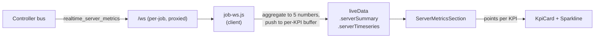

# Live KPI sparklines for server metrics on the job detail page

## Goal

The job detail page already renders two live KPI strips. The AIPerf-side strip
(`RealtimeKpiGrid`) shows live numbers with sparklines fed by the per-job
`/ws` `realtime_metrics` stream. The server-metrics strip
(`ServerMetricsSection`) — covering vLLM / SGLang / TensorRT-LLM / Dynamo
scraped metrics — shows only static aggregate numbers; there is no sparkline.

We add a sparkline to each of the five server-metric KPI tiles, fed off the
existing `realtime_server_metrics` bus message, with the same rolling-window
behavior used today by the AIPerf-side tiles. The page acquires a second live
strip with a consistent visual idiom.

## Non-goals

- Server-side persistence of server-metric history. The rolling buffer is
  client-side only — a page reload starts fresh, matching the AIPerf-side
  strip.
- Per-endpoint multi-line sparklines. The aggregate-line treatment matches the
  existing tile (one headline number per KPI); per-endpoint detail stays in
  the `DetailsTable` directly below.
- SLO chips / threshold callouts on server-metric tiles. There is no
  user-declared SLO surface for server metrics today, and we do not invent
  one.
- Sparklines on completed/epoch views. The artifact (`server_metrics_export.json`)
  has no per-tick history. The empty-state placeholder in `Sparkline`
  reserves the layout space silently — same as the AIPerf-side strip when WS
  is not connected.

## Architecture

The controller already publishes `realtime_server_metrics` on the bus; the
static-v2 dashboard subscribes to it. The job detail page does not. Wiring
the per-job `/ws` proxy to forward that message type to the operator UI
gives us a sample stream at the same cadence the controller scrapes the
inference servers (~1 Hz).



`job-ws.js` adds `realtime_server_metrics` to its subscribe list, normalizes
each frame's `endpoint_summaries` payload via the existing
`normalizeServerMetrics` helper, runs a new lightweight
`aggregateSparklineSnapshot()` that returns a `{kpiId → number}` map, and
pushes one timestamped sample into a per-KPI rolling buffer using the same
`MAX_POINTS = 120` / `MAX_AGE_MS = 5 minutes` constants already in that file.

The aggregator lives next to `curateServerMetrics` in
`components/server-metrics/helpers.js` so the snapshot-to-five-numbers logic
has one source of truth, and the buffer's KPI ids match the curator's KPI
ids exactly.

## Components

### `lib/job-ws.js`

- `SUBSCRIBE_TYPES` becomes `['realtime_metrics', 'realtime_server_metrics']`.
- New module-private state: `serverSummary` (last raw snapshot, kept verbatim
  so the curator can render it identically to the artifact path) and
  `serverTimeseries` (`{ [kpiId]: Array<{t:number, v:number}> }`).
- New `applyRealtimeServerMetrics(payload)` handler:
  1. Stash the raw payload in `serverSummary`.
  2. Normalize via `normalizeServerMetrics(payload)`.
  3. Call `aggregateSparklineSnapshot(normalized)` → `{kpiId → v}` map +
     the latency tile id (`'p99-ttft'` or `'p99-e2e-latency'`) the snapshot
     resolved to.
  4. For each entry, push `{t: Date.now(), v}` into the keyed buffer,
     evicting by both length and age.
- `publish()` payload extends with `serverSummary` and `serverTimeseries`
  alongside the existing `summary`, `timeseries`, `connected`.

### `components/server-metrics/helpers.js`

Add a single new exported function alongside `curateServerMetrics`:

```js
/**
 * Collapse a single normalized snapshot into the five numbers the
 * server-metrics KPI tiles surface, plus the resolved latency-tile id.
 * Returned ids exactly match the ids `curateServerMetrics` uses, so the
 * sparkline buffer keys join cleanly.
 *
 * @param {object} normalizedServerMetrics - shape produced by
 *   `normalizeServerMetrics`
 * @returns {{ values: Object<string, number>, latencyKpiId: string|null }}
 */
export function aggregateSparklineSnapshot(normalizedServerMetrics) { ... }
```

Internally it reuses `pickBestMetricHit`, `aggregateForHit`, `sumOf`,
`maxOf`, `avgOf`, `histogramStat`, and `normalizePercent` exactly as
`curateServerMetrics` does. The latency tile id (`'p99-ttft'` vs
`'p99-e2e-latency'`) is determined the same way as in `curateServerMetrics`
so the buffer's key always matches the eventual KPI's id.

`curateServerMetrics(serverMetrics, sparklines?)` accepts an optional
second argument: `{ [kpiId]: Array<{t,v}> }`. When present, each KPI's
returned object gets a `points` field containing the matching array (or
`undefined` if no points yet). No behavior change when omitted.

### `components/kpi-card.js`

Add an optional prop:

```js
sparkline?: { points: Array<{t:number,v:number}>, stroke?: string, fill?: string }
```

When `sparkline` is present, `KpiCard` renders a `<Sparkline>` between the
existing `metric-card__body` and the (already-conditional) progress bar.
Default colors derive from `tone`:

- `'accent'` (default) → stroke `var(--accent)`, fill `var(--accent-dim)`.
- `'warn'` → stroke `var(--red)`, fill `'rgba(239,83,80,0.15)'`.
- `'ok'` / `'neutral'` / others → stroke `var(--sub)`, fill
  `'rgba(167,167,167,0.10)'`.

Width and height match the AIPerf-side tiles (`width=140`, `height=26`,
explicitly passed; the `Sparkline` component's own defaults are 120 × 28).
The legacy bare-card branch (no `icon`)
keeps current behavior; sparklines are only emitted from the rich-card
branch, which is what `ServerMetricsSection` uses.

### `components/server-metrics/index.js`

`ServerMetricsSection({ serverMetrics, source, sparklines })` accepts a new
optional `sparklines` prop and forwards it into `curateServerMetrics`. Each
KPI rendered in the loop now passes `sparkline=${{ points: kpi.points }}`
to `KpiCard` when `kpi.points` is non-empty.

### `pages/job-detail.js`

Two changes in the existing live merge block:

1. Server-metrics overlay: when WS is connected, prefer `liveData.serverSummary`
   over `status.serverMetrics`. Same pattern as the existing
   `liveData.summary ?? restSummary` overlay used for the AIPerf-side strip.
2. Pass `liveData.serverTimeseries` as the new `sparklines` prop on
   `<ServerMetricsSection>`. On final/epoch views the prop is `undefined`,
   the curator omits `points` on each KPI, and `KpiCard` skips the sparkline
   slot.

## Edge cases

- **KV cache pressure tile retains its `progress` bar.** The instantaneous
  bar (0–100% of capacity right now) and the rolling sparkline (trajectory
  over the last few minutes) carry different information; both are useful
  on a tile that operators watch for saturation.
- **"Requests waiting" gate.** `curateServerMetrics` today hides the tile
  when `waitingPeak ?? waitingAvg <= 0`. We extend that check inside the
  curator: if the optional `sparklines['requests-waiting']` array is
  present and any sample is `> 0`, keep the tile visible. So a transient
  queue earlier in the run keeps the tile up after the queue drains. When
  no sparkline buffer is supplied (final/epoch view), the existing
  snapshot-based gate applies unchanged.
- **Latency tile id flip.** A run can have only TTFT-style histograms or
  only e2e-latency histograms or both; `curateServerMetrics` picks
  whichever is present. `aggregateSparklineSnapshot` makes the same pick on
  every frame, returning `latencyKpiId` so the WS layer keys the buffer
  consistently. If the same run produces both at different times (an
  unlikely re-scrape edge case), the buffer has whichever id was current
  at the time — visually fine; `Sparkline` just renders fewer points if
  the id flipped mid-run.
- **WS reconnect / page hide.** Reconnect loop already handles dropouts.
  When the tab is backgrounded, the controller still scrapes; on
  reconnect the buffer resumes from "now" (no backfill).
- **Run terminates while WS is still connected.** The existing
  `wsActive` gate clears `liveData` on phase transition; sparklines empty
  out to placeholders, the artifact-path snapshot takes over the numbers.
- **No server metrics at all.** `ServerMetricsSection` already returns
  `null` when `curateServerMetrics` returns nothing; no behavior change.

## Testing

- **Unit (helpers.js).** `aggregateSparklineSnapshot` against the existing
  server-metrics fixtures (dynamo-frontend, vllm-only, sglang-only, mixed
  backends, both latency-histogram shapes), asserting the five returned
  numbers and the latency id match what `curateServerMetrics` produces from
  the same fixture.
- **Unit (job-ws.js).** Feed two synthetic `realtime_server_metrics` frames
  through the handler; assert `serverTimeseries` has the right keys, length,
  and that timestamps are monotonic.
- **No new component snapshot tests.** Visual change is local to `KpiCard`
  (a sparkline slot under the value row) and the existing server-metrics
  fixtures in `ServerMetricsSection.test.js` keep working unchanged because
  `sparklines` is optional. Eyeball the live UI in dev for layout.

## Out of scope (future work)

- Per-endpoint sparkline overlay (option A2 from the brainstorm).
- Server-side rolling buffer so reloads keep the last N minutes.
- A shared `LiveKpiTile` that unifies `KpiTile` and `KpiCard` (option L3).
- SLO chips on server-metric tiles.
