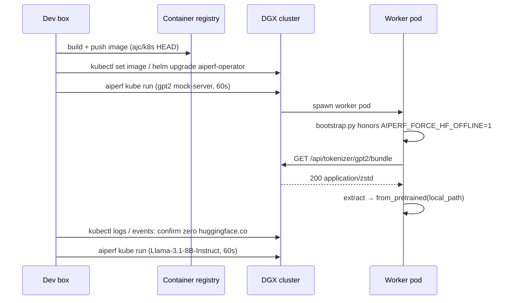

# Tokenizer Bundle Path — Test-Out + Hardening

**Date:** 2026-04-30
**Status:** Design — pending implementation plan
**Branch:** `ajc/k8s`
**Predecessor:** [`2026-04-26-tokenizer-distribution-design.md`](2026-04-26-tokenizer-distribution-design.md) §9 post-deploy lessons
**Scope:** Kubernetes mode only. Local mode is unchanged.

## 1. Why

The K8s tokenizer distribution path shipped as commit `956cd5920` and survived
its first DGX smoke. The post-deploy walk surfaced three follow-ups that did
not block ship but warrant a focused hardening pass before this branch merges:

- **`TokenizerBundleRegistry` is dead in production** but still imported,
  exported, mounted, and tested — confusing for future readers and a hazard
  if someone tries to "fix" it.
- **Worker air-gap is enforced only by application code.** A future regression
  that re-introduces `AutoTokenizer.from_pretrained(name)` on the worker side
  would silently re-establish HF egress with no test failure.
- **`download_tokenizer` is not crash-atomic.** A partial extraction leaves a
  half-populated `{slug}/` directory with no `.ready` sentinel; on retry the
  next extract writes over an inconsistent tree.

Plus two end-to-end gaps:

- **Test coverage is single-process.** Every existing test runs the warmer and
  the router in one Python process; the production topology is two
  containers with separate interpreters. The §9.1 class of failures is
  invisible to current CI.
- **No K8s smoke before merge.** The post-deploy notes explicitly call out
  that a 1-minute mock-server smoke on a real cluster would have caught R1
  and R3.

## 2. Scope

In-scope:

1. **C — code hardening:** delete dead registry plumbing; add a worker-only
   `AIPERF_FORCE_HF_OFFLINE=1` env-var belt; make `download_tokenizer`
   crash-atomic; clean up the 404 message to not echo HF Hub error text.
2. **B — test coverage:** rewrite the component-integration round-trip to
   match the production HF_HOME-priming path (no registry); add a
   same-pod-different-container test that spawns the FastAPI app in a
   subprocess.
3. **A — DGX smoke:** build a hardened image off `ajc/k8s` HEAD, roll on the
   DGX cluster, run a 60-second `gpt2` benchmark and a `meta-llama/Llama-3.1-8B-Instruct`
   benchmark, validate worker air-gap and bundle-fetch behaviour, fix any
   surfaced gaps.

Out of scope (deferred):

- Persistent (PVC) tokenizer cache across pod restarts.
- Tokenizer revision pinning in the bundle URL — already deferred by the
  predecessor spec §8 and not biting.
- Real-streaming download (`resp.read()` is fine — bundles are <10 MB).
- Cache-bounding the per-name `bundle_cache: dict[str, bytes]` — already
  bounded by the run's tokenizer cardinality (typically 1, never adversarial).
- K8s chaos test — a separate spec covers chaos injection.

## 3. Architecture (post-hardening)

The high-level data flow is unchanged from the predecessor spec §3:

- Controller pod's `api` container runs `_prewarm_tokenizers()` before binding
  uvicorn — calls `AutoTokenizer.from_pretrained(name)` for every configured
  tokenizer, populating the shared `tokenizer-cache` emptyDir mounted at
  `HF_HOME`.
- Worker pods call `GET /api/tokenizer/{name:path}/bundle` against the api
  container; the router serves a cached `tar+zstd` payload built from the
  HF snapshot directory resolved via `snapshot_download(local_files_only=True)`.
- Workers untar into `{MMAP_BASE_PATH}/aiperf_tokenizers/{benchmark_id}/{slug}/`
  and load via `AutoTokenizer.from_pretrained(local_path)`.

What changes:

### 3.1 No more `TokenizerBundleRegistry`

- Delete `src/aiperf/common/tokenizer_bundle_registry.py`.
- Delete `_DEFAULT_REGISTRY`, `set_default_registry`, `get_default_registry`,
  and the registry-population branches in `tokenizer_validator._partition_cached_names`
  and `tokenizer_validator._prefetch_tokenizers`. Those branches were
  cross-container no-ops anyway.
- Drop the `registry: TokenizerBundleRegistry | None = None` parameter on
  `build_tokenizer_router` and `_resolve_snapshot_dir` in
  `src/aiperf/api/routers/tokenizer.py`. The router resolves snapshot dirs
  via `snapshot_download(local_files_only=True)` only.
- Delete `tests/unit/common/test_tokenizer_bundle_registry.py` and
  `tests/unit/common/test_tokenizer_validator_registry.py`.
- Trim the registry-using paths from `tests/unit/common/test_tokenizer_validator.py`.
- Rewrite `tests/component_integration/test_tokenizer_distribution_round_trip.py`
  to use a hermetic `HF_HOME` instead of the registry (see §3.4).

The 404 detail is rewritten to not echo HF Hub error text:

```python
# was:
detail=f"tokenizer '{name}' not found on HuggingFace Hub: {exc}"
# becomes:
detail=f"tokenizer '{name}' not configured for this run"
```

### 3.2 Air-gap belt via controller-pod opt-out

Today, `bootstrap.py:66` skips `HF_HUB_OFFLINE`/`TRANSFORMERS_OFFLINE` when
`AIPERF_JOB_ID` is set — but `AIPERF_JOB_ID` is set on **every** pod
(controller + workers). Worker air-gap therefore depends entirely on
`download_tokenizer` + `from_pretrained(local_path)` not regressing.

The hardening uses **opt-out** (not opt-in) to preserve the local-mode
default. The bootstrap default is "enable offline mode in children"; the
controller pod alone opts out because its api / dataset-manager containers
need HF egress for prewarming and synthetic-dataset generation.

- The operator injects `AIPERF_CONTROLLER_POD=1` **on controller-pod
  containers only** (the eight-container controller pod). Worker pods do
  not receive this var. Add the injection next to the existing
  controller-pod env construction in
  `src/aiperf/kubernetes/jobset.py` / `kubernetes/jobset_helpers.py`.
- `bootstrap.py` flips its gate to opt-out:

  ```python
  # Controller-pod containers (api / dataset-manager / ...) need HF egress
  # for prewarming and synthetic-dataset prompt generation. Every other
  # context (worker pods, local mode) defaults to offline.
  if os.environ.get("AIPERF_CONTROLLER_POD") != "1":
      _enable_hf_offline_mode()
  ```

Behaviour matrix:

| Context              | `AIPERF_JOB_ID` | `AIPERF_CONTROLLER_POD` | Offline? |
| -------------------- | --------------- | ----------------------- | -------- |
| Local mode           | unset           | unset                   | **yes**  |
| K8s controller pod   | set             | `1`                     | no       |
| K8s worker pod       | set             | unset                   | **yes**  |

Local mode behaviour is preserved (still offline as today). Worker pods
gain the air-gap belt: a future regression that re-introduces
`AutoTokenizer.from_pretrained(name)` blows up with an offline-mode error
instead of silently re-establishing HF egress. Controller pod keeps full
HF access via the explicit opt-out.

The deviation from predecessor §9.2's suggested direction (worker-pod
opt-in via `AIPERF_FORCE_HF_OFFLINE=1`) is deliberate: opt-in would
require local mode to also set the env var or accept losing its current
offline default, neither of which is preferable to a clean opt-out.

### 3.3 Crash-atomic extract in `download_tokenizer`

Today `_extract_bundle(compressed, dest)` writes directly into `dest`,
then `sentinel.write_text("ok")`. A crash mid-tar leaves a partially
populated `dest/` with no sentinel; on retry, the next `extractall` runs
on top of the partial tree.

The fix: extract into a sibling tmp dir, then atomically rename:

```python
tmp = dest.with_name(dest.name + ".tmp")
if tmp.exists():
    shutil.rmtree(tmp)
tmp.mkdir(parents=True)
_extract_bundle(compressed, tmp)
(tmp / ".ready").write_text("ok")
os.replace(tmp, dest)  # atomic on same fs
```

The sentinel moves *inside* the bundle dir so it survives the rename atomically;
the existing `if sentinel.exists(): return dest` short-circuit at the top of
`download_tokenizer` keeps working unchanged.

### 3.4 Component-integration test simplification

`tests/component_integration/test_tokenizer_distribution_round_trip.py`
becomes registry-free:

```python
async def test_round_trip_gpt2(running_api, tmp_path, monkeypatch):
    # Hermetic HF cache so the test never depends on developer-machine state.
    hf_home = tmp_path / "hf"
    hf_home.mkdir()
    monkeypatch.setenv("HF_HOME", str(hf_home))
    AutoTokenizer.from_pretrained("gpt2")  # populate hermetic cache

    base_url = await running_api(hf_home=hf_home)  # fixture spawns app

    local_path = await download_tokenizer(
        api_base_url=base_url,
        name="gpt2",
        dest_root=tmp_path / "dl",
        max_retries=3,
        logger=logging.getLogger("test"),
    )

    expected = AutoTokenizer.from_pretrained("gpt2").encode("Hello, world!")
    monkeypatch.setenv("HF_HUB_OFFLINE", "1")
    monkeypatch.setenv("TRANSFORMERS_OFFLINE", "1")
    actual = AutoTokenizer.from_pretrained(str(local_path)).encode("Hello, world!")
    assert actual == expected
```

The `running_api` fixture mounts `build_tokenizer_router()` (no args) and
serves over a free port.

### 3.5 New cross-process test

`tests/component_integration/test_tokenizer_router_cross_process.py`:

- Parent process: prepare a hermetic `HF_HOME` directory, prime it with
  `AutoTokenizer.from_pretrained("gpt2")`.
- Use `multiprocessing.get_context("spawn").Process` to launch the FastAPI
  app in a child interpreter with `HF_HOME` set in env. (`spawn` is required
  — `fork` would inherit the parent's already-imported `transformers` and
  hide the cross-interpreter contract we're trying to validate.)
- Wait for the child's `/health` (or a TCP connect probe) to come up.
- Run `download_tokenizer` from the parent against the child.
- Assert round-trip correctness as in B-1.

This catches the §9.1 regression class: any future change that re-introduces
process-local Python state for cross-container coordination (a global
registry, an in-memory mutex, etc.) will fail this test because the child
process literally cannot see parent state.

## 4. DGX smoke procedure



Validation checklist (per smoke run):

- [ ] Worker pods boot to RUNNING within the controller's startup budget.
- [ ] Each worker pod fetches the bundle exactly once (per pod, per benchmark).
- [ ] Worker pod env: `AIPERF_CONTROLLER_POD` unset; child processes show
      `HF_HUB_OFFLINE=1` and `TRANSFORMERS_OFFLINE=1` once `_configure_child_process`
      has run.
- [ ] Worker pod logs and events: zero references to `huggingface.co` or
      `connection refused` against HF.
- [ ] Controller pod env: `AIPERF_CONTROLLER_POD=1` on every container —
      `_prewarm_tokenizers` succeeds without touching the offline env.
- [ ] Benchmark completes; results sidecar exposes the artifact tree.

If any check fails, the failure mode + fix lands as an inline amendment to
this spec (§6) and a follow-up commit on `ajc/k8s`.

## 5. Failure & edge cases

- **Mid-extract crash → retry on different pod restart.** Atomic rename in
  §3.3 means the next download sees no `dest/`, recreates `dest.tmp/`, and
  atomically swaps. No half-state.
- **Sentinel collision under WGM/RP race.** Both containers race
  `download_tokenizer`; first acquires `flock` and runs the extract+rename;
  second arrives, sees `sentinel.exists()` (because `.ready` is inside the
  renamed dir), short-circuits. Lock file at the original location.
  - **Operator adds `AIPERF_CONTROLLER_POD=1` to a worker container.**
  Worker pods would lose offline-mode protection. The jobset construction
  site is the single place this is decided; a unit test on
  `kubernetes/jobset.py` asserts the controller-pod env list contains it
  and the worker-pod env list does not.
- **Hermetic HF_HOME under pytest-xdist.** Each test gets its own `tmp_path`,
  but `transformers` caches its tokenizer registry process-wide.
  `AutoTokenizer.from_pretrained` uses a per-process LRU; under xdist the
  test is in its own subprocess, so isolation is automatic.

## 6. Test plan

- **Unit:**
  - `tests/unit/common/test_bootstrap.py` (extend) — assert that
    `AIPERF_CONTROLLER_POD=1` keeps the offline env vars unset; absence of
    it (local mode, worker pods) sets both.
  - `tests/unit/kubernetes/test_jobset.py` (extend) — assert controller-pod
    env contains `AIPERF_CONTROLLER_POD=1`; worker-pod env excludes it.
  - `tests/unit/workers/test_worker_pod_tokenizer_download.py` (extend) —
    new test: extract crashes mid-tar (monkeypatch `_extract_bundle` to
    `raise` after creating one file in `tmp`), verify retry succeeds and
    leaves no half-state.
  - `tests/unit/api/routers/test_tokenizer_router.py` (extend) — 404 detail
    no longer echoes HF Hub error text.
- **Component-integration:**
  - `test_tokenizer_distribution_round_trip.py` rewritten per §3.4.
  - `test_tokenizer_router_cross_process.py` new per §3.5.
- **DGX smoke (manual):**
  - Two benchmark runs (`gpt2` + `meta-llama/Llama-3.1-8B-Instruct`); the
    §4 checklist must hold for each.

## 7. File map

Modified:

- `src/aiperf/common/bootstrap.py` — gate offline mode on
  `AIPERF_FORCE_HF_OFFLINE`, drop the `AIPERF_JOB_ID` guard.
- `src/aiperf/common/tokenizer_validator.py` — remove
  `_DEFAULT_REGISTRY`, `set_default_registry`, `get_default_registry`,
  registry branches in `_partition_cached_names` and `_prefetch_tokenizers`.
- `src/aiperf/api/routers/tokenizer.py` — drop the `registry` parameter,
  remove the `TYPE_CHECKING` import, simplify `_resolve_snapshot_dir`,
  rewrite the 404 detail.
- `src/aiperf/api/api_service.py` — no change (already calls
  `build_tokenizer_router()` with no args; once the parameter goes away,
  this is a no-op).
- `src/aiperf/workers/worker_pod_tokenizer_download.py` — extract-to-tmp +
  atomic rename, sentinel inside the dir.
- `src/aiperf/kubernetes/jobset.py` (or `kubernetes/jobset_helpers.py` —
  whichever owns worker-pod env construction) — inject
  `AIPERF_FORCE_HF_OFFLINE=1` on worker pods only.

Deleted:

- `src/aiperf/common/tokenizer_bundle_registry.py`.
- `tests/unit/common/test_tokenizer_bundle_registry.py`.
- `tests/unit/common/test_tokenizer_validator_registry.py`.

Tests modified:

- `tests/unit/common/test_tokenizer_validator.py` — drop registry-using
  cases.
- `tests/unit/common/test_bootstrap.py` (new or extended).
- `tests/unit/kubernetes/test_jobset.py` (extended).
- `tests/unit/workers/test_worker_pod_tokenizer_download.py` (extended).
- `tests/unit/api/routers/test_tokenizer_router.py` (extended).
- `tests/component_integration/test_tokenizer_distribution_round_trip.py`
  (rewritten).

Tests added:

- `tests/component_integration/test_tokenizer_router_cross_process.py`.

## 8. Sequencing

1. **Phase C (code hardening, sequential):**
   1. C-1 Delete registry plumbing + rewrite component-integration round-trip.
   2. C-2 Worker-pod-only air-gap belt + bootstrap gate flip.
   3. C-3 Atomic extract + 404 message clean-up.
2. **Phase B (tests, sequential after C):**
   1. B-1 Rewritten component-integration round-trip (covered by C-1).
   2. B-2 Cross-process round-trip (new file).
3. **Phase A (DGX smoke, after B is green):**
   1. A-1 Build + push image off `ajc/k8s` HEAD.
   2. A-2 Roll the operator on DGX.
   3. A-3 Run `gpt2` smoke; validate §4 checklist.
   4. A-4 Run `meta-llama/Llama-3.1-8B-Instruct` smoke; validate §4
      checklist.
   5. A-5 If anything surfaced, fix on `ajc/k8s` and re-roll.

Each phase is one or more commits on `ajc/k8s` (no feature branch, no
worktree). C and B commits use `git commit -s` (no parallel agents, so
default pre-commit is fine). A is operational, not code.
