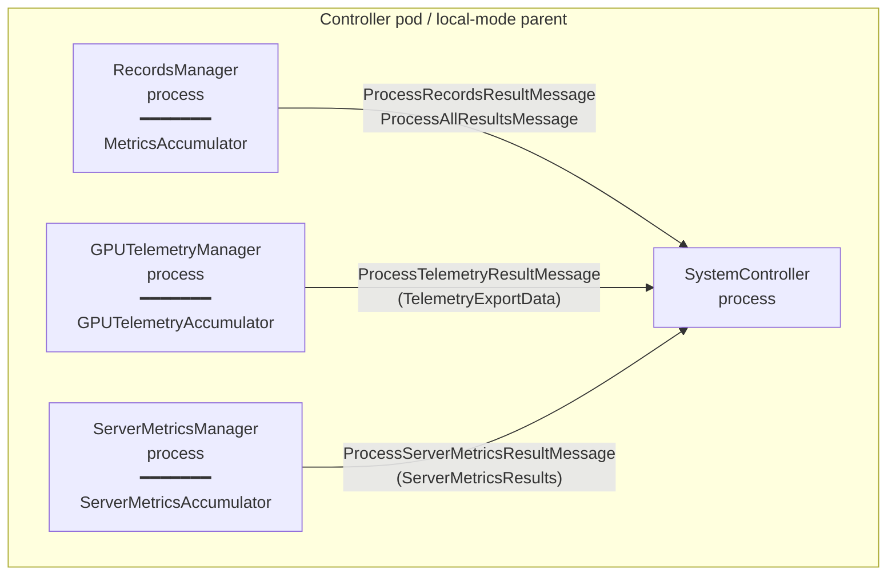
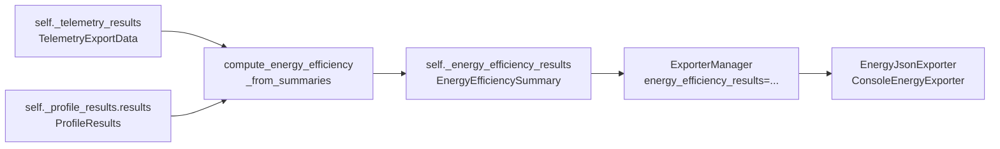

# Cross-Input Analyzer Relocation

**Date:** 2026-05-02
**Status:** Spec, pending plan
**Branch:** `ajc/k8s-metrics`
**Related:** `src/aiperf/analysis/energy_analyzer.py`, `src/aiperf/records/records_manager.py`, `src/aiperf/controller/system_controller.py`, `src/aiperf/plugin/plugins.yaml`

## Problem

The metrics-accumulator port introduced an `analyzer` plugin category for cross-accumulator computations: each analyzer declares `required_accumulators: ClassVar[set[AccumulatorType]]` and at summarize time receives a `SummaryContext` from which it pulls accumulator instances by type. The design assumes all declared accumulators live in the same process.

That assumption holds on the upstream metrics-accumulator branch, where all metrics flow through a single in-process accumulator pipeline. It does not hold on `ajc/k8s-metrics`. On both K8s deployments and local-mode (`MultiProcessServiceManager`), the controller pod runs three separate manager containers — `RecordsManager`, `GPUTelemetryManager`, `ServerMetricsManager` — each in its own OS process. GPU telemetry and Prometheus server-metrics records flow through their own side-channel pipelines (`gpu_telemetry_processor` / `server_metrics_processor` plugin categories) and never reach RecordsManager.

Concretely: `RecordsManager.__init__` calls `load_accumulators(self)`, which iterates *all* `accumulator` plugins and instantiates each one locally. The dispatch step (`accumulators_for_record_type(self._accumulators, "metric_records")`) only routes records to accumulators whose plugin metadata declares the matching record type. So the records-manager-local `GPUTelemetryAccumulator` instance is constructed, but no records are ever fed to it — its `_hierarchy.dcgm_endpoints` dict stays empty for the entire run. The actual GPU telemetry data lives in `GPUTelemetryManager`'s process and is reported back to `SystemController` (not `RecordsManager`) via `ProcessTelemetryResultMessage`.

The visible consequence: `EnergyEfficiencyAnalyzer.summarize()` calls `ctx.get_accumulator(AccumulatorType.GPU_TELEMETRY)`, gets the empty local instance, iterates zero endpoints, finds zero energy, and raises `PluginDisabled("No GPU energy data available")`. `compute_analyzer_outputs` silently swallows the disabled exception, and the analyzer produces no output — even on runs where `--gpu-telemetry` is enabled and the side-channel collected good data.

`SteadyStateAnalyzer` is unaffected because its only declared dependency is `MetricsAccumulator`, which lives in `RecordsManager`'s process. Single-input analyzers work; cross-input analyzers don't.

## Approach

Relocate cross-input analysis to `SystemController`, the natural fan-in point that already receives summarized payloads from all three manager processes. Replace `EnergyEfficiencyAnalyzer` (currently an `AnalyzerProtocol` implementation) with a plain function `compute_energy_efficiency_from_summaries` that takes `TelemetryExportData` and `ProfileResults` directly. SystemController calls it as part of `_export_results_data` once fan-in is complete.

This decision rests on three observations:

1. **The data already arrives at SystemController in the right shape.** `TelemetryExportData.endpoints[ep].gpus[gpu].metrics["energy_consumption"|"gpu_power_usage"]` is already summarized over the profiling window — `is_counter` is determined at `gpu_telemetry/accumulator.py:313` and passed to `get_metric_result()` at line 320, so `JsonMetricResult.avg` for `energy_consumption` *is* the counter delta in MJ. Inference summary scalars (`request_throughput`, `output_token_throughput`, etc.) live on `ProfileResults.records: list[MetricResult]` with a `get(tag) -> MetricResult | None` lookup. The compute surface needs scalar inputs; both inputs are already scalar.

2. **Cross-input analyzers only need their inputs *once*, post-finalize.** No streaming requirement, no live windowing requirement. `_check_and_trigger_shutdown` already gates on `_should_wait_for_telemetry` / `_should_wait_for_server_metrics` / `_profile_results_received` and triggers `_export_results_data` exactly once, when all three are clear. Running the cross-input analyzer at the start of `_export_results_data` means all inputs are guaranteed-populated.

3. **Shared memory is overkill for summary scalars.** A future analyzer that needs raw time-series (per-record latency × per-100ms GPU power) might justify SHM; the current cross-input analyzer needs sub-KB of summary data.

## Goals

- `EnergyEfficiencyAnalyzer` produces non-`None` results on K8s and local-mode runs whenever `--gpu-telemetry` is enabled and the side-channel collected energy or power data.
- Both DCGM-counter and power-integration energy paths preserved (no feature regression vs. current code on a hypothetical single-process run).
- `JsonExporter` / `ConsoleEnergyExporter` / CSV exporter consume the populated value with no exporter-side changes.
- Tests survive the refactor without false positives — old tests that mocked `SummaryContext` get rewritten against the new function signature, not duct-taped.
- The records-manager analyzer pipeline keeps working unchanged for genuinely single-input analyzers (`SteadyStateAnalyzer`, `AccuracyResultsProcessor`).

## Non-goals

- Plugin extensibility for cross-input analyzers. After this change, third-party plugins cannot register controller-side analyzers. If/when a real second cross-input analyzer lands, the plugin model can be extended (likely via a `process_role: ClassVar[Literal["records_manager", "controller"]]` discriminator on `AnalyzerProtocol`); doing it speculatively now means designing against requirements we don't have.
- Server-metrics-aware analyzers. The structure proposed here can host one — `ServerMetricsResults` is also available on `SystemController` — but no such analyzer exists today and the test/scaffolding cost of adding a registry pattern up front isn't paid back by zero consumers.
- Shared-memory infrastructure. Sketched in conversation, deferred. Becomes interesting only if/when a future analyzer needs raw time-series cross-correlation across processes (e.g., the research notes in `docs/dev/research-*-correlation.md`).
- Migrating `SteadyStateAnalyzer` or any other single-input analyzer. The records-manager-side analyzer pipeline stays as-is for those.

## Architecture

### Process topology (unchanged by this spec)



All three manager processes already publish summarized payloads to `SystemController` over the existing ZMQ event bus on `PROFILE_COMPLETE`. The data needed for cross-input analysis is already in `SystemController`'s state by the time `_export_results_data` runs.

### Compute path (after this change)



`ExporterManager.__init__` already accepts `energy_efficiency_results: EnergyEfficiencySummary | None` and propagates it via `ExporterConfig`. No exporter-side changes needed.

### Module layout

The compute function lives in `src/aiperf/analysis/energy_analyzer.py` alongside the `EnergySource`, `EnergyEfficiencySummary`, `_safe_div`, and `_build_metric_results` helpers it shares with the deleted `EnergyEfficiencyAnalyzer` class. No new module. A `controller/cross_input_analyzers.py` location was considered and rejected — for one function, the indirection is overhead; if a second analyzer lands, the structure can be revisited with a real second consumer informing the design.

## Concrete changes

### `src/aiperf/analysis/energy_analyzer.py`

Delete `EnergyEfficiencyAnalyzer` (the class — `__init__`, `summarize`, `_extract_energy`, `_compute_derived`, ClassVars). Keep `EnergySource`, `EnergyEfficiencySummary`, `_safe_div`, `_build_metric_results`. Add three functions:

```python
def compute_energy_efficiency_from_summaries(
    *,
    telemetry: TelemetryExportData | None,
    profile_results: ProfileResults | None,
) -> EnergyEfficiencySummary | None:
    """Compute energy efficiency from already-summarized telemetry + profile results.

    Returns None when inputs are insufficient (no telemetry, no profile results,
    no energy/power readings) — caller writes the result to
    self._energy_efficiency_results only when non-None. This is the single
    compute path; it runs controller-side because the underlying accumulators
    live in separate processes.
    """
```

```python
def _extract_energy_from_summary(
    telemetry: TelemetryExportData,
    duration_s: float,
) -> tuple[float, float, int, EnergySource]:
    """Sum energy + power across published GPUs, with power-integration fallback.

    Mirrors the deleted EnergyEfficiencyAnalyzer._extract_energy: prefer
    DCGM energy_consumption counter when present on at least one GPU; fall
    back to total_power_w * duration_s otherwise. Reads JsonMetricResult.avg
    fields directly instead of calling time-window-aware accumulator methods.

    MJ -> J conversion is hard-coded; unit fixed at gpu_telemetry/constants.py:41
    (EnergyMetricUnit.MEGAJOULE). Both sides break together if the unit ever
    changes — that's intentional.
    """
```

```python
def _compute_derived_from_profile(
    profile_results: ProfileResults,
    *,
    total_energy_j: float,
    avg_power_w: float,
) -> dict[str, float | None]:
    """Derive per-token / per-watt metrics from inference summary scalars.

    Reads via profile_results.get(tag) (returns MetricResult | None) instead
    of the AccumulatorMetricsSummary.results[tag] lookup the deleted
    in-process path used. Same math, different source.
    """
```

A small `_get_avg(profile_results: ProfileResults, tag: str) -> float | None` helper at module level handles the `MetricResult | None` -> `.avg | None` chain. No closures.

**No import-time validation.** An earlier draft included `_validate_tag_constants()` at module load to catch tag drift, but `MetricRegistry` is populated by plugin discovery during service bootstrap — running the validation at import time would fire against an empty registry and break startup. Tag drift is left to tests; if it becomes a real maintenance burden, a CI-time check (`tools/check_*.py`-style) is the right place, not runtime.

Net file size delta: roughly **−85 LOC**. The new functions are ~85-100 LOC combined; the deleted `EnergyEfficiencyAnalyzer` class spans lines 108-289 (≈180 LOC). `EnergyEfficiencySummary`, `_safe_div`, `_make_time_filter`, and `_build_metric_results` stay.

### `src/aiperf/controller/system_controller.py`

One import, one block:

```python
from aiperf.analysis.energy_analyzer import compute_energy_efficiency_from_summaries

# Inside _export_results_data, before ExporterManager construction:
if (
    not self.run.cfg.gpu_telemetry_disabled
    and self._energy_efficiency_results is None
):
    profile = self._profile_results.results if self._profile_results else None
    self._energy_efficiency_results = compute_energy_efficiency_from_summaries(
        telemetry=self._telemetry_results,
        profile_results=profile,
    )
```

The `is None` check is structurally always true on the K8s/multi-process path (records-manager can never populate it because the local `GPUTelemetryAccumulator` is empty). Kept anyway as a guard against the hypothetical single-process case where `EnergyEfficiencyAnalyzer.summarize` *could* succeed in records-manager — except that class no longer exists after this PR, so the guard is documentation-only. Honest framing: the check costs nothing and signals intent.

The exact insertion point inside `_export_results_data` (currently `system_controller.py:1564`) goes between the K8s `write_processing_marker` call (line 1595) and the `ExporterManager` construction (line 1597). The inputs are guaranteed-populated by the existing `_check_and_trigger_shutdown` gate before this function is ever invoked, so order relative to the RP shutdown work earlier in the function is immaterial — the energy compute reads only `self._telemetry_results` and `self._profile_results`.

### `src/aiperf/plugin/plugins.yaml`

Remove the `energy_efficiency` entry under `analyzer:`:

```yaml
# Delete this block:
energy_efficiency:
  class: aiperf.analysis.energy_analyzer:EnergyEfficiencyAnalyzer
  description: |
    Cross-accumulator energy efficiency metrics. ...
```

`steady_state` and `accuracy_results` stay. The dynamic `AnalyzerType` enum stops generating an `ENERGY_EFFICIENCY` member — load_analyzers in records-manager has nothing to instantiate, no `PluginDisabled` to swallow.

### `src/aiperf/records/records_manager.py`

One cleanup in `_publish_all_results`:

```python
# Before:
energy_efficiency_results=analyzer_outputs.get(
    AnalyzerType.ENERGY_EFFICIENCY
) if hasattr(AnalyzerType, "ENERGY_EFFICIENCY") else None,

# After:
# energy_efficiency_results is populated controller-side (SystemController._export_results_data),
# not records-manager-side, because the GPU telemetry accumulator lives in a separate process.
energy_efficiency_results=None,
```

The `hasattr` short-circuit guard becomes permanently false after the plugin entry is removed; the explicit `None` is clearer than the load-bearing-evaluation-order trick.

### `src/aiperf/plugin/categories.yaml`

Update the `analyzer:` description to reflect the constraint that emerges from this change:

```yaml
analyzer:
  protocol: aiperf.common.accumulator_protocols:AnalyzerProtocol
  enum: AnalyzerType
  description: |
    Single-input analyzers that derive results from one accumulator at
    summarization time, running in records-manager. Cross-input analysis
    (correlating data from multiple accumulators that live in separate
    processes — GPU telemetry, server metrics, inference) runs
    controller-side as plain functions, not analyzer plugins.
```

## Tests

`tests/unit/analysis/test_energy_analyzer.py` is **rewritten**, not extended. The old tests targeted `EnergyEfficiencyAnalyzer.summarize(SummaryContext)` with mocked `GPUTelemetryAccumulator` instances and `SummaryContext.get_accumulator` / `get_output` patches. The new tests construct `TelemetryExportData` and `ProfileResults` directly and call `compute_energy_efficiency_from_summaries` — fewer mocks, more honest about what production actually exercises.

Cases (one per behavioral branch unless noted):

| Case | Branch exercised |
|---|---|
| `test_returns_none_when_telemetry_missing` | `telemetry is None` early return |
| `test_returns_none_when_profile_results_missing` | `profile_results is None` early return |
| `test_returns_none_when_no_endpoints` | empty `endpoints` dict → `EnergySource.UNAVAILABLE` |
| `test_returns_none_when_no_metrics` | endpoint + GPU present, empty `metrics` dict |
| `test_dcgm_counter_path` | `energy_consumption` present → `EnergySource.DCGM_COUNTER` |
| `test_power_integration_fallback` | no `energy_consumption`, `gpu_power_usage` only → `EnergySource.POWER_INTEGRATION` |
| `test_dual_gpu_sums_energy_and_power` | two GPUs, totals correct |
| `test_missing_optional_inference_metrics` | `goodput` missing → `goodput_per_watt is None`, others computed |
| `test_mj_to_j_conversion` | `energy_consumption.avg = 1.5` MJ → `total_gpu_energy_j == 1.5e6` |
| `test_cancelled_run_still_produces_results` | `was_cancelled=True` but valid telemetry → non-`None` summary (contract test, no branch) |

Plus a new `tests/unit/controller/test_system_controller_energy_fan_in.py` — fixture-driven SystemController stub that injects `ProcessTelemetryResultMessage` + `ProcessRecordsResultMessage`, drives `_check_and_trigger_shutdown`, and asserts `_energy_efficiency_results` is populated by the time `_export_results_data` is reached. Reuses existing SystemController test fixture patterns.

Estimated test LOC: ~250 across both files. Most is fixture construction (`TelemetryExportData` with synthetic `endpoints`/`gpus`/`metrics` dicts, `ProfileResults` with `MetricResult` lists) — not test logic.

Integration coverage (e2e benchmark with telemetry enabled, asserting the energy efficiency summary surfaces in JSON export): explicitly **out of Phase 1 scope**. AIPerf's integration suite has no fake DCGM fixture today; building one is its own piece of work. Tracked separately as a follow-up if/when telemetry test infra exists.

## Risks & open questions

**Time-window alignment between telemetry and profile.** RecordsManager passes `start_ns`/`end_ns` to side-channels via `PROFILE_COMPLETE` payload (`records_manager.py:299`), so the windows should match exactly. Synthetic unit tests don't exercise the wire path — the only test that catches a misalignment is an e2e run, which we're explicitly deferring. Acceptable risk: a window mismatch would manifest as energy/request math being slightly off, not silently wrong results.

**Hard-coded MJ→J multiplier.** The `1e6` constant in `_extract_energy_from_summary` is brittle — if `gpu_telemetry/constants.py:41` ever changes `EnergyMetricUnit.MEGAJOULE` to a different unit, this side breaks. Mitigation: the `_GPU_TELEM_ENERGY_TAG` constant in `energy_analyzer.py` carries a comment pointing at the source, and the test `test_mj_to_j_conversion` pins the expected output. A dimensional-analysis approach (read `JsonMetricResult.unit` and convert) is cleaner but adds runtime branching for a unit that has never changed.

**Telemetry-disabled-but-flag-set deadlock.** If `gpu_telemetry_disabled=False` but `GPUTelemetryManager` crashes before publishing, `_should_wait_for_telemetry` stays True and shutdown never triggers. This is an existing concern in the controller fan-in machinery, not introduced by this change. If observed in the wild, the fix lives in `_check_and_trigger_shutdown` timeouts, separately scoped.

**Power-integration fallback location.** The fallback (`total_energy_j = total_power_w * duration_s` when no DCGM counter) is reimplemented in `_extract_energy_from_summary`, mirroring the deleted in-process code. A cleaner alternative pushes the fallback into `GPUTelemetryManager` so the published `TelemetryExportData` always carries a populated `energy_consumption` (synthesized when needed). Deferred to a follow-up because it changes the wire contract — JSON exporters and dashboard consumers also read `TelemetryExportData.endpoints[].gpus[].metrics["energy_consumption"]` and would start seeing values for previously-empty cases. Worth doing, not in Phase 1.

**Tag-drift detection.** Hard-coded tag strings (`"output_token_throughput"`, `"energy_consumption"`, etc.) silently degrade to `None`-everywhere if any tag is renamed. Tests catch most drift, but only for paths the tests exercise. If tag drift becomes a real maintenance issue, a CI-time `tools/check_energy_analyzer_tags.py` that asserts the constants exist in their respective registries is the right place — not import-time runtime validation.

## Out of scope (explicit)

- **`process_role` discriminator on `AnalyzerProtocol`.** Would let controller-side analyzers be plugins. Justified only when there's a second cross-input analyzer needing it; speculative design otherwise.
- **Server-metrics-aware analyzers.** Structure permits one (`ServerMetricsResults` is on SystemController), no consumer today.
- **Shared-memory inter-process accumulator access.** Considered for time-series cross-correlation analyzers (raw GPU samples × per-record latency). The summary-level data needed today is sub-KB; SHM only earns its keep at MB-scale raw arrays. Tracked in conversation notes; revisit when a real consumer materializes.
- **Pushing the power-integration fallback into `GPUTelemetryManager`.** Cleaner long-term, deferred because of wire-contract ripple.
- **Integration-test for energy efficiency e2e.** Requires fake DCGM fixture; separate piece of work.

## Exit criteria

- `compute_energy_efficiency_from_summaries` exists and is called from `SystemController._export_results_data`.
- `EnergyEfficiencyAnalyzer` class is deleted; `analyzer.energy_efficiency` plugin entry is removed.
- All ten unit cases in `test_energy_analyzer.py` pass.
- The new SystemController fan-in test passes.
- `make check-ergonomics` and `make check-ruff-baselined` pass with zero new violations.
- Manual smoke: an end-to-end `aiperf profile` run (local-mode, multi-process) with `--gpu-telemetry` enabled and a reachable PYNVML/DCGM endpoint produces a non-empty `metrics` block in `profile_export_aiperf_energy_efficiency.json` (filename derived from `ArtifactsConfig.profile_export_energy_efficiency_json_file` at `src/aiperf/config/artifacts.py:240`). (This run does not require K8s — `MultiProcessServiceManager` reproduces the cross-process condition.)

## Implementation note

The change is implementable in a single sitting (~2 hours including testing). It does not require a `superpowers:writing-plans` plan document — the file deltas are concrete, the test surface is bounded, and the risks are flagged. A direct follow-up commit on `ajc/k8s-metrics` after the metrics-accumulator port is appropriate.
